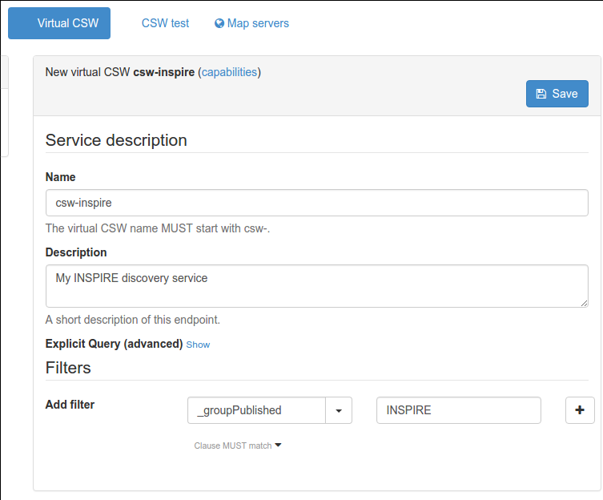

.. _inspire-configuration:

Configuring for the INSPIRE Directive
#####################################

Enabling INSPIRE
----------------

From the ``admin console`` > ``settings`` user can configure INSPIRE directive support.

When enabled, the INSPIRE support activate the following:

- Enable indexing of INSPIRE themes and annexes (`INSPIRE themes thesaurus <https://github.com/geonetwork/util-gemet/blob/master/thesauri/inspire-theme.rdf>`_ MUST be
  added to the list of thesaurus - see :ref:`managing-thesaurus`).

- CSW GetCapabilities includes the INSPIRE section (ie. ExtendedCapabilities)
  that administrator can customize in ``xml/csw/capabilities_inspire.xml``
  and response support language extensions. The language provided defines:

  - Natural language fields are returned in the language requested (see :ref:`csw-configuration`)

  - The end-points are returned for the language requested

- **INSPIRE search panel** Add INSPIRE criteria in the advanced search panel (eg. Annex, INSPIRE theme)

.. deprecated:: 3.0.0

INSPIRE validation
------------------

.. todo:: Add details about INSPIRE validation

.. todo:: Add details about IR INSPIRE guidelines

INSPIRE access point
--------------------

Most of the time, part of the metadata records contains in the catalog are
related to the Directive. In that case, it may be relevant to identify
the set of records falling in the scope of the Directive and promoting
them through a simple virtual discovery service (CSW).

First defined an encoding method to identify the records in the scope of the
directive. Well used method are:

- Create a group ``INSPIRE`` and publish those record in that group (or a category).

- Add a specific keyword in the metadata record (the main drawback here is
  that this keyword is more for managment purpose and will be exchange when the record
  is harvested).

Once all the records are classified following the selected method above,
Create a virtual CSW (eg. ``csw-inspire``) which filter automatically on those
records.

Other INSPIRE reference documents
---------------------------------

- `INSPIRE IR <http://inspire.ec.europa.eu/>`_

- `INSPIRE support in GeoNetwork (2010) <http://www.neogeo-online.net/blog/wp-content/uploads/2011/01/201012_geonetwork_inspire.pdf>`_
  provides some details on how the directive is supported and implemented.