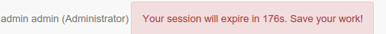
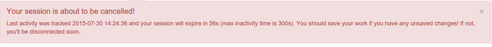
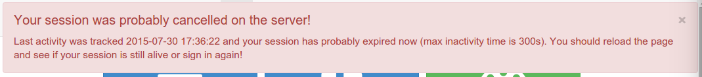

.. _managing-users-and-groups:

Managing users and groups
#########################

.. toctree::
   :maxdepth: 2

   creating-group.rst
   creating-user.rst
   user-self-registration.rst
   authentication-mode.rst

.. _user-defaults:

Default user
------------

After installation a default user with name ``admin`` and password ``admin``
is created. Use this credentials to start with. It is recommended to update
the default password after installation.

.. _user-session:

User session
------------

After identification, a user session is created. This session will be closed
automatically at some point by the server for security reasons. Default session
timeout is set to 35 min (see :ref:`session-timeout-configuration` for details).

When there is no activity in the browser and that the session is about
to expire (3 min before), a warning is displayed next to the user details:

1 min before the end of the timeout, another message is displayed:

When the session has been probably cancelled by the catalog, a message recommend
to refresh the page and sign in again if needed:

.. _user_profiles:

Users, Groups and Roles
-----------------------

The catalog uses the concept of Users, Groups and User Profiles.

- A User can be part of one or more Groups.

- A User has a Role in a Group.

- The Administrator Role is not related to a Group.

The combination of Role and Group defines what tasks the User can perform on the system or on specific metadata records.

Users can have different roles in different groups.
A role defines what tasks the user can perform.

Roles are hierarchical and based on inheritance. This means that a user with an Editor profile can create and modify new metadata records, but can also use all functions a Registered user can use.

Rights associated with the roles are illustrated in detail in the list below:

#.  **Administrator Profile**

    The Administrator has special privileges that give access to all available functions.
    
    These include:
    
    - Full rights for creating new groups and new users
    - Rights to change users/groups profiles
    - Full rights for creating/editing/deleting new/old metadata
    - Perform system administration and configuration tasks.

#.  **User Administrator Profile**

    The User Administrator is the administrator of his/her own group with the
    following privileges:
    
    - Full rights on creating new users within the own group
    - Rights to change users profiles within the own group

#.  **Content Reviewer Profile**

    The content reviewer is the only person allowed to give final clearance on    the metadata publication on the Intranet and/or on the Internet:
    
    - Rights on reviewing metadata content within the own group and authorising its publication

#.  **Editor Profile**

    The editor works on metadata with following privileges:
    
    - Full rights on creating/editing/ deleting new/old data within the own group

#.  **Registered User Profile**

    The Registered User has more access privileges than non-authenticated Guest users:
    
    - Right to download protected data

