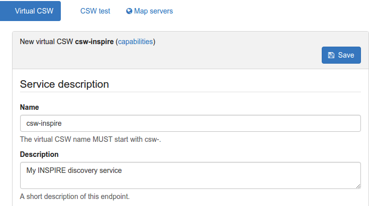

.. _tuto-download-atom:

Tutorial setting up an Atom/OpenSearch based INSPIRE download service
#####################################################################

This tutorial shows how one can set up GeoNetwork to provide download services following `technical guidelines for download services <http://inspire.ec.europa.eu/documents/technical-guidance-implementation-inspire-download-services>`_. 

Note that the technical guidelines allow both Atom/OpenSearch as well as `WFS <http://www.opengeospatial.org/standards/wfs>`_. This tutorial describes how to set up a download service using Atom/Opensearch. 

GeoNetwork
==========

GeoNetwork will soon support an internal- and external mode. 

- in internal mode GeoNetwork will generate Atom files dynamically from metadata content. 

- in external mode GeoNetwork will ingest Atom files that are linked to metadata records.

Currently only the external mode is fully supported. Atom files can be generated in any text or xml editor following the technical guidelines. 

When deploying Geonetwork, make sure the GEMET thesauri are loaded and activate the INSPIRE editor as described in `inspire configuration <http://geonetwork-opensource.org/manuals/trunk/eng/users/administrator-guide/configuring-the-catalog/inspire-configuration.html>`_. In this file "schemas/iso19139/src/main/plugin/iso19139/loc/eng/labels.xml " (and the same file in other languages in use in the catalogue) in the gmd:protocol helper (around line 2000) add the "INSPIRE-ATOM" protocol which is used to indicate links that link to an Atom file (only links having that protocol value will be ingested).

In Admin > Settings activate the INSPIRE extension and activate Atom harvesting (at certain interval). The settings page facilitates to set a protocol which is used in metadata to indicate an Atom link.

For each dataset that you are going to publish create an iso19115 record using the INSPIRE template. Link each record to the related atom file (or upload an atom file)

.. image:: img/image_7.png

Make sure the metadata contains the same gmd:code as used in the Atom file.

Now create a service metadata using the INSPIRE template and link it to the service Atom and the individual datasets (using srv:operatesOn).

Before you validate the implementation, run the Atom harvester in admin > settings manually. A panel will display the number of processed Atom feeds and any errors that may have occured while processing (more details in log file).

Validate the implementation
===========================

If you are running the above setup online, you can use the `pilot JRC INSPIRE validator <http://inspire-geoportal.ec.europa.eu/validator2/>`_. If the above setup is running locally, you can use `Esdin Test Framework <https://github.com/Geonovum/etf-test-projects-inspire>`_ to validate the INSPIRE setup.

.. image:: img/image_6.png

Running the test frequently during development helps to identify issues in an early stage.
