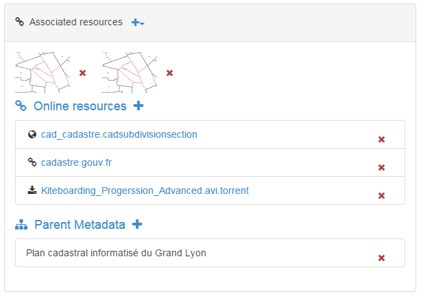
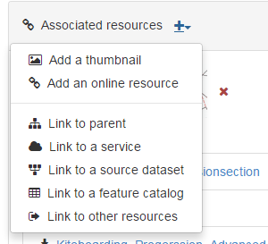

.. _associating_resources:

Associating resources
#####################

A record can be associated with different types of resources using the
associated resource panel. This section describes how it works.

In order to add or edit associated resources, open the editor.
On the top right, manage associated resources with the wizzard panel.

This wizard provides access to easily create or delete associated resources. A
list of currently attached resources grouped by types is also provided.

To add a new online resource, click on the top + caret.

Different types of resources can be associated:

.. toctree::
   :maxdepth: 2

   linking-documents.rst
   linking-records.rst
