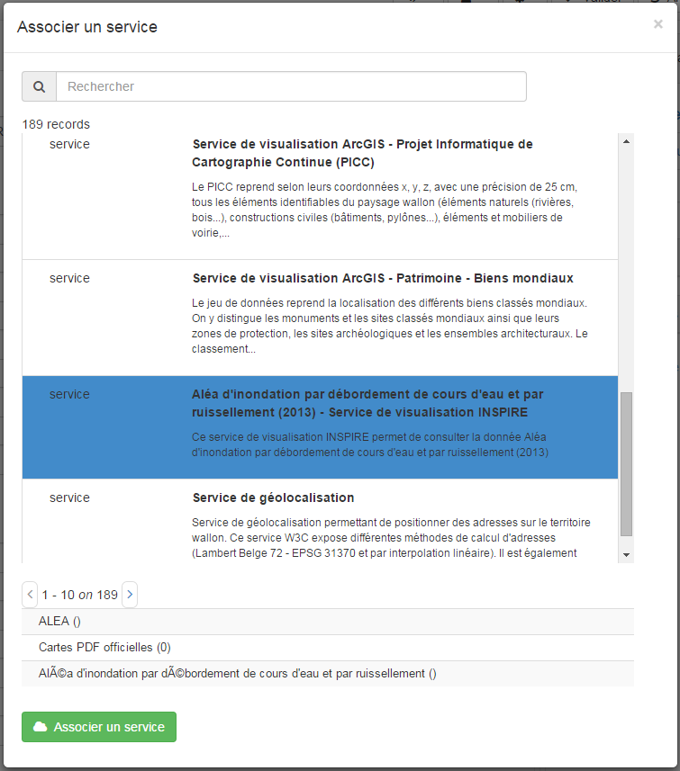

.. _linking-data:


Linking data
############

If you want to add or edit associated resources to your metadata, you should go in the editor page.
There is a wizzard panel on the top right of the editor to manage associated resources.

.. figure:: onlinesrc.png

    *Associated resources wizzard*

The wizzard gives you access to easily create or delete associated resources to your metadatas. It also gives a list, for
each kind of resources, of all the relations of your metadata.

To add a new online resource, click on the top + caret.

.. figure:: addresources.png

    *Add new associated resource dropdown*

You can add different types of online resources:

- Thumbnails
- Online Resources
- Parent metadata
- Metadata of service (if you are in a metadata of dataset)
- Metadatas of dataset (if you are in a metadata of service)
- Feature catalog
- Other kind of resources (Association type / Initiative type)

Online Resources
````````````````

A linked data is represented as an online resource in the metadata.
Here an example::

     <gmd:onLine xmlns:fra="http://www.cnig.gouv.fr/2005/fra"
                 xmlns:gmi="http://www.isotc211.org/2005/gmi">
        <gmd:CI_OnlineResource>
           <gmd:linkage>
              <gmd:URL>https://download.data.grandlyon.com/wms/grandlyon</gmd:URL>
           </gmd:linkage>
           <gmd:protocol>
              <gco:CharacterString>OGC:WMS</gco:CharacterString>
           </gmd:protocol>
           <gmd:name>
              <gco:CharacterString>cad_cadastre.cadsubdivisionsection</gco:CharacterString>
           </gmd:name>
           <gmd:description>
              <gco:CharacterString>Subdivision de section cadastrale (Plan cadastral informatisé du Grand Lyon)(OGC:WMS)</gco:CharacterString>
           </gmd:description>
        </gmd:CI_OnlineResource>
     </gmd:onLine>

To add a new one, click on the + caret button then `Add online resource` button or, if alreay one exists, just click on the title of the `Online resources section`.
The pop to create the new resource will open

.. figure:: addonlinesrc.png

    *Online resource popup*

Here you can fill the property of the online resource
- Protocol (type of resource)
- Linkage (URL of the resource)
- Name
- Description

If you want to upload a resource, you can go in upload tab and upload a document, or drag and drop it in the input.
In that case, the protocol is hidden and set to `WWW:DOWNLOAD-1.0-http--download`

.. figure:: addonlinesrcup.png

    *Upload a new online resource*

If you want to add a WMS resource, the wizzard can show you a list of layers to add after you set the protocol to `OGC:WMS*` and set your WMS service url.
You can then pick a layer in the list to add the resource to the metadata.

.. figure:: addonlinesrcwms.png

    *Add WMS online resource*

Parent Metadata
````````````````

You can link a parent metadata to yours.
The wizzard popup you provides you a simple search tool to find any other metadata in the catalog, and set it to the parent.

.. figure:: parent.png

    *Add parent metadata*

When validating, both the edited metadata and the parent one content will be changed, containing their each binding.

Metadata of service
```````````````````

You can link a metadata of service to your dataset metadata.
The wizzard popup you provides you a simple search tool, filterd on service type, to find any metadata of service in your catalog.
You can then choose one and validate your choice to create the binding. Note that you can have an overview of the layers of the service
(list got from a getCapabilities request).



    *Link to a metadata of service*

When validating, both the edited metadata and the metadata of service one content will be changed, containing their each binding.

Metadatas of dataset
````````````````````

You can link one metadata of dataset in your metadata of service.
The wizzard popup you provides you a simple search tool, filterd on dataset type, to find any metadata of dataset in your catalog.
You can then choose one result and validate your choice to create the bindings.

.. figure:: dataset.png

    *Link to metadatas of dataset*

When validating, both the service and all dataset will have content updated.

Feature Catalog
```````````````````

You can link a feature catalog to your dataset metadata.
A feature catalog represent the attributes of your geospatial data.
The wizzard popup you provides you a simple search tool, filterd on feature catalog type.
You can then choose one and validate your choice to create the binding.

.. figure:: feature.png

    *Link to a feature catalog*
