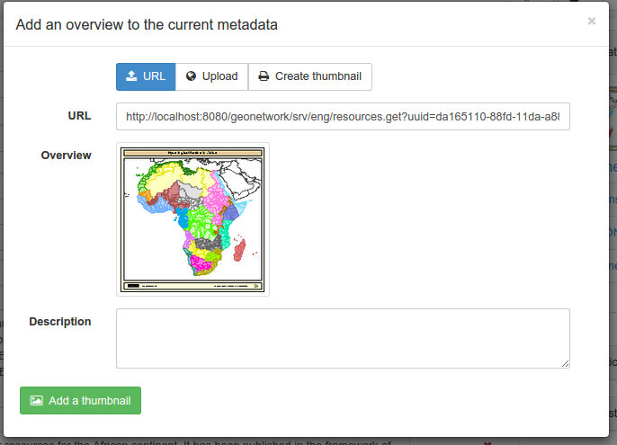
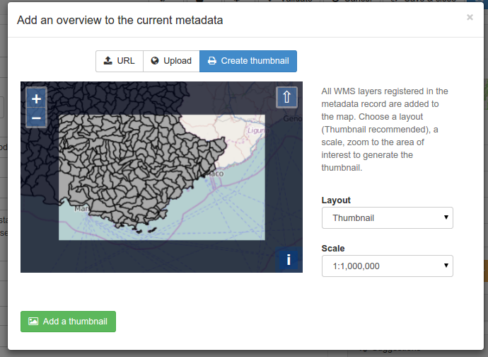

.. _linking-thumbnail:

Illustrating with an overview
#############################

To help the user identify a metadata record of interest, you can create a
graphic overview (or thumbnail) in the form of an image and attach it to the
metadata record. For example, if your metadata record describes some geographic
dataset then the graphic overview could be an image of the map with legend
produced by an OGC Web Map Service.

You can associate one or more thumbnails with a record.

Thumbnails are displayed in search results and metadata view:

.. figure:: img/thumb-in-search-results.png

From the ``Associated resources`` panel, click on the ``Add a thumbnail`` button
to open the ``Add an overview to the current metadata`` wizard. Thumbnails can be added
using 3 approaches:

Linking a thumbnail with a URL
------------------------------

When the thumbnail is available as an image on the web, it could be directly linked
to the metadata record. Add an optional description to describe the image:

You can link as many images as you want. Images associated in this mode, should
be publicly accessible on the web if you want the thumbnails to be displayed properly
even if that metadata record get harvested by other catalogs.

Uploading a thumbnail
---------------------

Only 2 thumbnails can be attached to a record and uploaded to the catalog.
Optionnaly a small thumbnail can be created automatically when uploading a large image.

The following image formats are supported:

 - GIF,
 - PNG
 - JPEG

Choose a file on your computer or drag&drop a file on the popup.
Click ``Add a thumbnail`` to trigger the upload.

Generating a thumbnail using WMS layers
---------------------------------------

If you have registered a WMS layer in the current metadata record (see :ref:`linking-wms-layer`),
a thumbnail can be generated using it on top of the base layer map.
Choose the ``Create thumbnail`` tab and choose the area to be print on the
thumbnail.

