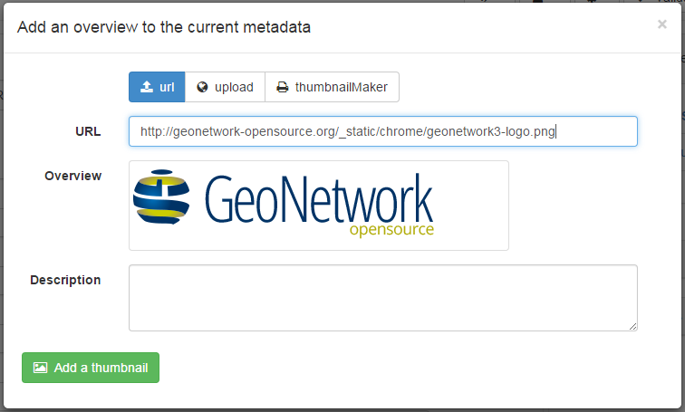
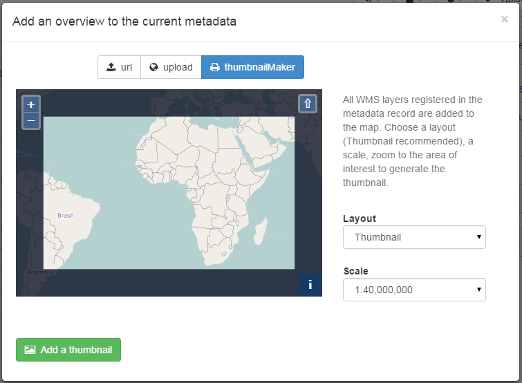

.. _linking-thumbnail:

Adding overview
###############

To help the user identify a metadata record of interest, you can create a graphic overview (or thumbnail) in the form of an image and attach it to the metadata record. For example, if your metadata record describes some geographic dataset then the the graphic overview could be an image of the map with legend produced by an OGC Web Map Service.

You can associate two thumbnails with a record: a small thumbnail, which will be displayed in search results and a large thumbnail with more details in case the user is interested in more information. The large thumbnail will be displayed when the user clicks on the small thumbnail.

To create a thumbnail, go to the editing menu. If you are no longer in editing mode, retrieve the metadata record using one of the search options then click on Edit. Then follow these simple steps:

From the editing menu, click on the Thumbnails button on the top or bottom of the page.

- You will be taken to the Thumbnail Management wizard.

    *Add a thumbnail*

- To create a small or large thumbnail, click on the Browse button next to either one. It is recommended that you use 180 pixels for small thumbnails and 800x600 for large thumbnails. Using the ``Large thumbnail`` option allows you to create both a small and large thumbnail in one go.

- You can use GIF, PNG and JPEG images as input for the thumbnails.

- A pop up window will appear allowing you to browse your files on your computer. Select the file you wish to create a thumbnail with by double-clicking on it.

- Click on ``Add``.

- Your thumbnail will be added and displayed on the following page.

- You can then click on Back to Editing and save your record.

If you have a WMS online resource in your metadata, the thumbnail can be generated automatically. You need to go in ``thumbnail maker`` tab and chose the extent of the layer you want to show in the image.
The generation of the images is based on mapfishprint.

    *Generate thumbnail from WMS resource*

