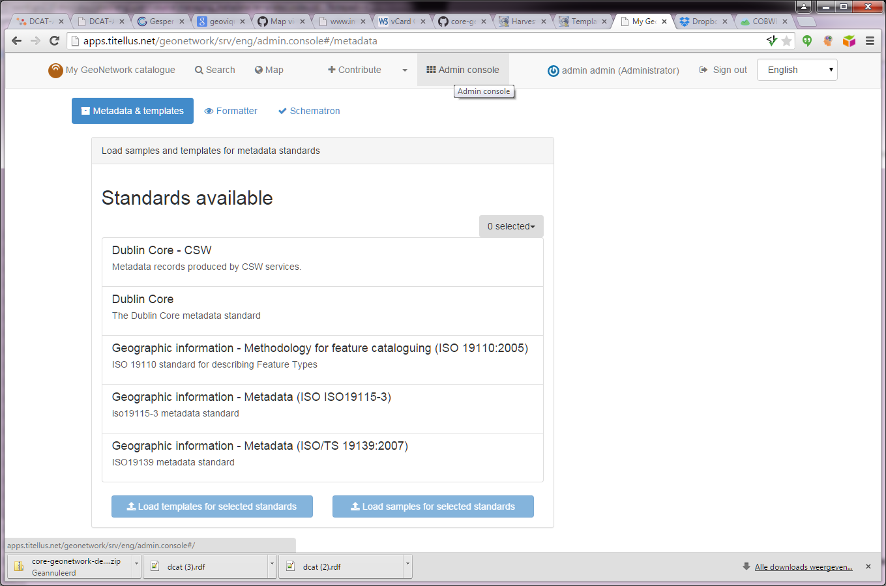

.. _creating-templates:

Creating templates
##################

The *Metadata and Templates* options in the Administration page allows you to manage the metadata templates in the catalog. 
You have to be logged in as an administrator to access this page and function. 

Import templates
----------------

The option allows the user to select the default metadata templates from a schema and add them to the catalogue.

Select the metadata schemas to add templates from (multiple selections can be made) and click on the  *Add templates* button to import them into the catalogue. They will then be available for creating new metadata records.

Creating and managing templates
-------------------------------

Templates are managed similarly in the catalog as metadata records, but they have a special 'template'-tag. They can be created, updated and removed in the 'contribute' section. Metadata records can be converted to templates and vice versa at any time. Templates can be assigned to limited groups, so only these groups can use the template in their work process.