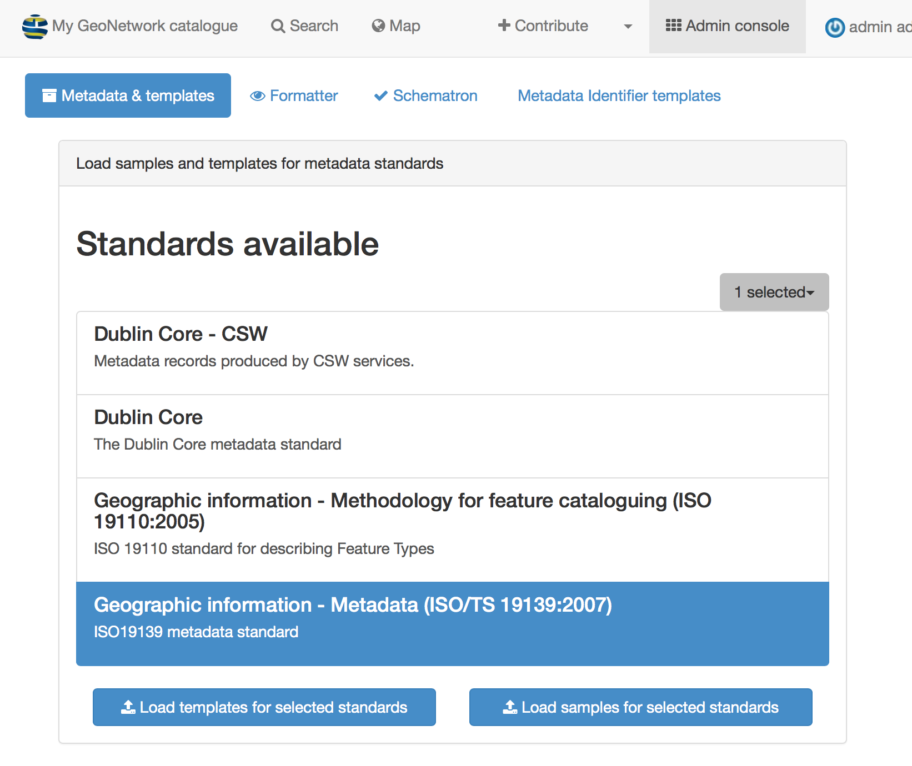

.. _quick_start:

Quick start
###########

GeoNetwork is a catalog application to manage spatially referenced resources.
It provides powerful metadata editing and search functions as well as
an interactive web map viewer. It is currently used in numerous
Spatial Data Infrastructure initiatives across the world.

Apart from how to start the catalog, this Quick Start describes:

* some of the different ways you can search for spatial data
* how to download and display data from the search results

Starting the catalog
--------------------

After going through the installer steps, simply go to bin folder and click
on start.bat (on windows) or startup.sh (on linux).

Open a web browser and go to the GeoNetwork homepage. If you installed it on your computer, this is probably at ``http://localhost:8080/geonetwork``. 

When you use Docker, you can find our what IP and Port to connect to from the Kitematic application. Or run ``docker ps`` in a terminal (on Linux or OSX). This should give you the port the Docker is running on.

.. figure:: ../../maintainer-guide/installing/img/docker.png

Your opening screen should look like this:

.. figure:: ../../maintainer-guide/installing/img/home-page.png

Signing in and load templates
-----------------------------

Click the ``sign in`` to connect as administrator. The default account is
username ``admin`` with password ``admin``.

.. figure:: ../../maintainer-guide/installing/img/signin.png

Once connected, the top toolbar should provide a link to the ``admin console``
and your login details.

.. figure:: ../../maintainer-guide/installing/img/identified-user.png

Go to the ``admin console`` and click on ``metadata and templates``:

.. figure:: ../../maintainer-guide/installing/img/metadata-and-templates.png

Choose all standards and click ``load samples`` and then ``load templates`` in
order to load examples:

Go back to the search page to see examples:

.. figure:: ../../maintainer-guide/installing/img/once-samples-are-loaded.png

Searching information
---------------------

The search form provides different ways for search:

* a full text search box providing suggestions

.. figure:: img/full-text.png

* facets which defines groups that you can easily click on to browse the content of the catalog

.. figure:: img/facets.png

* spatial filtering to choose information in specific areas

.. figure:: img/spatial-filter.png

* advanced search

.. figure:: img/advanced.png

Discovering information
-----------------------

Search results present main information about each resources: title, abstract,
categories, status, overview and links.

.. figure:: img/a-result.png

Clicking the record will provide more in depth details about the resources:

* Download and links
* About the resource
* Technical information
* Metadata details

.. figure:: img/a-record.png

To get more information, switch the advanced view mode.
To update the record, click the edit button.

From the results or the record view, you can easily add WMS layers referenced in
a metadata record on the map. With the map, you can visualize your data, choose
your background maps, query objects, display on a 3D globe and more ...

.. figure:: img/map-africa-basin.png

For more information
--------------------

Continue reading the documentation.