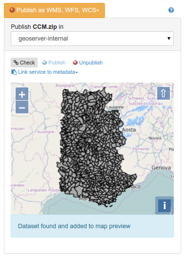

.. _geopublication-usage:

Publishing GIS data in a map server
###################################

To publish data from the metadata editor in a remote map server, first the catalog
administrator needs to configure connection to map servers in the administration
interface (see :ref:`map-server-configuration`).

Once done, editors have to reference GIS files or spatial database tables in the
metadata record (see :ref:`linking-online-resources-georesource`).

When a spatial resource is detected and one or more map servers are configured, the geopublication
wizard is available in the metadata editor.

.. figure:: img/geopublication-wizard.png

Choose a resource from the list to display the wizard.

The wizard display the list of map servers available:

.. figure:: img/geopublication-wizard-serverlist.png

Choose the server you want to publish the data in. When selected, the catalog
will check if the dataset is already published or not. If found, it will be
added to the map, if not, the status message indicates that the dataset is not
available.

.. figure:: img/geopublication-wizard-notavailable.png

Click the ``check`` button to verify that the dataset is already published in the selected map server.

Click the ``publish`` button to register the data on the selected map server.

Click the ``unpublish`` button to unregister the data on the selected map server.

Click the ``link service to metadata`` button to add links to the OGC service
in the current metadata record for the published layer.

