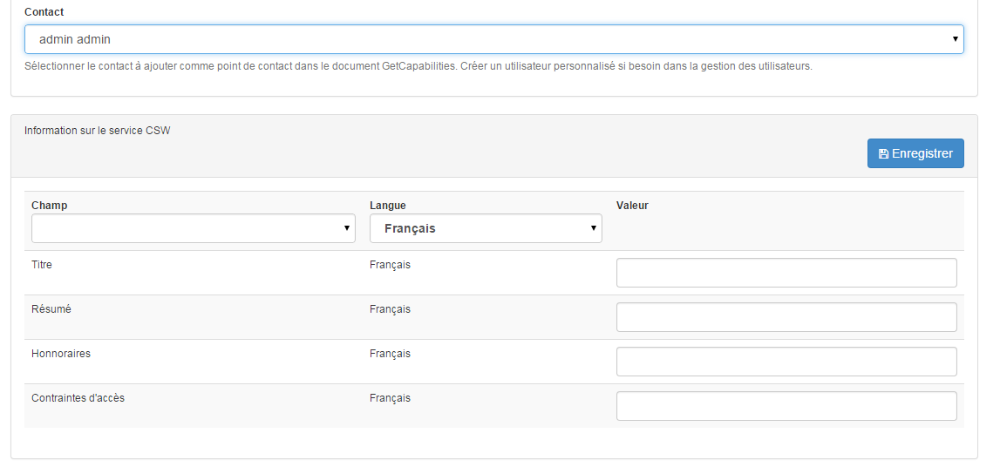

.. _inspire-configuration:

Configurer pour la directive INSPIRE
####################################

La configuration d'un service CSW conforme INSPIRE se réalise au niveau de la 
section "Administration > Paramètres > CSW" comme vu précédemment (voir 
`Configurer le CSW <./csw-configuration.html>`_). Sur base du formaulaire de 
paramétrisation du CSW du catalogue, il est impératif que le gestionnaire 
remplisse les champs suivants:

- Contact - Sélectionner que la personne de contact souhaiter. Vérifier au 
  préalable que l'ensemble des coordonnées de ce point de contact ont été 
  complétées afin de se conformer à la directive INSPIRE pour le CSW.
- Information sur le service - Compléter l'ensemble des champs (titre, résumé, 
  honoraires, contraintes d'accès) et ce pour l'ensemble des langues référencées
  au niveau du catalogue pour INSPIRE.

.. warning::
  Les langues prises en charge par le catalogue dans le cadre de la directive 
  INSPIRE peuvent être définies au préalable. Pour ce faire, il fait modifier 
  les paramètres des langues au niveau de la base de données du catalogue.
  
  Exemple d'une requête SQL afin de ne pas prendre en compte une langue (ici 
  l'espagnol) dans le cadre de INSPIRE:

  ::

  	UPDATE languages SET ISINSPIRE='n' WHERE id='es';

Si ces diiférents champs ne somt pas présents et complets, le CSW ne sera pas 
entièrement conforme à INSPIRE 
(`Validateur INSPIRE <http://inspire-geoportal.ec.europa.eu/validator2/>`_).