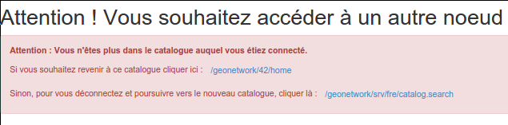

.. _using-multinode-mode:

Utiliser le mode multi-nœuds
############################

Aperçu
======

Le mode multinode permet de configurer plusieurs catalogues avec une seule
application web. Par défaut, un seul nœud est disponible.
Ce nœud est nommé "srv". Chaque nœud a des ressources spécifiques :

* répertoire des données (index, fichiers)
* base de données

Le répertoire des données principales contient alors un répertoire
``data`` par nœud.

Ce mode permet de simplifier la maintenant d'un ensemble de catalogue. Il
permet également d'économiser des ressources, les nœuds partageant certains
modules de l'application (eg. les schémas, les thésaurus.

Un utilisateur ne peut se connecter qu'à un seul nœud au sein d'un même
navigateur (une seule session étant autorisée). Une fois identifié,
si l'utilisateur essaye de se connecter à un autre nœud
, le catalogue propose :

* de se déconnecter et poursuivre vers le nœud demandé
* de retourner dans le nœud où l'utilisateur est connecté

Des installations ont été mise en place avec des configurations
jusqu'à 200 nœuds par serveur. De tel configuration nécessite d'augmenter
la configuration mémoire de la JVM (~4Go pour le paramètre Xmx).

Configuration
=============

Ajouter un nœud manuellement
----------------------------

Pour ajouter un nouveau nœud, 2 étapes sont nécessaires. Tout d'abord
déclarer le nouveau nœud dans le fichier |web.xml| afin de déclarer l'URL :

.. code-block:: xml

      <servlet-mapping>
        <servlet-name>spring</servlet-name>
        <url-pattern>/geosource-8/*</url-pattern>
      </servlet-mapping>

Ensuite, définir la configuration du nœud dans ``config-node/{{node_id}}.xml``.
La configuration définit :

* l'identifiant du nœud (l'identifiant doit être unique et un seul
  nœud par défaut est autorisé)
* la connexion à la base de données

Par exemple, pour configurer un nœud nommé ``geosource-8`` utilisant une base
de données ``postgres`` utiliser :

.. code-block:: xml

    <?xml version="1.0" encoding="UTF-8"?>
    <beans default-lazy-init="true"
      xmlns="http://www.springframework.org/schema/beans"
      xmlns:xsi="http://www.w3.org/2001/XMLSchema-instance"
      xmlns:context="http://www.springframework.org/schema/context">

        <import resource="classpath*:/config-spring-geonetwork.xml"/>
        <import resource="../config-db/database_migration.xml"/>

        <context:property-override properties-ref="geosource-8-configuration-overrides" />

        <bean id="nodeInfo" class="org.fao.geonet.NodeInfo">
            <property name="id" value="geosource-8" />
            <property name="defaultNode" value="false" />
        </bean>

        <bean id="geosource-8-configuration-overrides"
            class="org.springframework.beans.factory.config.PropertiesFactoryBean">
            <property name="properties">
                <props>
                    <prop key="jdbcDataSource.username">www-data</prop>
                    <prop key="jdbcDataSource.password">www-data</prop>
                    <prop key="jdbcDataSource.maxActive">2</prop>
                    <prop key="jdbcDataSource.maxIdle">2</prop>
                    <prop key="jdbcDataSource.initialSize">2</prop>
                    <prop key="jdbcDataSource.Url">jdbc:postgresql://localhost:5432/db_8</prop>
                </props>
            </property>
        </bean>

        <import resource="../config-db/postgres.xml"/>
    </beans>

Personnaliser l'interface du nœud
----------------------------------

Le nœud peut surcharger le style CSS par défaut en ajoutant un fichier
.css dans le répertoire ``catalog/style``.

Créer un nœud avec le script de gestion
----------------------------------------

Dans le répertoire ``WEB-INF/node-utils``, le script ``node-mgr.sh``
aide à l'ajout de nouveau nœud eg. pour ajouter un nœud avec pour identifiant
``geosource-1044`` se connectant à la une base de données ``db_1044``
de type ``postgres`` avec un pool de connexion ayant ``2`` connexions, utiliser :

.. code-block:: shell

    ./node-mgr.sh www-data www-data \
                  geosource-1044 \
                  jdbc:postgresql://localhost:5432/db_1044 \
                  postgres 2