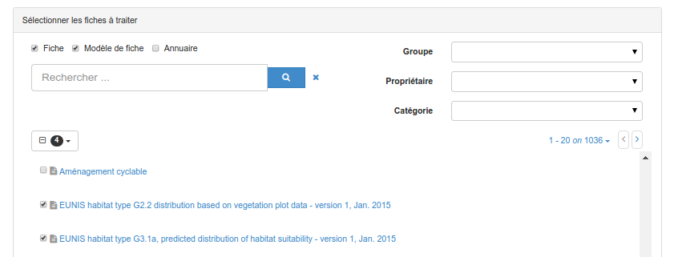
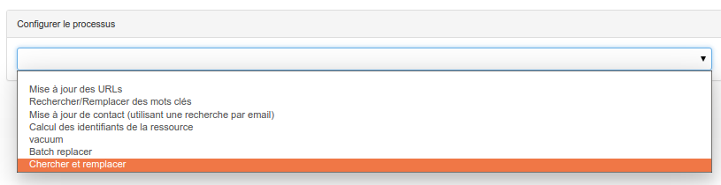
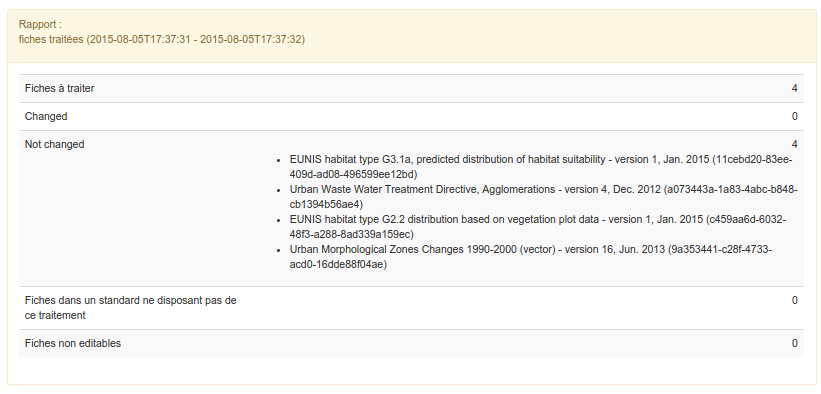
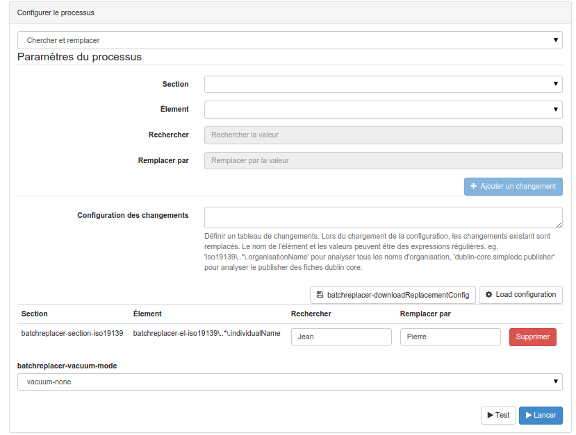

.. _batchupdate_from_admin:

Mise à jour à partir de la console d'admin
##########################################

Dans certains cas, il est pratique de modifier un ensemble de fiche à l'aide d'un
processus de mise à jour au lieu de mettre à jour les fiches une par une. Un
administrateur peut à partir du menu ``Console d'admin``, ouvrir le menu ``Outils``,
puis ``Processus en batch``.
À partir de cette page, l'utilisateur peut :

* Sélectionner un ensemble de fiche en faisant des recherches et sélectionnant les
  fiches à modifier

* Choisir un processus dans la liste

.. seealso::

   De nouveaux processus peuvent être ajoutés. Cf. :ref:`batch-process-add`.

* Définir les paramètres du processus (s'il y en a)

* Lancer le processus et visualiser les résultats.

Un processus ne peut être appliqué qu'aux fiches que l'utilisateur peut éditer.
S'il ne peut pas, le processus ignore la fiche et passe à la suivante. Le rapport
contient les informations suivantes :

* Nombre de fiches à traiter

* Nombre de fiches modifiées

* Nombre de fiches non modifiées (pour les processus de type chercher/remplacer)

* Nombre de fiches pour lesquelles le processus n'a pas été trouvé (En effet
  les processus dépendent du standard de la fiche. Il peut arriver qu'un processus
  ne traite que des fiches ISO19139 et non Dublin Core).

* Nombre de fiches non éditables

Avant de lancer un processus, il est recommandé de faire une sauvegarde des fiches
à traiter au cas où il y ait un problème lors du traitement.

.. todo:: Documenter les autres processus

Chercher et remplacer
---------------------

Ce processus cherche des valeurs dans certains éléments et les remplaces. Il peut
être appliqué à des fiches ISO19139 ou Dublin Core. La configuration est la suivante :

* Choisir un standard (ISO19139 ou Dublin Core)

* Choisir un élément dans lequel chercher (La liste propose un ensemble de champs
  pré-configurés qui peuvent être étendue - cf. ci-dessous)

* Définir la valeur à chercher

* Définir la valeur de remplacement

* Cliquer sur ``Ajouter un changement``

Plusieurs rmeplacements peuvent être configurés et ajoutés. Une fois la configuration faite,
l'utilisateur peut sauver la configuration en cliquant sur ``Télécharger la configuration``.
La configuration récupérée au format JSON peut être modifiée puis rechargée ultérieurement
en faisant un copier/coller dans la zone de texte puis en cliquant sur ``Charger la configuration``.

Exemple de configuration:

.. code-block:: json

  [{
    "package":"iso19139",
    "element":"iso19139\\..*\\.individualName",
    "searchval":"John",
    "replaceval":"Pierre"
    }]

Dans la configuration, l'élement ``element`` définit l'élément cible dans la fiche.
Il commence par l'identifiant du schéma puis précise un chemin vers le ou les élements cibles.
Ce paramètre est une `expression régulière <http://www.regular-expressions.info/tutorial.html>`_
et peut donc utiliser ``.*`` comme caractère joker.
Pour cibler un élement de manière plus précise, il est possible de définir le chemin précis. Par exemple
``iso19139\\.contact\\.individualName`` pour cibler le nom du point de contact de la fiche.

Le paramètre ``searchval`` est également une `expression régulière <http://www.regular-expressions.info/tutorial.html>`_.
Ce peut être une simple valeur text ou une expression plus complexe. Par exemple,
rechercher ``(.*)`` (les parenthèses sont ici utilisé pour intercepter un groupe)
et remplacer par ``Mr $1`` modifiera ``Jean`` par ``Mr Jean``.

Le dernier paramètre permet de préciser que faire des éléments vides dans la fiche :

.. figure:: img/batch-search-and-replace-vacuum.png

Une fois configurer, il est possible de tester avec le bouton ``Test``
le processus pour prévisualiser les changements.

Puis d'appliquer les changements avec le bouton ``Lancer``.

