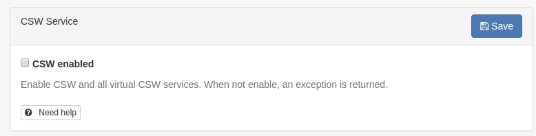

.. _csw-configuration:

Configuring CSW
###############

To get to the CSW server configuration, you must be logged on as administrator first. Open 'Settings' from the Administration page and select CSW Server configuration.

By default CSW endpoint is enabled, but it can be disabled.

The Open Geospatial Catalogue Service for the Web (OGC-CSW) service,
is a self-describing service that allows query, update and insertion of metadata records.

.. figure:: img/csw.png

The service can be asked to provide a description of itself, the human who administers it and other information through a GetCapabilities request (eg. http://localhost:8080/geonetwork/srv/en/csw?request=GetCapabilities&service=CSW&version=2.0.2). This form allows you to configure the CSW server and fill out some of the properties returned in response to a GetCapabilities request.

The capabilities document is created from this template :code:`web/src/main/webapp/xml/csw/capabilities.xml`.

.. _csw-configuration_inspire:

In order to create a custom capabilities, it is recommended to create a dedicated service metadata record (using ISO19115-3 or ISO19139 standards) and use this record to build the capabilities document from.

When creating such record, the following information will be used to create the capabilities:

* title

* abstract

* keywords

* fees (from Distribution > ordering instructions field)

* Access constraints (from Access constraints > Other constraints field)

* Contact (from Identification > First point of contact)

The record MUST be public.

If your catalogue also focus on INSPIRE (see :ref:`inspire-configuration`), it may be relevant to also populate the following to properly configure your discovery service:

* metadata language (+ additional languages if any) (use for SupportedLanguages, DefaultLanguage)

* INSPIRE themes

* temporal coverage

* metadata contact

* metadata conformity regarding Commission regulation 1089/2010

With those information the CSW can be validated using the INSPIRE validator.

If an error occurred while building the capabilities document from the service record, a WARNING is reported using a comment and the default capabilities is used:

.. figure:: img/csw-error.png

Other configuration options:

* *Inserted metadata is public*: By default, metadata inserted with the CSW Harvest and CSW Transaction operations is not publicly viewable. A user with the appropriate access rights could do this after the CSW Harvest and CSW Transaction operations, but this is not always convenient. If this option is checked all metatada inserted using the CSW Harvest and CSW Transaction operations will be publicly viewable.

* *Create element if it does not exist when using XPath in CSW transaction.*: If not checked, only existing elements can be updated.

