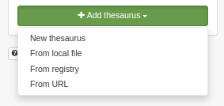

.. _inspire-configuration:

Configuring for the INSPIRE Directive
#####################################

Enabling INSPIRE
----------------

From the ``admin console`` > ``settings`` user can configure INSPIRE directive support.

When enabled, the INSPIRE support activate the following:

- Enable indexing of INSPIRE themes and annexes (INSPIRE themes thesaurus MUST be
  added to the list of thesaurus from the INSPIRE Registry - see :ref:`managing-thesaurus`).

- CSW GetCapabilities includes the INSPIRE section (ie. ExtendedCapabilities)
  that administrator can customize in ``xml/csw/capabilities_inspire.xml``
  and response support language extensions. The language provided defines:

  - Natural language fields are returned in the language requested (see :ref:`csw-configuration`)

  - The end-points are returned for the language requested

.. image:: img/inspire-configuration.png

Loading INSPIRE codelists
-------------------------

For metadata describing INSPIRE dataset and series, it is recommended to load the following codelist from the `INSPIRE Registry<http://inspire.ec.europa.eu/registry/>`_:

* `INSPIRE Theme <http://inspire.ec.europa.eu/theme>`_
* Metadata codelist register > `Spatial scope <http://inspire.ec.europa.eu/metadata-codelist/SpatialScope>`_
* Metadata codelist register > `INSPIRE priority data set <http://inspire.ec.europa.eu/metadata-codelist/PriorityDataset>`_

From ``admin console`` > ``classification systems``, user can load thesaurus from the registry:

Click ``Use INSPIRE registry`` to use the default INSPIRE registry but any Registry software application can be used.

.. image:: img/inspire-from-registry-config.png

Select one or more languages depending on your needs.

Choose a registry class and an optional collection depending on the class.
By default the type of thesaurus will be ``theme`` but you can adapt it if needed.

On ``upload`` the catalogue will contact the registry, download the files for each languages and combined them in a thesaurus in SKOS format supported by the catalogue.

User can also use the well known `GEMET thesaurus <https://www.eionet.europa.eu/gemet/en/themes/>`_. Some SKOS format version of the thesaurus are available `here <https://github.com/geonetwork/util-gemet/tree/master/thesauri>`_.

Once loaded, the thesaurus can be used in metadata records:

.. image:: img/inspire-keyword-editing.png

The type of encoding of keywords can be defined using the gear icon (See validation section for more information):

.. image:: img/inspire-keyword-encoding-type.png

INSPIRE validation
------------------

Since September 2019, INSPIRE validation is available from `the INSPIRE Validator <http://inspire.ec.europa.eu/validator/about/>`_. It is using `ETF which is an open source testing framework for spatial data and services <https://github.com/etf-validator/etf-webapp>`_. To configure the validator, go to ``admin console`` > ``settings`` and set the URL of the validator. The default one is ``http://inspire.ec.europa.eu/validator/``.

.. image:: img/inspire-configuration.png

Once enabled, the editor will show the option in the validation menu:

Validate option will use the internal validation system (ie. XSD, Schematron rules for ISO, INSPIRE, ... depending on the configuration) . In the internal system the INSPIRE validation is based on INSPIRE Technical guidance version 1.3 and results may be different from ETF reports.

To trigger the "official" INSPIRE validation, choose one of the option depending on the level of validation and type of resource to validate. This list can be customized in `this configuration file <https://github.com/geonetwork/core-geonetwork/blob/master/services/src/main/resources/config-spring-geonetwork.xml#L61-L94>`_. The configuration is made by selecting one or more test suite from the ETF options:

.. image:: img/inspire-etf-test-configuration.png

During the validation, the record is sent to the ETF API and processed. Once ETF completed the validation, the catalogue display a link to the validation report.

.. image:: img/inspire-validation-report.png

Note, that if you are validating a private record, that record will be pushed to the validator. To secure the process an option can be to setup a local (private) installation of the validator.

INSPIRE access point
--------------------

Most of the time, part of the metadata records contains in the catalog are
related to the Directive. In that case, it may be relevant to identify
the set of records falling in the scope of the Directive and promoting
them through a portal which will provide a simple discovery service (CSW) focusing on those records.

First defined an encoding method to identify the records in the scope of the
directive. Well used method are:

- Create a group ``INSPIRE`` and publish those record in that group (or a category).

- Add a specific keyword in the metadata record (the main drawback here is
  that this keyword is more for managment purpose and will be exchange when the record
  is harvested).

From the ``admin console`` > ``settings`` > ``sources``,  user can add portal.
Create a portal ``inspire`` and set the filter to select only records related to INSPIRE (eg. ``+_groupPublished:INSPIRE`` to select all records published in group INSPIRE).

.. image:: img/inspire-portal.png

Once saved, the portal is accessible at http://localhost:8080/geonetwork/inspire and the CSW service at
http://localhost:8080/geonetwork/inspire/eng/csw.

Other INSPIRE reference documents
---------------------------------

- `INSPIRE IR <http://inspire.ec.europa.eu/>`_

- `INSPIRE validator <http://inspire.ec.europa.eu/validator/>`_

- `INSPIRE support in GeoNetwork (2010) <http://www.neogeo-online.net/blog/wp-content/uploads/2011/01/201012_geonetwork_inspire.pdf>`_
  provides some details on how the directive is supported and implemented.
