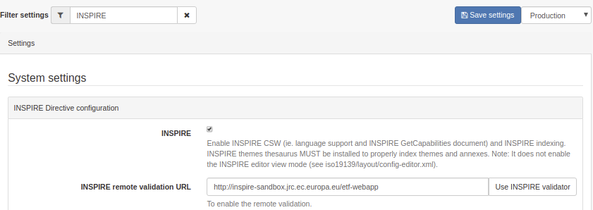
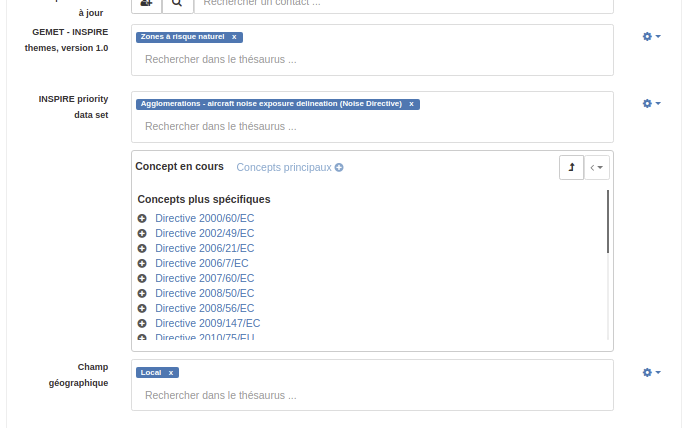
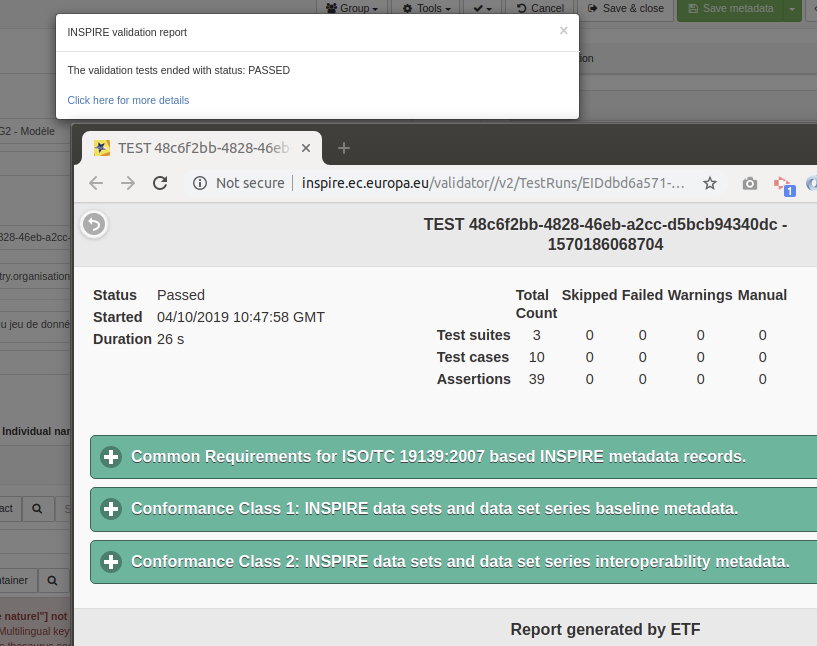

.. _inspire-configuration:

Configuring for the INSPIRE Directive
#####################################

Enabling INSPIRE
----------------

From the ``admin console`` > ``settings`` user can configure INSPIRE directive support.

When enabled, the INSPIRE support activate the following:

- Enable indexing of INSPIRE themes and annexes (INSPIRE themes thesaurus MUST be
  added to the list of thesaurus from the INSPIRE Registry - see :ref:`managing-thesaurus`).

To configure the discovery service, a dedicated service metadata record MUST be created in order to provide a complete GetCapabilities document (:ref:`csw-configuration_inspire`).

.. _loading-inspire-codelists:

Loading INSPIRE codelists
-------------------------

To describe INSPIRE datasets and series, it is recommended to load relevant codelists from the `INSPIRE Registry <http://inspire.ec.europa.eu/registry/>`_,
the following codelists are relevant in the scope of metadata guidelines v2.0:

* `INSPIRE Theme <https://inspire.ec.europa.eu/theme>`_
* `Application schema <https://inspire.ec.europa.eu/applicationschema>`_
* `Media types <https://inspire.ec.europa.eu/media-types>`_
* Metadata codelist register > `Protocols <https://inspire.ec.europa.eu/metadata-codelist/ProtocolValue>`_
* Metadata codelist register > `Spatial scope <https://inspire.ec.europa.eu/metadata-codelist/SpatialScope>`_
* Metadata codelist register > `INSPIRE priority data set <https://inspire.ec.europa.eu/metadata-codelist/PriorityDataset>`_
* Metadata codelist register > `Spatial Data Service Category <https://inspire.ec.europa.eu/metadata-codelist/SpatialDataServiceCategory>`_
* Metadata codelist register > `Conditions applying to Access and Use <https://inspire.ec.europa.eu/metadata-codelist/ConditionsApplyingToAccessAndUse>`_
* Metadata codelist register > `Limitations on Public Access <https://inspire.ec.europa.eu/metadata-codelist/LimitationsOnPublicAccess>`_
* Metadata codelist register > `OnLine Description Code <https://inspire.ec.europa.eu/metadata-codelist/OnLineDescriptionCode>`_
* Metadata codelist register > `Quality of Service Criteria <https://inspire.ec.europa.eu/metadata-codelist/QualityOfServiceCriteria>`_

From ``admin console`` > ``classification systems`` > ``Thesaurus``, administrators can manage thesauri. One of the options is to load a thesaurus straight from the registry.

.. image:: img/inspire-from-registry.png

Click ``Use INSPIRE registry`` to use the default INSPIRE registry but any instance of the `Registry software <https://joinup.ec.europa.eu/solution/re3gistry>`_ can be used.

.. image:: img/inspire-from-registry-config.png

Select one or more languages depending on your needs. Choose a category or directly a thesaurus, depending on the thesurus.
By default the type of thesaurus will be ``theme`` but you can adapt it if needed.

By clicking the ``upload`` button the catalogue will contact the registry, download the files for each languages and combined them in a thesaurus in SKOS format supported by the catalogue.

User can also use the well known `GEMET thesaurus <https://www.eionet.europa.eu/gemet/en/themes/>`_. Some SKOS format version of the thesaurus are available `here <https://github.com/geonetwork/util-gemet/tree/master/thesauri>`_.

Once loaded, a thesaurus can be used in metadata records to select keywords from:

The type of encoding of keywords can be defined using the gear icon (See validation section for more information):

.. image:: img/inspire-keyword-encoding-type.png

Via the schema plugin form configuration it is an option to configure a thesaurus to be used for a specific `Anchor` element.
The thesaures concepts are used to populate an auto complete text field for that element.

.. _inspire-validation:

INSPIRE validation
------------------

INSPIRE validation of metadata records is available at `the INSPIRE Validator <https://inspire.ec.europa.eu/validator/about/>`_.
It is using `ETF which is an open source testing framework for spatial data and services <https://github.com/etf-validator/etf-webapp>`_.
GeoNetwork is able to `remote validate` any record using a service provided by an instance of ETF.
To configure remote validation, go to ``admin console`` > ``settings`` and set the URL of the validator. The url of the main INSPIRE validator is ``http://inspire.ec.europa.eu/validator/``.

Once enabled, the editor will show the remote validation option in the menu:

.. image:: img/inspire-validation-menu.png

The standard validate option will use the internal validation system (ie. XSD, Schematron rules for ISO, INSPIRE, ... depending on the configuration). In the internal system the INSPIRE validation is based on INSPIRE Technical guidance version 1.3 and results will be different from ETF reports.

The remote INSPIRE validation will open the validator in a popup. Choose one of the options depending on the level of validation and type of resource to validate. The list of options can be customized in `this configuration file <https://github.com/geonetwork/core-geonetwork/blob/master/services/src/main/resources/config-spring-geonetwork.xml#L61-L94>`_. The configuration is made by selecting one or more test suite from the ETF options:

.. image:: img/inspire-etf-test-configuration.png

During the validation, the record is sent to the ETF service and processed. Once ETF completes the validation, the catalogue will display a link to the validation report.

Note, that if you are validating a private record, that record will be pushed to the validator. To secure this process we recommend to set up a local (private) installation of the validator.

.. _inspire-access-point:

INSPIRE access point
--------------------

In many cases only a part of the metadata records in a catalog are
related to the INSPIRE Directive. In that case, it may be relevant to filter
the set of records falling in the scope of the Directive and promote
them through a sub portal. In this way a European portal can easily harvest the records related to INSPIRE.

First define a filtering mechanism to identify the records in the scope of the directive. Frequently used method are:

- Create a group ``INSPIRE`` and publish those record in that group (or a category).

- Add a specific keyword in the metadata record.

- Filter based on the conformance quality report having a reference to the EU directive.

From the ``admin console`` > ``settings`` > ``sources``,  an administrator can create a sub portal.
Create a portal ``inspire`` and set the filter to select only records related to INSPIRE (eg. ``+_groupPublished:INSPIRE`` to select all records published in group INSPIRE).

.. image:: img/inspire-portal.png

Once saved, the portal is accessible at http://localhost:8080/geonetwork/inspire and the CSW service at
http://localhost:8080/geonetwork/inspire/eng/csw.

.. _inspire-reference-documents:

INSPIRE reference documents
---------------------------------

- `INSPIRE IR <https://inspire.ec.europa.eu/>`_

- `INSPIRE Technical Guidelines Metadata v2.0.1 <https://inspire.ec.europa.eu/sites/default/files/documents/metadata/inspire-tg-metadata-iso19139-2.0.1.pdf>`_

- `INSPIRE validator <https://inspire.ec.europa.eu/validator/>`_

- `GeoNetwork at the INSPIRE forum <https://inspire.ec.europa.eu/forum/search?q=geonetwork>`_
