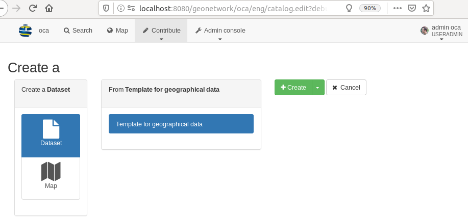

.. _portal-configuration:

Portal configuration
####################

From the ``admin console`` > ``settings`` user can configure portal under the ``sources`` section.


.. figure:: img/portal-access.png


There are 3 types of sources:

 - the main catalogue,

 - sub-portal which can be a subset of the main catalogue

 - harvesters.


.. figure:: img/portal-types.png


The main catalogue correspond to the current installation.

When harvesting, at least one source is created and represent the harvester. When harvesting from another GeoNetwork node,
sources from the target catalogue are also harvested to keep track of the true origin of records. This only applies
to the GeoNetwork protocols which use MEF (::ref:`mef_format`) which contains the source catalogue information.

The last type is sub portal and is described in details below.


Configuring a sub portal
````````````````````````

Sub portal can be used to create a space in the main catalogue only focusing on a subset of records.

A sub portal is defined by:

.. figure:: img/portal-subportal.png


When creating a subportal with an identifier ``ìnspire`` for example, a new entry point on your catalogue will be available:
http://localhost:8080/geonetwork/inspire/. Accessing the catalogue through it will only provide access to records
matching the filter defined for this portal. The ``search filter`` parameter value use the Lucene query parser syntax
(see http://lucene.apache.org/java/2_9_1/queryparsersyntax.html) and is applied to all searches.


User privileges apply as in the main instance.


The logo and name of the portal will be displayed instead of the main instance information:

.. figure:: img/portal-header.png


A CSW service is also available for this portal http://localhost:8080/geonetwork/inspire/eng/csw (and replace the virtual CSW feature).


A portal can also use a specific user interface configuration.


The list of portal available is at http://localhost:8080/geonetwork/srv/api/sources

.. figure:: img/portal-list.png


Example of usage
````````````````

Creating an INSPIRE directive space
-----------------------------------

For the INSPIRE directive, catalogue administrator needs to publish an entry point providing access only to INSPIRE related records. An INSPIRE subportal can be created with a filter on keywords ``+thesaurusName:"GEMET - INSPIRE themes, version 1.0"``.


Creating a space for partners
-----------------------------

Some organizations are opening the catalogue to a set of partners. In such case, each partner access the catalogue
and create their records in dedicated groups usually. A good example is https://www.geocat.ch/
providing a main search filter ``catalogue``.

.. figure:: imp/portal-geocatch.png

The concept of sub portal adds the possibility to create dedicated URL for each partner. The header can contain
the partner identification with name and logo and optionnaly the user interface can also be customized
(see :ref:`user-interface-configuration`

To setup this kind of configuration, the basic principle is to have:

- One group for each partner with one or more users

- One portal for each partner with a filter matching records in that group


To configure this, apply the following steps:

- Create a group for the partner eg. ``oca`` (see :ref:`creating-group`).

- Create at least one user for the partner (see :ref:`creating-user`). User created must be member of the group ``oca``. If you want user to be able to configure the portal (eg. change the name, choose a logo), user must have at least the ``UserAdmin`` profile for the group ``oca``.

- Create a portal. This portal can have the same name. eg. ``oca``. The portal filter can be based on the fact that a record published in the group ``oca`` is in this portal. Such filter is ``+_groupPublished:oca``. Once created the portal is accessible at http://localhost:8080/geonetwork/oca.

- (Optional) Link the portal to a user admin group to allow ``UserAdmin`` to configure their portal.


If you make this type of configuration ie. one partner = one group = one portal and users are only member of one group, then when connecting to a partner portal:

- user will only see records published in that group in the entire application

- when creating new record, no group selection is provided because user is member of one group only




Remember that a record is visible in the ``oca`` portal because it is published in the group ``oca``:

.. figure:: portal-oca-privileges.png

If the ``publish`` operation is removed from ``oca`` group, then record will not be visible anymore in that portal.


In some situation, you also want to share templates among partners. 2 options for this:

- Publish the template in all partner's groups. The main drawback in this case is that if a new group is added, the templates need to be published to that new group.

- Create a dedicated group for shared records eg. ``sharedGroup``. Publish templates in that shared space. Alter the portal filter to match either the partner group or the shared one. ``+_groupPublished:(oca OR sharedGroup)``.


