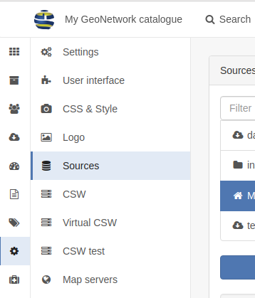

.. _portal-configuration:

Portal configuration
####################

From the ``admin console`` > ``settings`` user can configure portal under the ``sources`` section.





There are 3 types of sources:

 - the main catalogue,

 - sub-portal which can be a subset of the main catalogue

 - harvesters.


.. figure:: img/portal-types.png


The main catalogue correspond to the current installation.

When harvesting, at least one source is created and represent the harvester. When harvesting from another GeoNetwork node,
sources from the target catalogue are also harvested to keep track of the true origin of records. This only applies
to the GeoNetwork protocols which use MEF (::ref:`mef_format`) which contains the source catalogue information.

The last type is sub portal and is described in details below.


Configuring a sub portal
````````````````````````

Sub portal can be used to create a space in the main catalogue only focusing on a subset of records.

A sub portal is defined by:

.. figure:: img/portal-subportal.png


When creating a subportal with an identifier ``ìnspire`` for example, a new entry point on your catalogue will be available:
http://localhost:8080/geonetwork/inspire/. Accessing the catalogue through it will only provide access to records
matching the filter defined for this portal. The ``search filter`` parameter value use the Lucene query parser syntax
(see http://lucene.apache.org/java/2_9_1/queryparsersyntax.html) and is applied to all searches.


User privileges apply as in the main instance.


The logo and name of the portal will be displayed instead of the main instance information:


A CSW service is also available for this portal http://localhost:8080/geonetwork/inspire/eng/csw (and replace the virtual CSW feature).


A portal can also use a specific user interface configuration.


The list of portal available is at http://localhost:8080/geonetwork/srv/api/sources

.. figure:: img/portal-list.png


Example of usage
````````````````

Creating an INSPIRE directive space
-----------------------------------

For the INSPIRE directive, catalogue administrator needs to publish an entry point providing access only to INSPIRE related records.
An INSPIRE subportal can be created with a filter on keywords ``+thesaurusName:"GEMET - INSPIRE themes, version 1.0"``.


Creating a space for partners
-----------------------------


