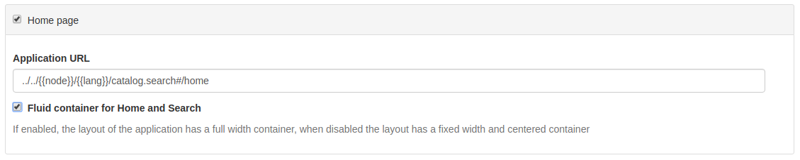

.. _user-interface-configuration:

User Interface Configuration
############################


Most of the configuration parameters for the user interface can be changed by administrator users
using the web interface in ``Admin console`` > ``Settings`` > ``User Interface``.

.. important:: Configuration of these parameters is critically important 
   for the catalog in an operational context. Misunderstanding
   some settings may result in a system that does not function as
   expected. For example, the map can become unusable.

.. figure:: img/ui-settings.png


Since the settings form is a long form, the 'save' button may be repeated between
the sections and will save all settings.

.. _user-interface-config-toptoolbar:


Top Toolbar
``````````````

On this section, the administrator user can define some parameters to configure the top toolbar of the user interface. 

.. figure:: img/ui-settings-toptoolbar.png


.. _user-interface-config-homepage:


Home Page
``````````````
On this section, the administrator user can define the URL of the home page. If the checkbox is disabled, there will be no Home tab.




.. _user-interface-config-searchpage:


Search Page
``````````````

On this section, the administrator user can define some parameters to configure the user interface of the search page. If the checkbox is disabled, there will be no Search tab.

.. figure:: img/ui-settings-searchpage.png

.. _user-interface-config-mappage:


Map Application
``````````````

On this section, the administrator user can define some parameters to configure the different maps of the user interface (mini map on search, main map tab and editor). If the checkbox is disabled, there will be no Map tab.

.. figure:: img/ui-settings-mappage.png

You can configure the map with different layers and projections.

- **Map Projection** This is the default projection of the map. Make sure this projection is also defined properly on the ``Projections to display maps into`` below.

.. figure:: img/ui-settings-mapprojection.png

- **Projections to display maps into** This is where the different projections of the map are defined. All projections here will be shown on the ``Projection Switcher`` tool of the map.

.. figure:: img/ui-settings-mapprojection2.png

For projections defined on Proj4 by default, only label and code are needed. For projections that are not defined by default, the administrator has to fill at least the definition field. All fields are recommended to be filled, to make sure the map works as expected.

.. figure:: img/ui-settings-mapprojection3.png

.. important:: All projections should have a definition to be able to display the map. If some projection is referenced here and GeoNetwork can't find a proper definition, the map may fail to load.

- **Optional Map Viewer Tools** On the following list we can choose which tools to display on the right toolbar of the map.

.. figure:: img/ui-settings-viewermapconfiguration.png

Viewer Map Configuration 
........................

.. figure:: img/ui-settings-mapviewer.png

On this section, we can configure the layers of the map. GeoNetwork will always apply first the context file referenced here and then add all layer objects defined in JSON as background layers.

.. figure:: img/ui-settings-mapviewerlayers.png

There are six types of layers that can be defined here:

 * **wms**: generic WMS layer, required properties: `name`, `url`
 * **wmts**: generic WMTS layer, required properties: `name`, `url`
 * **tms**: generic TMS layer, required property: `url`
 * **osm**: OpenStreetMap default layer, no other property required
 * **stamen**: Stamen layers, required property: `name`
 * **bing_aerial**: Bing Aerial background, required property: `key` containing the license key

All this layers can have also some optional extra properties:

 * **title** The title/label of the layer
 * **projectionList**  Projection array to restrict this layer only to certain projections on the map
 
 Examples of layers:
 
 `{"type":"stamen","projectionList":["EPSG:3857"]}`
 
 This layer will use OpenStreetMap Stamen style, but only when the map is on ``EPSG:3857``.
 
 `{"type":"wms","title":"OI.OrthoimageCoverage","name":"OI.OrthoimageCoverage","url":"http://www.ign.es/wms-inspire/pnoa-ma?request=GetCapabilities&service=WMS","projectionList":["EPSG:4326"]}`
 
 This WMS layer will be shown but only when the map is on ``EPSG:4326``.

Search Map Configuration 
........................

Same configuration as in Viewer Settings apply, but only for the mini map on the search page.
 

Editor Map Configuration 
........................

Same configuration as in Viewer Settings apply, but only for the map on the editor page.

