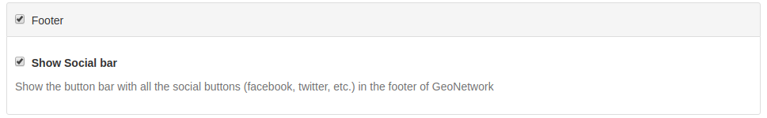
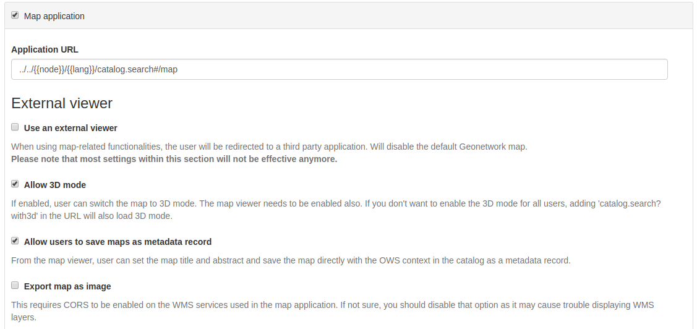

.. _user-interface-configuration:

User Interface Configuration
############################

Most of the configuration parameters for the user interface can be changed by an administrator 
using the web interface in ``Admin console`` > ``Settings`` > ``User Interface``.

.. important:: Configuration of these parameters is critically important
   for the catalog in an operational context. Misunderstanding
   some settings may result in a system that does not function as
   expected. For example, the map can become unusable.

.. figure:: img/ui-settings.png

By default the catalog will use the default UI configuration, named ``srv``. To view and edit the settings for this configuration, choose ``Create a default UI configuration``. 

To add a new configuration, such as for a sub-portal (see :ref:`portal-configuration`) choose ``Add new UI configuration`` and choose  one or more  portal identifiers from the dropdown list ``UI Configuration identifier``. Additional configurations can also be used for building an external JS application, which is able to load a specific configuration.

.. note:: Since the settings form is a long form, the ``save`` button may be repeated between the sections and will save all settings.

Filter settings
---------------

 - The search box can be used to filter settings in the form, for example searching for "social" will show only the settings related to the Social Bar.

.. figure:: img/ui-settings-filter.png

General options
---------------

 - Select the ``Humanize dates`` check box to show dates in a human-friendly format. If not set, the full date will be shown.

.. figure:: img/ui-settings-humanizedate.png

.. _user-interface-config-footer:

Footer
------

 - Select the ``footer`` checkbox to determine whether the |project_name| footer is shown. If not set, no footer will be visible.
 - Select the ``Social bar`` check box to show the social bar (links to twitter, facebook, linkedin etc) in the footer.

.. _user-interface-config-toptoolbar:

Top Toolbar
-----------

 - Select the ``Top toolbar`` check box to determine whether the |project_name| top toolbar will be shown. If not set, no toolbar will be visible.
 - From the ``List of languages`` choose those that should be available for translating the interface strings (available from the dropdown list in the top toolbar). If only one language remains, then no dropdown will be shown. Note that additional languages can be added, if translations are available, by selecting the ``+`` button below the list and adding the appropriate ISO codes.

.. figure:: img/ui-settings-toptoolbar.png

..

 - The checkbox ``Show the logo in the header`` determines where the catalog logo should be positioned. If selected, the logo will be positioned in the header, above the top toolbar and the toolbar logo (default) removed. If unset, the logo will appear in the top toolbar. The ``Position of logo`` options below determine where on the header the logo will be positioned.
   
.. figure:: img/ui-settings-toptoolbarlogo.png

.. _user-interface-config-homepage:

Home Page
---------
 - Select the ``Home page`` check box to determine whether the Logo and Link to the Home Page are visible in the top toolbar. If not set, no logo and link is shown.
   Define the URL for the home page. In the majority of cases this can be left as the default.
 - Select the ``Fluid container for Home and Search`` to determine whether the search box is full width in the browser page or if it is fixed width and centred.

.. figure:: img/ui-settings-homepage.png

..

.. _user-interface-config-searchpage:

Search Application
------------------

 - Select the ``Search application`` check box to determine whether the search application is visible in the top toolbar. If not set, no link is shown.
 - Define the URL for the search application. In the majority of cases this can be left as the default.
 - Define the options to determine the number of records shown per page of results, and the default.
 - In the ``Type of facet`` section, determine which set of search facets should be visible in the search page. The default is ``details`` but ``manager`` can be used to show the facets more normally used on the editor page.
 - The ``Default search`` section allows you to define a default filter for the search.

.. figure:: img/ui-settings-searchpage.png

..

 - ``Facet field to display using tabs`` creates a tab for each configured facet above the search results. This can be used to further narrow down the search results. The list of facet names can be found at https://github.com/geonetwork/core-geonetwork/blob/master/web/src/main/webapp/WEB-INF/config-summary.xml#L82. For example, to include the Topic Category filter above the search results, the administrator would add ``topicCat`` as the facet field to display.
 - ``List of facets`` can be used to restrict the facets available for searching. For example, adding ``topicCat`` to this list would restrict the search options to ``Topic Category`` only. This can be useful for restricting the search options in a sub-portal or external web application. To add additional facets to the list, select the blue ``+`` button.
 - ``Filters`` are additional search criteria added to all searches and again are used primarily for external applications and sub-portals.

.. figure:: img/ui-settings-searchpage2.png

..

 - The ``Type of sort options`` section determines the different ways by which a user can sort a set of search results. The ``default sort by option`` is shown below. Note that to search for example on ``title`` in alphabetical order it is necessary to set the order to ``reverse``.
 - The ``List of templates for search results`` section allows the administrator to configure templates for the layout of the search results. The default is ``grid`` whereas ``list`` is the default for the editor board.

.. figure:: img/ui-settings-searchpage3.png

..

 - The ``Default template used for search results`` defines the template page for the search. Generally this can be left as the default. 
 - The ``List of formatter for record view`` determines the formatter used to display the search results. See :ref:`creating-custom-view` for information on creating a new formatter. To add an additional view, click the blue ``+`` button below the list and provide a name and a URL.

.. figure:: img/ui-settings-searchpage3.png

..

.. _user-interface-config-searchresults:

Search results configuration
~~~~~~~~~~~~~~~~~~~~~~~~~~~~

This section determines the related metadata types to display when showing showing search results in the grid. format To add additional types, click the blue ``+`` button. The possible types are shown below the form.

.. figure:: img/ui-settings-searchresults.png

..

.. _user-interface-config-linktypes:

List of link types
~~~~~~~~~~~~~~~~~~

This section determines the types of links displayed when showing search results in the grid format. They are separated into ``links``, ``downloads``, ``layers`` and ``maps`` and for each type, a new entry can be added by clicking the blue ``+`` button below the list.

.. figure:: img/ui-settings-searchresults2.png

..

 -  ``Display filter tags in the search results``. When checked, the filter tags are visible above the search results. The default is to not show them.

.. _user-interface-customsearches:

User custom searches
~~~~~~~~~~~~~~~~~~~~

 - If enabled, the user will have the ability to create and save custom searches in the search tab. This functionality will be visible above the facets list on the left. 
 - If ``Display featured user searches panel in home page`` is also enabled, an additional tab will be shown on the home page alongside ``Latest news`` and ``Most popular``.
   
Saved Selections
~~~~~~~~~~~~~~~~

 - If enabled, the user will have the ability to save a selection of records in the search tab.

.. figure:: img/ui-settings-searchresults3.png

..

.. _user-interface-config-mappage:

Map Application
---------------

This section describes how an administrator can configure the different maps in the user interface (the main map, the mini map displayed on the search result page, and the map used in the editor to draw an extent). 

 - The initial checkbox allows the main map tab to be disabled. In this case there will be no map tab shown in the top toolbar but the mini map and extent map described above will still be visible.
 - The ``Application URL`` defines the URL for the map tab. In the majority of cases this can be left as the default.

External viewer
~~~~~~~~~~~~~~~

 - ``Use and external viewer`` allows a third party mapping application to be used in place of the default |project_name| map. In this case, most of the settings below will no longer be used.
 - ``Allow 3D mode`` enables the option to switch to 3D mode in the main map (see :ref:`quick_start`).
 - ``Allow users to save maps as metadata record`` enables users to save layers and base maps configuration as a record in the catalog. Optionally users can add a title and an abstract.
 - ``Export map as image`` enables users to export the map as an image but requires CORS to be enabled on any external WMS services displayed on the map. This option is disabled by default to avoid issues with WMS layers.

..

 - ``User preference persistence`` determines the behaviour of cookies related to the map. The various options are listed below.
 - If ``Bing Map Key`` is filled in, then it is possible to use Bing Maps as base layers within the map application. You must get your own key for this to work.

... figure:: img/ui-settings-mappage2.png

..

List of preferred OGC services
~~~~~~~~~~~~~~~~~~~~~~~~~~~~~~

Default ``wms`` and ``wmts`` services can be defined here that will be available by default to the end user. New services can be added using the blue ``+`` button below the protocol lists.

You can configure each map with different layers and projections.

- **Map Projection** This is the default projection of the map. Make sure the projection is defined on ``Projections used in maps`` below.

.. figure:: img/ui-settings-mapprojection.png

- **Projections used in maps** This is where the different projections of the map are defined. All projections will be shown in the ``Projection Switcher`` tool of the map.

.. figure:: img/ui-settings-mapprojection2.png

In order to enable a new projection you have to collect some properties of the required projection. Most relevant is the definition of the projection, using the proj4js syntax. 
Various projections, including their definition are listed at https://proj4js.io. Make sure to validate the configuration by opening the map.

.. figure:: img/ui-settings-mapprojection3.png

.. important:: If the configuration of a projection is not complete, the map may fail to load.

If a projection is defined which is not supported by the source of the map layer, the map application will reproject map images at the client side, this may cause unexpected behaviour, such as rotated or distorted labels.
Mind that the coords inserted are local to the projection. A list of scales is only relevant if the main map layer has a XYZ source, which does not follow the common tiling pattern.

- **Optional Map Viewer Tools** This option facilitates to configure which tools are displayed on the right toolbar of the map.

Viewer Map Configuration
........................

.. figure:: img/ui-settings-mapviewer.png

On this section, we can configure the layers of the map. GeoNetwork will always apply first the context file referenced here and then add all layer objects defined in JSON as background layers.

.. figure:: img/ui-settings-mapviewerlayers.png

There are six types of layers that can be defined here:

 * **wms**: generic WMS layer, required properties: `name`, `url`
 * **wmts**: generic WMTS layer, required properties: `name`, `url`
 * **tms**: generic TMS layer, required property: `url`
 * **osm**: OpenStreetMap default layer, no other property required
 * **stamen**: Stamen layers, required property: `name`
 * **bing_aerial**: Bing Aerial background, required property: `key` containing the license key

All this layers can have also some optional extra properties:

 * **title** The title/label of the layer
 * **projectionList**  Projection array to restrict this layer only to certain projections on the map

 Examples of layers:

 `{"type":"stamen","projectionList":["EPSG:3857"]}`

 This layer will use OpenStreetMap Stamen style, but only when the map is on ``EPSG:3857``.

 `{"type":"wms","title":"OI.OrthoimageCoverage","name":"OI.OrthoimageCoverage","url":"http://www.ign.es/wms-inspire/pnoa-ma?request=GetCapabilities&service=WMS","projectionList":["EPSG:4326"]}`

 This WMS layer will be shown but only when the map is on ``EPSG:4326``.

Search Map Configuration
........................

Besides context and bounds, the same configuration as the main map applies, for the mini map on the search page.

Editor Map Configuration
........................

Besides context and bounds, the same configuration as the main map applies, for the map on the editor page.

