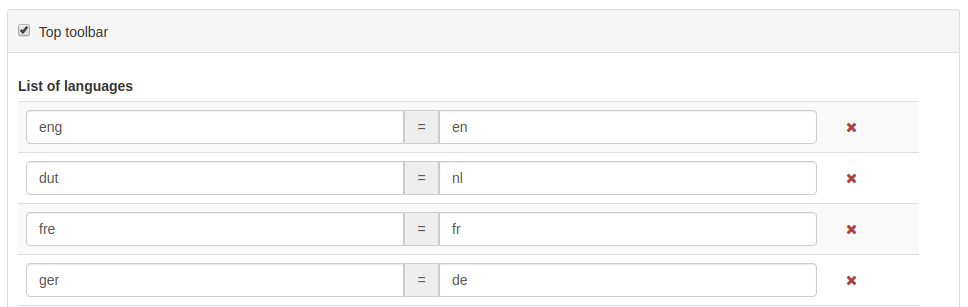

.. _user-interface-configuration:

User Interface Configuration
############################


Most of the configuration parameters for the user interface can be changed by an administrator 
using the web interface in ``Admin console`` > ``Settings`` > ``User Interface``.

.. important:: Configuration of these parameters is critically important
   for the catalog in an operational context. Misunderstanding
   some settings may result in a system that does not function as
   expected. For example, the map can become unusable.

.. figure:: img/ui-settings.png


Since the settings form is a long form, the 'save' button may be repeated between
the sections and will save all settings. 

Via `choose UI configuration` and `Add new UI configuration` it is possible to create mulitple UI configurations.
Those configurations can be used in 2 contexts:

- when creating a sub-portal (see :ref:`portal-configuration`). A UI configuration can be attached to one or more sub-portal.

- when building external JS applications which loads a specific configuration.


The main catalog is using the default UI configuration which should be named 'srv'.

If no UI configuration is available, a default set of parameters will be used. 

.. _user-interface-config-toptoolbar:

Top Toolbar
```````````

On this section, an administrator can define some parameters to configure the top toolbar of the user interface.




.. _user-interface-config-homepage:


Home Page
`````````
On this section, the administrator user can define the URL of the home page. If the checkbox is disabled, there will be no Home tab.

.. figure:: img/ui-settings-homepage.png


.. _user-interface-config-searchpage:


Search Page
```````````

On this section, the administrator user can define some parameters to configure the user interface of the search page. If the checkbox is disabled, there will be no Search tab.

.. figure:: img/ui-settings-searchpage.png

.. _user-interface-config-mappage:


Map Application
```````````````

This section describes how an administrator can configure the different maps of the user interface (the main map, the mini map displayed on the search result page and a map used in the editor to draw an extent). 
The initial checkbox allows to disable the main map, there will be no map tab.

.. figure:: img/ui-settings-mappage.png

You can configure each map with different layers and projections.

- **Map Projection** This is the default projection of the map. Make sure the projection is defined on ``Projections used in maps`` below.

.. figure:: img/ui-settings-mapprojection.png

- **Projections used in maps** This is where the different projections of the map are defined. All projections will be shown in the ``Projection Switcher`` tool of the map.

.. figure:: img/ui-settings-mapprojection2.png

In order to enable a new projection you have to collect some properties of the required projection. Most relevant is the definition of the projection, using the proj4js syntax. 
Various projections, including their definition are listed at https://proj4js.io. Make sure to validate the configuration by opening the map.

.. figure:: img/ui-settings-mapprojection3.png

.. important:: If the configuration of a projection is not complete, the map may fail to load.

If a projection is defined which is not supported by the source of the map layer, the map application will reproject map images at the client side, this may cause unexpected behaviour, such as rotated or distorted labels.
Mind that the coords inserted are local to the projection. A list of scales is only relevant if the main map layer has a XYZ source, which does not follow the common tiling pattern.

- **Optional Map Viewer Tools** This option facilitates to configure which tools are displayed on the right toolbar of the map.

Viewer Map Configuration
........................

.. figure:: img/ui-settings-mapviewer.png

On this section, we can configure the layers of the map. GeoNetwork will always apply first the context file referenced here and then add all layer objects defined in JSON as background layers.

.. figure:: img/ui-settings-mapviewerlayers.png

There are six types of layers that can be defined here:

 * **wms**: generic WMS layer, required properties: `name`, `url`
 * **wmts**: generic WMTS layer, required properties: `name`, `url`
 * **tms**: generic TMS layer, required property: `url`
 * **osm**: OpenStreetMap default layer, no other property required
 * **stamen**: Stamen layers, required property: `name`
 * **bing_aerial**: Bing Aerial background, required property: `key` containing the license key

All this layers can have also some optional extra properties:

 * **title** The title/label of the layer
 * **projectionList**  Projection array to restrict this layer only to certain projections on the map

 Examples of layers:

 `{"type":"stamen","projectionList":["EPSG:3857"]}`

 This layer will use OpenStreetMap Stamen style, but only when the map is on ``EPSG:3857``.

 `{"type":"wms","title":"OI.OrthoimageCoverage","name":"OI.OrthoimageCoverage","url":"http://www.ign.es/wms-inspire/pnoa-ma?request=GetCapabilities&service=WMS","projectionList":["EPSG:4326"]}`

 This WMS layer will be shown but only when the map is on ``EPSG:4326``.

Search Map Configuration
........................

Besides context and bounds, the same configuration as the main map applies, for the mini map on the search page.


Editor Map Configuration
........................

Besides context and bounds, the same configuration as the main map applies, for the map on the editor page.

