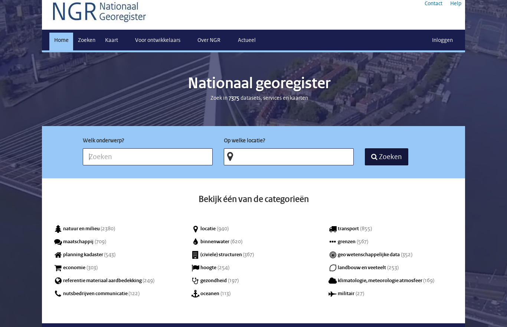
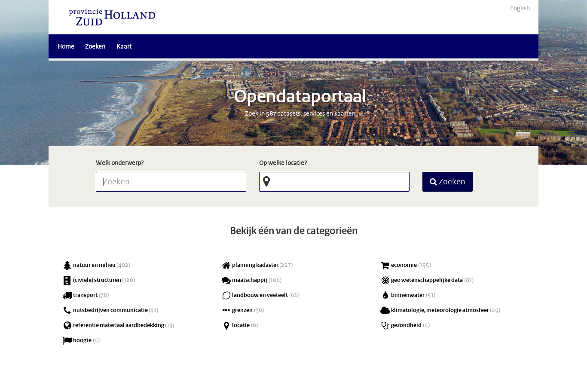
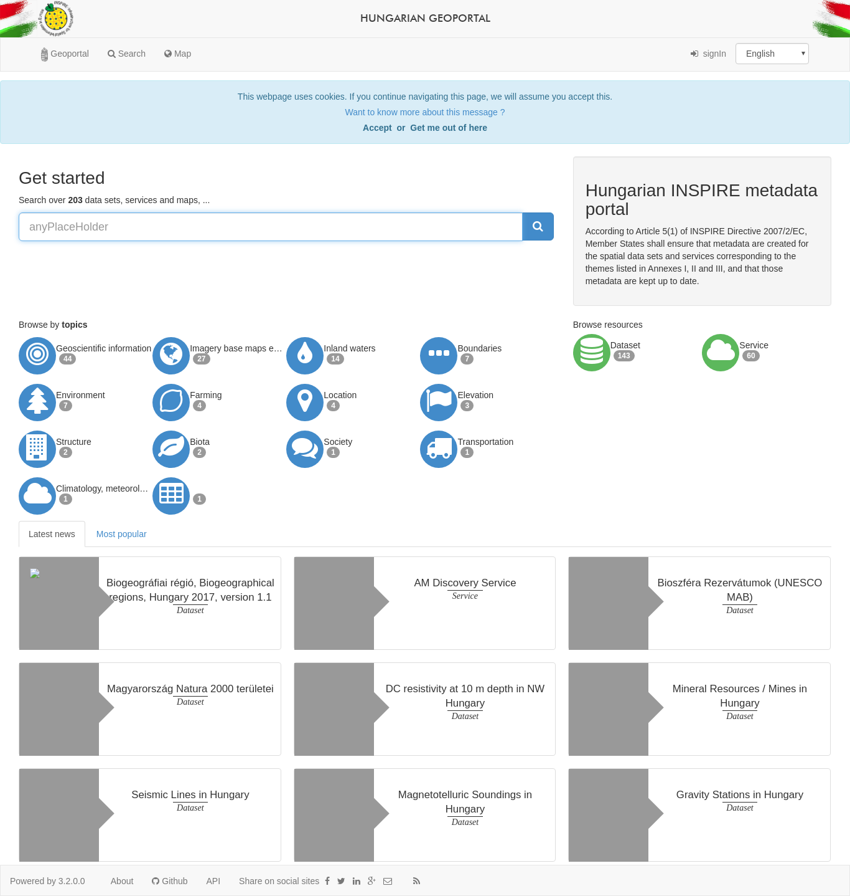
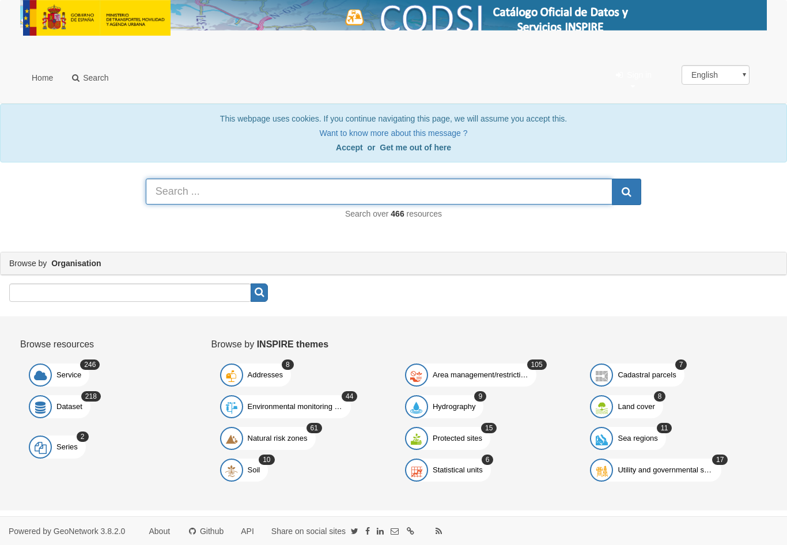

.. _gallery:

Some GeoNetwork nodes
#####################

* http://catalogue.geo-ide.developpement-durable.gouv.fr/

* http://geocatalog.webservice-energy.org/geonetwork

.. figure:: img/geocatalog.webservice-energy.org!geonetwork.png
   :target: http://geocatalog.webservice-energy.org/geonetwork

* http://geometadatensuche.inspire.gv.at/

.. figure:: img/geometadatensuche.inspire.gv.at.png
   :target: http://geometadatensuche.inspire.gv.at/

* http://geoportal.kscnet.ru/geonetwork/

.. figure:: img/geoportal.kscnet.ru!geonetwork.png
   :target: http://geoportal.kscnet.ru/geonetwork/

* http://metawal.wallonie.be

.. figure:: img/metawal.wallonie.be.png
   :target: http://metawal.wallonie.be

* http://salbgeonetwork.grid.unep.ch/geonetwork

* http://www.fao.org/geonetwork/

.. figure:: img/fao.org!geonetwork.png
   :target: http://www.fao.org/geonetwork/

* http://www.geoguyane.fr/catalogue/

.. figure:: img/geoguyane.fr!catalogue.png
   :target: http://www.geoguyane.fr/catalogue/

* http://www.geonorge.no/geonetwork

.. figure:: img/geonorge.no!geonetwork.png
   :target: http://www.geonorge.no/geonetwork

* http://www.geopal.org/accueil

* http://www.metadados.geo.ibge.gov.br/geonetwork_ibge/

* http://www.metadados.idesp.sp.gov.br/catalogo/

* http://www.nationaalgeoregister.nl/geonetwork

* http://www.sadc.int/geonetwork

* http://www.sandre.eaufrance.fr/atlas/

* http://www.sigloire.fr/

.. figure:: img/sigloire.fr.png
   :target: http://www.sigloire.fr/

* http://www.wodgik.katowice.pl:8080/geonetwork

* https://catalogue-imos.aodn.org.au/geonetwork

.. figure:: img/catalogue-imos.aodn.org.au!geonetwork.png
   :target: https://catalogue-imos.aodn.org.au/geonetwork

* https://catalogue.grand-chatellerault.fr/

.. figure:: img/catalogue.grand-chatellerault.fr.png
   :target: https://catalogue.grand-chatellerault.fr/

* https://download.data.grandlyon.com/catalogue

.. figure:: img/download.data.grandlyon.com!catalogue.png
   :target: https://download.data.grandlyon.com/catalogue

* https://gdk.gdi-de.org/gdi-de/

.. figure:: img/gdk.gdi-de.org!gdi-de.png
   :target: https://gdk.gdi-de.org/gdi-de/

* https://geocatalogue.apur.org/catalogue

.. figure:: img/geocatalogue.apur.org!catalogue.png
   :target: https://geocatalogue.apur.org/catalogue

* https://geo.aims.gov.au/geonetwork/

.. figure:: img/geo.aims.gov.au!geonetwork.png
   :target: https://geo.aims.gov.au/geonetwork/

* https://geocatalogue.geoportail.lu/

* https://geoportal.geodaten.niedersachsen.de/harvest/

* https://georep.nc/

.. figure:: img/georep.nc.png
   :target: https://georep.nc/

* https://geoservice.pbl.nl/geonetwork

.. figure:: img/geoservice.pbl.nl!geonetwork.png
   :target: https://geoservice.pbl.nl/geonetwork

* https://ide.cat/en/catalogue/

* https://ids.craig.fr/geocat/

.. figure:: img/ids.craig.fr!geocat.png
   :target: https://ids.craig.fr/geocat/

* https://opendata.zuid-holland.nl/geonetwork/

* https://prodige.cerema.fr/

* https://sextant.ifremer.fr/eng

.. figure:: img/sextant.ifremer.fr!eng.png
   :target: https://sextant.ifremer.fr/eng

* https://www.doterr.fr/accueil

.. figure:: img/doterr.fr!accueil.png
   :target: https://www.doterr.fr/accueil

* https://www.geo.be/#!/catalogs/1/resources?l=en

* https://www.geo2france.fr/geonetwork/

.. figure:: img/geo2france.fr!geonetwork.png
   :target: https://www.geo2france.fr/geonetwork/

* https://www.geocat.ch/geonetwork/

* https://www.geograndest.fr/geonetwork

.. figure:: img/geograndest.fr!geonetwork.png
   :target: https://www.geograndest.fr/geonetwork

* https://www.geomartinique.fr/accueil

.. figure:: img/geomartinique.fr!accueil.png
   :target: https://www.geomartinique.fr/accueil

* https://www.geonormandie.fr/accueil

.. figure:: img/geonormandie.fr!accueil.png
   :target: https://www.geonormandie.fr/accueil

* https://www.geopicardie.fr/geonetwork/

.. figure:: img/geopicardie.fr!geonetwork.png
   :target: https://www.geopicardie.fr/geonetwork/

* https://www.karugeo.fr/accueil

* https://www.mongeosource.fr/geosource/

* https://www.paikkatietohakemisto.fi

.. figure:: img/paikkatietohakemisto.fi.png
   :target: https://www.paikkatietohakemisto.fi

* https://www.picto-occitanie.fr/accueil

.. figure:: img/picto-occitanie.fr!accueil.png
   :target: https://www.picto-occitanie.fr/accueil

* https://www.pigma.org/geonetwork

.. figure:: img/pigma.org!geonetwork.png
   :target: https://www.pigma.org/geonetwork

* https://msdi.data.gov.mt/geonetwork

* http://metadata.geopunt.be/zoekdienst

* http://inspire.gov.hu/geonetwork

* https://gatt.lmi.is/geonetwork

.. figure:: img/gatt.lmi.is!geonetwork.png
   :target: https://gatt.lmi.is/geonetwork

* http://www.idee.es/csw-codsi-idee

To add your catalog to this list, add it to `this list <https://github.com/geonetwork/doc/tree/develop/source/annexes/gallery/gallery-urls.csv>`_.

