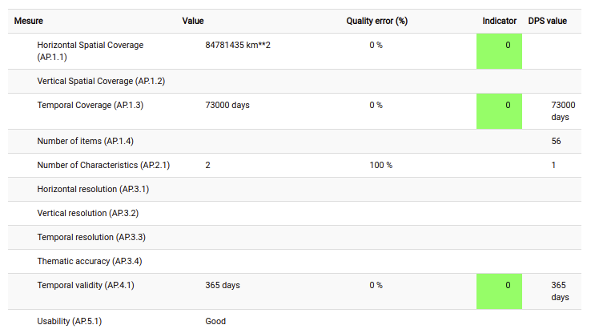

.. _iso19115-3:

ISO Standard for metadata on Geographic Information (ISO 19115-3)
#################################################################

ISO 19115-3 is the latest standard defined by ISO to describe geographic information.
The main benefits compared to ISO19139 for using this standard are:

- Standards improvements (see `Using the latest ISO Standard for Geographic Information (ISO19115-1) for an INSPIRE Discovery Service <http://cnig.gouv.fr/wp-content/uploads/2015/06/titellus_fx_prunayre_iso19115-3_inspire2015.pdf>`_

- Describe imagery data (covered by ISO19115-2)

- Embed data model (feature catalogue) in the dataset record (covered by ISO19110)

- Data quality described using ISO19157

This standard is maintained on https://github.com/metadata101/iso19115-3.2018
and is available by default in GeoNetwork 3.8+.

Example of catalogues using this standard:

- `Metawal - Catalogue pour l'information géographique de Wallonie <http://metawal.wallonie.be/>`_ is using ISO19115-3 as the default standard for all records. Main advantages are: categorizations of related documents (eg. online sources, DQ reports, GIS styles, Data models),  better description of organization / parties and roles, remain compliant to the INSPIRE directive by converting to ISO19139 through CSW.

.. figure:: metawal-tramedesaxes.png

- `Sextant - Checkpoints <https://sextant.ifremer.fr/>`_ is using ISO19115-3 for data quality description of Specification / Products and upstream data.

