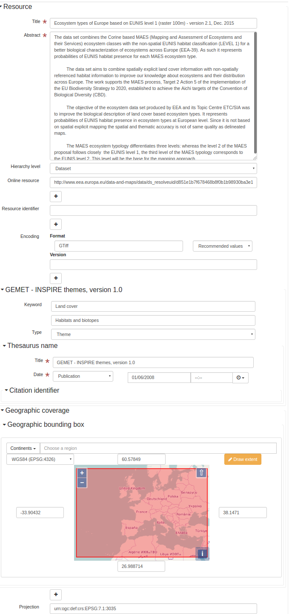
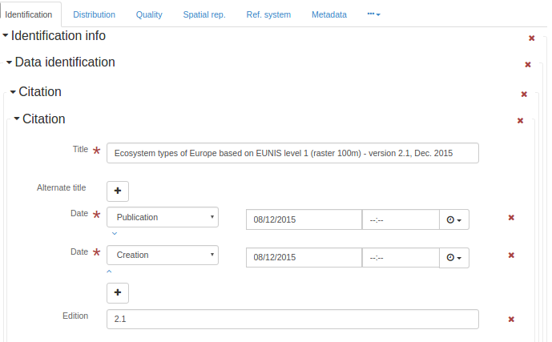
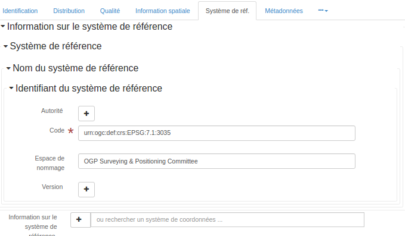

.. _iso19139:
      

Geographic information -- Metadata (iso19139:2007) (iso19139)
#############################################################

ISO 19115 defines the schema required for describing geographic information and services by
means of metadata. It provides information about the identification, the extent, the quality,
the spatial and temporal aspects, the content, the spatial reference, the portrayal,
distribution, and other properties of digital geographic data and services.

ISO 19115 is applicable to:

- the cataloguing of all types of resources, clearinghouse activities, and the full description of datasets and services;

- geographic services, geographic datasets, dataset series, and individual geographic features and feature properties.

ISO 19115 defines:

- mandatory and conditional metadata sections, metadata entities, and metadata elements;

- the minimum set of metadata required to serve most metadata applications (data discovery,
  determining data fitness for use, data access, data transfer, and use of digital data and
  services);

- optional metadata elements to allow for a more extensive standard description of resources, if
  required;

- a method for extending metadata to fit specialized needs.

Though ISO 19115 is applicable to digital data and services, its principles can be extended to
many other types of resources such as maps, charts, and textual documents as well as
non-geographic data. Certain conditional metadata elements might not apply to these other forms
of data.
  

More details:https://www.iso.org/iso/home/store/catalogue_tc/catalogue_detail.htm?csnumber=53798

Metadata editor
***************

This standard can be encoded using 4 view(s).

* :ref:`iso19139-view-inspire`
      
* :ref:`iso19139-view-default`
      
* :ref:`iso19139-view-advanced`
      
* :ref:`iso19139-view-xml`
      

.. _iso19139-view-inspire:
      

View: INSPIRE (inspire)
=======================

This view is composed of2tab(s).

* :ref:`iso19139-tab-inspire`
      
* :ref:`iso19139-tab-inspire_sds`
      

This view also allows to add the following element even if not in the current record:

* Contains Operations (srv:containsOperations)
* Operation (srv:SV_OperationMetadata)
* Parameters (srv:parameters)

.. _iso19139-tab-inspire:
      

Tab: INSPIRE (inspire)
----------------------

This tab display elements from the XML metadata record.

Section: Identification
^^^^^^^^^^^^^^^^^^^^^^^

File identifier
^^^^^^^^^^^^^^^

.. raw:: html

   Unique identifier for this metadata file

:XPath:
    
    /gmd:MD_Metadata/gmd:fileIdentifier

See :ref:`iso19139-elem-gmd-fileIdentifier-353be7794d17e5435ce2fe57d91966ba`
      
Title
^^^^^

.. raw:: html

   Name by which the cited resource is known

:XPath:
    
    /gmd:MD_Metadata/gmd:identificationInfo/\*/gmd:citation/gmd:CI_Citation/gmd:title

See :ref:`iso19139-elem-gmd-title-cc3002a2d81bcdbc5bf4c8735faf6980`
      
Abstract
^^^^^^^^

.. raw:: html

   Brief narrative summary of the content of the resource(s)

:XPath:
    
    /gmd:MD_Metadata/gmd:identificationInfo/gmd:MD_DataIdentification/gmd:abstract

See :ref:`iso19139-elem-gmd-abstract-cacfcd3bd6bbd44733f828dd2903ecd8`
      
Abstract
^^^^^^^^

.. raw:: html

   Brief narrative summary of the content of the resource(s)

:XPath:
    
    /gmd:MD_Metadata/gmd:identificationInfo/srv:SV_ServiceIdentification/gmd:abstract

See :ref:`iso19139-elem-gmd-abstract-cacfcd3bd6bbd44733f828dd2903ecd8`
      
Hierarchy level
^^^^^^^^^^^^^^^

.. raw:: html

   Scope to which the metadata applies (see annex H for more information about metadata hierarchy levels)

:XPath:
    
    /gmd:MD_Metadata/gmd:hierarchyLevel

See :ref:`iso19139-elem-gmd-hierarchyLevel-2b6d53b433d8f9c0cc58606d27eecc17`
      

:Name:
    
    Hierarchy level

:Name:
    
    Hierarchy level

:Type:
    
    add

:Displayed only if:
    
    count(gmd:MD_Metadata/gmd:identificationInfo/srv:SV_ServiceIdentification) = 0

.. code-block:: xml
    

    <gmd:hierarchyLevel xmlns:xsi="http://www.w3.org/2001/XMLSchema-instance"
                        xmlns:xlink="http://www.w3.org/1999/xlink">
       <gmd:MD_ScopeCode codeList="http://standards.iso.org/iso/19139/resources/gmxCodelists.xml#MD_ScopeCode"
                         codeListValue="dataset"/>
    </gmd:hierarchyLevel>

:Name:
    
    Hierarchy level

:Name:
    
    Hierarchy level

:Type:
    
    add

:Displayed only if:
    
    count(gmd:MD_Metadata/gmd:identificationInfo/srv:SV_ServiceIdentification) > 0

.. code-block:: xml
    

    <gmd:hierarchyLevel xmlns:xsi="http://www.w3.org/2001/XMLSchema-instance"
                        xmlns:xlink="http://www.w3.org/1999/xlink">
       <gmd:MD_ScopeCode codeList="http://standards.iso.org/iso/19139/resources/gmxCodelists.xml#MD_ScopeCode"
                         codeListValue="service"/>
    </gmd:hierarchyLevel>

Online resource
^^^^^^^^^^^^^^^

OnLine resource
^^^^^^^^^^^^^^^

.. raw:: html

   Information about online sources from which the resource can be obtained

:XPath:
    
    /gmd:MD_Metadata/gmd:distributionInfo/gmd:MD_Distribution/gmd:transferOptions /gmd:MD_DigitalTransferOptions/gmd:onLine

See :ref:`iso19139-elem-gmd-onLine-c0b191c96e7e4d7dfc2a4ba2fd8946f4`
      

:Name:
    
    Online resource

:Name:
    
    Online resource

:Type:
    
    add

.. code-block:: xml
    

    <gmd:onLine xmlns:xsi="http://www.w3.org/2001/XMLSchema-instance"
                xmlns:xlink="http://www.w3.org/1999/xlink">
       <gmd:CI_OnlineResource>
          <gmd:linkage>
             <gmd:URL/>
          </gmd:linkage>
          <gmd:protocol>
             <gco:CharacterString/>
          </gmd:protocol>
       </gmd:CI_OnlineResource>
    </gmd:onLine>

Resource identifier
^^^^^^^^^^^^^^^^^^^

Citation identifier
^^^^^^^^^^^^^^^^^^^

.. raw:: html

   Identifier of the citation

:XPath:
    
    /gmd:MD_Metadata/gmd:identificationInfo/gmd:MD_DataIdentification/gmd:citation/gmd:CI_Citation/gmd:identifier

See :ref:`iso19139-elem-gmd-identifier-c4f31fd808ee0eaa1e5525c5ff0edd23`
      

:Name:
    
    Resource identifier

:Name:
    
    Resource identifier

:Type:
    
    add

.. code-block:: xml
    

    <gmd:identifier xmlns:xsi="http://www.w3.org/2001/XMLSchema-instance"
                    xmlns:xlink="http://www.w3.org/1999/xlink">
       <gmd:MD_Identifier>
          <gmd:code>
             <gco:CharacterString/>
          </gmd:code>
       </gmd:MD_Identifier>
    </gmd:identifier>

:Type:
    
    process

:Displayed only if:
    
    (count(gmd:MD_Metadata/gmd:identificationInfo/gmd:MD_DataIdentification) + count(gmd:MD_Metadata/gmd:identificationInfo/gmd:MD_DataIdentification/gmd:citation/gmd:CI_Citation/ gmd:identifier[ends-with(gmd:MD_Identifier/gmd:code/gco:CharacterString, //gmd:MD_Metadata/gmd:fileIdentifier/gco:CharacterString)])) = 1

Language
^^^^^^^^

.. raw:: html

   Language(s) used within the dataset

.. raw:: html

   language(s) used within the dataset

:XPath:
    
    /gmd:MD_Metadata/gmd:identificationInfo/gmd:MD_DataIdentification/gmd:language

See :ref:`iso19139-elem-gmd-language-98a1fec5ea30c100ef63f1ca4bd6dbdb`
      
Spatial representation type
^^^^^^^^^^^^^^^^^^^^^^^^^^^

.. raw:: html

   Method used to spatially represent geographic information

:XPath:
    
    /gmd:MD_Metadata/gmd:identificationInfo/gmd:MD_DataIdentification/gmd:spatialRepresentationType

See :ref:`iso19139-elem-gmd-spatialRepresentationType-1617a07231ac2246d0844778962d4ca0`
      

:Name:
    
    Spatial representation type

:Name:
    
    Spatial representation type

:Type:
    
    add

.. code-block:: xml
    

    <gmd:spatialRepresentationType xmlns:xsi="http://www.w3.org/2001/XMLSchema-instance"
                                   xmlns:xlink="http://www.w3.org/1999/xlink">
       <gmd:MD_SpatialRepresentationTypeCode codeList="http://standards.iso.org/iso/19139/resources/gmxCodelists.xml#MD_SpatialRepresentationTypeCode"
                                             codeListValue="vector"/>
    </gmd:spatialRepresentationType>

Encoding
^^^^^^^^

Distribution format
^^^^^^^^^^^^^^^^^^^

.. raw:: html

   Provides a description of the format of the data to be distributed

:XPath:
    
    /gmd:MD_Metadata/gmd:distributionInfo/gmd:MD_Distribution/gmd:distributionFormat

See :ref:`iso19139-elem-gmd-distributionFormat-5cad81c9a7af3991db918a5e8fc0c596`
      

:Name:
    
    Encoding

:Name:
    
    Encoding

:Type:
    
    add

:Displayed only if:
    
    count(gmd:MD_Metadata/gmd:identificationInfo/srv:SV_ServiceIdentification) = 0

.. code-block:: xml
    

    <gmd:distributionFormat xmlns:xsi="http://www.w3.org/2001/XMLSchema-instance"
                            xmlns:xlink="http://www.w3.org/1999/xlink">
       <gmd:MD_Format>
          <gmd:name>
             <gco:CharacterString/>
          </gmd:name>
          <gmd:version>
             <gco:CharacterString/>
          </gmd:version>
          <gmd:specification>
             <gco:CharacterString/>
          </gmd:specification>
       </gmd:MD_Format>
    </gmd:distributionFormat>

Projection
^^^^^^^^^^

Reference system identifier
^^^^^^^^^^^^^^^^^^^^^^^^^^^

.. raw:: html

   Name of reference system

:XPath:
    
    /gmd:MD_Metadata/gmd:referenceSystemInfo/gmd:MD_ReferenceSystem/gmd:referenceSystemIdentifier

See :ref:`iso19139-elem-gmd-referenceSystemIdentifier-5393a29789a4b6def1795d5a9e70f665`
      

:Name:
    
    Projection

:Name:
    
    Ref. system

:Type:
    
    add

.. code-block:: xml
    

    <gmd:referenceSystemInfo xmlns:xsi="http://www.w3.org/2001/XMLSchema-instance"
                             xmlns:xlink="http://www.w3.org/1999/xlink">
       <gmd:MD_ReferenceSystem>
          <gmd:referenceSystemIdentifier>
             <gmd:RS_Identifier>
                <gmd:code>
                   <gco:CharacterString>http://www.opengis.net/def/crs/EPSG/0/4936</gco:CharacterString>
                </gmd:code>
             </gmd:RS_Identifier>
          </gmd:referenceSystemIdentifier>
       </gmd:MD_ReferenceSystem>
    </gmd:referenceSystemInfo>

    <gmd:referenceSystemInfo xmlns:xsi="http://www.w3.org/2001/XMLSchema-instance"
                             xmlns:xlink="http://www.w3.org/1999/xlink">
       <gmd:MD_ReferenceSystem>
          <gmd:referenceSystemIdentifier>
             <gmd:RS_Identifier>
                <gmd:code>
                   <gco:CharacterString>http://www.opengis.net/def/crs/EPSG/0/4937</gco:CharacterString>
                </gmd:code>
             </gmd:RS_Identifier>
          </gmd:referenceSystemIdentifier>
       </gmd:MD_ReferenceSystem>
    </gmd:referenceSystemInfo>

    <gmd:referenceSystemInfo xmlns:xsi="http://www.w3.org/2001/XMLSchema-instance"
                             xmlns:xlink="http://www.w3.org/1999/xlink">
       <gmd:MD_ReferenceSystem>
          <gmd:referenceSystemIdentifier>
             <gmd:RS_Identifier>
                <gmd:code>
                   <gco:CharacterString>http://www.opengis.net/def/crs/EPSG/0/4258</gco:CharacterString>
                </gmd:code>
             </gmd:RS_Identifier>
          </gmd:referenceSystemIdentifier>
       </gmd:MD_ReferenceSystem>
    </gmd:referenceSystemInfo>

    <gmd:referenceSystemInfo xmlns:xsi="http://www.w3.org/2001/XMLSchema-instance"
                             xmlns:xlink="http://www.w3.org/1999/xlink">
       <gmd:MD_ReferenceSystem>
          <gmd:referenceSystemIdentifier>
             <gmd:RS_Identifier>
                <gmd:code>
                   <gco:CharacterString>http://www.opengis.net/def/crs/EPSG/0/3035</gco:CharacterString>
                </gmd:code>
             </gmd:RS_Identifier>
          </gmd:referenceSystemIdentifier>
       </gmd:MD_ReferenceSystem>
    </gmd:referenceSystemInfo>

    <gmd:referenceSystemInfo xmlns:xsi="http://www.w3.org/2001/XMLSchema-instance"
                             xmlns:xlink="http://www.w3.org/1999/xlink">
       <gmd:MD_ReferenceSystem>
          <gmd:referenceSystemIdentifier>
             <gmd:RS_Identifier>
                <gmd:code>
                   <gco:CharacterString>http://www.opengis.net/def/crs/EPSG/0/3034</gco:CharacterString>
                </gmd:code>
             </gmd:RS_Identifier>
          </gmd:referenceSystemIdentifier>
       </gmd:MD_ReferenceSystem>
    </gmd:referenceSystemInfo>

    <gmd:referenceSystemInfo xmlns:xsi="http://www.w3.org/2001/XMLSchema-instance"
                             xmlns:xlink="http://www.w3.org/1999/xlink">
       <gmd:MD_ReferenceSystem>
          <gmd:referenceSystemIdentifier>
             <gmd:RS_Identifier>
                <gmd:code>
                   <gco:CharacterString>http://www.opengis.net/def/crs/EPSG/0/3038</gco:CharacterString>
                </gmd:code>
             </gmd:RS_Identifier>
          </gmd:referenceSystemIdentifier>
       </gmd:MD_ReferenceSystem>
    </gmd:referenceSystemInfo>

    <gmd:referenceSystemInfo xmlns:xsi="http://www.w3.org/2001/XMLSchema-instance"
                             xmlns:xlink="http://www.w3.org/1999/xlink">
       <gmd:MD_ReferenceSystem>
          <gmd:referenceSystemIdentifier>
             <gmd:RS_Identifier>
                <gmd:code>
                   <gco:CharacterString>http://www.opengis.net/def/crs/EPSG/0/3039</gco:CharacterString>
                </gmd:code>
             </gmd:RS_Identifier>
          </gmd:referenceSystemIdentifier>
       </gmd:MD_ReferenceSystem>
    </gmd:referenceSystemInfo>

    <gmd:referenceSystemInfo xmlns:xsi="http://www.w3.org/2001/XMLSchema-instance"
                             xmlns:xlink="http://www.w3.org/1999/xlink">
       <gmd:MD_ReferenceSystem>
          <gmd:referenceSystemIdentifier>
             <gmd:RS_Identifier>
                <gmd:code>
                   <gco:CharacterString>http://www.opengis.net/def/crs/EPSG/0/3040</gco:CharacterString>
                </gmd:code>
             </gmd:RS_Identifier>
          </gmd:referenceSystemIdentifier>
       </gmd:MD_ReferenceSystem>
    </gmd:referenceSystemInfo>

    <gmd:referenceSystemInfo xmlns:xsi="http://www.w3.org/2001/XMLSchema-instance"
                             xmlns:xlink="http://www.w3.org/1999/xlink">
       <gmd:MD_ReferenceSystem>
          <gmd:referenceSystemIdentifier>
             <gmd:RS_Identifier>
                <gmd:code>
                   <gco:CharacterString>http://www.opengis.net/def/crs/EPSG/0/3041</gco:CharacterString>
                </gmd:code>
             </gmd:RS_Identifier>
          </gmd:referenceSystemIdentifier>
       </gmd:MD_ReferenceSystem>
    </gmd:referenceSystemInfo>

    <gmd:referenceSystemInfo xmlns:xsi="http://www.w3.org/2001/XMLSchema-instance"
                             xmlns:xlink="http://www.w3.org/1999/xlink">
       <gmd:MD_ReferenceSystem>
          <gmd:referenceSystemIdentifier>
             <gmd:RS_Identifier>
                <gmd:code>
                   <gco:CharacterString>http://www.opengis.net/def/crs/EPSG/0/3042</gco:CharacterString>
                </gmd:code>
             </gmd:RS_Identifier>
          </gmd:referenceSystemIdentifier>
       </gmd:MD_ReferenceSystem>
    </gmd:referenceSystemInfo>

    <gmd:referenceSystemInfo xmlns:xsi="http://www.w3.org/2001/XMLSchema-instance"
                             xmlns:xlink="http://www.w3.org/1999/xlink">
       <gmd:MD_ReferenceSystem>
          <gmd:referenceSystemIdentifier>
             <gmd:RS_Identifier>
                <gmd:code>
                   <gco:CharacterString>http://www.opengis.net/def/crs/EPSG/0/3043</gco:CharacterString>
                </gmd:code>
             </gmd:RS_Identifier>
          </gmd:referenceSystemIdentifier>
       </gmd:MD_ReferenceSystem>
    </gmd:referenceSystemInfo>

    <gmd:referenceSystemInfo xmlns:xsi="http://www.w3.org/2001/XMLSchema-instance"
                             xmlns:xlink="http://www.w3.org/1999/xlink">
       <gmd:MD_ReferenceSystem>
          <gmd:referenceSystemIdentifier>
             <gmd:RS_Identifier>
                <gmd:code>
                   <gco:CharacterString>http://www.opengis.net/def/crs/EPSG/0/3044</gco:CharacterString>
                </gmd:code>
             </gmd:RS_Identifier>
          </gmd:referenceSystemIdentifier>
       </gmd:MD_ReferenceSystem>
    </gmd:referenceSystemInfo>

    <gmd:referenceSystemInfo xmlns:xsi="http://www.w3.org/2001/XMLSchema-instance"
                             xmlns:xlink="http://www.w3.org/1999/xlink">
       <gmd:MD_ReferenceSystem>
          <gmd:referenceSystemIdentifier>
             <gmd:RS_Identifier>
                <gmd:code>
                   <gco:CharacterString>http://www.opengis.net/def/crs/EPSG/0/3045</gco:CharacterString>
                </gmd:code>
             </gmd:RS_Identifier>
          </gmd:referenceSystemIdentifier>
       </gmd:MD_ReferenceSystem>
    </gmd:referenceSystemInfo>

    <gmd:referenceSystemInfo xmlns:xsi="http://www.w3.org/2001/XMLSchema-instance"
                             xmlns:xlink="http://www.w3.org/1999/xlink">
       <gmd:MD_ReferenceSystem>
          <gmd:referenceSystemIdentifier>
             <gmd:RS_Identifier>
                <gmd:code>
                   <gco:CharacterString>http://www.opengis.net/def/crs/EPSG/0/3046</gco:CharacterString>
                </gmd:code>
             </gmd:RS_Identifier>
          </gmd:referenceSystemIdentifier>
       </gmd:MD_ReferenceSystem>
    </gmd:referenceSystemInfo>

    <gmd:referenceSystemInfo xmlns:xsi="http://www.w3.org/2001/XMLSchema-instance"
                             xmlns:xlink="http://www.w3.org/1999/xlink">
       <gmd:MD_ReferenceSystem>
          <gmd:referenceSystemIdentifier>
             <gmd:RS_Identifier>
                <gmd:code>
                   <gco:CharacterString>http://www.opengis.net/def/crs/EPSG/0/3047</gco:CharacterString>
                </gmd:code>
             </gmd:RS_Identifier>
          </gmd:referenceSystemIdentifier>
       </gmd:MD_ReferenceSystem>
    </gmd:referenceSystemInfo>

    <gmd:referenceSystemInfo xmlns:xsi="http://www.w3.org/2001/XMLSchema-instance"
                             xmlns:xlink="http://www.w3.org/1999/xlink">
       <gmd:MD_ReferenceSystem>
          <gmd:referenceSystemIdentifier>
             <gmd:RS_Identifier>
                <gmd:code>
                   <gco:CharacterString>http://www.opengis.net/def/crs/EPSG/0/3048</gco:CharacterString>
                </gmd:code>
             </gmd:RS_Identifier>
          </gmd:referenceSystemIdentifier>
       </gmd:MD_ReferenceSystem>
    </gmd:referenceSystemInfo>

    <gmd:referenceSystemInfo xmlns:xsi="http://www.w3.org/2001/XMLSchema-instance"
                             xmlns:xlink="http://www.w3.org/1999/xlink">
       <gmd:MD_ReferenceSystem>
          <gmd:referenceSystemIdentifier>
             <gmd:RS_Identifier>
                <gmd:code>
                   <gco:CharacterString>http://www.opengis.net/def/crs/EPSG/0/3049</gco:CharacterString>
                </gmd:code>
             </gmd:RS_Identifier>
          </gmd:referenceSystemIdentifier>
       </gmd:MD_ReferenceSystem>
    </gmd:referenceSystemInfo>

    <gmd:referenceSystemInfo xmlns:xsi="http://www.w3.org/2001/XMLSchema-instance"
                             xmlns:xlink="http://www.w3.org/1999/xlink">
       <gmd:MD_ReferenceSystem>
          <gmd:referenceSystemIdentifier>
             <gmd:RS_Identifier>
                <gmd:code>
                   <gco:CharacterString>http://www.opengis.net/def/crs/EPSG/0/3050</gco:CharacterString>
                </gmd:code>
             </gmd:RS_Identifier>
          </gmd:referenceSystemIdentifier>
       </gmd:MD_ReferenceSystem>
    </gmd:referenceSystemInfo>

    <gmd:referenceSystemInfo xmlns:xsi="http://www.w3.org/2001/XMLSchema-instance"
                             xmlns:xlink="http://www.w3.org/1999/xlink">
       <gmd:MD_ReferenceSystem>
          <gmd:referenceSystemIdentifier>
             <gmd:RS_Identifier>
                <gmd:code>
                   <gco:CharacterString>http://www.opengis.net/def/crs/EPSG/0/3051</gco:CharacterString>
                </gmd:code>
             </gmd:RS_Identifier>
          </gmd:referenceSystemIdentifier>
       </gmd:MD_ReferenceSystem>
    </gmd:referenceSystemInfo>

    <gmd:referenceSystemInfo xmlns:xsi="http://www.w3.org/2001/XMLSchema-instance"
                             xmlns:xlink="http://www.w3.org/1999/xlink">
       <gmd:MD_ReferenceSystem>
          <gmd:referenceSystemIdentifier>
             <gmd:RS_Identifier>
                <gmd:code>
                   <gco:CharacterString>http://www.opengis.net/def/crs/EPSG/0/5730</gco:CharacterString>
                </gmd:code>
             </gmd:RS_Identifier>
          </gmd:referenceSystemIdentifier>
       </gmd:MD_ReferenceSystem>
    </gmd:referenceSystemInfo>

    <gmd:referenceSystemInfo xmlns:xsi="http://www.w3.org/2001/XMLSchema-instance"
                             xmlns:xlink="http://www.w3.org/1999/xlink">
       <gmd:MD_ReferenceSystem>
          <gmd:referenceSystemIdentifier>
             <gmd:RS_Identifier>
                <gmd:code>
                   <gco:CharacterString>http://www.opengis.net/def/crs/EPSG/0/7409</gco:CharacterString>
                </gmd:code>
             </gmd:RS_Identifier>
          </gmd:referenceSystemIdentifier>
       </gmd:MD_ReferenceSystem>
    </gmd:referenceSystemInfo>

Section: Classification of data and services
^^^^^^^^^^^^^^^^^^^^^^^^^^^^^^^^^^^^^^^^^^^^

Topic category
^^^^^^^^^^^^^^

.. raw:: html

   Main theme(s) of the dataset

:XPath:
    
    /gmd:MD_Metadata/gmd:identificationInfo/gmd:MD_DataIdentification/gmd:topicCategory

See :ref:`iso19139-elem-gmd-topicCategory-beb19f9aa38425d24bc8c438657fff74`
      

:Name:
    
    Topic category code

:Name:
    
    Topic category code

:Type:
    
    add

.. code-block:: xml
    

    <gmd:topicCategory xmlns:xsi="http://www.w3.org/2001/XMLSchema-instance"
                       xmlns:xlink="http://www.w3.org/1999/xlink">
       <gmd:MD_TopicCategoryCode/>
    </gmd:topicCategory>

Section: Classification of data and services
^^^^^^^^^^^^^^^^^^^^^^^^^^^^^^^^^^^^^^^^^^^^

Service Type
^^^^^^^^^^^^

.. raw:: html

   Service type name from a registry of services. For example, the values of the nameSpace and name attributes of GeneralName may be 'OGC' and 'catalogue'

Recommended values

===============================================================================================  ============================================================================================================================================================================================================================================================================================================================================
code                                                                                             label                                                                                                                                                                                                                                                                                                                                       
===============================================================================================  ============================================================================================================================================================================================================================================================================================================================================
OGC:WMS                                                                                          OGC Web Map Service (OGC:WMS)                                                                                                                                                                                                                                                                                                               
OGC:WFS                                                                                          OGC Web Feature Service (OGC:WFS)                                                                                                                                                                                                                                                                                                           
OGC:WCS                                                                                          OGC Web Coverage Service (OGC:WCS)                                                                                                                                                                                                                                                                                                          
W3C:HTML:DOWNLOAD                                                                                Download (W3C:HTML:DOWNLOAD)                                                                                                                                                                                                                                                                                                                
W3C:HTML:LINK                                                                                    Information (W3C:HTML:LINK)                                                                                                                                                                                                                                                                                                                 
discovery                                                                                        INSPIRE Discovery Service (discovery)                                                                                                                                                                                                                                                                                                       
view                                                                                             INSPIRE View Service (view)                                                                                                                                                                                                                                                                                                                 
download                                                                                         INSPIRE Download Service (download)                                                                                                                                                                                                                                                                                                         
transformation                                                                                   INSPIRE Transformation Service (transformation)                                                                                                                                                                                                                                                                                             
other                                                                                            INSPIRE Other Services (other)                                                                                                                                                                                                                                                                                                              
===============================================================================================  ============================================================================================================================================================================================================================================================================================================================================

:XPath:
    
    /gmd:MD_Metadata/gmd:identificationInfo/srv:SV_ServiceIdentification/srv:serviceType

See :ref:`iso19139-elem-srv-serviceType-31230933e2a7436c80955195b74bc0a0`
      
Coupling Type
^^^^^^^^^^^^^

.. raw:: html

   Type of Coupling

:XPath:
    
    /gmd:MD_Metadata/gmd:identificationInfo/srv:SV_ServiceIdentification/srv:couplingType

See :ref:`iso19139-elem-srv-couplingType-bc1606dff717a83807e97a1a3789e30a`
      
Section: Coupled resource
^^^^^^^^^^^^^^^^^^^^^^^^^

Coupled resource
^^^^^^^^^^^^^^^^

Operates On
^^^^^^^^^^^

.. raw:: html

   Provides information on the datasets that the service operates on

:XPath:
    
    /gmd:MD_Metadata/gmd:identificationInfo/srv:SV_ServiceIdentification/srv:operatesOn

See :ref:`iso19139-elem-srv-operatesOn-fc0165e60dcb452c05c9f1d95416b89a`
      

:Name:
    
    Coupled resource

:Type:
    
    add

:Displayed only if:
    
    count(gmd:MD_Metadata/gmd:identificationInfo/srv:SV_ServiceIdentification) > 0

.. code-block:: xml
    

    <srv:operatesOn xmlns:xsi="http://www.w3.org/2001/XMLSchema-instance"
                    xlink:href=""/>

Section: Coupled resource
^^^^^^^^^^^^^^^^^^^^^^^^^

Coupled resource
^^^^^^^^^^^^^^^^

Operates On
^^^^^^^^^^^

.. raw:: html

   Provides information on the datasets that the service operates on

:XPath:
    
    /gmd:MD_Metadata/gmd:identificationInfo/srv:SV_ServiceIdentification/srv:operatesOn

See :ref:`iso19139-elem-srv-operatesOn-fc0165e60dcb452c05c9f1d95416b89a`
      

:Name:
    
    Coupled resource

:Type:
    
    add

:Displayed only if:
    
    count(gmd:MD_Metadata/gmd:identificationInfo/srv:SV_ServiceIdentification) > 0

.. code-block:: xml
    

    <srv:operatesOn xmlns:xsi="http://www.w3.org/2001/XMLSchema-instance"
                    xlink:href=""/>

Section: Classification of data and services
^^^^^^^^^^^^^^^^^^^^^^^^^^^^^^^^^^^^^^^^^^^^

Service Type
^^^^^^^^^^^^

.. raw:: html

   Service type name from a registry of services. For example, the values of the nameSpace and name attributes of GeneralName may be 'OGC' and 'catalogue'

Recommended values

===============================================================================================  ============================================================================================================================================================================================================================================================================================================================================
code                                                                                             label                                                                                                                                                                                                                                                                                                                                       
===============================================================================================  ============================================================================================================================================================================================================================================================================================================================================
OGC:WMS                                                                                          OGC Web Map Service (OGC:WMS)                                                                                                                                                                                                                                                                                                               
OGC:WFS                                                                                          OGC Web Feature Service (OGC:WFS)                                                                                                                                                                                                                                                                                                           
OGC:WCS                                                                                          OGC Web Coverage Service (OGC:WCS)                                                                                                                                                                                                                                                                                                          
W3C:HTML:DOWNLOAD                                                                                Download (W3C:HTML:DOWNLOAD)                                                                                                                                                                                                                                                                                                                
W3C:HTML:LINK                                                                                    Information (W3C:HTML:LINK)                                                                                                                                                                                                                                                                                                                 
discovery                                                                                        INSPIRE Discovery Service (discovery)                                                                                                                                                                                                                                                                                                       
view                                                                                             INSPIRE View Service (view)                                                                                                                                                                                                                                                                                                                 
download                                                                                         INSPIRE Download Service (download)                                                                                                                                                                                                                                                                                                         
transformation                                                                                   INSPIRE Transformation Service (transformation)                                                                                                                                                                                                                                                                                             
other                                                                                            INSPIRE Other Services (other)                                                                                                                                                                                                                                                                                                              
===============================================================================================  ============================================================================================================================================================================================================================================================================================================================================

:XPath:
    
    /gmd:MD_Metadata/gmd:identificationInfo/srv:SV_ServiceIdentification/srv:serviceType

See :ref:`iso19139-elem-srv-serviceType-31230933e2a7436c80955195b74bc0a0`
      
Coupling Type
^^^^^^^^^^^^^

.. raw:: html

   Type of Coupling

:XPath:
    
    /gmd:MD_Metadata/gmd:identificationInfo/srv:SV_ServiceIdentification/srv:couplingType

See :ref:`iso19139-elem-srv-couplingType-bc1606dff717a83807e97a1a3789e30a`
      
Section: Coupled resource
^^^^^^^^^^^^^^^^^^^^^^^^^

Coupled resource
^^^^^^^^^^^^^^^^

Operates On
^^^^^^^^^^^

.. raw:: html

   Provides information on the datasets that the service operates on

:XPath:
    
    /gmd:MD_Metadata/gmd:identificationInfo/srv:SV_ServiceIdentification/srv:operatesOn

See :ref:`iso19139-elem-srv-operatesOn-fc0165e60dcb452c05c9f1d95416b89a`
      

:Name:
    
    Coupled resource

:Type:
    
    add

:Displayed only if:
    
    count(gmd:MD_Metadata/gmd:identificationInfo/srv:SV_ServiceIdentification) > 0

.. code-block:: xml
    

    <srv:operatesOn xmlns:xsi="http://www.w3.org/2001/XMLSchema-instance"
                    xlink:href=""/>

Section: Coupled resource
^^^^^^^^^^^^^^^^^^^^^^^^^

Coupled resource
^^^^^^^^^^^^^^^^

Operates On
^^^^^^^^^^^

.. raw:: html

   Provides information on the datasets that the service operates on

:XPath:
    
    /gmd:MD_Metadata/gmd:identificationInfo/srv:SV_ServiceIdentification/srv:operatesOn

See :ref:`iso19139-elem-srv-operatesOn-fc0165e60dcb452c05c9f1d95416b89a`
      

:Name:
    
    Coupled resource

:Type:
    
    add

:Displayed only if:
    
    count(gmd:MD_Metadata/gmd:identificationInfo/srv:SV_ServiceIdentification) > 0

.. code-block:: xml
    

    <srv:operatesOn xmlns:xsi="http://www.w3.org/2001/XMLSchema-instance"
                    xlink:href=""/>

Section: Keywords
^^^^^^^^^^^^^^^^^

:XPath:
    
    /gmd:MD_Metadata/gmd:identificationInfo/srv:SV_ServiceIdentification/ gmd:descriptiveKeywords [gmd:MD_Keywords/gmd:thesaurusName/gmd:CI_Citation/gmd:title/gco:CharacterString = 'INSPIRE Service taxonomy']

See :ref:`iso19139-elem-gmd-descriptiveKeywords-d9044aa0856cf55d016da575dc037fa3`
      

:Name:
    
    INSPIRE Service Taxonomy

:Name:
    
    INSPIRE Service Taxonomy

:Type:
    
    add

:Displayed only if:
    
    (count(gmd:MD_Metadata/gmd:identificationInfo/srv:SV_ServiceIdentification/ gmd:descriptiveKeywords[ contains(gmd:MD_Keywords/gmd:thesaurusName/ gmd:CI_Citation/gmd:title/gco:CharacterString, 'INSPIRE Service taxonomy')]) + count(gmd:MD_Metadata/gmd:identificationInfo/srv:SV_ServiceIdentification)) = 1

.. code-block:: xml
    

    <gmd:descriptiveKeywords xmlns:xsi="http://www.w3.org/2001/XMLSchema-instance"
                             xmlns:xlink="http://www.w3.org/1999/xlink">
       <gmd:MD_Keywords>
          <gmd:keyword gco:nilReason="missing">
             <gco:CharacterString/>
          </gmd:keyword>
          <gmd:type>
             <gmd:MD_KeywordTypeCode codeList="http://www.isotc211.org/2005/resources/codeList.xml#MD_KeywordTypeCode"
                                     codeListValue="theme"/>
          </gmd:type>
          <gmd:thesaurusName>
             <gmd:CI_Citation>
                <gmd:title>
                   <gco:CharacterString>INSPIRE Service taxonomy</gco:CharacterString>
                </gmd:title>
                <gmd:date>
                   <gmd:CI_Date>
                      <gmd:date>
                         <gco:Date>2010-04-22</gco:Date>
                      </gmd:date>
                      <gmd:dateType>
                         <gmd:CI_DateTypeCode codeList="http://standards.iso.org/iso/19139/resources/gmxCodelists.xml#CI_DateTypeCode"
                                              codeListValue="publication"/>
                      </gmd:dateType>
                   </gmd:CI_Date>
                </gmd:date>
                <gmd:identifier>
                   <gmd:MD_Identifier>
                      <gmd:code>
                         <gmx:Anchor xlink:href="http://localhost:8080/geonetwork/srv/api/registries/vocabularies/external.theme.inspire-service-taxonomy">
                                    geonetwork.thesaurus.external.theme.inspire-service-taxonomy</gmx:Anchor>
                      </gmd:code>
                   </gmd:MD_Identifier>
                </gmd:identifier>
             </gmd:CI_Citation>
          </gmd:thesaurusName>
       </gmd:MD_Keywords>
    </gmd:descriptiveKeywords>

:XPath:
    
    /gmd:MD_Metadata/gmd:identificationInfo/\*/ gmd:descriptiveKeywords [contains(gmd:MD_Keywords/gmd:thesaurusName/gmd:CI_Citation/gmd:title/\*[name() = 'gco:CharacterString' or name() = 'gmx:Anchor']/text(), 'INSPIRE themes')]

See :ref:`iso19139-elem-gmd-descriptiveKeywords-d9044aa0856cf55d016da575dc037fa3`
      

:Name:
    
    INSPIRE themes

:Name:
    
    INSPIRE themes

:Type:
    
    add

:Displayed only if:
    
    count(gmd:MD_Metadata/gmd:identificationInfo/\*/ gmd:descriptiveKeywords[ contains(gmd:MD_Keywords/gmd:thesaurusName/ gmd:CI_Citation/gmd:title/\*[name() = 'gco:CharacterString' or name() = 'gmx:Anchor']/text(), 'INSPIRE themes')]) = 0

.. code-block:: xml
    

    <gmd:descriptiveKeywords xmlns:xsi="http://www.w3.org/2001/XMLSchema-instance"
                             xmlns:xlink="http://www.w3.org/1999/xlink">
       <gmd:MD_Keywords>
          <gmd:keyword>
             <gmx:Anchor xlink:href=""/>
          </gmd:keyword>
          <gmd:type>
             <gmd:MD_KeywordTypeCode codeList="http://standards.iso.org/iso/19139/resources/gmxCodelists.xml#MD_KeywordTypeCode"
                                     codeListValue="theme"/>
          </gmd:type>
          <gmd:thesaurusName>
             <gmd:CI_Citation>
                <gmd:title>
                   <gmx:Anchor xlink:href="http://inspire.ec.europa.eu/theme">GEMET - INSPIRE themes, version 1.0</gmx:Anchor>
                </gmd:title>
                <gmd:date>
                   <gmd:CI_Date>
                      <gmd:date>
                         <gco:Date>2008-06-01</gco:Date>
                      </gmd:date>
                      <gmd:dateType>
                         <gmd:CI_DateTypeCode codeList="http://standards.iso.org/iso/19139/resources/gmxCodelists.xml#CI_DateTypeCode"
                                              codeListValue="publication"/>
                      </gmd:dateType>
                   </gmd:CI_Date>
                </gmd:date>
                <gmd:identifier>
                   <gmd:MD_Identifier>
                      <gmd:code>
                         <gmx:Anchor xlink:href="http://localhost:8080/geonetwork/srv/api/registries/vocabularies/external.theme.httpinspireeceuropaeutheme-theme">
                                    geonetwork.thesaurus.external.theme.httpinspireeceuropaeutheme-theme
                                  </gmx:Anchor>
                      </gmd:code>
                   </gmd:MD_Identifier>
                </gmd:identifier>
             </gmd:CI_Citation>
          </gmd:thesaurusName>
       </gmd:MD_Keywords>
    </gmd:descriptiveKeywords>

:XPath:
    
    /gmd:MD_Metadata/gmd:identificationInfo/\*/ gmd:descriptiveKeywords [count(gmd:MD_Keywords/gmd:thesaurusName) > 0 and not(contains(gmd:MD_Keywords/gmd:thesaurusName/gmd:CI_Citation/gmd:title/\*[name() = 'gco:CharacterString' or name() = 'gmx:Anchor']/text(), 'INSPIRE themes'))]

See :ref:`iso19139-elem-gmd-descriptiveKeywords-d9044aa0856cf55d016da575dc037fa3`
      
Section: Other keywords
^^^^^^^^^^^^^^^^^^^^^^^

:XPath:
    
    /gmd:MD_Metadata/gmd:identificationInfo/srv:SV_ServiceIdentification/ gmd:descriptiveKeywords[not(gmd:MD_Keywords/gmd:thesaurusName)]

See :ref:`iso19139-elem-gmd-descriptiveKeywords-d9044aa0856cf55d016da575dc037fa3`
      

:XPath:
    
    /gmd:MD_Metadata/gmd:identificationInfo/gmd:MD_DataIdentification/ gmd:descriptiveKeywords[not(gmd:MD_Keywords/gmd:thesaurusName)]

See :ref:`iso19139-elem-gmd-descriptiveKeywords-d9044aa0856cf55d016da575dc037fa3`
      
Section: Other keywords
^^^^^^^^^^^^^^^^^^^^^^^

:XPath:
    
    /gmd:MD_Metadata/gmd:identificationInfo/srv:SV_ServiceIdentification/ gmd:descriptiveKeywords[not(gmd:MD_Keywords/gmd:thesaurusName)]

See :ref:`iso19139-elem-gmd-descriptiveKeywords-d9044aa0856cf55d016da575dc037fa3`
      

:XPath:
    
    /gmd:MD_Metadata/gmd:identificationInfo/gmd:MD_DataIdentification/ gmd:descriptiveKeywords[not(gmd:MD_Keywords/gmd:thesaurusName)]

See :ref:`iso19139-elem-gmd-descriptiveKeywords-d9044aa0856cf55d016da575dc037fa3`
      
Section: Geographic coverage
^^^^^^^^^^^^^^^^^^^^^^^^^^^^

Geographic bounding box
^^^^^^^^^^^^^^^^^^^^^^^

.. raw:: html

   Geographic position of the dataset

:XPath:
    
    /gmd:MD_Metadata/gmd:identificationInfo/srv:SV_ServiceIdentification/ srv:extent/gmd:EX_Extent/gmd:geographicElement/gmd:EX_GeographicBoundingBox

See :ref:`iso19139-elem-gmd-EX_GeographicBoundingBox-317fd5425b55f40c235ada8a89ee0519`
      
Geographic bounding box
^^^^^^^^^^^^^^^^^^^^^^^

.. raw:: html

   Geographic position of the dataset

:XPath:
    
    /gmd:MD_Metadata/gmd:identificationInfo/gmd:MD_DataIdentification/ gmd:extent/gmd:EX_Extent/gmd:geographicElement/gmd:EX_GeographicBoundingBox

See :ref:`iso19139-elem-gmd-EX_GeographicBoundingBox-317fd5425b55f40c235ada8a89ee0519`
      

:Name:
    
    Geographic bounding box

:Name:
    
    Geographic bounding box

:Type:
    
    add

.. code-block:: xml
    

    <gmd:extent xmlns:xsi="http://www.w3.org/2001/XMLSchema-instance"
                xmlns:xlink="http://www.w3.org/1999/xlink">
       <gmd:EX_Extent>
          <gmd:geographicElement>
             <gmd:EX_GeographicBoundingBox>
                <gmd:westBoundLongitude>
                   <gco:Decimal/>
                </gmd:westBoundLongitude>
                <gmd:eastBoundLongitude>
                   <gco:Decimal/>
                </gmd:eastBoundLongitude>
                <gmd:southBoundLatitude>
                   <gco:Decimal/>
                </gmd:southBoundLatitude>
                <gmd:northBoundLatitude>
                   <gco:Decimal/>
                </gmd:northBoundLatitude>
             </gmd:EX_GeographicBoundingBox>
          </gmd:geographicElement>
       </gmd:EX_Extent>
    </gmd:extent>

:Name:
    
    Geographic bounding box

:Name:
    
    Geographic bounding box

:Type:
    
    add

.. code-block:: xml
    

    <srv:extent xmlns:xsi="http://www.w3.org/2001/XMLSchema-instance"
                xmlns:xlink="http://www.w3.org/1999/xlink">
       <gmd:EX_Extent>
          <gmd:geographicElement>
             <gmd:EX_GeographicBoundingBox>
                <gmd:westBoundLongitude>
                   <gco:Decimal/>
                </gmd:westBoundLongitude>
                <gmd:eastBoundLongitude>
                   <gco:Decimal/>
                </gmd:eastBoundLongitude>
                <gmd:southBoundLatitude>
                   <gco:Decimal/>
                </gmd:southBoundLatitude>
                <gmd:northBoundLatitude>
                   <gco:Decimal/>
                </gmd:northBoundLatitude>
             </gmd:EX_GeographicBoundingBox>
          </gmd:geographicElement>
       </gmd:EX_Extent>
    </srv:extent>

Section: Temporal reference
^^^^^^^^^^^^^^^^^^^^^^^^^^^

Temporal extent
^^^^^^^^^^^^^^^

Temporal element
^^^^^^^^^^^^^^^^

.. raw:: html

   Provides temporal component of the extent of the referring object

:XPath:
    
    /gmd:MD_Metadata/gmd:identificationInfo/gmd:MD_DataIdentification/gmd:extent/gmd:EX_Extent/gmd:temporalElement

See :ref:`iso19139-elem-gmd-temporalElement-98c13f1732cd7f7c06320d907eec27ce`
      

:Name:
    
    Geographic bounding box

:Name:
    
    Temporal extent

:Type:
    
    add

:Displayed only if:
    
    count(gmd:MD_Metadata/gmd:identificationInfo/gmd:MD_DataIdentification/gmd:extent/gmd:EX_Extent/gmd:temporalElement) = 0

.. code-block:: xml
    

    <gmd:extent xmlns:xsi="http://www.w3.org/2001/XMLSchema-instance"
                xmlns:xlink="http://www.w3.org/1999/xlink">
       <gmd:EX_Extent>
          <gmd:temporalElement>
             <gmd:EX_TemporalExtent>
                <gmd:extent>
                   <gml:TimePeriod gml:id="">
                      <gml:beginPosition/>
                      <gml:endPosition/>
                   </gml:TimePeriod>
                </gmd:extent>
             </gmd:EX_TemporalExtent>
          </gmd:temporalElement>
       </gmd:EX_Extent>
    </gmd:extent>

Temporal extent
^^^^^^^^^^^^^^^

Temporal element
^^^^^^^^^^^^^^^^

.. raw:: html

   Provides temporal component of the extent of the referring object

:XPath:
    
    /gmd:MD_Metadata/gmd:identificationInfo/srv:SV_ServiceIdentification/srv:extent/gmd:EX_Extent/gmd:temporalElement

See :ref:`iso19139-elem-gmd-temporalElement-98c13f1732cd7f7c06320d907eec27ce`
      

:Name:
    
    Geographic bounding box

:Name:
    
    Temporal extent

:Type:
    
    add

:Displayed only if:
    
    count(gmd:MD_Metadata/gmd:identificationInfo/srv:SV_ServiceIdentification/srv:extent/gmd:EX_Extent/gmd:temporalElement) = 0

.. code-block:: xml
    

    <srv:extent xmlns:xsi="http://www.w3.org/2001/XMLSchema-instance"
                xmlns:xlink="http://www.w3.org/1999/xlink">
       <gmd:EX_Extent>
          <gmd:temporalElement>
             <gmd:EX_TemporalExtent>
                <gmd:extent>
                   <gml:TimePeriod gml:id="">
                      <gml:beginPosition/>
                      <gml:endPosition/>
                   </gml:TimePeriod>
                </gmd:extent>
             </gmd:EX_TemporalExtent>
          </gmd:temporalElement>
       </gmd:EX_Extent>
    </srv:extent>

:XPath:
    
    /gmd:MD_Metadata/gmd:identificationInfo/\*/gmd:citation/gmd:CI_Citation/ gmd:date

See :ref:`iso19139-elem-gmd-date-ebb509445b6cf496cbf813a8b01a2362`
      

:Name:
    
    Temporal information

:Name:
    
    Temporal information

:Type:
    
    add

.. code-block:: xml
    

    <gmd:date xmlns:xsi="http://www.w3.org/2001/XMLSchema-instance"
              xmlns:xlink="http://www.w3.org/1999/xlink">
       <gmd:CI_Date>
          <gmd:date>
             <gco:Date/>
          </gmd:date>
          <gmd:dateType>
             <gmd:CI_DateTypeCode codeList="http://www.isotc211.org/2005/resources/codeList.xml#CI_DateTypeCode"
                                  codeListValue="revision"/>
          </gmd:dateType>
       </gmd:CI_Date>
    </gmd:date>

Section: Quality and validity
^^^^^^^^^^^^^^^^^^^^^^^^^^^^^

Lineage
^^^^^^^

Statement
^^^^^^^^^

.. raw:: html

   General explanation of the data producer_s knowledge about the lineage of a dataset

:XPath:
    
    /gmd:MD_Metadata/gmd:dataQualityInfo/gmd:DQ_DataQuality/gmd:lineage/gmd:LI_Lineage/gmd:statement

See :ref:`iso19139-elem-gmd-statement-593ac58687a7831e3112879ec00a306e`
      

:Name:
    
    Lineage

:Name:
    
    Lineage

:Type:
    
    add

.. code-block:: xml
    

    <gmd:statement xmlns:xsi="http://www.w3.org/2001/XMLSchema-instance"
                   xmlns:xlink="http://www.w3.org/1999/xlink">
       <gco:CharacterString/>
    </gmd:statement>

:Name:
    
    Lineage

:Name:
    
    Lineage

:Type:
    
    add

.. code-block:: xml
    

    <gmd:lineage xmlns:xsi="http://www.w3.org/2001/XMLSchema-instance"
                 xmlns:xlink="http://www.w3.org/1999/xlink">
       <gmd:LI_Lineage>
          <gmd:statement>
             <gco:CharacterString/>
          </gmd:statement>
       </gmd:LI_Lineage>
    </gmd:lineage>

Denominator
^^^^^^^^^^^

.. raw:: html

   The number below the line in a vulgar fraction

Recommended values

======================================================  ===================================================================================
code                                                    label                                                                              
======================================================  ===================================================================================
5000                                                    1:5´000                                                                            
10000                                                   1:10´000                                                                           
25000                                                   1:25´000                                                                           
50000                                                   1:50´000                                                                           
100000                                                  1:100´000                                                                          
200000                                                  1:200´000                                                                          
300000                                                  1:300´000                                                                          
500000                                                  1:500´000                                                                          
1000000                                                 1:1´000´000                                                                        
======================================================  ===================================================================================

:XPath:
    
    /gmd:MD_Metadata/gmd:identificationInfo/ \*/gmd:spatialResolution/ \*/gmd:equivalentScale/\*/gmd:denominator

See :ref:`iso19139-elem-gmd-denominator-e807028ba183b3decd6aa631d0ca1ca3`
      

:Name:
    
    Spatial resolution (scale)

:Type:
    
    add

.. code-block:: xml
    

    <gmd:spatialResolution xmlns:xsi="http://www.w3.org/2001/XMLSchema-instance"
                           xmlns:xlink="http://www.w3.org/1999/xlink">
       <gmd:MD_Resolution>
          <gmd:equivalentScale>
             <gmd:MD_RepresentativeFraction>
                <gmd:denominator>
                   <gco:Integer/>
                </gmd:denominator>
             </gmd:MD_RepresentativeFraction>
          </gmd:equivalentScale>
       </gmd:MD_Resolution>
    </gmd:spatialResolution>

Distance
^^^^^^^^

.. raw:: html

   Ground sample distance

Recommended values

======================  ================================
code                    label                           
======================  ================================
0.10                    10 cm                           
0.25                    25 cm                           
0.50                    50 cm                           
1                       1 m                             
30                      30 m                            
100                     100 m                           
======================  ================================

:XPath:
    
    /gmd:MD_Metadata/gmd:identificationInfo/ \*/gmd:spatialResolution/\*/gmd:distance

See :ref:`iso19139-elem-gmd-distance-7b7fc9e19c5ebb9644dc51880d95a12d`
      

:Name:
    
    Spatial resolution (distance)

:Type:
    
    add

.. code-block:: xml
    

    <gmd:spatialResolution xmlns:xsi="http://www.w3.org/2001/XMLSchema-instance"
                           xmlns:xlink="http://www.w3.org/1999/xlink">
       <gmd:MD_Resolution>
          <gmd:distance>
             <gco:Distance uom="m"/>
          </gmd:distance>
       </gmd:MD_Resolution>
    </gmd:spatialResolution>

Section: Conformity
^^^^^^^^^^^^^^^^^^^

Conformity
^^^^^^^^^^

Result
^^^^^^

.. raw:: html

   Value (or set of values) obtained from applying a data quality measure or the out come of evaluating the obtained value (or set of values) against a specified acceptable conformance quality level

:XPath:
    
    /gmd:MD_Metadata/gmd:dataQualityInfo/gmd:DQ_DataQuality/ gmd:report/gmd:DQ_DomainConsistency/gmd:result[count(gmd:DQ_ConformanceResult/gmd:specification/ gmd:CI_Citation/gmd:title/gmx:Anchor) > 0]

See :ref:`iso19139-elem-gmd-result-83539788e54d2fc7d166ac779dc43f0b`
      
Conformity
^^^^^^^^^^

Result
^^^^^^

.. raw:: html

   Value (or set of values) obtained from applying a data quality measure or the out come of evaluating the obtained value (or set of values) against a specified acceptable conformance quality level

:XPath:
    
    /gmd:MD_Metadata/gmd:dataQualityInfo/gmd:DQ_DataQuality/ gmd:report/gmd:DQ_DomainConsistency/gmd:result[count(gmd:DQ_ConformanceResult/gmd:specification/ gmd:CI_Citation/gmd:title/gco:CharacterString) > 0]

See :ref:`iso19139-elem-gmd-result-83539788e54d2fc7d166ac779dc43f0b`
      

:Name:
    
    Conformity

:Name:
    
    Conformity

:Type:
    
    add

.. code-block:: xml
    

    <gmd:report xmlns:xsi="http://www.w3.org/2001/XMLSchema-instance"
                xmlns:xlink="http://www.w3.org/1999/xlink">
       <gmd:DQ_DomainConsistency>
          <gmd:result>
             <gmd:DQ_ConformanceResult>
                <gmd:specification>
                   <gmd:CI_Citation>
                      <gmd:title>
                         <gco:CharacterString/>
                      </gmd:title>
                      <gmd:date>
                         <gmd:CI_Date>
                            <gmd:date>
                               <gco:Date/>
                            </gmd:date>
                            <gmd:dateType>
                               <gmd:CI_DateTypeCode codeList="http://standards.iso.org/iso/19139/resources/gmxCodelists.xml#CI_DateTypeCode"
                                                    codeListValue="publication"/>
                            </gmd:dateType>
                         </gmd:CI_Date>
                      </gmd:date>
                   </gmd:CI_Citation>
                </gmd:specification>
                <gmd:explanation>
                   <gco:CharacterString/>
                </gmd:explanation>
                <gmd:pass>
                   <gco:Boolean>true</gco:Boolean>
                </gmd:pass>
             </gmd:DQ_ConformanceResult>
          </gmd:result>
       </gmd:DQ_DomainConsistency>
    </gmd:report>

Section: Conformity
^^^^^^^^^^^^^^^^^^^

Conformity
^^^^^^^^^^

Result
^^^^^^

.. raw:: html

   Value (or set of values) obtained from applying a data quality measure or the out come of evaluating the obtained value (or set of values) against a specified acceptable conformance quality level

:XPath:
    
    /gmd:MD_Metadata/gmd:dataQualityInfo/gmd:DQ_DataQuality/ gmd:report/gmd:DQ_DomainConsistency/gmd:result[count(gmd:DQ_ConformanceResult/gmd:specification/ gmd:CI_Citation/gmd:title/gmx:Anchor) > 0]

See :ref:`iso19139-elem-gmd-result-83539788e54d2fc7d166ac779dc43f0b`
      
Conformity
^^^^^^^^^^

Result
^^^^^^

.. raw:: html

   Value (or set of values) obtained from applying a data quality measure or the out come of evaluating the obtained value (or set of values) against a specified acceptable conformance quality level

:XPath:
    
    /gmd:MD_Metadata/gmd:dataQualityInfo/gmd:DQ_DataQuality/ gmd:report/gmd:DQ_DomainConsistency/gmd:result[count(gmd:DQ_ConformanceResult/gmd:specification/ gmd:CI_Citation/gmd:title/gco:CharacterString) > 0]

See :ref:`iso19139-elem-gmd-result-83539788e54d2fc7d166ac779dc43f0b`
      

:Name:
    
    Conformity

:Name:
    
    Conformity

:Type:
    
    add

.. code-block:: xml
    

    <gmd:report xmlns:xsi="http://www.w3.org/2001/XMLSchema-instance"
                xmlns:xlink="http://www.w3.org/1999/xlink">
       <gmd:DQ_DomainConsistency>
          <gmd:result>
             <gmd:DQ_ConformanceResult>
                <gmd:specification>
                   <gmd:CI_Citation>
                      <gmd:title>
                         <gco:CharacterString/>
                      </gmd:title>
                      <gmd:date>
                         <gmd:CI_Date>
                            <gmd:date>
                               <gco:Date/>
                            </gmd:date>
                            <gmd:dateType>
                               <gmd:CI_DateTypeCode codeList="http://standards.iso.org/iso/19139/resources/gmxCodelists.xml#CI_DateTypeCode"
                                                    codeListValue="publication"/>
                            </gmd:dateType>
                         </gmd:CI_Date>
                      </gmd:date>
                   </gmd:CI_Citation>
                </gmd:specification>
                <gmd:explanation>
                   <gco:CharacterString/>
                </gmd:explanation>
                <gmd:pass>
                   <gco:Boolean>true</gco:Boolean>
                </gmd:pass>
             </gmd:DQ_ConformanceResult>
          </gmd:result>
       </gmd:DQ_DomainConsistency>
    </gmd:report>

Section: Restrictions on access and use
^^^^^^^^^^^^^^^^^^^^^^^^^^^^^^^^^^^^^^^

Use limitation
^^^^^^^^^^^^^^

.. raw:: html

   Limitation affecting the fitness for use of the resource. Example, _not to be used for navigation_

:XPath:
    
    /gmd:MD_Metadata/gmd:identificationInfo/gmd:MD_DataIdentification/ gmd:resourceConstraints/gmd:MD_Constraints/gmd:useLimitation

See :ref:`iso19139-elem-gmd-useLimitation-07252e81be8d86aea4553aa3df807d8b`
      

:Name:
    
    Use limitation

:Name:
    
    Use limitation

:Type:
    
    add

:Displayed only if:
    
    count(gmd:MD_Metadata/gmd:identificationInfo/gmd:MD_DataIdentification) > 0

.. code-block:: xml
    

    <gmd:resourceConstraints xmlns:xsi="http://www.w3.org/2001/XMLSchema-instance"
                             xmlns:xlink="http://www.w3.org/1999/xlink">
       <gmd:MD_Constraints>
          <gmd:useLimitation>
             <gco:CharacterString/>
          </gmd:useLimitation>
       </gmd:MD_Constraints>
    </gmd:resourceConstraints>

Access constraints
^^^^^^^^^^^^^^^^^^

Other constraints
^^^^^^^^^^^^^^^^^

.. raw:: html

   Other restrictions and legal prerequisites for accessing and using the resource

:XPath:
    
    /gmd:MD_Metadata/gmd:identificationInfo/gmd:MD_DataIdentification/ gmd:resourceConstraints/gmd:MD_LegalConstraints/gmd:otherConstraints

See :ref:`iso19139-elem-gmd-otherConstraints-696de5ef421a230cf560f7566a3c5028`
      

:Name:
    
    Access constraints

:Name:
    
    Access constraints

:Type:
    
    add

:Displayed only if:
    
    count(gmd:MD_Metadata/gmd:identificationInfo/gmd:MD_DataIdentification) > 0

.. code-block:: xml
    

    <gmd:resourceConstraints xmlns:xsi="http://www.w3.org/2001/XMLSchema-instance"
                             xmlns:xlink="http://www.w3.org/1999/xlink">
       <gmd:MD_LegalConstraints>
          <gmd:accessConstraints>
             <gmd:MD_RestrictionCode codeList="http://standards.iso.org/iso/19139/resources/gmxCodelists.xml#MD_RestrictionCode"
                                     codeListValue="otherRestrictions"/>
          </gmd:accessConstraints>
          <gmd:useConstraints/>
          <gmd:otherConstraints gco:nilReason="missing">
             <gco:CharacterString/>
          </gmd:otherConstraints>
       </gmd:MD_LegalConstraints>
    </gmd:resourceConstraints>

Section: Restrictions on access and use
^^^^^^^^^^^^^^^^^^^^^^^^^^^^^^^^^^^^^^^

Use limitation
^^^^^^^^^^^^^^

.. raw:: html

   Limitation affecting the fitness for use of the resource. Example, _not to be used for navigation_

:XPath:
    
    /gmd:MD_Metadata/gmd:identificationInfo/srv:SV_ServiceIdentification/ gmd:resourceConstraints/gmd:MD_Constraints/gmd:useLimitation

See :ref:`iso19139-elem-gmd-useLimitation-07252e81be8d86aea4553aa3df807d8b`
      

:Name:
    
    Use limitation

:Name:
    
    Use limitation

:Type:
    
    add

:Displayed only if:
    
    count(gmd:MD_Metadata/gmd:identificationInfo/srv:SV_ServiceIdentification) > 0

.. code-block:: xml
    

    <gmd:resourceConstraints xmlns:xsi="http://www.w3.org/2001/XMLSchema-instance"
                             xmlns:xlink="http://www.w3.org/1999/xlink">
       <gmd:MD_Constraints>
          <gmd:useLimitation>
             <gco:CharacterString/>
          </gmd:useLimitation>
       </gmd:MD_Constraints>
    </gmd:resourceConstraints>

Access constraints
^^^^^^^^^^^^^^^^^^

Other constraints
^^^^^^^^^^^^^^^^^

.. raw:: html

   Other restrictions and legal prerequisites for accessing and using the resource

:XPath:
    
    /gmd:MD_Metadata/gmd:identificationInfo/srv:SV_ServiceIdentification/ gmd:resourceConstraints/gmd:MD_LegalConstraints/gmd:otherConstraints

See :ref:`iso19139-elem-gmd-otherConstraints-696de5ef421a230cf560f7566a3c5028`
      

:Name:
    
    Other constraints

:Name:
    
    Access constraints

:Type:
    
    add

:Displayed only if:
    
    count(gmd:MD_Metadata/gmd:identificationInfo/srv:SV_ServiceIdentification) > 0

.. code-block:: xml
    

    <gmd:resourceConstraints xmlns:xsi="http://www.w3.org/2001/XMLSchema-instance"
                             xmlns:xlink="http://www.w3.org/1999/xlink">
       <gmd:MD_LegalConstraints>
          <gmd:accessConstraints>
             <gmd:MD_RestrictionCode codeList="http://standards.iso.org/iso/19139/resources/gmxCodelists.xml#MD_RestrictionCode"
                                     codeListValue="otherRestrictions"/>
          </gmd:accessConstraints>
          <gmd:useConstraints/>
          <gmd:otherConstraints gco:nilReason="missing">
             <gco:CharacterString/>
          </gmd:otherConstraints>
       </gmd:MD_LegalConstraints>
    </gmd:resourceConstraints>

Section: Responsible organization (s)
^^^^^^^^^^^^^^^^^^^^^^^^^^^^^^^^^^^^^

Contact for the resource
^^^^^^^^^^^^^^^^^^^^^^^^

Point of contact
^^^^^^^^^^^^^^^^

.. raw:: html

   Identification of, and means of communication with, person(s) and organizations(s) associated with the resource(s)

:XPath:
    
    /gmd:MD_Metadata/gmd:identificationInfo/\*/gmd:pointOfContact

See :ref:`iso19139-elem-gmd-pointOfContact-2a38035f4c8b63a35a4e6c44e6f4b624`
      

:Name:
    
    Contact for the resource

:Type:
    
    add

.. code-block:: xml
    

    <gmd:pointOfContact xmlns:xsi="http://www.w3.org/2001/XMLSchema-instance"
                        xmlns:xlink="http://www.w3.org/1999/xlink">
       <gmd:CI_ResponsibleParty>
          <gmd:organisationName gco:nilReason="missing">
             <gco:CharacterString/>
          </gmd:organisationName>
          <gmd:contactInfo>
             <gmd:CI_Contact>
                <gmd:address>
                   <gmd:CI_Address>
                      <gmd:electronicMailAddress gco:nilReason="missing">
                         <gco:CharacterString/>
                      </gmd:electronicMailAddress>
                   </gmd:CI_Address>
                </gmd:address>
             </gmd:CI_Contact>
          </gmd:contactInfo>
          <gmd:role>
             <gmd:CI_RoleCode codeList="http://standards.iso.org/iso/19139/resources/gmxCodelists.xml#CI_RoleCode"
                              codeListValue="resourceProvider"/>
          </gmd:role>
       </gmd:CI_ResponsibleParty>
    </gmd:pointOfContact>

Section: Responsible organization (s)
^^^^^^^^^^^^^^^^^^^^^^^^^^^^^^^^^^^^^

Contact for the resource
^^^^^^^^^^^^^^^^^^^^^^^^

Point of contact
^^^^^^^^^^^^^^^^

.. raw:: html

   Identification of, and means of communication with, person(s) and organizations(s) associated with the resource(s)

:XPath:
    
    /gmd:MD_Metadata/gmd:identificationInfo/\*/gmd:pointOfContact

See :ref:`iso19139-elem-gmd-pointOfContact-2a38035f4c8b63a35a4e6c44e6f4b624`
      

:Name:
    
    Contact for the resource

:Type:
    
    add

.. code-block:: xml
    

    <gmd:pointOfContact xmlns:xsi="http://www.w3.org/2001/XMLSchema-instance"
                        xmlns:xlink="http://www.w3.org/1999/xlink">
       <gmd:CI_ResponsibleParty>
          <gmd:organisationName gco:nilReason="missing">
             <gco:CharacterString/>
          </gmd:organisationName>
          <gmd:contactInfo>
             <gmd:CI_Contact>
                <gmd:address>
                   <gmd:CI_Address>
                      <gmd:electronicMailAddress gco:nilReason="missing">
                         <gco:CharacterString/>
                      </gmd:electronicMailAddress>
                   </gmd:CI_Address>
                </gmd:address>
             </gmd:CI_Contact>
          </gmd:contactInfo>
          <gmd:role>
             <gmd:CI_RoleCode codeList="http://standards.iso.org/iso/19139/resources/gmxCodelists.xml#CI_RoleCode"
                              codeListValue="resourceProvider"/>
          </gmd:role>
       </gmd:CI_ResponsibleParty>
    </gmd:pointOfContact>

Section: Metadata information
^^^^^^^^^^^^^^^^^^^^^^^^^^^^^

Contact for the metadata
^^^^^^^^^^^^^^^^^^^^^^^^

Contact
^^^^^^^

.. raw:: html

   Party responsible for the metadata information

:XPath:
    
    /gmd:MD_Metadata/gmd:contact

See :ref:`iso19139-elem-gmd-contact-1a17bee429a4ae3c87f4026bd2da8005`
      

:Name:
    
    Contact for the metadata

:Type:
    
    add

.. code-block:: xml
    

    <gmd:contact xmlns:xsi="http://www.w3.org/2001/XMLSchema-instance"
                 xmlns:xlink="http://www.w3.org/1999/xlink">
       <gmd:CI_ResponsibleParty>
          <gmd:organisationName gco:nilReason="missing">
             <gco:CharacterString/>
          </gmd:organisationName>
          <gmd:contactInfo>
             <gmd:CI_Contact>
                <gmd:address>
                   <gmd:CI_Address>
                      <gmd:electronicMailAddress gco:nilReason="missing">
                         <gco:CharacterString/>
                      </gmd:electronicMailAddress>
                   </gmd:CI_Address>
                </gmd:address>
             </gmd:CI_Contact>
          </gmd:contactInfo>
          <gmd:role>
             <gmd:CI_RoleCode codeList="http://standards.iso.org/iso/19139/resources/gmxCodelists.xml#CI_RoleCode"
                              codeListValue="pointOfContact"/>
          </gmd:role>
       </gmd:CI_ResponsibleParty>
    </gmd:contact>

Date stamp
^^^^^^^^^^

.. raw:: html

   Date that the metadata was created (YYYY-MM-DDThh:mm:ss)

:XPath:
    
    /gmd:MD_Metadata/gmd:dateStamp

See :ref:`iso19139-elem-gmd-dateStamp-ee89eb65741d89aef14d153887f60948`
      
Metadata language
^^^^^^^^^^^^^^^^^

.. raw:: html

   Language used for documenting metadata

:XPath:
    
    /gmd:MD_Metadata/gmd:language

See :ref:`iso19139-elem-gmd-language-98a1fec5ea30c100ef63f1ca4bd6dbdb`
      

:Name:
    
    Metadata language

:Name:
    
    

:Type:
    
    add

.. code-block:: xml
    

    <gmd:language xmlns:xsi="http://www.w3.org/2001/XMLSchema-instance"
                  xmlns:xlink="http://www.w3.org/1999/xlink">
       <gmd:LanguageCode codeList="http://www.loc.gov/standards/iso639-2/" codeListValue="eng"/>
    </gmd:language>

Character set
^^^^^^^^^^^^^

.. raw:: html

   Full name of the character coding standard used for the dataset

:XPath:
    
    /gmd:MD_Metadata/gmd:identificationInfo/gmd:MD_DataIdentification/gmd:characterSet

See :ref:`iso19139-elem-gmd-characterSet-351330c9787387f916fed1143727215b`
      
.. _iso19139-tab-inspire_sds:
      

Tab: SDS (inspire_sds)
----------------------

This tab display elements from the XML metadata record.

Section: Conformance class 1: invocable
^^^^^^^^^^^^^^^^^^^^^^^^^^^^^^^^^^^^^^^

:Type:
    
    process

:Displayed only if:
    
    count(gmd:MD_Metadata/gmd:dataQualityInfo/gmd:DQ_DataQuality[gmd:scope/gmd:DQ_Scope/gmd:level/gmd:MD_ScopeCode/@codeListValue='service'])=0

:Type:
    
    process

:Displayed only if:
    
    count(gmd:MD_Metadata/gmd:dataQualityInfo/gmd:DQ_DataQuality[gmd:scope/gmd:DQ_Scope/gmd:level/gmd:MD_ScopeCode/@codeListValue='service']/gmd:report/gmd:DQ_DomainConsistency/gmd:result/gmd:DQ_ConformanceResult/gmd:specification/gmd:CI_Citation/gmd:title/gco:CharacterString)>0

Category
^^^^^^^^

Data quality
^^^^^^^^^^^^

.. raw:: html

   Quality information for the data specified by a data quality scope

:XPath:
    
    /gmd:MD_Metadata/gmd:dataQualityInfo/gmd:DQ_DataQuality[gmd:scope/gmd:DQ_Scope/gmd:level/gmd:MD_ScopeCode/@codeListValue='service']/gmd:report/gmd:DQ_DomainConsistency/gmd:result/gmd:DQ_ConformanceResult/gmd:specification/gmd:CI_Citation/gmd:title

See :ref:`iso19139-elem-gmd-DQ_DataQuality-16d17a37284f157b42d492a5960b5171`
      
Data quality
^^^^^^^^^^^^

.. raw:: html

   Quality information for the data specified by a data quality scope

:XPath:
    
    /gmd:MD_Metadata/gmd:dataQualityInfo/gmd:DQ_DataQuality[gmd:scope/gmd:DQ_Scope/gmd:level/gmd:MD_ScopeCode/@codeListValue='service']/gmd:report/gmd:DQ_DomainConsistency/gmd:result/gmd:DQ_ConformanceResult/gmd:pass

See :ref:`iso19139-elem-gmd-DQ_DataQuality-16d17a37284f157b42d492a5960b5171`
      

:Name:
    
    Add pass element

:Type:
    
    add

.. code-block:: xml
    

    <gmd:pass xmlns:xsi="http://www.w3.org/2001/XMLSchema-instance"
              xmlns:xlink="http://www.w3.org/1999/xlink">
       <gco:Boolean>true</gco:Boolean>
    </gmd:pass>

Access Point URL
^^^^^^^^^^^^^^^^

OnLine resource
^^^^^^^^^^^^^^^

.. raw:: html

   Information about online sources from which the resource can be obtained

:XPath:
    
    /gmd:MD_Metadata/gmd:distributionInfo/gmd:MD_Distribution//gmd:transferOptions/gmd:MD_DigitalTransferOptions/gmd:onLine[gmd:CI_OnlineResource/gmd:description/gmx:Anchor/text() = 'accessPoint']

See :ref:`iso19139-elem-gmd-onLine-c0b191c96e7e4d7dfc2a4ba2fd8946f4`
      

:Name:
    
    Add Access Point

:Type:
    
    add

.. code-block:: xml
    

    <gmd:onLine xmlns:xsi="http://www.w3.org/2001/XMLSchema-instance"
                xmlns:xlink="http://www.w3.org/1999/xlink">
       <gmd:CI_OnlineResource>
          <gmd:linkage>
             <gmd:URL>http://accesspoint.url</gmd:URL>
          </gmd:linkage>
          <gmd:description>
             <gmx:Anchor xlink:href="http://inspire.ec.europa.eu/registry/metadata-codelist/ResourceLocatorDescription/accessPoint">
                            accessPoint
                          </gmx:Anchor>
          </gmd:description>
          <gmd:function>
             <gmd:CI_OnLineFunctionCode codeList="http://www.isotc211.org/2005/resources/Codelist/gmxCodelists.xml#CI_OnLineFunctionCode"
                                        codeListValue="information"/>
          </gmd:function>
       </gmd:CI_OnlineResource>
    </gmd:onLine>

Endpoint URL
^^^^^^^^^^^^

OnLine resource
^^^^^^^^^^^^^^^

.. raw:: html

   Information about online sources from which the resource can be obtained

:XPath:
    
    /gmd:MD_Metadata/gmd:distributionInfo/gmd:MD_Distribution//gmd:transferOptions/gmd:MD_DigitalTransferOptions/gmd:onLine[gmd:CI_OnlineResource/gmd:description/gmx:Anchor/text() = 'endPoint']

See :ref:`iso19139-elem-gmd-onLine-c0b191c96e7e4d7dfc2a4ba2fd8946f4`
      

:Name:
    
    Add Endpoint

:Type:
    
    add

.. code-block:: xml
    

    <gmd:onLine xmlns:xsi="http://www.w3.org/2001/XMLSchema-instance"
                xmlns:xlink="http://www.w3.org/1999/xlink">
       <gmd:CI_OnlineResource>
          <gmd:linkage>
             <gmd:URL>http://endpoint.url</gmd:URL>
          </gmd:linkage>
          <gmd:description>
             <gmx:Anchor xlink:href="http://inspire.ec.europa.eu/registry/metadata-codelist/ResourceLocatorDescription/endPoint">
                            endPoint
                          </gmx:Anchor>
          </gmd:description>
          <gmd:function>
             <gmd:CI_OnLineFunctionCode codeList="http://www.isotc211.org/2005/resources/Codelist/gmxCodelists.xml#CI_OnLineFunctionCode"
                                        codeListValue="information"/>
          </gmd:function>
       </gmd:CI_OnlineResource>
    </gmd:onLine>

Technical specification
^^^^^^^^^^^^^^^^^^^^^^^

Data quality
^^^^^^^^^^^^

.. raw:: html

   Quality information for the data specified by a data quality scope

:XPath:
    
    /gmd:MD_Metadata/gmd:dataQualityInfo/gmd:DQ_DataQuality[gmd:scope/gmd:DQ_Scope/gmd:level/gmd:MD_ScopeCode/@codeListValue='service']/gmd:report/gmd:DQ_DomainConsistency/gmd:result

See :ref:`iso19139-elem-gmd-DQ_DataQuality-16d17a37284f157b42d492a5960b5171`
      

:Name:
    
    Add a technical specification

:Type:
    
    add

.. code-block:: xml
    

    <gmd:report xmlns:xsi="http://www.w3.org/2001/XMLSchema-instance"
                xmlns:xlink="http://www.w3.org/1999/xlink">
       <gmd:DQ_FormatConsistency>
          <gmd:result>
             <gmd:DQ_ConformanceResult>
                <gmd:specification>
                   <gmd:CI_Citation>
                      <gmd:title>
                         <gmx:Anchor xlink:href=" http://link,to/the.technical.specification">
                                    Description of technical specification
                                  </gmx:Anchor>
                      </gmd:title>
                      <gmd:date>
                         <gmd:CI_Date>
                            <gmd:date>
                               <gco:Date>2014-12-11</gco:Date>
                            </gmd:date>
                            <gmd:dateType>
                               <gmd:CI_DateTypeCode codeList="http://www.isotc211.org/2005/resources/Codelist/gmxCodelists.xml#CI_DateTypeCode"
                                                    codeListValue="publication"/>
                            </gmd:dateType>
                         </gmd:CI_Date>
                      </gmd:date>
                   </gmd:CI_Citation>
                </gmd:specification>
                <gmd:explanation>
                   <gco:CharacterString>Conformant to the cited specifications.
                              </gco:CharacterString>
                </gmd:explanation>
                <gmd:pass>
                   <gco:Boolean>true</gco:Boolean>
                </gmd:pass>
             </gmd:DQ_ConformanceResult>
          </gmd:result>
       </gmd:DQ_FormatConsistency>
    </gmd:report>

Section: Conformance class 2: interoperable
^^^^^^^^^^^^^^^^^^^^^^^^^^^^^^^^^^^^^^^^^^^

Section: Coordinate reference system
^^^^^^^^^^^^^^^^^^^^^^^^^^^^^^^^^^^^

Anchor
^^^^^^

.. raw:: html

   Supports hyper-linking capabilities and ensures a web-like implementation of CharacterStrings

:XPath:
    
    gmd:MD_Metadata/gmd:referenceSystemInfo/gmd:MD_ReferenceSystem/gmd:referenceSystemIdentifier/gmd:RS_Identifier/gmd:code/gmx:Anchor

See :ref:`iso19139-elem-gmx-Anchor-d0ccf7ef89bd129a31fe766fae38f1df`
      

:Name:
    
    Projection

:Type:
    
    add

.. code-block:: xml
    

    <gmd:referenceSystemInfo xmlns:xsi="http://www.w3.org/2001/XMLSchema-instance"
                             xmlns:xlink="http://www.w3.org/1999/xlink">
       <gmd:MD_ReferenceSystem>
          <gmd:referenceSystemIdentifier>
             <gmd:RS_Identifier>
                <gmd:code>
                   <gmx:Anchor xlink:href="http://www.opengis.net/def/crs/EPSG/0/{{code}}"
                               xlink:title="{{description}}">{{code}}
                                </gmx:Anchor>
                </gmd:code>
             </gmd:RS_Identifier>
          </gmd:referenceSystemIdentifier>
       </gmd:MD_ReferenceSystem>
    </gmd:referenceSystemInfo>

Section: Quality of Service
^^^^^^^^^^^^^^^^^^^^^^^^^^^

:Type:
    
    process

:Displayed only if:
    
    (count(gmd:MD_Metadata/gmd:dataQualityInfo/gmd:DQ_DataQuality[gmd:scope/gmd:DQ_Scope/gmd:level/gmd:MD_ScopeCode/@codeListValue='service'])>0 and (count(gmd:MD_Metadata/gmd:dataQualityInfo/gmd:DQ_DataQuality[gmd:scope/gmd:DQ_Scope/gmd:level/gmd:MD_ScopeCode/@codeListValue='service']/gmd:report/gmd:DQ_ConceptualConsistency/gmd:nameOfMeasure/gmx:Anchor[text()='availability'])=0 or count(gmd:MD_Metadata/gmd:dataQualityInfo/gmd:DQ_DataQuality[gmd:scope/gmd:DQ_Scope/gmd:level/gmd:MD_ScopeCode/@codeListValue='service']/gmd:report/gmd:DQ_ConceptualConsistency/gmd:nameOfMeasure/gmx:Anchor[text()='performance'])=0 or count(gmd:MD_Metadata/gmd:dataQualityInfo/gmd:DQ_DataQuality[gmd:scope/gmd:DQ_Scope/gmd:level/gmd:MD_ScopeCode/@codeListValue='service']/gmd:report/gmd:DQ_ConceptualConsistency/gmd:nameOfMeasure/gmx:Anchor[text()='capacity'])=0 ))

Conceptual consistency
^^^^^^^^^^^^^^^^^^^^^^

.. raw:: html

   Adherence to rules of the conceptual schema

:XPath:
    
    /gmd:MD_Metadata/gmd:dataQualityInfo/gmd:DQ_DataQuality/gmd:report/gmd:DQ_ConceptualConsistency

See :ref:`iso19139-elem-gmd-DQ_ConceptualConsistency-d42ad4a3a30578c7431606e8c1df4df8`
      
Section: Access constraints
^^^^^^^^^^^^^^^^^^^^^^^^^^^

Resource constraints
^^^^^^^^^^^^^^^^^^^^

.. raw:: html

   Provides information about constraints which apply to the resource(s)

:XPath:
    
    /gmd:MD_Metadata/gmd:identificationInfo/srv:SV_ServiceIdentification/gmd:resourceConstraints[gmd:MD_LegalConstraints[gmd:accessConstraints]/gmd:otherConstraints/gmx:Anchor]

See :ref:`iso19139-elem-gmd-resourceConstraints-3ce815f506c31e6b5ef8e4e7022eefad`
      
Limitation
^^^^^^^^^^

Resource constraints
^^^^^^^^^^^^^^^^^^^^

.. raw:: html

   Provides information about constraints which apply to the resource(s)

:XPath:
    
    /gmd:MD_Metadata/gmd:identificationInfo/srv:SV_ServiceIdentification/gmd:resourceConstraints[gmd:MD_LegalConstraints[gmd:accessConstraints]/gmd:otherConstraints[gco:CharacterString]]

See :ref:`iso19139-elem-gmd-resourceConstraints-3ce815f506c31e6b5ef8e4e7022eefad`
      

:Name:
    
    No Limitation

:Type:
    
    add

:Displayed only if:
    
    count(gmd:MD_Metadata/gmd:identificationInfo/srv:SV_ServiceIdentification/gmd:resourceConstraints/gmd:MD_LegalConstraints[gmd:accessConstraints]) = 0

.. code-block:: xml
    

    <gmd:resourceConstraints xmlns:xsi="http://www.w3.org/2001/XMLSchema-instance"
                             xmlns:xlink="http://www.w3.org/1999/xlink">
       <gmd:MD_LegalConstraints>
          <gmd:accessConstraints>
             <gmd:MD_RestrictionCode codeList="http://standards.iso.org/iso/19139/resources/gmxCodelists.xml#MD_RestrictionCode"
                                     codeListValue="otherRestrictions"/>
          </gmd:accessConstraints>
          <gmd:otherConstraints>
             <gmx:Anchor xlink:href="http://inspire.ec.europa.eu/registry/metadata-codelist/ConditionsApplyingToAccessAndUse/noConditionsApply">
                              No Conditions Apply
                            </gmx:Anchor>
          </gmd:otherConstraints>
       </gmd:MD_LegalConstraints>
    </gmd:resourceConstraints>

:Name:
    
    Unknown Limitation

:Type:
    
    add

:Displayed only if:
    
    count(gmd:MD_Metadata/gmd:identificationInfo/srv:SV_ServiceIdentification/gmd:resourceConstraints/gmd:MD_LegalConstraints[gmd:accessConstraints]) = 0

.. code-block:: xml
    

    <gmd:resourceConstraints xmlns:xsi="http://www.w3.org/2001/XMLSchema-instance"
                             xmlns:xlink="http://www.w3.org/1999/xlink">
       <gmd:MD_LegalConstraints>
          <gmd:accessConstraints>
             <gmd:MD_RestrictionCode codeList="http://standards.iso.org/iso/19139/resources/gmxCodelists.xml#MD_RestrictionCode"
                                     codeListValue="otherRestrictions"/>
          </gmd:accessConstraints>
          <gmd:otherConstraints>
             <gmx:Anchor xlink:href="http://inspire.ec.europa.eu/registry/metadata-codelist/ConditionsApplyingToAccessAndUse/conditionsUnknown">
                              Conditions Unknown
                            </gmx:Anchor>
          </gmd:otherConstraints>
       </gmd:MD_LegalConstraints>
    </gmd:resourceConstraints>

:Name:
    
    Customizable constraints

:Type:
    
    add

:Displayed only if:
    
    count(gmd:MD_Metadata/gmd:identificationInfo/srv:SV_ServiceIdentification/gmd:resourceConstraints/gmd:MD_LegalConstraints[gmd:accessConstraints]) = 0

.. code-block:: xml
    

    <gmd:resourceConstraints xmlns:xsi="http://www.w3.org/2001/XMLSchema-instance"
                             xmlns:xlink="http://www.w3.org/1999/xlink">
       <gmd:MD_LegalConstraints>
          <gmd:accessConstraints>
             <gmd:MD_RestrictionCode codeList="http://standards.iso.org/iso/19139/resources/gmxCodelists.xml#MD_RestrictionCode"
                                     codeListValue="otherRestrictions"/>
          </gmd:accessConstraints>
          <gmd:otherConstraints gco:nilReason="missing">
             <gco:CharacterString/>
          </gmd:otherConstraints>
       </gmd:MD_LegalConstraints>
    </gmd:resourceConstraints>

Section: Use constraints
^^^^^^^^^^^^^^^^^^^^^^^^

Resource constraints
^^^^^^^^^^^^^^^^^^^^

.. raw:: html

   Provides information about constraints which apply to the resource(s)

:XPath:
    
    /gmd:MD_Metadata/gmd:identificationInfo/srv:SV_ServiceIdentification/gmd:resourceConstraints[gmd:MD_LegalConstraints[gmd:useConstraints]/gmd:otherConstraints/gmx:Anchor]

See :ref:`iso19139-elem-gmd-resourceConstraints-3ce815f506c31e6b5ef8e4e7022eefad`
      
Limitation
^^^^^^^^^^

Resource constraints
^^^^^^^^^^^^^^^^^^^^

.. raw:: html

   Provides information about constraints which apply to the resource(s)

:XPath:
    
    /gmd:MD_Metadata/gmd:identificationInfo/srv:SV_ServiceIdentification/gmd:resourceConstraints[gmd:MD_LegalConstraints[gmd:useConstraints]/gmd:otherConstraints[gco:CharacterString]]

See :ref:`iso19139-elem-gmd-resourceConstraints-3ce815f506c31e6b5ef8e4e7022eefad`
      

:Name:
    
    No Limitation

:Type:
    
    add

:Displayed only if:
    
    count(gmd:MD_Metadata/gmd:identificationInfo/srv:SV_ServiceIdentification/gmd:resourceConstraints/gmd:MD_LegalConstraints[gmd:useConstraints]) = 0

.. code-block:: xml
    

    <gmd:resourceConstraints xmlns:xsi="http://www.w3.org/2001/XMLSchema-instance"
                             xmlns:xlink="http://www.w3.org/1999/xlink">
       <gmd:MD_LegalConstraints>
          <gmd:useConstraints>
             <gmd:MD_RestrictionCode codeList="http://standards.iso.org/iso/19139/resources/gmxCodelists.xml#MD_RestrictionCode"
                                     codeListValue="otherRestrictions"/>
          </gmd:useConstraints>
          <gmd:otherConstraints>
             <gmx:Anchor xlink:href="http://inspire.ec.europa.eu/registry/metadata-codelist/ConditionsApplyingToAccessAndUse/noConditionsApply">
                              No Conditions Apply
                            </gmx:Anchor>
          </gmd:otherConstraints>
       </gmd:MD_LegalConstraints>
    </gmd:resourceConstraints>

:Name:
    
    Unknown Limitation

:Type:
    
    add

:Displayed only if:
    
    count(gmd:MD_Metadata/gmd:identificationInfo/srv:SV_ServiceIdentification/gmd:resourceConstraints/gmd:MD_LegalConstraints[gmd:useConstraints]) = 0

.. code-block:: xml
    

    <gmd:resourceConstraints xmlns:xsi="http://www.w3.org/2001/XMLSchema-instance"
                             xmlns:xlink="http://www.w3.org/1999/xlink">
       <gmd:MD_LegalConstraints>
          <gmd:useConstraints>
             <gmd:MD_RestrictionCode codeList="http://standards.iso.org/iso/19139/resources/gmxCodelists.xml#MD_RestrictionCode"
                                     codeListValue="otherRestrictions"/>
          </gmd:useConstraints>
          <gmd:otherConstraints>
             <gmx:Anchor xlink:href="http://inspire.ec.europa.eu/registry/metadata-codelist/ConditionsApplyingToAccessAndUse/conditionsUnknown">
                              Conditions Unknown
                            </gmx:Anchor>
          </gmd:otherConstraints>
       </gmd:MD_LegalConstraints>
    </gmd:resourceConstraints>

:Name:
    
    Customizable constraints

:Type:
    
    add

:Displayed only if:
    
    count(gmd:MD_Metadata/gmd:identificationInfo/srv:SV_ServiceIdentification/gmd:resourceConstraints/gmd:MD_LegalConstraints[gmd:useConstraints]) = 0

.. code-block:: xml
    

    <gmd:resourceConstraints xmlns:xsi="http://www.w3.org/2001/XMLSchema-instance"
                             xmlns:xlink="http://www.w3.org/1999/xlink">
       <gmd:MD_LegalConstraints>
          <gmd:useConstraints>
             <gmd:MD_RestrictionCode codeList="http://standards.iso.org/iso/19139/resources/gmxCodelists.xml#MD_RestrictionCode"
                                     codeListValue="otherRestrictions"/>
          </gmd:useConstraints>
          <gmd:otherConstraints gco:nilReason="missing">
             <gco:CharacterString/>
          </gmd:otherConstraints>
       </gmd:MD_LegalConstraints>
    </gmd:resourceConstraints>

Section: Responsible custodian
^^^^^^^^^^^^^^^^^^^^^^^^^^^^^^

Contact for the resource
^^^^^^^^^^^^^^^^^^^^^^^^

Point of contact
^^^^^^^^^^^^^^^^

.. raw:: html

   Identification of, and means of communication with, person(s) and organizations(s) associated with the resource(s)

:XPath:
    
    /gmd:MD_Metadata/gmd:identificationInfo/srv:SV_ServiceIdentification/gmd:pointOfContact[gmd:CI_ResponsibleParty/gmd:role/gmd:CI_RoleCode/@codeListValue='custodian']

See :ref:`iso19139-elem-gmd-pointOfContact-2a38035f4c8b63a35a4e6c44e6f4b624`
      

:Name:
    
    Contact for the resource

:Type:
    
    add

Section: Coordinate reference system
^^^^^^^^^^^^^^^^^^^^^^^^^^^^^^^^^^^^

Anchor
^^^^^^

.. raw:: html

   Supports hyper-linking capabilities and ensures a web-like implementation of CharacterStrings

:XPath:
    
    gmd:MD_Metadata/gmd:referenceSystemInfo/gmd:MD_ReferenceSystem/gmd:referenceSystemIdentifier/gmd:RS_Identifier/gmd:code/gmx:Anchor

See :ref:`iso19139-elem-gmx-Anchor-d0ccf7ef89bd129a31fe766fae38f1df`
      

:Name:
    
    Projection

:Type:
    
    add

.. code-block:: xml
    

    <gmd:referenceSystemInfo xmlns:xsi="http://www.w3.org/2001/XMLSchema-instance"
                             xmlns:xlink="http://www.w3.org/1999/xlink">
       <gmd:MD_ReferenceSystem>
          <gmd:referenceSystemIdentifier>
             <gmd:RS_Identifier>
                <gmd:code>
                   <gmx:Anchor xlink:href="http://www.opengis.net/def/crs/EPSG/0/{{code}}"
                               xlink:title="{{description}}">{{code}}
                                </gmx:Anchor>
                </gmd:code>
             </gmd:RS_Identifier>
          </gmd:referenceSystemIdentifier>
       </gmd:MD_ReferenceSystem>
    </gmd:referenceSystemInfo>

Section: Quality of Service
^^^^^^^^^^^^^^^^^^^^^^^^^^^

:Type:
    
    process

:Displayed only if:
    
    (count(gmd:MD_Metadata/gmd:dataQualityInfo/gmd:DQ_DataQuality[gmd:scope/gmd:DQ_Scope/gmd:level/gmd:MD_ScopeCode/@codeListValue='service'])>0 and (count(gmd:MD_Metadata/gmd:dataQualityInfo/gmd:DQ_DataQuality[gmd:scope/gmd:DQ_Scope/gmd:level/gmd:MD_ScopeCode/@codeListValue='service']/gmd:report/gmd:DQ_ConceptualConsistency/gmd:nameOfMeasure/gmx:Anchor[text()='availability'])=0 or count(gmd:MD_Metadata/gmd:dataQualityInfo/gmd:DQ_DataQuality[gmd:scope/gmd:DQ_Scope/gmd:level/gmd:MD_ScopeCode/@codeListValue='service']/gmd:report/gmd:DQ_ConceptualConsistency/gmd:nameOfMeasure/gmx:Anchor[text()='performance'])=0 or count(gmd:MD_Metadata/gmd:dataQualityInfo/gmd:DQ_DataQuality[gmd:scope/gmd:DQ_Scope/gmd:level/gmd:MD_ScopeCode/@codeListValue='service']/gmd:report/gmd:DQ_ConceptualConsistency/gmd:nameOfMeasure/gmx:Anchor[text()='capacity'])=0 ))

Conceptual consistency
^^^^^^^^^^^^^^^^^^^^^^

.. raw:: html

   Adherence to rules of the conceptual schema

:XPath:
    
    /gmd:MD_Metadata/gmd:dataQualityInfo/gmd:DQ_DataQuality/gmd:report/gmd:DQ_ConceptualConsistency

See :ref:`iso19139-elem-gmd-DQ_ConceptualConsistency-d42ad4a3a30578c7431606e8c1df4df8`
      
Section: Access constraints
^^^^^^^^^^^^^^^^^^^^^^^^^^^

Resource constraints
^^^^^^^^^^^^^^^^^^^^

.. raw:: html

   Provides information about constraints which apply to the resource(s)

:XPath:
    
    /gmd:MD_Metadata/gmd:identificationInfo/srv:SV_ServiceIdentification/gmd:resourceConstraints[gmd:MD_LegalConstraints[gmd:accessConstraints]/gmd:otherConstraints/gmx:Anchor]

See :ref:`iso19139-elem-gmd-resourceConstraints-3ce815f506c31e6b5ef8e4e7022eefad`
      
Limitation
^^^^^^^^^^

Resource constraints
^^^^^^^^^^^^^^^^^^^^

.. raw:: html

   Provides information about constraints which apply to the resource(s)

:XPath:
    
    /gmd:MD_Metadata/gmd:identificationInfo/srv:SV_ServiceIdentification/gmd:resourceConstraints[gmd:MD_LegalConstraints[gmd:accessConstraints]/gmd:otherConstraints[gco:CharacterString]]

See :ref:`iso19139-elem-gmd-resourceConstraints-3ce815f506c31e6b5ef8e4e7022eefad`
      

:Name:
    
    No Limitation

:Type:
    
    add

:Displayed only if:
    
    count(gmd:MD_Metadata/gmd:identificationInfo/srv:SV_ServiceIdentification/gmd:resourceConstraints/gmd:MD_LegalConstraints[gmd:accessConstraints]) = 0

.. code-block:: xml
    

    <gmd:resourceConstraints xmlns:xsi="http://www.w3.org/2001/XMLSchema-instance"
                             xmlns:xlink="http://www.w3.org/1999/xlink">
       <gmd:MD_LegalConstraints>
          <gmd:accessConstraints>
             <gmd:MD_RestrictionCode codeList="http://standards.iso.org/iso/19139/resources/gmxCodelists.xml#MD_RestrictionCode"
                                     codeListValue="otherRestrictions"/>
          </gmd:accessConstraints>
          <gmd:otherConstraints>
             <gmx:Anchor xlink:href="http://inspire.ec.europa.eu/registry/metadata-codelist/ConditionsApplyingToAccessAndUse/noConditionsApply">
                              No Conditions Apply
                            </gmx:Anchor>
          </gmd:otherConstraints>
       </gmd:MD_LegalConstraints>
    </gmd:resourceConstraints>

:Name:
    
    Unknown Limitation

:Type:
    
    add

:Displayed only if:
    
    count(gmd:MD_Metadata/gmd:identificationInfo/srv:SV_ServiceIdentification/gmd:resourceConstraints/gmd:MD_LegalConstraints[gmd:accessConstraints]) = 0

.. code-block:: xml
    

    <gmd:resourceConstraints xmlns:xsi="http://www.w3.org/2001/XMLSchema-instance"
                             xmlns:xlink="http://www.w3.org/1999/xlink">
       <gmd:MD_LegalConstraints>
          <gmd:accessConstraints>
             <gmd:MD_RestrictionCode codeList="http://standards.iso.org/iso/19139/resources/gmxCodelists.xml#MD_RestrictionCode"
                                     codeListValue="otherRestrictions"/>
          </gmd:accessConstraints>
          <gmd:otherConstraints>
             <gmx:Anchor xlink:href="http://inspire.ec.europa.eu/registry/metadata-codelist/ConditionsApplyingToAccessAndUse/conditionsUnknown">
                              Conditions Unknown
                            </gmx:Anchor>
          </gmd:otherConstraints>
       </gmd:MD_LegalConstraints>
    </gmd:resourceConstraints>

:Name:
    
    Customizable constraints

:Type:
    
    add

:Displayed only if:
    
    count(gmd:MD_Metadata/gmd:identificationInfo/srv:SV_ServiceIdentification/gmd:resourceConstraints/gmd:MD_LegalConstraints[gmd:accessConstraints]) = 0

.. code-block:: xml
    

    <gmd:resourceConstraints xmlns:xsi="http://www.w3.org/2001/XMLSchema-instance"
                             xmlns:xlink="http://www.w3.org/1999/xlink">
       <gmd:MD_LegalConstraints>
          <gmd:accessConstraints>
             <gmd:MD_RestrictionCode codeList="http://standards.iso.org/iso/19139/resources/gmxCodelists.xml#MD_RestrictionCode"
                                     codeListValue="otherRestrictions"/>
          </gmd:accessConstraints>
          <gmd:otherConstraints gco:nilReason="missing">
             <gco:CharacterString/>
          </gmd:otherConstraints>
       </gmd:MD_LegalConstraints>
    </gmd:resourceConstraints>

Section: Use constraints
^^^^^^^^^^^^^^^^^^^^^^^^

Resource constraints
^^^^^^^^^^^^^^^^^^^^

.. raw:: html

   Provides information about constraints which apply to the resource(s)

:XPath:
    
    /gmd:MD_Metadata/gmd:identificationInfo/srv:SV_ServiceIdentification/gmd:resourceConstraints[gmd:MD_LegalConstraints[gmd:useConstraints]/gmd:otherConstraints/gmx:Anchor]

See :ref:`iso19139-elem-gmd-resourceConstraints-3ce815f506c31e6b5ef8e4e7022eefad`
      
Limitation
^^^^^^^^^^

Resource constraints
^^^^^^^^^^^^^^^^^^^^

.. raw:: html

   Provides information about constraints which apply to the resource(s)

:XPath:
    
    /gmd:MD_Metadata/gmd:identificationInfo/srv:SV_ServiceIdentification/gmd:resourceConstraints[gmd:MD_LegalConstraints[gmd:useConstraints]/gmd:otherConstraints[gco:CharacterString]]

See :ref:`iso19139-elem-gmd-resourceConstraints-3ce815f506c31e6b5ef8e4e7022eefad`
      

:Name:
    
    No Limitation

:Type:
    
    add

:Displayed only if:
    
    count(gmd:MD_Metadata/gmd:identificationInfo/srv:SV_ServiceIdentification/gmd:resourceConstraints/gmd:MD_LegalConstraints[gmd:useConstraints]) = 0

.. code-block:: xml
    

    <gmd:resourceConstraints xmlns:xsi="http://www.w3.org/2001/XMLSchema-instance"
                             xmlns:xlink="http://www.w3.org/1999/xlink">
       <gmd:MD_LegalConstraints>
          <gmd:useConstraints>
             <gmd:MD_RestrictionCode codeList="http://standards.iso.org/iso/19139/resources/gmxCodelists.xml#MD_RestrictionCode"
                                     codeListValue="otherRestrictions"/>
          </gmd:useConstraints>
          <gmd:otherConstraints>
             <gmx:Anchor xlink:href="http://inspire.ec.europa.eu/registry/metadata-codelist/ConditionsApplyingToAccessAndUse/noConditionsApply">
                              No Conditions Apply
                            </gmx:Anchor>
          </gmd:otherConstraints>
       </gmd:MD_LegalConstraints>
    </gmd:resourceConstraints>

:Name:
    
    Unknown Limitation

:Type:
    
    add

:Displayed only if:
    
    count(gmd:MD_Metadata/gmd:identificationInfo/srv:SV_ServiceIdentification/gmd:resourceConstraints/gmd:MD_LegalConstraints[gmd:useConstraints]) = 0

.. code-block:: xml
    

    <gmd:resourceConstraints xmlns:xsi="http://www.w3.org/2001/XMLSchema-instance"
                             xmlns:xlink="http://www.w3.org/1999/xlink">
       <gmd:MD_LegalConstraints>
          <gmd:useConstraints>
             <gmd:MD_RestrictionCode codeList="http://standards.iso.org/iso/19139/resources/gmxCodelists.xml#MD_RestrictionCode"
                                     codeListValue="otherRestrictions"/>
          </gmd:useConstraints>
          <gmd:otherConstraints>
             <gmx:Anchor xlink:href="http://inspire.ec.europa.eu/registry/metadata-codelist/ConditionsApplyingToAccessAndUse/conditionsUnknown">
                              Conditions Unknown
                            </gmx:Anchor>
          </gmd:otherConstraints>
       </gmd:MD_LegalConstraints>
    </gmd:resourceConstraints>

:Name:
    
    Customizable constraints

:Type:
    
    add

:Displayed only if:
    
    count(gmd:MD_Metadata/gmd:identificationInfo/srv:SV_ServiceIdentification/gmd:resourceConstraints/gmd:MD_LegalConstraints[gmd:useConstraints]) = 0

.. code-block:: xml
    

    <gmd:resourceConstraints xmlns:xsi="http://www.w3.org/2001/XMLSchema-instance"
                             xmlns:xlink="http://www.w3.org/1999/xlink">
       <gmd:MD_LegalConstraints>
          <gmd:useConstraints>
             <gmd:MD_RestrictionCode codeList="http://standards.iso.org/iso/19139/resources/gmxCodelists.xml#MD_RestrictionCode"
                                     codeListValue="otherRestrictions"/>
          </gmd:useConstraints>
          <gmd:otherConstraints gco:nilReason="missing">
             <gco:CharacterString/>
          </gmd:otherConstraints>
       </gmd:MD_LegalConstraints>
    </gmd:resourceConstraints>

Section: Responsible custodian
^^^^^^^^^^^^^^^^^^^^^^^^^^^^^^

Contact for the resource
^^^^^^^^^^^^^^^^^^^^^^^^

Point of contact
^^^^^^^^^^^^^^^^

.. raw:: html

   Identification of, and means of communication with, person(s) and organizations(s) associated with the resource(s)

:XPath:
    
    /gmd:MD_Metadata/gmd:identificationInfo/srv:SV_ServiceIdentification/gmd:pointOfContact[gmd:CI_ResponsibleParty/gmd:role/gmd:CI_RoleCode/@codeListValue='custodian']

See :ref:`iso19139-elem-gmd-pointOfContact-2a38035f4c8b63a35a4e6c44e6f4b624`
      

:Name:
    
    Contact for the resource

:Type:
    
    add

Section: Conformance class 3: harmonized
^^^^^^^^^^^^^^^^^^^^^^^^^^^^^^^^^^^^^^^^

Contains Operations
^^^^^^^^^^^^^^^^^^^

.. raw:: html

   Provides information about the operations that comprise the service

:XPath:
    
    /gmd:MD_Metadata/gmd:identificationInfo/srv:SV_ServiceIdentification/srv:containsOperations

See :ref:`iso19139-elem-srv-containsOperations-5765a967aadd33b5ba92cde03c9ce30e`
      

:Name:
    
    Add Operation

:Type:
    
    add

:Displayed only if:
    
    count(gmd:MD_Metadata/gmd:identificationInfo/srv:SV_ServiceIdentification) > 0

.. code-block:: xml
    

    <srv:containsOperations xmlns:xsi="http://www.w3.org/2001/XMLSchema-instance"
                            xmlns:xlink="http://www.w3.org/1999/xlink">
       <srv:SV_OperationMetadata>
          <srv:operationName>
             <gco:CharacterString/>
          </srv:operationName>
          <srv:DCP>
             <srv:DCPList codeList="http://inspire.ec.europa.eu/metadata-codelist/DCPList"
                          codeListValue="webServices">Web services
                          </srv:DCPList>
          </srv:DCP>
          <srv:connectPoint>
             <gmd:CI_OnlineResource>
                <gmd:linkage>
                   <gmd:URL>http://</gmd:URL>
                </gmd:linkage>
             </gmd:CI_OnlineResource>
          </srv:connectPoint>
       </srv:SV_OperationMetadata>
    </srv:containsOperations>

.. _iso19139-view-default:
      

View: Simple (default)
======================

This view is composed of1tab(s).

* :ref:`iso19139-tab-default`
      

This view also allows to add the following element even if not in the current record:

* Descriptive keywords (gmd:descriptiveKeywords)
* Keyword (gmd:keyword)
* Name (gmd:name)
* Spatial resolution (gmd:spatialResolution)
* Point of contact (gmd:pointOfContact)
* Distributor (gmd:distributor)
* Distribution format (gmd:distributionFormat)
* Contact (gmd:contact)
* Processor (gmd:processor)
* Topic category (gmd:topicCategory)
* Parameters (srv:parameters)

.. _iso19139-tab-default:
      

Tab: Simple (default)
---------------------

.. figure:: img/iso19139-tab-default.png

This tab display elements from the XML metadata record.

:Instruction:
  

Linkage
^^^^^^^

.. raw:: html

   Location (address) for on-line access using a Uniform Resource Locator address or similar addressing scheme such as http://www.statkart.no/isotc211

:XPath:
    
    \*/gmd:linkage

See :ref:`iso19139-elem-gmd-linkage-ddec55285da8318007d8ba8df6febcb5`
      
Name
^^^^

:XPath:
    
    \*/gmd:name

See :ref:`iso19139-elem-gmd-name-9796db4d1cab411f64fa97871fd1dd7e`
      

:Instruction:
  

Linkage
^^^^^^^

.. raw:: html

   Location (address) for on-line access using a Uniform Resource Locator address or similar addressing scheme such as http://www.statkart.no/isotc211

:XPath:
    
    \*/gmd:linkage

See :ref:`iso19139-elem-gmd-linkage-ddec55285da8318007d8ba8df6febcb5`
      
Name
^^^^

:XPath:
    
    \*/gmd:name

See :ref:`iso19139-elem-gmd-name-9796db4d1cab411f64fa97871fd1dd7e`
      
Section: Content Information
^^^^^^^^^^^^^^^^^^^^^^^^^^^^

.. raw:: html

   Provides information about the feature catalogue and describes the coverage and image data characteristics

See :ref:`iso19139-elem-gmd-contentInfo-da18cd6a5e91bae67187adc15ff47622`
      

Included with dataset
^^^^^^^^^^^^^^^^^^^^^

.. raw:: html

   Indication of whether or not the feature catalogue is included with the dataset

:XPath:
    
    gmd:MD_FeatureCatalogueDescription/gmd:includedWithDataset

See :ref:`iso19139-elem-gmd-includedWithDataset-0148507e25f25653e843ec66cf6cb878`
      

Feature catalogue citation
^^^^^^^^^^^^^^^^^^^^^^^^^^

.. raw:: html

   Complete bibliographic reference to one or more external feature catalogues

See :ref:`iso19139-elem-gmd-featureCatalogueCitation-0d490aca236a02c867c265dc0656143b`
      

:XPath:
    
    .

Feature catalogue citation
^^^^^^^^^^^^^^^^^^^^^^^^^^

.. raw:: html

   Complete bibliographic reference to one or more external feature catalogues

See :ref:`iso19139-elem-gmd-featureCatalogueCitation-0d490aca236a02c867c265dc0656143b`
      

:XPath:
    
    .

:Name:
    
    

:Type:
    
    add

.. code-block:: xml
    

    <gmd:contentInfo xmlns:xsi="http://www.w3.org/2001/XMLSchema-instance"
                     xmlns:xlink="http://www.w3.org/1999/xlink">
       <gmd:MD_FeatureCatalogueDescription>
          <gmd:includedWithDataset>
             <gco:Boolean>true</gco:Boolean>
          </gmd:includedWithDataset>
          <gmd:featureCatalogueCitation uuidref=""/>
       </gmd:MD_FeatureCatalogueDescription>
    </gmd:contentInfo>

.. _iso19139-view-advanced:
      

View: Full (advanced)
=====================

This view is composed of11tab(s).

* :ref:`iso19139-tab-identificationInfo`
      
* :ref:`iso19139-tab-distributionInfo`
      
* :ref:`iso19139-tab-dataQualityInfo`
      
* :ref:`iso19139-tab-spatialRepresentationInfo`
      
* :ref:`iso19139-tab-referenceSystemInfo`
      
* :ref:`iso19139-tab-contentInfo`
      
* :ref:`iso19139-tab-portrayalCatalogueInfo`
      
* :ref:`iso19139-tab-metadata`
      
* :ref:`iso19139-tab-metadataConstraints`
      
* :ref:`iso19139-tab-metadataMaintenance`
      
* :ref:`iso19139-tab-applicationSchemaInfo`
      

.. _iso19139-tab-identificationInfo:
      

Tab: Identification (identificationInfo)
----------------------------------------

This tab display elements from the XML metadata record and also provide controls to add all elements defined in the schema (XSD).

Section: Identification info
^^^^^^^^^^^^^^^^^^^^^^^^^^^^

.. raw:: html

   Basic information about the resource(s) to which the metadata applies

See :ref:`iso19139-elem-gmd-identificationInfo-4fe68a205ff13feeccf0b58e08f39472`
      

.. _iso19139-tab-distributionInfo:
      

Tab: Distribution (distributionInfo)
------------------------------------

This tab display elements from the XML metadata record and also provide controls to add all elements defined in the schema (XSD).

Section: Distribution Information
^^^^^^^^^^^^^^^^^^^^^^^^^^^^^^^^^

.. raw:: html

   Provides information about the distributor of and options for obtaining the resource(s)

See :ref:`iso19139-elem-gmd-distributionInfo-3bddab6fda29c9ebd6f0ece68843fcff`
      

.. _iso19139-tab-dataQualityInfo:
      

Tab: Quality (dataQualityInfo)
------------------------------

.. figure:: img/iso19139-tab-dataQualityInfo.png

This tab display elements from the XML metadata record and also provide controls to add all elements defined in the schema (XSD).

Section: Data quality info
^^^^^^^^^^^^^^^^^^^^^^^^^^

.. raw:: html

   Provides overall assessment of quality of a resource(s)

See :ref:`iso19139-elem-gmd-dataQualityInfo-9a53c25e2dacf5a7ab0aa1d155efc3dc`
      

.. _iso19139-tab-spatialRepresentationInfo:
      

Tab: Spatial rep. (spatialRepresentationInfo)
---------------------------------------------

This tab display elements from the XML metadata record and also provide controls to add all elements defined in the schema (XSD).

Section: Spatial representation info
^^^^^^^^^^^^^^^^^^^^^^^^^^^^^^^^^^^^

.. raw:: html

   Digital representation of spatial information in the dataset

See :ref:`iso19139-elem-gmd-spatialRepresentationInfo-f93705d4877ccd4c41819cc79677d6f2`
      

.. _iso19139-tab-referenceSystemInfo:
      

Tab: Ref. system (referenceSystemInfo)
--------------------------------------

This tab display elements from the XML metadata record and also provide controls to add all elements defined in the schema (XSD).

Section: Reference System Information
^^^^^^^^^^^^^^^^^^^^^^^^^^^^^^^^^^^^^

.. raw:: html

   Description of the spatial and temporal reference systems used in the dataset

See :ref:`iso19139-elem-gmd-referenceSystemInfo-c7702a2e8ac03097e306ab3a02406765`
      

.. _iso19139-tab-contentInfo:
      

Tab: Content (contentInfo)
--------------------------

This tab display elements from the XML metadata record and also provide controls to add all elements defined in the schema (XSD).

Section: Content Information
^^^^^^^^^^^^^^^^^^^^^^^^^^^^

.. raw:: html

   Provides information about the feature catalogue and describes the coverage and image data characteristics

See :ref:`iso19139-elem-gmd-contentInfo-da18cd6a5e91bae67187adc15ff47622`
      

.. _iso19139-tab-portrayalCatalogueInfo:
      

Tab: Portrayal (portrayalCatalogueInfo)
---------------------------------------

This tab display elements from the XML metadata record and also provide controls to add all elements defined in the schema (XSD).

Section: Portrayal catalogue info
^^^^^^^^^^^^^^^^^^^^^^^^^^^^^^^^^

.. raw:: html

   Provides information about the catalogue of rules defined for the portrayal of a resource(s)

See :ref:`iso19139-elem-gmd-portrayalCatalogueInfo-0a09defe8c7ca8431460b5690da9a52d`
      

.. _iso19139-tab-metadata:
      

Tab: Metadata (metadata)
------------------------

This tab display elements from the XML metadata record and also provide controls to add all elements defined in the schema (XSD).

Section: Metadata
^^^^^^^^^^^^^^^^^

File identifier
^^^^^^^^^^^^^^^

.. raw:: html

   Unique identifier for this metadata file

:XPath:
    
    /gmd:MD_Metadata/gmd:fileIdentifier

See :ref:`iso19139-elem-gmd-fileIdentifier-353be7794d17e5435ce2fe57d91966ba`
      
Metadata language
^^^^^^^^^^^^^^^^^

.. raw:: html

   Language used for documenting metadata

:XPath:
    
    /gmd:MD_Metadata/gmd:language

See :ref:`iso19139-elem-gmd-language-98a1fec5ea30c100ef63f1ca4bd6dbdb`
      
Other language
^^^^^^^^^^^^^^

.. raw:: html

   Use this section to define other metadata language (multilingual metadata).

:XPath:
    
    /gmd:MD_Metadata/gmd:locale

See :ref:`iso19139-elem-gmd-locale-826113f1d130f65f95c78f6b16227c4b`
      
Character set
^^^^^^^^^^^^^

.. raw:: html

   Full name of the character coding standard used for the metadata set

:XPath:
    
    /gmd:MD_Metadata/gmd:characterSet

See :ref:`iso19139-elem-gmd-characterSet-351330c9787387f916fed1143727215b`
      
Parent identifier
^^^^^^^^^^^^^^^^^

.. raw:: html

   File identifier of the metadata to which this metadata is a subset (child)

:XPath:
    
    /gmd:MD_Metadata/gmd:parentIdentifier

See :ref:`iso19139-elem-gmd-parentIdentifier-e660d48fcd79782e330d99a6eee272bc`
      
Hierarchy level
^^^^^^^^^^^^^^^

.. raw:: html

   Scope to which the metadata applies (see annex H for more information about metadata hierarchy levels)

:XPath:
    
    /gmd:MD_Metadata/gmd:hierarchyLevel

See :ref:`iso19139-elem-gmd-hierarchyLevel-2b6d53b433d8f9c0cc58606d27eecc17`
      
Hierarchy level name
^^^^^^^^^^^^^^^^^^^^

.. raw:: html

   Name of the hierarchy levels for which the metadata is provided

:XPath:
    
    /gmd:MD_Metadata/gmd:hierarchyLevelName

See :ref:`iso19139-elem-gmd-hierarchyLevelName-1c79276b0501d07055d7480b292899f0`
      
Date stamp
^^^^^^^^^^

.. raw:: html

   Date that the metadata was created (YYYY-MM-DDThh:mm:ss)

:XPath:
    
    /gmd:MD_Metadata/gmd:dateStamp

See :ref:`iso19139-elem-gmd-dateStamp-ee89eb65741d89aef14d153887f60948`
      
Metadata standard name
^^^^^^^^^^^^^^^^^^^^^^

.. raw:: html

   Name of the metadata standard (including profile name) used

:XPath:
    
    /gmd:MD_Metadata/gmd:metadataStandardName

See :ref:`iso19139-elem-gmd-metadataStandardName-1e8d324f913f2da08b656d26e73e994d`
      
Metadata standard version
^^^^^^^^^^^^^^^^^^^^^^^^^

.. raw:: html

   Version (profile) of the metadata standard used

:XPath:
    
    /gmd:MD_Metadata/gmd:metadataStandardVersion

See :ref:`iso19139-elem-gmd-metadataStandardVersion-ab0dd515a6ca9c890bc32d3615cd427f`
      
Contact
^^^^^^^

.. raw:: html

   Party responsible for the metadata information

:XPath:
    
    /gmd:MD_Metadata/gmd:contact

See :ref:`iso19139-elem-gmd-contact-1a17bee429a4ae3c87f4026bd2da8005`
      
Dataset URI
^^^^^^^^^^^

.. raw:: html

   Uniformed Resource Identifier (URI) of the dataset to which the metadata applies

.. raw:: html

   Uniformed Resource Identifier (URI) of the dataset to which the metadata applies. This link refers direct to the machine-readable dataset.

:XPath:
    
    /gmd:MD_Metadata/gmd:dataSetURI

See :ref:`iso19139-elem-gmd-dataSetURI-8e14b3e6d98f92a9356ba2f3ba1ee982`
      
Series
^^^^^^

.. raw:: html

   Information about the series, or aggregate dataset, of which the dataset is a part

:XPath:
    
    /gmd:MD_Metadata/gmd:series

See :ref:`iso19139-elem-gmd-series-98524248b047e1a31966f4fc05c765fb`
      
Describes
^^^^^^^^^

.. raw:: html

   Describes

:XPath:
    
    /gmd:MD_Metadata/gmd:describes

See :ref:`iso19139-elem-gmd-describes-ea7ef755fceda2ec8b1bf4486f5572bf`
      
PropertyType
^^^^^^^^^^^^

.. raw:: html

   PropertyType

:XPath:
    
    /gmd:MD_Metadata/gmd:propertyType

See :ref:`iso19139-elem-gmd-propertyType-12fff0b8b43529f0300c32a5e13c9f89`
      
Feature type
^^^^^^^^^^^^

.. raw:: html

   Subset of feature types from cited feature catalogue occurring in data

:XPath:
    
    /gmd:MD_Metadata/gmd:featureType

See :ref:`iso19139-elem-gmd-featureType-1a7ddaf6d70b2bca513bbb097769f7a5`
      
Feature attribute
^^^^^^^^^^^^^^^^^

:XPath:
    
    /gmd:MD_Metadata/gmd:featureAttribute

See :ref:`iso19139-elem-gmd-featureAttribute-ed65880b0d966b5862d0d434b26fd36b`
      
.. _iso19139-tab-metadataConstraints:
      

Tab: Md. constraints (metadataConstraints)
------------------------------------------

This tab display elements from the XML metadata record and also provide controls to add all elements defined in the schema (XSD).

Section: Metadata constraints
^^^^^^^^^^^^^^^^^^^^^^^^^^^^^

.. raw:: html

   Provides restrictions on the access and use of metadata

See :ref:`iso19139-elem-gmd-metadataConstraints-0547cb4265a8d2f9663d558a9ac72d43`
      

.. _iso19139-tab-metadataMaintenance:
      

Tab: Md. maintenance (metadataMaintenance)
------------------------------------------

This tab display elements from the XML metadata record and also provide controls to add all elements defined in the schema (XSD).

Section: Metadata maintenance
^^^^^^^^^^^^^^^^^^^^^^^^^^^^^

.. raw:: html

   Provides information about the frequency of metadata updates, and the scope of those updates

See :ref:`iso19139-elem-gmd-metadataMaintenance-2af9bf1fc8f71819e7361e5d6987358c`
      

.. _iso19139-tab-applicationSchemaInfo:
      

Tab: Schema info (applicationSchemaInfo)
----------------------------------------

This tab display elements from the XML metadata record and also provide controls to add all elements defined in the schema (XSD).

Section: Application schema info
^^^^^^^^^^^^^^^^^^^^^^^^^^^^^^^^

.. raw:: html

   Provides information about the conceptual schema of a dataset

See :ref:`iso19139-elem-gmd-applicationSchemaInfo-45e55618bc13cc73f4ede49af591b9cb`
      

.. _iso19139-view-xml:
      

View: XML (xml)
===============

This view is composed of1tab(s).

* :ref:`iso19139-tab-xml`
      

.. _iso19139-tab-xml:
      

Tab: XML (xml)
--------------

This tab display elements from the XML metadata record and also provide controls to add all elements defined in the schema (XSD).

Schema technical details
************************

:Standard identifier:
    
    iso19139

:Version:
    
    1.0

:Schema location:
    
    http://www.isotc211.org/2005/gmd http://schemas.opengis.net/csw/2.0.2/profiles/apiso/1.0.0/apiso.xsd

:Schema namespaces:
  
* http://geonetwork-opensource.org/schemas/schema-ident

* http://www.isotc211.org/2005/gco

* http://www.isotc211.org/2005/gmd

* http://www.w3.org/2001/XMLSchema-instance

* http://www.w3.org/XML/1998/namespace

:Schema detection mode:
    
    elements (root)

:Schema detection elements:
  
* gmd:CI_ResponsibleParty

* gmd:DQ_DomainConsistency

* gmd:EX_Extent

* gmd:MD_Format

* gmd:MD_Metadata

Standard elements
*****************

List of all elements available in the standard.

.. _iso19139-elem-calendarEraName-f6992f57e0b42d0d298ceab6163baa24:
      

Name of the calendar era
========================

:Name:
    
    calendarEraName

:Description:
  

.. _iso19139-elem-code-gmd-MD_Identifier-b9e23155977b220811ee241a27dec71c:
      

Code
====

:Name:
    
    code

:Context:
    
    gmd:MD_Identifier

:Description:
  
.. raw:: html

   Alphanumeric value identifying an instance in the namespace

.. raw:: html

   alphanumeric value identifying an instance in the namespace

.. _iso19139-elem-code-34002ba7723581d2ef06d2611cab31af:
      

System code
===========

:Name:
    
    code

:Description:
  
.. raw:: html

   Code. i.e. EPSG code.

.. _iso19139-elem-code-gmd-MD_CodeValue-1315454a3efd07503687cfc5628f2cf1:
      

Code
====

:Name:
    
    code

:Context:
    
    gmd:MD_CodeValue

:Description:
  
.. raw:: html

   Value code

.. raw:: html

   Value code (i.e. numeric)

.. _iso19139-elem-codeSpace-0e8f09aab4d7c2a27305e0cc2a489acc:
      

Reference Authority
===================

:Name:
    
    codeSpace

:Description:
  
.. raw:: html

   Authority responsible for codification. i.e. EPSG

.. _iso19139-elem-DirectReferenceSystem-d28cd37e0c2b9a86305c20c194bf5f79:
      

Direct projection system (for geographical resources)
=====================================================

:Name:
    
    DirectReferenceSystem

:Description:
  
.. raw:: html

   ReferenceSystem derived / specify that it is a direct
         reference
       

.. _iso19139-elem-factor-7e34666ca11658e04e31d3a614685b15:
      

Factor
======

:Name:
    
    factor

:Description:
  

.. _iso19139-elem-frame-4aefbf304b03d93af57daba6b7c1fa8d:
      

Frame
=====

:Name:
    
    frame

:Description:
  
.. raw:: html

   Frame attribute provides a URI reference that identifies a description of the
         reference system
       

.. _iso19139-elem-gco-aName-39d38a0515ba733c328d5bd1c57e7e5e:
      

Name
====

:Name:
    
    gco:aName

:Description:
  

.. _iso19139-elem-gco-aName-gco-TypeName-b5751c296623f4c8529273aaf3caa587:
      

Type name
=========

:Name:
    
    gco:aName

:Context:
    
    gco:TypeName

:Description:
  

Recommended values

==================================================================================  ===================================================================================
code                                                                                label                                                                              
==================================================================================  ===================================================================================
BOOLEAN                                                                             BOOLEAN                                                                            
BYTE                                                                                BYTE                                                                               
CHARACTER                                                                           CHARACTER                                                                          
DATE                                                                                DATE                                                                               
DATETIME                                                                            DATETIME                                                                           
DOUBLE                                                                              DOUBLE                                                                             
FLOAT                                                                               FLOAT                                                                              
INTEGER                                                                             INTEGER                                                                            
NUMERIC                                                                             NUMERIC                                                                            
REAL                                                                                REAL                                                                               
SERIAL                                                                              SERIAL                                                                             
VARCHAR                                                                             VARCHAR                                                                            
TEXT                                                                                TEXT                                                                               
==================================================================================  ===================================================================================

.. _iso19139-elem-gco-Angle-3593960aae71b8b1bdfe5ebf0f35d2c9:
      

Angle
=====

:Name:
    
    gco:Angle

:Description:
  

.. _iso19139-elem-gco-attributeType-0b903ede9f187704365df4f997921127:
      

Attribute type
==============

:Name:
    
    gco:attributeType

:Description:
  

.. _iso19139-elem-gco-Binary-a22b5d55570c2130700e110981a19fc0:
      

Binary
======

:Name:
    
    gco:Binary

:Description:
  

.. _iso19139-elem-gco-CharacterString-3c4a83cea72b8088a49c2cdafdcaf1c1:
      

Text
====

:Name:
    
    gco:CharacterString

:Description:
  

.. _iso19139-elem-gco-Date-gmd-CI_Citation-ca5259e4b2838d1c0558671de588f0df:
      

Edition Date
============

:Name:
    
    gco:Date

:Context:
    
    gmd:CI_Citation

:Description:
  
.. raw:: html

   Date of the edition

.. _iso19139-elem-gco-Date-c5ab2c208539dd2f12e12861e602dc91:
      

Date
====

:Name:
    
    gco:Date

:Description:
  
.. raw:: html

   Formatted as 2007-09-12 (YYYY-MM-DD)

.. raw:: html

   reference date and event used to describe it

.. _iso19139-elem-gco-DateTime-gmd-MD_Usage-5932999d2f9d3461e5820eade7175b5b:
      

Usage Date / Time
=================

:Name:
    
    gco:DateTime

:Context:
    
    gmd:MD_Usage

:Description:
  
.. raw:: html

   Formatted as 2007-09-12T15:00:00 (YYYY-MM-DDTHH:mm:ss)

.. raw:: html

   date and time of the first use or range of uses of the resource and/or resource
         series
       

.. code-block:: xml
    

    <gco:DateTime xmlns:gmd="http://www.isotc211.org/2005/gmd" xmlns:gml="http://www.opengis.net/gml"
                  xmlns:xlink="http://www.w3.org/1999/xlink">2016-01-15T16:57:35</gco:DateTime>

.. _iso19139-elem-gco-DateTime-gmd-MD_StandardOrderProcess-c7c418ca6afb419b0c0f7978f0f70bd5:
      

Planned Available Date / Time
=============================

:Name:
    
    gco:DateTime

:Context:
    
    gmd:MD_StandardOrderProcess

:Description:
  
.. raw:: html

   Formatted as 2007-09-12T15:00:00 (YYYY-MM-DDTHH:mm:ss)

.. raw:: html

   date and time when theresource will be available

.. code-block:: xml
    

    <gco:DateTime xmlns:gmd="http://www.isotc211.org/2005/gmd" xmlns:gml="http://www.opengis.net/gml"
                  xmlns:xlink="http://www.w3.org/1999/xlink">2016-01-15T16:57:35</gco:DateTime>

.. _iso19139-elem-gco-DateTime-32c0a3056194945a06e26342a31c4abe:
      

Date and time
=============

:Name:
    
    gco:DateTime

:Description:
  
.. raw:: html

   Date and time or range of date and time on or over which the process step occurred
         (YYYY-MM-DDThh:mm:ss)
       

.. code-block:: xml
    

    <gco:DateTime xmlns:gmd="http://www.isotc211.org/2005/gmd" xmlns:gml="http://www.opengis.net/gml"
                  xmlns:xlink="http://www.w3.org/1999/xlink">2016-01-15T16:57:35</gco:DateTime>

.. _iso19139-elem-gco-Distance-97e7c5e41f65464cfde4bdcbd0987611:
      

Distance
========

:Name:
    
    gco:Distance

:Description:
  

.. code-block:: xml
    

    <gco:Distance xmlns:gmd="http://www.isotc211.org/2005/gmd" xmlns:gml="http://www.opengis.net/gml"
                  uom="m">100</gco:Distance>

.. _iso19139-elem-gco-Length-caf3c113efd04589ae6f255714b3cfb5:
      

Length
======

:Name:
    
    gco:Length

:Description:
  

.. _iso19139-elem-gco-localName-d5d8fd10758516aba7e3e61dca6a3d06:
      

Name
====

:Name:
    
    gco:localName

:Description:
  

.. _iso19139-elem-gco-LocalName-eab12ae644d752a8b1eff54b0477039a:
      

Local name
==========

:Name:
    
    gco:LocalName

:Description:
  

.. _iso19139-elem-gco-lower-2cae58bb16663bb430a5756705195313:
      

Lower cardinality
=================

:Name:
    
    gco:lower

:Description:
  
.. raw:: html

   Lower cardinality

.. _iso19139-elem-gco-Measure-gmd-DQ_Element-6560606f315eea7246848f93ddc3d967:
      

Name of Measure
===============

:Name:
    
    gco:Measure

:Context:
    
    gmd:DQ_Element

:Description:
  
.. raw:: html

   Name of the test applied to the data

.. _iso19139-elem-gco-Measure-gmd-EX_VerticalExtent-89983ecdbd1cba38f291e34bee6c223f:
      

Unit of Measure
===============

:Name:
    
    gco:Measure

:Context:
    
    gmd:EX_VerticalExtent

:Description:
  
.. raw:: html

   Vertical units used for vertical extent information Examples: metres, feet,
         millimetres, hectopascals
       

.. _iso19139-elem-gco-Measure-462aeec614da812d758659486be00b47:
      

Measure
=======

:Name:
    
    gco:Measure

:Description:
  

.. _iso19139-elem-gco-MemberName-b60b50f5b87b148b6615393b823e6a3b:
      

Member name
===========

:Name:
    
    gco:MemberName

:Description:
  

.. _iso19139-elem-gco-nilReason-fab8a57f0e69d3ca1699fa818c483698:
      

Nil reason
==========

:Name:
    
    gco:nilReason

:Description:
  

Standard codelists Nil reason (gco:nilReason)
=============================================

==============================================  ===============================================
code                                            label                                          
==============================================  ===============================================
missing                                         Missing                                        
inapplicable                                    Inapplicable                                   
template                                        Template                                       
unknown                                         Unknown                                        
withheld                                        Withheld                                       
==============================================  ===============================================

.. _iso19139-elem-gco-Record-6d9e28990789e830931b4d2ba9766597:
      

Record
======

:Name:
    
    gco:Record

:Description:
  

.. _iso19139-elem-gco-Scale-be644ab22ff8340a59eb1ea346d70bae:
      

Scale
=====

:Name:
    
    gco:Scale

:Description:
  

.. _iso19139-elem-gco-ScopedName-fa518f7fd322d0dc580364a3bdd0d0ba:
      

Scoped name
===========

:Name:
    
    gco:ScopedName

:Description:
  

.. _iso19139-elem-gco-TypeName-ca6ce43198031eafc2870fd56a3cca80:
      

Type name
=========

:Name:
    
    gco:TypeName

:Description:
  

.. _iso19139-elem-gco-upper-bb37e0d692d0d0dd4557b3b31c16d35c:
      

Upper cardinality
=================

:Name:
    
    gco:upper

:Description:
  
.. raw:: html

   Upper cardinality

.. _iso19139-elem-gmd-abstract-cacfcd3bd6bbd44733f828dd2903ecd8:
      

Abstract
========

:Name:
    
    gmd:abstract

:Description:
  
.. raw:: html

   Brief narrative summary of the content of the resource(s)

:Condition:
    
    mandatory

.. code-block:: xml
    

    <gmd:abstract xmlns:gmd="http://www.isotc211.org/2005/gmd" xmlns:gml="http://www.opengis.net/gml"
                  xmlns:xlink="http://www.w3.org/1999/xlink">
       <gco:CharacterString>The data set combines the Corine based MAES (Mapping and Assessment of
              Ecosystems and their Services) ecosystem classes with the non-spatial EUNIS habitat
              classification (LEVEL 1) for a better biological characterization of ecosystems across
              Europe (EEA-39). As such it represents probabilities of EUNIS habitat presence for each
              MAES ecosystem type.
    
              The data set aims to combine spatially explicit land cover information with non-spatially
              referenced habitat information to improve our knowledge about ecosystems and their
              distribution across Europe. The work supports the MAES process, Target 2 Action 5 of the
              implementation of the EU Biodiversity Strategy to 2020, established to achieve the Aichi
              targets of the Convention of Biological Diversity (CBD).
    
              The objective of the ecosystem data set produced by EEA and its Topic Centre ETC/SIA was
              to improve the biological description of land cover based ecosystem types. It represents
              probabilities of EUNIS habitat presence in ecosystem types at European level. Since it is
              not based on spatial explicit mapping the spatial and thematic accuracy is not of same
              quality as delineated maps.
    
              The MAES ecosystem typology differentiates three levels: whereas the level 2 of the MAES
              proposal follows closely the EUNIS level 1, the third level of the MAES typology
              corresponds to the EUNIS level 2. This level will be the base for the mapping approach.
            </gco:CharacterString>
    </gmd:abstract>

.. _iso19139-elem-gmd-accessConstraints-37a2c49e23691aae70811fa8493a9501:
      

Access constraints
==================

:Name:
    
    gmd:accessConstraints

:Description:
  
.. raw:: html

   Access constraints applied to assure the protection of privacy or intellectual
         property, and any special restrictions or limitations on obtaining the
         resource
       

.. code-block:: xml
    

    <gmd:accessConstraints xmlns:gmd="http://www.isotc211.org/2005/gmd" xmlns:gml="http://www.opengis.net/gml"
                           xmlns:xlink="http://www.w3.org/1999/xlink">
       <gmd:MD_RestrictionCode codeList="http://standards.iso.org/ittf/PubliclyAvailableStandards/ISO_19139_Schemas/resources/codelist/ML_gmxCodelists.xml#MD_RestrictionCode"
                               codeListValue="otherRestrictions"/>
    </gmd:accessConstraints>

.. _iso19139-elem-gmd-address-gmd-CI_ResponsibleParty-f03654d869b99fc91ee4abcff33fd45a:
      

Address
=======

:Name:
    
    gmd:address

:Context:
    
    gmd:CI_ResponsibleParty

:Description:
  
.. raw:: html

   Address of the responsible party

.. _iso19139-elem-gmd-address-7526bc750039dec29eb9d0d886b5b895:
      

Address
=======

:Name:
    
    gmd:address

:Description:
  
.. raw:: html

   Physical and email address at which the organization or individual may be
         contacted
       

.. _iso19139-elem-gmd-administrativeArea-7e04a671c8b9220833d4bf8cbdc92040:
      

Administrative area
===================

:Name:
    
    gmd:administrativeArea

:Description:
  
.. raw:: html

   State, province of the location

.. _iso19139-elem-gmd-aggregateDataSetIdentifier-f9f0932f51fb5f976d14dc7a9b9d27eb:
      

Aggregate Datasetindentifier
============================

:Name:
    
    gmd:aggregateDataSetIdentifier

:Description:
  
.. raw:: html

   Identification information about aggregate dataset

.. _iso19139-elem-gmd-aggregateDataSetName-59f3c71bb683851f84e8495e4cbf6753:
      

Aggregate Datasetname
=====================

:Name:
    
    gmd:aggregateDataSetName

:Description:
  
.. raw:: html

   Citation information about the aggregate dataset

.. _iso19139-elem-gmd-aggregationInfo-5f7895f7021de881e9a8eeb5f3cf954f:
      

Aggregation Information
=======================

:Name:
    
    gmd:aggregationInfo

:Description:
  
.. raw:: html

   Provides aggregate dataset information

.. _iso19139-elem-gmd-alternateTitle-a6ad7cbd770ba390dd40d40adc3767f7:
      

Alternate title
===============

:Name:
    
    gmd:alternateTitle

:Description:
  
.. raw:: html

   Short name or other language name by which the cited information is known.
         Example: "DCW" as an alternative title for "Digital Chart of the World
       

.. _iso19139-elem-gmd-amendmentNumber-9baa9c155f39c7359de9d01c15841366:
      

Amendment number
================

:Name:
    
    gmd:amendmentNumber

:Description:
  
.. raw:: html

   Amendment number of the format version

.. _iso19139-elem-gmd-applicationProfile-5705b47df6b8e82c11958958b15914a1:
      

Application profile
===================

:Name:
    
    gmd:applicationProfile

:Description:
  
.. raw:: html

   Name of an application profile that can be used with the online
         resource
       

.. _iso19139-elem-gmd-applicationSchemaInfo-45e55618bc13cc73f4ede49af591b9cb:
      

Application schema info
=======================

:Name:
    
    gmd:applicationSchemaInfo

:Description:
  
.. raw:: html

   Provides information about the conceptual schema of a dataset

.. _iso19139-elem-gmd-associationType-e943c0b17dfbb55713da9617c4b8f82d:
      

Association Type
================

:Name:
    
    gmd:associationType

:Description:
  
.. raw:: html

   Association type of the aggregate dataset

:Condition:
    
    mandatory

.. _iso19139-elem-gmd-attributeDescription-00769a0e138b43e364425bc2024f59a7:
      

Attribute description
=====================

:Name:
    
    gmd:attributeDescription

:Description:
  
.. raw:: html

   Description of the attribute described by the measurement value

:Condition:
    
    mandatory

.. _iso19139-elem-gmd-attributeInstances-d2471a047af6b59087ff645bd19192cf:
      

Attribute instances
===================

:Name:
    
    gmd:attributeInstances

:Description:
  
.. raw:: html

   Attribute instances to which the information applies

.. _iso19139-elem-gmd-attributes-649c8af5decae1033a93a033cc949221:
      

Attributes
==========

:Name:
    
    gmd:attributes

:Description:
  
.. raw:: html

   Attributes to which the information applies

.. _iso19139-elem-gmd-authority-8906bfad81e05c31f72e1ea5fc426c79:
      

Authority
=========

:Name:
    
    gmd:authority

:Description:
  
.. raw:: html

   Person or party responsible for maintenance of the namespace

.. _iso19139-elem-gmd-axisDimensionProperties-0bb4895a894113bc668ea60ab4d65b7b:
      

Axis Dimensions Properties
==========================

:Name:
    
    gmd:axisDimensionProperties

:Description:
  
.. raw:: html

   Information about spatial-temporal axis properties

.. _iso19139-elem-gmd-bitsPerValue-c821e4cbb21edf31325b2502030f1b4a:
      

Bits per value
==============

:Name:
    
    gmd:bitsPerValue

:Description:
  
.. raw:: html

   Maximum number of significant bits in the uncompressed representation for the
         value in each band of each pixel
       

.. _iso19139-elem-gmd-cameraCalibrationInformationAvailability-a7b5dfec3c788d338536cb889d5a9aea:
      

Camera calibration information availability
===========================================

:Name:
    
    gmd:cameraCalibrationInformationAvailability

:Description:
  
.. raw:: html

   Indication of whether or not constants are available which allow for camera
         calibration corrections
       

.. _iso19139-elem-gmd-cellGeometry-890a25e7df81597ba59f0485b15e434f:
      

Cell geometry
=============

:Name:
    
    gmd:cellGeometry

:Description:
  
.. raw:: html

   Identification of grid data as point or cell

:Condition:
    
    mandatory

.. _iso19139-elem-gmd-centerPoint-c69510c5e9aaea576a6ec9a4d2216a1d:
      

Center point
============

:Name:
    
    gmd:centerPoint

:Description:
  
.. raw:: html

   Earth location in the coordinate system defined by the Spatial Reference System
         and the grid coordinate of the cell halfway between opposite ends of the grid in the
         spatial dimensions
       

.. _iso19139-elem-gmd-characterEncoding-7c26199d236a428b73baf1a730615e56:
      

Character encoding
==================

:Name:
    
    gmd:characterEncoding

:Description:
  
.. raw:: html

   CharacterEncoding

.. _iso19139-elem-gmd-characterSet-gmd-MD_Metadata-754de1196395a6e9833e813ecf4adaa3:
      

Character set
=============

:Name:
    
    gmd:characterSet

:Context:
    
    gmd:MD_Metadata

:Description:
  
.. raw:: html

   Full name of the character coding standard used for the metadata
         set
       

:Condition:
    
    conditional

.. code-block:: xml
    

    <gmd:characterSet xmlns:gmd="http://www.isotc211.org/2005/gmd" xmlns:gml="http://www.opengis.net/gml"
                      xmlns:xlink="http://www.w3.org/1999/xlink">
       <gmd:MD_CharacterSetCode codeList="http://standards.iso.org/ittf/PubliclyAvailableStandards/ISO_19139_Schemas/resources/codelist/ML_gmxCodelists.xml#MD_CharacterSetCode"
                                codeListValue="utf8"/>
    </gmd:characterSet>

.. _iso19139-elem-gmd-characterSet-gmd-MD_DataIdentification-bcb6931cff8dcf767968cfa67fd83a88:
      

Character set
=============

:Name:
    
    gmd:characterSet

:Context:
    
    gmd:MD_DataIdentification

:Description:
  
.. raw:: html

   Full name of the character coding standard used for the dataset

.. code-block:: xml
    

    <gmd:characterSet xmlns:gmd="http://www.isotc211.org/2005/gmd" xmlns:gml="http://www.opengis.net/gml"
                      xmlns:xlink="http://www.w3.org/1999/xlink">
       <gmd:MD_CharacterSetCode codeList="http://standards.iso.org/ittf/PubliclyAvailableStandards/ISO_19139_Schemas/resources/codelist/ML_gmxCodelists.xml#MD_CharacterSetCode"
                                codeListValue="utf8"/>
    </gmd:characterSet>

.. _iso19139-elem-gmd-characterSet-351330c9787387f916fed1143727215b:
      

Character set
=============

:Name:
    
    gmd:characterSet

:Description:
  
.. raw:: html

   Full name of the character coding standard used for the metadata
         set
       

:Condition:
    
    conditional

.. code-block:: xml
    

    <gmd:characterSet xmlns:gmd="http://www.isotc211.org/2005/gmd" xmlns:gml="http://www.opengis.net/gml"
                      xmlns:xlink="http://www.w3.org/1999/xlink">
       <gmd:MD_CharacterSetCode codeList="http://standards.iso.org/ittf/PubliclyAvailableStandards/ISO_19139_Schemas/resources/codelist/ML_gmxCodelists.xml#MD_CharacterSetCode"
                                codeListValue="utf8"/>
    </gmd:characterSet>

.. _iso19139-elem-gmd-checkPointAvailability-72ce5f12e30b81e5dc63f0585a98bd8a:
      

Checkpoint Availability
=======================

:Name:
    
    gmd:checkPointAvailability

:Description:
  
.. raw:: html

   Indication of whether or not geographic position points are available to test
         the accuracy of the georeferenced grid data
       

:Condition:
    
    mandatory

.. _iso19139-elem-gmd-checkPointDescription-cdfe4f08433f7ba8c78498f65aec1099:
      

Checkpoint Description
======================

:Name:
    
    gmd:checkPointDescription

:Description:
  
.. raw:: html

   Description of geographic position points used to test the accuracy of the
         georeferenced grid data
       

:Condition:
    
    conditional

.. _iso19139-elem-gmd-CI_Address-1d6106250b28fc5d97a0cf1a34c00ef8:
      

Address
=======

:Name:
    
    gmd:CI_Address

:Description:
  
.. raw:: html

   Location of the responsible individual or organization

.. _iso19139-elem-gmd-CI_Citation-1b27899fdd70634298035b26812c0e67:
      

Citation
========

:Name:
    
    gmd:CI_Citation

:Description:
  
.. raw:: html

   Standardised resource reference

.. _iso19139-elem-gmd-CI_Contact-087be944cc5050234e102c0d8eb3cc3d:
      

Contact
=======

:Name:
    
    gmd:CI_Contact

:Description:
  
.. raw:: html

   Information required to enable contact with the responsible person and/or
         organization
       

.. _iso19139-elem-gmd-CI_Date-7703f686b3d66a527500403e9e888c5d:
      

Date
====

:Name:
    
    gmd:CI_Date

:Description:
  
.. raw:: html

   Reference date and event used to describe it (YYYY-MM-DD)

.. _iso19139-elem-gmd-CI_DateTypeCode-beb19798d5fb72e1e08905a0196a7d1a:
      

Date type code
==============

:Name:
    
    gmd:CI_DateTypeCode

:Description:
  

Standard codelists Date type code (gmd:CI_DateTypeCode)
=======================================================

===============================  ================================  =======================================================================================================================================================================================================================
code                             label                             description                                                                                                                                                                                                            
===============================  ================================  =======================================================================================================================================================================================================================
creation                         Creation                          Date identifies when the resource was brought into existence                                                                                                                                                           
publication                      Publication                       Date identifies when the resource was issued                                                                                                                                                                           
revision                         Revision                          Date identifies when the resource was examined or re-examined and improved or amended                                                                                                                                  
===============================  ================================  =======================================================================================================================================================================================================================

.. _iso19139-elem-gmd-CI_OnLineFunctionCode-6fe7732b8773444ae385d33f3e3e7ce0:
      

OnLine function code
====================

:Name:
    
    gmd:CI_OnLineFunctionCode

:Description:
  

Standard codelists OnLine function code (gmd:CI_OnLineFunctionCode)
===================================================================

===============================================  =================================================  ========================================================================================================================================================================================================================================================================================================================================================================
code                                             label                                              description                                                                                                                                                                                                                                                                                                                                                             
===============================================  =================================================  ========================================================================================================================================================================================================================================================================================================================================================================
download                                         Download                                           Online instructions for transferring data from one storage device or system to another                                                                                                                                                                                                                                                                                  
information                                      Information                                        Online information about the resource                                                                                                                                                                                                                                                                                                                                   
offlineAccess                                    Offline access                                     Online instructions for requesting the resource from the provider                                                                                                                                                                                                                                                                                                       
order                                            Order                                              Online order process for obtening the resource                                                                                                                                                                                                                                                                                                                          
search                                           Search                                             Online search interface for seeking out information about the resource                                                                                                                                                                                                                                                                                                  
===============================================  =================================================  ========================================================================================================================================================================================================================================================================================================================================================================

.. _iso19139-elem-gmd-CI_OnlineResource-213bee17108ab0feab5f62eb0cb7d7ae:
      

OnLine resource
===============

:Name:
    
    gmd:CI_OnlineResource

:Description:
  
.. raw:: html

   Information about on-line sources from which the dataset, specification, or
         community profile name and extended metadata elements can be obtained
       

.. _iso19139-elem-gmd-CI_PresentationFormCode-65627a7048d5ce0c224f1836c65ea95f:
      

Presentatiewijze code
=====================

:Name:
    
    gmd:CI_PresentationFormCode

:Description:
  

Standard codelists Presentatiewijze code (gmd:CI_PresentationFormCode)
======================================================================

=========================================================================================================================================================================================  ========================================================================================================================================================================================================  =======================================================================================================================================================================================================================================================================================================================================================================================================================================================================================================================================================================================================================================================================================================================================================================================================================================================================================================================================================================================================================================================================================================================================================================================================================================================================================================================================================================================================================================================================================================================================================================================
code                                                                                                                                                                                       label                                                                                                                                                                                                     description                                                                                                                                                                                                                                                                                                                                                                                                                                                                                                                                                                                                                                                                                                                                                                                                                                                                                                                                                                                                                                                                                                                                                                                                                                                                                                                                                                                                                                                                                                                                                                            
=========================================================================================================================================================================================  ========================================================================================================================================================================================================  =======================================================================================================================================================================================================================================================================================================================================================================================================================================================================================================================================================================================================================================================================================================================================================================================================================================================================================================================================================================================================================================================================================================================================================================================================================================================================================================================================================================================================================================================================================================================================================================================
documentDigital                                                                                                                                                                            Digital document                                                                                                                                                                                          Digital representation of a primarily textual item (can contain illustrations also)                                                                                                                                                                                                                                                                                                                                                                                                                                                                                                                                                                                                                                                                                                                                                                                                                                                                                                                                                                                                                                                                                                                                                                                                                                                                                                                                                                                                                                                                                                    
imageDigital                                                                                                                                                                               Digital image                                                                                                                                                                                             Likeness of natural or man-made features, objects, and activities acquired through the sensing of visual or any other segment of the electromagnetic spectrum by sensors, such as thermal infrared, and high resolution radar and stored in digital format                                                                                                                                                                                                                                                                                                                                                                                                                                                                                                                                                                                                                                                                                                                                                                                                                                                                                                                                                                                                                                                                                                                                                                                                                                                                                                                             
documentHardcopy                                                                                                                                                                           Hardcopy document                                                                                                                                                                                         Representation of a primarily textual item (can contain illustrations also) on paper, photographic material, or other media                                                                                                                                                                                                                                                                                                                                                                                                                                                                                                                                                                                                                                                                                                                                                                                                                                                                                                                                                                                                                                                                                                                                                                                                                                                                                                                                                                                                                                                            
imageHardcopy                                                                                                                                                                              Hardcopy image                                                                                                                                                                                            Likeness of natural or man-made features, objects, and activities acquired through the sensing of visual or any other segment of the electromagnetic spectrum by sensors, such as thermal infrared, and high resolution radar and reproduced on paper, photographic material, or other media for use directly by the human user                                                                                                                                                                                                                                                                                                                                                                                                                                                                                                                                                                                                                                                                                                                                                                                                                                                                                                                                                                                                                                                                                                                                                                                                                                                        
mapDigital                                                                                                                                                                                 Digital map                                                                                                                                                                                               Map represented in raster or vector form                                                                                                                                                                                                                                                                                                                                                                                                                                                                                                                                                                                                                                                                                                                                                                                                                                                                                                                                                                                                                                                                                                                                                                                                                                                                                                                                                                                                                                                                                                                                               
mapHardcopy                                                                                                                                                                                Hardcopy map                                                                                                                                                                                              Map printed on paper, photographic material, or other media for use directly by the human user                                                                                                                                                                                                                                                                                                                                                                                                                                                                                                                                                                                                                                                                                                                                                                                                                                                                                                                                                                                                                                                                                                                                                                                                                                                                                                                                                                                                                                                                                         
modelDigital                                                                                                                                                                               Digital model                                                                                                                                                                                             Multi-dimensional digital representation of a feature, process, etc.                                                                                                                                                                                                                                                                                                                                                                                                                                                                                                                                                                                                                                                                                                                                                                                                                                                                                                                                                                                                                                                                                                                                                                                                                                                                                                                                                                                                                                                                                                                   
modelHardcopy                                                                                                                                                                              Hardcopy model                                                                                                                                                                                            3-dimensional, physical model                                                                                                                                                                                                                                                                                                                                                                                                                                                                                                                                                                                                                                                                                                                                                                                                                                                                                                                                                                                                                                                                                                                                                                                                                                                                                                                                                                                                                                                                                                                                                          
profileDigital                                                                                                                                                                             Digital profile                                                                                                                                                                                           Vertical cross-section in digital form                                                                                                                                                                                                                                                                                                                                                                                                                                                                                                                                                                                                                                                                                                                                                                                                                                                                                                                                                                                                                                                                                                                                                                                                                                                                                                                                                                                                                                                                                                                                                 
profileHardcopy                                                                                                                                                                            Hardcopy profile                                                                                                                                                                                          Vertical cross-section printed on paper, etc.                                                                                                                                                                                                                                                                                                                                                                                                                                                                                                                                                                                                                                                                                                                                                                                                                                                                                                                                                                                                                                                                                                                                                                                                                                                                                                                                                                                                                                                                                                                                          
tableDigital                                                                                                                                                                               Digital table                                                                                                                                                                                             Digital representation of facts or figures systematically displayed, especially in columns                                                                                                                                                                                                                                                                                                                                                                                                                                                                                                                                                                                                                                                                                                                                                                                                                                                                                                                                                                                                                                                                                                                                                                                                                                                                                                                                                                                                                                                                                             
tableHardcopy                                                                                                                                                                              Hardcopy table                                                                                                                                                                                            Representation of facts or figures systematically displayed, especially in columns, printed onpapers, photographic material, or other media                                                                                                                                                                                                                                                                                                                                                                                                                                                                                                                                                                                                                                                                                                                                                                                                                                                                                                                                                                                                                                                                                                                                                                                                                                                                                                                                                                                                                                            
videoDigital                                                                                                                                                                               Digital video                                                                                                                                                                                             Digital video recording                                                                                                                                                                                                                                                                                                                                                                                                                                                                                                                                                                                                                                                                                                                                                                                                                                                                                                                                                                                                                                                                                                                                                                                                                                                                                                                                                                                                                                                                                                                                                                
videoHardcopy                                                                                                                                                                              Hardcopy video                                                                                                                                                                                            Video recording on film                                                                                                                                                                                                                                                                                                                                                                                                                                                                                                                                                                                                                                                                                                                                                                                                                                                                                                                                                                                                                                                                                                                                                                                                                                                                                                                                                                                                                                                                                                                                                                
=========================================================================================================================================================================================  ========================================================================================================================================================================================================  =======================================================================================================================================================================================================================================================================================================================================================================================================================================================================================================================================================================================================================================================================================================================================================================================================================================================================================================================================================================================================================================================================================================================================================================================================================================================================================================================================================================================================================================================================================================================================================================================

.. _iso19139-elem-gmd-CI_ResponsibleParty-3c64649ce322328d00e5c999aeceef06:
      

Responsible party
=================

:Name:
    
    gmd:CI_ResponsibleParty

:Description:
  
.. raw:: html

   Identification of, and means of communication with, person(s) and organizations
         associated with the dataset
       

.. _iso19139-elem-gmd-CI_RoleCode-5979017c743ab287cf7d4188dc561d4e:
      

Role code
=========

:Name:
    
    gmd:CI_RoleCode

:Description:
  

Standard codelists Role code (gmd:CI_RoleCode)
==============================================

======================================================================================================================  ===========================================================================================================================  ===============================================================================================================================================================================================================================================================================================================================================================================================================================================================================================================================================================================================================================================================================
code                                                                                                                    label                                                                                                                        description                                                                                                                                                                                                                                                                                                                                                                                                                                                                                                                                                                                                                                                                    
======================================================================================================================  ===========================================================================================================================  ===============================================================================================================================================================================================================================================================================================================================================================================================================================================================================================================================================================================================================================================================================
resourceProvider                                                                                                        Resource provider                                                                                                            Party that supplies the resource                                                                                                                                                                                                                                                                                                                                                                                                                                                                                                                                                                                                                                               
custodian                                                                                                               Custodian                                                                                                                    Party that accepts accountability and responsibility for the data and ensures appropriate care and maintenance of the resource                                                                                                                                                                                                                                                                                                                                                                                                                                                                                                                                                 
owner                                                                                                                   Owner                                                                                                                        Party that owns the resource                                                                                                                                                                                                                                                                                                                                                                                                                                                                                                                                                                                                                                                   
user                                                                                                                    User                                                                                                                         Party who uses the resource                                                                                                                                                                                                                                                                                                                                                                                                                                                                                                                                                                                                                                                    
distributor                                                                                                             Distributor                                                                                                                  Party who distributes the resource                                                                                                                                                                                                                                                                                                                                                                                                                                                                                                                                                                                                                                             
originator                                                                                                              Originator                                                                                                                   Party who created the resource                                                                                                                                                                                                                                                                                                                                                                                                                                                                                                                                                                                                                                                 
pointOfContact                                                                                                          Point of contact                                                                                                             Party who can be contacted for acquiring knowledge about or acquisition of the resource                                                                                                                                                                                                                                                                                                                                                                                                                                                                                                                                                                                        
principalInvestigator                                                                                                   Principal investigator                                                                                                       Key party responsible for gathering information and conducting research                                                                                                                                                                                                                                                                                                                                                                                                                                                                                                                                                                                                        
processor                                                                                                               Processor                                                                                                                    Party that has processed the data in a manner such that the resource has been modified                                                                                                                                                                                                                                                                                                                                                                                                                                                                                                                                                                                         
publisher                                                                                                               Publisher                                                                                                                    Party who published the resource                                                                                                                                                                                                                                                                                                                                                                                                                                                                                                                                                                                                                                               
author                                                                                                                  Author                                                                                                                       Party who authored the resource                                                                                                                                                                                                                                                                                                                                                                                                                                                                                                                                                                                                                                                
======================================================================================================================  ===========================================================================================================================  ===============================================================================================================================================================================================================================================================================================================================================================================================================================================================================================================================================================================================================================================================================

.. _iso19139-elem-gmd-CI_Series-ceedc6d470330f24379e7dd4263132c9:
      

Series
======

:Name:
    
    gmd:CI_Series

:Description:
  
.. raw:: html

   Information about the series, or aggregate dataset, to which a dataset
         belongs
       

.. _iso19139-elem-gmd-CI_Telephone-a8a5286743a9be34bb502ffd91756c35:
      

Telephone
=========

:Name:
    
    gmd:CI_Telephone

:Description:
  
.. raw:: html

   Telephone numbers for contacting the responsible individual or
         organization
       

.. _iso19139-elem-gmd-citation-gmd-MD_Identification-4d43482062eba4f4d96d8c274ebd935c:
      

Citation
========

:Name:
    
    gmd:citation

:Context:
    
    gmd:MD_Identification

:Description:
  
.. raw:: html

   Citation data for the resource(s)

.. code-block:: xml
    

    <gmd:citation xmlns:gmd="http://www.isotc211.org/2005/gmd" xmlns:gml="http://www.opengis.net/gml"
                  xmlns:xlink="http://www.w3.org/1999/xlink">
       <gmd:CI_Citation>
          <gmd:title>
             <gco:CharacterString>Ecosystem types of Europe based on EUNIS level 1 (raster 100m) -
                  version 2.1, Dec. 2015
                </gco:CharacterString>
          </gmd:title>
          <gmd:date>
             <gmd:CI_Date>
                <gmd:date>
                   <gco:Date>2015-12-08</gco:Date>
                </gmd:date>
                <gmd:dateType>
                   <gmd:CI_DateTypeCode codeList="http://standards.iso.org/ittf/PubliclyAvailableStandards/ISO_19139_Schemas/resources/codelist/ML_gmxCodelists.xml#CI_DateTypeCode"
                                        codeListValue="publication"/>
                </gmd:dateType>
             </gmd:CI_Date>
          </gmd:date>
          <gmd:date>
             <gmd:CI_Date>
                <gmd:date>
                   <gco:Date>2015-12-08</gco:Date>
                </gmd:date>
                <gmd:dateType>
                   <gmd:CI_DateTypeCode codeList="http://standards.iso.org/ittf/PubliclyAvailableStandards/ISO_19139_Schemas/resources/codelist/ML_gmxCodelists.xml#CI_DateTypeCode"
                                        codeListValue="creation"/>
                </gmd:dateType>
             </gmd:CI_Date>
          </gmd:date>
          <gmd:edition>
             <gco:CharacterString>2.1</gco:CharacterString>
          </gmd:edition>
          <gmd:identifier>
             <gmd:RS_Identifier>
                <gmd:code>
                   <gco:CharacterString>eea_r_3035_100_m_ecosystem-types-l1_2006_rev2-1
                    </gco:CharacterString>
                </gmd:code>
             </gmd:RS_Identifier>
          </gmd:identifier>
       </gmd:CI_Citation>
    </gmd:citation>

.. _iso19139-elem-gmd-citation-gmd-MD_Authority-c23fa4c41db4a321e376f2625a5b0bf9:
      

Citation
========

:Name:
    
    gmd:citation

:Context:
    
    gmd:MD_Authority

:Description:
  
.. raw:: html

   Citation which belongs to the authority

.. code-block:: xml
    

    <gmd:citation xmlns:gmd="http://www.isotc211.org/2005/gmd" xmlns:gml="http://www.opengis.net/gml"
                  xmlns:xlink="http://www.w3.org/1999/xlink">
       <gmd:CI_Citation>
          <gmd:title>
             <gco:CharacterString>Ecosystem types of Europe based on EUNIS level 1 (raster 100m) -
                  version 2.1, Dec. 2015
                </gco:CharacterString>
          </gmd:title>
          <gmd:date>
             <gmd:CI_Date>
                <gmd:date>
                   <gco:Date>2015-12-08</gco:Date>
                </gmd:date>
                <gmd:dateType>
                   <gmd:CI_DateTypeCode codeList="http://standards.iso.org/ittf/PubliclyAvailableStandards/ISO_19139_Schemas/resources/codelist/ML_gmxCodelists.xml#CI_DateTypeCode"
                                        codeListValue="publication"/>
                </gmd:dateType>
             </gmd:CI_Date>
          </gmd:date>
          <gmd:date>
             <gmd:CI_Date>
                <gmd:date>
                   <gco:Date>2015-12-08</gco:Date>
                </gmd:date>
                <gmd:dateType>
                   <gmd:CI_DateTypeCode codeList="http://standards.iso.org/ittf/PubliclyAvailableStandards/ISO_19139_Schemas/resources/codelist/ML_gmxCodelists.xml#CI_DateTypeCode"
                                        codeListValue="creation"/>
                </gmd:dateType>
             </gmd:CI_Date>
          </gmd:date>
          <gmd:edition>
             <gco:CharacterString>2.1</gco:CharacterString>
          </gmd:edition>
          <gmd:identifier>
             <gmd:RS_Identifier>
                <gmd:code>
                   <gco:CharacterString>eea_r_3035_100_m_ecosystem-types-l1_2006_rev2-1
                    </gco:CharacterString>
                </gmd:code>
             </gmd:RS_Identifier>
          </gmd:identifier>
       </gmd:CI_Citation>
    </gmd:citation>

.. _iso19139-elem-gmd-citation-gmd-MD_Thesaurus-2de9a1c0b4ce344cc8452dceb1eb1f6d:
      

Citation
========

:Name:
    
    gmd:citation

:Context:
    
    gmd:MD_Thesaurus

:Description:
  
.. raw:: html

   Citation of the thesaurus

.. code-block:: xml
    

    <gmd:citation xmlns:gmd="http://www.isotc211.org/2005/gmd" xmlns:gml="http://www.opengis.net/gml"
                  xmlns:xlink="http://www.w3.org/1999/xlink">
       <gmd:CI_Citation>
          <gmd:title>
             <gco:CharacterString>Ecosystem types of Europe based on EUNIS level 1 (raster 100m) -
                  version 2.1, Dec. 2015
                </gco:CharacterString>
          </gmd:title>
          <gmd:date>
             <gmd:CI_Date>
                <gmd:date>
                   <gco:Date>2015-12-08</gco:Date>
                </gmd:date>
                <gmd:dateType>
                   <gmd:CI_DateTypeCode codeList="http://standards.iso.org/ittf/PubliclyAvailableStandards/ISO_19139_Schemas/resources/codelist/ML_gmxCodelists.xml#CI_DateTypeCode"
                                        codeListValue="publication"/>
                </gmd:dateType>
             </gmd:CI_Date>
          </gmd:date>
          <gmd:date>
             <gmd:CI_Date>
                <gmd:date>
                   <gco:Date>2015-12-08</gco:Date>
                </gmd:date>
                <gmd:dateType>
                   <gmd:CI_DateTypeCode codeList="http://standards.iso.org/ittf/PubliclyAvailableStandards/ISO_19139_Schemas/resources/codelist/ML_gmxCodelists.xml#CI_DateTypeCode"
                                        codeListValue="creation"/>
                </gmd:dateType>
             </gmd:CI_Date>
          </gmd:date>
          <gmd:edition>
             <gco:CharacterString>2.1</gco:CharacterString>
          </gmd:edition>
          <gmd:identifier>
             <gmd:RS_Identifier>
                <gmd:code>
                   <gco:CharacterString>eea_r_3035_100_m_ecosystem-types-l1_2006_rev2-1
                    </gco:CharacterString>
                </gmd:code>
             </gmd:RS_Identifier>
          </gmd:identifier>
       </gmd:CI_Citation>
    </gmd:citation>

.. _iso19139-elem-gmd-citation-db812fc78bb9e3e6e756d4aeeed129fa:
      

Citation
========

:Name:
    
    gmd:citation

:Description:
  
.. raw:: html

   Citation data for the resource(s)

.. code-block:: xml
    

    <gmd:citation xmlns:gmd="http://www.isotc211.org/2005/gmd" xmlns:gml="http://www.opengis.net/gml"
                  xmlns:xlink="http://www.w3.org/1999/xlink">
       <gmd:CI_Citation>
          <gmd:title>
             <gco:CharacterString>Ecosystem types of Europe based on EUNIS level 1 (raster 100m) -
                  version 2.1, Dec. 2015
                </gco:CharacterString>
          </gmd:title>
          <gmd:date>
             <gmd:CI_Date>
                <gmd:date>
                   <gco:Date>2015-12-08</gco:Date>
                </gmd:date>
                <gmd:dateType>
                   <gmd:CI_DateTypeCode codeList="http://standards.iso.org/ittf/PubliclyAvailableStandards/ISO_19139_Schemas/resources/codelist/ML_gmxCodelists.xml#CI_DateTypeCode"
                                        codeListValue="publication"/>
                </gmd:dateType>
             </gmd:CI_Date>
          </gmd:date>
          <gmd:date>
             <gmd:CI_Date>
                <gmd:date>
                   <gco:Date>2015-12-08</gco:Date>
                </gmd:date>
                <gmd:dateType>
                   <gmd:CI_DateTypeCode codeList="http://standards.iso.org/ittf/PubliclyAvailableStandards/ISO_19139_Schemas/resources/codelist/ML_gmxCodelists.xml#CI_DateTypeCode"
                                        codeListValue="creation"/>
                </gmd:dateType>
             </gmd:CI_Date>
          </gmd:date>
          <gmd:edition>
             <gco:CharacterString>2.1</gco:CharacterString>
          </gmd:edition>
          <gmd:identifier>
             <gmd:RS_Identifier>
                <gmd:code>
                   <gco:CharacterString>eea_r_3035_100_m_ecosystem-types-l1_2006_rev2-1
                    </gco:CharacterString>
                </gmd:code>
             </gmd:RS_Identifier>
          </gmd:identifier>
       </gmd:CI_Citation>
    </gmd:citation>

.. _iso19139-elem-gmd-citedResponsibleParty-4995fda6b735448d4aaae3ba4568cd90:
      

Cited responsible party
=======================

:Name:
    
    gmd:citedResponsibleParty

:Description:
  
.. raw:: html

   Name and position information for an individual or organization that is
         responsible for the resource
       

.. _iso19139-elem-gmd-city-f40cb44555bb1278990e5f3799435366:
      

City
====

:Name:
    
    gmd:city

:Description:
  
.. raw:: html

   City of the location

.. _iso19139-elem-gmd-classification-6718026907e4b1aead3cfd241f9b4d50:
      

Classification
==============

:Name:
    
    gmd:classification

:Description:
  
.. raw:: html

   Name of the handling restrictions on the resource or metadata

:Condition:
    
    mandatory

.. _iso19139-elem-gmd-classificationSystem-010b22c4ad8a62f8521acbbbe6ff3398:
      

Classification system
=====================

:Name:
    
    gmd:classificationSystem

:Description:
  
.. raw:: html

   Name of the classification system

.. _iso19139-elem-gmd-cloudCoverPercentage-413e7fc75782e9add871c76f54773c87:
      

Cloud cover percentage
======================

:Name:
    
    gmd:cloudCoverPercentage

:Description:
  
.. raw:: html

   Area of the dataset obscured by clouds, expressed as a percentage of the
         spatial extent
       

.. _iso19139-elem-gmd-code-gmd-RS_Identifier-02da3b1f8d1566c861440d9a19132ad6:
      

Unique resource identifier
==========================

:Name:
    
    gmd:code

:Context:
    
    gmd:RS_Identifier

:Description:
  
.. raw:: html

   Alphanumeric value identifying an instance in the namespace

:Condition:
    
    mandatory

.. _iso19139-elem-gmd-code-gmd-MD_Identifier-41ff66cafe2cad1503b9d38a2447d249:
      

Code
====

:Name:
    
    gmd:code

:Context:
    
    gmd:MD_Identifier

:Description:
  
.. raw:: html

   Alphanumeric value identifying an instance in the namespace

:Condition:
    
    mandatory

.. _iso19139-elem-gmd-code-gmd-MD_CodeValue-d16c67ed008c738facc264888ac97356:
      

Code
====

:Name:
    
    gmd:code

:Context:
    
    gmd:MD_CodeValue

:Description:
  
.. raw:: html

   Value code

.. raw:: html

   Value code (i.e. numeric)

.. _iso19139-elem-gmd-codeSpace-02f6245083ede2af10bb3e9028ca4a7c:
      

Codespace
=========

:Name:
    
    gmd:codeSpace

:Description:
  
.. raw:: html

   Name or identifier of the person or organization responsible for
         namespace
       

Recommended values

========  =========
code      label    
========  =========
EPSG      EPSG     
========  =========

.. code-block:: xml
    

    <gmd:codeSpace xmlns:gmd="http://www.isotc211.org/2005/gmd" xmlns:gml="http://www.opengis.net/gml"
                   xmlns:xlink="http://www.w3.org/1999/xlink">
       <gco:CharacterString>OGP Surveying &amp; Positioning Committee</gco:CharacterString>
    </gmd:codeSpace>

.. _iso19139-elem-gmd-collectiveTitle-0bc5974850084906d55ce76bb6787867:
      

Collective title
================

:Name:
    
    gmd:collectiveTitle

:Description:
  
.. raw:: html

   Common title with holdings note. NOTE title identifies elements of a series
         collectively, combined with information about what volumes are available at the source
         cited
       

.. raw:: html

   This field is used to name the Basic Geodata as defined in the GeoIV Annex I, as it is
         possible that there are more than 1 "physical" datasets assigned to 1 legal entry. E.g.: Entry
         no. 47 "Geophysikalisches Kartenwerk" consists of 3 datasets "Geophysikalische Karten
         1:500000", "Geophysikalische Spezialkarten" and "Gravimetrischer Atlas 1:100000"
       

.. _iso19139-elem-gmd-complianceCode-b796c3767c8744c392e3f2313329b30b:
      

Compliance code
===============

:Name:
    
    gmd:complianceCode

:Description:
  
.. raw:: html

   Indication of whether or not the cited feature catalogue complies with ISO
         19110
       

.. _iso19139-elem-gmd-composedOf-6f05d3ac23259e9892032b2da31de58c:
      

ComposedOf
==========

:Name:
    
    gmd:composedOf

:Description:
  
.. raw:: html

   ComposedOf

.. _iso19139-elem-gmd-compressionGenerationQuantity-8848b37883d12c673e2e9b280c7991ce:
      

Compression generation quantity
===============================

:Name:
    
    gmd:compressionGenerationQuantity

:Description:
  
.. raw:: html

   Count of the number of lossy compression cycles performed on the
         image
       

.. _iso19139-elem-gmd-condition-9eb82cddebe8042afaa4010e913d0c79:
      

Condition
=========

:Name:
    
    gmd:condition

:Description:
  
.. raw:: html

   Condition under which the extended element is mandatory

.. _iso19139-elem-gmd-constraintLanguage-b9baafd989bb2bd8772ac36dc55e333d:
      

Constraint language
===================

:Name:
    
    gmd:constraintLanguage

:Description:
  
.. raw:: html

   Formal language used in Application Schema

:Condition:
    
    mandatory

.. _iso19139-elem-gmd-contact-gmd-MD_Metadata-2294585374798aea84d2876a5e8e7ade:
      

Contact
=======

:Name:
    
    gmd:contact

:Context:
    
    gmd:MD_Metadata

:Description:
  
.. raw:: html

   Party responsible for the metadata information

:Condition:
    
    mandatory

.. code-block:: xml
    

    <gmd:contact xmlns:gmd="http://www.isotc211.org/2005/gmd" xmlns:gml="http://www.opengis.net/gml"
                 xmlns:xlink="http://www.w3.org/1999/xlink">
       <gmd:CI_ResponsibleParty>
          <gmd:organisationName>
             <gco:CharacterString>European Environment Agency</gco:CharacterString>
          </gmd:organisationName>
          <gmd:contactInfo>
             <gmd:CI_Contact>
                <gmd:address>
                   <gmd:CI_Address>
                      <gmd:deliveryPoint>
                         <gco:CharacterString>Kongens Nytorv 6</gco:CharacterString>
                      </gmd:deliveryPoint>
                      <gmd:city>
                         <gco:CharacterString>Copenhagen</gco:CharacterString>
                      </gmd:city>
                      <gmd:administrativeArea>
                         <gco:CharacterString>K</gco:CharacterString>
                      </gmd:administrativeArea>
                      <gmd:postalCode>
                         <gco:CharacterString>1050</gco:CharacterString>
                      </gmd:postalCode>
                      <gmd:country>
                         <gco:CharacterString>Denmark</gco:CharacterString>
                      </gmd:country>
                      <gmd:electronicMailAddress>
                         <gco:CharacterString>eea.enquiries@eea.europa.eu</gco:CharacterString>
                      </gmd:electronicMailAddress>
                   </gmd:CI_Address>
                </gmd:address>
             </gmd:CI_Contact>
          </gmd:contactInfo>
          <gmd:role>
             <gmd:CI_RoleCode codeList="http://standards.iso.org/ittf/PubliclyAvailableStandards/ISO_19139_Schemas/resources/codelist/ML_gmxCodelists.xml#CI_RoleCode"
                              codeListValue="pointOfContact"/>
          </gmd:role>
       </gmd:CI_ResponsibleParty>
    </gmd:contact>

.. _iso19139-elem-gmd-contact-gmd-MD_MaintenanceInformation-0e2bd3597e71a41f1f85eed23ebb2005:
      

Contact
=======

:Name:
    
    gmd:contact

:Context:
    
    gmd:MD_MaintenanceInformation

:Description:
  
.. raw:: html

   Identification of, and means of communication with, person(s) and
         organization(s) with responsibility for maintaining the metadata
       

.. code-block:: xml
    

    <gmd:contact xmlns:gmd="http://www.isotc211.org/2005/gmd" xmlns:gml="http://www.opengis.net/gml"
                 xmlns:xlink="http://www.w3.org/1999/xlink">
       <gmd:CI_ResponsibleParty>
          <gmd:organisationName>
             <gco:CharacterString>European Environment Agency</gco:CharacterString>
          </gmd:organisationName>
          <gmd:contactInfo>
             <gmd:CI_Contact>
                <gmd:address>
                   <gmd:CI_Address>
                      <gmd:deliveryPoint>
                         <gco:CharacterString>Kongens Nytorv 6</gco:CharacterString>
                      </gmd:deliveryPoint>
                      <gmd:city>
                         <gco:CharacterString>Copenhagen</gco:CharacterString>
                      </gmd:city>
                      <gmd:administrativeArea>
                         <gco:CharacterString>K</gco:CharacterString>
                      </gmd:administrativeArea>
                      <gmd:postalCode>
                         <gco:CharacterString>1050</gco:CharacterString>
                      </gmd:postalCode>
                      <gmd:country>
                         <gco:CharacterString>Denmark</gco:CharacterString>
                      </gmd:country>
                      <gmd:electronicMailAddress>
                         <gco:CharacterString>eea.enquiries@eea.europa.eu</gco:CharacterString>
                      </gmd:electronicMailAddress>
                   </gmd:CI_Address>
                </gmd:address>
             </gmd:CI_Contact>
          </gmd:contactInfo>
          <gmd:role>
             <gmd:CI_RoleCode codeList="http://standards.iso.org/ittf/PubliclyAvailableStandards/ISO_19139_Schemas/resources/codelist/ML_gmxCodelists.xml#CI_RoleCode"
                              codeListValue="pointOfContact"/>
          </gmd:role>
       </gmd:CI_ResponsibleParty>
    </gmd:contact>

.. _iso19139-elem-gmd-contact-1a17bee429a4ae3c87f4026bd2da8005:
      

Metadata author
===============

:Name:
    
    gmd:contact

:Description:
  
.. raw:: html

   Party responsible for the metadata information

:Condition:
    
    mandatory

.. code-block:: xml
    

    <gmd:contact xmlns:gmd="http://www.isotc211.org/2005/gmd" xmlns:gml="http://www.opengis.net/gml"
                 xmlns:xlink="http://www.w3.org/1999/xlink">
       <gmd:CI_ResponsibleParty>
          <gmd:organisationName>
             <gco:CharacterString>European Environment Agency</gco:CharacterString>
          </gmd:organisationName>
          <gmd:contactInfo>
             <gmd:CI_Contact>
                <gmd:address>
                   <gmd:CI_Address>
                      <gmd:deliveryPoint>
                         <gco:CharacterString>Kongens Nytorv 6</gco:CharacterString>
                      </gmd:deliveryPoint>
                      <gmd:city>
                         <gco:CharacterString>Copenhagen</gco:CharacterString>
                      </gmd:city>
                      <gmd:administrativeArea>
                         <gco:CharacterString>K</gco:CharacterString>
                      </gmd:administrativeArea>
                      <gmd:postalCode>
                         <gco:CharacterString>1050</gco:CharacterString>
                      </gmd:postalCode>
                      <gmd:country>
                         <gco:CharacterString>Denmark</gco:CharacterString>
                      </gmd:country>
                      <gmd:electronicMailAddress>
                         <gco:CharacterString>eea.enquiries@eea.europa.eu</gco:CharacterString>
                      </gmd:electronicMailAddress>
                   </gmd:CI_Address>
                </gmd:address>
             </gmd:CI_Contact>
          </gmd:contactInfo>
          <gmd:role>
             <gmd:CI_RoleCode codeList="http://standards.iso.org/ittf/PubliclyAvailableStandards/ISO_19139_Schemas/resources/codelist/ML_gmxCodelists.xml#CI_RoleCode"
                              codeListValue="pointOfContact"/>
          </gmd:role>
       </gmd:CI_ResponsibleParty>
    </gmd:contact>

.. _iso19139-elem-gmd-contactInfo-3ae0765a28247f062c63bdc8eb973f50:
      

Contact Information
===================

:Name:
    
    gmd:contactInfo

:Description:
  
.. raw:: html

   Address of the responsible party

.. _iso19139-elem-gmd-contactInstructions-794f3bd38398fc8ae39cce7c984087f0:
      

Contact instructions
====================

:Name:
    
    gmd:contactInstructions

:Description:
  
.. raw:: html

   Supplemental instructions on how or when to contact the individual or
         organization
       

.. _iso19139-elem-gmd-contentInfo-da18cd6a5e91bae67187adc15ff47622:
      

Content Information
===================

:Name:
    
    gmd:contentInfo

:Description:
  
.. raw:: html

   Provides information about the feature catalogue and describes the coverage and
         image data characteristics
       

.. code-block:: xml
    

    <gmd:contentInfo xmlns:gmd="http://www.isotc211.org/2005/gmd" xmlns:gml="http://www.opengis.net/gml"
                     xmlns:xlink="http://www.w3.org/1999/xlink">
       <gmd:MD_FeatureCatalogueDescription>
          <gmd:includedWithDataset>
             <gco:Boolean>false</gco:Boolean>
          </gmd:includedWithDataset>
          <gmd:featureCatalogueCitation uuidref="e38815ec-a386-45e5-9d1c-b13e0f6ca9e0"
                                        xlink:href="http://sdi.eea.europa.eu/internal-catalogue/srv/eng/csw?service=CSW&amp;request=GetRecordById&amp;version=2.0.2&amp;outputSchema=http://www.isotc211.org/2005/gmd&amp;elementSetName=full&amp;id=e38815ec-a386-45e5-9d1c-b13e0f6ca9e0"/>
       </gmd:MD_FeatureCatalogueDescription>
    </gmd:contentInfo>

.. _iso19139-elem-gmd-contentType-f9d07b4b0ceec04f18bce420c5291a5e:
      

Content type
============

:Name:
    
    gmd:contentType

:Description:
  
.. raw:: html

   Type of information represented by the cell value

:Condition:
    
    mandatory

.. _iso19139-elem-gmd-controlPointAvailability-f87c554dde9c2a5bc1413de637c47e2d:
      

Controlpoint Availability
=========================

:Name:
    
    gmd:controlPointAvailability

:Description:
  
.. raw:: html

   Indication of whether or not control point(s) exists

:Condition:
    
    mandatory

.. _iso19139-elem-gmd-cornerPoints-b92ddc8c05fd3950d850515164e26c5c:
      

Corner points
=============

:Name:
    
    gmd:cornerPoints

:Description:
  
.. raw:: html

   Earth location in the coordinate system defined by the Spatial Reference System
         and the grid coordinate of the cells at opposite ends of grid coverage along two
         diagonals in the grid spatial dimensions. There are four corner points in a georectified
         grid; at least two corner points along one diagonal are required
       

:Condition:
    
    mandatory

.. _iso19139-elem-gmd-country-7819215af574621eb7dd1e63f32e1e19:
      

Country
=======

:Name:
    
    gmd:country

:Description:
  
.. raw:: html

   Country of the physical address

.. _iso19139-elem-gmd-country-gmd-MD_Legislation-84c810ce3efbda031bc28f55683d23a5:
      

Country
=======

:Name:
    
    gmd:country

:Context:
    
    gmd:MD_Legislation

:Description:
  
.. raw:: html

   Country in which the law was issued

.. _iso19139-elem-gmd-country-PT_Group-c87df35752363f7e2f20c8a68953c0a6:
      

Country
=======

:Name:
    
    gmd:country

:Context:
    
    PT_Group

:Description:
  
.. raw:: html

   Country of language used for documenting a plain text

.. _iso19139-elem-gmd-credit-0b272311ef39699d6c413fe246ea5326:
      

Credit
======

:Name:
    
    gmd:credit

:Description:
  
.. raw:: html

   Recognition of those who contributed to the resource(s)

.. _iso19139-elem-gmd-dataQualityInfo-9a53c25e2dacf5a7ab0aa1d155efc3dc:
      

Data quality info
=================

:Name:
    
    gmd:dataQualityInfo

:Description:
  
.. raw:: html

   Provides overall assessment of quality of a resource(s)

.. code-block:: xml
    

    <gmd:dataQualityInfo xmlns:gmd="http://www.isotc211.org/2005/gmd" xmlns:gml="http://www.opengis.net/gml"
                         xmlns:xlink="http://www.w3.org/1999/xlink">
       <gmd:DQ_DataQuality>
          <gmd:scope>
             <gmd:DQ_Scope>
                <gmd:level>
                   <gmd:MD_ScopeCode codeListValue="dataset"
                                     codeList="http://standards.iso.org/ittf/PubliclyAvailableStandards/ISO_19139_Schemas/resources/codelist/ML_gmxCodelists.xml#MD_ScopeCode"/>
                </gmd:level>
             </gmd:DQ_Scope>
          </gmd:scope>
          <gmd:lineage>
             <gmd:LI_Lineage>
                <gmd:statement>
                   <gco:CharacterString>The data set production implied 2 steps. First re-classification of
                  CORINE Land Cover 2006 and bathymetry data using the 7 terrestrial (urban, cropland,
                  grassland, woodland and forest, heathland and shrub, sparsely vegetated land,
                  wetland), 1 freshwater (river and lakes), and 4 marine (marine inlets and transitional
                  waters, coastal, shelf, open ocean) classes of the MAES ecosystem typology (Maes et
                  al., 2013). The classes also provide links to major policy lines such as agriculture,
                  forestry, territorial cohesion, water and marine related policies. The second step
                  comprised refinement of the ecosystem types by attributing EUNIS habitat information
                  to each ecosystem type (see http://eunis.eea.europa.eu/habitats.jsp). The refinement
                  process used reference data such as potential natural vegetation, elevation, slope,
                  aspect, soil, geology, environmental regions and other spatial referenced information
                  which allowed attribution of the EUNIS habitat characteristics to the spatial mapping
                  units of the MAES ecosystem types. The geometric and thematic accuracy of EUNIS class
                  presence was also estimated and mapped. The method is described in the EEA Technical
                  Report 06/2015: European Ecosystem Assessment – Concept, Data, and Implementation.
                  The basis for the update was CORINE land cover 2006 (CLC 2006). It includes Albania,
                  Austria, Belgium, Bosnia and Herzegovina, Bulgaria, Croatia, Cyprus, Czech Republic,
                  Denmark, Estonia, Finland, France, Germany, Hungary, Iceland, Ireland, Italy, Kosovo
                  (under UNSCR 1244/99), Latvia, Liechtenstein, Lithuania, Luxembourg, the former
                  Yugoslavian Republic of Macedonia, Malta, Montenegro, the Netherlands, Norway, Poland,
                  Portugal, Romania, Serbia, Slovakia, Slovenia, Spain, Sweden, Switzerland, Turkey and
                  the United Kingdom. For Greece that has not participated in the CLC 2006 activity the
                  CLC 2000 data was used instead.
                </gco:CharacterString>
                </gmd:statement>
                <gmd:source uuidref="bacb0dcd-dcb2-44a5-8b2c-4a569c5deafa"/>
             </gmd:LI_Lineage>
          </gmd:lineage>
       </gmd:DQ_DataQuality>
    </gmd:dataQualityInfo>

.. _iso19139-elem-gmd-dataset-5262692d36cca930e0c50a2ae131301a:
      

Dataset
=======

:Name:
    
    gmd:dataset

:Description:
  
.. raw:: html

   Dataset to which the information applies

.. _iso19139-elem-gmd-dataSetURI-8e14b3e6d98f92a9356ba2f3ba1ee982:
      

Dataset URI
===========

:Name:
    
    gmd:dataSetURI

:Description:
  
.. raw:: html

   Uniformed Resource Identifier (URI) of the dataset to which the metadata
         applies
       

.. raw:: html

   Uniformed Resource Identifier (URI) of the dataset to which the metadata applies. This
         link refers direct to the machine-readable dataset.
       

.. _iso19139-elem-gmd-dataType-8e2f4cdbb24b536e5df6aaee70047601:
      

Data type
=========

:Name:
    
    gmd:dataType

:Description:
  
.. raw:: html

   Code which identifies the kind of valueprovidedeprovided in the extended
         element
       

:Condition:
    
    mandatory

.. _iso19139-elem-gmd-date-ebb509445b6cf496cbf813a8b01a2362:
      

Date
====

:Name:
    
    gmd:date

:Description:
  
.. raw:: html

   Reference date for the cited resource (YYYY-MM-DD)

:Condition:
    
    mandatory

.. _iso19139-elem-gmd-date-gmd-MD_Revision-285564fda444a3437d34594df33c890e:
      

Date of last update
===================

:Name:
    
    gmd:date

:Context:
    
    gmd:MD_Revision

:Description:
  
.. raw:: html

   Date of last update

.. _iso19139-elem-gmd-date-gmd-MD_MaintenanceInformation-9a98fdd70f046e77f1556ed865f56d0b:
      

Date of next update
===================

:Name:
    
    gmd:date

:Context:
    
    gmd:MD_MaintenanceInformation

:Description:
  
.. raw:: html

   Scheduled revision date for resource

.. _iso19139-elem-gmd-date-gmd-CI_Citation-478aeda64d149a8df6810bf35c93f39f:
      

Date
====

:Name:
    
    gmd:date

:Context:
    
    gmd:CI_Citation

:Description:
  
.. raw:: html

   Reference date for the cited resource

:Condition:
    
    mandatory

.. _iso19139-elem-gmd-date-gmd-CI_Date-6c9c8f825ef4f9c73ed94df2741d9ff5:
      

Date
====

:Name:
    
    gmd:date

:Context:
    
    gmd:CI_Date

:Description:
  
.. raw:: html

   Reference date for the cited resource

:Condition:
    
    mandatory

.. _iso19139-elem-gmd-dateOfNextUpdate-efa132e2522617da74a9f2b6cac7f884:
      

Date of next update
===================

:Name:
    
    gmd:dateOfNextUpdate

:Description:
  
.. raw:: html

   Scheduled revision date for resource (YYYY-MM-DD)

.. _iso19139-elem-gmd-dateStamp-ee89eb65741d89aef14d153887f60948:
      

Date stamp
==========

:Name:
    
    gmd:dateStamp

:Description:
  
.. raw:: html

   Date that the metadata was created (YYYY-MM-DDThh:mm:ss)

:Condition:
    
    mandatory

.. code-block:: xml
    

    <gmd:dateStamp xmlns:gmd="http://www.isotc211.org/2005/gmd" xmlns:gml="http://www.opengis.net/gml"
                   xmlns:xlink="http://www.w3.org/1999/xlink">
       <gco:DateTime>2016-01-15T16:57:35</gco:DateTime>
    </gmd:dateStamp>

.. _iso19139-elem-gmd-dateTime-f2e7c016069fc9e8b93cacb30bc5c30f:
      

Date / Time
===========

:Name:
    
    gmd:dateTime

:Description:
  
.. raw:: html

   Date and time or range of date and time on or over which the process step
         occurred (YYYY-MM-DDThh:mm:ss)
       

.. _iso19139-elem-gmd-dateTime-LI_ProcessStep-0aea67a7cf3150b81bec5e552be93a4e:
      

Date / Time
===========

:Name:
    
    gmd:dateTime

:Context:
    
    LI_ProcessStep

:Description:
  
.. raw:: html

   Date and time or range of date and time on or over which the process step
         occurred (YYYY-MM-DDThh:mm:ss)
       

.. _iso19139-elem-gmd-dateTime-gmd-DQ_Element-a5f46c00ce539dddadc06ba486322a5b:
      

Date / Time
===========

:Name:
    
    gmd:dateTime

:Context:
    
    gmd:DQ_Element

:Description:
  
.. raw:: html

   Date or range of dates on which a data quality measure was
         applied
       

.. _iso19139-elem-gmd-dateType-7d228e2ac6b4932f0e011cc2521acccb:
      

Date type
=========

:Name:
    
    gmd:dateType

:Description:
  
.. raw:: html

   Event used for reference date

:Condition:
    
    mandatory

.. _iso19139-elem-gmd-definition-f8069fba68fd297eeca2c4a772339bab:
      

Definition
==========

:Name:
    
    gmd:definition

:Description:
  
.. raw:: html

   Definition of the extended element

:Condition:
    
    mandatory

.. _iso19139-elem-gmd-deliveryPoint-4d1627af441e956ac873875949365c46:
      

Delivery point
==============

:Name:
    
    gmd:deliveryPoint

:Description:
  
.. raw:: html

   Address line for the location (as described in ISO 11180, annex
         A)
       

.. _iso19139-elem-gmd-denominator-e807028ba183b3decd6aa631d0ca1ca3:
      

Denominator
===========

:Name:
    
    gmd:denominator

:Description:
  
.. raw:: html

   The number below the line in a vulgar fraction

:Condition:
    
    add either a denominator or a distance

Recommended values

======================================================  ===================================================================================
code                                                    label                                                                              
======================================================  ===================================================================================
5000                                                    1:5´000                                                                            
10000                                                   1:10´000                                                                           
25000                                                   1:25´000                                                                           
50000                                                   1:50´000                                                                           
100000                                                  1:100´000                                                                          
200000                                                  1:200´000                                                                          
300000                                                  1:300´000                                                                          
500000                                                  1:500´000                                                                          
1000000                                                 1:1´000´000                                                                        
======================================================  ===================================================================================

.. _iso19139-elem-gmd-density-91b875707b7dd43cd669efc4974331e4:
      

Density
=======

:Name:
    
    gmd:density

:Description:
  
.. raw:: html

   Density at which the data is recorded

.. _iso19139-elem-gmd-densityUnits-8ce9ed433e80ccefc11d3af968194b20:
      

Density units
=============

:Name:
    
    gmd:densityUnits

:Description:
  
.. raw:: html

   Units of measure for the recording density

:Condition:
    
    conditional

.. _iso19139-elem-gmd-describes-ea7ef755fceda2ec8b1bf4486f5572bf:
      

Describes
=========

:Name:
    
    gmd:describes

:Description:
  
.. raw:: html

   Describes

.. _iso19139-elem-gmd-description-eaa9ebfedd88eeab4424b4a0ede4ce7d:
      

Description
===========

:Name:
    
    gmd:description

:Description:
  
.. raw:: html

   Description of the event, including related parameters or
         tolerances
       

.. _iso19139-elem-gmd-description-gmd-MD_AbstractClass-34fc68cb0bdaee5b3d63b2326c7869b3:
      

Description
===========

:Name:
    
    gmd:description

:Context:
    
    gmd:MD_AbstractClass

:Description:
  
.. raw:: html

   Description

.. _iso19139-elem-gmd-description-LI_ProcessStep-f1b053819d7813cf9bd105eadd7570bf:
      

Description
===========

:Name:
    
    gmd:description

:Context:
    
    LI_ProcessStep

:Description:
  
.. raw:: html

   Description of the event, including related parameters or
         tolerances
       

:Condition:
    
    mandatory

.. _iso19139-elem-gmd-description-LI_Source-3e33abacd589d6d2d76d05d70e90613b:
      

Description
===========

:Name:
    
    gmd:description

:Context:
    
    LI_Source

:Description:
  
.. raw:: html

   Detailed description of the level of the source data

.. _iso19139-elem-gmd-description-gmd-EX_Extent-5b2d427d98a833b825066fc5d95dbcb9:
      

Description
===========

:Name:
    
    gmd:description

:Context:
    
    gmd:EX_Extent

:Description:
  
.. raw:: html

   Spatial and temporal extent for the referring object

.. _iso19139-elem-gmd-description-gmd-CI_OnlineResource-7b3dd389b32eff7af6fc0ce939edd2f7:
      

Description
===========

:Name:
    
    gmd:description

:Context:
    
    gmd:CI_OnlineResource

:Description:
  
.. raw:: html

   Detailed text description of what the online resource is/does

Recommended values

========================================================================================================================================================================================================================================================================================================================================================================================================================================================================================================================================================================================================================================================================================================================================================================================================================================================================================================================================================================================================================================================================================================================================================================================================================================================================  ==================================================================================================================================================================================================================================================================================================================================================================================================================================================================================================================================================================================================================================================================================================================================================================================================================================================================================================================================================================================================================================================================================================================================================================================================================================================================================================================================================================================================================================================================================================================================================================================
code                                                                                                                                                                                                                                                                                                                                                                                                                                                                                                                                                                                                                                                                                                                                                                                                                                                                                                                                                                                                                                                                                                                                                                                                                                                                      label                                                                                                                                                                                                                                                                                                                                                                                                                                                                                                                                                                                                                                                                                                                                                                                                                                                                                                                                                                                                                                                                                                                                                                                                                                                                                                                                                                                                                                                                                                                                                                             
========================================================================================================================================================================================================================================================================================================================================================================================================================================================================================================================================================================================================================================================================================================================================================================================================================================================================================================================================================================================================================================================================================================================================================================================================================================================================  ==================================================================================================================================================================================================================================================================================================================================================================================================================================================================================================================================================================================================================================================================================================================================================================================================================================================================================================================================================================================================================================================================================================================================================================================================================================================================================================================================================================================================================================================================================================================================================================================
http://www.opengis.net/def/crs/EPSG/0/3035                                                                                                                                                                                                                                                                                                                                                                                                                                                                                                                                                                                                                                                                                                                                                                                                                                                                                                                                                                                                                                                                                                                                                                                                                                ETRS89 / LAEA Europe                                                                                                                                                                                                                                                                                                                                                                                                                                                                                                                                                                                                                                                                                                                                                                                                                                                                                                                                                                                                                                                                                                                                                                                                                                                                                                                                                                                                                                                                                                                                                              
http://www.opengis.net/def/crs/EPSG/0/31370                                                                                                                                                                                                                                                                                                                                                                                                                                                                                                                                                                                                                                                                                                                                                                                                                                                                                                                                                                                                                                                                                                                                                                                                                               Belge 1972 / Belgian Lambert 72                                                                                                                                                                                                                                                                                                                                                                                                                                                                                                                                                                                                                                                                                                                                                                                                                                                                                                                                                                                                                                                                                                                                                                                                                                                                                                                                                                                                                                                                                                                                                   
http://www.opengis.net/def/crs/EPSG/0/4936                                                                                                                                                                                                                                                                                                                                                                                                                                                                                                                                                                                                                                                                                                                                                                                                                                                                                                                                                                                                                                                                                                                                                                                                                                ETRS89-XYZ: 3D Cartesian in ETRS89                                                                                                                                                                                                                                                                                                                                                                                                                                                                                                                                                                                                                                                                                                                                                                                                                                                                                                                                                                                                                                                                                                                                                                                                                                                                                                                                                                                                                                                                                                                                                
http://www.opengis.net/def/crs/EPSG/0/4937                                                                                                                                                                                                                                                                                                                                                                                                                                                                                                                                                                                                                                                                                                                                                                                                                                                                                                                                                                                                                                                                                                                                                                                                                                ETRS89-GRS80h: 3D geodetic in ETRS89 on GRS80                                                                                                                                                                                                                                                                                                                                                                                                                                                                                                                                                                                                                                                                                                                                                                                                                                                                                                                                                                                                                                                                                                                                                                                                                                                                                                                                                                                                                                                                                                                                     
http://www.opengis.net/def/crs/EPSG/0/4258                                                                                                                                                                                                                                                                                                                                                                                                                                                                                                                                                                                                                                                                                                                                                                                                                                                                                                                                                                                                                                                                                                                                                                                                                                ETRS89-GRS802D: geodetic in ETRS89 on GRS80                                                                                                                                                                                                                                                                                                                                                                                                                                                                                                                                                                                                                                                                                                                                                                                                                                                                                                                                                                                                                                                                                                                                                                                                                                                                                                                                                                                                                                                                                                                                       
http://www.opengis.net/def/crs/EPSG/0/3035                                                                                                                                                                                                                                                                                                                                                                                                                                                                                                                                                                                                                                                                                                                                                                                                                                                                                                                                                                                                                                                                                                                                                                                                                                ETRS89-LAEA2D: LAEA projection in ETRS89 on GRS80                                                                                                                                                                                                                                                                                                                                                                                                                                                                                                                                                                                                                                                                                                                                                                                                                                                                                                                                                                                                                                                                                                                                                                                                                                                                                                                                                                                                                                                                                                                                 
http://www.opengis.net/def/crs/EPSG/0/3034                                                                                                                                                                                                                                                                                                                                                                                                                                                                                                                                                                                                                                                                                                                                                                                                                                                                                                                                                                                                                                                                                                                                                                                                                                ETRS89-LCC2D: LCC projection in ETRS89 on GRS80                                                                                                                                                                                                                                                                                                                                                                                                                                                                                                                                                                                                                                                                                                                                                                                                                                                                                                                                                                                                                                                                                                                                                                                                                                                                                                                                                                                                                                                                                                                                   
http://www.opengis.net/def/crs/EPSG/0/3038                                                                                                                                                                                                                                                                                                                                                                                                                                                                                                                                                                                                                                                                                                                                                                                                                                                                                                                                                                                                                                                                                                                                                                                                                                ETRS89-TM26N2D: TM projection in ETRS89 on GRS80, zone 26N (30°W to 24°W)                                                                                                                                                                                                                                                                                                                                                                                                                                                                                                                                                                                                                                                                                                                                                                                                                                                                                                                                                                                                                                                                                                                                                                                                                                                                                                                                                                                                                                                                                                         
http://www.opengis.net/def/crs/EPSG/0/3039                                                                                                                                                                                                                                                                                                                                                                                                                                                                                                                                                                                                                                                                                                                                                                                                                                                                                                                                                                                                                                                                                                                                                                                                                                ETRS89-TM27N2D: TM projection in ETRS89 on GRS80, zone 27N (24°W to 18°W)                                                                                                                                                                                                                                                                                                                                                                                                                                                                                                                                                                                                                                                                                                                                                                                                                                                                                                                                                                                                                                                                                                                                                                                                                                                                                                                                                                                                                                                                                                         
http://www.opengis.net/def/crs/EPSG/0/3040                                                                                                                                                                                                                                                                                                                                                                                                                                                                                                                                                                                                                                                                                                                                                                                                                                                                                                                                                                                                                                                                                                                                                                                                                                ETRS89-TM28N: 2D TM projection in ETRS89 on GRS80, zone 28N (18°W to 12°W)                                                                                                                                                                                                                                                                                                                                                                                                                                                                                                                                                                                                                                                                                                                                                                                                                                                                                                                                                                                                                                                                                                                                                                                                                                                                                                                                                                                                                                                                                                        
http://www.opengis.net/def/crs/EPSG/0/3041                                                                                                                                                                                                                                                                                                                                                                                                                                                                                                                                                                                                                                                                                                                                                                                                                                                                                                                                                                                                                                                                                                                                                                                                                                ETRS89-TM29N: 2D TM projection in ETRS89 on GRS80, zone 29N (12°W to 6°W)                                                                                                                                                                                                                                                                                                                                                                                                                                                                                                                                                                                                                                                                                                                                                                                                                                                                                                                                                                                                                                                                                                                                                                                                                                                                                                                                                                                                                                                                                                         
http://www.opengis.net/def/crs/EPSG/0/3042                                                                                                                                                                                                                                                                                                                                                                                                                                                                                                                                                                                                                                                                                                                                                                                                                                                                                                                                                                                                                                                                                                                                                                                                                                ETRS89-TM30N: 2D TM projection in ETRS89 on GRS80, zone 30N (6°W to 0°)                                                                                                                                                                                                                                                                                                                                                                                                                                                                                                                                                                                                                                                                                                                                                                                                                                                                                                                                                                                                                                                                                                                                                                                                                                                                                                                                                                                                                                                                                                           
http://www.opengis.net/def/crs/EPSG/0/3043                                                                                                                                                                                                                                                                                                                                                                                                                                                                                                                                                                                                                                                                                                                                                                                                                                                                                                                                                                                                                                                                                                                                                                                                                                ETRS89-TM31N: 2D TM projection in ETRS89 on GRS80, zone 31N (0° to 6°E)                                                                                                                                                                                                                                                                                                                                                                                                                                                                                                                                                                                                                                                                                                                                                                                                                                                                                                                                                                                                                                                                                                                                                                                                                                                                                                                                                                                                                                                                                                           
http://www.opengis.net/def/crs/EPSG/0/3044                                                                                                                                                                                                                                                                                                                                                                                                                                                                                                                                                                                                                                                                                                                                                                                                                                                                                                                                                                                                                                                                                                                                                                                                                                ETRS89-TM32N: 2D TM projection in ETRS89 on GRS80, zone 32N (6°E to 12°E)                                                                                                                                                                                                                                                                                                                                                                                                                                                                                                                                                                                                                                                                                                                                                                                                                                                                                                                                                                                                                                                                                                                                                                                                                                                                                                                                                                                                                                                                                                         
http://www.opengis.net/def/crs/EPSG/0/3045                                                                                                                                                                                                                                                                                                                                                                                                                                                                                                                                                                                                                                                                                                                                                                                                                                                                                                                                                                                                                                                                                                                                                                                                                                ETRS89-TM33N: 2D TM projection in ETRS89 on GRS80, zone 33N (12°E to 18°E)                                                                                                                                                                                                                                                                                                                                                                                                                                                                                                                                                                                                                                                                                                                                                                                                                                                                                                                                                                                                                                                                                                                                                                                                                                                                                                                                                                                                                                                                                                        
http://www.opengis.net/def/crs/EPSG/0/3046                                                                                                                                                                                                                                                                                                                                                                                                                                                                                                                                                                                                                                                                                                                                                                                                                                                                                                                                                                                                                                                                                                                                                                                                                                ETRS89-TM34N: 2D TM projection in ETRS89 on GRS80, zone 34N (18°E to 24°E)                                                                                                                                                                                                                                                                                                                                                                                                                                                                                                                                                                                                                                                                                                                                                                                                                                                                                                                                                                                                                                                                                                                                                                                                                                                                                                                                                                                                                                                                                                        
http://www.opengis.net/def/crs/EPSG/0/3047                                                                                                                                                                                                                                                                                                                                                                                                                                                                                                                                                                                                                                                                                                                                                                                                                                                                                                                                                                                                                                                                                                                                                                                                                                ETRS89-TM35N: 2D TM projection in ETRS89 on GRS80, zone 35N (24°E to 30°E)                                                                                                                                                                                                                                                                                                                                                                                                                                                                                                                                                                                                                                                                                                                                                                                                                                                                                                                                                                                                                                                                                                                                                                                                                                                                                                                                                                                                                                                                                                        
http://www.opengis.net/def/crs/EPSG/0/3048                                                                                                                                                                                                                                                                                                                                                                                                                                                                                                                                                                                                                                                                                                                                                                                                                                                                                                                                                                                                                                                                                                                                                                                                                                ETRS89-TM36N: 2D TM projection in ETRS89 on GRS80, zone 36N (30°E to 36°E)                                                                                                                                                                                                                                                                                                                                                                                                                                                                                                                                                                                                                                                                                                                                                                                                                                                                                                                                                                                                                                                                                                                                                                                                                                                                                                                                                                                                                                                                                                        
http://www.opengis.net/def/crs/EPSG/0/3049                                                                                                                                                                                                                                                                                                                                                                                                                                                                                                                                                                                                                                                                                                                                                                                                                                                                                                                                                                                                                                                                                                                                                                                                                                ETRS89-TM37N: 2D TM projection in ETRS89 on GRS80, zone 37N (36°E to 42°E)                                                                                                                                                                                                                                                                                                                                                                                                                                                                                                                                                                                                                                                                                                                                                                                                                                                                                                                                                                                                                                                                                                                                                                                                                                                                                                                                                                                                                                                                                                        
http://www.opengis.net/def/crs/EPSG/0/3050                                                                                                                                                                                                                                                                                                                                                                                                                                                                                                                                                                                                                                                                                                                                                                                                                                                                                                                                                                                                                                                                                                                                                                                                                                ETRS89-TM38N: 2D TM projection in ETRS89 on GRS80, zone 38N (42°E to 48°E)                                                                                                                                                                                                                                                                                                                                                                                                                                                                                                                                                                                                                                                                                                                                                                                                                                                                                                                                                                                                                                                                                                                                                                                                                                                                                                                                                                                                                                                                                                        
http://www.opengis.net/def/crs/EPSG/0/3051                                                                                                                                                                                                                                                                                                                                                                                                                                                                                                                                                                                                                                                                                                                                                                                                                                                                                                                                                                                                                                                                                                                                                                                                                                ETRS89-TM39N: 2D TM projection in ETRS89 on GRS80, zone 39N (48°E to 54°E)                                                                                                                                                                                                                                                                                                                                                                                                                                                                                                                                                                                                                                                                                                                                                                                                                                                                                                                                                                                                                                                                                                                                                                                                                                                                                                                                                                                                                                                                                                        
http://www.opengis.net/def/crs/EPSG/0/5730                                                                                                                                                                                                                                                                                                                                                                                                                                                                                                                                                                                                                                                                                                                                                                                                                                                                                                                                                                                                                                                                                                                                                                                                                                EVRS: Height in EVRS                                                                                                                                                                                                                                                                                                                                                                                                                                                                                                                                                                                                                                                                                                                                                                                                                                                                                                                                                                                                                                                                                                                                                                                                                                                                                                                                                                                                                                                                                                                                                              
http://www.opengis.net/def/crs/EPSG/0/7409                                                                                                                                                                                                                                                                                                                                                                                                                                                                                                                                                                                                                                                                                                                                                                                                                                                                                                                                                                                                                                                                                                                                                                                                                                ETRS89-GRS80-EVRS: 3D compound: 2D geodetic in ETRS89 on GRS80, and EVRS height                                                                                                                                                                                                                                                                                                                                                                                                                                                                                                                                                                                                                                                                                                                                                                                                                                                                                                                                                                                                                                                                                                                                                                                                                                                                                                                                                                                                                                                                                                   
http://www.opengis.net/def/crs/EPSG/0/2154                                                                                                                                                                                                                                                                                                                                                                                                                                                                                                                                                                                                                                                                                                                                                                                                                                                                                                                                                                                                                                                                                                                                                                                                                                RGF93 / Lambert-93                                                                                                                                                                                                                                                                                                                                                                                                                                                                                                                                                                                                                                                                                                                                                                                                                                                                                                                                                                                                                                                                                                                                                                                                                                                                                                                                                                                                                                                                                                                                                                
http://www.opengis.net/def/crs/EPSG/0/32620                                                                                                                                                                                                                                                                                                                                                                                                                                                                                                                                                                                                                                                                                                                                                                                                                                                                                                                                                                                                                                                                                                                                                                                                                               WGS 84 / UTM zone 20N                                                                                                                                                                                                                                                                                                                                                                                                                                                                                                                                                                                                                                                                                                                                                                                                                                                                                                                                                                                                                                                                                                                                                                                                                                                                                                                                                                                                                                                                                                                                                             
http://www.opengis.net/def/crs/EPSG/0/2972                                                                                                                                                                                                                                                                                                                                                                                                                                                                                                                                                                                                                                                                                                                                                                                                                                                                                                                                                                                                                                                                                                                                                                                                                                RGFG95 / UTM zone 22N                                                                                                                                                                                                                                                                                                                                                                                                                                                                                                                                                                                                                                                                                                                                                                                                                                                                                                                                                                                                                                                                                                                                                                                                                                                                                                                                                                                                                                                                                                                                                             
http://www.opengis.net/def/crs/EPSG/0/2975                                                                                                                                                                                                                                                                                                                                                                                                                                                                                                                                                                                                                                                                                                                                                                                                                                                                                                                                                                                                                                                                                                                                                                                                                                RGR92 / UTM zone 40S                                                                                                                                                                                                                                                                                                                                                                                                                                                                                                                                                                                                                                                                                                                                                                                                                                                                                                                                                                                                                                                                                                                                                                                                                                                                                                                                                                                                                                                                                                                                                              
http://www.opengis.net/def/crs/EPSG/0/4467                                                                                                                                                                                                                                                                                                                                                                                                                                                                                                                                                                                                                                                                                                                                                                                                                                                                                                                                                                                                                                                                                                                                                                                                                                RGSPM06 / UTM zone 21N                                                                                                                                                                                                                                                                                                                                                                                                                                                                                                                                                                                                                                                                                                                                                                                                                                                                                                                                                                                                                                                                                                                                                                                                                                                                                                                                                                                                                                                                                                                                                            
http://www.opengis.net/def/crs/EPSG/0/4471                                                                                                                                                                                                                                                                                                                                                                                                                                                                                                                                                                                                                                                                                                                                                                                                                                                                                                                                                                                                                                                                                                                                                                                                                                RGM04 / UTM zone 38S                                                                                                                                                                                                                                                                                                                                                                                                                                                                                                                                                                                                                                                                                                                                                                                                                                                                                                                                                                                                                                                                                                                                                                                                                                                                                                                                                                                                                                                                                                                                                              
========================================================================================================================================================================================================================================================================================================================================================================================================================================================================================================================================================================================================================================================================================================================================================================================================================================================================================================================================================================================================================================================================================================================================================================================================================================================================  ==================================================================================================================================================================================================================================================================================================================================================================================================================================================================================================================================================================================================================================================================================================================================================================================================================================================================================================================================================================================================================================================================================================================================================================================================================================================================================================================================================================================================================================================================================================================================================================================

.. _iso19139-elem-gmd-description-gmd-MD_CodeDomain-8103324c89de45c11315a8d351053359:
      

Description
===========

:Name:
    
    gmd:description

:Context:
    
    gmd:MD_CodeDomain

:Description:
  
.. raw:: html

   Description of the code domain

.. _iso19139-elem-gmd-description-gmd-MD_CodeValue-77dfb024af10e6d862075b803cc20dbf:
      

Value description
=================

:Name:
    
    gmd:description

:Context:
    
    gmd:MD_CodeValue

:Description:
  
.. raw:: html

   Description of the value

.. _iso19139-elem-gmd-description-gmd-MD_Attribute-75d5033891a8a34341d31ef9309f59b4:
      

Description
===========

:Name:
    
    gmd:description

:Context:
    
    gmd:MD_Attribute

:Description:
  
.. raw:: html

   Attribute description

.. _iso19139-elem-gmd-description-gmd-MD_Role-c9f409ac11c4188ce914585f8c21e5c9:
      

Description
===========

:Name:
    
    gmd:description

:Context:
    
    gmd:MD_Role

:Description:
  
.. raw:: html

   Role description

.. _iso19139-elem-gmd-descriptiveKeywords-d9044aa0856cf55d016da575dc037fa3:
      

Descriptive keywords
====================

:Name:
    
    gmd:descriptiveKeywords

:Description:
  
.. raw:: html

   Provides category keywords, their type, and reference source

.. _iso19139-elem-gmd-descriptor-3b92c037212e359ee64699ddc5187d64:
      

Descriptor
==========

:Name:
    
    gmd:descriptor

:Description:
  
.. raw:: html

   Description of the range of a cell measurement value

.. _iso19139-elem-gmd-dimension-21ead8c88a2cce69c91c967de032bb13:
      

Dimension
=========

:Name:
    
    gmd:dimension

:Description:
  
.. raw:: html

   Information on the dimensions of the cell measurement value

.. _iso19139-elem-gmd-dimensionName-db894579835c31371c0bf5b98ec194dc:
      

Dimension name
==============

:Name:
    
    gmd:dimensionName

:Description:
  
.. raw:: html

   Name of the axis

:Condition:
    
    mandatory

.. _iso19139-elem-gmd-dimensionSize-6d8bbb1333af97b4020cd56044998ea9:
      

Dimension size
==============

:Name:
    
    gmd:dimensionSize

:Description:
  
.. raw:: html

   Number of elements along the axis

:Condition:
    
    mandatory

.. _iso19139-elem-gmd-distance-7b7fc9e19c5ebb9644dc51880d95a12d:
      

Distance
========

:Name:
    
    gmd:distance

:Description:
  
.. raw:: html

   Ground sample distance

:Condition:
    
    Provide a distance if no equivalent Scale is documented

Recommended values

======================  ================================
code                    label                           
======================  ================================
0.10                    10 cm                           
0.25                    25 cm                           
0.50                    50 cm                           
1                       1 m                             
30                      30 m                            
100                     100 m                           
======================  ================================

.. code-block:: xml
    

    <gmd:distance xmlns:gmd="http://www.isotc211.org/2005/gmd" xmlns:gml="http://www.opengis.net/gml"
                  xmlns:xlink="http://www.w3.org/1999/xlink">
       <gco:Distance uom="m">100</gco:Distance>
    </gmd:distance>

.. _iso19139-elem-gmd-distributionFormat-5cad81c9a7af3991db918a5e8fc0c596:
      

Distribution format
===================

:Name:
    
    gmd:distributionFormat

:Description:
  
.. raw:: html

   Provides a description of the format of the data to be
         distributed
       

:Condition:
    
    mandatory

.. code-block:: xml
    

    <gmd:distributionFormat xmlns:gmd="http://www.isotc211.org/2005/gmd" xmlns:gml="http://www.opengis.net/gml"
                            xmlns:xlink="http://www.w3.org/1999/xlink">
       <gmd:MD_Format>
          <gmd:name>
             <gco:CharacterString>GTiff</gco:CharacterString>
          </gmd:name>
          <gmd:version gco:nilReason="missing">
             <gco:CharacterString/>
          </gmd:version>
       </gmd:MD_Format>
    </gmd:distributionFormat>

.. _iso19139-elem-gmd-distributionInfo-3bddab6fda29c9ebd6f0ece68843fcff:
      

Distribution Information
========================

:Name:
    
    gmd:distributionInfo

:Description:
  
.. raw:: html

   Provides information about the distributor of and options for obtaining the
         resource(s)
       

.. code-block:: xml
    

    <gmd:distributionInfo xmlns:gmd="http://www.isotc211.org/2005/gmd" xmlns:gml="http://www.opengis.net/gml"
                          xmlns:xlink="http://www.w3.org/1999/xlink">
       <gmd:MD_Distribution>
          <gmd:distributionFormat>
             <gmd:MD_Format>
                <gmd:name>
                   <gco:CharacterString>GTiff</gco:CharacterString>
                </gmd:name>
                <gmd:version gco:nilReason="missing">
                   <gco:CharacterString/>
                </gmd:version>
             </gmd:MD_Format>
          </gmd:distributionFormat>
          <gmd:transferOptions>
             <gmd:MD_DigitalTransferOptions>
                <gmd:onLine>
                   <gmd:CI_OnlineResource>
                      <gmd:linkage>
                         <gmd:URL>
                      http://www.eea.europa.eu/data-and-maps/data/ds_resolveuid/d851e1b7f678468b8f0b1b98930ba3e1
                    </gmd:URL>
                      </gmd:linkage>
                      <gmd:protocol>
                         <gco:CharacterString>WWW:LINK-1.0-http--link</gco:CharacterString>
                      </gmd:protocol>
                      <gmd:function>
                         <gmd:CI_OnLineFunctionCode codeList="http://standards.iso.org/ittf/PubliclyAvailableStandards/ISO_19139_Schemas/resources/codelist/ML_gmxCodelists.xml#CI_OnLineFunctionCode"
                                                    codeListValue="download"/>
                      </gmd:function>
                   </gmd:CI_OnlineResource>
                </gmd:onLine>
             </gmd:MD_DigitalTransferOptions>
          </gmd:transferOptions>
       </gmd:MD_Distribution>
    </gmd:distributionInfo>

.. _iso19139-elem-gmd-distributionOrderProcess-621478a21f4e3c305dc87af00248e875:
      

Distribution / Order Process
============================

:Name:
    
    gmd:distributionOrderProcess

:Description:
  
.. raw:: html

   Provides information about how the resource may be obtained, and related
         instructions and fee information
       

.. _iso19139-elem-gmd-distributor-b64067d4aecef8f15cc5a182fd00b195:
      

Distributor
===========

:Name:
    
    gmd:distributor

:Description:
  
.. raw:: html

   Provides information about the distributor

.. _iso19139-elem-gmd-distributorContact-57afbc495ed57e4d90c77442277e6961:
      

Distributor contact
===================

:Name:
    
    gmd:distributorContact

:Description:
  
.. raw:: html

   Party from whom the resource may be obtained. This list need not be
         exhaustive
       

:Condition:
    
    mandatory

.. _iso19139-elem-gmd-distributorFormat-d5712aab561d34322dd8328ad9362df6:
      

Distributor format
==================

:Name:
    
    gmd:distributorFormat

:Description:
  
.. raw:: html

   Provides information about the format used by the distributor

:Condition:
    
    conditional

.. _iso19139-elem-gmd-distributorTransferOptions-6149d8c29d10ec5cf30b596582015a41:
      

Distributor transfer options
============================

:Name:
    
    gmd:distributorTransferOptions

:Description:
  
.. raw:: html

   Provides information about the technical means and media used by the
         distributor
       

.. _iso19139-elem-gmd-domainCode-7ab4da558ea7aa9973cc9bb4514b14fe:
      

Domain code
===========

:Name:
    
    gmd:domainCode

:Description:
  
.. raw:: html

   Three digit code assigned to the extended element

.. _iso19139-elem-gmd-domainOfValidity-3b8814768dfd794c8bf6114e32bd5464:
      

Domain of validity
==================

:Name:
    
    gmd:domainOfValidity

:Description:
  
.. raw:: html

   Range which is valid for the referencesystem

.. _iso19139-elem-gmd-domainValue-d43089dafdacd9f762bfcebf7d39f850:
      

Domain value
============

:Name:
    
    gmd:domainValue

:Description:
  
.. raw:: html

   Valid values that can be assigned to the extended element

.. _iso19139-elem-gmd-DQ_AbsoluteExternalPositionalAccuracy-2d3004ba04cb5440553a71f72784b835:
      

Absolute external positional accuracy
=====================================

:Name:
    
    gmd:DQ_AbsoluteExternalPositionalAccuracy

:Description:
  
.. raw:: html

   Closeness of reported coordinate values to values accepted as or being
         true
       

.. _iso19139-elem-gmd-DQ_AccuracyOfATimeMeasurement-350c5e543ca98de6c417b2dfcec11ad2:
      

Accuracy of time measurement
============================

:Name:
    
    gmd:DQ_AccuracyOfATimeMeasurement

:Description:
  
.. raw:: html

   Correctness of the temporal references of an item (reporting of error in time
         measurement)
       

.. _iso19139-elem-gmd-DQ_CompletenessCommission-3eb2187eca9bc68201978727eda4d550:
      

Completeness commission
=======================

:Name:
    
    gmd:DQ_CompletenessCommission

:Description:
  
.. raw:: html

   Excess data present in the dataset, as described by the scope

.. _iso19139-elem-gmd-DQ_CompletenessOmission-0a19919745deecaf08e057f9d745bf9a:
      

Completeness omission
=====================

:Name:
    
    gmd:DQ_CompletenessOmission

:Description:
  
.. raw:: html

   Data absent from the dataset, as described by the scope

.. _iso19139-elem-gmd-DQ_ConceptualConsistency-d42ad4a3a30578c7431606e8c1df4df8:
      

Conceptual consistency
======================

:Name:
    
    gmd:DQ_ConceptualConsistency

:Description:
  
.. raw:: html

   Adherence to rules of the conceptual schema

.. _iso19139-elem-gmd-DQ_ConformanceResult-58ea50589a06c432ba3c0c1fc40caaf7:
      

Conformance result
==================

:Name:
    
    gmd:DQ_ConformanceResult

:Description:
  
.. raw:: html

   Information about the outcome of evaluating the obtained value (or set of
         values) against a specified acceptable conformance quality level
       

.. _iso19139-elem-gmd-DQ_DataQuality-16d17a37284f157b42d492a5960b5171:
      

Data quality
============

:Name:
    
    gmd:DQ_DataQuality

:Description:
  
.. raw:: html

   Quality information for the data specified by a data quality
         scope
       

.. code-block:: xml
    

    <gmd:DQ_DataQuality xmlns:gmd="http://www.isotc211.org/2005/gmd" xmlns:gml="http://www.opengis.net/gml"
                        xmlns:xlink="http://www.w3.org/1999/xlink">
       <gmd:scope>
          <gmd:DQ_Scope>
             <gmd:level>
                <gmd:MD_ScopeCode codeListValue="dataset"
                                  codeList="http://standards.iso.org/ittf/PubliclyAvailableStandards/ISO_19139_Schemas/resources/codelist/ML_gmxCodelists.xml#MD_ScopeCode"/>
             </gmd:level>
          </gmd:DQ_Scope>
       </gmd:scope>
       <gmd:lineage>
          <gmd:LI_Lineage>
             <gmd:statement>
                <gco:CharacterString>The data set production implied 2 steps. First re-classification of
                  CORINE Land Cover 2006 and bathymetry data using the 7 terrestrial (urban, cropland,
                  grassland, woodland and forest, heathland and shrub, sparsely vegetated land,
                  wetland), 1 freshwater (river and lakes), and 4 marine (marine inlets and transitional
                  waters, coastal, shelf, open ocean) classes of the MAES ecosystem typology (Maes et
                  al., 2013). The classes also provide links to major policy lines such as agriculture,
                  forestry, territorial cohesion, water and marine related policies. The second step
                  comprised refinement of the ecosystem types by attributing EUNIS habitat information
                  to each ecosystem type (see http://eunis.eea.europa.eu/habitats.jsp). The refinement
                  process used reference data such as potential natural vegetation, elevation, slope,
                  aspect, soil, geology, environmental regions and other spatial referenced information
                  which allowed attribution of the EUNIS habitat characteristics to the spatial mapping
                  units of the MAES ecosystem types. The geometric and thematic accuracy of EUNIS class
                  presence was also estimated and mapped. The method is described in the EEA Technical
                  Report 06/2015: European Ecosystem Assessment – Concept, Data, and Implementation.
                  The basis for the update was CORINE land cover 2006 (CLC 2006). It includes Albania,
                  Austria, Belgium, Bosnia and Herzegovina, Bulgaria, Croatia, Cyprus, Czech Republic,
                  Denmark, Estonia, Finland, France, Germany, Hungary, Iceland, Ireland, Italy, Kosovo
                  (under UNSCR 1244/99), Latvia, Liechtenstein, Lithuania, Luxembourg, the former
                  Yugoslavian Republic of Macedonia, Malta, Montenegro, the Netherlands, Norway, Poland,
                  Portugal, Romania, Serbia, Slovakia, Slovenia, Spain, Sweden, Switzerland, Turkey and
                  the United Kingdom. For Greece that has not participated in the CLC 2006 activity the
                  CLC 2000 data was used instead.
                </gco:CharacterString>
             </gmd:statement>
             <gmd:source uuidref="bacb0dcd-dcb2-44a5-8b2c-4a569c5deafa"/>
          </gmd:LI_Lineage>
       </gmd:lineage>
    </gmd:DQ_DataQuality>

.. _iso19139-elem-gmd-DQ_DomainConsistency-b77b3e42dfbc1799faaf486b19f37274:
      

Domain consistency
==================

:Name:
    
    gmd:DQ_DomainConsistency

:Description:
  
.. raw:: html

   Adherence of values to the value domains

.. _iso19139-elem-gmd-DQ_EvaluationMethodTypeCode-ef1611d0cbbf6e1995668d2724dee5d0:
      

Evaluation method type code
===========================

:Name:
    
    gmd:DQ_EvaluationMethodTypeCode

:Description:
  
.. raw:: html

   type of method for evaluating an identified data quality
         measure
       

Standard codelists Evaluation method type code (gmd:DQ_EvaluationMethodTypeCode)
================================================================================

========================================  ===========================================  =========================================================================================================================================================================================================================================================================================================================================================================================================================================================================================
code                                      label                                        description                                                                                                                                                                                                                                                                                                                                                                                                                                                                              
========================================  ===========================================  =========================================================================================================================================================================================================================================================================================================================================================================================================================================================================================
directInternal                            Direct internal                              Method of evaluating the quality of a dataset based on inspection of items within the dataset, where all data required is internal to the dataset being evaluated                                                                                                                                                                                                                                                                                                                        
directExternal                            Direct external                              Method of evaluating the quality of a dataset based on inspection of items within the dataset, where reference data external to the dataset being evaluated is required                                                                                                                                                                                                                                                                                                                  
indirect                                  Indirect                                     Method of evaluating the quality of a dataset based on external knowledge                                                                                                                                                                                                                                                                                                                                                                                                                
========================================  ===========================================  =========================================================================================================================================================================================================================================================================================================================================================================================================================================================================================

.. _iso19139-elem-gmd-DQ_FormatConsistency-19459f698decb189aed186574d4e433e:
      

Format consistency
==================

:Name:
    
    gmd:DQ_FormatConsistency

:Description:
  
.. raw:: html

   Degree to which data is stored in accordance with the physical structure of the
         dataset, as described by the scope
       

.. _iso19139-elem-gmd-DQ_GriddedDataPositionalAccuracy-fc226f8ad8fedced9779bffe9d4b6db5:
      

Gridded data positional accuracy
================================

:Name:
    
    gmd:DQ_GriddedDataPositionalAccuracy

:Description:
  
.. raw:: html

   Closeness of gridded data position values to values accepted as or being
         true
       

.. _iso19139-elem-gmd-DQ_NonQuantitativeAttributeAccuracy-6dd0c58c687f85dca3f14390846b4519:
      

Non quantitative attribute accuracy
===================================

:Name:
    
    gmd:DQ_NonQuantitativeAttributeAccuracy

:Description:
  
.. raw:: html

   Correctness of non-quantitative attributes

.. _iso19139-elem-gmd-DQ_QuantitativeAttributeAccuracy-318f4688c57ecac2edb9e81237c188f7:
      

Quantitative attribute accuracy
===============================

:Name:
    
    gmd:DQ_QuantitativeAttributeAccuracy

:Description:
  
.. raw:: html

   Accuracy of quantitative attributes

.. _iso19139-elem-gmd-DQ_QuantitativeResult-9ff68c61fe2bfe850ba1c5da5f0475f8:
      

Quantitative result
===================

:Name:
    
    gmd:DQ_QuantitativeResult

:Description:
  
.. raw:: html

   The values or information about the value(s) (or set of values) obtained from
         applying a data quality measure
       

.. _iso19139-elem-gmd-DQ_RelativeInternalPositionalAccuracy-9d1661d32093ae34be463172ee4171b4:
      

Relative internal positional accuracy
=====================================

:Name:
    
    gmd:DQ_RelativeInternalPositionalAccuracy

:Description:
  
.. raw:: html

   Closeness of the relative positions of features in the scope to their
         respective relative positions accepted as or being true
       

.. _iso19139-elem-gmd-DQ_Scope-bd775cb6e23ca10fa168f6837f60f149:
      

Scope
=====

:Name:
    
    gmd:DQ_Scope

:Description:
  
.. raw:: html

   Description of the data specified by the scope

.. raw:: html

   extent of characteristic(s) of the data for which quality information is
         reported
       

.. code-block:: xml
    

    <gmd:DQ_Scope xmlns:gmd="http://www.isotc211.org/2005/gmd" xmlns:gml="http://www.opengis.net/gml"
                  xmlns:xlink="http://www.w3.org/1999/xlink">
       <gmd:level>
          <gmd:MD_ScopeCode codeListValue="dataset"
                            codeList="http://standards.iso.org/ittf/PubliclyAvailableStandards/ISO_19139_Schemas/resources/codelist/ML_gmxCodelists.xml#MD_ScopeCode"/>
       </gmd:level>
    </gmd:DQ_Scope>

.. _iso19139-elem-gmd-DQ_TemporalConsistency-cb9d4597a464c61d15952962479895d0:
      

Temporal consistency
====================

:Name:
    
    gmd:DQ_TemporalConsistency

:Description:
  
.. raw:: html

   Correctness of ordered events or sequences, if reported

.. _iso19139-elem-gmd-DQ_TemporalValidity-fc6776c73908af8274103023abfb106c:
      

Temporal validity
=================

:Name:
    
    gmd:DQ_TemporalValidity

:Description:
  
.. raw:: html

   Validity of data specified by the scope with respect to time

.. _iso19139-elem-gmd-DQ_ThematicClassificationCorrectness-bacc4f5d13c268c61ce4aaad44eacb00:
      

Thematic classification correctness
===================================

:Name:
    
    gmd:DQ_ThematicClassificationCorrectness

:Description:
  
.. raw:: html

   Comparison of the classes assigned to features or their attributes to a
         universe of discourse
       

.. _iso19139-elem-gmd-DQ_TopologicalConsistency-14d0182e0c62de72433c7f3440489d0b:
      

Topological consistency
=======================

:Name:
    
    gmd:DQ_TopologicalConsistency

:Description:
  
.. raw:: html

   Correctness of the explicitly encoded topological characteristics of the
         dataset as described by the scope
       

.. _iso19139-elem-gmd-DS_Association-ae4acbd2f543a91f8514b07a7f469222:
      

DS_Association
==============

:Name:
    
    gmd:DS_Association

:Description:
  
.. raw:: html

   DS_Association

.. _iso19139-elem-gmd-DS_AssociationTypeCode-7cea96a5925a25c140f30c8577eb6813:
      

Association Type
================

:Name:
    
    gmd:DS_AssociationTypeCode

:Description:
  

Standard codelists Association Type (gmd:DS_AssociationTypeCode)
================================================================

==========================================================================  ==================================================================================  ==============================================================================================================================================================================================================================================================================================================================================================
code                                                                        label                                                                               description                                                                                                                                                                                                                                                                                                                                                   
==========================================================================  ==================================================================================  ==============================================================================================================================================================================================================================================================================================================================================================
crossReference                                                              Cross reference                                                                     Reference from one dataset to another                                                                                                                                                                                                                                                                                                                         
largerWorkCitation                                                          Larger work citation                                                                Reference to a master dataset of which this one is a part                                                                                                                                                                                                                                                                                                     
partOfSeamlessDatabase                                                      Part of seamless database                                                           Part of the same structured set of data held in a computer                                                                                                                                                                                                                                                                                                    
source                                                                      Source                                                                              Mapping and charting information from which the dataset content originates                                                                                                                                                                                                                                                                                    
stereoMate                                                                  Stereo mate                                                                         Part of a set of imagery that when used together, provides three-dimensional images                                                                                                                                                                                                                                                                           
==========================================================================  ==================================================================================  ==============================================================================================================================================================================================================================================================================================================================================================

.. _iso19139-elem-gmd-DS_DataSet-197a02789f4acc67db14bbc70bdae13d:
      

DS_DataSet
==========

:Name:
    
    gmd:DS_DataSet

:Description:
  
.. raw:: html

   DS_DataSet

.. _iso19139-elem-gmd-DS_Initiative-99177f56cdac30c8bf8ae08807759c1e:
      

DS_Initiative
=============

:Name:
    
    gmd:DS_Initiative

:Description:
  
.. raw:: html

   DS_Initiative

.. _iso19139-elem-gmd-DS_InitiativeTypeCode-1c08946c9359924c4e0560505d6ed92d:
      

Initiative Type
===============

:Name:
    
    gmd:DS_InitiativeTypeCode

:Description:
  

Standard codelists Initiative Type (gmd:DS_InitiativeTypeCode)
==============================================================

======================================================================================================================  =======================================================================================================================  =================================================================================================================================================================================================================================================================================================================================================================================================================================================================================================================================================================================================================================================================================
code                                                                                                                    label                                                                                                                    description                                                                                                                                                                                                                                                                                                                                                                                                                                                                                                                                                                                                                                                                      
======================================================================================================================  =======================================================================================================================  =================================================================================================================================================================================================================================================================================================================================================================================================================================================================================================================================================================================================================================================================================
campaign                                                                                                                Campaign                                                                                                                 Series of organized planned actions                                                                                                                                                                                                                                                                                                                                                                                                                                                                                                                                                                                                                                              
collection                                                                                                              Collection                                                                                                               Accumulation of datasets assembled for a specific purpose                                                                                                                                                                                                                                                                                                                                                                                                                                                                                                                                                                                                                        
exercise                                                                                                                Exercise                                                                                                                 Specific performance of a function or group of functions                                                                                                                                                                                                                                                                                                                                                                                                                                                                                                                                                                                                                         
experiment                                                                                                              Experiment                                                                                                               Process designed to find if something is effective or valid                                                                                                                                                                                                                                                                                                                                                                                                                                                                                                                                                                                                                      
investigation                                                                                                           Investigation                                                                                                            Search or systematic inquiry                                                                                                                                                                                                                                                                                                                                                                                                                                                                                                                                                                                                                                                     
mission                                                                                                                 Mission                                                                                                                  Specific operation of a data collection system                                                                                                                                                                                                                                                                                                                                                                                                                                                                                                                                                                                                                                   
sensor                                                                                                                  Sensor                                                                                                                   Device or piece of equipment which detects or records                                                                                                                                                                                                                                                                                                                                                                                                                                                                                                                                                                                                                            
operation                                                                                                               Operation                                                                                                                Action that is part of a series of actions                                                                                                                                                                                                                                                                                                                                                                                                                                                                                                                                                                                                                                       
platform                                                                                                                Platform                                                                                                                 Vehicle or other support base that holds a sensor                                                                                                                                                                                                                                                                                                                                                                                                                                                                                                                                                                                                                                
process                                                                                                                 Process                                                                                                                  Method of doing something involving a number of steps                                                                                                                                                                                                                                                                                                                                                                                                                                                                                                                                                                                                                            
program                                                                                                                 Program                                                                                                                  Specific planned activity                                                                                                                                                                                                                                                                                                                                                                                                                                                                                                                                                                                                                                                        
project                                                                                                                 Project                                                                                                                  Organized undertaking, research, or development                                                                                                                                                                                                                                                                                                                                                                                                                                                                                                                                                                                                                                  
study                                                                                                                   Study                                                                                                                    Examination or investigation                                                                                                                                                                                                                                                                                                                                                                                                                                                                                                                                                                                                                                                     
task                                                                                                                    Task                                                                                                                     Piece of work                                                                                                                                                                                                                                                                                                                                                                                                                                                                                                                                                                                                                                                                    
trial                                                                                                                   Trial                                                                                                                    Process of testing to discover or demonstrate something                                                                                                                                                                                                                                                                                                                                                                                                                                                                                                                                                                                                                          
======================================================================================================================  =======================================================================================================================  =================================================================================================================================================================================================================================================================================================================================================================================================================================================================================================================================================================================================================================================================================

.. _iso19139-elem-gmd-DS_OtherAggregate-d75f31e38b2c903fb77bee700fd67738:
      

DS_OtherAggregate
=================

:Name:
    
    gmd:DS_OtherAggregate

:Description:
  
.. raw:: html

   DS_OtherAggregate

.. _iso19139-elem-gmd-DS_Platform-1578fc8a9a6c1b3b001447d56dbf3be4:
      

DS_Platform
===========

:Name:
    
    gmd:DS_Platform

:Description:
  
.. raw:: html

   DS_Platform

.. _iso19139-elem-gmd-DS_ProductionSeries-dae0ba6d7c6e0c0774507987df27eddd:
      

DS_ProductionSeries
===================

:Name:
    
    gmd:DS_ProductionSeries

:Description:
  
.. raw:: html

   DS_ProductionSeries

.. _iso19139-elem-gmd-DS_Sensor-99d8fff6c363ece657f8304d6114ae39:
      

DS_Sensor
=========

:Name:
    
    gmd:DS_Sensor

:Description:
  
.. raw:: html

   DS_Sensor

.. _iso19139-elem-gmd-DS_Series-fbba19e3982149ccdcca9e862ff983d3:
      

DS_Series
=========

:Name:
    
    gmd:DS_Series

:Description:
  
.. raw:: html

   DS_Series

.. _iso19139-elem-gmd-DS_StereoMate-8034b71fd81debf0bc765b669a03d0d9:
      

DS_StereoMate
=============

:Name:
    
    gmd:DS_StereoMate

:Description:
  
.. raw:: html

   DS_StereoMate

.. _iso19139-elem-gmd-eastBoundLongitude-d587a010e363b83d226fd0035e83d760:
      

East bound
==========

:Name:
    
    gmd:eastBoundLongitude

:Description:
  
.. raw:: html

   Eastern-most coordinate of the limit of the dataset extent, expressed in
         longitude in decimal degrees (positive east)
       

:Condition:
    
    mandatory

.. code-block:: xml
    

    <gmd:eastBoundLongitude xmlns:gmd="http://www.isotc211.org/2005/gmd" xmlns:gml="http://www.opengis.net/gml"
                            xmlns:xlink="http://www.w3.org/1999/xlink">
       <gco:Decimal>38.1471</gco:Decimal>
    </gmd:eastBoundLongitude>

.. _iso19139-elem-gmd-edition-b997ad6c7eb67deed33915d4691b4059:
      

Edition
=======

:Name:
    
    gmd:edition

:Description:
  
.. raw:: html

   Version of the cited resource

.. code-block:: xml
    

    <gmd:edition xmlns:gmd="http://www.isotc211.org/2005/gmd" xmlns:gml="http://www.opengis.net/gml"
                 xmlns:xlink="http://www.w3.org/1999/xlink">
       <gco:CharacterString>2.1</gco:CharacterString>
    </gmd:edition>

.. _iso19139-elem-gmd-editionDate-13359f87b19a72433b15f218e4026ee3:
      

Edition date
============

:Name:
    
    gmd:editionDate

:Description:
  
.. raw:: html

   Date of the edition (YYYY-MM-DD)

.. _iso19139-elem-gmd-electronicMailAddress-85d2f0b6b81c17b627c0640f7f49e872:
      

Electronic mail address
=======================

:Name:
    
    gmd:electronicMailAddress

:Description:
  
.. raw:: html

   Address of the electronic mailbox of the responsible organization or
         individual
       

.. _iso19139-elem-gmd-environmentDescription-f09bfec0427a8a244e444ee494298c90:
      

Environment description
=======================

:Name:
    
    gmd:environmentDescription

:Description:
  
.. raw:: html

   Description of the dataset in the producer_s processing environment, including
         items such as the software, the computer operating system, file name, and the dataset
         size
       

.. _iso19139-elem-gmd-equivalentScale-450afb02a588e99273c4926c53620fb1:
      

Equivalent scale
================

:Name:
    
    gmd:equivalentScale

:Description:
  
.. raw:: html

   Level of detail expressed as the scale of a comparable hardcopy map or
         chart
       

.. _iso19139-elem-gmd-errorStatistic-29cd4bc20d224f1b99cd4cdc5f2afbc6:
      

Error statistic
===============

:Name:
    
    gmd:errorStatistic

:Description:
  
.. raw:: html

   Statistical method used to determine the value

.. _iso19139-elem-gmd-evaluationMethodDescription-cf7b77da8217834dc7e28ec9988dd6f7:
      

Evaluation method description
=============================

:Name:
    
    gmd:evaluationMethodDescription

:Description:
  
.. raw:: html

   Description of the evaluation method

.. _iso19139-elem-gmd-evaluationMethodType-76b556cae8d468e563c04da4e16eaca8:
      

Evaluation Method
=================

:Name:
    
    gmd:evaluationMethodType

:Description:
  
.. raw:: html

   Type of method used to evaluate quality of the dataset

.. _iso19139-elem-gmd-evaluationProcedure-2ca21440f6d62173cfe90752b85d2873:
      

Evaluation procedure
====================

:Name:
    
    gmd:evaluationProcedure

:Description:
  
.. raw:: html

   Reference to the procedure information

.. _iso19139-elem-gmd-EX_BoundingPolygon-59e3cbfd7fafe44aacd4370c5c9abf59:
      

Bounding Polygon
================

:Name:
    
    gmd:EX_BoundingPolygon

:Description:
  
.. raw:: html

   Boundary enclosing the dataset, expressed as the closed set of (x,y)
         coordinates of the polygon (last point replicates first point)
       

.. _iso19139-elem-gmd-EX_Extent-d972ff3928d3ae0eb52e4853850e7484:
      

Extent
======

:Name:
    
    gmd:EX_Extent

:Description:
  
.. raw:: html

   Information about spatial, vertical, and temporal extent

.. _iso19139-elem-gmd-EX_GeographicBoundingBox-317fd5425b55f40c235ada8a89ee0519:
      

Geographic bounding box
=======================

:Name:
    
    gmd:EX_GeographicBoundingBox

:Description:
  
.. raw:: html

   Geographic position of the dataset

.. code-block:: xml
    

    <gmd:EX_GeographicBoundingBox xmlns:gmd="http://www.isotc211.org/2005/gmd" xmlns:gml="http://www.opengis.net/gml"
                                  xmlns:xlink="http://www.w3.org/1999/xlink">
       <gmd:westBoundLongitude>
          <gco:Decimal>-33.90432</gco:Decimal>
       </gmd:westBoundLongitude>
       <gmd:eastBoundLongitude>
          <gco:Decimal>38.1471</gco:Decimal>
       </gmd:eastBoundLongitude>
       <gmd:southBoundLatitude>
          <gco:Decimal>26.988714</gco:Decimal>
       </gmd:southBoundLatitude>
       <gmd:northBoundLatitude>
          <gco:Decimal>60.57849</gco:Decimal>
       </gmd:northBoundLatitude>
    </gmd:EX_GeographicBoundingBox>

.. _iso19139-elem-gmd-EX_GeographicDescription-edd6465b6e6b6a804db315a4f05303fb:
      

Geographic description
======================

:Name:
    
    gmd:EX_GeographicDescription

:Description:
  
.. raw:: html

   Description of the geographic area using identifiers

.. _iso19139-elem-gmd-EX_SpatialTemporalExtent-fb6c94e1d77ff12c5a4c7eefcca03fd0:
      

Spatial Temporal Extent
=======================

:Name:
    
    gmd:EX_SpatialTemporalExtent

:Description:
  
.. raw:: html

   Extent with respect to date/time and spatial boundaries

.. _iso19139-elem-gmd-EX_TemporalExtent-49952a3862db59a39b01a7ad01337eab:
      

Temporal Extent
===============

:Name:
    
    gmd:EX_TemporalExtent

:Description:
  
.. raw:: html

   Time period covered by the content of the dataset

.. code-block:: xml
    

    <gmd:EX_TemporalExtent xmlns:gmd="http://www.isotc211.org/2005/gmd" xmlns:gml="http://www.opengis.net/gml"
                           xmlns:xlink="http://www.w3.org/1999/xlink">
       <gmd:extent>
          <gml:TimePeriod gml:id="d28e322a1049886">
             <gml:beginPosition>2006-01-01</gml:beginPosition>
             <gml:endPosition>2006-12-31</gml:endPosition>
          </gml:TimePeriod>
       </gmd:extent>
    </gmd:EX_TemporalExtent>

.. _iso19139-elem-gmd-EX_VerticalExtent-03de82207a2d25d3d8106293de357342:
      

Vertical extent
===============

:Name:
    
    gmd:EX_VerticalExtent

:Description:
  
.. raw:: html

   Vertical domain of dataset

.. _iso19139-elem-gmd-explanation-a2ff7a210f7f4e385b3f4bc09536eb0b:
      

Explanation
===========

:Name:
    
    gmd:explanation

:Description:
  
.. raw:: html

   Explanation of the meaning of conformance for this result

:Condition:
    
    mandatory

.. _iso19139-elem-gmd-extendedElementInformation-df23e4d221faf1125b8d660000cc942d:
      

Extended element information
============================

:Name:
    
    gmd:extendedElementInformation

:Description:
  
.. raw:: html

   Provides information about a new metadata element, not found in ISO 19115,
         which is required to describe geographic data
       

.. _iso19139-elem-gmd-extensionOnLineResource-f12177f44a4f70bde032489efa83c4d5:
      

Extension Online resource
=========================

:Name:
    
    gmd:extensionOnLineResource

:Description:
  
.. raw:: html

   Information about on-line sources containing the community profile name and the
         extended metadata elements. Information for all new metadata elements
       

.. _iso19139-elem-gmd-extent-gmd-MD_DataIdentification-ef6cafbbcf83a9c5f548fc0e2a6e4a67:
      

Extent
======

:Name:
    
    gmd:extent

:Context:
    
    gmd:MD_DataIdentification

:Description:
  
.. raw:: html

   Extent information including the bounding polygon, vertical, and temporal
         extent of the dataset
       

.. _iso19139-elem-gmd-extent-gmd-DQ_Scope-cf877c587ba9ea326503a5f7f10db5b4:
      

Extent
======

:Name:
    
    gmd:extent

:Context:
    
    gmd:DQ_Scope

:Description:
  
.. raw:: html

   Information about the horizontal, vertical and temporal extent of the data
         specified by the scope
       

.. _iso19139-elem-gmd-extent-gmd-EX_TemporalExtent-47e5bb94d809c840b870705288059fa9:
      

Extent
======

:Name:
    
    gmd:extent

:Context:
    
    gmd:EX_TemporalExtent

:Description:
  
.. raw:: html

   Date and time for the content of the dataset

.. _iso19139-elem-gmd-extentTypeCode-3ff35ceb2d2f687d2c8ce3d323884d96:
      

Extent type code
================

:Name:
    
    gmd:extentTypeCode

:Description:
  
.. raw:: html

   Indication of whether the bounding polygon encompasses an area covered by the
         data or an area where data is not present. Possible values: '1' for inclusion or '0' for
         exclusion
       

.. _iso19139-elem-gmd-facsimile-b648543ae1d0726685e437bf567ad655:
      

Facsimile
=========

:Name:
    
    gmd:facsimile

:Description:
  
.. raw:: html

   Telephone number of a facsimile machine for the responsible organization or
         individual
       

.. _iso19139-elem-gmd-featureAttribute-ed65880b0d966b5862d0d434b26fd36b:
      

Feature attribute
=================

:Name:
    
    gmd:featureAttribute

:Description:
  

.. _iso19139-elem-gmd-featureCatalogueCitation-0d490aca236a02c867c265dc0656143b:
      

Feature catalogue citation
==========================

:Name:
    
    gmd:featureCatalogueCitation

:Description:
  
.. raw:: html

   Complete bibliographic reference to one or more external feature
         catalogues
       

:Condition:
    
    mandatory

.. code-block:: xml
    

    <gmd:featureCatalogueCitation xmlns:gmd="http://www.isotc211.org/2005/gmd" xmlns:gml="http://www.opengis.net/gml"
                                  uuidref="e38815ec-a386-45e5-9d1c-b13e0f6ca9e0"
                                  xlink:href="http://sdi.eea.europa.eu/internal-catalogue/srv/eng/csw?service=CSW&amp;request=GetRecordById&amp;version=2.0.2&amp;outputSchema=http://www.isotc211.org/2005/gmd&amp;elementSetName=full&amp;id=e38815ec-a386-45e5-9d1c-b13e0f6ca9e0"/>

.. _iso19139-elem-gmd-featureInstances-2ec1ea3d86d2e7b1a0438f31d90abe5a:
      

Feature instances
=================

:Name:
    
    gmd:featureInstances

:Description:
  
.. raw:: html

   Feature instances to which the information applies

.. _iso19139-elem-gmd-features-0649c9efc070f5cf773f06bf959cf517:
      

Features
========

:Name:
    
    gmd:features

:Description:
  
.. raw:: html

   Features to which the information applies

.. _iso19139-elem-gmd-featureType-1a7ddaf6d70b2bca513bbb097769f7a5:
      

Feature type
============

:Name:
    
    gmd:featureType

:Description:
  
.. raw:: html

   Subset of feature types from cited feature catalogue occurring in
         data
       

.. _iso19139-elem-gmd-featureTypes-57cc98cc1ff094047cfff115a60c96e3:
      

Feature types
=============

:Name:
    
    gmd:featureTypes

:Description:
  
.. raw:: html

   Subset of feature types from cited feature catalogue occurring in
         data
       

.. _iso19139-elem-gmd-fees-f12184afc6c48c767b43b36d9044e1c9:
      

Fees
====

:Name:
    
    gmd:fees

:Description:
  
.. raw:: html

   Fees and terms for retrieving the resource. Include monetary units (as
         specified in ISO 4217)
       

.. _iso19139-elem-gmd-fileDecompressionTechnique-e3c08caebc6eb48277ca074c5e8e547a:
      

File decompression technique
============================

:Name:
    
    gmd:fileDecompressionTechnique

:Description:
  
.. raw:: html

   Recommendations of algorithms or processes that can be applied to read or
         expand resources to which compression techniques have been applied
       

.. _iso19139-elem-gmd-fileDescription-146f4502c53733e708c1bd8a795522d7:
      

File description
================

:Name:
    
    gmd:fileDescription

:Description:
  
.. raw:: html

   Text description of the illustration

.. _iso19139-elem-gmd-fileIdentifier-353be7794d17e5435ce2fe57d91966ba:
      

File identifier
===============

:Name:
    
    gmd:fileIdentifier

:Description:
  
.. raw:: html

   Unique identifier for this metadata file

.. code-block:: xml
    

    <gmd:fileIdentifier xmlns:gmd="http://www.isotc211.org/2005/gmd" xmlns:gml="http://www.opengis.net/gml"
                        xmlns:xlink="http://www.w3.org/1999/xlink">
       <gco:CharacterString>e8a366b7-0029-44d7-ae33-7578253179c0</gco:CharacterString>
    </gmd:fileIdentifier>

.. _iso19139-elem-gmd-fileName-22a500ee0f0599f36ee1e97aff0fe087:
      

File name
=========

:Name:
    
    gmd:fileName

:Description:
  
.. raw:: html

   Name of the file that contains a graphic that provides an illustration of the
         dataset. It could be a public image document URL.
       

:Condition:
    
    mandatory

.. code-block:: xml
    

    <gmd:fileName xmlns:gmd="http://www.isotc211.org/2005/gmd" xmlns:gml="http://www.opengis.net/gml"
                  xmlns:xlink="http://www.w3.org/1999/xlink">
       <gco:CharacterString>
                  http://sdi.eea.europa.eu/public/catalogue-graphic-overview/e8a366b7-0029-44d7-ae33-7578253179c0.png
                </gco:CharacterString>
    </gmd:fileName>

.. _iso19139-elem-gmd-fileType-b4c84bb6fe0143438998bfddb778200c:
      

File type
=========

:Name:
    
    gmd:fileType

:Description:
  
.. raw:: html

   Format in which the illustration is encoded

.. raw:: html

   format in which the illustration is encoded Examples: CGM, EPS, GIF, JPEG, PBM, PS,
         TIFF, XWD
       

.. _iso19139-elem-gmd-filmDistortionInformationAvailability-a778dce0bc8a88cdba2c1315d18d0e28:
      

Film distortion information availability
========================================

:Name:
    
    gmd:filmDistortionInformationAvailability

:Description:
  
.. raw:: html

   Indication of whether or not Calibration Reseau information is
         available
       

.. _iso19139-elem-gmd-formatDistributor-36ea0561d2f735b297700bf79e7dbe09:
      

Format distributor
==================

:Name:
    
    gmd:formatDistributor

:Description:
  
.. raw:: html

   Provides information about the distributor’s format

.. _iso19139-elem-gmd-function-c66a8adca4499131f846c360fca82678:
      

Function
========

:Name:
    
    gmd:function

:Description:
  
.. raw:: html

   Code for function performed by the online resource

.. _iso19139-elem-gmd-geographicElement-4b7f68f3310760569dbdba10bad944c2:
      

Geographic element
==================

:Name:
    
    gmd:geographicElement

:Description:
  
.. raw:: html

   Provides geographic component of the extent of the referring
         object
       

.. code-block:: xml
    

    <gmd:geographicElement xmlns:gmd="http://www.isotc211.org/2005/gmd" xmlns:gml="http://www.opengis.net/gml"
                           xmlns:xlink="http://www.w3.org/1999/xlink">
       <gmd:EX_GeographicBoundingBox>
          <gmd:westBoundLongitude>
             <gco:Decimal>-33.90432</gco:Decimal>
          </gmd:westBoundLongitude>
          <gmd:eastBoundLongitude>
             <gco:Decimal>38.1471</gco:Decimal>
          </gmd:eastBoundLongitude>
          <gmd:southBoundLatitude>
             <gco:Decimal>26.988714</gco:Decimal>
          </gmd:southBoundLatitude>
          <gmd:northBoundLatitude>
             <gco:Decimal>60.57849</gco:Decimal>
          </gmd:northBoundLatitude>
       </gmd:EX_GeographicBoundingBox>
    </gmd:geographicElement>

.. _iso19139-elem-gmd-geographicIdentifier-6e21f053992dfa6b4eb02d6b91cbbe44:
      

Geographic identifier
=====================

:Name:
    
    gmd:geographicIdentifier

:Description:
  
.. raw:: html

   Identifier used to represent a geographic area

:Condition:
    
    mandatory

.. _iso19139-elem-gmd-geometricObjectCount-465f480e8e30a8c083af02492722eefc:
      

Geometric object count
======================

:Name:
    
    gmd:geometricObjectCount

:Description:
  
.. raw:: html

   Total number of the point or vector object type occurring in the
         dataset
       

.. _iso19139-elem-gmd-geometricObjects-e10321f246589a7ed91638fa939b766b:
      

Geometric objects
=================

:Name:
    
    gmd:geometricObjects

:Description:
  
.. raw:: html

   Information about the geometric objects used in the dataset

.. _iso19139-elem-gmd-geometricObjectType-bf17aa906a7cd305707e10d6acd0e62d:
      

Geometric object type
=====================

:Name:
    
    gmd:geometricObjectType

:Description:
  
.. raw:: html

   Name of point and vector spatial objects used to locate zero-, one-, and
         two-dimensional spatial locations in the dataset
       

:Condition:
    
    mandatory

.. _iso19139-elem-gmd-georeferencedParameters-252d097ee7c185a35fde200a066e1c51:
      

GeoreferencedParameters
=======================

:Name:
    
    gmd:georeferencedParameters

:Description:
  
.. raw:: html

   GeoreferencedParameters

.. _iso19139-elem-gmd-graphicOverview-f08bb356ded2aa6be5b6e67f15770173:
      

Graphic overview
================

:Name:
    
    gmd:graphicOverview

:Description:
  
.. raw:: html

   Provides a graphic that illustrates the resource(s) (should include a legend
         for the graphic)
       

.. code-block:: xml
    

    <gmd:graphicOverview xmlns:gmd="http://www.isotc211.org/2005/gmd" xmlns:gml="http://www.opengis.net/gml"
                         xmlns:xlink="http://www.w3.org/1999/xlink">
       <gmd:MD_BrowseGraphic>
          <gmd:fileName>
             <gco:CharacterString>
                  http://sdi.eea.europa.eu/public/catalogue-graphic-overview/e8a366b7-0029-44d7-ae33-7578253179c0.png
                </gco:CharacterString>
          </gmd:fileName>
       </gmd:MD_BrowseGraphic>
    </gmd:graphicOverview>

.. _iso19139-elem-gmd-graphicsFile-e812a025f08ccad44b6f3a37fcc7d6c5:
      

Graphics file
=============

:Name:
    
    gmd:graphicsFile

:Description:
  
.. raw:: html

   Full application schema given as a graphics file

.. _iso19139-elem-gmd-handlingDescription-0c88196efd7b0ce89bc76138514281ff:
      

Handling description
====================

:Name:
    
    gmd:handlingDescription

:Description:
  
.. raw:: html

   Additional information about the restrictions on handling the
         resource
       

.. _iso19139-elem-gmd-has-f3ff1915df87b300aba1f0a17c387f0f:
      

Has
===

:Name:
    
    gmd:has

:Description:
  
.. raw:: html

   Has

.. _iso19139-elem-gmd-hierarchyLevel-2b6d53b433d8f9c0cc58606d27eecc17:
      

Hierarchy level
===============

:Name:
    
    gmd:hierarchyLevel

:Description:
  
.. raw:: html

   Scope to which the metadata applies (see annex H for more information about
         metadata hierarchy levels)
       

.. code-block:: xml
    

    <gmd:hierarchyLevel xmlns:gmd="http://www.isotc211.org/2005/gmd" xmlns:gml="http://www.opengis.net/gml"
                        xmlns:xlink="http://www.w3.org/1999/xlink">
       <gmd:MD_ScopeCode codeList="http://standards.iso.org/ittf/PubliclyAvailableStandards/ISO_19139_Schemas/resources/codelist/ML_gmxCodelists.xml#MD_ScopeCode"
                         codeListValue="dataset"/>
    </gmd:hierarchyLevel>

.. _iso19139-elem-gmd-hierarchyLevelName-1c79276b0501d07055d7480b292899f0:
      

Hierarchy level name
====================

:Name:
    
    gmd:hierarchyLevelName

:Description:
  
.. raw:: html

   Name of the hierarchy levels for which the metadata is provided

.. _iso19139-elem-gmd-hoursOfService-52bbcc8182a0293962afd16ee768c579:
      

Hours of service
================

:Name:
    
    gmd:hoursOfService

:Description:
  
.. raw:: html

   Time period (including time zone) when individuals can contact the organization
         or individual
       

.. _iso19139-elem-gmd-identificationInfo-4fe68a205ff13feeccf0b58e08f39472:
      

Identification info
===================

:Name:
    
    gmd:identificationInfo

:Description:
  
.. raw:: html

   Basic information about the resource(s) to which the metadata
         applies
       

:Condition:
    
    mandatory

.. code-block:: xml
    

    <gmd:identificationInfo xmlns:gmd="http://www.isotc211.org/2005/gmd" xmlns:gml="http://www.opengis.net/gml"
                            xmlns:xlink="http://www.w3.org/1999/xlink">
       <gmd:MD_DataIdentification>
          <gmd:citation>
             <gmd:CI_Citation>
                <gmd:title>
                   <gco:CharacterString>Ecosystem types of Europe based on EUNIS level 1 (raster 100m) -
                  version 2.1, Dec. 2015
                </gco:CharacterString>
                </gmd:title>
                <gmd:date>
                   <gmd:CI_Date>
                      <gmd:date>
                         <gco:Date>2015-12-08</gco:Date>
                      </gmd:date>
                      <gmd:dateType>
                         <gmd:CI_DateTypeCode codeList="http://standards.iso.org/ittf/PubliclyAvailableStandards/ISO_19139_Schemas/resources/codelist/ML_gmxCodelists.xml#CI_DateTypeCode"
                                              codeListValue="publication"/>
                      </gmd:dateType>
                   </gmd:CI_Date>
                </gmd:date>
                <gmd:date>
                   <gmd:CI_Date>
                      <gmd:date>
                         <gco:Date>2015-12-08</gco:Date>
                      </gmd:date>
                      <gmd:dateType>
                         <gmd:CI_DateTypeCode codeList="http://standards.iso.org/ittf/PubliclyAvailableStandards/ISO_19139_Schemas/resources/codelist/ML_gmxCodelists.xml#CI_DateTypeCode"
                                              codeListValue="creation"/>
                      </gmd:dateType>
                   </gmd:CI_Date>
                </gmd:date>
                <gmd:edition>
                   <gco:CharacterString>2.1</gco:CharacterString>
                </gmd:edition>
                <gmd:identifier>
                   <gmd:RS_Identifier>
                      <gmd:code>
                         <gco:CharacterString>eea_r_3035_100_m_ecosystem-types-l1_2006_rev2-1
                    </gco:CharacterString>
                      </gmd:code>
                   </gmd:RS_Identifier>
                </gmd:identifier>
             </gmd:CI_Citation>
          </gmd:citation>
          <gmd:abstract>
             <gco:CharacterString>The data set combines the Corine based MAES (Mapping and Assessment of
              Ecosystems and their Services) ecosystem classes with the non-spatial EUNIS habitat
              classification (LEVEL 1) for a better biological characterization of ecosystems across
              Europe (EEA-39). As such it represents probabilities of EUNIS habitat presence for each
              MAES ecosystem type.
    
              The data set aims to combine spatially explicit land cover information with non-spatially
              referenced habitat information to improve our knowledge about ecosystems and their
              distribution across Europe. The work supports the MAES process, Target 2 Action 5 of the
              implementation of the EU Biodiversity Strategy to 2020, established to achieve the Aichi
              targets of the Convention of Biological Diversity (CBD).
    
              The objective of the ecosystem data set produced by EEA and its Topic Centre ETC/SIA was
              to improve the biological description of land cover based ecosystem types. It represents
              probabilities of EUNIS habitat presence in ecosystem types at European level. Since it is
              not based on spatial explicit mapping the spatial and thematic accuracy is not of same
              quality as delineated maps.
    
              The MAES ecosystem typology differentiates three levels: whereas the level 2 of the MAES
              proposal follows closely the EUNIS level 1, the third level of the MAES typology
              corresponds to the EUNIS level 2. This level will be the base for the mapping approach.
            </gco:CharacterString>
          </gmd:abstract>
          <gmd:pointOfContact>
             <gmd:CI_ResponsibleParty>
                <gmd:organisationName>
                   <gco:CharacterString>European Environment Agency</gco:CharacterString>
                </gmd:organisationName>
                <gmd:contactInfo>
                   <gmd:CI_Contact>
                      <gmd:address>
                         <gmd:CI_Address>
                            <gmd:deliveryPoint>
                               <gco:CharacterString>Kongens Nytorv 6</gco:CharacterString>
                            </gmd:deliveryPoint>
                            <gmd:city>
                               <gco:CharacterString>Copenhagen</gco:CharacterString>
                            </gmd:city>
                            <gmd:administrativeArea>
                               <gco:CharacterString>K</gco:CharacterString>
                            </gmd:administrativeArea>
                            <gmd:postalCode>
                               <gco:CharacterString>1050</gco:CharacterString>
                            </gmd:postalCode>
                            <gmd:country>
                               <gco:CharacterString>Denmark</gco:CharacterString>
                            </gmd:country>
                            <gmd:electronicMailAddress>
                               <gco:CharacterString>eea.enquiries@eea.europa.eu</gco:CharacterString>
                            </gmd:electronicMailAddress>
                         </gmd:CI_Address>
                      </gmd:address>
                      <gmd:onlineResource>
                         <gmd:CI_OnlineResource>
                            <gmd:linkage>
                               <gmd:URL>http://www.eea.europa.eu</gmd:URL>
                            </gmd:linkage>
                            <gmd:protocol>
                               <gco:CharacterString>WWW:LINK-1.0-http--link</gco:CharacterString>
                            </gmd:protocol>
                            <gmd:name>
                               <gco:CharacterString>Europen Environment Agency public website
                        </gco:CharacterString>
                            </gmd:name>
                            <gmd:function>
                               <gmd:CI_OnLineFunctionCode codeList="http://standards.iso.org/ittf/PubliclyAvailableStandards/ISO_19139_Schemas/resources/codelist/ML_gmxCodelists.xml#CI_OnLineFunctionCode"
                                                          codeListValue="information"/>
                            </gmd:function>
                         </gmd:CI_OnlineResource>
                      </gmd:onlineResource>
                   </gmd:CI_Contact>
                </gmd:contactInfo>
                <gmd:role>
                   <gmd:CI_RoleCode codeList="http://standards.iso.org/ittf/PubliclyAvailableStandards/ISO_19139_Schemas/resources/codelist/ML_gmxCodelists.xml#CI_RoleCode"
                                    codeListValue="pointOfContact"/>
                </gmd:role>
             </gmd:CI_ResponsibleParty>
          </gmd:pointOfContact>
          <gmd:resourceMaintenance>
             <gmd:MD_MaintenanceInformation>
                <gmd:maintenanceAndUpdateFrequency>
                   <gmd:MD_MaintenanceFrequencyCode codeList="http://standards.iso.org/ittf/PubliclyAvailableStandards/ISO_19139_Schemas/resources/codelist/ML_gmxCodelists.xml#MD_MaintenanceFrequencyCode"
                                                    codeListValue="asNeeded"/>
                </gmd:maintenanceAndUpdateFrequency>
             </gmd:MD_MaintenanceInformation>
          </gmd:resourceMaintenance>
          <gmd:graphicOverview>
             <gmd:MD_BrowseGraphic>
                <gmd:fileName>
                   <gco:CharacterString>
                  http://sdi.eea.europa.eu/public/catalogue-graphic-overview/e8a366b7-0029-44d7-ae33-7578253179c0.png
                </gco:CharacterString>
                </gmd:fileName>
             </gmd:MD_BrowseGraphic>
          </gmd:graphicOverview>
          <gmd:descriptiveKeywords>
             <gmd:MD_Keywords>
                <gmd:keyword>
                   <gco:CharacterString>Land cover</gco:CharacterString>
                </gmd:keyword>
                <gmd:keyword>
                   <gco:CharacterString>Habitats and biotopes</gco:CharacterString>
                </gmd:keyword>
                <gmd:type>
                   <gmd:MD_KeywordTypeCode codeList="http://www.isotc211.org/2005/resources/codeList.xml#MD_KeywordTypeCode"
                                           codeListValue="theme"/>
                </gmd:type>
                <gmd:thesaurusName>
                   <gmd:CI_Citation>
                      <gmd:title>
                         <gco:CharacterString>GEMET - INSPIRE themes, version 1.0</gco:CharacterString>
                      </gmd:title>
                      <gmd:date>
                         <gmd:CI_Date>
                            <gmd:date>
                               <gco:Date>2008-06-01</gco:Date>
                            </gmd:date>
                            <gmd:dateType>
                               <gmd:CI_DateTypeCode codeList="http://standards.iso.org/ittf/PubliclyAvailableStandards/ISO_19139_Schemas/resources/codelist/ML_gmxCodelists.xml#CI_DateTypeCode"
                                                    codeListValue="publication"/>
                            </gmd:dateType>
                         </gmd:CI_Date>
                      </gmd:date>
                      <gmd:identifier>
                         <gmd:MD_Identifier>
                            <gmd:code>
                               <gmx:Anchor xmlns:gmx="http://www.isotc211.org/2005/gmx"
                                           xlink:href="http://sdi.eea.europa.eu/internal-catalogue/srv/api/registries/vocabularies/external.theme.httpinspireeceuropaeutheme-theme">
                          geonetwork.thesaurus.external.theme.httpinspireeceuropaeutheme-theme
                        </gmx:Anchor>
                            </gmd:code>
                         </gmd:MD_Identifier>
                      </gmd:identifier>
                   </gmd:CI_Citation>
                </gmd:thesaurusName>
             </gmd:MD_Keywords>
          </gmd:descriptiveKeywords>
          <gmd:descriptiveKeywords>
             <gmd:MD_Keywords>
                <gmd:keyword>
                   <gco:CharacterString>ecosystem</gco:CharacterString>
                </gmd:keyword>
                <gmd:keyword>
                   <gco:CharacterString>ecosystem type</gco:CharacterString>
                </gmd:keyword>
                <gmd:keyword>
                   <gco:CharacterString>land cover</gco:CharacterString>
                </gmd:keyword>
                <gmd:keyword>
                   <gco:CharacterString>environmental assessment</gco:CharacterString>
                </gmd:keyword>
                <gmd:keyword>
                   <gco:CharacterString>habitat</gco:CharacterString>
                </gmd:keyword>
                <gmd:type>
                   <gmd:MD_KeywordTypeCode codeList="http://www.isotc211.org/2005/resources/codeList.xml#MD_KeywordTypeCode"
                                           codeListValue="theme"/>
                </gmd:type>
                <gmd:thesaurusName>
                   <gmd:CI_Citation>
                      <gmd:title>
                         <gco:CharacterString>GEMET - Concepts, version 2.4</gco:CharacterString>
                      </gmd:title>
                      <gmd:date>
                         <gmd:CI_Date>
                            <gmd:date>
                               <gco:Date>2010-01-13</gco:Date>
                            </gmd:date>
                            <gmd:dateType>
                               <gmd:CI_DateTypeCode codeList="http://standards.iso.org/ittf/PubliclyAvailableStandards/ISO_19139_Schemas/resources/codelist/ML_gmxCodelists.xml#CI_DateTypeCode"
                                                    codeListValue="publication"/>
                            </gmd:dateType>
                         </gmd:CI_Date>
                      </gmd:date>
                      <gmd:identifier>
                         <gmd:MD_Identifier>
                            <gmd:code>
                               <gmx:Anchor xmlns:gmx="http://www.isotc211.org/2005/gmx"
                                           xlink:href="http://sdi.eea.europa.eu/internal-catalogue/srv/api/registries/vocabularies/external.theme.gemet">
                          geonetwork.thesaurus.external.theme.gemet
                        </gmx:Anchor>
                            </gmd:code>
                         </gmd:MD_Identifier>
                      </gmd:identifier>
                   </gmd:CI_Citation>
                </gmd:thesaurusName>
             </gmd:MD_Keywords>
          </gmd:descriptiveKeywords>
          <gmd:resourceConstraints>
             <gmd:MD_Constraints>
                <gmd:useLimitation>
                   <gco:CharacterString>Unless otherwise indicated, re-use of content on the EEA website
                  for commercial or non-commercial purposes is permitted free of charge, provided that
                  the source is acknowledged. The EEA re-use policy follows Directive 2003/98/EC of the
                  European Parliament and the Council on the re-use of public sector information
                  throughout the European Union and Commission Decision 2006/291/EC, Euratom on the
                  re-use of Commission information. The EEA accepts no responsibility or liability
                  whatsoever for the re-use of content accessible on its website. Any inquiries about
                  re-use of content on the EEA website should be addressed to Ove Caspersen, EEA,
                  Kongens Nytorv 6, DK-1050 Copenhagen K, Tel +45 33 36 71 00, Fax +45 33 36 71 99,
                  e-mail copyrights at eea.europa.eu
                </gco:CharacterString>
                </gmd:useLimitation>
             </gmd:MD_Constraints>
          </gmd:resourceConstraints>
          <gmd:resourceConstraints>
             <gmd:MD_LegalConstraints>
                <gmd:accessConstraints>
                   <gmd:MD_RestrictionCode codeList="http://standards.iso.org/ittf/PubliclyAvailableStandards/ISO_19139_Schemas/resources/codelist/ML_gmxCodelists.xml#MD_RestrictionCode"
                                           codeListValue="otherRestrictions"/>
                </gmd:accessConstraints>
                <gmd:otherConstraints>
                   <gco:CharacterString>no limitations</gco:CharacterString>
                </gmd:otherConstraints>
             </gmd:MD_LegalConstraints>
          </gmd:resourceConstraints>
          <gmd:spatialRepresentationType>
             <gmd:MD_SpatialRepresentationTypeCode codeList="http://standards.iso.org/ittf/PubliclyAvailableStandards/ISO_19139_Schemas/resources/codelist/ML_gmxCodelists.xml#MD_SpatialRepresentationTypeCode"
                                                   codeListValue="grid"/>
          </gmd:spatialRepresentationType>
          <gmd:spatialResolution>
             <gmd:MD_Resolution>
                <gmd:distance>
                   <gco:Distance uom="m">100</gco:Distance>
                </gmd:distance>
             </gmd:MD_Resolution>
          </gmd:spatialResolution>
          <gmd:language>
             <gmd:LanguageCode codeList="http://www.loc.gov/standards/iso639-2/" codeListValue="eng"/>
          </gmd:language>
          <gmd:topicCategory>
             <gmd:MD_TopicCategoryCode>biota</gmd:MD_TopicCategoryCode>
          </gmd:topicCategory>
          <gmd:topicCategory>
             <gmd:MD_TopicCategoryCode>environment</gmd:MD_TopicCategoryCode>
          </gmd:topicCategory>
          <gmd:extent>
             <gmd:EX_Extent>
                <gmd:geographicElement>
                   <gmd:EX_GeographicBoundingBox>
                      <gmd:westBoundLongitude>
                         <gco:Decimal>-33.90432</gco:Decimal>
                      </gmd:westBoundLongitude>
                      <gmd:eastBoundLongitude>
                         <gco:Decimal>38.1471</gco:Decimal>
                      </gmd:eastBoundLongitude>
                      <gmd:southBoundLatitude>
                         <gco:Decimal>26.988714</gco:Decimal>
                      </gmd:southBoundLatitude>
                      <gmd:northBoundLatitude>
                         <gco:Decimal>60.57849</gco:Decimal>
                      </gmd:northBoundLatitude>
                   </gmd:EX_GeographicBoundingBox>
                </gmd:geographicElement>
             </gmd:EX_Extent>
          </gmd:extent>
          <gmd:extent>
             <gmd:EX_Extent>
                <gmd:temporalElement>
                   <gmd:EX_TemporalExtent>
                      <gmd:extent>
                         <gml:TimePeriod gml:id="d28e322a1049886">
                            <gml:beginPosition>2006-01-01</gml:beginPosition>
                            <gml:endPosition>2006-12-31</gml:endPosition>
                         </gml:TimePeriod>
                      </gmd:extent>
                   </gmd:EX_TemporalExtent>
                </gmd:temporalElement>
             </gmd:EX_Extent>
          </gmd:extent>
       </gmd:MD_DataIdentification>
    </gmd:identificationInfo>

.. _iso19139-elem-gmd-identifier-c4f31fd808ee0eaa1e5525c5ff0edd23:
      

Identifier
==========

:Name:
    
    gmd:identifier

:Description:
  
.. raw:: html

   Unique identifier for the resource. EXAMPLE: Universal Product Code (UPC),
         National Stock Number (NSN)
       

.. _iso19139-elem-gmd-identifier-gmd-CI_Citation-20221b6aedbb9cb4a515e5d396ea859e:
      

Citation identifier
===================

:Name:
    
    gmd:identifier

:Context:
    
    gmd:CI_Citation

:Description:
  
.. raw:: html

   Identifier of the citation

.. _iso19139-elem-gmd-identifier-gmd-MD_Authority-85169d0c6f948867bbf79c0907e0fdfe:
      

Identifier
==========

:Name:
    
    gmd:identifier

:Context:
    
    gmd:MD_Authority

:Description:
  
.. raw:: html

   Identifier which belongs to the authority

.. _iso19139-elem-gmd-illuminationAzimuthAngle-9c67704111e2bddeebc608da99ff3d92:
      

Illumination azimuth angle
==========================

:Name:
    
    gmd:illuminationAzimuthAngle

:Description:
  
.. raw:: html

   Illumination azimuth measured in degrees clockwise from true north at the time
         the image is taken. For images from a scanning device, refer to the centre pixel of the
         image
       

.. _iso19139-elem-gmd-illuminationElevationAngle-fadd6e99799d86a8d2817d3154e4c615:
      

Illumination elevation angle
============================

:Name:
    
    gmd:illuminationElevationAngle

:Description:
  
.. raw:: html

   Illumination elevation measured in degrees clockwise from the target plane at
         intersection of the optical line of sight with the Earth_s surface. For images from a
         scanning device, refer to the centre pixel of the image
       

.. _iso19139-elem-gmd-imageQualityCode-fc1f077f8b9f3893a031f8b27beaac71:
      

Image quality code
==================

:Name:
    
    gmd:imageQualityCode

:Description:
  
.. raw:: html

   Specifies the image quality

.. raw:: html

   specifies the image quality

.. _iso19139-elem-gmd-imagingCondition-e9c7d7a924d3b3e2c92c646337c793d1:
      

Imaging condition
=================

:Name:
    
    gmd:imagingCondition

:Description:
  
.. raw:: html

   Conditions affected the image

.. _iso19139-elem-gmd-includedWithDataset-0148507e25f25653e843ec66cf6cb878:
      

Included with dataset
=====================

:Name:
    
    gmd:includedWithDataset

:Description:
  
.. raw:: html

   Indication of whether or not the feature catalogue is included with the
         dataset
       

:Condition:
    
    mandatory

.. code-block:: xml
    

    <gmd:includedWithDataset xmlns:gmd="http://www.isotc211.org/2005/gmd" xmlns:gml="http://www.opengis.net/gml"
                             xmlns:xlink="http://www.w3.org/1999/xlink">
       <gco:Boolean>false</gco:Boolean>
    </gmd:includedWithDataset>

.. _iso19139-elem-gmd-individualName-60930dbb71e453e392be49149226d811:
      

Individual name
===============

:Name:
    
    gmd:individualName

:Description:
  
.. raw:: html

   Name of the responsible person- surname, given name, title separated by a
         delimiter
       

.. _iso19139-elem-gmd-initiativeType-94726ec412440a3e8b82802d3ebffa3e:
      

Initiative Type
===============

:Name:
    
    gmd:initiativeType

:Description:
  
.. raw:: html

   Type of initiative under which the aggregate dataset was produced

.. _iso19139-elem-gmd-ISBN-a7253d49f82ee6bb2b5a531fb70a3820:
      

ISBN
====

:Name:
    
    gmd:ISBN

:Description:
  
.. raw:: html

   International Standard Book Number

.. _iso19139-elem-gmd-ISSN-9bed905bb20090904f7fc371e411169b:
      

ISSN
====

:Name:
    
    gmd:ISSN

:Description:
  
.. raw:: html

   International Standard Serial Number

.. _iso19139-elem-gmd-issueIdentification-4722b88dd305fc8ebd00fbf712853119:
      

Issue identification
====================

:Name:
    
    gmd:issueIdentification

:Description:
  
.. raw:: html

   Information identifying the issue of the series

.. _iso19139-elem-gmd-keyword-9589bb538b9fd1c10931fcfb09274b90:
      

Keyword
=======

:Name:
    
    gmd:keyword

:Description:
  
.. raw:: html

   Commonly used word(s) or formalised word(s) or phrase(s) used to describe the
         subject
       

.. _iso19139-elem-gmd-language-98a1fec5ea30c100ef63f1ca4bd6dbdb:
      

Metadata language
=================

:Name:
    
    gmd:language

:Description:
  
.. raw:: html

   Language used for documenting metadata

:Condition:
    
    conditional

.. _iso19139-elem-gmd-language-gmd-MD_DataIdentification-beb634f41383e04b84205a263a51618b:
      

Language
========

:Name:
    
    gmd:language

:Context:
    
    gmd:MD_DataIdentification

:Description:
  
.. raw:: html

   Language(s) used within the dataset

.. raw:: html

   language(s) used within the dataset

.. _iso19139-elem-gmd-language-gmd-MD_FeatureCatalogueDescription-71920ebc293a169b2af5b096755545eb:
      

Language
========

:Name:
    
    gmd:language

:Context:
    
    gmd:MD_FeatureCatalogueDescription

:Description:
  
.. raw:: html

   Language(s) used within the catalogue

.. _iso19139-elem-gmd-languageCode-09e902b21da745d04364587ce8c4b5de:
      

Language
========

:Name:
    
    gmd:languageCode

:Description:
  
.. raw:: html

   Language code

.. _iso19139-elem-gmd-LanguageCode-c2d8944958443fe48234c4019a990643:
      

ISO Language code
=================

:Name:
    
    gmd:LanguageCode

:Description:
  
.. raw:: html

   Language code

.. _iso19139-elem-gmd-lensDistortionInformationAvailability-16305ddb1c7fe831e1d0bd2856b18441:
      

Lens distortion information availability
========================================

:Name:
    
    gmd:lensDistortionInformationAvailability

:Description:
  
.. raw:: html

   Indication of whether or not lens aberration correction information is
         available
       

.. _iso19139-elem-gmd-level-cb01720c4e97d12d16a28aea6ce52f8a:
      

Hierarchy level
===============

:Name:
    
    gmd:level

:Description:
  
.. raw:: html

   Hierarchical level of the data specified by the scope

:Condition:
    
    mandatory

.. code-block:: xml
    

    <gmd:level xmlns:gmd="http://www.isotc211.org/2005/gmd" xmlns:gml="http://www.opengis.net/gml"
               xmlns:xlink="http://www.w3.org/1999/xlink">
       <gmd:MD_ScopeCode codeListValue="dataset"
                         codeList="http://standards.iso.org/ittf/PubliclyAvailableStandards/ISO_19139_Schemas/resources/codelist/ML_gmxCodelists.xml#MD_ScopeCode"/>
    </gmd:level>

.. _iso19139-elem-gmd-levelDescription-a2ac63be295342f5027433592380cbe8:
      

Level description
=================

:Name:
    
    gmd:levelDescription

:Description:
  
.. raw:: html

   Detailed description about the level of the data specified by the
         scope
       

.. _iso19139-elem-gmd-LI_Lineage-d8883febc8ab15d913eae9f7582b776d:
      

Lineage
=======

:Name:
    
    gmd:LI_Lineage

:Description:
  
.. raw:: html

   Information about the events or source data used in constructing the data
         specified by the scope or lack of knowledge about lineage
       

.. code-block:: xml
    

    <gmd:LI_Lineage xmlns:gmd="http://www.isotc211.org/2005/gmd" xmlns:gml="http://www.opengis.net/gml"
                    xmlns:xlink="http://www.w3.org/1999/xlink">
       <gmd:statement>
          <gco:CharacterString>The data set production implied 2 steps. First re-classification of
                  CORINE Land Cover 2006 and bathymetry data using the 7 terrestrial (urban, cropland,
                  grassland, woodland and forest, heathland and shrub, sparsely vegetated land,
                  wetland), 1 freshwater (river and lakes), and 4 marine (marine inlets and transitional
                  waters, coastal, shelf, open ocean) classes of the MAES ecosystem typology (Maes et
                  al., 2013). The classes also provide links to major policy lines such as agriculture,
                  forestry, territorial cohesion, water and marine related policies. The second step
                  comprised refinement of the ecosystem types by attributing EUNIS habitat information
                  to each ecosystem type (see http://eunis.eea.europa.eu/habitats.jsp). The refinement
                  process used reference data such as potential natural vegetation, elevation, slope,
                  aspect, soil, geology, environmental regions and other spatial referenced information
                  which allowed attribution of the EUNIS habitat characteristics to the spatial mapping
                  units of the MAES ecosystem types. The geometric and thematic accuracy of EUNIS class
                  presence was also estimated and mapped. The method is described in the EEA Technical
                  Report 06/2015: European Ecosystem Assessment – Concept, Data, and Implementation.
                  The basis for the update was CORINE land cover 2006 (CLC 2006). It includes Albania,
                  Austria, Belgium, Bosnia and Herzegovina, Bulgaria, Croatia, Cyprus, Czech Republic,
                  Denmark, Estonia, Finland, France, Germany, Hungary, Iceland, Ireland, Italy, Kosovo
                  (under UNSCR 1244/99), Latvia, Liechtenstein, Lithuania, Luxembourg, the former
                  Yugoslavian Republic of Macedonia, Malta, Montenegro, the Netherlands, Norway, Poland,
                  Portugal, Romania, Serbia, Slovakia, Slovenia, Spain, Sweden, Switzerland, Turkey and
                  the United Kingdom. For Greece that has not participated in the CLC 2006 activity the
                  CLC 2000 data was used instead.
                </gco:CharacterString>
       </gmd:statement>
       <gmd:source uuidref="bacb0dcd-dcb2-44a5-8b2c-4a569c5deafa"/>
    </gmd:LI_Lineage>

.. _iso19139-elem-gmd-LI_ProcessStep-df37dc21ccbd656f4dd53e1e6e4aa42e:
      

Process step
============

:Name:
    
    gmd:LI_ProcessStep

:Description:
  
.. raw:: html

   Information about an event in the creation process for the data specified by
         the scope
       

.. raw:: html

   information about an event or transformation in the life of a dataset including the
         process used to maintain the dataset
       

.. _iso19139-elem-gmd-LI_Source-29725376e7b2367004e7834b84786158:
      

Source
======

:Name:
    
    gmd:LI_Source

:Description:
  
.. raw:: html

   Information about the source data used in creating the data specified by the
         scope
       

.. _iso19139-elem-gmd-lineage-7ec1911d2050ab2ba82079b8fa118182:
      

Lineage
=======

:Name:
    
    gmd:lineage

:Description:
  
.. raw:: html

   Non-quantitative quality information about the lineage of the data specified by
         the scope
       

.. code-block:: xml
    

    <gmd:lineage xmlns:gmd="http://www.isotc211.org/2005/gmd" xmlns:gml="http://www.opengis.net/gml"
                 xmlns:xlink="http://www.w3.org/1999/xlink">
       <gmd:LI_Lineage>
          <gmd:statement>
             <gco:CharacterString>The data set production implied 2 steps. First re-classification of
                  CORINE Land Cover 2006 and bathymetry data using the 7 terrestrial (urban, cropland,
                  grassland, woodland and forest, heathland and shrub, sparsely vegetated land,
                  wetland), 1 freshwater (river and lakes), and 4 marine (marine inlets and transitional
                  waters, coastal, shelf, open ocean) classes of the MAES ecosystem typology (Maes et
                  al., 2013). The classes also provide links to major policy lines such as agriculture,
                  forestry, territorial cohesion, water and marine related policies. The second step
                  comprised refinement of the ecosystem types by attributing EUNIS habitat information
                  to each ecosystem type (see http://eunis.eea.europa.eu/habitats.jsp). The refinement
                  process used reference data such as potential natural vegetation, elevation, slope,
                  aspect, soil, geology, environmental regions and other spatial referenced information
                  which allowed attribution of the EUNIS habitat characteristics to the spatial mapping
                  units of the MAES ecosystem types. The geometric and thematic accuracy of EUNIS class
                  presence was also estimated and mapped. The method is described in the EEA Technical
                  Report 06/2015: European Ecosystem Assessment – Concept, Data, and Implementation.
                  The basis for the update was CORINE land cover 2006 (CLC 2006). It includes Albania,
                  Austria, Belgium, Bosnia and Herzegovina, Bulgaria, Croatia, Cyprus, Czech Republic,
                  Denmark, Estonia, Finland, France, Germany, Hungary, Iceland, Ireland, Italy, Kosovo
                  (under UNSCR 1244/99), Latvia, Liechtenstein, Lithuania, Luxembourg, the former
                  Yugoslavian Republic of Macedonia, Malta, Montenegro, the Netherlands, Norway, Poland,
                  Portugal, Romania, Serbia, Slovakia, Slovenia, Spain, Sweden, Switzerland, Turkey and
                  the United Kingdom. For Greece that has not participated in the CLC 2006 activity the
                  CLC 2000 data was used instead.
                </gco:CharacterString>
          </gmd:statement>
          <gmd:source uuidref="bacb0dcd-dcb2-44a5-8b2c-4a569c5deafa"/>
       </gmd:LI_Lineage>
    </gmd:lineage>

.. _iso19139-elem-gmd-linkage-ddec55285da8318007d8ba8df6febcb5:
      

Linkage
=======

:Name:
    
    gmd:linkage

:Description:
  
.. raw:: html

   Location (address) for on-line access using a Uniform Resource Locator address
         or similar addressing scheme such as http://www.statkart.no/isotc211
       

:Condition:
    
    mandatory

.. _iso19139-elem-gmd-locale-826113f1d130f65f95c78f6b16227c4b:
      

Other language
==============

:Name:
    
    gmd:locale

:Description:
  
.. raw:: html

   Use this section to define other metadata language (multilingual metadata).
       

.. _iso19139-elem-gmd-LocalisedCharacterString-9fd46342f3b1b7c5b63898df1b997f3a:
      

Localised string
================

:Name:
    
    gmd:LocalisedCharacterString

:Description:
  

.. _iso19139-elem-gmd-localisedString-56cb8674dae4c0ea7855baaf3d864ff3:
      

Localised string
================

:Name:
    
    gmd:localisedString

:Description:
  

.. _iso19139-elem-gmd-maintenanceAndUpdateFrequency-a1048fe8ad8a58b19b4a8d93d9276069:
      

Maintenance and update frequency
================================

:Name:
    
    gmd:maintenanceAndUpdateFrequency

:Description:
  
.. raw:: html

   Frequency with which changes and additions are made to the resource after the
         initial resource is completed
       

:Condition:
    
    mandatory

.. code-block:: xml
    

    <gmd:maintenanceAndUpdateFrequency xmlns:gmd="http://www.isotc211.org/2005/gmd" xmlns:gml="http://www.opengis.net/gml"
                                       xmlns:xlink="http://www.w3.org/1999/xlink">
       <gmd:MD_MaintenanceFrequencyCode codeList="http://standards.iso.org/ittf/PubliclyAvailableStandards/ISO_19139_Schemas/resources/codelist/ML_gmxCodelists.xml#MD_MaintenanceFrequencyCode"
                                        codeListValue="asNeeded"/>
    </gmd:maintenanceAndUpdateFrequency>

.. _iso19139-elem-gmd-maintenanceNote-9d819b6669d1940c147b60f1d769a43e:
      

Maintenance note
================

:Name:
    
    gmd:maintenanceNote

:Description:
  
.. raw:: html

   Information regarding specific requirements for maintaining the
         resource
       

.. _iso19139-elem-gmd-maximumOccurrence-586bc521966d29003dc6cea416d0cc02:
      

Maximum occurrence
==================

:Name:
    
    gmd:maximumOccurrence

:Description:
  
.. raw:: html

   Maximum occurrence of the extended element

.. _iso19139-elem-gmd-maximumValue-46bb37dbbb47d975b9c88ee47687a50a:
      

Maximum value
=============

:Name:
    
    gmd:maximumValue

:Description:
  
.. raw:: html

   Highest vertical extent contained in the dataset

:Condition:
    
    mandatory

.. _iso19139-elem-gmd-maxValue-c5b953b90711bd9c01bc5efaeeeb51e1:
      

Maximum value
=============

:Name:
    
    gmd:maxValue

:Description:
  
.. raw:: html

   Longest wavelength that the sensor is capable of collecting within a designated
         band
       

.. _iso19139-elem-gmd-MD_AggregateInformation-878370a145c71919312573e325a5657a:
      

Aggregate Information
=====================

:Name:
    
    gmd:MD_AggregateInformation

:Description:
  
.. raw:: html

   Aggregate dataset information

.. _iso19139-elem-gmd-MD_ApplicationSchemaInformation-bdc5888debf009cc4d4e8527e7a46bc3:
      

Application Schema Information
==============================

:Name:
    
    gmd:MD_ApplicationSchemaInformation

:Description:
  
.. raw:: html

   Information about the application schema used to build the
         dataset
       

.. _iso19139-elem-gmd-MD_Band-3997e9a8c1d5b8a25690a55dd55c107b:
      

Band
====

:Name:
    
    gmd:MD_Band

:Description:
  
.. raw:: html

   Range of wavelengths in the electromagnetic spectrum

.. raw:: html

   range of wavelengths in the electromagnetic spectrum

.. _iso19139-elem-gmd-MD_BrowseGraphic-bdf4d487d1e389d01ed977eb34d5fc1b:
      

Browse Graphic
==============

:Name:
    
    gmd:MD_BrowseGraphic

:Description:
  
.. raw:: html

   Graphic that provides an illustration of the dataset (should include a legend
         for the graphic)
       

.. code-block:: xml
    

    <gmd:MD_BrowseGraphic xmlns:gmd="http://www.isotc211.org/2005/gmd" xmlns:gml="http://www.opengis.net/gml"
                          xmlns:xlink="http://www.w3.org/1999/xlink">
       <gmd:fileName>
          <gco:CharacterString>
                  http://sdi.eea.europa.eu/public/catalogue-graphic-overview/e8a366b7-0029-44d7-ae33-7578253179c0.png
                </gco:CharacterString>
       </gmd:fileName>
    </gmd:MD_BrowseGraphic>

.. _iso19139-elem-gmd-MD_CellGeometryCode-35ad1470fb7f4d2e62f3fe43080d5f6a:
      

Cell geometry code
==================

:Name:
    
    gmd:MD_CellGeometryCode

:Description:
  
.. raw:: html

   code indicating whether grid data is point or area

Standard codelists Cell geometry code (gmd:MD_CellGeometryCode)
===============================================================

=============  ==============  ===================================================================
code           label           description                                                        
=============  ==============  ===================================================================
point          Point           Each cell represents a point                                       
area           Area            Each cell represents an area                                       
=============  ==============  ===================================================================

.. _iso19139-elem-gmd-MD_CharacterSetCode-d8a4713835858ceca74003ca966d0a21:
      

Characterset code
=================

:Name:
    
    gmd:MD_CharacterSetCode

:Description:
  
.. raw:: html

   name of the character coding standard used for the
         resource
       

Standard codelists Characterset code (gmd:MD_CharacterSetCode)
==============================================================

==================================================================================================================================================================================================================  ======================================================================================================================================================================================================================================================  ==================================================================================================================================================================================================================================================================================================================================================================================================================================================================================================================================================================================================================================================================================================================================================================================================================================================================================================================================================================================================================================================================================================================================================================================================================================================================================================================================================================================================================================================================================================================================================================================================================================================================================================================================================================================================================================================================================================================================================================================================================================================================================================================================================================================================================================================================================================================================================================================================================================================================================================================================================================================================================================================================================================================================================================================================================================
code                                                                                                                                                                                                                label                                                                                                                                                                                                                                                   description                                                                                                                                                                                                                                                                                                                                                                                                                                                                                                                                                                                                                                                                                                                                                                                                                                                                                                                                                                                                                                                                                                                                                                                                                                                                                                                                                                                                                                                                                                                                                                                                                                                                                                                                                                                                                                                                                                                                                                                                                                                                                                                                                                                                                                                                                                                                                                                                                                                                                                                                                                                                                                                                                                                                                                                                                       
==================================================================================================================================================================================================================  ======================================================================================================================================================================================================================================================  ==================================================================================================================================================================================================================================================================================================================================================================================================================================================================================================================================================================================================================================================================================================================================================================================================================================================================================================================================================================================================================================================================================================================================================================================================================================================================================================================================================================================================================================================================================================================================================================================================================================================================================================================================================================================================================================================================================================================================================================================================================================================================================================================================================================================================================================================================================================================================================================================================================================================================================================================================================================================================================================================================================================================================================================================================================================
ucs2                                                                                                                                                                                                                UCS2                                                                                                                                                                                                                                                    16-bit fixed size Universal Character Set, based on ISO/IEC 10646                                                                                                                                                                                                                                                                                                                                                                                                                                                                                                                                                                                                                                                                                                                                                                                                                                                                                                                                                                                                                                                                                                                                                                                                                                                                                                                                                                                                                                                                                                                                                                                                                                                                                                                                                                                                                                                                                                                                                                                                                                                                                                                                                                                                                                                                                                                                                                                                                                                                                                                                                                                                                                                                                                                                                                 
ucs4                                                                                                                                                                                                                UCS4                                                                                                                                                                                                                                                    32-bit fixed size Universal Character Set, based on ISO/IEC 10646                                                                                                                                                                                                                                                                                                                                                                                                                                                                                                                                                                                                                                                                                                                                                                                                                                                                                                                                                                                                                                                                                                                                                                                                                                                                                                                                                                                                                                                                                                                                                                                                                                                                                                                                                                                                                                                                                                                                                                                                                                                                                                                                                                                                                                                                                                                                                                                                                                                                                                                                                                                                                                                                                                                                                                 
utf7                                                                                                                                                                                                                UTF7                                                                                                                                                                                                                                                    7-bit variable size UCS Transfer Format, based on ISO/IEC 10646                                                                                                                                                                                                                                                                                                                                                                                                                                                                                                                                                                                                                                                                                                                                                                                                                                                                                                                                                                                                                                                                                                                                                                                                                                                                                                                                                                                                                                                                                                                                                                                                                                                                                                                                                                                                                                                                                                                                                                                                                                                                                                                                                                                                                                                                                                                                                                                                                                                                                                                                                                                                                                                                                                                                                                   
utf8                                                                                                                                                                                                                UTF8                                                                                                                                                                                                                                                    8-bit variable size UCS Transfer Format, based on ISO/IEC 10646                                                                                                                                                                                                                                                                                                                                                                                                                                                                                                                                                                                                                                                                                                                                                                                                                                                                                                                                                                                                                                                                                                                                                                                                                                                                                                                                                                                                                                                                                                                                                                                                                                                                                                                                                                                                                                                                                                                                                                                                                                                                                                                                                                                                                                                                                                                                                                                                                                                                                                                                                                                                                                                                                                                                                                   
utf16                                                                                                                                                                                                               UTF16                                                                                                                                                                                                                                                   16-bit variable size UCS Transfer Format, based on ISO/IEC 10646                                                                                                                                                                                                                                                                                                                                                                                                                                                                                                                                                                                                                                                                                                                                                                                                                                                                                                                                                                                                                                                                                                                                                                                                                                                                                                                                                                                                                                                                                                                                                                                                                                                                                                                                                                                                                                                                                                                                                                                                                                                                                                                                                                                                                                                                                                                                                                                                                                                                                                                                                                                                                                                                                                                                                                  
8859part1                                                                                                                                                                                                           8859 Part 1                                                                                                                                                                                                                                             ISO/IEC 8859-1, Information technology - 8-bit single byte coded graphic character sets - Part 1 : Latin alphabet No.1                                                                                                                                                                                                                                                                                                                                                                                                                                                                                                                                                                                                                                                                                                                                                                                                                                                                                                                                                                                                                                                                                                                                                                                                                                                                                                                                                                                                                                                                                                                                                                                                                                                                                                                                                                                                                                                                                                                                                                                                                                                                                                                                                                                                                                                                                                                                                                                                                                                                                                                                                                                                                                                                                                            
8859part2                                                                                                                                                                                                           8859 Part 2                                                                                                                                                                                                                                             ISO/IEC 8859-2, Information technology - 8-bit single byte coded graphic character sets - Part 2 : Latin alphabet No.2                                                                                                                                                                                                                                                                                                                                                                                                                                                                                                                                                                                                                                                                                                                                                                                                                                                                                                                                                                                                                                                                                                                                                                                                                                                                                                                                                                                                                                                                                                                                                                                                                                                                                                                                                                                                                                                                                                                                                                                                                                                                                                                                                                                                                                                                                                                                                                                                                                                                                                                                                                                                                                                                                                            
8859part3                                                                                                                                                                                                           8859 Part 3                                                                                                                                                                                                                                             ISO/IEC 8859-3, Information technology - 8-bit single byte coded graphic character sets - Part 3 : Latin alphabet No.3                                                                                                                                                                                                                                                                                                                                                                                                                                                                                                                                                                                                                                                                                                                                                                                                                                                                                                                                                                                                                                                                                                                                                                                                                                                                                                                                                                                                                                                                                                                                                                                                                                                                                                                                                                                                                                                                                                                                                                                                                                                                                                                                                                                                                                                                                                                                                                                                                                                                                                                                                                                                                                                                                                            
8859part4                                                                                                                                                                                                           8859 Part 4                                                                                                                                                                                                                                             ISO/IEC 8859-4, Information technology - 8-bit single byte coded graphic character sets - Part 4 : Latin alphabet No.4                                                                                                                                                                                                                                                                                                                                                                                                                                                                                                                                                                                                                                                                                                                                                                                                                                                                                                                                                                                                                                                                                                                                                                                                                                                                                                                                                                                                                                                                                                                                                                                                                                                                                                                                                                                                                                                                                                                                                                                                                                                                                                                                                                                                                                                                                                                                                                                                                                                                                                                                                                                                                                                                                                            
8859part5                                                                                                                                                                                                           8859 Part 5                                                                                                                                                                                                                                             ISO/IEC 8859-5, Information technology - 8-bit single byte coded graphic character sets - Part 5 : Latin/Cyrillic alphabet                                                                                                                                                                                                                                                                                                                                                                                                                                                                                                                                                                                                                                                                                                                                                                                                                                                                                                                                                                                                                                                                                                                                                                                                                                                                                                                                                                                                                                                                                                                                                                                                                                                                                                                                                                                                                                                                                                                                                                                                                                                                                                                                                                                                                                                                                                                                                                                                                                                                                                                                                                                                                                                                                                        
8859part6                                                                                                                                                                                                           8859 Part 6                                                                                                                                                                                                                                             ISO/IEC 8859-6, Information technology - 8-bit single byte coded graphic character sets - Part 6 : Latin/Arabic alphabet                                                                                                                                                                                                                                                                                                                                                                                                                                                                                                                                                                                                                                                                                                                                                                                                                                                                                                                                                                                                                                                                                                                                                                                                                                                                                                                                                                                                                                                                                                                                                                                                                                                                                                                                                                                                                                                                                                                                                                                                                                                                                                                                                                                                                                                                                                                                                                                                                                                                                                                                                                                                                                                                                                          
8859part7                                                                                                                                                                                                           8859 Part 7                                                                                                                                                                                                                                             ISO/IEC 8859-7, Information technology - 8-bit single byte coded graphic character sets - Part 7 : Latin/Greek alphabet                                                                                                                                                                                                                                                                                                                                                                                                                                                                                                                                                                                                                                                                                                                                                                                                                                                                                                                                                                                                                                                                                                                                                                                                                                                                                                                                                                                                                                                                                                                                                                                                                                                                                                                                                                                                                                                                                                                                                                                                                                                                                                                                                                                                                                                                                                                                                                                                                                                                                                                                                                                                                                                                                                           
8859part8                                                                                                                                                                                                           8859 Part 8                                                                                                                                                                                                                                             ISO/IEC 8859-8, Information technology - 8-bit single byte coded graphic character sets - Part 8 : Latin/Hebrew alphabet                                                                                                                                                                                                                                                                                                                                                                                                                                                                                                                                                                                                                                                                                                                                                                                                                                                                                                                                                                                                                                                                                                                                                                                                                                                                                                                                                                                                                                                                                                                                                                                                                                                                                                                                                                                                                                                                                                                                                                                                                                                                                                                                                                                                                                                                                                                                                                                                                                                                                                                                                                                                                                                                                                          
8859part9                                                                                                                                                                                                           8859 Part 9                                                                                                                                                                                                                                             ISO/IEC 8859-9, Information technology - 8-bit single byte coded graphic character sets - Part 9 : Latin alphabet No.5                                                                                                                                                                                                                                                                                                                                                                                                                                                                                                                                                                                                                                                                                                                                                                                                                                                                                                                                                                                                                                                                                                                                                                                                                                                                                                                                                                                                                                                                                                                                                                                                                                                                                                                                                                                                                                                                                                                                                                                                                                                                                                                                                                                                                                                                                                                                                                                                                                                                                                                                                                                                                                                                                                            
8859part10                                                                                                                                                                                                          8859 Part 10                                                                                                                                                                                                                                            ISO/IEC 8859-10, Information technology - 8-bit single byte coded graphic character sets - Part 10 : Latin alphabet No.6                                                                                                                                                                                                                                                                                                                                                                                                                                                                                                                                                                                                                                                                                                                                                                                                                                                                                                                                                                                                                                                                                                                                                                                                                                                                                                                                                                                                                                                                                                                                                                                                                                                                                                                                                                                                                                                                                                                                                                                                                                                                                                                                                                                                                                                                                                                                                                                                                                                                                                                                                                                                                                                                                                          
8859part11                                                                                                                                                                                                          8859 Part 11                                                                                                                                                                                                                                            ISO/IEC 8859-11, Information technology - 8-bit single byte coded graphic character sets - Part 11 : Latin/Thai alphabet                                                                                                                                                                                                                                                                                                                                                                                                                                                                                                                                                                                                                                                                                                                                                                                                                                                                                                                                                                                                                                                                                                                                                                                                                                                                                                                                                                                                                                                                                                                                                                                                                                                                                                                                                                                                                                                                                                                                                                                                                                                                                                                                                                                                                                                                                                                                                                                                                                                                                                                                                                                                                                                                                                          
8859part13                                                                                                                                                                                                          8859 Part 13                                                                                                                                                                                                                                            ISO/IEC 8859-13, Information technology - 8-bit single byte coded graphic character sets - Part 13 : Latin alphabet No.7                                                                                                                                                                                                                                                                                                                                                                                                                                                                                                                                                                                                                                                                                                                                                                                                                                                                                                                                                                                                                                                                                                                                                                                                                                                                                                                                                                                                                                                                                                                                                                                                                                                                                                                                                                                                                                                                                                                                                                                                                                                                                                                                                                                                                                                                                                                                                                                                                                                                                                                                                                                                                                                                                                          
8859part14                                                                                                                                                                                                          8859 Part 14                                                                                                                                                                                                                                            ISO/IEC 8859-14, Information technology - 8-bit single byte coded graphic character sets - Part 14 : Latin alphabet No.8 (Celtic)                                                                                                                                                                                                                                                                                                                                                                                                                                                                                                                                                                                                                                                                                                                                                                                                                                                                                                                                                                                                                                                                                                                                                                                                                                                                                                                                                                                                                                                                                                                                                                                                                                                                                                                                                                                                                                                                                                                                                                                                                                                                                                                                                                                                                                                                                                                                                                                                                                                                                                                                                                                                                                                                                                 
8859part15                                                                                                                                                                                                          8859 Part 15                                                                                                                                                                                                                                            ISO/IEC 8859-15, Information technology - 8-bit single byte coded graphic character sets - Part 15 : Latin alphabet No.9                                                                                                                                                                                                                                                                                                                                                                                                                                                                                                                                                                                                                                                                                                                                                                                                                                                                                                                                                                                                                                                                                                                                                                                                                                                                                                                                                                                                                                                                                                                                                                                                                                                                                                                                                                                                                                                                                                                                                                                                                                                                                                                                                                                                                                                                                                                                                                                                                                                                                                                                                                                                                                                                                                          
8859part16                                                                                                                                                                                                          8859 Part 16                                                                                                                                                                                                                                            ISO/IEC 8859-16, Information technology - 8-bit single byte coded graphic character sets - Part 16 : Latin alphabet No.10                                                                                                                                                                                                                                                                                                                                                                                                                                                                                                                                                                                                                                                                                                                                                                                                                                                                                                                                                                                                                                                                                                                                                                                                                                                                                                                                                                                                                                                                                                                                                                                                                                                                                                                                                                                                                                                                                                                                                                                                                                                                                                                                                                                                                                                                                                                                                                                                                                                                                                                                                                                                                                                                                                         
jis                                                                                                                                                                                                                 JIS                                                                                                                                                                                                                                                     Japanese code set used for electronic transmission                                                                                                                                                                                                                                                                                                                                                                                                                                                                                                                                                                                                                                                                                                                                                                                                                                                                                                                                                                                                                                                                                                                                                                                                                                                                                                                                                                                                                                                                                                                                                                                                                                                                                                                                                                                                                                                                                                                                                                                                                                                                                                                                                                                                                                                                                                                                                                                                                                                                                                                                                                                                                                                                                                                                                                                
shiftJIS                                                                                                                                                                                                            Shift JIS                                                                                                                                                                                                                                               Japanese code set used on MS-DOS machines                                                                                                                                                                                                                                                                                                                                                                                                                                                                                                                                                                                                                                                                                                                                                                                                                                                                                                                                                                                                                                                                                                                                                                                                                                                                                                                                                                                                                                                                                                                                                                                                                                                                                                                                                                                                                                                                                                                                                                                                                                                                                                                                                                                                                                                                                                                                                                                                                                                                                                                                                                                                                                                                                                                                                                                         
eucJP                                                                                                                                                                                                               EUC JP                                                                                                                                                                                                                                                  Japanese code set used on UNIX based machines                                                                                                                                                                                                                                                                                                                                                                                                                                                                                                                                                                                                                                                                                                                                                                                                                                                                                                                                                                                                                                                                                                                                                                                                                                                                                                                                                                                                                                                                                                                                                                                                                                                                                                                                                                                                                                                                                                                                                                                                                                                                                                                                                                                                                                                                                                                                                                                                                                                                                                                                                                                                                                                                                                                                                                                     
usAscii                                                                                                                                                                                                             US ASCII                                                                                                                                                                                                                                                United States ASCII code set (ISO 646 US)                                                                                                                                                                                                                                                                                                                                                                                                                                                                                                                                                                                                                                                                                                                                                                                                                                                                                                                                                                                                                                                                                                                                                                                                                                                                                                                                                                                                                                                                                                                                                                                                                                                                                                                                                                                                                                                                                                                                                                                                                                                                                                                                                                                                                                                                                                                                                                                                                                                                                                                                                                                                                                                                                                                                                                                         
ebcdic                                                                                                                                                                                                              EBCDIC                                                                                                                                                                                                                                                  IBM mainframe code set                                                                                                                                                                                                                                                                                                                                                                                                                                                                                                                                                                                                                                                                                                                                                                                                                                                                                                                                                                                                                                                                                                                                                                                                                                                                                                                                                                                                                                                                                                                                                                                                                                                                                                                                                                                                                                                                                                                                                                                                                                                                                                                                                                                                                                                                                                                                                                                                                                                                                                                                                                                                                                                                                                                                                                                                            
eucKR                                                                                                                                                                                                               EUC KR                                                                                                                                                                                                                                                  Korean code set                                                                                                                                                                                                                                                                                                                                                                                                                                                                                                                                                                                                                                                                                                                                                                                                                                                                                                                                                                                                                                                                                                                                                                                                                                                                                                                                                                                                                                                                                                                                                                                                                                                                                                                                                                                                                                                                                                                                                                                                                                                                                                                                                                                                                                                                                                                                                                                                                                                                                                                                                                                                                                                                                                                                                                                                                   
big5                                                                                                                                                                                                                Big 5                                                                                                                                                                                                                                                   Traditional Chinese code set used in Taiwan, Hong Kong of China and other areas                                                                                                                                                                                                                                                                                                                                                                                                                                                                                                                                                                                                                                                                                                                                                                                                                                                                                                                                                                                                                                                                                                                                                                                                                                                                                                                                                                                                                                                                                                                                                                                                                                                                                                                                                                                                                                                                                                                                                                                                                                                                                                                                                                                                                                                                                                                                                                                                                                                                                                                                                                                                                                                                                                                                                   
GB2312                                                                                                                                                                                                              GB2312                                                                                                                                                                                                                                                  Simplified Chinese code set                                                                                                                                                                                                                                                                                                                                                                                                                                                                                                                                                                                                                                                                                                                                                                                                                                                                                                                                                                                                                                                                                                                                                                                                                                                                                                                                                                                                                                                                                                                                                                                                                                                                                                                                                                                                                                                                                                                                                                                                                                                                                                                                                                                                                                                                                                                                                                                                                                                                                                                                                                                                                                                                                                                                                                                                       
==================================================================================================================================================================================================================  ======================================================================================================================================================================================================================================================  ==================================================================================================================================================================================================================================================================================================================================================================================================================================================================================================================================================================================================================================================================================================================================================================================================================================================================================================================================================================================================================================================================================================================================================================================================================================================================================================================================================================================================================================================================================================================================================================================================================================================================================================================================================================================================================================================================================================================================================================================================================================================================================================================================================================================================================================================================================================================================================================================================================================================================================================================================================================================================================================================================================================================================================================================================================================

.. code-block:: xml
    

    <gmd:MD_CharacterSetCode xmlns:gmd="http://www.isotc211.org/2005/gmd" xmlns:gml="http://www.opengis.net/gml"
                             codeList="http://standards.iso.org/ittf/PubliclyAvailableStandards/ISO_19139_Schemas/resources/codelist/ML_gmxCodelists.xml#MD_CharacterSetCode"
                             codeListValue="utf8"/>

.. _iso19139-elem-gmd-MD_ClassificationCode-f8c03303f33489e96e1e8063a4468c46:
      

Classification code
===================

:Name:
    
    gmd:MD_ClassificationCode

:Description:
  
.. raw:: html

   Name of the handling restrictions on the dataset

Standard codelists Classification code (gmd:MD_ClassificationCode)
==================================================================

=====================================================  =======================================================  ===============================================================================================================================================================================================================================================================
code                                                   label                                                    description                                                                                                                                                                                                                                                    
=====================================================  =======================================================  ===============================================================================================================================================================================================================================================================
unclassified                                           Unclassified                                             Available for general disclosure                                                                                                                                                                                                                               
restricted                                             Restricted                                               Not for general disclosure                                                                                                                                                                                                                                     
confidential                                           Confidential                                             Available for someone who can be entrusted with information                                                                                                                                                                                                    
secret                                                 Secret                                                   Kept or meant to be kept private, unknown, or hidden from all but a select group of people                                                                                                                                                                     
topSecret                                              Top secret                                               Of the highest secrecy                                                                                                                                                                                                                                         
=====================================================  =======================================================  ===============================================================================================================================================================================================================================================================

.. _iso19139-elem-gmd-MD_Constraints-324782b12272766c3ea9027e10fb6b8a:
      

Constraints
===========

:Name:
    
    gmd:MD_Constraints

:Description:
  

.. code-block:: xml
    

    <gmd:MD_Constraints xmlns:gmd="http://www.isotc211.org/2005/gmd" xmlns:gml="http://www.opengis.net/gml"
                        xmlns:xlink="http://www.w3.org/1999/xlink">
       <gmd:useLimitation>
          <gco:CharacterString>Unless otherwise indicated, re-use of content on the EEA website
                  for commercial or non-commercial purposes is permitted free of charge, provided that
                  the source is acknowledged. The EEA re-use policy follows Directive 2003/98/EC of the
                  European Parliament and the Council on the re-use of public sector information
                  throughout the European Union and Commission Decision 2006/291/EC, Euratom on the
                  re-use of Commission information. The EEA accepts no responsibility or liability
                  whatsoever for the re-use of content accessible on its website. Any inquiries about
                  re-use of content on the EEA website should be addressed to Ove Caspersen, EEA,
                  Kongens Nytorv 6, DK-1050 Copenhagen K, Tel +45 33 36 71 00, Fax +45 33 36 71 99,
                  e-mail copyrights at eea.europa.eu
                </gco:CharacterString>
       </gmd:useLimitation>
    </gmd:MD_Constraints>

.. _iso19139-elem-gmd-MD_CoverageContentTypeCode-3a8fb87615b97ed59c74b013dfebf5fe:
      

Content type code
=================

:Name:
    
    gmd:MD_CoverageContentTypeCode

:Description:
  
.. raw:: html

   specific type of information represented in the cell

Standard codelists Content type code (gmd:MD_CoverageContentTypeCode)
=====================================================================

==================================================  =====================================================  ===============================================================================================================================================================================================================================================================================================
code                                                label                                                  description                                                                                                                                                                                                                                                                                    
==================================================  =====================================================  ===============================================================================================================================================================================================================================================================================================
image                                               Image                                                  Meaningful numerical representation of a physical parameter that is not the actual value of the physical parameter                                                                                                                                                                             
thematicClassification                              Thematic classification                                Code value with no quantitative meaning, used to represent a physical quantity                                                                                                                                                                                                                 
physicalMeasurement                                 Physical measurement                                   Value in physical units of the quantity being measured                                                                                                                                                                                                                                         
==================================================  =====================================================  ===============================================================================================================================================================================================================================================================================================

.. _iso19139-elem-gmd-MD_CoverageDescription-1f81296a593d08ad1a336c34877d7307:
      

Coverage Description
====================

:Name:
    
    gmd:MD_CoverageDescription

:Description:
  
.. raw:: html

   information about the content of a grid data cell

.. _iso19139-elem-gmd-MD_DataIdentification-f23816274b5af937b7fc035607866193:
      

Data identification
===================

:Name:
    
    gmd:MD_DataIdentification

:Description:
  
.. raw:: html

   Information required to identify a dataset

.. code-block:: xml
    

    <gmd:MD_DataIdentification xmlns:gmd="http://www.isotc211.org/2005/gmd" xmlns:gml="http://www.opengis.net/gml"
                               xmlns:xlink="http://www.w3.org/1999/xlink">
       <gmd:citation>
          <gmd:CI_Citation>
             <gmd:title>
                <gco:CharacterString>Ecosystem types of Europe based on EUNIS level 1 (raster 100m) -
                  version 2.1, Dec. 2015
                </gco:CharacterString>
             </gmd:title>
             <gmd:date>
                <gmd:CI_Date>
                   <gmd:date>
                      <gco:Date>2015-12-08</gco:Date>
                   </gmd:date>
                   <gmd:dateType>
                      <gmd:CI_DateTypeCode codeList="http://standards.iso.org/ittf/PubliclyAvailableStandards/ISO_19139_Schemas/resources/codelist/ML_gmxCodelists.xml#CI_DateTypeCode"
                                           codeListValue="publication"/>
                   </gmd:dateType>
                </gmd:CI_Date>
             </gmd:date>
             <gmd:date>
                <gmd:CI_Date>
                   <gmd:date>
                      <gco:Date>2015-12-08</gco:Date>
                   </gmd:date>
                   <gmd:dateType>
                      <gmd:CI_DateTypeCode codeList="http://standards.iso.org/ittf/PubliclyAvailableStandards/ISO_19139_Schemas/resources/codelist/ML_gmxCodelists.xml#CI_DateTypeCode"
                                           codeListValue="creation"/>
                   </gmd:dateType>
                </gmd:CI_Date>
             </gmd:date>
             <gmd:edition>
                <gco:CharacterString>2.1</gco:CharacterString>
             </gmd:edition>
             <gmd:identifier>
                <gmd:RS_Identifier>
                   <gmd:code>
                      <gco:CharacterString>eea_r_3035_100_m_ecosystem-types-l1_2006_rev2-1
                    </gco:CharacterString>
                   </gmd:code>
                </gmd:RS_Identifier>
             </gmd:identifier>
          </gmd:CI_Citation>
       </gmd:citation>
       <gmd:abstract>
          <gco:CharacterString>The data set combines the Corine based MAES (Mapping and Assessment of
              Ecosystems and their Services) ecosystem classes with the non-spatial EUNIS habitat
              classification (LEVEL 1) for a better biological characterization of ecosystems across
              Europe (EEA-39). As such it represents probabilities of EUNIS habitat presence for each
              MAES ecosystem type.
    
              The data set aims to combine spatially explicit land cover information with non-spatially
              referenced habitat information to improve our knowledge about ecosystems and their
              distribution across Europe. The work supports the MAES process, Target 2 Action 5 of the
              implementation of the EU Biodiversity Strategy to 2020, established to achieve the Aichi
              targets of the Convention of Biological Diversity (CBD).
    
              The objective of the ecosystem data set produced by EEA and its Topic Centre ETC/SIA was
              to improve the biological description of land cover based ecosystem types. It represents
              probabilities of EUNIS habitat presence in ecosystem types at European level. Since it is
              not based on spatial explicit mapping the spatial and thematic accuracy is not of same
              quality as delineated maps.
    
              The MAES ecosystem typology differentiates three levels: whereas the level 2 of the MAES
              proposal follows closely the EUNIS level 1, the third level of the MAES typology
              corresponds to the EUNIS level 2. This level will be the base for the mapping approach.
            </gco:CharacterString>
       </gmd:abstract>
       <gmd:pointOfContact>
          <gmd:CI_ResponsibleParty>
             <gmd:organisationName>
                <gco:CharacterString>European Environment Agency</gco:CharacterString>
             </gmd:organisationName>
             <gmd:contactInfo>
                <gmd:CI_Contact>
                   <gmd:address>
                      <gmd:CI_Address>
                         <gmd:deliveryPoint>
                            <gco:CharacterString>Kongens Nytorv 6</gco:CharacterString>
                         </gmd:deliveryPoint>
                         <gmd:city>
                            <gco:CharacterString>Copenhagen</gco:CharacterString>
                         </gmd:city>
                         <gmd:administrativeArea>
                            <gco:CharacterString>K</gco:CharacterString>
                         </gmd:administrativeArea>
                         <gmd:postalCode>
                            <gco:CharacterString>1050</gco:CharacterString>
                         </gmd:postalCode>
                         <gmd:country>
                            <gco:CharacterString>Denmark</gco:CharacterString>
                         </gmd:country>
                         <gmd:electronicMailAddress>
                            <gco:CharacterString>eea.enquiries@eea.europa.eu</gco:CharacterString>
                         </gmd:electronicMailAddress>
                      </gmd:CI_Address>
                   </gmd:address>
                   <gmd:onlineResource>
                      <gmd:CI_OnlineResource>
                         <gmd:linkage>
                            <gmd:URL>http://www.eea.europa.eu</gmd:URL>
                         </gmd:linkage>
                         <gmd:protocol>
                            <gco:CharacterString>WWW:LINK-1.0-http--link</gco:CharacterString>
                         </gmd:protocol>
                         <gmd:name>
                            <gco:CharacterString>Europen Environment Agency public website
                        </gco:CharacterString>
                         </gmd:name>
                         <gmd:function>
                            <gmd:CI_OnLineFunctionCode codeList="http://standards.iso.org/ittf/PubliclyAvailableStandards/ISO_19139_Schemas/resources/codelist/ML_gmxCodelists.xml#CI_OnLineFunctionCode"
                                                       codeListValue="information"/>
                         </gmd:function>
                      </gmd:CI_OnlineResource>
                   </gmd:onlineResource>
                </gmd:CI_Contact>
             </gmd:contactInfo>
             <gmd:role>
                <gmd:CI_RoleCode codeList="http://standards.iso.org/ittf/PubliclyAvailableStandards/ISO_19139_Schemas/resources/codelist/ML_gmxCodelists.xml#CI_RoleCode"
                                 codeListValue="pointOfContact"/>
             </gmd:role>
          </gmd:CI_ResponsibleParty>
       </gmd:pointOfContact>
       <gmd:resourceMaintenance>
          <gmd:MD_MaintenanceInformation>
             <gmd:maintenanceAndUpdateFrequency>
                <gmd:MD_MaintenanceFrequencyCode codeList="http://standards.iso.org/ittf/PubliclyAvailableStandards/ISO_19139_Schemas/resources/codelist/ML_gmxCodelists.xml#MD_MaintenanceFrequencyCode"
                                                 codeListValue="asNeeded"/>
             </gmd:maintenanceAndUpdateFrequency>
          </gmd:MD_MaintenanceInformation>
       </gmd:resourceMaintenance>
       <gmd:graphicOverview>
          <gmd:MD_BrowseGraphic>
             <gmd:fileName>
                <gco:CharacterString>
                  http://sdi.eea.europa.eu/public/catalogue-graphic-overview/e8a366b7-0029-44d7-ae33-7578253179c0.png
                </gco:CharacterString>
             </gmd:fileName>
          </gmd:MD_BrowseGraphic>
       </gmd:graphicOverview>
       <gmd:descriptiveKeywords>
          <gmd:MD_Keywords>
             <gmd:keyword>
                <gco:CharacterString>Land cover</gco:CharacterString>
             </gmd:keyword>
             <gmd:keyword>
                <gco:CharacterString>Habitats and biotopes</gco:CharacterString>
             </gmd:keyword>
             <gmd:type>
                <gmd:MD_KeywordTypeCode codeList="http://www.isotc211.org/2005/resources/codeList.xml#MD_KeywordTypeCode"
                                        codeListValue="theme"/>
             </gmd:type>
             <gmd:thesaurusName>
                <gmd:CI_Citation>
                   <gmd:title>
                      <gco:CharacterString>GEMET - INSPIRE themes, version 1.0</gco:CharacterString>
                   </gmd:title>
                   <gmd:date>
                      <gmd:CI_Date>
                         <gmd:date>
                            <gco:Date>2008-06-01</gco:Date>
                         </gmd:date>
                         <gmd:dateType>
                            <gmd:CI_DateTypeCode codeList="http://standards.iso.org/ittf/PubliclyAvailableStandards/ISO_19139_Schemas/resources/codelist/ML_gmxCodelists.xml#CI_DateTypeCode"
                                                 codeListValue="publication"/>
                         </gmd:dateType>
                      </gmd:CI_Date>
                   </gmd:date>
                   <gmd:identifier>
                      <gmd:MD_Identifier>
                         <gmd:code>
                            <gmx:Anchor xmlns:gmx="http://www.isotc211.org/2005/gmx"
                                        xlink:href="http://sdi.eea.europa.eu/internal-catalogue/srv/api/registries/vocabularies/external.theme.httpinspireeceuropaeutheme-theme">
                          geonetwork.thesaurus.external.theme.httpinspireeceuropaeutheme-theme
                        </gmx:Anchor>
                         </gmd:code>
                      </gmd:MD_Identifier>
                   </gmd:identifier>
                </gmd:CI_Citation>
             </gmd:thesaurusName>
          </gmd:MD_Keywords>
       </gmd:descriptiveKeywords>
       <gmd:descriptiveKeywords>
          <gmd:MD_Keywords>
             <gmd:keyword>
                <gco:CharacterString>ecosystem</gco:CharacterString>
             </gmd:keyword>
             <gmd:keyword>
                <gco:CharacterString>ecosystem type</gco:CharacterString>
             </gmd:keyword>
             <gmd:keyword>
                <gco:CharacterString>land cover</gco:CharacterString>
             </gmd:keyword>
             <gmd:keyword>
                <gco:CharacterString>environmental assessment</gco:CharacterString>
             </gmd:keyword>
             <gmd:keyword>
                <gco:CharacterString>habitat</gco:CharacterString>
             </gmd:keyword>
             <gmd:type>
                <gmd:MD_KeywordTypeCode codeList="http://www.isotc211.org/2005/resources/codeList.xml#MD_KeywordTypeCode"
                                        codeListValue="theme"/>
             </gmd:type>
             <gmd:thesaurusName>
                <gmd:CI_Citation>
                   <gmd:title>
                      <gco:CharacterString>GEMET - Concepts, version 2.4</gco:CharacterString>
                   </gmd:title>
                   <gmd:date>
                      <gmd:CI_Date>
                         <gmd:date>
                            <gco:Date>2010-01-13</gco:Date>
                         </gmd:date>
                         <gmd:dateType>
                            <gmd:CI_DateTypeCode codeList="http://standards.iso.org/ittf/PubliclyAvailableStandards/ISO_19139_Schemas/resources/codelist/ML_gmxCodelists.xml#CI_DateTypeCode"
                                                 codeListValue="publication"/>
                         </gmd:dateType>
                      </gmd:CI_Date>
                   </gmd:date>
                   <gmd:identifier>
                      <gmd:MD_Identifier>
                         <gmd:code>
                            <gmx:Anchor xmlns:gmx="http://www.isotc211.org/2005/gmx"
                                        xlink:href="http://sdi.eea.europa.eu/internal-catalogue/srv/api/registries/vocabularies/external.theme.gemet">
                          geonetwork.thesaurus.external.theme.gemet
                        </gmx:Anchor>
                         </gmd:code>
                      </gmd:MD_Identifier>
                   </gmd:identifier>
                </gmd:CI_Citation>
             </gmd:thesaurusName>
          </gmd:MD_Keywords>
       </gmd:descriptiveKeywords>
       <gmd:resourceConstraints>
          <gmd:MD_Constraints>
             <gmd:useLimitation>
                <gco:CharacterString>Unless otherwise indicated, re-use of content on the EEA website
                  for commercial or non-commercial purposes is permitted free of charge, provided that
                  the source is acknowledged. The EEA re-use policy follows Directive 2003/98/EC of the
                  European Parliament and the Council on the re-use of public sector information
                  throughout the European Union and Commission Decision 2006/291/EC, Euratom on the
                  re-use of Commission information. The EEA accepts no responsibility or liability
                  whatsoever for the re-use of content accessible on its website. Any inquiries about
                  re-use of content on the EEA website should be addressed to Ove Caspersen, EEA,
                  Kongens Nytorv 6, DK-1050 Copenhagen K, Tel +45 33 36 71 00, Fax +45 33 36 71 99,
                  e-mail copyrights at eea.europa.eu
                </gco:CharacterString>
             </gmd:useLimitation>
          </gmd:MD_Constraints>
       </gmd:resourceConstraints>
       <gmd:resourceConstraints>
          <gmd:MD_LegalConstraints>
             <gmd:accessConstraints>
                <gmd:MD_RestrictionCode codeList="http://standards.iso.org/ittf/PubliclyAvailableStandards/ISO_19139_Schemas/resources/codelist/ML_gmxCodelists.xml#MD_RestrictionCode"
                                        codeListValue="otherRestrictions"/>
             </gmd:accessConstraints>
             <gmd:otherConstraints>
                <gco:CharacterString>no limitations</gco:CharacterString>
             </gmd:otherConstraints>
          </gmd:MD_LegalConstraints>
       </gmd:resourceConstraints>
       <gmd:spatialRepresentationType>
          <gmd:MD_SpatialRepresentationTypeCode codeList="http://standards.iso.org/ittf/PubliclyAvailableStandards/ISO_19139_Schemas/resources/codelist/ML_gmxCodelists.xml#MD_SpatialRepresentationTypeCode"
                                                codeListValue="grid"/>
       </gmd:spatialRepresentationType>
       <gmd:spatialResolution>
          <gmd:MD_Resolution>
             <gmd:distance>
                <gco:Distance uom="m">100</gco:Distance>
             </gmd:distance>
          </gmd:MD_Resolution>
       </gmd:spatialResolution>
       <gmd:language>
          <gmd:LanguageCode codeList="http://www.loc.gov/standards/iso639-2/" codeListValue="eng"/>
       </gmd:language>
       <gmd:topicCategory>
          <gmd:MD_TopicCategoryCode>biota</gmd:MD_TopicCategoryCode>
       </gmd:topicCategory>
       <gmd:topicCategory>
          <gmd:MD_TopicCategoryCode>environment</gmd:MD_TopicCategoryCode>
       </gmd:topicCategory>
       <gmd:extent>
          <gmd:EX_Extent>
             <gmd:geographicElement>
                <gmd:EX_GeographicBoundingBox>
                   <gmd:westBoundLongitude>
                      <gco:Decimal>-33.90432</gco:Decimal>
                   </gmd:westBoundLongitude>
                   <gmd:eastBoundLongitude>
                      <gco:Decimal>38.1471</gco:Decimal>
                   </gmd:eastBoundLongitude>
                   <gmd:southBoundLatitude>
                      <gco:Decimal>26.988714</gco:Decimal>
                   </gmd:southBoundLatitude>
                   <gmd:northBoundLatitude>
                      <gco:Decimal>60.57849</gco:Decimal>
                   </gmd:northBoundLatitude>
                </gmd:EX_GeographicBoundingBox>
             </gmd:geographicElement>
          </gmd:EX_Extent>
       </gmd:extent>
       <gmd:extent>
          <gmd:EX_Extent>
             <gmd:temporalElement>
                <gmd:EX_TemporalExtent>
                   <gmd:extent>
                      <gml:TimePeriod gml:id="d28e322a1049886">
                         <gml:beginPosition>2006-01-01</gml:beginPosition>
                         <gml:endPosition>2006-12-31</gml:endPosition>
                      </gml:TimePeriod>
                   </gmd:extent>
                </gmd:EX_TemporalExtent>
             </gmd:temporalElement>
          </gmd:EX_Extent>
       </gmd:extent>
    </gmd:MD_DataIdentification>

.. _iso19139-elem-gmd-MD_DatatypeCode-0bba106513fd53d5cba911355f212732:
      

Data type code
==============

:Name:
    
    gmd:MD_DatatypeCode

:Description:
  
.. raw:: html

   datatype of element or entity

Standard codelists Data type code (gmd:MD_DatatypeCode)
=======================================================

============================================================================================================================================================================  =======================================================================================================================================================================================  ==================================================================================================================================================================================================================================================================================================================================================================================================================================================================================================================================================================================================================================================================================================================================================================================================================================================================================================================================================================================================================================================================================================================================================================================================================================================================================================================
code                                                                                                                                                                          label                                                                                                                                                                                    description                                                                                                                                                                                                                                                                                                                                                                                                                                                                                                                                                                                                                                                                                                                                                                                                                                                                                                                                                                                                                                                                                                                                                                                                                                                                                                       
============================================================================================================================================================================  =======================================================================================================================================================================================  ==================================================================================================================================================================================================================================================================================================================================================================================================================================================================================================================================================================================================================================================================================================================================================================================================================================================================================================================================================================================================================================================================================================================================================================================================================================================================================================================
class                                                                                                                                                                         Class                                                                                                                                                                                    Descriptor of a set of objects that share the same attributes, operations, methods, relationships, and behavior                                                                                                                                                                                                                                                                                                                                                                                                                                                                                                                                                                                                                                                                                                                                                                                                                                                                                                                                                                                                                                                                                                                                                                                                   
codelist                                                                                                                                                                      Codelist                                                                                                                                                                                 Descriptor of a set of objects that share the same attributes, operations, methods, relationships, and behavior                                                                                                                                                                                                                                                                                                                                                                                                                                                                                                                                                                                                                                                                                                                                                                                                                                                                                                                                                                                                                                                                                                                                                                                                   
enumeration                                                                                                                                                                   Enumeration                                                                                                                                                                              Data type whose instances form a list of named literal values, not extendable                                                                                                                                                                                                                                                                                                                                                                                                                                                                                                                                                                                                                                                                                                                                                                                                                                                                                                                                                                                                                                                                                                                                                                                                                                     
codelistElement                                                                                                                                                               Codelist element                                                                                                                                                                         Permissible value for a codelist or enumeration                                                                                                                                                                                                                                                                                                                                                                                                                                                                                                                                                                                                                                                                                                                                                                                                                                                                                                                                                                                                                                                                                                                                                                                                                                                                   
abstractClass                                                                                                                                                                 Abstract class                                                                                                                                                                           Class that cannot be directly instantiated                                                                                                                                                                                                                                                                                                                                                                                                                                                                                                                                                                                                                                                                                                                                                                                                                                                                                                                                                                                                                                                                                                                                                                                                                                                                        
aggregateClass                                                                                                                                                                Aggregate class                                                                                                                                                                          Class that is composed of classes it is connected to by an aggregate relationship                                                                                                                                                                                                                                                                                                                                                                                                                                                                                                                                                                                                                                                                                                                                                                                                                                                                                                                                                                                                                                                                                                                                                                                                                                 
specifiedClass                                                                                                                                                                Specified class                                                                                                                                                                          Subclass that may be substituted for its superclass                                                                                                                                                                                                                                                                                                                                                                                                                                                                                                                                                                                                                                                                                                                                                                                                                                                                                                                                                                                                                                                                                                                                                                                                                                                               
datatypeClass                                                                                                                                                                 Datatype class                                                                                                                                                                           Class with few or no operations whose primary purpose is to hold the abstract state of another class for transmittal, storage, encoding or persistent storage                                                                                                                                                                                                                                                                                                                                                                                                                                                                                                                                                                                                                                                                                                                                                                                                                                                                                                                                                                                                                                                                                                                                                     
interfaceClass                                                                                                                                                                Interface class                                                                                                                                                                          Named set of operations that characterize the behavior of an element                                                                                                                                                                                                                                                                                                                                                                                                                                                                                                                                                                                                                                                                                                                                                                                                                                                                                                                                                                                                                                                                                                                                                                                                                                              
unionClass                                                                                                                                                                    Union class                                                                                                                                                                              Class describing a selection of one of the specified types                                                                                                                                                                                                                                                                                                                                                                                                                                                                                                                                                                                                                                                                                                                                                                                                                                                                                                                                                                                                                                                                                                                                                                                                                                                        
metaClass                                                                                                                                                                     Meta class                                                                                                                                                                               Class whose instances are classes                                                                                                                                                                                                                                                                                                                                                                                                                                                                                                                                                                                                                                                                                                                                                                                                                                                                                                                                                                                                                                                                                                                                                                                                                                                                                 
typeClass                                                                                                                                                                     Type class                                                                                                                                                                               Class used for specification of a domain of instances (objects), together with the operations applicable to the objects. A type may have attributes and associations                                                                                                                                                                                                                                                                                                                                                                                                                                                                                                                                                                                                                                                                                                                                                                                                                                                                                                                                                                                                                                                                                                                                              
characterString                                                                                                                                                               Character string                                                                                                                                                                         Free text field                                                                                                                                                                                                                                                                                                                                                                                                                                                                                                                                                                                                                                                                                                                                                                                                                                                                                                                                                                                                                                                                                                                                                                                                                                                                                                   
integer                                                                                                                                                                       Integer                                                                                                                                                                                  Numerical field                                                                                                                                                                                                                                                                                                                                                                                                                                                                                                                                                                                                                                                                                                                                                                                                                                                                                                                                                                                                                                                                                                                                                                                                                                                                                                   
association                                                                                                                                                                   Association                                                                                                                                                                              Semantic relationship between two classes that involves connections among their instances                                                                                                                                                                                                                                                                                                                                                                                                                                                                                                                                                                                                                                                                                                                                                                                                                                                                                                                                                                                                                                                                                                                                                                                                                         
============================================================================================================================================================================  =======================================================================================================================================================================================  ==================================================================================================================================================================================================================================================================================================================================================================================================================================================================================================================================================================================================================================================================================================================================================================================================================================================================================================================================================================================================================================================================================================================================================================================================================================================================================================================

.. _iso19139-elem-gmd-MD_DigitalTransferOptions-2c4f72aed0a9f9f5330a03d767a19e18:
      

Digital transfer options
========================

:Name:
    
    gmd:MD_DigitalTransferOptions

:Description:
  
.. raw:: html

   Technical means and media by which a resource is obtained from the
         distributor
       

.. code-block:: xml
    

    <gmd:MD_DigitalTransferOptions xmlns:gmd="http://www.isotc211.org/2005/gmd" xmlns:gml="http://www.opengis.net/gml"
                                   xmlns:xlink="http://www.w3.org/1999/xlink">
       <gmd:onLine>
          <gmd:CI_OnlineResource>
             <gmd:linkage>
                <gmd:URL>
                      http://www.eea.europa.eu/data-and-maps/data/ds_resolveuid/d851e1b7f678468b8f0b1b98930ba3e1
                    </gmd:URL>
             </gmd:linkage>
             <gmd:protocol>
                <gco:CharacterString>WWW:LINK-1.0-http--link</gco:CharacterString>
             </gmd:protocol>
             <gmd:function>
                <gmd:CI_OnLineFunctionCode codeList="http://standards.iso.org/ittf/PubliclyAvailableStandards/ISO_19139_Schemas/resources/codelist/ML_gmxCodelists.xml#CI_OnLineFunctionCode"
                                           codeListValue="download"/>
             </gmd:function>
          </gmd:CI_OnlineResource>
       </gmd:onLine>
    </gmd:MD_DigitalTransferOptions>

.. _iso19139-elem-gmd-MD_Dimension-bc1cce714363bca430f062ece77911bb:
      

Dimension
=========

:Name:
    
    gmd:MD_Dimension

:Description:
  
.. raw:: html

   Axis properties

.. _iso19139-elem-gmd-MD_DimensionNameTypeCode-18f3e8f68c2b8cfbaed2e3f76dbfa8c7:
      

Dimension type code
===================

:Name:
    
    gmd:MD_DimensionNameTypeCode

:Description:
  
.. raw:: html

   name of the dimension

Standard codelists Dimension type code (gmd:MD_DimensionNameTypeCode)
=====================================================================

==================================================  ====================================================  =============================================================================================================================================================================================================================
code                                                label                                                 description                                                                                                                                                                                                                  
==================================================  ====================================================  =============================================================================================================================================================================================================================
row                                                 Row                                                   Ordinate (y) axis                                                                                                                                                                                                            
column                                              Column                                                Abscissa (x) axis                                                                                                                                                                                                            
vertical                                            Vertical                                              Vertical (z) axis                                                                                                                                                                                                            
track                                               Track                                                 Along the direction of motion of the scan point                                                                                                                                                                              
crossTrack                                          Cross track                                           Perpendicular to the direction of motion of the scan point                                                                                                                                                                   
line                                                Line                                                  Scan line of a sensor                                                                                                                                                                                                        
sample                                              Sample                                                Element along a scan line                                                                                                                                                                                                    
time                                                Time                                                  Duration                                                                                                                                                                                                                     
==================================================  ====================================================  =============================================================================================================================================================================================================================

.. _iso19139-elem-gmd-MD_Distribution-54490632933db13de8c9b59dfa70abe1:
      

Distribution
============

:Name:
    
    gmd:MD_Distribution

:Description:
  
.. raw:: html

   Information about the distributor of and options for obtaining the
         resource
       

.. code-block:: xml
    

    <gmd:MD_Distribution xmlns:gmd="http://www.isotc211.org/2005/gmd" xmlns:gml="http://www.opengis.net/gml"
                         xmlns:xlink="http://www.w3.org/1999/xlink">
       <gmd:distributionFormat>
          <gmd:MD_Format>
             <gmd:name>
                <gco:CharacterString>GTiff</gco:CharacterString>
             </gmd:name>
             <gmd:version gco:nilReason="missing">
                <gco:CharacterString/>
             </gmd:version>
          </gmd:MD_Format>
       </gmd:distributionFormat>
       <gmd:transferOptions>
          <gmd:MD_DigitalTransferOptions>
             <gmd:onLine>
                <gmd:CI_OnlineResource>
                   <gmd:linkage>
                      <gmd:URL>
                      http://www.eea.europa.eu/data-and-maps/data/ds_resolveuid/d851e1b7f678468b8f0b1b98930ba3e1
                    </gmd:URL>
                   </gmd:linkage>
                   <gmd:protocol>
                      <gco:CharacterString>WWW:LINK-1.0-http--link</gco:CharacterString>
                   </gmd:protocol>
                   <gmd:function>
                      <gmd:CI_OnLineFunctionCode codeList="http://standards.iso.org/ittf/PubliclyAvailableStandards/ISO_19139_Schemas/resources/codelist/ML_gmxCodelists.xml#CI_OnLineFunctionCode"
                                                 codeListValue="download"/>
                   </gmd:function>
                </gmd:CI_OnlineResource>
             </gmd:onLine>
          </gmd:MD_DigitalTransferOptions>
       </gmd:transferOptions>
    </gmd:MD_Distribution>

.. _iso19139-elem-gmd-MD_DistributionUnits-ec18c729b051ecf4cbef23146d4c6b51:
      

Distribution Units
==================

:Name:
    
    gmd:MD_DistributionUnits

:Description:
  

.. _iso19139-elem-gmd-MD_Distributor-d6824c3ac5e1b658b17c1547ded49dba:
      

Distributor
===========

:Name:
    
    gmd:MD_Distributor

:Description:
  
.. raw:: html

   Information about the distributor

.. _iso19139-elem-gmd-MD_ExtendedElementInformation-42b92809323020ccb9cb0def9d6ba040:
      

Extended Element Information
============================

:Name:
    
    gmd:MD_ExtendedElementInformation

:Description:
  
.. raw:: html

   New metadata element, not found in ISO 19115, which is required to describe
         geographic data
       

.. _iso19139-elem-gmd-MD_FeatureCatalogueDescription-1b529353783b4f3bb4f593e052f37339:
      

Feature catalogue description
=============================

:Name:
    
    gmd:MD_FeatureCatalogueDescription

:Description:
  
.. raw:: html

   Information identifying the feature catalogue or the conceptual
         schema
       

.. code-block:: xml
    

    <gmd:MD_FeatureCatalogueDescription xmlns:gmd="http://www.isotc211.org/2005/gmd" xmlns:gml="http://www.opengis.net/gml"
                                        xmlns:xlink="http://www.w3.org/1999/xlink">
       <gmd:includedWithDataset>
          <gco:Boolean>false</gco:Boolean>
       </gmd:includedWithDataset>
       <gmd:featureCatalogueCitation uuidref="e38815ec-a386-45e5-9d1c-b13e0f6ca9e0"
                                     xlink:href="http://sdi.eea.europa.eu/internal-catalogue/srv/eng/csw?service=CSW&amp;request=GetRecordById&amp;version=2.0.2&amp;outputSchema=http://www.isotc211.org/2005/gmd&amp;elementSetName=full&amp;id=e38815ec-a386-45e5-9d1c-b13e0f6ca9e0"/>
    </gmd:MD_FeatureCatalogueDescription>

.. _iso19139-elem-gmd-MD_Format-de100d011b7723caf6cfed1dfd2d521e:
      

Format
======

:Name:
    
    gmd:MD_Format

:Description:
  
.. raw:: html

   Description of the computer language construct that specifies the
         representation of data objects in a record, file, message, storage device or
         transmission channel
       

.. code-block:: xml
    

    <gmd:MD_Format xmlns:gmd="http://www.isotc211.org/2005/gmd" xmlns:gml="http://www.opengis.net/gml"
                   xmlns:xlink="http://www.w3.org/1999/xlink">
       <gmd:name>
          <gco:CharacterString>GTiff</gco:CharacterString>
       </gmd:name>
       <gmd:version gco:nilReason="missing">
          <gco:CharacterString/>
       </gmd:version>
    </gmd:MD_Format>

.. _iso19139-elem-gmd-MD_GeometricObjects-194ec1e062c0a1e8a95764b03ba61b2c:
      

Geometric objects
=================

:Name:
    
    gmd:MD_GeometricObjects

:Description:
  
.. raw:: html

   Number of objects, listed by geometric object type, used in the
         dataset
       

.. _iso19139-elem-gmd-MD_GeometricObjectTypeCode-0343e1ce72823eeb2e13f5c1c7d8a362:
      

Geometric Object Type
=====================

:Name:
    
    gmd:MD_GeometricObjectTypeCode

:Description:
  

Standard codelists Geometric Object Type (gmd:MD_GeometricObjectTypeCode)
=========================================================================

==========================================  ===========================================  ================================================================================================================================================================================================================================================================================================================================================================================================================================================================================================================================================================================================================================================
code                                        label                                        description                                                                                                                                                                                                                                                                                                                                                                                                                                                                                                                                                                                                                                     
==========================================  ===========================================  ================================================================================================================================================================================================================================================================================================================================================================================================================================================================================================================================================================================================================================================
complex                                     Complex                                      Set of geometric primitives such that their boundaries can be represented as a union of other primitives                                                                                                                                                                                                                                                                                                                                                                                                                                                                                                                                        
composite                                   Composite                                    Connected set of curves, solids or surfaces                                                                                                                                                                                                                                                                                                                                                                                                                                                                                                                                                                                                     
curve                                       Curve                                        Bounded, 1-dimensional geometric primitive, representing the continuous image of a line                                                                                                                                                                                                                                                                                                                                                                                                                                                                                                                                                         
point                                       Point                                        Zero-dimensional geometric primitive, representing a position but not having an extent                                                                                                                                                                                                                                                                                                                                                                                                                                                                                                                                                          
solid                                       Solid                                        Bounded, connected 3-dimensional geometric primitive, representing the continuous image of a region of space                                                                                                                                                                                                                                                                                                                                                                                                                                                                                                                                    
surface                                     Surface                                      Bounded, connected 2-dimensional geometric primitive, representing the continuous image of a region of a plane                                                                                                                                                                                                                                                                                                                                                                                                                                                                                                                                  
==========================================  ===========================================  ================================================================================================================================================================================================================================================================================================================================================================================================================================================================================================================================================================================================================================================

.. _iso19139-elem-gmd-MD_Georectified-a0093e969409fbdfa09e2fbbd2d856c2:
      

Georectified
============

:Name:
    
    gmd:MD_Georectified

:Description:
  
.. raw:: html

   Grid whose cells are regularly spaced in a geographic (i.e., lat / long) or map
         coordinate system defined in the Spatial Referencing System (SRS) so that any cell in
         the grid can be geolocated given its grid coordinate and the grid origin, cell spacing,
         and orientation
       

.. _iso19139-elem-gmd-MD_Georeferenceable-758d9a268ea6785de91ddd68102f643b:
      

Georeferenceable
================

:Name:
    
    gmd:MD_Georeferenceable

:Description:
  
.. raw:: html

   Grid with cells irregularly spaced in any given geographic/map projection
         coordinate system, whose individual cells can be geolocated using geolocation
         information supplied with the data but cannot be geolocated from the grid properties
         alone
       

.. _iso19139-elem-gmd-MD_GridSpatialRepresentation-f6383abd79082f30ad3d9e0e6d582ae4:
      

Grid spatial representation
===========================

:Name:
    
    gmd:MD_GridSpatialRepresentation

:Description:
  
.. raw:: html

   Information about grid spatial objects in the dataset

.. _iso19139-elem-gmd-MD_Identifier-a8075d9fcf78f296408f5a47a15f72e3:
      

Identifier
==========

:Name:
    
    gmd:MD_Identifier

:Description:
  
.. raw:: html

   Value uniquely identifying an object within a namespace

.. _iso19139-elem-gmd-MD_ImageDescription-36a3b51ff28072d6b260523149eeb9bd:
      

Image description
=================

:Name:
    
    gmd:MD_ImageDescription

:Description:
  
.. raw:: html

   Information about an image's suitability for use

.. _iso19139-elem-gmd-MD_ImagingConditionCode-606883a4bccc60f4019ebc03e22ec7e9:
      

Imaging Condition Code
======================

:Name:
    
    gmd:MD_ImagingConditionCode

:Description:
  
.. raw:: html

   code which indicates conditions which may affect the
         image
       

Standard codelists Imaging Condition Code (gmd:MD_ImagingConditionCode)
=======================================================================

=======================================================================================================  ===============================================================================================================  ===================================================================================================================================================================================================================================================================================================================================================================================================================================================================================================================================================================================================================================================================================================================================================================================================================================
code                                                                                                     label                                                                                                            description                                                                                                                                                                                                                                                                                                                                                                                                                                                                                                                                                                                                                                                                                                                                                                                                                        
=======================================================================================================  ===============================================================================================================  ===================================================================================================================================================================================================================================================================================================================================================================================================================================================================================================================================================================================================================================================================================================================================================================================================================================
blurredImage                                                                                             Blurred image                                                                                                    Portion of the image is blurred                                                                                                                                                                                                                                                                                                                                                                                                                                                                                                                                                                                                                                                                                                                                                                                                    
cloud                                                                                                    Cloud                                                                                                            Portion of the image is partially obscured by cloud cover                                                                                                                                                                                                                                                                                                                                                                                                                                                                                                                                                                                                                                                                                                                                                                          
degradingObliquity                                                                                       Degrading obliquity                                                                                              Acute angle between the plane of the ecliptic (the plane of the Earth s orbit) and the plane of the celestial equator                                                                                                                                                                                                                                                                                                                                                                                                                                                                                                                                                                                                                                                                                                              
fog                                                                                                      Fog                                                                                                              Portion of the image is partially obscured by fog                                                                                                                                                                                                                                                                                                                                                                                                                                                                                                                                                                                                                                                                                                                                                                                  
heavySmokeOrDust                                                                                         Heavy smoke or dust                                                                                              Portion of the image is partially obscured by heavy smoke or dust                                                                                                                                                                                                                                                                                                                                                                                                                                                                                                                                                                                                                                                                                                                                                                  
night                                                                                                    Night                                                                                                            Image was taken at night                                                                                                                                                                                                                                                                                                                                                                                                                                                                                                                                                                                                                                                                                                                                                                                                           
rain                                                                                                     Rain                                                                                                             Image was taken during rainfall                                                                                                                                                                                                                                                                                                                                                                                                                                                                                                                                                                                                                                                                                                                                                                                                    
semiDarkness                                                                                             Semi darkness                                                                                                    Image was taken during semi-dark conditions -- twilight conditions                                                                                                                                                                                                                                                                                                                                                                                                                                                                                                                                                                                                                                                                                                                                                                 
shadow                                                                                                   Shadow                                                                                                           Portion of the image is obscured by shadow                                                                                                                                                                                                                                                                                                                                                                                                                                                                                                                                                                                                                                                                                                                                                                                         
snow                                                                                                     Snow                                                                                                             Portion of the image is obscured by snow                                                                                                                                                                                                                                                                                                                                                                                                                                                                                                                                                                                                                                                                                                                                                                                           
terrainMasking                                                                                           Terrain masking                                                                                                  The absence of collection data of a given point or area caused by the relative location of topographic features which obstruct the collection path between the collector(s) and the subject(s) of interest                                                                                                                                                                                                                                                                                                                                                                                                                                                                                                                                                                                                                         
=======================================================================================================  ===============================================================================================================  ===================================================================================================================================================================================================================================================================================================================================================================================================================================================================================================================================================================================================================================================================================================================================================================================================================================

.. _iso19139-elem-gmd-MD_Keywords-aa987246245f8ec027b557d023a95fc4:
      

Keywords
========

:Name:
    
    gmd:MD_Keywords

:Description:
  
.. raw:: html

   Keywords, their type and reference source

.. _iso19139-elem-gmd-MD_KeywordTypeCode-2f0c82ed31f17b806c452ec469485a6a:
      

Keyword Type Code
=================

:Name:
    
    gmd:MD_KeywordTypeCode

:Description:
  
.. raw:: html

   methods used to group similar keywords

Standard codelists Keyword Type Code (gmd:MD_KeywordTypeCode)
=============================================================

=======================================  ========================================  ==========================================================================================================================================================================================================================================================================================
code                                     label                                     description                                                                                                                                                                                                                                                                               
=======================================  ========================================  ==========================================================================================================================================================================================================================================================================================
discipline                               Discipline                                Keyword identifies a branch of instruction or specialized learning                                                                                                                                                                                                                        
place                                    Place                                     Keyword identifies a location                                                                                                                                                                                                                                                             
stratum                                  Stratum                                   Keyword identifies the layer(s) of any deposited substance                                                                                                                                                                                                                                
temporal                                 Temporal                                  Keyword identifies a time period related to the dataset                                                                                                                                                                                                                                   
theme                                    Theme                                     Keyword identifies a particular subject or topic                                                                                                                                                                                                                                          
=======================================  ========================================  ==========================================================================================================================================================================================================================================================================================

.. _iso19139-elem-gmd-MD_LegalConstraints-6ed172b96e894f417fd71106ceb3e0f7:
      

Legal constraints
=================

:Name:
    
    gmd:MD_LegalConstraints

:Description:
  
.. raw:: html

   Restrictions and legal prerequisites for accessing and using the resource or
         metadata
       

.. code-block:: xml
    

    <gmd:MD_LegalConstraints xmlns:gmd="http://www.isotc211.org/2005/gmd" xmlns:gml="http://www.opengis.net/gml"
                             xmlns:xlink="http://www.w3.org/1999/xlink">
       <gmd:accessConstraints>
          <gmd:MD_RestrictionCode codeList="http://standards.iso.org/ittf/PubliclyAvailableStandards/ISO_19139_Schemas/resources/codelist/ML_gmxCodelists.xml#MD_RestrictionCode"
                                  codeListValue="otherRestrictions"/>
       </gmd:accessConstraints>
       <gmd:otherConstraints>
          <gco:CharacterString>no limitations</gco:CharacterString>
       </gmd:otherConstraints>
    </gmd:MD_LegalConstraints>

.. _iso19139-elem-gmd-MD_MaintenanceFrequencyCode-2338217a3e7f51c06e6f18cca73afb6c:
      

Maintenance Frequency
=====================

:Name:
    
    gmd:MD_MaintenanceFrequencyCode

:Description:
  

Standard codelists Maintenance Frequency (gmd:MD_MaintenanceFrequencyCode)
==========================================================================

=======================================================================================================  ==========================================================================================================  ===================================================================================================================================================================================================================================================================================================================================================================================================================================================
code                                                                                                     label                                                                                                       description                                                                                                                                                                                                                                                                                                                                                                                                                                        
=======================================================================================================  ==========================================================================================================  ===================================================================================================================================================================================================================================================================================================================================================================================================================================================
continual                                                                                                Continual                                                                                                   Data is repeatedly and frequently updated                                                                                                                                                                                                                                                                                                                                                                                                          
daily                                                                                                    Daily                                                                                                       Data is updated each day                                                                                                                                                                                                                                                                                                                                                                                                                           
weekly                                                                                                   Weekly                                                                                                      Data is updated on a weekly basis                                                                                                                                                                                                                                                                                                                                                                                                                  
fortnightly                                                                                              Fortnightly                                                                                                 Data is updated every two weeks                                                                                                                                                                                                                                                                                                                                                                                                                    
monthly                                                                                                  Monthly                                                                                                     Data is updated each month                                                                                                                                                                                                                                                                                                                                                                                                                         
quarterly                                                                                                Quarterly                                                                                                   Data is updated every three months                                                                                                                                                                                                                                                                                                                                                                                                                 
biannually                                                                                               Biannually                                                                                                  Data is updated twice each year                                                                                                                                                                                                                                                                                                                                                                                                                    
annually                                                                                                 Annually                                                                                                    Data is updated every year                                                                                                                                                                                                                                                                                                                                                                                                                         
asNeeded                                                                                                 As needed                                                                                                   Data is updated as deemed necessary                                                                                                                                                                                                                                                                                                                                                                                                                
irregular                                                                                                Irregular                                                                                                   Data is updated in intervals that are uneven in duration                                                                                                                                                                                                                                                                                                                                                                                           
notPlanned                                                                                               Not planned                                                                                                 There are no plans to update the data                                                                                                                                                                                                                                                                                                                                                                                                              
unknown                                                                                                  Unknown                                                                                                     Frequency of maintenance for the data is not known                                                                                                                                                                                                                                                                                                                                                                                                 
=======================================================================================================  ==========================================================================================================  ===================================================================================================================================================================================================================================================================================================================================================================================================================================================

.. code-block:: xml
    

    <gmd:MD_MaintenanceFrequencyCode xmlns:gmd="http://www.isotc211.org/2005/gmd" xmlns:gml="http://www.opengis.net/gml"
                                     codeList="http://standards.iso.org/ittf/PubliclyAvailableStandards/ISO_19139_Schemas/resources/codelist/ML_gmxCodelists.xml#MD_MaintenanceFrequencyCode"
                                     codeListValue="asNeeded"/>

.. _iso19139-elem-gmd-MD_MaintenanceInformation-c8cc0a8f25b6943b1df7d5a1b46f915d:
      

Maintenance information
=======================

:Name:
    
    gmd:MD_MaintenanceInformation

:Description:
  
.. raw:: html

   Information about the scope and frequency of updating

.. code-block:: xml
    

    <gmd:MD_MaintenanceInformation xmlns:gmd="http://www.isotc211.org/2005/gmd" xmlns:gml="http://www.opengis.net/gml"
                                   xmlns:xlink="http://www.w3.org/1999/xlink">
       <gmd:maintenanceAndUpdateFrequency>
          <gmd:MD_MaintenanceFrequencyCode codeList="http://standards.iso.org/ittf/PubliclyAvailableStandards/ISO_19139_Schemas/resources/codelist/ML_gmxCodelists.xml#MD_MaintenanceFrequencyCode"
                                           codeListValue="asNeeded"/>
       </gmd:maintenanceAndUpdateFrequency>
    </gmd:MD_MaintenanceInformation>

.. _iso19139-elem-gmd-MD_Medium-e532adb6d35b09f1dd8cc793984c3723:
      

Medium
======

:Name:
    
    gmd:MD_Medium

:Description:
  
.. raw:: html

   Information about the media on which the resource can be
         distributed
       

.. _iso19139-elem-gmd-MD_MediumFormatCode-25bd3e7951957655817e6b930a2923fd:
      

Medium format
=============

:Name:
    
    gmd:MD_MediumFormatCode

:Description:
  
.. raw:: html

   method used to write to the medium

Standard codelists Medium format (gmd:MD_MediumFormatCode)
==========================================================

===========================================================  =================================================================  ==============================================================================================================================================================================================================================
code                                                         label                                                              description                                                                                                                                                                                                                   
===========================================================  =================================================================  ==============================================================================================================================================================================================================================
cpio                                                         CPIO                                                               CoPy In / Out (UNIX file format and command)                                                                                                                                                                                  
tar                                                          TAR                                                                Tape ARchive                                                                                                                                                                                                                  
highSierra                                                   High sierra                                                        High sierra file system                                                                                                                                                                                                       
iso9660                                                      ISO9660                                                            Information processing volume and file structure of CD-ROM                                                                                                                                                                    
iso9660RockRidge                                             ISO9660 Rock Ridge                                                 Rock ridge interchange protocol (UNIX)                                                                                                                                                                                        
iso9660AppleHFS                                              ISO9660 Apple HFS                                                  Hierarchical file system (Macintosh)                                                                                                                                                                                          
===========================================================  =================================================================  ==============================================================================================================================================================================================================================

.. _iso19139-elem-gmd-MD_MediumNameCode-a9abbe36f3dcf64d224bef1bfea190e7:
      

Medium name code
================

:Name:
    
    gmd:MD_MediumNameCode

:Description:
  
.. raw:: html

   name of the medium

Standard codelists Medium name code (gmd:MD_MediumNameCode)
===========================================================

===========================================================================================================================================================================================================================  =======================================================================================================================================================================================================================================================  ===============================================================================================================================================================================================================================================================================================================================================================================================================================================================================================================================================
code                                                                                                                                                                                                                         label                                                                                                                                                                                                                                                    description                                                                                                                                                                                                                                                                                                                                                                                                                                                                                                                                    
===========================================================================================================================================================================================================================  =======================================================================================================================================================================================================================================================  ===============================================================================================================================================================================================================================================================================================================================================================================================================================================================================================================================================
cdRom                                                                                                                                                                                                                        CDROM                                                                                                                                                                                                                                                    Read-only optical disk                                                                                                                                                                                                                                                                                                                                                                                                                                                                                                                         
dvd                                                                                                                                                                                                                          DVD                                                                                                                                                                                                                                                      Digital versatile disk                                                                                                                                                                                                                                                                                                                                                                                                                                                                                                                         
dvdRom                                                                                                                                                                                                                       DVDROM                                                                                                                                                                                                                                                   Digital versatile disk, read only                                                                                                                                                                                                                                                                                                                                                                                                                                                                                                              
3halfInchFloppy                                                                                                                                                                                                              3 Half Inch Floppy                                                                                                                                                                                                                                       3,5 inch magnetic disk                                                                                                                                                                                                                                                                                                                                                                                                                                                                                                                         
5quarterInchFloppy                                                                                                                                                                                                           5 Quarter Inch Floppy                                                                                                                                                                                                                                    5,25 inch magnetic disk                                                                                                                                                                                                                                                                                                                                                                                                                                                                                                                        
7trackTape                                                                                                                                                                                                                   7 Track tape                                                                                                                                                                                                                                             7 track magnetic tape                                                                                                                                                                                                                                                                                                                                                                                                                                                                                                                          
9trackTape                                                                                                                                                                                                                   9 track tape                                                                                                                                                                                                                                             9 track magnetic tape                                                                                                                                                                                                                                                                                                                                                                                                                                                                                                                          
3480Cartridge                                                                                                                                                                                                                3480 Cartridge                                                                                                                                                                                                                                           3480 cartridge tape drive                                                                                                                                                                                                                                                                                                                                                                                                                                                                                                                      
3490Cartridge                                                                                                                                                                                                                3490 Cartridge                                                                                                                                                                                                                                           3490 cartridge tape drive                                                                                                                                                                                                                                                                                                                                                                                                                                                                                                                      
3580Cartridge                                                                                                                                                                                                                3580 Cartridge                                                                                                                                                                                                                                           3580 cartridge tape drive                                                                                                                                                                                                                                                                                                                                                                                                                                                                                                                      
4mmCartridgeTape                                                                                                                                                                                                             4 mm Cartridge tape                                                                                                                                                                                                                                      4 millimetre magnetic tape                                                                                                                                                                                                                                                                                                                                                                                                                                                                                                                     
8mmCartridgeTape                                                                                                                                                                                                             8 mm Cartridge tape                                                                                                                                                                                                                                      8 millimetre magnetic tape                                                                                                                                                                                                                                                                                                                                                                                                                                                                                                                     
1quarterInchCartridgeTape                                                                                                                                                                                                    1 Quarter inch cartridge tape                                                                                                                                                                                                                            0,25 inch magnetic tape                                                                                                                                                                                                                                                                                                                                                                                                                                                                                                                        
digitalLinearTap                                                                                                                                                                                                             Digital linear tape                                                                                                                                                                                                                                      Half inch cartridge streaming tape drive                                                                                                                                                                                                                                                                                                                                                                                                                                                                                                       
onLine                                                                                                                                                                                                                       Online                                                                                                                                                                                                                                                   Direct computer linkage                                                                                                                                                                                                                                                                                                                                                                                                                                                                                                                        
satellite                                                                                                                                                                                                                    Satellite                                                                                                                                                                                                                                                Linkage through a satellite communication system                                                                                                                                                                                                                                                                                                                                                                                                                                                                                               
telephoneLink                                                                                                                                                                                                                Telephone link                                                                                                                                                                                                                                           Communication through a telephone network                                                                                                                                                                                                                                                                                                                                                                                                                                                                                                      
hardcopy                                                                                                                                                                                                                     Hardcopy                                                                                                                                                                                                                                                 Pamphlet or leaflet giving descriptive information                                                                                                                                                                                                                                                                                                                                                                                                                                                                                             
===========================================================================================================================================================================================================================  =======================================================================================================================================================================================================================================================  ===============================================================================================================================================================================================================================================================================================================================================================================================================================================================================================================================================

.. _iso19139-elem-gmd-MD_Metadata-c2690d5de6984085623477c3bdc3275b:
      

Metadata
========

:Name:
    
    gmd:MD_Metadata

:Description:
  
.. raw:: html

   Root entity which defines metadata about a resource or resources

.. code-block:: xml
    

    <gmd:MD_Metadata xmlns:gmd="http://www.isotc211.org/2005/gmd" xmlns:gml="http://www.opengis.net/gml"
                     xsi:schemaLocation="http://www.isotc211.org/2005/gmd http://www.isotc211.org/2005/gmd/gmd.xsd">
       <gmd:fileIdentifier>
          <gco:CharacterString>e8a366b7-0029-44d7-ae33-7578253179c0</gco:CharacterString>
       </gmd:fileIdentifier>
       <gmd:language>
          <gmd:LanguageCode codeList="http://www.loc.gov/standards/iso639-2/" codeListValue="eng"/>
       </gmd:language>
       <gmd:characterSet>
          <gmd:MD_CharacterSetCode codeList="http://standards.iso.org/ittf/PubliclyAvailableStandards/ISO_19139_Schemas/resources/codelist/ML_gmxCodelists.xml#MD_CharacterSetCode"
                                   codeListValue="utf8"/>
       </gmd:characterSet>
       <gmd:parentIdentifier>
          <gco:CharacterString>df69de7e-3af1-4b4d-94d4-8bebe84c80b0</gco:CharacterString>
       </gmd:parentIdentifier>
       <gmd:hierarchyLevel>
          <gmd:MD_ScopeCode codeList="http://standards.iso.org/ittf/PubliclyAvailableStandards/ISO_19139_Schemas/resources/codelist/ML_gmxCodelists.xml#MD_ScopeCode"
                            codeListValue="dataset"/>
       </gmd:hierarchyLevel>
       <gmd:contact>
          <gmd:CI_ResponsibleParty>
             <gmd:organisationName>
                <gco:CharacterString>European Environment Agency</gco:CharacterString>
             </gmd:organisationName>
             <gmd:contactInfo>
                <gmd:CI_Contact>
                   <gmd:address>
                      <gmd:CI_Address>
                         <gmd:deliveryPoint>
                            <gco:CharacterString>Kongens Nytorv 6</gco:CharacterString>
                         </gmd:deliveryPoint>
                         <gmd:city>
                            <gco:CharacterString>Copenhagen</gco:CharacterString>
                         </gmd:city>
                         <gmd:administrativeArea>
                            <gco:CharacterString>K</gco:CharacterString>
                         </gmd:administrativeArea>
                         <gmd:postalCode>
                            <gco:CharacterString>1050</gco:CharacterString>
                         </gmd:postalCode>
                         <gmd:country>
                            <gco:CharacterString>Denmark</gco:CharacterString>
                         </gmd:country>
                         <gmd:electronicMailAddress>
                            <gco:CharacterString>eea.enquiries@eea.europa.eu</gco:CharacterString>
                         </gmd:electronicMailAddress>
                      </gmd:CI_Address>
                   </gmd:address>
                </gmd:CI_Contact>
             </gmd:contactInfo>
             <gmd:role>
                <gmd:CI_RoleCode codeList="http://standards.iso.org/ittf/PubliclyAvailableStandards/ISO_19139_Schemas/resources/codelist/ML_gmxCodelists.xml#CI_RoleCode"
                                 codeListValue="pointOfContact"/>
             </gmd:role>
          </gmd:CI_ResponsibleParty>
       </gmd:contact>
       <gmd:dateStamp>
          <gco:DateTime>2016-01-15T16:57:35</gco:DateTime>
       </gmd:dateStamp>
       <gmd:metadataStandardName>
          <gco:CharacterString xmlns:gmx="http://www.isotc211.org/2005/gmx">ISO 19115:2003/19139
        </gco:CharacterString>
       </gmd:metadataStandardName>
       <gmd:metadataStandardVersion>
          <gco:CharacterString xmlns:gmx="http://www.isotc211.org/2005/gmx">1.0
        </gco:CharacterString>
       </gmd:metadataStandardVersion>
       <gmd:referenceSystemInfo>
          <gmd:MD_ReferenceSystem>
             <gmd:referenceSystemIdentifier>
                <gmd:RS_Identifier>
                   <gmd:code>
                      <gco:CharacterString>urn:ogc:def:crs:EPSG:7.1:3035</gco:CharacterString>
                   </gmd:code>
                   <gmd:codeSpace>
                      <gco:CharacterString>OGP Surveying &amp; Positioning Committee</gco:CharacterString>
                   </gmd:codeSpace>
                </gmd:RS_Identifier>
             </gmd:referenceSystemIdentifier>
          </gmd:MD_ReferenceSystem>
       </gmd:referenceSystemInfo>
       <gmd:identificationInfo>
          <gmd:MD_DataIdentification>
             <gmd:citation>
                <gmd:CI_Citation>
                   <gmd:title>
                      <gco:CharacterString>Ecosystem types of Europe based on EUNIS level 1 (raster 100m) -
                  version 2.1, Dec. 2015
                </gco:CharacterString>
                   </gmd:title>
                   <gmd:date>
                      <gmd:CI_Date>
                         <gmd:date>
                            <gco:Date>2015-12-08</gco:Date>
                         </gmd:date>
                         <gmd:dateType>
                            <gmd:CI_DateTypeCode codeList="http://standards.iso.org/ittf/PubliclyAvailableStandards/ISO_19139_Schemas/resources/codelist/ML_gmxCodelists.xml#CI_DateTypeCode"
                                                 codeListValue="publication"/>
                         </gmd:dateType>
                      </gmd:CI_Date>
                   </gmd:date>
                   <gmd:date>
                      <gmd:CI_Date>
                         <gmd:date>
                            <gco:Date>2015-12-08</gco:Date>
                         </gmd:date>
                         <gmd:dateType>
                            <gmd:CI_DateTypeCode codeList="http://standards.iso.org/ittf/PubliclyAvailableStandards/ISO_19139_Schemas/resources/codelist/ML_gmxCodelists.xml#CI_DateTypeCode"
                                                 codeListValue="creation"/>
                         </gmd:dateType>
                      </gmd:CI_Date>
                   </gmd:date>
                   <gmd:edition>
                      <gco:CharacterString>2.1</gco:CharacterString>
                   </gmd:edition>
                   <gmd:identifier>
                      <gmd:RS_Identifier>
                         <gmd:code>
                            <gco:CharacterString>eea_r_3035_100_m_ecosystem-types-l1_2006_rev2-1
                    </gco:CharacterString>
                         </gmd:code>
                      </gmd:RS_Identifier>
                   </gmd:identifier>
                </gmd:CI_Citation>
             </gmd:citation>
             <gmd:abstract>
                <gco:CharacterString>The data set combines the Corine based MAES (Mapping and Assessment of
              Ecosystems and their Services) ecosystem classes with the non-spatial EUNIS habitat
              classification (LEVEL 1) for a better biological characterization of ecosystems across
              Europe (EEA-39). As such it represents probabilities of EUNIS habitat presence for each
              MAES ecosystem type.
    
              The data set aims to combine spatially explicit land cover information with non-spatially
              referenced habitat information to improve our knowledge about ecosystems and their
              distribution across Europe. The work supports the MAES process, Target 2 Action 5 of the
              implementation of the EU Biodiversity Strategy to 2020, established to achieve the Aichi
              targets of the Convention of Biological Diversity (CBD).
    
              The objective of the ecosystem data set produced by EEA and its Topic Centre ETC/SIA was
              to improve the biological description of land cover based ecosystem types. It represents
              probabilities of EUNIS habitat presence in ecosystem types at European level. Since it is
              not based on spatial explicit mapping the spatial and thematic accuracy is not of same
              quality as delineated maps.
    
              The MAES ecosystem typology differentiates three levels: whereas the level 2 of the MAES
              proposal follows closely the EUNIS level 1, the third level of the MAES typology
              corresponds to the EUNIS level 2. This level will be the base for the mapping approach.
            </gco:CharacterString>
             </gmd:abstract>
             <gmd:pointOfContact>
                <gmd:CI_ResponsibleParty>
                   <gmd:organisationName>
                      <gco:CharacterString>European Environment Agency</gco:CharacterString>
                   </gmd:organisationName>
                   <gmd:contactInfo>
                      <gmd:CI_Contact>
                         <gmd:address>
                            <gmd:CI_Address>
                               <gmd:deliveryPoint>
                                  <gco:CharacterString>Kongens Nytorv 6</gco:CharacterString>
                               </gmd:deliveryPoint>
                               <gmd:city>
                                  <gco:CharacterString>Copenhagen</gco:CharacterString>
                               </gmd:city>
                               <gmd:administrativeArea>
                                  <gco:CharacterString>K</gco:CharacterString>
                               </gmd:administrativeArea>
                               <gmd:postalCode>
                                  <gco:CharacterString>1050</gco:CharacterString>
                               </gmd:postalCode>
                               <gmd:country>
                                  <gco:CharacterString>Denmark</gco:CharacterString>
                               </gmd:country>
                               <gmd:electronicMailAddress>
                                  <gco:CharacterString>eea.enquiries@eea.europa.eu</gco:CharacterString>
                               </gmd:electronicMailAddress>
                            </gmd:CI_Address>
                         </gmd:address>
                         <gmd:onlineResource>
                            <gmd:CI_OnlineResource>
                               <gmd:linkage>
                                  <gmd:URL>http://www.eea.europa.eu</gmd:URL>
                               </gmd:linkage>
                               <gmd:protocol>
                                  <gco:CharacterString>WWW:LINK-1.0-http--link</gco:CharacterString>
                               </gmd:protocol>
                               <gmd:name>
                                  <gco:CharacterString>Europen Environment Agency public website
                        </gco:CharacterString>
                               </gmd:name>
                               <gmd:function>
                                  <gmd:CI_OnLineFunctionCode codeList="http://standards.iso.org/ittf/PubliclyAvailableStandards/ISO_19139_Schemas/resources/codelist/ML_gmxCodelists.xml#CI_OnLineFunctionCode"
                                                             codeListValue="information"/>
                               </gmd:function>
                            </gmd:CI_OnlineResource>
                         </gmd:onlineResource>
                      </gmd:CI_Contact>
                   </gmd:contactInfo>
                   <gmd:role>
                      <gmd:CI_RoleCode codeList="http://standards.iso.org/ittf/PubliclyAvailableStandards/ISO_19139_Schemas/resources/codelist/ML_gmxCodelists.xml#CI_RoleCode"
                                       codeListValue="pointOfContact"/>
                   </gmd:role>
                </gmd:CI_ResponsibleParty>
             </gmd:pointOfContact>
             <gmd:resourceMaintenance>
                <gmd:MD_MaintenanceInformation>
                   <gmd:maintenanceAndUpdateFrequency>
                      <gmd:MD_MaintenanceFrequencyCode codeList="http://standards.iso.org/ittf/PubliclyAvailableStandards/ISO_19139_Schemas/resources/codelist/ML_gmxCodelists.xml#MD_MaintenanceFrequencyCode"
                                                       codeListValue="asNeeded"/>
                   </gmd:maintenanceAndUpdateFrequency>
                </gmd:MD_MaintenanceInformation>
             </gmd:resourceMaintenance>
             <gmd:graphicOverview>
                <gmd:MD_BrowseGraphic>
                   <gmd:fileName>
                      <gco:CharacterString>
                  http://sdi.eea.europa.eu/public/catalogue-graphic-overview/e8a366b7-0029-44d7-ae33-7578253179c0.png
                </gco:CharacterString>
                   </gmd:fileName>
                </gmd:MD_BrowseGraphic>
             </gmd:graphicOverview>
             <gmd:descriptiveKeywords>
                <gmd:MD_Keywords>
                   <gmd:keyword>
                      <gco:CharacterString>Land cover</gco:CharacterString>
                   </gmd:keyword>
                   <gmd:keyword>
                      <gco:CharacterString>Habitats and biotopes</gco:CharacterString>
                   </gmd:keyword>
                   <gmd:type>
                      <gmd:MD_KeywordTypeCode codeList="http://www.isotc211.org/2005/resources/codeList.xml#MD_KeywordTypeCode"
                                              codeListValue="theme"/>
                   </gmd:type>
                   <gmd:thesaurusName>
                      <gmd:CI_Citation>
                         <gmd:title>
                            <gco:CharacterString>GEMET - INSPIRE themes, version 1.0</gco:CharacterString>
                         </gmd:title>
                         <gmd:date>
                            <gmd:CI_Date>
                               <gmd:date>
                                  <gco:Date>2008-06-01</gco:Date>
                               </gmd:date>
                               <gmd:dateType>
                                  <gmd:CI_DateTypeCode codeList="http://standards.iso.org/ittf/PubliclyAvailableStandards/ISO_19139_Schemas/resources/codelist/ML_gmxCodelists.xml#CI_DateTypeCode"
                                                       codeListValue="publication"/>
                               </gmd:dateType>
                            </gmd:CI_Date>
                         </gmd:date>
                         <gmd:identifier>
                            <gmd:MD_Identifier>
                               <gmd:code>
                                  <gmx:Anchor xmlns:gmx="http://www.isotc211.org/2005/gmx"
                                              xlink:href="http://sdi.eea.europa.eu/internal-catalogue/srv/api/registries/vocabularies/external.theme.httpinspireeceuropaeutheme-theme">
                          geonetwork.thesaurus.external.theme.httpinspireeceuropaeutheme-theme
                        </gmx:Anchor>
                               </gmd:code>
                            </gmd:MD_Identifier>
                         </gmd:identifier>
                      </gmd:CI_Citation>
                   </gmd:thesaurusName>
                </gmd:MD_Keywords>
             </gmd:descriptiveKeywords>
             <gmd:descriptiveKeywords>
                <gmd:MD_Keywords>
                   <gmd:keyword>
                      <gco:CharacterString>ecosystem</gco:CharacterString>
                   </gmd:keyword>
                   <gmd:keyword>
                      <gco:CharacterString>ecosystem type</gco:CharacterString>
                   </gmd:keyword>
                   <gmd:keyword>
                      <gco:CharacterString>land cover</gco:CharacterString>
                   </gmd:keyword>
                   <gmd:keyword>
                      <gco:CharacterString>environmental assessment</gco:CharacterString>
                   </gmd:keyword>
                   <gmd:keyword>
                      <gco:CharacterString>habitat</gco:CharacterString>
                   </gmd:keyword>
                   <gmd:type>
                      <gmd:MD_KeywordTypeCode codeList="http://www.isotc211.org/2005/resources/codeList.xml#MD_KeywordTypeCode"
                                              codeListValue="theme"/>
                   </gmd:type>
                   <gmd:thesaurusName>
                      <gmd:CI_Citation>
                         <gmd:title>
                            <gco:CharacterString>GEMET - Concepts, version 2.4</gco:CharacterString>
                         </gmd:title>
                         <gmd:date>
                            <gmd:CI_Date>
                               <gmd:date>
                                  <gco:Date>2010-01-13</gco:Date>
                               </gmd:date>
                               <gmd:dateType>
                                  <gmd:CI_DateTypeCode codeList="http://standards.iso.org/ittf/PubliclyAvailableStandards/ISO_19139_Schemas/resources/codelist/ML_gmxCodelists.xml#CI_DateTypeCode"
                                                       codeListValue="publication"/>
                               </gmd:dateType>
                            </gmd:CI_Date>
                         </gmd:date>
                         <gmd:identifier>
                            <gmd:MD_Identifier>
                               <gmd:code>
                                  <gmx:Anchor xmlns:gmx="http://www.isotc211.org/2005/gmx"
                                              xlink:href="http://sdi.eea.europa.eu/internal-catalogue/srv/api/registries/vocabularies/external.theme.gemet">
                          geonetwork.thesaurus.external.theme.gemet
                        </gmx:Anchor>
                               </gmd:code>
                            </gmd:MD_Identifier>
                         </gmd:identifier>
                      </gmd:CI_Citation>
                   </gmd:thesaurusName>
                </gmd:MD_Keywords>
             </gmd:descriptiveKeywords>
             <gmd:resourceConstraints>
                <gmd:MD_Constraints>
                   <gmd:useLimitation>
                      <gco:CharacterString>Unless otherwise indicated, re-use of content on the EEA website
                  for commercial or non-commercial purposes is permitted free of charge, provided that
                  the source is acknowledged. The EEA re-use policy follows Directive 2003/98/EC of the
                  European Parliament and the Council on the re-use of public sector information
                  throughout the European Union and Commission Decision 2006/291/EC, Euratom on the
                  re-use of Commission information. The EEA accepts no responsibility or liability
                  whatsoever for the re-use of content accessible on its website. Any inquiries about
                  re-use of content on the EEA website should be addressed to Ove Caspersen, EEA,
                  Kongens Nytorv 6, DK-1050 Copenhagen K, Tel +45 33 36 71 00, Fax +45 33 36 71 99,
                  e-mail copyrights at eea.europa.eu
                </gco:CharacterString>
                   </gmd:useLimitation>
                </gmd:MD_Constraints>
             </gmd:resourceConstraints>
             <gmd:resourceConstraints>
                <gmd:MD_LegalConstraints>
                   <gmd:accessConstraints>
                      <gmd:MD_RestrictionCode codeList="http://standards.iso.org/ittf/PubliclyAvailableStandards/ISO_19139_Schemas/resources/codelist/ML_gmxCodelists.xml#MD_RestrictionCode"
                                              codeListValue="otherRestrictions"/>
                   </gmd:accessConstraints>
                   <gmd:otherConstraints>
                      <gco:CharacterString>no limitations</gco:CharacterString>
                   </gmd:otherConstraints>
                </gmd:MD_LegalConstraints>
             </gmd:resourceConstraints>
             <gmd:spatialRepresentationType>
                <gmd:MD_SpatialRepresentationTypeCode codeList="http://standards.iso.org/ittf/PubliclyAvailableStandards/ISO_19139_Schemas/resources/codelist/ML_gmxCodelists.xml#MD_SpatialRepresentationTypeCode"
                                                      codeListValue="grid"/>
             </gmd:spatialRepresentationType>
             <gmd:spatialResolution>
                <gmd:MD_Resolution>
                   <gmd:distance>
                      <gco:Distance uom="m">100</gco:Distance>
                   </gmd:distance>
                </gmd:MD_Resolution>
             </gmd:spatialResolution>
             <gmd:language>
                <gmd:LanguageCode codeList="http://www.loc.gov/standards/iso639-2/" codeListValue="eng"/>
             </gmd:language>
             <gmd:topicCategory>
                <gmd:MD_TopicCategoryCode>biota</gmd:MD_TopicCategoryCode>
             </gmd:topicCategory>
             <gmd:topicCategory>
                <gmd:MD_TopicCategoryCode>environment</gmd:MD_TopicCategoryCode>
             </gmd:topicCategory>
             <gmd:extent>
                <gmd:EX_Extent>
                   <gmd:geographicElement>
                      <gmd:EX_GeographicBoundingBox>
                         <gmd:westBoundLongitude>
                            <gco:Decimal>-33.90432</gco:Decimal>
                         </gmd:westBoundLongitude>
                         <gmd:eastBoundLongitude>
                            <gco:Decimal>38.1471</gco:Decimal>
                         </gmd:eastBoundLongitude>
                         <gmd:southBoundLatitude>
                            <gco:Decimal>26.988714</gco:Decimal>
                         </gmd:southBoundLatitude>
                         <gmd:northBoundLatitude>
                            <gco:Decimal>60.57849</gco:Decimal>
                         </gmd:northBoundLatitude>
                      </gmd:EX_GeographicBoundingBox>
                   </gmd:geographicElement>
                </gmd:EX_Extent>
             </gmd:extent>
             <gmd:extent>
                <gmd:EX_Extent>
                   <gmd:temporalElement>
                      <gmd:EX_TemporalExtent>
                         <gmd:extent>
                            <gml:TimePeriod gml:id="d28e322a1049886">
                               <gml:beginPosition>2006-01-01</gml:beginPosition>
                               <gml:endPosition>2006-12-31</gml:endPosition>
                            </gml:TimePeriod>
                         </gmd:extent>
                      </gmd:EX_TemporalExtent>
                   </gmd:temporalElement>
                </gmd:EX_Extent>
             </gmd:extent>
          </gmd:MD_DataIdentification>
       </gmd:identificationInfo>
       <gmd:contentInfo>
          <gmd:MD_FeatureCatalogueDescription>
             <gmd:includedWithDataset>
                <gco:Boolean>false</gco:Boolean>
             </gmd:includedWithDataset>
             <gmd:featureCatalogueCitation uuidref="e38815ec-a386-45e5-9d1c-b13e0f6ca9e0"
                                           xlink:href="http://sdi.eea.europa.eu/internal-catalogue/srv/eng/csw?service=CSW&amp;request=GetRecordById&amp;version=2.0.2&amp;outputSchema=http://www.isotc211.org/2005/gmd&amp;elementSetName=full&amp;id=e38815ec-a386-45e5-9d1c-b13e0f6ca9e0"/>
          </gmd:MD_FeatureCatalogueDescription>
       </gmd:contentInfo>
       <gmd:distributionInfo>
          <gmd:MD_Distribution>
             <gmd:distributionFormat>
                <gmd:MD_Format>
                   <gmd:name>
                      <gco:CharacterString>GTiff</gco:CharacterString>
                   </gmd:name>
                   <gmd:version gco:nilReason="missing">
                      <gco:CharacterString/>
                   </gmd:version>
                </gmd:MD_Format>
             </gmd:distributionFormat>
             <gmd:transferOptions>
                <gmd:MD_DigitalTransferOptions>
                   <gmd:onLine>
                      <gmd:CI_OnlineResource>
                         <gmd:linkage>
                            <gmd:URL>
                      http://www.eea.europa.eu/data-and-maps/data/ds_resolveuid/d851e1b7f678468b8f0b1b98930ba3e1
                    </gmd:URL>
                         </gmd:linkage>
                         <gmd:protocol>
                            <gco:CharacterString>WWW:LINK-1.0-http--link</gco:CharacterString>
                         </gmd:protocol>
                         <gmd:function>
                            <gmd:CI_OnLineFunctionCode codeList="http://standards.iso.org/ittf/PubliclyAvailableStandards/ISO_19139_Schemas/resources/codelist/ML_gmxCodelists.xml#CI_OnLineFunctionCode"
                                                       codeListValue="download"/>
                         </gmd:function>
                      </gmd:CI_OnlineResource>
                   </gmd:onLine>
                </gmd:MD_DigitalTransferOptions>
             </gmd:transferOptions>
          </gmd:MD_Distribution>
       </gmd:distributionInfo>
       <gmd:dataQualityInfo>
          <gmd:DQ_DataQuality>
             <gmd:scope>
                <gmd:DQ_Scope>
                   <gmd:level>
                      <gmd:MD_ScopeCode codeListValue="dataset"
                                        codeList="http://standards.iso.org/ittf/PubliclyAvailableStandards/ISO_19139_Schemas/resources/codelist/ML_gmxCodelists.xml#MD_ScopeCode"/>
                   </gmd:level>
                </gmd:DQ_Scope>
             </gmd:scope>
             <gmd:lineage>
                <gmd:LI_Lineage>
                   <gmd:statement>
                      <gco:CharacterString>The data set production implied 2 steps. First re-classification of
                  CORINE Land Cover 2006 and bathymetry data using the 7 terrestrial (urban, cropland,
                  grassland, woodland and forest, heathland and shrub, sparsely vegetated land,
                  wetland), 1 freshwater (river and lakes), and 4 marine (marine inlets and transitional
                  waters, coastal, shelf, open ocean) classes of the MAES ecosystem typology (Maes et
                  al., 2013). The classes also provide links to major policy lines such as agriculture,
                  forestry, territorial cohesion, water and marine related policies. The second step
                  comprised refinement of the ecosystem types by attributing EUNIS habitat information
                  to each ecosystem type (see http://eunis.eea.europa.eu/habitats.jsp). The refinement
                  process used reference data such as potential natural vegetation, elevation, slope,
                  aspect, soil, geology, environmental regions and other spatial referenced information
                  which allowed attribution of the EUNIS habitat characteristics to the spatial mapping
                  units of the MAES ecosystem types. The geometric and thematic accuracy of EUNIS class
                  presence was also estimated and mapped. The method is described in the EEA Technical
                  Report 06/2015: European Ecosystem Assessment – Concept, Data, and Implementation.
                  The basis for the update was CORINE land cover 2006 (CLC 2006). It includes Albania,
                  Austria, Belgium, Bosnia and Herzegovina, Bulgaria, Croatia, Cyprus, Czech Republic,
                  Denmark, Estonia, Finland, France, Germany, Hungary, Iceland, Ireland, Italy, Kosovo
                  (under UNSCR 1244/99), Latvia, Liechtenstein, Lithuania, Luxembourg, the former
                  Yugoslavian Republic of Macedonia, Malta, Montenegro, the Netherlands, Norway, Poland,
                  Portugal, Romania, Serbia, Slovakia, Slovenia, Spain, Sweden, Switzerland, Turkey and
                  the United Kingdom. For Greece that has not participated in the CLC 2006 activity the
                  CLC 2000 data was used instead.
                </gco:CharacterString>
                   </gmd:statement>
                   <gmd:source uuidref="bacb0dcd-dcb2-44a5-8b2c-4a569c5deafa"/>
                </gmd:LI_Lineage>
             </gmd:lineage>
          </gmd:DQ_DataQuality>
       </gmd:dataQualityInfo>
    </gmd:MD_Metadata>

.. _iso19139-elem-gmd-MD_MetadataExtensionInformation-646aa4503013cf2231a72dc4403c14e3:
      

Metadata Extension Information
==============================

:Name:
    
    gmd:MD_MetadataExtensionInformation

:Description:
  
.. raw:: html

   Information describing metadata extensions

.. _iso19139-elem-gmd-MD_ObligationCode-50bf58bf346f8ea1982cbebde314ed79:
      

Obligation code
===============

:Name:
    
    gmd:MD_ObligationCode

:Description:
  
.. raw:: html

   Obligation of the element or entity

Standard codelists Obligation code (gmd:MD_ObligationCode)
==========================================================

================================  =================================  ================================================================================================================
code                              label                              description                                                                                                     
================================  =================================  ================================================================================================================
mandatory                         Mandatory                          Element is always required                                                                                      
optional                          Optional                           Element is not required                                                                                         
conditional                       Conditional                        Element is required when a specific condition is met                                                            
================================  =================================  ================================================================================================================

.. _iso19139-elem-gmd-MD_PixelOrientationCode-7517f9a6da0ddf97e3a3edafceff4fc9:
      

Pixel orientation code
======================

:Name:
    
    gmd:MD_PixelOrientationCode

:Description:
  
.. raw:: html

   Point in a pixel corresponding to the Earth location of the pixel

Standard codelists Pixel orientation code (gmd:MD_PixelOrientationCode)
=======================================================================

================================================  =====================================================  ============================================================================================================================================================================================================================================================================================================================================================================================================
code                                              label                                                  description                                                                                                                                                                                                                                                                                                                                                                                                 
================================================  =====================================================  ============================================================================================================================================================================================================================================================================================================================================================================================================
center                                            Center                                                 Point halfway between the lower left and the upper right of the pixel                                                                                                                                                                                                                                                                                                                                       
lowerLeft                                         Lower left                                             The corner in the pixel closest to the origin of the SRS; if two are at the same distance from the origin, the one with the smallest x-value                                                                                                                                                                                                                                                                
lowerRight                                        Lower right                                            Next corner counterclockwise from the lower left                                                                                                                                                                                                                                                                                                                                                            
upperRight                                        Upper right                                            Next corner counterclockwise from the lower right                                                                                                                                                                                                                                                                                                                                                           
upperLeft                                         Upper left                                             Next corner counterclockwise from the upper right                                                                                                                                                                                                                                                                                                                                                           
================================================  =====================================================  ============================================================================================================================================================================================================================================================================================================================================================================================================

.. _iso19139-elem-gmd-MD_PortrayalCatalogueReference-1de6d80081f48afcf87141f495b14382:
      

Portrayal catalogue reference
=============================

:Name:
    
    gmd:MD_PortrayalCatalogueReference

:Description:
  
.. raw:: html

   Information identifying the portrayal catalogue used

.. _iso19139-elem-gmd-MD_ProgressCode-a705251bfb6aa840b2ddcdcb475e82ae:
      

Progress
========

:Name:
    
    gmd:MD_ProgressCode

:Description:
  

Standard codelists Progress (gmd:MD_ProgressCode)
=================================================

============================================================================  ================================================================================  ===========================================================================================================================================================================================================================================================================================================================================================
code                                                                          label                                                                             description                                                                                                                                                                                                                                                                                                                                                
============================================================================  ================================================================================  ===========================================================================================================================================================================================================================================================================================================================================================
completed                                                                     Completed                                                                         Production of the data has been completed                                                                                                                                                                                                                                                                                                                  
historicalArchive                                                             Historical archive                                                                Data has been stored in an offline storage facility                                                                                                                                                                                                                                                                                                        
obsolete                                                                      Obsolete                                                                          Data is no longer relevant                                                                                                                                                                                                                                                                                                                                 
onGoing                                                                       On going                                                                          Data is continually being updated                                                                                                                                                                                                                                                                                                                          
planned                                                                       Planned                                                                           Fixed date has been established upon or by which the data will be created or updated                                                                                                                                                                                                                                                                       
required                                                                      Required                                                                          Data needs to be generated or updated                                                                                                                                                                                                                                                                                                                      
underDevelopment                                                              Under development                                                                 Data is currently in the process of being created                                                                                                                                                                                                                                                                                                          
============================================================================  ================================================================================  ===========================================================================================================================================================================================================================================================================================================================================================

Those values are defined in the standard but hidden when editing.

===============  =================  ===========
code             label              description
===============  =================  ===========
notobsolete      Not obsolete                  
===============  =================  ===========

.. _iso19139-elem-gmd-MD_RangeDimension-6788b233d4b9866fff4fea73bb016784:
      

Range dimension
===============

:Name:
    
    gmd:MD_RangeDimension

:Description:
  
.. raw:: html

   Information on the range of each dimension of a cell measurement
         value
       

.. _iso19139-elem-gmd-MD_ReferenceSystem-2700a53ffd47f02aee2059e4520f399f:
      

Reference system
================

:Name:
    
    gmd:MD_ReferenceSystem

:Description:
  
.. raw:: html

   Information about the reference system.

.. raw:: html

   information about the reference system

.. code-block:: xml
    

    <gmd:MD_ReferenceSystem xmlns:gmd="http://www.isotc211.org/2005/gmd" xmlns:gml="http://www.opengis.net/gml"
                            xmlns:xlink="http://www.w3.org/1999/xlink">
       <gmd:referenceSystemIdentifier>
          <gmd:RS_Identifier>
             <gmd:code>
                <gco:CharacterString>urn:ogc:def:crs:EPSG:7.1:3035</gco:CharacterString>
             </gmd:code>
             <gmd:codeSpace>
                <gco:CharacterString>OGP Surveying &amp; Positioning Committee</gco:CharacterString>
             </gmd:codeSpace>
          </gmd:RS_Identifier>
       </gmd:referenceSystemIdentifier>
    </gmd:MD_ReferenceSystem>

.. _iso19139-elem-gmd-MD_RepresentativeFraction-66b5d251e519833e03ebd5b5b0f2d075:
      

Representative fraction
=======================

:Name:
    
    gmd:MD_RepresentativeFraction

:Description:
  
.. raw:: html

   Derived from Scale where MD_RepresentativeFraction.denominator = 1 /
         Scale.measure And Scale.targetUnits = Scale.sourceUnits
       

.. _iso19139-elem-gmd-MD_Resolution-b305b6f73606a0b11af969489ef2b5ac:
      

Resolution
==========

:Name:
    
    gmd:MD_Resolution

:Description:
  
.. raw:: html

   Level of detail expressed as a scale factor or a ground distance

.. code-block:: xml
    

    <gmd:MD_Resolution xmlns:gmd="http://www.isotc211.org/2005/gmd" xmlns:gml="http://www.opengis.net/gml"
                       xmlns:xlink="http://www.w3.org/1999/xlink">
       <gmd:distance>
          <gco:Distance uom="m">100</gco:Distance>
       </gmd:distance>
    </gmd:MD_Resolution>

.. _iso19139-elem-gmd-MD_RestrictionCode-gmd-accessConstraints-12f24e671b178093fc3c8cf32539ce44:
      

Access Restriction
==================

:Name:
    
    gmd:MD_RestrictionCode

:Context:
    
    gmd:accessConstraints

:Description:
  

Standard codelists Access Restriction (gmd:MD_RestrictionCode)
==============================================================

=====================================================================================================  ==========================================================================================================  ========================================================================================================================================================================================================================================================================================================================================================================================================================================================================================================================================================================================================================================================================================================================================================================================================================================================================
code                                                                                                   label                                                                                                       description                                                                                                                                                                                                                                                                                                                                                                                                                                                                                                                                                                                                                                                                                                                                                                                                                                                             
=====================================================================================================  ==========================================================================================================  ========================================================================================================================================================================================================================================================================================================================================================================================================================================================================================================================================================================================================================================================================================================================================================================================================================================================================
copyright                                                                                              Copyright                                                                                                   Exclusive right to the publication, production, or sale of the rights to a literary, dramatic, musical, or artistic work, or to the use of a commercial print or label, granted by law for a specified period of time to an author, composer, artist, distributor                                                                                                                                                                                                                                                                                                                                                                                                                                                                                                                                                                                                       
patent                                                                                                 Patent                                                                                                      Government has granted exclusive right to make, sell, use or license an invention or discovery                                                                                                                                                                                                                                                                                                                                                                                                                                                                                                                                                                                                                                                                                                                                                                          
patentPending                                                                                          Pending patent                                                                                              Produced or sold information awaiting a patent                                                                                                                                                                                                                                                                                                                                                                                                                                                                                                                                                                                                                                                                                                                                                                                                                          
trademark                                                                                              Trademark                                                                                                   A name, symbol, or other device identifying a product, officially registered and legally restricted to the use of the owner or manufacturer                                                                                                                                                                                                                                                                                                                                                                                                                                                                                                                                                                                                                                                                                                                             
license                                                                                                License                                                                                                     Formal permission to do something                                                                                                                                                                                                                                                                                                                                                                                                                                                                                                                                                                                                                                                                                                                                                                                                                                       
intellectualPropertyRights                                                                             Intellectual property rights                                                                                Rights to financial benefit from and control of distribution of non-tangible property that is a result of creativity                                                                                                                                                                                                                                                                                                                                                                                                                                                                                                                                                                                                                                                                                                                                                    
restricted                                                                                             Restricted                                                                                                  Withheld from general circulation or disclosure                                                                                                                                                                                                                                                                                                                                                                                                                                                                                                                                                                                                                                                                                                                                                                                                                         
otherRestrictions                                                                                      Other restrictions                                                                                          Limitation not listed                                                                                                                                                                                                                                                                                                                                                                                                                                                                                                                                                                                                                                                                                                                                                                                                                                                   
=====================================================================================================  ==========================================================================================================  ========================================================================================================================================================================================================================================================================================================================================================================================================================================================================================================================================================================================================================================================================================================================================================================================================================================================================

.. code-block:: xml
    

    <gmd:MD_RestrictionCode xmlns:gmd="http://www.isotc211.org/2005/gmd" xmlns:gml="http://www.opengis.net/gml"
                            codeList="http://standards.iso.org/ittf/PubliclyAvailableStandards/ISO_19139_Schemas/resources/codelist/ML_gmxCodelists.xml#MD_RestrictionCode"
                            codeListValue="otherRestrictions"/>

.. _iso19139-elem-gmd-MD_RestrictionCode-gmd-useConstraints-56f57edb2ffb57e63fc7166ee5ae8350:
      

Use Restriction
===============

:Name:
    
    gmd:MD_RestrictionCode

:Context:
    
    gmd:useConstraints

:Description:
  

Standard codelists Access Restriction (gmd:MD_RestrictionCode)
==============================================================

=====================================================================================================  ==========================================================================================================  ========================================================================================================================================================================================================================================================================================================================================================================================================================================================================================================================================================================================================================================================================================================================================================================================================================================================================
code                                                                                                   label                                                                                                       description                                                                                                                                                                                                                                                                                                                                                                                                                                                                                                                                                                                                                                                                                                                                                                                                                                                             
=====================================================================================================  ==========================================================================================================  ========================================================================================================================================================================================================================================================================================================================================================================================================================================================================================================================================================================================================================================================================================================================================================================================================================================================================
copyright                                                                                              Copyright                                                                                                   Exclusive right to the publication, production, or sale of the rights to a literary, dramatic, musical, or artistic work, or to the use of a commercial print or label, granted by law for a specified period of time to an author, composer, artist, distributor                                                                                                                                                                                                                                                                                                                                                                                                                                                                                                                                                                                                       
patent                                                                                                 Patent                                                                                                      Government has granted exclusive right to make, sell, use or license an invention or discovery                                                                                                                                                                                                                                                                                                                                                                                                                                                                                                                                                                                                                                                                                                                                                                          
patentPending                                                                                          Pending patent                                                                                              Produced or sold information awaiting a patent                                                                                                                                                                                                                                                                                                                                                                                                                                                                                                                                                                                                                                                                                                                                                                                                                          
trademark                                                                                              Trademark                                                                                                   A name, symbol, or other device identifying a product, officially registered and legally restricted to the use of the owner or manufacturer                                                                                                                                                                                                                                                                                                                                                                                                                                                                                                                                                                                                                                                                                                                             
license                                                                                                License                                                                                                     Formal permission to do something                                                                                                                                                                                                                                                                                                                                                                                                                                                                                                                                                                                                                                                                                                                                                                                                                                       
intellectualPropertyRights                                                                             Intellectual property rights                                                                                Rights to financial benefit from and control of distribution of non-tangible property that is a result of creativity                                                                                                                                                                                                                                                                                                                                                                                                                                                                                                                                                                                                                                                                                                                                                    
restricted                                                                                             Restricted                                                                                                  Withheld from general circulation or disclosure                                                                                                                                                                                                                                                                                                                                                                                                                                                                                                                                                                                                                                                                                                                                                                                                                         
otherRestrictions                                                                                      Other restrictions                                                                                          Limitation not listed                                                                                                                                                                                                                                                                                                                                                                                                                                                                                                                                                                                                                                                                                                                                                                                                                                                   
=====================================================================================================  ==========================================================================================================  ========================================================================================================================================================================================================================================================================================================================================================================================================================================================================================================================================================================================================================================================================================================================================================================================================================================================================

.. code-block:: xml
    

    <gmd:MD_RestrictionCode xmlns:gmd="http://www.isotc211.org/2005/gmd" xmlns:gml="http://www.opengis.net/gml"
                            codeList="http://standards.iso.org/ittf/PubliclyAvailableStandards/ISO_19139_Schemas/resources/codelist/ML_gmxCodelists.xml#MD_RestrictionCode"
                            codeListValue="otherRestrictions"/>

.. _iso19139-elem-gmd-MD_ScopeCode-9ffd6fc05da3527f72a3dcae95dd221e:
      

Scope code
==========

:Name:
    
    gmd:MD_ScopeCode

:Description:
  
.. raw:: html

   Class of information to which the referencing entity applies

Standard codelists Scope code (gmd:MD_ScopeCode)
================================================

==============================================================================================================================================================================  ========================================================================================================================================================================================  =================================================================================================================================================================================================================================================================================================================================================================================================================================================================================================================================================================================================================================================================================================================================================================================================================================================================================================================================================================
code                                                                                                                                                                            label                                                                                                                                                                                     description                                                                                                                                                                                                                                                                                                                                                                                                                                                                                                                                                                                                                                                                                                                                                                                                                                                                                                                                                      
==============================================================================================================================================================================  ========================================================================================================================================================================================  =================================================================================================================================================================================================================================================================================================================================================================================================================================================================================================================================================================================================================================================================================================================================================================================================================================================================================================================================================================
attribute                                                                                                                                                                       Attribute                                                                                                                                                                                 Information applies to the attribute class                                                                                                                                                                                                                                                                                                                                                                                                                                                                                                                                                                                                                                                                                                                                                                                                                                                                                                                       
attributeType                                                                                                                                                                   Attribute type                                                                                                                                                                            Information applies to the characteristic of a feature                                                                                                                                                                                                                                                                                                                                                                                                                                                                                                                                                                                                                                                                                                                                                                                                                                                                                                           
collectionHardware                                                                                                                                                              Collection hardware                                                                                                                                                                       Information applies to the collection hardware class                                                                                                                                                                                                                                                                                                                                                                                                                                                                                                                                                                                                                                                                                                                                                                                                                                                                                                             
collectionSession                                                                                                                                                               Collection session                                                                                                                                                                        Information applies to the collection session                                                                                                                                                                                                                                                                                                                                                                                                                                                                                                                                                                                                                                                                                                                                                                                                                                                                                                                    
dataset                                                                                                                                                                         Dataset                                                                                                                                                                                   Information applies to the dataset                                                                                                                                                                                                                                                                                                                                                                                                                                                                                                                                                                                                                                                                                                                                                                                                                                                                                                                               
series                                                                                                                                                                          Series                                                                                                                                                                                    Information applies to the series                                                                                                                                                                                                                                                                                                                                                                                                                                                                                                                                                                                                                                                                                                                                                                                                                                                                                                                                
nonGeographicDataset                                                                                                                                                            Non geographic dataset                                                                                                                                                                    Information applies to non-geographic data                                                                                                                                                                                                                                                                                                                                                                                                                                                                                                                                                                                                                                                                                                                                                                                                                                                                                                                       
dimensionGroup                                                                                                                                                                  Dimension group                                                                                                                                                                           Information applies to a dimension group                                                                                                                                                                                                                                                                                                                                                                                                                                                                                                                                                                                                                                                                                                                                                                                                                                                                                                                         
feature                                                                                                                                                                         Feature                                                                                                                                                                                   Information applies to a feature                                                                                                                                                                                                                                                                                                                                                                                                                                                                                                                                                                                                                                                                                                                                                                                                                                                                                                                                 
featureType                                                                                                                                                                     Feature type                                                                                                                                                                              Information applies to a feature type                                                                                                                                                                                                                                                                                                                                                                                                                                                                                                                                                                                                                                                                                                                                                                                                                                                                                                                            
propertyType                                                                                                                                                                    Property type                                                                                                                                                                             Information applies to a property type                                                                                                                                                                                                                                                                                                                                                                                                                                                                                                                                                                                                                                                                                                                                                                                                                                                                                                                           
fieldSession                                                                                                                                                                    Field session                                                                                                                                                                             Information applies to a field session                                                                                                                                                                                                                                                                                                                                                                                                                                                                                                                                                                                                                                                                                                                                                                                                                                                                                                                           
software                                                                                                                                                                        Software                                                                                                                                                                                  Information applies to a computer program or routine                                                                                                                                                                                                                                                                                                                                                                                                                                                                                                                                                                                                                                                                                                                                                                                                                                                                                                             
service                                                                                                                                                                         Service                                                                                                                                                                                   Information applies to a capability which a service provider entity makes available to a service user entity through a set of interfaces that define a behaviour, such as a use case                                                                                                                                                                                                                                                                                                                                                                                                                                                                                                                                                                                                                                                                                                                                                                             
model                                                                                                                                                                           Model                                                                                                                                                                                     Information applies to a copy or imitation of an existing or hypothetical object                                                                                                                                                                                                                                                                                                                                                                                                                                                                                                                                                                                                                                                                                                                                                                                                                                                                                 
tile                                                                                                                                                                            Tile                                                                                                                                                                                      Information applies to a tile, a spatial subset of geographic data                                                                                                                                                                                                                                                                                                                                                                                                                                                                                                                                                                                                                                                                                                                                                                                                                                                                                               
==============================================================================================================================================================================  ========================================================================================================================================================================================  =================================================================================================================================================================================================================================================================================================================================================================================================================================================================================================================================================================================================================================================================================================================================================================================================================================================================================================================================================================

Those values are defined in the standard but hidden when editing.

============================================  ================================================  ===========
code                                          label                                             description
============================================  ================================================  ===========
map                                           Map                                                          
staticMap                                     Static map                                                   
interactiveMap                                Interactive map                                              
featureCatalog                                Feature catalog                                              
============================================  ================================================  ===========

:Displayed only if:
    
    /ancestor::node()[name()='gmd:MD_Metadata']/gmd:identificationInfo/srv:SV_ServiceIdentification

Standard codelists Scope code (gmd:MD_ScopeCode)
================================================

===========  ============  ======================================================================================================================================================================================================================
code         label         description                                                                                                                                                                                                           
===========  ============  ======================================================================================================================================================================================================================
service      Service       Information applies to a capability which a service provider entity makes available to a service user entity through a set of interfaces that define a behaviour, such as a use case                                  
===========  ============  ======================================================================================================================================================================================================================

.. _iso19139-elem-gmd-MD_ScopeDescription-8c0d8bbef826207eed5daeb5852c1538:
      

Scope description
=================

:Name:
    
    gmd:MD_ScopeDescription

:Description:
  
.. raw:: html

   Description of the class of information covered by the
         information
       

:Condition:
    
    Either attributes, features, featureInstances, attributeInstnaces, dataset or other must be provided

.. _iso19139-elem-gmd-MD_SecurityConstraints-50cffe217644bdac6008fbf9f8b569c5:
      

Security constraints
====================

:Name:
    
    gmd:MD_SecurityConstraints

:Description:
  
.. raw:: html

   Handling restrictions imposed on the resource or metadata for national security
         or similar security concerns
       

.. _iso19139-elem-gmd-MD_ServiceIdentification-fa001e116566fc975db65c9f5847bf42:
      

Service Identification
======================

:Name:
    
    gmd:MD_ServiceIdentification

:Description:
  
.. raw:: html

   Identification of capabilities which a service provider makes available to a
         service user through a set of interfaces that define a behaviour - See ISO 19119 -
         Services for further information
       

.. _iso19139-elem-gmd-MD_SpatialRepresentationTypeCode-7f5f469869ef3a8a1951b287a3494e69:
      

Spatial Representation Type
===========================

:Name:
    
    gmd:MD_SpatialRepresentationTypeCode

:Description:
  

Standard codelists Spatial Representation Type (gmd:MD_SpatialRepresentationTypeCode)
=====================================================================================

==========================================  ==============================================  ================================================================================================================================================================================================================================================================================================================================================
code                                        label                                           description                                                                                                                                                                                                                                                                                                                                     
==========================================  ==============================================  ================================================================================================================================================================================================================================================================================================================================================
vector                                      Vector                                          Vector data is used to represent geographic data                                                                                                                                                                                                                                                                                                
grid                                        Grid                                            Grid data is used to represent geographic data                                                                                                                                                                                                                                                                                                  
textTable                                   Text, table                                     Textual or tabular data is used to represent geographic data                                                                                                                                                                                                                                                                                    
tin                                         TIN                                             Triangulated irregular network                                                                                                                                                                                                                                                                                                                  
stereoModel                                 Stereo model                                    Three-dimensional view formed by the intersecting homologous rays of an overlapping pair of images                                                                                                                                                                                                                                              
video                                       Video                                           Scene from a video recording                                                                                                                                                                                                                                                                                                                    
==========================================  ==============================================  ================================================================================================================================================================================================================================================================================================================================================

.. code-block:: xml
    

    <gmd:MD_SpatialRepresentationTypeCode xmlns:gmd="http://www.isotc211.org/2005/gmd" xmlns:gml="http://www.opengis.net/gml"
                                          codeList="http://standards.iso.org/ittf/PubliclyAvailableStandards/ISO_19139_Schemas/resources/codelist/ML_gmxCodelists.xml#MD_SpatialRepresentationTypeCode"
                                          codeListValue="grid"/>

.. _iso19139-elem-gmd-MD_StandardOrderProcess-3d3f736b3cad83dea0c4232e97bb7af4:
      

Standard order process
======================

:Name:
    
    gmd:MD_StandardOrderProcess

:Description:
  
.. raw:: html

   Common ways in which the resource may be obtained or received, and related
         instructions and fee information
       

.. _iso19139-elem-gmd-MD_TopicCategoryCode-cb06862958376a6cf77f91294821ba48:
      

Topic category code
===================

:Name:
    
    gmd:MD_TopicCategoryCode

:Description:
  
.. raw:: html

   High-level geographic data thematic classification to assist in the grouping
         and search of available geographic data sets. Can be used to group keywords as well.
         Listed examples are not exhaustive. NOTE It is understood there are overlaps between
         general categories and the user is encouraged to select the one most
         appropriate.
       

Standard codelists Topic category code (gmd:MD_TopicCategoryCode)
=================================================================

==============================================================================================================================================================================================================================================================  ============================================================================================================================================================================================================================================================================  ========================================================================================================================================================================================================================================================================================================================================================================================================================================================================================================================================================================================================================================================================================================================================================================================================================================================================================================================================================================================================================================================================================================================================================================================================================================================================================================================================================================================================================================================================================================================================================================================================================================================================================================================================================================================================================================================================================================================================================================================================================================================================================================================================================================================================================================================================================================================================================================================================================================================================================================================================================================================================================================================================================================================================================================================================================================================================================================================================================================================================================================================================================================================================================================================================================================================================================================================================================================================================================================================================================================================================================================================================================================================================================================================================================================================================================================
code                                                                                                                                                                                                                                                            label                                                                                                                                                                                                                                                                         description                                                                                                                                                                                                                                                                                                                                                                                                                                                                                                                                                                                                                                                                                                                                                                                                                                                                                                                                                                                                                                                                                                                                                                                                                                                                                                                                                                                                                                                                                                                                                                                                                                                                                                                                                                                                                                                                                                                                                                                                                                                                                                                                                                                                                                                                                                                                                                                                                                                                                                                                                                                                                                                                                                                                                                                                                                                                                                                                                                                                                                                                                                                                                                                                                                                                                                                                                                                                                                                                                                                                                                                                                                                                                                                                                                                                                             
==============================================================================================================================================================================================================================================================  ============================================================================================================================================================================================================================================================================  ========================================================================================================================================================================================================================================================================================================================================================================================================================================================================================================================================================================================================================================================================================================================================================================================================================================================================================================================================================================================================================================================================================================================================================================================================================================================================================================================================================================================================================================================================================================================================================================================================================================================================================================================================================================================================================================================================================================================================================================================================================================================================================================================================================================================================================================================================================================================================================================================================================================================================================================================================================================================================================================================================================================================================================================================================================================================================================================================================================================================================================================================================================================================================================================================================================================================================================================================================================================================================================================================================================================================================================================================================================================================================================================================================================================================================================================
farming                                                                                                                                                                                                                                                         Farming                                                                                                                                                                                                                                                                       Rearing of animals and/or cultivation of plants. Examples: agriculture, irrigation, aquaculture, plantations, herding, pests and diseases affecting crops and livestock                                                                                                                                                                                                                                                                                                                                                                                                                                                                                                                                                                                                                                                                                                                                                                                                                                                                                                                                                                                                                                                                                                                                                                                                                                                                                                                                                                                                                                                                                                                                                                                                                                                                                                                                                                                                                                                                                                                                                                                                                                                                                                                                                                                                                                                                                                                                                                                                                                                                                                                                                                                                                                                                                                                                                                                                                                                                                                                                                                                                                                                                                                                                                                                                                                                                                                                                                                                                                                                                                                                                                                                                                                                                 
biota                                                                                                                                                                                                                                                           Biota                                                                                                                                                                                                                                                                         Flora and/or fauna in natural environment. Examples: wildlife, vegetation, biological sciences, ecology, wilderness, sealife, wetlands, habitat                                                                                                                                                                                                                                                                                                                                                                                                                                                                                                                                                                                                                                                                                                                                                                                                                                                                                                                                                                                                                                                                                                                                                                                                                                                                                                                                                                                                                                                                                                                                                                                                                                                                                                                                                                                                                                                                                                                                                                                                                                                                                                                                                                                                                                                                                                                                                                                                                                                                                                                                                                                                                                                                                                                                                                                                                                                                                                                                                                                                                                                                                                                                                                                                                                                                                                                                                                                                                                                                                                                                                                                                                                                                                         
boundaries                                                                                                                                                                                                                                                      Boundaries                                                                                                                                                                                                                                                                    Legal land descriptions. Examples: political and administrative boundaries                                                                                                                                                                                                                                                                                                                                                                                                                                                                                                                                                                                                                                                                                                                                                                                                                                                                                                                                                                                                                                                                                                                                                                                                                                                                                                                                                                                                                                                                                                                                                                                                                                                                                                                                                                                                                                                                                                                                                                                                                                                                                                                                                                                                                                                                                                                                                                                                                                                                                                                                                                                                                                                                                                                                                                                                                                                                                                                                                                                                                                                                                                                                                                                                                                                                                                                                                                                                                                                                                                                                                                                                                                                                                                                                                              
climatologyMeteorologyAtmosphere                                                                                                                                                                                                                                Climatology, meteorology, atmosphere                                                                                                                                                                                                                                          Processes and phenomena of the atmosphere. Examples: cloud cover, weather, climate, atmospheric conditions, climate change, precipitation                                                                                                                                                                                                                                                                                                                                                                                                                                                                                                                                                                                                                                                                                                                                                                                                                                                                                                                                                                                                                                                                                                                                                                                                                                                                                                                                                                                                                                                                                                                                                                                                                                                                                                                                                                                                                                                                                                                                                                                                                                                                                                                                                                                                                                                                                                                                                                                                                                                                                                                                                                                                                                                                                                                                                                                                                                                                                                                                                                                                                                                                                                                                                                                                                                                                                                                                                                                                                                                                                                                                                                                                                                                                                               
economy                                                                                                                                                                                                                                                         Economy                                                                                                                                                                                                                                                                       Economic activities, conditions and employment. Examples: production, labour, revenue, commerce, industry, tourism and ecotourism, forestry, fisheries, commercial or subsistence hunting, exploration and exploitation of resources such as minerals, oil and gas                                                                                                                                                                                                                                                                                                                                                                                                                                                                                                                                                                                                                                                                                                                                                                                                                                                                                                                                                                                                                                                                                                                                                                                                                                                                                                                                                                                                                                                                                                                                                                                                                                                                                                                                                                                                                                                                                                                                                                                                                                                                                                                                                                                                                                                                                                                                                                                                                                                                                                                                                                                                                                                                                                                                                                                                                                                                                                                                                                                                                                                                                                                                                                                                                                                                                                                                                                                                                                                                                                                                                                      
elevation                                                                                                                                                                                                                                                       Elevation                                                                                                                                                                                                                                                                     Height above or below sea level. Examples: altitude, bathymetry, digital elevation models, slope, derived products                                                                                                                                                                                                                                                                                                                                                                                                                                                                                                                                                                                                                                                                                                                                                                                                                                                                                                                                                                                                                                                                                                                                                                                                                                                                                                                                                                                                                                                                                                                                                                                                                                                                                                                                                                                                                                                                                                                                                                                                                                                                                                                                                                                                                                                                                                                                                                                                                                                                                                                                                                                                                                                                                                                                                                                                                                                                                                                                                                                                                                                                                                                                                                                                                                                                                                                                                                                                                                                                                                                                                                                                                                                                                                                      
environment                                                                                                                                                                                                                                                     Environment                                                                                                                                                                                                                                                                   Environmental resources, protection and conservation. Examples: environmental pollution, waste storage and treatment, environmental impact assessment, monitoring environmental risk, nature reserves, landscape                                                                                                                                                                                                                                                                                                                                                                                                                                                                                                                                                                                                                                                                                                                                                                                                                                                                                                                                                                                                                                                                                                                                                                                                                                                                                                                                                                                                                                                                                                                                                                                                                                                                                                                                                                                                                                                                                                                                                                                                                                                                                                                                                                                                                                                                                                                                                                                                                                                                                                                                                                                                                                                                                                                                                                                                                                                                                                                                                                                                                                                                                                                                                                                                                                                                                                                                                                                                                                                                                                                                                                                                                        
geoscientificInformation                                                                                                                                                                                                                                        Geoscientific information                                                                                                                                                                                                                                                     Information pertaining to earth sciences. Examples: geophysical features and processes, geology, minerals, sciences dealing with the composition, structure and origin of the earth s rocks, risks of earthquakes, volcanic activity, landslides, gravity information, soils, permafrost, hydrogeology, erosion                                                                                                                                                                                                                                                                                                                                                                                                                                                                                                                                                                                                                                                                                                                                                                                                                                                                                                                                                                                                                                                                                                                                                                                                                                                                                                                                                                                                                                                                                                                                                                                                                                                                                                                                                                                                                                                                                                                                                                                                                                                                                                                                                                                                                                                                                                                                                                                                                                                                                                                                                                                                                                                                                                                                                                                                                                                                                                                                                                                                                                                                                                                                                                                                                                                                                                                                                                                                                                                                                                                         
health                                                                                                                                                                                                                                                          Health                                                                                                                                                                                                                                                                        Health, health services, human ecology, and safety. Examples: disease and illness, factors affecting health, hygiene, substance abuse, mental and physical health, health services                                                                                                                                                                                                                                                                                                                                                                                                                                                                                                                                                                                                                                                                                                                                                                                                                                                                                                                                                                                                                                                                                                                                                                                                                                                                                                                                                                                                                                                                                                                                                                                                                                                                                                                                                                                                                                                                                                                                                                                                                                                                                                                                                                                                                                                                                                                                                                                                                                                                                                                                                                                                                                                                                                                                                                                                                                                                                                                                                                                                                                                                                                                                                                                                                                                                                                                                                                                                                                                                                                                                                                                                                                                      
imageryBaseMapsEarthCover                                                                                                                                                                                                                                       Imagery base maps earth cover                                                                                                                                                                                                                                                 Base maps. Examples: land cover, topographic maps, imagery, unclassified images, annotations                                                                                                                                                                                                                                                                                                                                                                                                                                                                                                                                                                                                                                                                                                                                                                                                                                                                                                                                                                                                                                                                                                                                                                                                                                                                                                                                                                                                                                                                                                                                                                                                                                                                                                                                                                                                                                                                                                                                                                                                                                                                                                                                                                                                                                                                                                                                                                                                                                                                                                                                                                                                                                                                                                                                                                                                                                                                                                                                                                                                                                                                                                                                                                                                                                                                                                                                                                                                                                                                                                                                                                                                                                                                                                                                            
intelligenceMilitary                                                                                                                                                                                                                                            Intelligence military                                                                                                                                                                                                                                                         Military bases, structures, activities. Examples: barracks, training grounds, military transportation, information collection                                                                                                                                                                                                                                                                                                                                                                                                                                                                                                                                                                                                                                                                                                                                                                                                                                                                                                                                                                                                                                                                                                                                                                                                                                                                                                                                                                                                                                                                                                                                                                                                                                                                                                                                                                                                                                                                                                                                                                                                                                                                                                                                                                                                                                                                                                                                                                                                                                                                                                                                                                                                                                                                                                                                                                                                                                                                                                                                                                                                                                                                                                                                                                                                                                                                                                                                                                                                                                                                                                                                                                                                                                                                                                           
inlandWaters                                                                                                                                                                                                                                                    Inland waters                                                                                                                                                                                                                                                                 Inland water features, drainage systems and their characteristics. Examples: rivers and glaciers, salt lakes, water utilization plans, dams, currents, floods, water quality, hydrographic charts                                                                                                                                                                                                                                                                                                                                                                                                                                                                                                                                                                                                                                                                                                                                                                                                                                                                                                                                                                                                                                                                                                                                                                                                                                                                                                                                                                                                                                                                                                                                                                                                                                                                                                                                                                                                                                                                                                                                                                                                                                                                                                                                                                                                                                                                                                                                                                                                                                                                                                                                                                                                                                                                                                                                                                                                                                                                                                                                                                                                                                                                                                                                                                                                                                                                                                                                                                                                                                                                                                                                                                                                                                       
location                                                                                                                                                                                                                                                        Location                                                                                                                                                                                                                                                                      Positional information and services. Examples: addresses, geodetic networks, control points, postal zones and services, place names                                                                                                                                                                                                                                                                                                                                                                                                                                                                                                                                                                                                                                                                                                                                                                                                                                                                                                                                                                                                                                                                                                                                                                                                                                                                                                                                                                                                                                                                                                                                                                                                                                                                                                                                                                                                                                                                                                                                                                                                                                                                                                                                                                                                                                                                                                                                                                                                                                                                                                                                                                                                                                                                                                                                                                                                                                                                                                                                                                                                                                                                                                                                                                                                                                                                                                                                                                                                                                                                                                                                                                                                                                                                                                     
oceans                                                                                                                                                                                                                                                          Oceans                                                                                                                                                                                                                                                                        Features and characteristics of salt water bodies (excluding inland waters). Examples: tides, tidal waves, coastal information, reefs                                                                                                                                                                                                                                                                                                                                                                                                                                                                                                                                                                                                                                                                                                                                                                                                                                                                                                                                                                                                                                                                                                                                                                                                                                                                                                                                                                                                                                                                                                                                                                                                                                                                                                                                                                                                                                                                                                                                                                                                                                                                                                                                                                                                                                                                                                                                                                                                                                                                                                                                                                                                                                                                                                                                                                                                                                                                                                                                                                                                                                                                                                                                                                                                                                                                                                                                                                                                                                                                                                                                                                                                                                                                                                   
planningCadastre                                                                                                                                                                                                                                                Planning cadastre                                                                                                                                                                                                                                                             Information used for appropriate actions for future use of the land. Examples: land use maps, zoning maps, cadastral surveys, land ownership                                                                                                                                                                                                                                                                                                                                                                                                                                                                                                                                                                                                                                                                                                                                                                                                                                                                                                                                                                                                                                                                                                                                                                                                                                                                                                                                                                                                                                                                                                                                                                                                                                                                                                                                                                                                                                                                                                                                                                                                                                                                                                                                                                                                                                                                                                                                                                                                                                                                                                                                                                                                                                                                                                                                                                                                                                                                                                                                                                                                                                                                                                                                                                                                                                                                                                                                                                                                                                                                                                                                                                                                                                                                                            
society                                                                                                                                                                                                                                                         Society                                                                                                                                                                                                                                                                       Characteristics of society and cultures. Examples: settlements, anthropology, archaeology, education, traditional beliefs, manners and customs, demographic data, recreational areas and activities, social impact assessments, crime and justice, census information                                                                                                                                                                                                                                                                                                                                                                                                                                                                                                                                                                                                                                                                                                                                                                                                                                                                                                                                                                                                                                                                                                                                                                                                                                                                                                                                                                                                                                                                                                                                                                                                                                                                                                                                                                                                                                                                                                                                                                                                                                                                                                                                                                                                                                                                                                                                                                                                                                                                                                                                                                                                                                                                                                                                                                                                                                                                                                                                                                                                                                                                                                                                                                                                                                                                                                                                                                                                                                                                                                                                                                   
structure                                                                                                                                                                                                                                                       Structure                                                                                                                                                                                                                                                                     Man-made construction. Examples: buildings, museums, churches, factories, housing, monuments, shops, towers                                                                                                                                                                                                                                                                                                                                                                                                                                                                                                                                                                                                                                                                                                                                                                                                                                                                                                                                                                                                                                                                                                                                                                                                                                                                                                                                                                                                                                                                                                                                                                                                                                                                                                                                                                                                                                                                                                                                                                                                                                                                                                                                                                                                                                                                                                                                                                                                                                                                                                                                                                                                                                                                                                                                                                                                                                                                                                                                                                                                                                                                                                                                                                                                                                                                                                                                                                                                                                                                                                                                                                                                                                                                                                                             
transportation                                                                                                                                                                                                                                                  Transportation                                                                                                                                                                                                                                                                Means and aids for conveying persons and/or goods. Examples: roads, airports/airstrips, shipping routes, tunnels, nautical charts, vehicle or vessel location, aeronautical charts, railways                                                                                                                                                                                                                                                                                                                                                                                                                                                                                                                                                                                                                                                                                                                                                                                                                                                                                                                                                                                                                                                                                                                                                                                                                                                                                                                                                                                                                                                                                                                                                                                                                                                                                                                                                                                                                                                                                                                                                                                                                                                                                                                                                                                                                                                                                                                                                                                                                                                                                                                                                                                                                                                                                                                                                                                                                                                                                                                                                                                                                                                                                                                                                                                                                                                                                                                                                                                                                                                                                                                                                                                                                                            
utilitiesCommunication                                                                                                                                                                                                                                          Utilities communication                                                                                                                                                                                                                                                       Energy, water and waste systems and communications infrastructure and services. Examples: hydroelectricity, geothermal, solar and nuclear sources of energy, water purification and distribution, sewage collection and disposal, electricity and gas distribution, data communication, telecommunication, radio, communication networks                                                                                                                                                                                                                                                                                                                                                                                                                                                                                                                                                                                                                                                                                                                                                                                                                                                                                                                                                                                                                                                                                                                                                                                                                                                                                                                                                                                                                                                                                                                                                                                                                                                                                                                                                                                                                                                                                                                                                                                                                                                                                                                                                                                                                                                                                                                                                                                                                                                                                                                                                                                                                                                                                                                                                                                                                                                                                                                                                                                                                                                                                                                                                                                                                                                                                                                                                                                                                                                                                                
==============================================================================================================================================================================================================================================================  ============================================================================================================================================================================================================================================================================  ========================================================================================================================================================================================================================================================================================================================================================================================================================================================================================================================================================================================================================================================================================================================================================================================================================================================================================================================================================================================================================================================================================================================================================================================================================================================================================================================================================================================================================================================================================================================================================================================================================================================================================================================================================================================================================================================================================================================================================================================================================================================================================================================================================================================================================================================================================================================================================================================================================================================================================================================================================================================================================================================================================================================================================================================================================================================================================================================================================================================================================================================================================================================================================================================================================================================================================================================================================================================================================================================================================================================================================================================================================================================================================================================================================================================================================================

.. _iso19139-elem-gmd-MD_TopologyLevelCode-3b51519b669d9d171a75a1fd49e8f9c0:
      

Topology Level
==============

:Name:
    
    gmd:MD_TopologyLevelCode

:Description:
  

Standard codelists Topology Level (gmd:MD_TopologyLevelCode)
============================================================

================================================================================================================  ============================================================================================================================  ===============================================================================================================================================================================================================================================================================================================================================================================================================================================================================================================================================================================================================================================================================================================================================================================================================================================================================================================================================================================================================================================================================================================================================================================================================================================
code                                                                                                              label                                                                                                                         description                                                                                                                                                                                                                                                                                                                                                                                                                                                                                                                                                                                                                                                                                                                                                                                                                                                                                                                                                                                                                                                                                                                                                                                                                                    
================================================================================================================  ============================================================================================================================  ===============================================================================================================================================================================================================================================================================================================================================================================================================================================================================================================================================================================================================================================================================================================================================================================================================================================================================================================================================================================================================================================================================================================================================================================================================================================
geometryOnly                                                                                                      Geometry only                                                                                                                 Geometry objects without any additional structure which describes topology                                                                                                                                                                                                                                                                                                                                                                                                                                                                                                                                                                                                                                                                                                                                                                                                                                                                                                                                                                                                                                                                                                                                                                     
topology1D                                                                                                        Topology 1D                                                                                                                   1-dimensional topological complex -- commonly called chain-node topology                                                                                                                                                                                                                                                                                                                                                                                                                                                                                                                                                                                                                                                                                                                                                                                                                                                                                                                                                                                                                                                                                                                                                                       
planarGraph                                                                                                       Planar graph                                                                                                                  1-dimensional topological complex that is planar. (A planar graph is a graph that can be drawn in a plane in such a way that no two edges intersect except at a vertex.)                                                                                                                                                                                                                                                                                                                                                                                                                                                                                                                                                                                                                                                                                                                                                                                                                                                                                                                                                                                                                                                                       
fullPlanarGraph                                                                                                   Full planar graph                                                                                                             2-dimensional topological complex that is planar. (A 2-dimensional topological complex is commonly called full topology in a cartographic 2D environment.)                                                                                                                                                                                                                                                                                                                                                                                                                                                                                                                                                                                                                                                                                                                                                                                                                                                                                                                                                                                                                                                                                     
surfaceGraph                                                                                                      Surface graph                                                                                                                 1-dimensional topological complex that is isomorphic to a subset of a surface. (A geometric complex is isomorphic to a topological complex if their elements are in a one-to-one, dimensional-and boundry-preserving correspondence to one another.)                                                                                                                                                                                                                                                                                                                                                                                                                                                                                                                                                                                                                                                                                                                                                                                                                                                                                                                                                                                           
fullSurfaceGraph                                                                                                  Full surface graph                                                                                                            2-dimensional topological complex that is isomorphic to a subset of a surface                                                                                                                                                                                                                                                                                                                                                                                                                                                                                                                                                                                                                                                                                                                                                                                                                                                                                                                                                                                                                                                                                                                                                                  
topology3D                                                                                                        Topology 3D                                                                                                                   3-dimensional topological complex. (A topological complex is a collection of topological primitives that are closed under the boundary operations.)                                                                                                                                                                                                                                                                                                                                                                                                                                                                                                                                                                                                                                                                                                                                                                                                                                                                                                                                                                                                                                                                                            
fullTopology3D                                                                                                    Full topology 3D                                                                                                              Complete coverage of a 3D Euclidean coordinate space                                                                                                                                                                                                                                                                                                                                                                                                                                                                                                                                                                                                                                                                                                                                                                                                                                                                                                                                                                                                                                                                                                                                                                                           
abstract                                                                                                          Abstract                                                                                                                      Topological complex without any specified geometric realisation                                                                                                                                                                                                                                                                                                                                                                                                                                                                                                                                                                                                                                                                                                                                                                                                                                                                                                                                                                                                                                                                                                                                                                                
================================================================================================================  ============================================================================================================================  ===============================================================================================================================================================================================================================================================================================================================================================================================================================================================================================================================================================================================================================================================================================================================================================================================================================================================================================================================================================================================================================================================================================================================================================================================================================================

.. _iso19139-elem-gmd-MD_Usage-44b9e97d1ee076443e0f48c0f7d40819:
      

Usage
=====

:Name:
    
    gmd:MD_Usage

:Description:
  
.. raw:: html

   Brief description of ways in which the resource(s) is/are currently
         used
       

.. _iso19139-elem-gmd-MD_VectorSpatialRepresentation-080252d44368083a0c7b0d9d9560f519:
      

Vector spatial representation
=============================

:Name:
    
    gmd:MD_VectorSpatialRepresentation

:Description:
  
.. raw:: html

   Information about the vector spatial objects in the dataset

.. _iso19139-elem-gmd-measureDescription-15e866aef3e37fc22a1e5777bbf435b1:
      

Measure description
===================

:Name:
    
    gmd:measureDescription

:Description:
  
.. raw:: html

   Description of the measure being determined

.. _iso19139-elem-gmd-measureIdentification-d039c0be36450237d6b0e484e65d9330:
      

Measure identification
======================

:Name:
    
    gmd:measureIdentification

:Description:
  
.. raw:: html

   Code identifying a registered standard procedure

.. _iso19139-elem-gmd-mediumFormat-2b3a955cfb7c1a5ab43b7ce1341888be:
      

Medium format
=============

:Name:
    
    gmd:mediumFormat

:Description:
  
.. raw:: html

   Method used to write to the medium

.. _iso19139-elem-gmd-mediumNote-668533707740bae1759a882d1db591a5:
      

Medium note
===========

:Name:
    
    gmd:mediumNote

:Description:
  
.. raw:: html

   Description of other limitations or requirements for using the
         medium
       

.. _iso19139-elem-gmd-metadataConstraints-gmd-MD_Metadata-130ad5b9aa5c191c31ca2a97d2ad629b:
      

Metadata constraints
====================

:Name:
    
    gmd:metadataConstraints

:Context:
    
    gmd:MD_Metadata

:Description:
  
.. raw:: html

   Provides restrictions on the access and use of metadata

.. _iso19139-elem-gmd-metadataConstraints-0547cb4265a8d2f9663d558a9ac72d43:
      

Metadata constraints
====================

:Name:
    
    gmd:metadataConstraints

:Description:
  
.. raw:: html

   Provides restrictions on the access and use of data

.. _iso19139-elem-gmd-metadataExtensionInfo-4819d91b9727143a6c12cdb9ffeef2da:
      

Metadata Extension Information
==============================

:Name:
    
    gmd:metadataExtensionInfo

:Description:
  
.. raw:: html

   Information describing metadata extensions

.. _iso19139-elem-gmd-metadataMaintenance-2af9bf1fc8f71819e7361e5d6987358c:
      

Metadata maintenance
====================

:Name:
    
    gmd:metadataMaintenance

:Description:
  
.. raw:: html

   Provides information about the frequency of metadata updates, and the scope of
         those updates
       

.. _iso19139-elem-gmd-metadataStandardName-1e8d324f913f2da08b656d26e73e994d:
      

Metadata standard name
======================

:Name:
    
    gmd:metadataStandardName

:Description:
  
.. raw:: html

   Name of the metadata standard (including profile name) used

.. code-block:: xml
    

    <gmd:metadataStandardName xmlns:gmd="http://www.isotc211.org/2005/gmd" xmlns:gml="http://www.opengis.net/gml"
                              xmlns:xlink="http://www.w3.org/1999/xlink">
       <gco:CharacterString xmlns:gmx="http://www.isotc211.org/2005/gmx">ISO 19115:2003/19139
        </gco:CharacterString>
    </gmd:metadataStandardName>

.. _iso19139-elem-gmd-metadataStandardVersion-ab0dd515a6ca9c890bc32d3615cd427f:
      

Metadata standard version
=========================

:Name:
    
    gmd:metadataStandardVersion

:Description:
  
.. raw:: html

   Version (profile) of the metadata standard used

.. code-block:: xml
    

    <gmd:metadataStandardVersion xmlns:gmd="http://www.isotc211.org/2005/gmd" xmlns:gml="http://www.opengis.net/gml"
                                 xmlns:xlink="http://www.w3.org/1999/xlink">
       <gco:CharacterString xmlns:gmx="http://www.isotc211.org/2005/gmx">1.0
        </gco:CharacterString>
    </gmd:metadataStandardVersion>

.. _iso19139-elem-gmd-minimumValue-d7415ce6a0445916b518cbced9bf748d:
      

Minimum value
=============

:Name:
    
    gmd:minimumValue

:Description:
  
.. raw:: html

   Lowest vertical extent contained in the dataset

:Condition:
    
    mandatory

.. _iso19139-elem-gmd-minValue-ca30535d2283f60660d6cb8c3e06264a:
      

Minimum value
=============

:Name:
    
    gmd:minValue

:Description:
  
.. raw:: html

   Shortest wavelength that the sensor is capable of collecting within a
         designated band
       

.. _iso19139-elem-gmd-name-gmd-MD_AbstractClass-55c76e5e1d36308ca08192f0f34145ef:
      

Name
====

:Name:
    
    gmd:name

:Context:
    
    gmd:MD_AbstractClass

:Description:
  
.. raw:: html

   Name

.. _iso19139-elem-gmd-name-gmd-MD_Medium-5e756c272348337b91b38d9f904b491a:
      

Name
====

:Name:
    
    gmd:name

:Context:
    
    gmd:MD_Medium

:Description:
  
.. raw:: html

   Name of the medium on which the resource can be received

.. _iso19139-elem-gmd-name-gmd-RS_ReferenceSystem-02b2a8b0e707e9507d341c5d67eaaa0d:
      

Name
====

:Name:
    
    gmd:name

:Context:
    
    gmd:RS_ReferenceSystem

:Description:
  
.. raw:: html

   Name of reference system used

:Condition:
    
    mandatory

.. _iso19139-elem-gmd-name-gmd-MD_Format-6a971c2939bcf530ff1ef0496661407f:
      

Name
====

:Name:
    
    gmd:name

:Context:
    
    gmd:MD_Format

:Description:
  
.. raw:: html

   Name of the data transfer format(s)

.. raw:: html

   name of the data transfer format(s)

:Condition:
    
    mandatory

Recommended values

=========================================================================================================  ================================================================================================================
code                                                                                                       label                                                                                                           
=========================================================================================================  ================================================================================================================
Text                                                                                                       Text                                                                                                            
ESRI Shapefile                                                                                             ESRI Shapefile                                                                                                  
Mapinfo MIF/MID                                                                                            Mapinfo MIF/MID                                                                                                 
Mapinfo TAB                                                                                                Mapinfo TAB                                                                                                     
KML                                                                                                        KML                                                                                                             
GML                                                                                                        GML                                                                                                             
GeoTIFF                                                                                                    GeoTIFF                                                                                                         
TIFF                                                                                                       TIFF                                                                                                            
ECW                                                                                                        ECW                                                                                                             
JPEG2000                                                                                                   JPEG2000                                                                                                        
ZIP                                                                                                        ZIP                                                                                                             
PDF                                                                                                        PDF                                                                                                             
PNG                                                                                                        PNG                                                                                                             
JPEG                                                                                                       JPEG                                                                                                            
OGC:WMC                                                                                                    OGC:WMC                                                                                                         
OGC:OWS-C                                                                                                  OGC OWS Context                                                                                                 
=========================================================================================================  ================================================================================================================

.. _iso19139-elem-gmd-name-gmd-MD_ExtendedElementInformation-6f3a3922c51040816e19474d667dfae0:
      

Name
====

:Name:
    
    gmd:name

:Context:
    
    gmd:MD_ExtendedElementInformation

:Description:
  
.. raw:: html

   Name of the extended metadata element

:Condition:
    
    mandatory

.. _iso19139-elem-gmd-name-gmd-MD_ApplicationSchemaInformation-8d1b515ce0e50b245935cd51d2c69e76:
      

Name
====

:Name:
    
    gmd:name

:Context:
    
    gmd:MD_ApplicationSchemaInformation

:Description:
  
.. raw:: html

   Name of the application schema used

:Condition:
    
    mandatory

.. _iso19139-elem-gmd-name-gmd-CI_OnlineResource-440837e17f2a3bf02e6188d6cf477809:
      

Name of the resource
====================

:Name:
    
    gmd:name

:Context:
    
    gmd:CI_OnlineResource

:Description:
  
.. raw:: html

   Name of the online resource

.. _iso19139-elem-gmd-name-gmd-CI_Series-d8b38970368c2e8adf6a26f354b4e4a9:
      

Name
====

:Name:
    
    gmd:name

:Context:
    
    gmd:CI_Series

:Description:
  
.. raw:: html

   Name of the series, or aggregate dataset, of which the dataset is a
         part
       

.. _iso19139-elem-gmd-name-gmd-MD_CodeDomain-8f86c5309156f1cc30b5d6f56f08e8ad:
      

Name
====

:Name:
    
    gmd:name

:Context:
    
    gmd:MD_CodeDomain

:Description:
  
.. raw:: html

   Name of the code domain

.. _iso19139-elem-gmd-name-gmd-MD_CodeValue-870d040c56a98b1502ead34afc6ff2c6:
      

Name
====

:Name:
    
    gmd:name

:Context:
    
    gmd:MD_CodeValue

:Description:
  
.. raw:: html

   Value name

.. _iso19139-elem-gmd-name-gmd-MD_Attribute-5c723d5a648b525de45efddc22615249:
      

Name
====

:Name:
    
    gmd:name

:Context:
    
    gmd:MD_Attribute

:Description:
  
.. raw:: html

   Attribute name

.. _iso19139-elem-gmd-name-gmd-MD_Role-5a5e776d6bb1ee8d8cb7a5d518314bef:
      

Name
====

:Name:
    
    gmd:name

:Context:
    
    gmd:MD_Role

:Description:
  
.. raw:: html

   Role name

.. _iso19139-elem-gmd-name-9796db4d1cab411f64fa97871fd1dd7e:
      

Name
====

:Name:
    
    gmd:name

:Description:
  

.. _iso19139-elem-gmd-nameOfMeasure-9f6986c5c2ab012a799560402287fc82:
      

Name of measure
===============

:Name:
    
    gmd:nameOfMeasure

:Description:
  
.. raw:: html

   Name of the test applied to the data

Recommended values

=========================================================================================================================================================================================================================================================================================================================================================================================================================================================================================================================================================================================================================================================================================================================================================================================================================================================================================================================================================================================================================================================================================================================================================================================================================================================================================================================================================================================================================================================================================================================================================================================================================================================================================================================================================================================================================================================================================================================================================================================================================================================================================================================================================================================================================================================================================================================================================================================================================================================================================================================================================================================================================================================================================================================================================================================================================================================================  =====================================================================================================================================================================================================================================================================================================================================================================================================================================================================================================================================================================================================================================================================================================================================================================================================================================================================================================================================================================================================================================================================================================================================================================================================================================================================================================================================================================================================================================================================================================================================================================================================================================================================================================================================================================================================================================================================================================================================================================================================================================================================================================================================================================================================================================================================================================================================================================================================================================================================================================================================================================================================================================================================================================================================================================================================================================================================================================================================================================================================================================================================================================================================================================================================================================================================================================================================================================================================================================================================================================================================================================================================================================================================================================================================================================================================================================================================================================================================================================================================================================================================================================================================================================================================================================================================================================================================================================
code                                                                                                                                                                                                                                                                                                                                                                                                                                                                                                                                                                                                                                                                                                                                                                                                                                                                                                                                                                                                                                                                                                                                                                                                                                                                                                                                                                                                                                                                                                                                                                                                                                                                                                                                                                                                                                                                                                                                                                                                                                                                                                                                                                                                                                                                                                                                                                                                                                                                                                                                                                                                                                                                                                                                                                                                                                                                       label                                                                                                                                                                                                                                                                                                                                                                                                                                                                                                                                                                                                                                                                                                                                                                                                                                                                                                                                                                                                                                                                                                                                                                                                                                                                                                                                                                                                                                                                                                                                                                                                                                                                                                                                                                                                                                                                                                                                                                                                                                                                                                                                                                                                                                                                                                                                                                                                                                                                                                                                                                                                                                                                                                                                                                                                                                                                                                                                                                                                                                                                                                                                                                                                                                                                                                                                                                                                                                                                                                                                                                                                                                                                                                                                                                                                                                                                                                                                                                                                                                                                                                                                                                                                                                                                                                                                                                
=========================================================================================================================================================================================================================================================================================================================================================================================================================================================================================================================================================================================================================================================================================================================================================================================================================================================================================================================================================================================================================================================================================================================================================================================================================================================================================================================================================================================================================================================================================================================================================================================================================================================================================================================================================================================================================================================================================================================================================================================================================================================================================================================================================================================================================================================================================================================================================================================================================================================================================================================================================================================================================================================================================================================================================================================================================================================================  =====================================================================================================================================================================================================================================================================================================================================================================================================================================================================================================================================================================================================================================================================================================================================================================================================================================================================================================================================================================================================================================================================================================================================================================================================================================================================================================================================================================================================================================================================================================================================================================================================================================================================================================================================================================================================================================================================================================================================================================================================================================================================================================================================================================================================================================================================================================================================================================================================================================================================================================================================================================================================================================================================================================================================================================================================================================================================================================================================================================================================================================================================================================================================================================================================================================================================================================================================================================================================================================================================================================================================================================================================================================================================================================================================================================================================================================================================================================================================================================================================================================================================================================================================================================================================================================================================================================================================================================
                                                                                                                                                                                                                                                                                                                                                                                                                                                                                                                                                                                                                                                                                                                                                                                                                                                                                                                                                                                                                                                                                                                                                                                                                                                                                                                                                                                                                                                                                                                                                                                                                                                                                                                                                                                                                                                                                                                                                                                                                                                                                                                                                                                                                                                                                                                                                                                                                                                                                                                                                                                                                                                                                                                                                                                                                                                                           -- Completeness --                                                                                                                                                                                                                                                                                                                                                                                                                                                                                                                                                                                                                                                                                                                                                                                                                                                                                                                                                                                                                                                                                                                                                                                                                                                                                                                                                                                                                                                                                                                                                                                                                                                                                                                                                                                                                                                                                                                                                                                                                                                                                                                                                                                                                                                                                                                                                                                                                                                                                                                                                                                                                                                                                                                                                                                                                                                                                                                                                                                                                                                                                                                                                                                                                                                                                                                                                                                                                                                                                                                                                                                                                                                                                                                                                                                                                                                                                                                                                                                                                                                                                                                                                                                                                                                                                                                                                   
Excess item                                                                                                                                                                                                                                                                                                                                                                                                                                                                                                                                                                                                                                                                                                                                                                                                                                                                                                                                                                                                                                                                                                                                                                                                                                                                                                                                                                                                                                                                                                                                                                                                                                                                                                                                                                                                                                                                                                                                                                                                                                                                                                                                                                                                                                                                                                                                                                                                                                                                                                                                                                                                                                                                                                                                                                                                                                                                Excess item                                                                                                                                                                                                                                                                                                                                                                                                                                                                                                                                                                                                                                                                                                                                                                                                                                                                                                                                                                                                                                                                                                                                                                                                                                                                                                                                                                                                                                                                                                                                                                                                                                                                                                                                                                                                                                                                                                                                                                                                                                                                                                                                                                                                                                                                                                                                                                                                                                                                                                                                                                                                                                                                                                                                                                                                                                                                                                                                                                                                                                                                                                                                                                                                                                                                                                                                                                                                                                                                                                                                                                                                                                                                                                                                                                                                                                                                                                                                                                                                                                                                                                                                                                                                                                                                                                                                                          
Number of excess items                                                                                                                                                                                                                                                                                                                                                                                                                                                                                                                                                                                                                                                                                                                                                                                                                                                                                                                                                                                                                                                                                                                                                                                                                                                                                                                                                                                                                                                                                                                                                                                                                                                                                                                                                                                                                                                                                                                                                                                                                                                                                                                                                                                                                                                                                                                                                                                                                                                                                                                                                                                                                                                                                                                                                                                                                                                     Number of excess items                                                                                                                                                                                                                                                                                                                                                                                                                                                                                                                                                                                                                                                                                                                                                                                                                                                                                                                                                                                                                                                                                                                                                                                                                                                                                                                                                                                                                                                                                                                                                                                                                                                                                                                                                                                                                                                                                                                                                                                                                                                                                                                                                                                                                                                                                                                                                                                                                                                                                                                                                                                                                                                                                                                                                                                                                                                                                                                                                                                                                                                                                                                                                                                                                                                                                                                                                                                                                                                                                                                                                                                                                                                                                                                                                                                                                                                                                                                                                                                                                                                                                                                                                                                                                                                                                                                                               
Rate of excess items                                                                                                                                                                                                                                                                                                                                                                                                                                                                                                                                                                                                                                                                                                                                                                                                                                                                                                                                                                                                                                                                                                                                                                                                                                                                                                                                                                                                                                                                                                                                                                                                                                                                                                                                                                                                                                                                                                                                                                                                                                                                                                                                                                                                                                                                                                                                                                                                                                                                                                                                                                                                                                                                                                                                                                                                                                                       Rate of excess items                                                                                                                                                                                                                                                                                                                                                                                                                                                                                                                                                                                                                                                                                                                                                                                                                                                                                                                                                                                                                                                                                                                                                                                                                                                                                                                                                                                                                                                                                                                                                                                                                                                                                                                                                                                                                                                                                                                                                                                                                                                                                                                                                                                                                                                                                                                                                                                                                                                                                                                                                                                                                                                                                                                                                                                                                                                                                                                                                                                                                                                                                                                                                                                                                                                                                                                                                                                                                                                                                                                                                                                                                                                                                                                                                                                                                                                                                                                                                                                                                                                                                                                                                                                                                                                                                                                                                 
Number of duplicate feature instances                                                                                                                                                                                                                                                                                                                                                                                                                                                                                                                                                                                                                                                                                                                                                                                                                                                                                                                                                                                                                                                                                                                                                                                                                                                                                                                                                                                                                                                                                                                                                                                                                                                                                                                                                                                                                                                                                                                                                                                                                                                                                                                                                                                                                                                                                                                                                                                                                                                                                                                                                                                                                                                                                                                                                                                                                                      Number of duplicate feature instances                                                                                                                                                                                                                                                                                                                                                                                                                                                                                                                                                                                                                                                                                                                                                                                                                                                                                                                                                                                                                                                                                                                                                                                                                                                                                                                                                                                                                                                                                                                                                                                                                                                                                                                                                                                                                                                                                                                                                                                                                                                                                                                                                                                                                                                                                                                                                                                                                                                                                                                                                                                                                                                                                                                                                                                                                                                                                                                                                                                                                                                                                                                                                                                                                                                                                                                                                                                                                                                                                                                                                                                                                                                                                                                                                                                                                                                                                                                                                                                                                                                                                                                                                                                                                                                                                                                                
Missing item                                                                                                                                                                                                                                                                                                                                                                                                                                                                                                                                                                                                                                                                                                                                                                                                                                                                                                                                                                                                                                                                                                                                                                                                                                                                                                                                                                                                                                                                                                                                                                                                                                                                                                                                                                                                                                                                                                                                                                                                                                                                                                                                                                                                                                                                                                                                                                                                                                                                                                                                                                                                                                                                                                                                                                                                                                                               Missing item                                                                                                                                                                                                                                                                                                                                                                                                                                                                                                                                                                                                                                                                                                                                                                                                                                                                                                                                                                                                                                                                                                                                                                                                                                                                                                                                                                                                                                                                                                                                                                                                                                                                                                                                                                                                                                                                                                                                                                                                                                                                                                                                                                                                                                                                                                                                                                                                                                                                                                                                                                                                                                                                                                                                                                                                                                                                                                                                                                                                                                                                                                                                                                                                                                                                                                                                                                                                                                                                                                                                                                                                                                                                                                                                                                                                                                                                                                                                                                                                                                                                                                                                                                                                                                                                                                                                                         
Number of missing items                                                                                                                                                                                                                                                                                                                                                                                                                                                                                                                                                                                                                                                                                                                                                                                                                                                                                                                                                                                                                                                                                                                                                                                                                                                                                                                                                                                                                                                                                                                                                                                                                                                                                                                                                                                                                                                                                                                                                                                                                                                                                                                                                                                                                                                                                                                                                                                                                                                                                                                                                                                                                                                                                                                                                                                                                                                    Number of missing items                                                                                                                                                                                                                                                                                                                                                                                                                                                                                                                                                                                                                                                                                                                                                                                                                                                                                                                                                                                                                                                                                                                                                                                                                                                                                                                                                                                                                                                                                                                                                                                                                                                                                                                                                                                                                                                                                                                                                                                                                                                                                                                                                                                                                                                                                                                                                                                                                                                                                                                                                                                                                                                                                                                                                                                                                                                                                                                                                                                                                                                                                                                                                                                                                                                                                                                                                                                                                                                                                                                                                                                                                                                                                                                                                                                                                                                                                                                                                                                                                                                                                                                                                                                                                                                                                                                                              
Rate of missing items                                                                                                                                                                                                                                                                                                                                                                                                                                                                                                                                                                                                                                                                                                                                                                                                                                                                                                                                                                                                                                                                                                                                                                                                                                                                                                                                                                                                                                                                                                                                                                                                                                                                                                                                                                                                                                                                                                                                                                                                                                                                                                                                                                                                                                                                                                                                                                                                                                                                                                                                                                                                                                                                                                                                                                                                                                                      Rate of missing items                                                                                                                                                                                                                                                                                                                                                                                                                                                                                                                                                                                                                                                                                                                                                                                                                                                                                                                                                                                                                                                                                                                                                                                                                                                                                                                                                                                                                                                                                                                                                                                                                                                                                                                                                                                                                                                                                                                                                                                                                                                                                                                                                                                                                                                                                                                                                                                                                                                                                                                                                                                                                                                                                                                                                                                                                                                                                                                                                                                                                                                                                                                                                                                                                                                                                                                                                                                                                                                                                                                                                                                                                                                                                                                                                                                                                                                                                                                                                                                                                                                                                                                                                                                                                                                                                                                                                
                                                                                                                                                                                                                                                                                                                                                                                                                                                                                                                                                                                                                                                                                                                                                                                                                                                                                                                                                                                                                                                                                                                                                                                                                                                                                                                                                                                                                                                                                                                                                                                                                                                                                                                                                                                                                                                                                                                                                                                                                                                                                                                                                                                                                                                                                                                                                                                                                                                                                                                                                                                                                                                                                                                                                                                                                                                                           -- Logical consistency / Conceptual consistency --                                                                                                                                                                                                                                                                                                                                                                                                                                                                                                                                                                                                                                                                                                                                                                                                                                                                                                                                                                                                                                                                                                                                                                                                                                                                                                                                                                                                                                                                                                                                                                                                                                                                                                                                                                                                                                                                                                                                                                                                                                                                                                                                                                                                                                                                                                                                                                                                                                                                                                                                                                                                                                                                                                                                                                                                                                                                                                                                                                                                                                                                                                                                                                                                                                                                                                                                                                                                                                                                                                                                                                                                                                                                                                                                                                                                                                                                                                                                                                                                                                                                                                                                                                                                                                                                                                                   
Conceptual schema noncompliance                                                                                                                                                                                                                                                                                                                                                                                                                                                                                                                                                                                                                                                                                                                                                                                                                                                                                                                                                                                                                                                                                                                                                                                                                                                                                                                                                                                                                                                                                                                                                                                                                                                                                                                                                                                                                                                                                                                                                                                                                                                                                                                                                                                                                                                                                                                                                                                                                                                                                                                                                                                                                                                                                                                                                                                                                                            Conceptual schema noncompliance                                                                                                                                                                                                                                                                                                                                                                                                                                                                                                                                                                                                                                                                                                                                                                                                                                                                                                                                                                                                                                                                                                                                                                                                                                                                                                                                                                                                                                                                                                                                                                                                                                                                                                                                                                                                                                                                                                                                                                                                                                                                                                                                                                                                                                                                                                                                                                                                                                                                                                                                                                                                                                                                                                                                                                                                                                                                                                                                                                                                                                                                                                                                                                                                                                                                                                                                                                                                                                                                                                                                                                                                                                                                                                                                                                                                                                                                                                                                                                                                                                                                                                                                                                                                                                                                                                                                      
Conceptual schema compliance                                                                                                                                                                                                                                                                                                                                                                                                                                                                                                                                                                                                                                                                                                                                                                                                                                                                                                                                                                                                                                                                                                                                                                                                                                                                                                                                                                                                                                                                                                                                                                                                                                                                                                                                                                                                                                                                                                                                                                                                                                                                                                                                                                                                                                                                                                                                                                                                                                                                                                                                                                                                                                                                                                                                                                                                                                               Conceptual schema compliance                                                                                                                                                                                                                                                                                                                                                                                                                                                                                                                                                                                                                                                                                                                                                                                                                                                                                                                                                                                                                                                                                                                                                                                                                                                                                                                                                                                                                                                                                                                                                                                                                                                                                                                                                                                                                                                                                                                                                                                                                                                                                                                                                                                                                                                                                                                                                                                                                                                                                                                                                                                                                                                                                                                                                                                                                                                                                                                                                                                                                                                                                                                                                                                                                                                                                                                                                                                                                                                                                                                                                                                                                                                                                                                                                                                                                                                                                                                                                                                                                                                                                                                                                                                                                                                                                                                                         
Number of items noncompliant to the rules of the conceptual schema                                                                                                                                                                                                                                                                                                                                                                                                                                                                                                                                                                                                                                                                                                                                                                                                                                                                                                                                                                                                                                                                                                                                                                                                                                                                                                                                                                                                                                                                                                                                                                                                                                                                                                                                                                                                                                                                                                                                                                                                                                                                                                                                                                                                                                                                                                                                                                                                                                                                                                                                                                                                                                                                                                                                                                                                         Number of items noncompliant to the rules of the conceptual schema                                                                                                                                                                                                                                                                                                                                                                                                                                                                                                                                                                                                                                                                                                                                                                                                                                                                                                                                                                                                                                                                                                                                                                                                                                                                                                                                                                                                                                                                                                                                                                                                                                                                                                                                                                                                                                                                                                                                                                                                                                                                                                                                                                                                                                                                                                                                                                                                                                                                                                                                                                                                                                                                                                                                                                                                                                                                                                                                                                                                                                                                                                                                                                                                                                                                                                                                                                                                                                                                                                                                                                                                                                                                                                                                                                                                                                                                                                                                                                                                                                                                                                                                                                                                                                                                                                   
Number of invalid overlaps of surfaces                                                                                                                                                                                                                                                                                                                                                                                                                                                                                                                                                                                                                                                                                                                                                                                                                                                                                                                                                                                                                                                                                                                                                                                                                                                                                                                                                                                                                                                                                                                                                                                                                                                                                                                                                                                                                                                                                                                                                                                                                                                                                                                                                                                                                                                                                                                                                                                                                                                                                                                                                                                                                                                                                                                                                                                                                                     Number of invalid overlaps of surfaces                                                                                                                                                                                                                                                                                                                                                                                                                                                                                                                                                                                                                                                                                                                                                                                                                                                                                                                                                                                                                                                                                                                                                                                                                                                                                                                                                                                                                                                                                                                                                                                                                                                                                                                                                                                                                                                                                                                                                                                                                                                                                                                                                                                                                                                                                                                                                                                                                                                                                                                                                                                                                                                                                                                                                                                                                                                                                                                                                                                                                                                                                                                                                                                                                                                                                                                                                                                                                                                                                                                                                                                                                                                                                                                                                                                                                                                                                                                                                                                                                                                                                                                                                                                                                                                                                                                               
Non-compliance rate with respect to the rules of the conceptual schema                                                                                                                                                                                                                                                                                                                                                                                                                                                                                                                                                                                                                                                                                                                                                                                                                                                                                                                                                                                                                                                                                                                                                                                                                                                                                                                                                                                                                                                                                                                                                                                                                                                                                                                                                                                                                                                                                                                                                                                                                                                                                                                                                                                                                                                                                                                                                                                                                                                                                                                                                                                                                                                                                                                                                                                                     Non-compliance rate with respect to the rules of the conceptual schema                                                                                                                                                                                                                                                                                                                                                                                                                                                                                                                                                                                                                                                                                                                                                                                                                                                                                                                                                                                                                                                                                                                                                                                                                                                                                                                                                                                                                                                                                                                                                                                                                                                                                                                                                                                                                                                                                                                                                                                                                                                                                                                                                                                                                                                                                                                                                                                                                                                                                                                                                                                                                                                                                                                                                                                                                                                                                                                                                                                                                                                                                                                                                                                                                                                                                                                                                                                                                                                                                                                                                                                                                                                                                                                                                                                                                                                                                                                                                                                                                                                                                                                                                                                                                                                                                               
Compliance rate with the rules of the conceptual schema                                                                                                                                                                                                                                                                                                                                                                                                                                                                                                                                                                                                                                                                                                                                                                                                                                                                                                                                                                                                                                                                                                                                                                                                                                                                                                                                                                                                                                                                                                                                                                                                                                                                                                                                                                                                                                                                                                                                                                                                                                                                                                                                                                                                                                                                                                                                                                                                                                                                                                                                                                                                                                                                                                                                                                                                                    Compliance rate with the rules of the conceptual schema                                                                                                                                                                                                                                                                                                                                                                                                                                                                                                                                                                                                                                                                                                                                                                                                                                                                                                                                                                                                                                                                                                                                                                                                                                                                                                                                                                                                                                                                                                                                                                                                                                                                                                                                                                                                                                                                                                                                                                                                                                                                                                                                                                                                                                                                                                                                                                                                                                                                                                                                                                                                                                                                                                                                                                                                                                                                                                                                                                                                                                                                                                                                                                                                                                                                                                                                                                                                                                                                                                                                                                                                                                                                                                                                                                                                                                                                                                                                                                                                                                                                                                                                                                                                                                                                                                              
                                                                                                                                                                                                                                                                                                                                                                                                                                                                                                                                                                                                                                                                                                                                                                                                                                                                                                                                                                                                                                                                                                                                                                                                                                                                                                                                                                                                                                                                                                                                                                                                                                                                                                                                                                                                                                                                                                                                                                                                                                                                                                                                                                                                                                                                                                                                                                                                                                                                                                                                                                                                                                                                                                                                                                                                                                                                           -- Logical consistency / Domain consistency --                                                                                                                                                                                                                                                                                                                                                                                                                                                                                                                                                                                                                                                                                                                                                                                                                                                                                                                                                                                                                                                                                                                                                                                                                                                                                                                                                                                                                                                                                                                                                                                                                                                                                                                                                                                                                                                                                                                                                                                                                                                                                                                                                                                                                                                                                                                                                                                                                                                                                                                                                                                                                                                                                                                                                                                                                                                                                                                                                                                                                                                                                                                                                                                                                                                                                                                                                                                                                                                                                                                                                                                                                                                                                                                                                                                                                                                                                                                                                                                                                                                                                                                                                                                                                                                                                                                       
Value domain non-conformance                                                                                                                                                                                                                                                                                                                                                                                                                                                                                                                                                                                                                                                                                                                                                                                                                                                                                                                                                                                                                                                                                                                                                                                                                                                                                                                                                                                                                                                                                                                                                                                                                                                                                                                                                                                                                                                                                                                                                                                                                                                                                                                                                                                                                                                                                                                                                                                                                                                                                                                                                                                                                                                                                                                                                                                                                                               Value domain non-conformance                                                                                                                                                                                                                                                                                                                                                                                                                                                                                                                                                                                                                                                                                                                                                                                                                                                                                                                                                                                                                                                                                                                                                                                                                                                                                                                                                                                                                                                                                                                                                                                                                                                                                                                                                                                                                                                                                                                                                                                                                                                                                                                                                                                                                                                                                                                                                                                                                                                                                                                                                                                                                                                                                                                                                                                                                                                                                                                                                                                                                                                                                                                                                                                                                                                                                                                                                                                                                                                                                                                                                                                                                                                                                                                                                                                                                                                                                                                                                                                                                                                                                                                                                                                                                                                                                                                                         
Value domain conformance                                                                                                                                                                                                                                                                                                                                                                                                                                                                                                                                                                                                                                                                                                                                                                                                                                                                                                                                                                                                                                                                                                                                                                                                                                                                                                                                                                                                                                                                                                                                                                                                                                                                                                                                                                                                                                                                                                                                                                                                                                                                                                                                                                                                                                                                                                                                                                                                                                                                                                                                                                                                                                                                                                                                                                                                                                                   Value domain conformance                                                                                                                                                                                                                                                                                                                                                                                                                                                                                                                                                                                                                                                                                                                                                                                                                                                                                                                                                                                                                                                                                                                                                                                                                                                                                                                                                                                                                                                                                                                                                                                                                                                                                                                                                                                                                                                                                                                                                                                                                                                                                                                                                                                                                                                                                                                                                                                                                                                                                                                                                                                                                                                                                                                                                                                                                                                                                                                                                                                                                                                                                                                                                                                                                                                                                                                                                                                                                                                                                                                                                                                                                                                                                                                                                                                                                                                                                                                                                                                                                                                                                                                                                                                                                                                                                                                                             
Number of items not in conformance with their value domain                                                                                                                                                                                                                                                                                                                                                                                                                                                                                                                                                                                                                                                                                                                                                                                                                                                                                                                                                                                                                                                                                                                                                                                                                                                                                                                                                                                                                                                                                                                                                                                                                                                                                                                                                                                                                                                                                                                                                                                                                                                                                                                                                                                                                                                                                                                                                                                                                                                                                                                                                                                                                                                                                                                                                                                                                 Number of items not in conformance with their value domain                                                                                                                                                                                                                                                                                                                                                                                                                                                                                                                                                                                                                                                                                                                                                                                                                                                                                                                                                                                                                                                                                                                                                                                                                                                                                                                                                                                                                                                                                                                                                                                                                                                                                                                                                                                                                                                                                                                                                                                                                                                                                                                                                                                                                                                                                                                                                                                                                                                                                                                                                                                                                                                                                                                                                                                                                                                                                                                                                                                                                                                                                                                                                                                                                                                                                                                                                                                                                                                                                                                                                                                                                                                                                                                                                                                                                                                                                                                                                                                                                                                                                                                                                                                                                                                                                                           
Value domain conformance rate                                                                                                                                                                                                                                                                                                                                                                                                                                                                                                                                                                                                                                                                                                                                                                                                                                                                                                                                                                                                                                                                                                                                                                                                                                                                                                                                                                                                                                                                                                                                                                                                                                                                                                                                                                                                                                                                                                                                                                                                                                                                                                                                                                                                                                                                                                                                                                                                                                                                                                                                                                                                                                                                                                                                                                                                                                              Value domain conformance rate                                                                                                                                                                                                                                                                                                                                                                                                                                                                                                                                                                                                                                                                                                                                                                                                                                                                                                                                                                                                                                                                                                                                                                                                                                                                                                                                                                                                                                                                                                                                                                                                                                                                                                                                                                                                                                                                                                                                                                                                                                                                                                                                                                                                                                                                                                                                                                                                                                                                                                                                                                                                                                                                                                                                                                                                                                                                                                                                                                                                                                                                                                                                                                                                                                                                                                                                                                                                                                                                                                                                                                                                                                                                                                                                                                                                                                                                                                                                                                                                                                                                                                                                                                                                                                                                                                                                        
Value domain non-conformance rate                                                                                                                                                                                                                                                                                                                                                                                                                                                                                                                                                                                                                                                                                                                                                                                                                                                                                                                                                                                                                                                                                                                                                                                                                                                                                                                                                                                                                                                                                                                                                                                                                                                                                                                                                                                                                                                                                                                                                                                                                                                                                                                                                                                                                                                                                                                                                                                                                                                                                                                                                                                                                                                                                                                                                                                                                                          Value domain non-conformance rate                                                                                                                                                                                                                                                                                                                                                                                                                                                                                                                                                                                                                                                                                                                                                                                                                                                                                                                                                                                                                                                                                                                                                                                                                                                                                                                                                                                                                                                                                                                                                                                                                                                                                                                                                                                                                                                                                                                                                                                                                                                                                                                                                                                                                                                                                                                                                                                                                                                                                                                                                                                                                                                                                                                                                                                                                                                                                                                                                                                                                                                                                                                                                                                                                                                                                                                                                                                                                                                                                                                                                                                                                                                                                                                                                                                                                                                                                                                                                                                                                                                                                                                                                                                                                                                                                                                                    
Physical structure conflicts                                                                                                                                                                                                                                                                                                                                                                                                                                                                                                                                                                                                                                                                                                                                                                                                                                                                                                                                                                                                                                                                                                                                                                                                                                                                                                                                                                                                                                                                                                                                                                                                                                                                                                                                                                                                                                                                                                                                                                                                                                                                                                                                                                                                                                                                                                                                                                                                                                                                                                                                                                                                                                                                                                                                                                                                                                               Physical structure conflicts                                                                                                                                                                                                                                                                                                                                                                                                                                                                                                                                                                                                                                                                                                                                                                                                                                                                                                                                                                                                                                                                                                                                                                                                                                                                                                                                                                                                                                                                                                                                                                                                                                                                                                                                                                                                                                                                                                                                                                                                                                                                                                                                                                                                                                                                                                                                                                                                                                                                                                                                                                                                                                                                                                                                                                                                                                                                                                                                                                                                                                                                                                                                                                                                                                                                                                                                                                                                                                                                                                                                                                                                                                                                                                                                                                                                                                                                                                                                                                                                                                                                                                                                                                                                                                                                                                                                         
Physical structure conflict rate                                                                                                                                                                                                                                                                                                                                                                                                                                                                                                                                                                                                                                                                                                                                                                                                                                                                                                                                                                                                                                                                                                                                                                                                                                                                                                                                                                                                                                                                                                                                                                                                                                                                                                                                                                                                                                                                                                                                                                                                                                                                                                                                                                                                                                                                                                                                                                                                                                                                                                                                                                                                                                                                                                                                                                                                                                           Physical structure conflict rate                                                                                                                                                                                                                                                                                                                                                                                                                                                                                                                                                                                                                                                                                                                                                                                                                                                                                                                                                                                                                                                                                                                                                                                                                                                                                                                                                                                                                                                                                                                                                                                                                                                                                                                                                                                                                                                                                                                                                                                                                                                                                                                                                                                                                                                                                                                                                                                                                                                                                                                                                                                                                                                                                                                                                                                                                                                                                                                                                                                                                                                                                                                                                                                                                                                                                                                                                                                                                                                                                                                                                                                                                                                                                                                                                                                                                                                                                                                                                                                                                                                                                                                                                                                                                                                                                                                                     
                                                                                                                                                                                                                                                                                                                                                                                                                                                                                                                                                                                                                                                                                                                                                                                                                                                                                                                                                                                                                                                                                                                                                                                                                                                                                                                                                                                                                                                                                                                                                                                                                                                                                                                                                                                                                                                                                                                                                                                                                                                                                                                                                                                                                                                                                                                                                                                                                                                                                                                                                                                                                                                                                                                                                                                                                                                                           -- Logical consistency / Topological consistency --                                                                                                                                                                                                                                                                                                                                                                                                                                                                                                                                                                                                                                                                                                                                                                                                                                                                                                                                                                                                                                                                                                                                                                                                                                                                                                                                                                                                                                                                                                                                                                                                                                                                                                                                                                                                                                                                                                                                                                                                                                                                                                                                                                                                                                                                                                                                                                                                                                                                                                                                                                                                                                                                                                                                                                                                                                                                                                                                                                                                                                                                                                                                                                                                                                                                                                                                                                                                                                                                                                                                                                                                                                                                                                                                                                                                                                                                                                                                                                                                                                                                                                                                                                                                                                                                                                                  
Number of faulty point-curve connections                                                                                                                                                                                                                                                                                                                                                                                                                                                                                                                                                                                                                                                                                                                                                                                                                                                                                                                                                                                                                                                                                                                                                                                                                                                                                                                                                                                                                                                                                                                                                                                                                                                                                                                                                                                                                                                                                                                                                                                                                                                                                                                                                                                                                                                                                                                                                                                                                                                                                                                                                                                                                                                                                                                                                                                                                                   Number of faulty point-curve connections                                                                                                                                                                                                                                                                                                                                                                                                                                                                                                                                                                                                                                                                                                                                                                                                                                                                                                                                                                                                                                                                                                                                                                                                                                                                                                                                                                                                                                                                                                                                                                                                                                                                                                                                                                                                                                                                                                                                                                                                                                                                                                                                                                                                                                                                                                                                                                                                                                                                                                                                                                                                                                                                                                                                                                                                                                                                                                                                                                                                                                                                                                                                                                                                                                                                                                                                                                                                                                                                                                                                                                                                                                                                                                                                                                                                                                                                                                                                                                                                                                                                                                                                                                                                                                                                                                                             
Rate of faulty point-curve connections                                                                                                                                                                                                                                                                                                                                                                                                                                                                                                                                                                                                                                                                                                                                                                                                                                                                                                                                                                                                                                                                                                                                                                                                                                                                                                                                                                                                                                                                                                                                                                                                                                                                                                                                                                                                                                                                                                                                                                                                                                                                                                                                                                                                                                                                                                                                                                                                                                                                                                                                                                                                                                                                                                                                                                                                                                     Rate of faulty point-curve connections                                                                                                                                                                                                                                                                                                                                                                                                                                                                                                                                                                                                                                                                                                                                                                                                                                                                                                                                                                                                                                                                                                                                                                                                                                                                                                                                                                                                                                                                                                                                                                                                                                                                                                                                                                                                                                                                                                                                                                                                                                                                                                                                                                                                                                                                                                                                                                                                                                                                                                                                                                                                                                                                                                                                                                                                                                                                                                                                                                                                                                                                                                                                                                                                                                                                                                                                                                                                                                                                                                                                                                                                                                                                                                                                                                                                                                                                                                                                                                                                                                                                                                                                                                                                                                                                                                                               
Number of missing connection due to undershoots                                                                                                                                                                                                                                                                                                                                                                                                                                                                                                                                                                                                                                                                                                                                                                                                                                                                                                                                                                                                                                                                                                                                                                                                                                                                                                                                                                                                                                                                                                                                                                                                                                                                                                                                                                                                                                                                                                                                                                                                                                                                                                                                                                                                                                                                                                                                                                                                                                                                                                                                                                                                                                                                                                                                                                                                                            Number of missing connection due to undershoots                                                                                                                                                                                                                                                                                                                                                                                                                                                                                                                                                                                                                                                                                                                                                                                                                                                                                                                                                                                                                                                                                                                                                                                                                                                                                                                                                                                                                                                                                                                                                                                                                                                                                                                                                                                                                                                                                                                                                                                                                                                                                                                                                                                                                                                                                                                                                                                                                                                                                                                                                                                                                                                                                                                                                                                                                                                                                                                                                                                                                                                                                                                                                                                                                                                                                                                                                                                                                                                                                                                                                                                                                                                                                                                                                                                                                                                                                                                                                                                                                                                                                                                                                                                                                                                                                                                      
Number of missing connections due to overshoots                                                                                                                                                                                                                                                                                                                                                                                                                                                                                                                                                                                                                                                                                                                                                                                                                                                                                                                                                                                                                                                                                                                                                                                                                                                                                                                                                                                                                                                                                                                                                                                                                                                                                                                                                                                                                                                                                                                                                                                                                                                                                                                                                                                                                                                                                                                                                                                                                                                                                                                                                                                                                                                                                                                                                                                                                            Number of missing connections due to overshoots                                                                                                                                                                                                                                                                                                                                                                                                                                                                                                                                                                                                                                                                                                                                                                                                                                                                                                                                                                                                                                                                                                                                                                                                                                                                                                                                                                                                                                                                                                                                                                                                                                                                                                                                                                                                                                                                                                                                                                                                                                                                                                                                                                                                                                                                                                                                                                                                                                                                                                                                                                                                                                                                                                                                                                                                                                                                                                                                                                                                                                                                                                                                                                                                                                                                                                                                                                                                                                                                                                                                                                                                                                                                                                                                                                                                                                                                                                                                                                                                                                                                                                                                                                                                                                                                                                                      
Number of invalid slivers                                                                                                                                                                                                                                                                                                                                                                                                                                                                                                                                                                                                                                                                                                                                                                                                                                                                                                                                                                                                                                                                                                                                                                                                                                                                                                                                                                                                                                                                                                                                                                                                                                                                                                                                                                                                                                                                                                                                                                                                                                                                                                                                                                                                                                                                                                                                                                                                                                                                                                                                                                                                                                                                                                                                                                                                                                                  Number of invalid slivers                                                                                                                                                                                                                                                                                                                                                                                                                                                                                                                                                                                                                                                                                                                                                                                                                                                                                                                                                                                                                                                                                                                                                                                                                                                                                                                                                                                                                                                                                                                                                                                                                                                                                                                                                                                                                                                                                                                                                                                                                                                                                                                                                                                                                                                                                                                                                                                                                                                                                                                                                                                                                                                                                                                                                                                                                                                                                                                                                                                                                                                                                                                                                                                                                                                                                                                                                                                                                                                                                                                                                                                                                                                                                                                                                                                                                                                                                                                                                                                                                                                                                                                                                                                                                                                                                                                                            
Number of invalid self intersect errors                                                                                                                                                                                                                                                                                                                                                                                                                                                                                                                                                                                                                                                                                                                                                                                                                                                                                                                                                                                                                                                                                                                                                                                                                                                                                                                                                                                                                                                                                                                                                                                                                                                                                                                                                                                                                                                                                                                                                                                                                                                                                                                                                                                                                                                                                                                                                                                                                                                                                                                                                                                                                                                                                                                                                                                                                                    Number of invalid self intersect errors                                                                                                                                                                                                                                                                                                                                                                                                                                                                                                                                                                                                                                                                                                                                                                                                                                                                                                                                                                                                                                                                                                                                                                                                                                                                                                                                                                                                                                                                                                                                                                                                                                                                                                                                                                                                                                                                                                                                                                                                                                                                                                                                                                                                                                                                                                                                                                                                                                                                                                                                                                                                                                                                                                                                                                                                                                                                                                                                                                                                                                                                                                                                                                                                                                                                                                                                                                                                                                                                                                                                                                                                                                                                                                                                                                                                                                                                                                                                                                                                                                                                                                                                                                                                                                                                                                                              
Number of invalid self overlap errors                                                                                                                                                                                                                                                                                                                                                                                                                                                                                                                                                                                                                                                                                                                                                                                                                                                                                                                                                                                                                                                                                                                                                                                                                                                                                                                                                                                                                                                                                                                                                                                                                                                                                                                                                                                                                                                                                                                                                                                                                                                                                                                                                                                                                                                                                                                                                                                                                                                                                                                                                                                                                                                                                                                                                                                                                                      Number of invalid self overlap errors                                                                                                                                                                                                                                                                                                                                                                                                                                                                                                                                                                                                                                                                                                                                                                                                                                                                                                                                                                                                                                                                                                                                                                                                                                                                                                                                                                                                                                                                                                                                                                                                                                                                                                                                                                                                                                                                                                                                                                                                                                                                                                                                                                                                                                                                                                                                                                                                                                                                                                                                                                                                                                                                                                                                                                                                                                                                                                                                                                                                                                                                                                                                                                                                                                                                                                                                                                                                                                                                                                                                                                                                                                                                                                                                                                                                                                                                                                                                                                                                                                                                                                                                                                                                                                                                                                                                
                                                                                                                                                                                                                                                                                                                                                                                                                                                                                                                                                                                                                                                                                                                                                                                                                                                                                                                                                                                                                                                                                                                                                                                                                                                                                                                                                                                                                                                                                                                                                                                                                                                                                                                                                                                                                                                                                                                                                                                                                                                                                                                                                                                                                                                                                                                                                                                                                                                                                                                                                                                                                                                                                                                                                                                                                                                                           -- Positional accuracy / Absolute or external accuracy / General measures --                                                                                                                                                                                                                                                                                                                                                                                                                                                                                                                                                                                                                                                                                                                                                                                                                                                                                                                                                                                                                                                                                                                                                                                                                                                                                                                                                                                                                                                                                                                                                                                                                                                                                                                                                                                                                                                                                                                                                                                                                                                                                                                                                                                                                                                                                                                                                                                                                                                                                                                                                                                                                                                                                                                                                                                                                                                                                                                                                                                                                                                                                                                                                                                                                                                                                                                                                                                                                                                                                                                                                                                                                                                                                                                                                                                                                                                                                                                                                                                                                                                                                                                                                                                                                                                                                         
Mean value of positional uncertainties                                                                                                                                                                                                                                                                                                                                                                                                                                                                                                                                                                                                                                                                                                                                                                                                                                                                                                                                                                                                                                                                                                                                                                                                                                                                                                                                                                                                                                                                                                                                                                                                                                                                                                                                                                                                                                                                                                                                                                                                                                                                                                                                                                                                                                                                                                                                                                                                                                                                                                                                                                                                                                                                                                                                                                                                                                     Mean value of positional uncertainties                                                                                                                                                                                                                                                                                                                                                                                                                                                                                                                                                                                                                                                                                                                                                                                                                                                                                                                                                                                                                                                                                                                                                                                                                                                                                                                                                                                                                                                                                                                                                                                                                                                                                                                                                                                                                                                                                                                                                                                                                                                                                                                                                                                                                                                                                                                                                                                                                                                                                                                                                                                                                                                                                                                                                                                                                                                                                                                                                                                                                                                                                                                                                                                                                                                                                                                                                                                                                                                                                                                                                                                                                                                                                                                                                                                                                                                                                                                                                                                                                                                                                                                                                                                                                                                                                                                               
Mean value of positional uncertainties excluding outliers                                                                                                                                                                                                                                                                                                                                                                                                                                                                                                                                                                                                                                                                                                                                                                                                                                                                                                                                                                                                                                                                                                                                                                                                                                                                                                                                                                                                                                                                                                                                                                                                                                                                                                                                                                                                                                                                                                                                                                                                                                                                                                                                                                                                                                                                                                                                                                                                                                                                                                                                                                                                                                                                                                                                                                                                                  Mean value of positional uncertainties excluding outliers                                                                                                                                                                                                                                                                                                                                                                                                                                                                                                                                                                                                                                                                                                                                                                                                                                                                                                                                                                                                                                                                                                                                                                                                                                                                                                                                                                                                                                                                                                                                                                                                                                                                                                                                                                                                                                                                                                                                                                                                                                                                                                                                                                                                                                                                                                                                                                                                                                                                                                                                                                                                                                                                                                                                                                                                                                                                                                                                                                                                                                                                                                                                                                                                                                                                                                                                                                                                                                                                                                                                                                                                                                                                                                                                                                                                                                                                                                                                                                                                                                                                                                                                                                                                                                                                                                            
Number of positional uncertainties above a given threshold                                                                                                                                                                                                                                                                                                                                                                                                                                                                                                                                                                                                                                                                                                                                                                                                                                                                                                                                                                                                                                                                                                                                                                                                                                                                                                                                                                                                                                                                                                                                                                                                                                                                                                                                                                                                                                                                                                                                                                                                                                                                                                                                                                                                                                                                                                                                                                                                                                                                                                                                                                                                                                                                                                                                                                                                                 Number of positional uncertainties above a given threshold                                                                                                                                                                                                                                                                                                                                                                                                                                                                                                                                                                                                                                                                                                                                                                                                                                                                                                                                                                                                                                                                                                                                                                                                                                                                                                                                                                                                                                                                                                                                                                                                                                                                                                                                                                                                                                                                                                                                                                                                                                                                                                                                                                                                                                                                                                                                                                                                                                                                                                                                                                                                                                                                                                                                                                                                                                                                                                                                                                                                                                                                                                                                                                                                                                                                                                                                                                                                                                                                                                                                                                                                                                                                                                                                                                                                                                                                                                                                                                                                                                                                                                                                                                                                                                                                                                           
Rate of positional errors above a given threshold                                                                                                                                                                                                                                                                                                                                                                                                                                                                                                                                                                                                                                                                                                                                                                                                                                                                                                                                                                                                                                                                                                                                                                                                                                                                                                                                                                                                                                                                                                                                                                                                                                                                                                                                                                                                                                                                                                                                                                                                                                                                                                                                                                                                                                                                                                                                                                                                                                                                                                                                                                                                                                                                                                                                                                                                                          Rate of positional errors above a given threshold                                                                                                                                                                                                                                                                                                                                                                                                                                                                                                                                                                                                                                                                                                                                                                                                                                                                                                                                                                                                                                                                                                                                                                                                                                                                                                                                                                                                                                                                                                                                                                                                                                                                                                                                                                                                                                                                                                                                                                                                                                                                                                                                                                                                                                                                                                                                                                                                                                                                                                                                                                                                                                                                                                                                                                                                                                                                                                                                                                                                                                                                                                                                                                                                                                                                                                                                                                                                                                                                                                                                                                                                                                                                                                                                                                                                                                                                                                                                                                                                                                                                                                                                                                                                                                                                                                                    
Covariance matrix                                                                                                                                                                                                                                                                                                                                                                                                                                                                                                                                                                                                                                                                                                                                                                                                                                                                                                                                                                                                                                                                                                                                                                                                                                                                                                                                                                                                                                                                                                                                                                                                                                                                                                                                                                                                                                                                                                                                                                                                                                                                                                                                                                                                                                                                                                                                                                                                                                                                                                                                                                                                                                                                                                                                                                                                                                                          Covariance matrix                                                                                                                                                                                                                                                                                                                                                                                                                                                                                                                                                                                                                                                                                                                                                                                                                                                                                                                                                                                                                                                                                                                                                                                                                                                                                                                                                                                                                                                                                                                                                                                                                                                                                                                                                                                                                                                                                                                                                                                                                                                                                                                                                                                                                                                                                                                                                                                                                                                                                                                                                                                                                                                                                                                                                                                                                                                                                                                                                                                                                                                                                                                                                                                                                                                                                                                                                                                                                                                                                                                                                                                                                                                                                                                                                                                                                                                                                                                                                                                                                                                                                                                                                                                                                                                                                                                                                    
                                                                                                                                                                                                                                                                                                                                                                                                                                                                                                                                                                                                                                                                                                                                                                                                                                                                                                                                                                                                                                                                                                                                                                                                                                                                                                                                                                                                                                                                                                                                                                                                                                                                                                                                                                                                                                                                                                                                                                                                                                                                                                                                                                                                                                                                                                                                                                                                                                                                                                                                                                                                                                                                                                                                                                                                                                                                           -- Positional accuracy / Absolute or external accuracy / Vertical --                                                                                                                                                                                                                                                                                                                                                                                                                                                                                                                                                                                                                                                                                                                                                                                                                                                                                                                                                                                                                                                                                                                                                                                                                                                                                                                                                                                                                                                                                                                                                                                                                                                                                                                                                                                                                                                                                                                                                                                                                                                                                                                                                                                                                                                                                                                                                                                                                                                                                                                                                                                                                                                                                                                                                                                                                                                                                                                                                                                                                                                                                                                                                                                                                                                                                                                                                                                                                                                                                                                                                                                                                                                                                                                                                                                                                                                                                                                                                                                                                                                                                                                                                                                                                                                                                                 
Linear error probable                                                                                                                                                                                                                                                                                                                                                                                                                                                                                                                                                                                                                                                                                                                                                                                                                                                                                                                                                                                                                                                                                                                                                                                                                                                                                                                                                                                                                                                                                                                                                                                                                                                                                                                                                                                                                                                                                                                                                                                                                                                                                                                                                                                                                                                                                                                                                                                                                                                                                                                                                                                                                                                                                                                                                                                                                                                      Linear error probable                                                                                                                                                                                                                                                                                                                                                                                                                                                                                                                                                                                                                                                                                                                                                                                                                                                                                                                                                                                                                                                                                                                                                                                                                                                                                                                                                                                                                                                                                                                                                                                                                                                                                                                                                                                                                                                                                                                                                                                                                                                                                                                                                                                                                                                                                                                                                                                                                                                                                                                                                                                                                                                                                                                                                                                                                                                                                                                                                                                                                                                                                                                                                                                                                                                                                                                                                                                                                                                                                                                                                                                                                                                                                                                                                                                                                                                                                                                                                                                                                                                                                                                                                                                                                                                                                                                                                
Standard linear error                                                                                                                                                                                                                                                                                                                                                                                                                                                                                                                                                                                                                                                                                                                                                                                                                                                                                                                                                                                                                                                                                                                                                                                                                                                                                                                                                                                                                                                                                                                                                                                                                                                                                                                                                                                                                                                                                                                                                                                                                                                                                                                                                                                                                                                                                                                                                                                                                                                                                                                                                                                                                                                                                                                                                                                                                                                      Standard linear error                                                                                                                                                                                                                                                                                                                                                                                                                                                                                                                                                                                                                                                                                                                                                                                                                                                                                                                                                                                                                                                                                                                                                                                                                                                                                                                                                                                                                                                                                                                                                                                                                                                                                                                                                                                                                                                                                                                                                                                                                                                                                                                                                                                                                                                                                                                                                                                                                                                                                                                                                                                                                                                                                                                                                                                                                                                                                                                                                                                                                                                                                                                                                                                                                                                                                                                                                                                                                                                                                                                                                                                                                                                                                                                                                                                                                                                                                                                                                                                                                                                                                                                                                                                                                                                                                                                                                
Linear map accuracy at 90% significance level                                                                                                                                                                                                                                                                                                                                                                                                                                                                                                                                                                                                                                                                                                                                                                                                                                                                                                                                                                                                                                                                                                                                                                                                                                                                                                                                                                                                                                                                                                                                                                                                                                                                                                                                                                                                                                                                                                                                                                                                                                                                                                                                                                                                                                                                                                                                                                                                                                                                                                                                                                                                                                                                                                                                                                                                                              Linear map accuracy at 90% significance level                                                                                                                                                                                                                                                                                                                                                                                                                                                                                                                                                                                                                                                                                                                                                                                                                                                                                                                                                                                                                                                                                                                                                                                                                                                                                                                                                                                                                                                                                                                                                                                                                                                                                                                                                                                                                                                                                                                                                                                                                                                                                                                                                                                                                                                                                                                                                                                                                                                                                                                                                                                                                                                                                                                                                                                                                                                                                                                                                                                                                                                                                                                                                                                                                                                                                                                                                                                                                                                                                                                                                                                                                                                                                                                                                                                                                                                                                                                                                                                                                                                                                                                                                                                                                                                                                                                        
Linear map accuracy at 95% significance level                                                                                                                                                                                                                                                                                                                                                                                                                                                                                                                                                                                                                                                                                                                                                                                                                                                                                                                                                                                                                                                                                                                                                                                                                                                                                                                                                                                                                                                                                                                                                                                                                                                                                                                                                                                                                                                                                                                                                                                                                                                                                                                                                                                                                                                                                                                                                                                                                                                                                                                                                                                                                                                                                                                                                                                                                              Linear map accuracy at 95% significance level                                                                                                                                                                                                                                                                                                                                                                                                                                                                                                                                                                                                                                                                                                                                                                                                                                                                                                                                                                                                                                                                                                                                                                                                                                                                                                                                                                                                                                                                                                                                                                                                                                                                                                                                                                                                                                                                                                                                                                                                                                                                                                                                                                                                                                                                                                                                                                                                                                                                                                                                                                                                                                                                                                                                                                                                                                                                                                                                                                                                                                                                                                                                                                                                                                                                                                                                                                                                                                                                                                                                                                                                                                                                                                                                                                                                                                                                                                                                                                                                                                                                                                                                                                                                                                                                                                                        
Linear map accuracy at 99% significance level                                                                                                                                                                                                                                                                                                                                                                                                                                                                                                                                                                                                                                                                                                                                                                                                                                                                                                                                                                                                                                                                                                                                                                                                                                                                                                                                                                                                                                                                                                                                                                                                                                                                                                                                                                                                                                                                                                                                                                                                                                                                                                                                                                                                                                                                                                                                                                                                                                                                                                                                                                                                                                                                                                                                                                                                                              Linear map accuracy at 99% significance level                                                                                                                                                                                                                                                                                                                                                                                                                                                                                                                                                                                                                                                                                                                                                                                                                                                                                                                                                                                                                                                                                                                                                                                                                                                                                                                                                                                                                                                                                                                                                                                                                                                                                                                                                                                                                                                                                                                                                                                                                                                                                                                                                                                                                                                                                                                                                                                                                                                                                                                                                                                                                                                                                                                                                                                                                                                                                                                                                                                                                                                                                                                                                                                                                                                                                                                                                                                                                                                                                                                                                                                                                                                                                                                                                                                                                                                                                                                                                                                                                                                                                                                                                                                                                                                                                                                        
Near certainty linear error                                                                                                                                                                                                                                                                                                                                                                                                                                                                                                                                                                                                                                                                                                                                                                                                                                                                                                                                                                                                                                                                                                                                                                                                                                                                                                                                                                                                                                                                                                                                                                                                                                                                                                                                                                                                                                                                                                                                                                                                                                                                                                                                                                                                                                                                                                                                                                                                                                                                                                                                                                                                                                                                                                                                                                                                                                                Near certainty linear error                                                                                                                                                                                                                                                                                                                                                                                                                                                                                                                                                                                                                                                                                                                                                                                                                                                                                                                                                                                                                                                                                                                                                                                                                                                                                                                                                                                                                                                                                                                                                                                                                                                                                                                                                                                                                                                                                                                                                                                                                                                                                                                                                                                                                                                                                                                                                                                                                                                                                                                                                                                                                                                                                                                                                                                                                                                                                                                                                                                                                                                                                                                                                                                                                                                                                                                                                                                                                                                                                                                                                                                                                                                                                                                                                                                                                                                                                                                                                                                                                                                                                                                                                                                                                                                                                                                                          
Root mean square error                                                                                                                                                                                                                                                                                                                                                                                                                                                                                                                                                                                                                                                                                                                                                                                                                                                                                                                                                                                                                                                                                                                                                                                                                                                                                                                                                                                                                                                                                                                                                                                                                                                                                                                                                                                                                                                                                                                                                                                                                                                                                                                                                                                                                                                                                                                                                                                                                                                                                                                                                                                                                                                                                                                                                                                                                                                     Root mean square error                                                                                                                                                                                                                                                                                                                                                                                                                                                                                                                                                                                                                                                                                                                                                                                                                                                                                                                                                                                                                                                                                                                                                                                                                                                                                                                                                                                                                                                                                                                                                                                                                                                                                                                                                                                                                                                                                                                                                                                                                                                                                                                                                                                                                                                                                                                                                                                                                                                                                                                                                                                                                                                                                                                                                                                                                                                                                                                                                                                                                                                                                                                                                                                                                                                                                                                                                                                                                                                                                                                                                                                                                                                                                                                                                                                                                                                                                                                                                                                                                                                                                                                                                                                                                                                                                                                                               
Absolute linear error at 90% significance level of biased vertical data (Alternative 1)                                                                                                                                                                                                                                                                                                                                                                                                                                                                                                                                                                                                                                                                                                                                                                                                                                                                                                                                                                                                                                                                                                                                                                                                                                                                                                                                                                                                                                                                                                                                                                                                                                                                                                                                                                                                                                                                                                                                                                                                                                                                                                                                                                                                                                                                                                                                                                                                                                                                                                                                                                                                                                                                                                                                                                                    Absolute linear error at 90% significance level of biased vertical data (Alternative 1)                                                                                                                                                                                                                                                                                                                                                                                                                                                                                                                                                                                                                                                                                                                                                                                                                                                                                                                                                                                                                                                                                                                                                                                                                                                                                                                                                                                                                                                                                                                                                                                                                                                                                                                                                                                                                                                                                                                                                                                                                                                                                                                                                                                                                                                                                                                                                                                                                                                                                                                                                                                                                                                                                                                                                                                                                                                                                                                                                                                                                                                                                                                                                                                                                                                                                                                                                                                                                                                                                                                                                                                                                                                                                                                                                                                                                                                                                                                                                                                                                                                                                                                                                                                                                                                                              
Absolute linear error at 90% significance level of biased vertical data                                                                                                                                                                                                                                                                                                                                                                                                                                                                                                                                                                                                                                                                                                                                                                                                                                                                                                                                                                                                                                                                                                                                                                                                                                                                                                                                                                                                                                                                                                                                                                                                                                                                                                                                                                                                                                                                                                                                                                                                                                                                                                                                                                                                                                                                                                                                                                                                                                                                                                                                                                                                                                                                                                                                                                                                    Absolute linear error at 90% significance level of biased vertical data                                                                                                                                                                                                                                                                                                                                                                                                                                                                                                                                                                                                                                                                                                                                                                                                                                                                                                                                                                                                                                                                                                                                                                                                                                                                                                                                                                                                                                                                                                                                                                                                                                                                                                                                                                                                                                                                                                                                                                                                                                                                                                                                                                                                                                                                                                                                                                                                                                                                                                                                                                                                                                                                                                                                                                                                                                                                                                                                                                                                                                                                                                                                                                                                                                                                                                                                                                                                                                                                                                                                                                                                                                                                                                                                                                                                                                                                                                                                                                                                                                                                                                                                                                                                                                                                                              
                                                                                                                                                                                                                                                                                                                                                                                                                                                                                                                                                                                                                                                                                                                                                                                                                                                                                                                                                                                                                                                                                                                                                                                                                                                                                                                                                                                                                                                                                                                                                                                                                                                                                                                                                                                                                                                                                                                                                                                                                                                                                                                                                                                                                                                                                                                                                                                                                                                                                                                                                                                                                                                                                                                                                                                                                                                                           -- Positional accuracy / Absolute or external accuracy / Horizontal --                                                                                                                                                                                                                                                                                                                                                                                                                                                                                                                                                                                                                                                                                                                                                                                                                                                                                                                                                                                                                                                                                                                                                                                                                                                                                                                                                                                                                                                                                                                                                                                                                                                                                                                                                                                                                                                                                                                                                                                                                                                                                                                                                                                                                                                                                                                                                                                                                                                                                                                                                                                                                                                                                                                                                                                                                                                                                                                                                                                                                                                                                                                                                                                                                                                                                                                                                                                                                                                                                                                                                                                                                                                                                                                                                                                                                                                                                                                                                                                                                                                                                                                                                                                                                                                                                               
Circular standard deviation                                                                                                                                                                                                                                                                                                                                                                                                                                                                                                                                                                                                                                                                                                                                                                                                                                                                                                                                                                                                                                                                                                                                                                                                                                                                                                                                                                                                                                                                                                                                                                                                                                                                                                                                                                                                                                                                                                                                                                                                                                                                                                                                                                                                                                                                                                                                                                                                                                                                                                                                                                                                                                                                                                                                                                                                                                                Circular standard deviation                                                                                                                                                                                                                                                                                                                                                                                                                                                                                                                                                                                                                                                                                                                                                                                                                                                                                                                                                                                                                                                                                                                                                                                                                                                                                                                                                                                                                                                                                                                                                                                                                                                                                                                                                                                                                                                                                                                                                                                                                                                                                                                                                                                                                                                                                                                                                                                                                                                                                                                                                                                                                                                                                                                                                                                                                                                                                                                                                                                                                                                                                                                                                                                                                                                                                                                                                                                                                                                                                                                                                                                                                                                                                                                                                                                                                                                                                                                                                                                                                                                                                                                                                                                                                                                                                                                                          
Circular error probable                                                                                                                                                                                                                                                                                                                                                                                                                                                                                                                                                                                                                                                                                                                                                                                                                                                                                                                                                                                                                                                                                                                                                                                                                                                                                                                                                                                                                                                                                                                                                                                                                                                                                                                                                                                                                                                                                                                                                                                                                                                                                                                                                                                                                                                                                                                                                                                                                                                                                                                                                                                                                                                                                                                                                                                                                                                    Circular error probable                                                                                                                                                                                                                                                                                                                                                                                                                                                                                                                                                                                                                                                                                                                                                                                                                                                                                                                                                                                                                                                                                                                                                                                                                                                                                                                                                                                                                                                                                                                                                                                                                                                                                                                                                                                                                                                                                                                                                                                                                                                                                                                                                                                                                                                                                                                                                                                                                                                                                                                                                                                                                                                                                                                                                                                                                                                                                                                                                                                                                                                                                                                                                                                                                                                                                                                                                                                                                                                                                                                                                                                                                                                                                                                                                                                                                                                                                                                                                                                                                                                                                                                                                                                                                                                                                                                                              
Circular map accuracy standard                                                                                                                                                                                                                                                                                                                                                                                                                                                                                                                                                                                                                                                                                                                                                                                                                                                                                                                                                                                                                                                                                                                                                                                                                                                                                                                                                                                                                                                                                                                                                                                                                                                                                                                                                                                                                                                                                                                                                                                                                                                                                                                                                                                                                                                                                                                                                                                                                                                                                                                                                                                                                                                                                                                                                                                                                                             Circular map accuracy standard                                                                                                                                                                                                                                                                                                                                                                                                                                                                                                                                                                                                                                                                                                                                                                                                                                                                                                                                                                                                                                                                                                                                                                                                                                                                                                                                                                                                                                                                                                                                                                                                                                                                                                                                                                                                                                                                                                                                                                                                                                                                                                                                                                                                                                                                                                                                                                                                                                                                                                                                                                                                                                                                                                                                                                                                                                                                                                                                                                                                                                                                                                                                                                                                                                                                                                                                                                                                                                                                                                                                                                                                                                                                                                                                                                                                                                                                                                                                                                                                                                                                                                                                                                                                                                                                                                                                       
Circular error at 95% significance level                                                                                                                                                                                                                                                                                                                                                                                                                                                                                                                                                                                                                                                                                                                                                                                                                                                                                                                                                                                                                                                                                                                                                                                                                                                                                                                                                                                                                                                                                                                                                                                                                                                                                                                                                                                                                                                                                                                                                                                                                                                                                                                                                                                                                                                                                                                                                                                                                                                                                                                                                                                                                                                                                                                                                                                                                                   Circular error at 95% significance level                                                                                                                                                                                                                                                                                                                                                                                                                                                                                                                                                                                                                                                                                                                                                                                                                                                                                                                                                                                                                                                                                                                                                                                                                                                                                                                                                                                                                                                                                                                                                                                                                                                                                                                                                                                                                                                                                                                                                                                                                                                                                                                                                                                                                                                                                                                                                                                                                                                                                                                                                                                                                                                                                                                                                                                                                                                                                                                                                                                                                                                                                                                                                                                                                                                                                                                                                                                                                                                                                                                                                                                                                                                                                                                                                                                                                                                                                                                                                                                                                                                                                                                                                                                                                                                                                                                             
Circular near certainty error                                                                                                                                                                                                                                                                                                                                                                                                                                                                                                                                                                                                                                                                                                                                                                                                                                                                                                                                                                                                                                                                                                                                                                                                                                                                                                                                                                                                                                                                                                                                                                                                                                                                                                                                                                                                                                                                                                                                                                                                                                                                                                                                                                                                                                                                                                                                                                                                                                                                                                                                                                                                                                                                                                                                                                                                                                              Circular near certainty error                                                                                                                                                                                                                                                                                                                                                                                                                                                                                                                                                                                                                                                                                                                                                                                                                                                                                                                                                                                                                                                                                                                                                                                                                                                                                                                                                                                                                                                                                                                                                                                                                                                                                                                                                                                                                                                                                                                                                                                                                                                                                                                                                                                                                                                                                                                                                                                                                                                                                                                                                                                                                                                                                                                                                                                                                                                                                                                                                                                                                                                                                                                                                                                                                                                                                                                                                                                                                                                                                                                                                                                                                                                                                                                                                                                                                                                                                                                                                                                                                                                                                                                                                                                                                                                                                                                                        
Root mean square error of planimetry                                                                                                                                                                                                                                                                                                                                                                                                                                                                                                                                                                                                                                                                                                                                                                                                                                                                                                                                                                                                                                                                                                                                                                                                                                                                                                                                                                                                                                                                                                                                                                                                                                                                                                                                                                                                                                                                                                                                                                                                                                                                                                                                                                                                                                                                                                                                                                                                                                                                                                                                                                                                                                                                                                                                                                                                                                       Root mean square error of planimetry                                                                                                                                                                                                                                                                                                                                                                                                                                                                                                                                                                                                                                                                                                                                                                                                                                                                                                                                                                                                                                                                                                                                                                                                                                                                                                                                                                                                                                                                                                                                                                                                                                                                                                                                                                                                                                                                                                                                                                                                                                                                                                                                                                                                                                                                                                                                                                                                                                                                                                                                                                                                                                                                                                                                                                                                                                                                                                                                                                                                                                                                                                                                                                                                                                                                                                                                                                                                                                                                                                                                                                                                                                                                                                                                                                                                                                                                                                                                                                                                                                                                                                                                                                                                                                                                                                                                 
Absolute circular error at 90% significance level of biased data (Alternative 2)                                                                                                                                                                                                                                                                                                                                                                                                                                                                                                                                                                                                                                                                                                                                                                                                                                                                                                                                                                                                                                                                                                                                                                                                                                                                                                                                                                                                                                                                                                                                                                                                                                                                                                                                                                                                                                                                                                                                                                                                                                                                                                                                                                                                                                                                                                                                                                                                                                                                                                                                                                                                                                                                                                                                                                                           Absolute circular error at 90% significance level of biased data (Alternative 2)                                                                                                                                                                                                                                                                                                                                                                                                                                                                                                                                                                                                                                                                                                                                                                                                                                                                                                                                                                                                                                                                                                                                                                                                                                                                                                                                                                                                                                                                                                                                                                                                                                                                                                                                                                                                                                                                                                                                                                                                                                                                                                                                                                                                                                                                                                                                                                                                                                                                                                                                                                                                                                                                                                                                                                                                                                                                                                                                                                                                                                                                                                                                                                                                                                                                                                                                                                                                                                                                                                                                                                                                                                                                                                                                                                                                                                                                                                                                                                                                                                                                                                                                                                                                                                                                                     
Absolute circular error at 90% significance level of biased data                                                                                                                                                                                                                                                                                                                                                                                                                                                                                                                                                                                                                                                                                                                                                                                                                                                                                                                                                                                                                                                                                                                                                                                                                                                                                                                                                                                                                                                                                                                                                                                                                                                                                                                                                                                                                                                                                                                                                                                                                                                                                                                                                                                                                                                                                                                                                                                                                                                                                                                                                                                                                                                                                                                                                                                                           Absolute circular error at 90% significance level of biased data                                                                                                                                                                                                                                                                                                                                                                                                                                                                                                                                                                                                                                                                                                                                                                                                                                                                                                                                                                                                                                                                                                                                                                                                                                                                                                                                                                                                                                                                                                                                                                                                                                                                                                                                                                                                                                                                                                                                                                                                                                                                                                                                                                                                                                                                                                                                                                                                                                                                                                                                                                                                                                                                                                                                                                                                                                                                                                                                                                                                                                                                                                                                                                                                                                                                                                                                                                                                                                                                                                                                                                                                                                                                                                                                                                                                                                                                                                                                                                                                                                                                                                                                                                                                                                                                                                     
Uncertainty ellipse                                                                                                                                                                                                                                                                                                                                                                                                                                                                                                                                                                                                                                                                                                                                                                                                                                                                                                                                                                                                                                                                                                                                                                                                                                                                                                                                                                                                                                                                                                                                                                                                                                                                                                                                                                                                                                                                                                                                                                                                                                                                                                                                                                                                                                                                                                                                                                                                                                                                                                                                                                                                                                                                                                                                                                                                                                                        Uncertainty ellipse                                                                                                                                                                                                                                                                                                                                                                                                                                                                                                                                                                                                                                                                                                                                                                                                                                                                                                                                                                                                                                                                                                                                                                                                                                                                                                                                                                                                                                                                                                                                                                                                                                                                                                                                                                                                                                                                                                                                                                                                                                                                                                                                                                                                                                                                                                                                                                                                                                                                                                                                                                                                                                                                                                                                                                                                                                                                                                                                                                                                                                                                                                                                                                                                                                                                                                                                                                                                                                                                                                                                                                                                                                                                                                                                                                                                                                                                                                                                                                                                                                                                                                                                                                                                                                                                                                                                                  
Confidence ellipse                                                                                                                                                                                                                                                                                                                                                                                                                                                                                                                                                                                                                                                                                                                                                                                                                                                                                                                                                                                                                                                                                                                                                                                                                                                                                                                                                                                                                                                                                                                                                                                                                                                                                                                                                                                                                                                                                                                                                                                                                                                                                                                                                                                                                                                                                                                                                                                                                                                                                                                                                                                                                                                                                                                                                                                                                                                         Confidence ellipse                                                                                                                                                                                                                                                                                                                                                                                                                                                                                                                                                                                                                                                                                                                                                                                                                                                                                                                                                                                                                                                                                                                                                                                                                                                                                                                                                                                                                                                                                                                                                                                                                                                                                                                                                                                                                                                                                                                                                                                                                                                                                                                                                                                                                                                                                                                                                                                                                                                                                                                                                                                                                                                                                                                                                                                                                                                                                                                                                                                                                                                                                                                                                                                                                                                                                                                                                                                                                                                                                                                                                                                                                                                                                                                                                                                                                                                                                                                                                                                                                                                                                                                                                                                                                                                                                                                                                   
                                                                                                                                                                                                                                                                                                                                                                                                                                                                                                                                                                                                                                                                                                                                                                                                                                                                                                                                                                                                                                                                                                                                                                                                                                                                                                                                                                                                                                                                                                                                                                                                                                                                                                                                                                                                                                                                                                                                                                                                                                                                                                                                                                                                                                                                                                                                                                                                                                                                                                                                                                                                                                                                                                                                                                                                                                                                           -- Positional accuracy / Relative or internal accuracy --                                                                                                                                                                                                                                                                                                                                                                                                                                                                                                                                                                                                                                                                                                                                                                                                                                                                                                                                                                                                                                                                                                                                                                                                                                                                                                                                                                                                                                                                                                                                                                                                                                                                                                                                                                                                                                                                                                                                                                                                                                                                                                                                                                                                                                                                                                                                                                                                                                                                                                                                                                                                                                                                                                                                                                                                                                                                                                                                                                                                                                                                                                                                                                                                                                                                                                                                                                                                                                                                                                                                                                                                                                                                                                                                                                                                                                                                                                                                                                                                                                                                                                                                                                                                                                                                                                            
Relative vertical error                                                                                                                                                                                                                                                                                                                                                                                                                                                                                                                                                                                                                                                                                                                                                                                                                                                                                                                                                                                                                                                                                                                                                                                                                                                                                                                                                                                                                                                                                                                                                                                                                                                                                                                                                                                                                                                                                                                                                                                                                                                                                                                                                                                                                                                                                                                                                                                                                                                                                                                                                                                                                                                                                                                                                                                                                                                    Relative vertical error                                                                                                                                                                                                                                                                                                                                                                                                                                                                                                                                                                                                                                                                                                                                                                                                                                                                                                                                                                                                                                                                                                                                                                                                                                                                                                                                                                                                                                                                                                                                                                                                                                                                                                                                                                                                                                                                                                                                                                                                                                                                                                                                                                                                                                                                                                                                                                                                                                                                                                                                                                                                                                                                                                                                                                                                                                                                                                                                                                                                                                                                                                                                                                                                                                                                                                                                                                                                                                                                                                                                                                                                                                                                                                                                                                                                                                                                                                                                                                                                                                                                                                                                                                                                                                                                                                                                              
Relative horizontal error                                                                                                                                                                                                                                                                                                                                                                                                                                                                                                                                                                                                                                                                                                                                                                                                                                                                                                                                                                                                                                                                                                                                                                                                                                                                                                                                                                                                                                                                                                                                                                                                                                                                                                                                                                                                                                                                                                                                                                                                                                                                                                                                                                                                                                                                                                                                                                                                                                                                                                                                                                                                                                                                                                                                                                                                                                                  Relative horizontal error                                                                                                                                                                                                                                                                                                                                                                                                                                                                                                                                                                                                                                                                                                                                                                                                                                                                                                                                                                                                                                                                                                                                                                                                                                                                                                                                                                                                                                                                                                                                                                                                                                                                                                                                                                                                                                                                                                                                                                                                                                                                                                                                                                                                                                                                                                                                                                                                                                                                                                                                                                                                                                                                                                                                                                                                                                                                                                                                                                                                                                                                                                                                                                                                                                                                                                                                                                                                                                                                                                                                                                                                                                                                                                                                                                                                                                                                                                                                                                                                                                                                                                                                                                                                                                                                                                                                            
                                                                                                                                                                                                                                                                                                                                                                                                                                                                                                                                                                                                                                                                                                                                                                                                                                                                                                                                                                                                                                                                                                                                                                                                                                                                                                                                                                                                                                                                                                                                                                                                                                                                                                                                                                                                                                                                                                                                                                                                                                                                                                                                                                                                                                                                                                                                                                                                                                                                                                                                                                                                                                                                                                                                                                                                                                                                           -- Temporal accuracy / Accuracy of a time measurement --                                                                                                                                                                                                                                                                                                                                                                                                                                                                                                                                                                                                                                                                                                                                                                                                                                                                                                                                                                                                                                                                                                                                                                                                                                                                                                                                                                                                                                                                                                                                                                                                                                                                                                                                                                                                                                                                                                                                                                                                                                                                                                                                                                                                                                                                                                                                                                                                                                                                                                                                                                                                                                                                                                                                                                                                                                                                                                                                                                                                                                                                                                                                                                                                                                                                                                                                                                                                                                                                                                                                                                                                                                                                                                                                                                                                                                                                                                                                                                                                                                                                                                                                                                                                                                                                                                             
Time accuracy at 68.3% significance level                                                                                                                                                                                                                                                                                                                                                                                                                                                                                                                                                                                                                                                                                                                                                                                                                                                                                                                                                                                                                                                                                                                                                                                                                                                                                                                                                                                                                                                                                                                                                                                                                                                                                                                                                                                                                                                                                                                                                                                                                                                                                                                                                                                                                                                                                                                                                                                                                                                                                                                                                                                                                                                                                                                                                                                                                                  Time accuracy at 68.3% significance level                                                                                                                                                                                                                                                                                                                                                                                                                                                                                                                                                                                                                                                                                                                                                                                                                                                                                                                                                                                                                                                                                                                                                                                                                                                                                                                                                                                                                                                                                                                                                                                                                                                                                                                                                                                                                                                                                                                                                                                                                                                                                                                                                                                                                                                                                                                                                                                                                                                                                                                                                                                                                                                                                                                                                                                                                                                                                                                                                                                                                                                                                                                                                                                                                                                                                                                                                                                                                                                                                                                                                                                                                                                                                                                                                                                                                                                                                                                                                                                                                                                                                                                                                                                                                                                                                                                            
Time accuracy at 50% significance level                                                                                                                                                                                                                                                                                                                                                                                                                                                                                                                                                                                                                                                                                                                                                                                                                                                                                                                                                                                                                                                                                                                                                                                                                                                                                                                                                                                                                                                                                                                                                                                                                                                                                                                                                                                                                                                                                                                                                                                                                                                                                                                                                                                                                                                                                                                                                                                                                                                                                                                                                                                                                                                                                                                                                                                                                                    Time accuracy at 50% significance level                                                                                                                                                                                                                                                                                                                                                                                                                                                                                                                                                                                                                                                                                                                                                                                                                                                                                                                                                                                                                                                                                                                                                                                                                                                                                                                                                                                                                                                                                                                                                                                                                                                                                                                                                                                                                                                                                                                                                                                                                                                                                                                                                                                                                                                                                                                                                                                                                                                                                                                                                                                                                                                                                                                                                                                                                                                                                                                                                                                                                                                                                                                                                                                                                                                                                                                                                                                                                                                                                                                                                                                                                                                                                                                                                                                                                                                                                                                                                                                                                                                                                                                                                                                                                                                                                                                              
Time accuracy at 90% significance level                                                                                                                                                                                                                                                                                                                                                                                                                                                                                                                                                                                                                                                                                                                                                                                                                                                                                                                                                                                                                                                                                                                                                                                                                                                                                                                                                                                                                                                                                                                                                                                                                                                                                                                                                                                                                                                                                                                                                                                                                                                                                                                                                                                                                                                                                                                                                                                                                                                                                                                                                                                                                                                                                                                                                                                                                                    Time accuracy at 90% significance level                                                                                                                                                                                                                                                                                                                                                                                                                                                                                                                                                                                                                                                                                                                                                                                                                                                                                                                                                                                                                                                                                                                                                                                                                                                                                                                                                                                                                                                                                                                                                                                                                                                                                                                                                                                                                                                                                                                                                                                                                                                                                                                                                                                                                                                                                                                                                                                                                                                                                                                                                                                                                                                                                                                                                                                                                                                                                                                                                                                                                                                                                                                                                                                                                                                                                                                                                                                                                                                                                                                                                                                                                                                                                                                                                                                                                                                                                                                                                                                                                                                                                                                                                                                                                                                                                                                              
Time accuracy at 95% significance level                                                                                                                                                                                                                                                                                                                                                                                                                                                                                                                                                                                                                                                                                                                                                                                                                                                                                                                                                                                                                                                                                                                                                                                                                                                                                                                                                                                                                                                                                                                                                                                                                                                                                                                                                                                                                                                                                                                                                                                                                                                                                                                                                                                                                                                                                                                                                                                                                                                                                                                                                                                                                                                                                                                                                                                                                                    Time accuracy at 95% significance level                                                                                                                                                                                                                                                                                                                                                                                                                                                                                                                                                                                                                                                                                                                                                                                                                                                                                                                                                                                                                                                                                                                                                                                                                                                                                                                                                                                                                                                                                                                                                                                                                                                                                                                                                                                                                                                                                                                                                                                                                                                                                                                                                                                                                                                                                                                                                                                                                                                                                                                                                                                                                                                                                                                                                                                                                                                                                                                                                                                                                                                                                                                                                                                                                                                                                                                                                                                                                                                                                                                                                                                                                                                                                                                                                                                                                                                                                                                                                                                                                                                                                                                                                                                                                                                                                                                              
Time accuracy at 99% significance level                                                                                                                                                                                                                                                                                                                                                                                                                                                                                                                                                                                                                                                                                                                                                                                                                                                                                                                                                                                                                                                                                                                                                                                                                                                                                                                                                                                                                                                                                                                                                                                                                                                                                                                                                                                                                                                                                                                                                                                                                                                                                                                                                                                                                                                                                                                                                                                                                                                                                                                                                                                                                                                                                                                                                                                                                                    Time accuracy at 99% significance level                                                                                                                                                                                                                                                                                                                                                                                                                                                                                                                                                                                                                                                                                                                                                                                                                                                                                                                                                                                                                                                                                                                                                                                                                                                                                                                                                                                                                                                                                                                                                                                                                                                                                                                                                                                                                                                                                                                                                                                                                                                                                                                                                                                                                                                                                                                                                                                                                                                                                                                                                                                                                                                                                                                                                                                                                                                                                                                                                                                                                                                                                                                                                                                                                                                                                                                                                                                                                                                                                                                                                                                                                                                                                                                                                                                                                                                                                                                                                                                                                                                                                                                                                                                                                                                                                                                              
Time accuracy at 99.8% significance level                                                                                                                                                                                                                                                                                                                                                                                                                                                                                                                                                                                                                                                                                                                                                                                                                                                                                                                                                                                                                                                                                                                                                                                                                                                                                                                                                                                                                                                                                                                                                                                                                                                                                                                                                                                                                                                                                                                                                                                                                                                                                                                                                                                                                                                                                                                                                                                                                                                                                                                                                                                                                                                                                                                                                                                                                                  Time accuracy at 99.8% significance level                                                                                                                                                                                                                                                                                                                                                                                                                                                                                                                                                                                                                                                                                                                                                                                                                                                                                                                                                                                                                                                                                                                                                                                                                                                                                                                                                                                                                                                                                                                                                                                                                                                                                                                                                                                                                                                                                                                                                                                                                                                                                                                                                                                                                                                                                                                                                                                                                                                                                                                                                                                                                                                                                                                                                                                                                                                                                                                                                                                                                                                                                                                                                                                                                                                                                                                                                                                                                                                                                                                                                                                                                                                                                                                                                                                                                                                                                                                                                                                                                                                                                                                                                                                                                                                                                                                            
                                                                                                                                                                                                                                                                                                                                                                                                                                                                                                                                                                                                                                                                                                                                                                                                                                                                                                                                                                                                                                                                                                                                                                                                                                                                                                                                                                                                                                                                                                                                                                                                                                                                                                                                                                                                                                                                                                                                                                                                                                                                                                                                                                                                                                                                                                                                                                                                                                                                                                                                                                                                                                                                                                                                                                                                                                                                           -- Thematic accuracy / Classification correctness --                                                                                                                                                                                                                                                                                                                                                                                                                                                                                                                                                                                                                                                                                                                                                                                                                                                                                                                                                                                                                                                                                                                                                                                                                                                                                                                                                                                                                                                                                                                                                                                                                                                                                                                                                                                                                                                                                                                                                                                                                                                                                                                                                                                                                                                                                                                                                                                                                                                                                                                                                                                                                                                                                                                                                                                                                                                                                                                                                                                                                                                                                                                                                                                                                                                                                                                                                                                                                                                                                                                                                                                                                                                                                                                                                                                                                                                                                                                                                                                                                                                                                                                                                                                                                                                                                                                 
Number of incorrectly classified features                                                                                                                                                                                                                                                                                                                                                                                                                                                                                                                                                                                                                                                                                                                                                                                                                                                                                                                                                                                                                                                                                                                                                                                                                                                                                                                                                                                                                                                                                                                                                                                                                                                                                                                                                                                                                                                                                                                                                                                                                                                                                                                                                                                                                                                                                                                                                                                                                                                                                                                                                                                                                                                                                                                                                                                                                                  Number of incorrectly classified features                                                                                                                                                                                                                                                                                                                                                                                                                                                                                                                                                                                                                                                                                                                                                                                                                                                                                                                                                                                                                                                                                                                                                                                                                                                                                                                                                                                                                                                                                                                                                                                                                                                                                                                                                                                                                                                                                                                                                                                                                                                                                                                                                                                                                                                                                                                                                                                                                                                                                                                                                                                                                                                                                                                                                                                                                                                                                                                                                                                                                                                                                                                                                                                                                                                                                                                                                                                                                                                                                                                                                                                                                                                                                                                                                                                                                                                                                                                                                                                                                                                                                                                                                                                                                                                                                                                            
Misclassification rate                                                                                                                                                                                                                                                                                                                                                                                                                                                                                                                                                                                                                                                                                                                                                                                                                                                                                                                                                                                                                                                                                                                                                                                                                                                                                                                                                                                                                                                                                                                                                                                                                                                                                                                                                                                                                                                                                                                                                                                                                                                                                                                                                                                                                                                                                                                                                                                                                                                                                                                                                                                                                                                                                                                                                                                                                                                     Misclassification rate                                                                                                                                                                                                                                                                                                                                                                                                                                                                                                                                                                                                                                                                                                                                                                                                                                                                                                                                                                                                                                                                                                                                                                                                                                                                                                                                                                                                                                                                                                                                                                                                                                                                                                                                                                                                                                                                                                                                                                                                                                                                                                                                                                                                                                                                                                                                                                                                                                                                                                                                                                                                                                                                                                                                                                                                                                                                                                                                                                                                                                                                                                                                                                                                                                                                                                                                                                                                                                                                                                                                                                                                                                                                                                                                                                                                                                                                                                                                                                                                                                                                                                                                                                                                                                                                                                                                               
Misclassification matrix                                                                                                                                                                                                                                                                                                                                                                                                                                                                                                                                                                                                                                                                                                                                                                                                                                                                                                                                                                                                                                                                                                                                                                                                                                                                                                                                                                                                                                                                                                                                                                                                                                                                                                                                                                                                                                                                                                                                                                                                                                                                                                                                                                                                                                                                                                                                                                                                                                                                                                                                                                                                                                                                                                                                                                                                                                                   Misclassification matrix                                                                                                                                                                                                                                                                                                                                                                                                                                                                                                                                                                                                                                                                                                                                                                                                                                                                                                                                                                                                                                                                                                                                                                                                                                                                                                                                                                                                                                                                                                                                                                                                                                                                                                                                                                                                                                                                                                                                                                                                                                                                                                                                                                                                                                                                                                                                                                                                                                                                                                                                                                                                                                                                                                                                                                                                                                                                                                                                                                                                                                                                                                                                                                                                                                                                                                                                                                                                                                                                                                                                                                                                                                                                                                                                                                                                                                                                                                                                                                                                                                                                                                                                                                                                                                                                                                                                             
Relative misclassification matrix                                                                                                                                                                                                                                                                                                                                                                                                                                                                                                                                                                                                                                                                                                                                                                                                                                                                                                                                                                                                                                                                                                                                                                                                                                                                                                                                                                                                                                                                                                                                                                                                                                                                                                                                                                                                                                                                                                                                                                                                                                                                                                                                                                                                                                                                                                                                                                                                                                                                                                                                                                                                                                                                                                                                                                                                                                          Relative misclassification matrix                                                                                                                                                                                                                                                                                                                                                                                                                                                                                                                                                                                                                                                                                                                                                                                                                                                                                                                                                                                                                                                                                                                                                                                                                                                                                                                                                                                                                                                                                                                                                                                                                                                                                                                                                                                                                                                                                                                                                                                                                                                                                                                                                                                                                                                                                                                                                                                                                                                                                                                                                                                                                                                                                                                                                                                                                                                                                                                                                                                                                                                                                                                                                                                                                                                                                                                                                                                                                                                                                                                                                                                                                                                                                                                                                                                                                                                                                                                                                                                                                                                                                                                                                                                                                                                                                                                                    
Kappa coefficient                                                                                                                                                                                                                                                                                                                                                                                                                                                                                                                                                                                                                                                                                                                                                                                                                                                                                                                                                                                                                                                                                                                                                                                                                                                                                                                                                                                                                                                                                                                                                                                                                                                                                                                                                                                                                                                                                                                                                                                                                                                                                                                                                                                                                                                                                                                                                                                                                                                                                                                                                                                                                                                                                                                                                                                                                                                          Kappa coefficient                                                                                                                                                                                                                                                                                                                                                                                                                                                                                                                                                                                                                                                                                                                                                                                                                                                                                                                                                                                                                                                                                                                                                                                                                                                                                                                                                                                                                                                                                                                                                                                                                                                                                                                                                                                                                                                                                                                                                                                                                                                                                                                                                                                                                                                                                                                                                                                                                                                                                                                                                                                                                                                                                                                                                                                                                                                                                                                                                                                                                                                                                                                                                                                                                                                                                                                                                                                                                                                                                                                                                                                                                                                                                                                                                                                                                                                                                                                                                                                                                                                                                                                                                                                                                                                                                                                                                    
                                                                                                                                                                                                                                                                                                                                                                                                                                                                                                                                                                                                                                                                                                                                                                                                                                                                                                                                                                                                                                                                                                                                                                                                                                                                                                                                                                                                                                                                                                                                                                                                                                                                                                                                                                                                                                                                                                                                                                                                                                                                                                                                                                                                                                                                                                                                                                                                                                                                                                                                                                                                                                                                                                                                                                                                                                                                           -- Thematic accuracy / Non-quantitative attribute correctness --                                                                                                                                                                                                                                                                                                                                                                                                                                                                                                                                                                                                                                                                                                                                                                                                                                                                                                                                                                                                                                                                                                                                                                                                                                                                                                                                                                                                                                                                                                                                                                                                                                                                                                                                                                                                                                                                                                                                                                                                                                                                                                                                                                                                                                                                                                                                                                                                                                                                                                                                                                                                                                                                                                                                                                                                                                                                                                                                                                                                                                                                                                                                                                                                                                                                                                                                                                                                                                                                                                                                                                                                                                                                                                                                                                                                                                                                                                                                                                                                                                                                                                                                                                                                                                                                                                     
Number of incorrect attribute values                                                                                                                                                                                                                                                                                                                                                                                                                                                                                                                                                                                                                                                                                                                                                                                                                                                                                                                                                                                                                                                                                                                                                                                                                                                                                                                                                                                                                                                                                                                                                                                                                                                                                                                                                                                                                                                                                                                                                                                                                                                                                                                                                                                                                                                                                                                                                                                                                                                                                                                                                                                                                                                                                                                                                                                                                                       Number of incorrect attribute values                                                                                                                                                                                                                                                                                                                                                                                                                                                                                                                                                                                                                                                                                                                                                                                                                                                                                                                                                                                                                                                                                                                                                                                                                                                                                                                                                                                                                                                                                                                                                                                                                                                                                                                                                                                                                                                                                                                                                                                                                                                                                                                                                                                                                                                                                                                                                                                                                                                                                                                                                                                                                                                                                                                                                                                                                                                                                                                                                                                                                                                                                                                                                                                                                                                                                                                                                                                                                                                                                                                                                                                                                                                                                                                                                                                                                                                                                                                                                                                                                                                                                                                                                                                                                                                                                                                                 
Rate of correct attribute values                                                                                                                                                                                                                                                                                                                                                                                                                                                                                                                                                                                                                                                                                                                                                                                                                                                                                                                                                                                                                                                                                                                                                                                                                                                                                                                                                                                                                                                                                                                                                                                                                                                                                                                                                                                                                                                                                                                                                                                                                                                                                                                                                                                                                                                                                                                                                                                                                                                                                                                                                                                                                                                                                                                                                                                                                                           Rate of correct attribute values                                                                                                                                                                                                                                                                                                                                                                                                                                                                                                                                                                                                                                                                                                                                                                                                                                                                                                                                                                                                                                                                                                                                                                                                                                                                                                                                                                                                                                                                                                                                                                                                                                                                                                                                                                                                                                                                                                                                                                                                                                                                                                                                                                                                                                                                                                                                                                                                                                                                                                                                                                                                                                                                                                                                                                                                                                                                                                                                                                                                                                                                                                                                                                                                                                                                                                                                                                                                                                                                                                                                                                                                                                                                                                                                                                                                                                                                                                                                                                                                                                                                                                                                                                                                                                                                                                                                     
Rate of incorrect attribute values                                                                                                                                                                                                                                                                                                                                                                                                                                                                                                                                                                                                                                                                                                                                                                                                                                                                                                                                                                                                                                                                                                                                                                                                                                                                                                                                                                                                                                                                                                                                                                                                                                                                                                                                                                                                                                                                                                                                                                                                                                                                                                                                                                                                                                                                                                                                                                                                                                                                                                                                                                                                                                                                                                                                                                                                                                         Rate of incorrect attribute values                                                                                                                                                                                                                                                                                                                                                                                                                                                                                                                                                                                                                                                                                                                                                                                                                                                                                                                                                                                                                                                                                                                                                                                                                                                                                                                                                                                                                                                                                                                                                                                                                                                                                                                                                                                                                                                                                                                                                                                                                                                                                                                                                                                                                                                                                                                                                                                                                                                                                                                                                                                                                                                                                                                                                                                                                                                                                                                                                                                                                                                                                                                                                                                                                                                                                                                                                                                                                                                                                                                                                                                                                                                                                                                                                                                                                                                                                                                                                                                                                                                                                                                                                                                                                                                                                                                                   
                                                                                                                                                                                                                                                                                                                                                                                                                                                                                                                                                                                                                                                                                                                                                                                                                                                                                                                                                                                                                                                                                                                                                                                                                                                                                                                                                                                                                                                                                                                                                                                                                                                                                                                                                                                                                                                                                                                                                                                                                                                                                                                                                                                                                                                                                                                                                                                                                                                                                                                                                                                                                                                                                                                                                                                                                                                                           -- Thematic accuracy / Quantitative attribute accuracy --                                                                                                                                                                                                                                                                                                                                                                                                                                                                                                                                                                                                                                                                                                                                                                                                                                                                                                                                                                                                                                                                                                                                                                                                                                                                                                                                                                                                                                                                                                                                                                                                                                                                                                                                                                                                                                                                                                                                                                                                                                                                                                                                                                                                                                                                                                                                                                                                                                                                                                                                                                                                                                                                                                                                                                                                                                                                                                                                                                                                                                                                                                                                                                                                                                                                                                                                                                                                                                                                                                                                                                                                                                                                                                                                                                                                                                                                                                                                                                                                                                                                                                                                                                                                                                                                                                            
Attribute value uncertainty at 68.3% significance level                                                                                                                                                                                                                                                                                                                                                                                                                                                                                                                                                                                                                                                                                                                                                                                                                                                                                                                                                                                                                                                                                                                                                                                                                                                                                                                                                                                                                                                                                                                                                                                                                                                                                                                                                                                                                                                                                                                                                                                                                                                                                                                                                                                                                                                                                                                                                                                                                                                                                                                                                                                                                                                                                                                                                                                                                    Attribute value uncertainty at 68.3% significance level                                                                                                                                                                                                                                                                                                                                                                                                                                                                                                                                                                                                                                                                                                                                                                                                                                                                                                                                                                                                                                                                                                                                                                                                                                                                                                                                                                                                                                                                                                                                                                                                                                                                                                                                                                                                                                                                                                                                                                                                                                                                                                                                                                                                                                                                                                                                                                                                                                                                                                                                                                                                                                                                                                                                                                                                                                                                                                                                                                                                                                                                                                                                                                                                                                                                                                                                                                                                                                                                                                                                                                                                                                                                                                                                                                                                                                                                                                                                                                                                                                                                                                                                                                                                                                                                                                              
Attribute value uncertainty at 50% significance level                                                                                                                                                                                                                                                                                                                                                                                                                                                                                                                                                                                                                                                                                                                                                                                                                                                                                                                                                                                                                                                                                                                                                                                                                                                                                                                                                                                                                                                                                                                                                                                                                                                                                                                                                                                                                                                                                                                                                                                                                                                                                                                                                                                                                                                                                                                                                                                                                                                                                                                                                                                                                                                                                                                                                                                                                      Attribute value uncertainty at 50% significance level                                                                                                                                                                                                                                                                                                                                                                                                                                                                                                                                                                                                                                                                                                                                                                                                                                                                                                                                                                                                                                                                                                                                                                                                                                                                                                                                                                                                                                                                                                                                                                                                                                                                                                                                                                                                                                                                                                                                                                                                                                                                                                                                                                                                                                                                                                                                                                                                                                                                                                                                                                                                                                                                                                                                                                                                                                                                                                                                                                                                                                                                                                                                                                                                                                                                                                                                                                                                                                                                                                                                                                                                                                                                                                                                                                                                                                                                                                                                                                                                                                                                                                                                                                                                                                                                                                                
Attribute value uncertainty at 90% significance level                                                                                                                                                                                                                                                                                                                                                                                                                                                                                                                                                                                                                                                                                                                                                                                                                                                                                                                                                                                                                                                                                                                                                                                                                                                                                                                                                                                                                                                                                                                                                                                                                                                                                                                                                                                                                                                                                                                                                                                                                                                                                                                                                                                                                                                                                                                                                                                                                                                                                                                                                                                                                                                                                                                                                                                                                      Attribute value uncertainty at 90% significance level                                                                                                                                                                                                                                                                                                                                                                                                                                                                                                                                                                                                                                                                                                                                                                                                                                                                                                                                                                                                                                                                                                                                                                                                                                                                                                                                                                                                                                                                                                                                                                                                                                                                                                                                                                                                                                                                                                                                                                                                                                                                                                                                                                                                                                                                                                                                                                                                                                                                                                                                                                                                                                                                                                                                                                                                                                                                                                                                                                                                                                                                                                                                                                                                                                                                                                                                                                                                                                                                                                                                                                                                                                                                                                                                                                                                                                                                                                                                                                                                                                                                                                                                                                                                                                                                                                                
Attribute value uncertainty at 95% significance level                                                                                                                                                                                                                                                                                                                                                                                                                                                                                                                                                                                                                                                                                                                                                                                                                                                                                                                                                                                                                                                                                                                                                                                                                                                                                                                                                                                                                                                                                                                                                                                                                                                                                                                                                                                                                                                                                                                                                                                                                                                                                                                                                                                                                                                                                                                                                                                                                                                                                                                                                                                                                                                                                                                                                                                                                      Attribute value uncertainty at 95% significance level                                                                                                                                                                                                                                                                                                                                                                                                                                                                                                                                                                                                                                                                                                                                                                                                                                                                                                                                                                                                                                                                                                                                                                                                                                                                                                                                                                                                                                                                                                                                                                                                                                                                                                                                                                                                                                                                                                                                                                                                                                                                                                                                                                                                                                                                                                                                                                                                                                                                                                                                                                                                                                                                                                                                                                                                                                                                                                                                                                                                                                                                                                                                                                                                                                                                                                                                                                                                                                                                                                                                                                                                                                                                                                                                                                                                                                                                                                                                                                                                                                                                                                                                                                                                                                                                                                                
Attribute value uncertainty at 99% significance level                                                                                                                                                                                                                                                                                                                                                                                                                                                                                                                                                                                                                                                                                                                                                                                                                                                                                                                                                                                                                                                                                                                                                                                                                                                                                                                                                                                                                                                                                                                                                                                                                                                                                                                                                                                                                                                                                                                                                                                                                                                                                                                                                                                                                                                                                                                                                                                                                                                                                                                                                                                                                                                                                                                                                                                                                      Attribute value uncertainty at 99% significance level                                                                                                                                                                                                                                                                                                                                                                                                                                                                                                                                                                                                                                                                                                                                                                                                                                                                                                                                                                                                                                                                                                                                                                                                                                                                                                                                                                                                                                                                                                                                                                                                                                                                                                                                                                                                                                                                                                                                                                                                                                                                                                                                                                                                                                                                                                                                                                                                                                                                                                                                                                                                                                                                                                                                                                                                                                                                                                                                                                                                                                                                                                                                                                                                                                                                                                                                                                                                                                                                                                                                                                                                                                                                                                                                                                                                                                                                                                                                                                                                                                                                                                                                                                                                                                                                                                                
Attribute value uncertainty at 99.8% significance level                                                                                                                                                                                                                                                                                                                                                                                                                                                                                                                                                                                                                                                                                                                                                                                                                                                                                                                                                                                                                                                                                                                                                                                                                                                                                                                                                                                                                                                                                                                                                                                                                                                                                                                                                                                                                                                                                                                                                                                                                                                                                                                                                                                                                                                                                                                                                                                                                                                                                                                                                                                                                                                                                                                                                                                                                    Attribute value uncertainty at 99.8% significance level                                                                                                                                                                                                                                                                                                                                                                                                                                                                                                                                                                                                                                                                                                                                                                                                                                                                                                                                                                                                                                                                                                                                                                                                                                                                                                                                                                                                                                                                                                                                                                                                                                                                                                                                                                                                                                                                                                                                                                                                                                                                                                                                                                                                                                                                                                                                                                                                                                                                                                                                                                                                                                                                                                                                                                                                                                                                                                                                                                                                                                                                                                                                                                                                                                                                                                                                                                                                                                                                                                                                                                                                                                                                                                                                                                                                                                                                                                                                                                                                                                                                                                                                                                                                                                                                                                              
=========================================================================================================================================================================================================================================================================================================================================================================================================================================================================================================================================================================================================================================================================================================================================================================================================================================================================================================================================================================================================================================================================================================================================================================================================================================================================================================================================================================================================================================================================================================================================================================================================================================================================================================================================================================================================================================================================================================================================================================================================================================================================================================================================================================================================================================================================================================================================================================================================================================================================================================================================================================================================================================================================================================================================================================================================================================================================  =====================================================================================================================================================================================================================================================================================================================================================================================================================================================================================================================================================================================================================================================================================================================================================================================================================================================================================================================================================================================================================================================================================================================================================================================================================================================================================================================================================================================================================================================================================================================================================================================================================================================================================================================================================================================================================================================================================================================================================================================================================================================================================================================================================================================================================================================================================================================================================================================================================================================================================================================================================================================================================================================================================================================================================================================================================================================================================================================================================================================================================================================================================================================================================================================================================================================================================================================================================================================================================================================================================================================================================================================================================================================================================================================================================================================================================================================================================================================================================================================================================================================================================================================================================================================================================================================================================================================================================================

.. _iso19139-elem-gmd-northBoundLatitude-7f5fd77fbea072c35f6d4c938f74dee5:
      

North bound
===========

:Name:
    
    gmd:northBoundLatitude

:Description:
  
.. raw:: html

   Northern-most, coordinate of the limit of the dataset extent expressed in
         latitude in decimal degrees (positive north)
       

:Condition:
    
    mandatory

.. code-block:: xml
    

    <gmd:northBoundLatitude xmlns:gmd="http://www.isotc211.org/2005/gmd" xmlns:gml="http://www.opengis.net/gml"
                            xmlns:xlink="http://www.w3.org/1999/xlink">
       <gco:Decimal>60.57849</gco:Decimal>
    </gmd:northBoundLatitude>

.. _iso19139-elem-gmd-numberOfDimensions-be36128610852a3a86fe52230c125ae8:
      

Number of dimensions
====================

:Name:
    
    gmd:numberOfDimensions

:Description:
  
.. raw:: html

   Number of independent spatial-temporal axes

:Condition:
    
    mandatory

.. _iso19139-elem-gmd-obligation-bd4d5c2002cbae677396f4195cfad3a6:
      

Obligation
==========

:Name:
    
    gmd:obligation

:Description:
  
.. raw:: html

   Obligation of the extended element

.. _iso19139-elem-gmd-offLine-74ad66cbe02f22813b168bb80273d2fe:
      

Offline
=======

:Name:
    
    gmd:offLine

:Description:
  
.. raw:: html

   Information about offline media on which the resource can be
         obtained
       

.. _iso19139-elem-gmd-offset-4d077570ef50ba2b1ea4f00396f1bb0a:
      

Offset
======

:Name:
    
    gmd:offset

:Description:
  
.. raw:: html

   The physical value corresponding to a cell value of zero

.. _iso19139-elem-gmd-onLine-c0b191c96e7e4d7dfc2a4ba2fd8946f4:
      

OnLine resource
===============

:Name:
    
    gmd:onLine

:Description:
  
.. raw:: html

   Information about online sources from which the resource can be
         obtained
       

.. code-block:: xml
    

    <gmd:onLine xmlns:gmd="http://www.isotc211.org/2005/gmd" xmlns:gml="http://www.opengis.net/gml"
                xmlns:xlink="http://www.w3.org/1999/xlink">
       <gmd:CI_OnlineResource>
          <gmd:linkage>
             <gmd:URL>
                      http://www.eea.europa.eu/data-and-maps/data/ds_resolveuid/d851e1b7f678468b8f0b1b98930ba3e1
                    </gmd:URL>
          </gmd:linkage>
          <gmd:protocol>
             <gco:CharacterString>WWW:LINK-1.0-http--link</gco:CharacterString>
          </gmd:protocol>
          <gmd:function>
             <gmd:CI_OnLineFunctionCode codeList="http://standards.iso.org/ittf/PubliclyAvailableStandards/ISO_19139_Schemas/resources/codelist/ML_gmxCodelists.xml#CI_OnLineFunctionCode"
                                        codeListValue="download"/>
          </gmd:function>
       </gmd:CI_OnlineResource>
    </gmd:onLine>

.. _iso19139-elem-gmd-onlineResource-8df8ae9d58f947d5aac1e7f95e5b7d59:
      

Website
=======

:Name:
    
    gmd:onlineResource

:Description:
  
.. raw:: html

   Define URL to access the website

.. raw:: html

   On-line information that can be used to contact the individual or
         organisation
       

.. code-block:: xml
    

    <gmd:onlineResource xmlns:gmd="http://www.isotc211.org/2005/gmd" xmlns:gml="http://www.opengis.net/gml"
                        xmlns:xlink="http://www.w3.org/1999/xlink">
       <gmd:CI_OnlineResource>
          <gmd:linkage>
             <gmd:URL>http://www.eea.europa.eu</gmd:URL>
          </gmd:linkage>
          <gmd:protocol>
             <gco:CharacterString>WWW:LINK-1.0-http--link</gco:CharacterString>
          </gmd:protocol>
          <gmd:name>
             <gco:CharacterString>Europen Environment Agency public website
                        </gco:CharacterString>
          </gmd:name>
          <gmd:function>
             <gmd:CI_OnLineFunctionCode codeList="http://standards.iso.org/ittf/PubliclyAvailableStandards/ISO_19139_Schemas/resources/codelist/ML_gmxCodelists.xml#CI_OnLineFunctionCode"
                                        codeListValue="information"/>
          </gmd:function>
       </gmd:CI_OnlineResource>
    </gmd:onlineResource>

.. _iso19139-elem-gmd-orderingInstructions-c6c68523c931c7138263c7d7895d9a16:
      

Ordering instructions
=====================

:Name:
    
    gmd:orderingInstructions

:Description:
  
.. raw:: html

   General instructions, terms and services provided by the
         distributor
       

.. _iso19139-elem-gmd-organisationName-d57c55f60d4bce260583a0e176106a31:
      

Organisation name
=================

:Name:
    
    gmd:organisationName

:Description:
  
.. raw:: html

   Name of the responsible organization

:Condition:
    
    conditional

.. _iso19139-elem-gmd-orientationParameterAvailability-f4f1451cd1e6fada4b70115d7a0db4de:
      

Orientation parameter availability
==================================

:Name:
    
    gmd:orientationParameterAvailability

:Description:
  
.. raw:: html

   Indication of whether or not orientation parameters are available

:Condition:
    
    mandatory

.. _iso19139-elem-gmd-orientationParameterDescription-871dba0b5e91443d58af60139e3483f0:
      

Orientation parameter description
=================================

:Name:
    
    gmd:orientationParameterDescription

:Description:
  
.. raw:: html

   Description of parameters used to describe sensor orientation

.. _iso19139-elem-gmd-other-351c20974743a02b7c727421fd10411e:
      

Other
=====

:Name:
    
    gmd:other

:Description:
  
.. raw:: html

   Class of information that does not fall into the other categories to which the
         information applies
       

.. _iso19139-elem-gmd-otherCitationDetails-6045d0424a57c57988ec6627e728189a:
      

Other citation details
======================

:Name:
    
    gmd:otherCitationDetails

:Description:
  
.. raw:: html

   Other information required to complete the citation that is not recorded
         elsewhere
       

.. _iso19139-elem-gmd-otherConstraints-696de5ef421a230cf560f7566a3c5028:
      

Other constraints
=================

:Name:
    
    gmd:otherConstraints

:Description:
  
.. raw:: html

   Other restrictions and legal prerequisites for accessing and using the
         resource
       

:Condition:
    
    conditional

.. code-block:: xml
    

    <gmd:otherConstraints xmlns:gmd="http://www.isotc211.org/2005/gmd" xmlns:gml="http://www.opengis.net/gml"
                          xmlns:xlink="http://www.w3.org/1999/xlink">
       <gco:CharacterString>no limitations</gco:CharacterString>
    </gmd:otherConstraints>

.. _iso19139-elem-gmd-page-7e8d6e17c5fe0179acfb038d3475d5dd:
      

Page
====

:Name:
    
    gmd:page

:Description:
  
.. raw:: html

   Details on which pages of the publication the article was
         published
       

.. _iso19139-elem-gmd-parameterCitation-6b75cc829b57fd174fa3d5f26ff52591:
      

Parameter citation
==================

:Name:
    
    gmd:parameterCitation

:Description:
  
.. raw:: html

   Reference providing description of the parameters

.. _iso19139-elem-gmd-parentEntity-b8e88cd3a75905b5911d9c84d25a79c6:
      

Parent entity
=============

:Name:
    
    gmd:parentEntity

:Description:
  
.. raw:: html

   Name of the metadata entity(s) under which this extended metadata element may
         appear. The name(s) may be standard metadata element(s) or other extended metadata
         element(s).
       

:Condition:
    
    mandatory

.. _iso19139-elem-gmd-parentIdentifier-e660d48fcd79782e330d99a6eee272bc:
      

Parent identifier
=================

:Name:
    
    gmd:parentIdentifier

:Description:
  
.. raw:: html

   File identifier of the metadata to which this metadata is a subset
         (child)
       

.. code-block:: xml
    

    <gmd:parentIdentifier xmlns:gmd="http://www.isotc211.org/2005/gmd" xmlns:gml="http://www.opengis.net/gml"
                          xmlns:xlink="http://www.w3.org/1999/xlink">
       <gco:CharacterString>df69de7e-3af1-4b4d-94d4-8bebe84c80b0</gco:CharacterString>
    </gmd:parentIdentifier>

.. _iso19139-elem-gmd-partOf-9ede50dac93d135983484fd0d7e44495:
      

PartOf
======

:Name:
    
    gmd:partOf

:Description:
  
.. raw:: html

   PartOf

.. _iso19139-elem-gmd-pass-bcbea9f82051424feefdcaa4953655c4:
      

Pass
====

:Name:
    
    gmd:pass

:Description:
  
.. raw:: html

   Indication of the conformance result where 0 = fail and 1 = pass

:Condition:
    
    mandatory

.. _iso19139-elem-gmd-peakResponse-47e14bef5b9ed8cac08540f6b2ebb11a:
      

Peak response
=============

:Name:
    
    gmd:peakResponse

:Description:
  
.. raw:: html

   Wavelength at which the response is the highest

.. _iso19139-elem-gmd-phone-7bed516b088bd0d9ab349b4eaf477328:
      

Phone
=====

:Name:
    
    gmd:phone

:Description:
  
.. raw:: html

   Telephone numbers at which the organization or individual may be
         contacted
       

.. _iso19139-elem-gmd-plannedAvailableDateTime-79d43570482162c903674e901789147c:
      

Planned available datetime
==========================

:Name:
    
    gmd:plannedAvailableDateTime

:Description:
  
.. raw:: html

   Date and time when the dataset will be available
         (CCYY-MM-DDThh:mm:ss)
       

.. _iso19139-elem-gmd-pointInPixel-39b5630aab74d9327175514d0b64f427:
      

Point in Pixel
==============

:Name:
    
    gmd:pointInPixel

:Description:
  
.. raw:: html

   Point in a pixel corresponding to the Earth location of the pixel

:Condition:
    
    mandatory

.. _iso19139-elem-gmd-pointOfContact-2a38035f4c8b63a35a4e6c44e6f4b624:
      

Point of contact
================

:Name:
    
    gmd:pointOfContact

:Description:
  
.. raw:: html

   Identification of, and means of communication with, person(s) and
         organizations(s) associated with the resource(s)
       

.. code-block:: xml
    

    <gmd:pointOfContact xmlns:gmd="http://www.isotc211.org/2005/gmd" xmlns:gml="http://www.opengis.net/gml"
                        xmlns:xlink="http://www.w3.org/1999/xlink">
       <gmd:CI_ResponsibleParty>
          <gmd:organisationName>
             <gco:CharacterString>European Environment Agency</gco:CharacterString>
          </gmd:organisationName>
          <gmd:contactInfo>
             <gmd:CI_Contact>
                <gmd:address>
                   <gmd:CI_Address>
                      <gmd:deliveryPoint>
                         <gco:CharacterString>Kongens Nytorv 6</gco:CharacterString>
                      </gmd:deliveryPoint>
                      <gmd:city>
                         <gco:CharacterString>Copenhagen</gco:CharacterString>
                      </gmd:city>
                      <gmd:administrativeArea>
                         <gco:CharacterString>K</gco:CharacterString>
                      </gmd:administrativeArea>
                      <gmd:postalCode>
                         <gco:CharacterString>1050</gco:CharacterString>
                      </gmd:postalCode>
                      <gmd:country>
                         <gco:CharacterString>Denmark</gco:CharacterString>
                      </gmd:country>
                      <gmd:electronicMailAddress>
                         <gco:CharacterString>eea.enquiries@eea.europa.eu</gco:CharacterString>
                      </gmd:electronicMailAddress>
                   </gmd:CI_Address>
                </gmd:address>
                <gmd:onlineResource>
                   <gmd:CI_OnlineResource>
                      <gmd:linkage>
                         <gmd:URL>http://www.eea.europa.eu</gmd:URL>
                      </gmd:linkage>
                      <gmd:protocol>
                         <gco:CharacterString>WWW:LINK-1.0-http--link</gco:CharacterString>
                      </gmd:protocol>
                      <gmd:name>
                         <gco:CharacterString>Europen Environment Agency public website
                        </gco:CharacterString>
                      </gmd:name>
                      <gmd:function>
                         <gmd:CI_OnLineFunctionCode codeList="http://standards.iso.org/ittf/PubliclyAvailableStandards/ISO_19139_Schemas/resources/codelist/ML_gmxCodelists.xml#CI_OnLineFunctionCode"
                                                    codeListValue="information"/>
                      </gmd:function>
                   </gmd:CI_OnlineResource>
                </gmd:onlineResource>
             </gmd:CI_Contact>
          </gmd:contactInfo>
          <gmd:role>
             <gmd:CI_RoleCode codeList="http://standards.iso.org/ittf/PubliclyAvailableStandards/ISO_19139_Schemas/resources/codelist/ML_gmxCodelists.xml#CI_RoleCode"
                              codeListValue="pointOfContact"/>
          </gmd:role>
       </gmd:CI_ResponsibleParty>
    </gmd:pointOfContact>

.. _iso19139-elem-gmd-polygon-136906da71badd3d1d6c10c5e703e952:
      

Polygon
=======

:Name:
    
    gmd:polygon

:Description:
  
.. raw:: html

   Sets of points defining the bounding polygon

:Condition:
    
    mandatory

.. _iso19139-elem-gmd-portrayalCatalogueCitation-7d46a0799fd5dc5455fa1122c5e45608:
      

Portrayal catalogue citation
============================

:Name:
    
    gmd:portrayalCatalogueCitation

:Description:
  
.. raw:: html

   Bibliographic reference to the portrayal catalogue cited

:Condition:
    
    mandatory

.. _iso19139-elem-gmd-portrayalCatalogueInfo-0a09defe8c7ca8431460b5690da9a52d:
      

Portrayal catalogue info
========================

:Name:
    
    gmd:portrayalCatalogueInfo

:Description:
  
.. raw:: html

   Provides information about the catalogue of rules defined for the portrayal of
         a resource(s)
       

.. _iso19139-elem-gmd-positionName-9d7a0dfd5bc41e337c9deae85d95b272:
      

Position name
=============

:Name:
    
    gmd:positionName

:Description:
  
.. raw:: html

   Role or position of the responsible person

:Condition:
    
    conditional

.. _iso19139-elem-gmd-postalCode-c108b19cdeff41b0d6c4c3cc2dde38c9:
      

Postal code
===========

:Name:
    
    gmd:postalCode

:Description:
  
.. raw:: html

   ZIP or other postal code

.. _iso19139-elem-gmd-presentationForm-98bab46932258a48a69ea02060e41909:
      

Presentation form
=================

:Name:
    
    gmd:presentationForm

:Description:
  
.. raw:: html

   Mode in which the resource is represented

.. _iso19139-elem-gmd-processingLevelCode-9e2c3bf1cbd69b356f1c4f854ece6474:
      

Processing level code
=====================

:Name:
    
    gmd:processingLevelCode

:Description:
  
.. raw:: html

   Image distributor_s code that identifies the level of radiometric and geometric
         processing that has been applied
       

.. _iso19139-elem-gmd-processor-9ef327f7c0d24ccd64eb52cbc0dc76fe:
      

Processor
=========

:Name:
    
    gmd:processor

:Description:
  
.. raw:: html

   Identification of, and means of communication with, person(s) and
         organization(s) associated with the process step
       

.. _iso19139-elem-gmd-processStep-e129334e8e68357571622aba3880e659:
      

Process step
============

:Name:
    
    gmd:processStep

:Description:
  
.. raw:: html

   Information about an event in the creation process for the data specified by
         the scope
       

:Condition:
    
    conditional

.. _iso19139-elem-gmd-propertyType-12fff0b8b43529f0300c32a5e13c9f89:
      

PropertyType
============

:Name:
    
    gmd:propertyType

:Description:
  
.. raw:: html

   PropertyType

.. _iso19139-elem-gmd-protocol-447dfb15f197f008cd2326a7dab836e8:
      

Protocol
========

:Name:
    
    gmd:protocol

:Description:
  
.. raw:: html

   Connection protocol to be used

Recommended values

=================================================================================================================================================================================================================================================================================================================================================================================================================================================================================================================================================================================================================================================================================================================================================================================================================================================================================================  ====================================================================================================================================================================================================================================================================================================================================================================================================================================================================================================================================================================================================================================================================================================================================================================================================================================================================================================================================================================================================================================================================================================================================================================================================================================================================================================================================================================================================================================================================================
code                                                                                                                                                                                                                                                                                                                                                                                                                                                                                                                                                                                                                                                                                                                                                                                                                                                                                               label                                                                                                                                                                                                                                                                                                                                                                                                                                                                                                                                                                                                                                                                                                                                                                                                                                                                                                                                                                                                                                                                                                                                                                                                                                                                                                                                                                                                                                                                               
=================================================================================================================================================================================================================================================================================================================================================================================================================================================================================================================================================================================================================================================================================================================================================================================================================================================================================================  ====================================================================================================================================================================================================================================================================================================================================================================================================================================================================================================================================================================================================================================================================================================================================================================================================================================================================================================================================================================================================================================================================================================================================================================================================================================================================================================================================================================================================================================================================================
ESRI:REST                                                                                                                                                                                                                                                                                                                                                                                                                                                                                                                                                                                                                                                                                                                                                                                                                                                                                          ArcGIS REST Services                                                                                                                                                                                                                                                                                                                                                                                                                                                                                                                                                                                                                                                                                                                                                                                                                                                                                                                                                                                                                                                                                                                                                                                                                                                                                                                                                                                                                                                                
GLG:KML-2.0-http-get-map                                                                                                                                                                                                                                                                                                                                                                                                                                                                                                                                                                                                                                                                                                                                                                                                                                                                           Google Earth KML service (ver 2.0)                                                                                                                                                                                                                                                                                                                                                                                                                                                                                                                                                                                                                                                                                                                                                                                                                                                                                                                                                                                                                                                                                                                                                                                                                                                                                                                                                                                                                                                  
OGC API - Coverages                                                                                                                                                                                                                                                                                                                                                                                                                                                                                                                                                                                                                                                                                                                                                                                                                                                                                OGC API - Coverages                                                                                                                                                                                                                                                                                                                                                                                                                                                                                                                                                                                                                                                                                                                                                                                                                                                                                                                                                                                                                                                                                                                                                                                                                                                                                                                                                                                                                                                                 
OGC API - Features                                                                                                                                                                                                                                                                                                                                                                                                                                                                                                                                                                                                                                                                                                                                                                                                                                                                                 OGC API - Features                                                                                                                                                                                                                                                                                                                                                                                                                                                                                                                                                                                                                                                                                                                                                                                                                                                                                                                                                                                                                                                                                                                                                                                                                                                                                                                                                                                                                                                                  
OGC API - Maps                                                                                                                                                                                                                                                                                                                                                                                                                                                                                                                                                                                                                                                                                                                                                                                                                                                                                     OGC API - Maps                                                                                                                                                                                                                                                                                                                                                                                                                                                                                                                                                                                                                                                                                                                                                                                                                                                                                                                                                                                                                                                                                                                                                                                                                                                                                                                                                                                                                                                                      
OGC API - Records                                                                                                                                                                                                                                                                                                                                                                                                                                                                                                                                                                                                                                                                                                                                                                                                                                                                                  OGC API - Records                                                                                                                                                                                                                                                                                                                                                                                                                                                                                                                                                                                                                                                                                                                                                                                                                                                                                                                                                                                                                                                                                                                                                                                                                                                                                                                                                                                                                                                                   
OGC:CSW                                                                                                                                                                                                                                                                                                                                                                                                                                                                                                                                                                                                                                                                                                                                                                                                                                                                                            OGC-CSW Catalogue Service for the Web                                                                                                                                                                                                                                                                                                                                                                                                                                                                                                                                                                                                                                                                                                                                                                                                                                                                                                                                                                                                                                                                                                                                                                                                                                                                                                                                                                                                                                               
OGC:KML                                                                                                                                                                                                                                                                                                                                                                                                                                                                                                                                                                                                                                                                                                                                                                                                                                                                                            OGC-KML Keyhole Markup Language                                                                                                                                                                                                                                                                                                                                                                                                                                                                                                                                                                                                                                                                                                                                                                                                                                                                                                                                                                                                                                                                                                                                                                                                                                                                                                                                                                                                                                                     
OGC:GML                                                                                                                                                                                                                                                                                                                                                                                                                                                                                                                                                                                                                                                                                                                                                                                                                                                                                            OGC-GML Geography Markup Language                                                                                                                                                                                                                                                                                                                                                                                                                                                                                                                                                                                                                                                                                                                                                                                                                                                                                                                                                                                                                                                                                                                                                                                                                                                                                                                                                                                                                                                   
OGC:ODS                                                                                                                                                                                                                                                                                                                                                                                                                                                                                                                                                                                                                                                                                                                                                                                                                                                                                            OGC-ODS OpenLS Directory Service                                                                                                                                                                                                                                                                                                                                                                                                                                                                                                                                                                                                                                                                                                                                                                                                                                                                                                                                                                                                                                                                                                                                                                                                                                                                                                                                                                                                                                                    
OGC:OGS                                                                                                                                                                                                                                                                                                                                                                                                                                                                                                                                                                                                                                                                                                                                                                                                                                                                                            OGC-ODS OpenLS Gateway Service                                                                                                                                                                                                                                                                                                                                                                                                                                                                                                                                                                                                                                                                                                                                                                                                                                                                                                                                                                                                                                                                                                                                                                                                                                                                                                                                                                                                                                                      
OGC:OUS                                                                                                                                                                                                                                                                                                                                                                                                                                                                                                                                                                                                                                                                                                                                                                                                                                                                                            OGC-ODS OpenLS Utility Service                                                                                                                                                                                                                                                                                                                                                                                                                                                                                                                                                                                                                                                                                                                                                                                                                                                                                                                                                                                                                                                                                                                                                                                                                                                                                                                                                                                                                                                      
OGC:OPS                                                                                                                                                                                                                                                                                                                                                                                                                                                                                                                                                                                                                                                                                                                                                                                                                                                                                            OGC-ODS OpenLS Presentation Service                                                                                                                                                                                                                                                                                                                                                                                                                                                                                                                                                                                                                                                                                                                                                                                                                                                                                                                                                                                                                                                                                                                                                                                                                                                                                                                                                                                                                                                 
OGC:ORS                                                                                                                                                                                                                                                                                                                                                                                                                                                                                                                                                                                                                                                                                                                                                                                                                                                                                            OGC-ODS OpenLS Route Service                                                                                                                                                                                                                                                                                                                                                                                                                                                                                                                                                                                                                                                                                                                                                                                                                                                                                                                                                                                                                                                                                                                                                                                                                                                                                                                                                                                                                                                        
OGC:SOS                                                                                                                                                                                                                                                                                                                                                                                                                                                                                                                                                                                                                                                                                                                                                                                                                                                                                            OGC-SOS Sensor Observation Service                                                                                                                                                                                                                                                                                                                                                                                                                                                                                                                                                                                                                                                                                                                                                                                                                                                                                                                                                                                                                                                                                                                                                                                                                                                                                                                                                                                                                                                  
OGC:SPS                                                                                                                                                                                                                                                                                                                                                                                                                                                                                                                                                                                                                                                                                                                                                                                                                                                                                            OGC-SPS Sensor Planning Service                                                                                                                                                                                                                                                                                                                                                                                                                                                                                                                                                                                                                                                                                                                                                                                                                                                                                                                                                                                                                                                                                                                                                                                                                                                                                                                                                                                                                                                     
OGC:SAS                                                                                                                                                                                                                                                                                                                                                                                                                                                                                                                                                                                                                                                                                                                                                                                                                                                                                            OGC-SAS Sensor Alert Service                                                                                                                                                                                                                                                                                                                                                                                                                                                                                                                                                                                                                                                                                                                                                                                                                                                                                                                                                                                                                                                                                                                                                                                                                                                                                                                                                                                                                                                        
OGC:WCS                                                                                                                                                                                                                                                                                                                                                                                                                                                                                                                                                                                                                                                                                                                                                                                                                                                                                            OGC-WCS Web Coverage Service                                                                                                                                                                                                                                                                                                                                                                                                                                                                                                                                                                                                                                                                                                                                                                                                                                                                                                                                                                                                                                                                                                                                                                                                                                                                                                                                                                                                                                                        
OGC:WCS-1.1.0-http-get-capabilities                                                                                                                                                                                                                                                                                                                                                                                                                                                                                                                                                                                                                                                                                                                                                                                                                                                                OGC-WCS Web Coverage Service (ver 1.1.0)                                                                                                                                                                                                                                                                                                                                                                                                                                                                                                                                                                                                                                                                                                                                                                                                                                                                                                                                                                                                                                                                                                                                                                                                                                                                                                                                                                                                                                            
OGC:WCTS                                                                                                                                                                                                                                                                                                                                                                                                                                                                                                                                                                                                                                                                                                                                                                                                                                                                                           OGC-WCTS Web Coordinate Transformation Service                                                                                                                                                                                                                                                                                                                                                                                                                                                                                                                                                                                                                                                                                                                                                                                                                                                                                                                                                                                                                                                                                                                                                                                                                                                                                                                                                                                                                                      
OGC:WFS                                                                                                                                                                                                                                                                                                                                                                                                                                                                                                                                                                                                                                                                                                                                                                                                                                                                                            OGC-WFS Web Feature Service                                                                                                                                                                                                                                                                                                                                                                                                                                                                                                                                                                                                                                                                                                                                                                                                                                                                                                                                                                                                                                                                                                                                                                                                                                                                                                                                                                                                                                                         
INSPIRE Atom                                                                                                                                                                                                                                                                                                                                                                                                                                                                                                                                                                                                                                                                                                                                                                                                                                                                                       INSPIRE Atom                                                                                                                                                                                                                                                                                                                                                                                                                                                                                                                                                                                                                                                                                                                                                                                                                                                                                                                                                                                                                                                                                                                                                                                                                                                                                                                                                                                                                                                                        
OGC:WFS-1.0.0-http-get-capabilities                                                                                                                                                                                                                                                                                                                                                                                                                                                                                                                                                                                                                                                                                                                                                                                                                                                                OGC-WFS Web Feature Service (ver 1.0.0)                                                                                                                                                                                                                                                                                                                                                                                                                                                                                                                                                                                                                                                                                                                                                                                                                                                                                                                                                                                                                                                                                                                                                                                                                                                                                                                                                                                                                                             
OGC:WFS-G                                                                                                                                                                                                                                                                                                                                                                                                                                                                                                                                                                                                                                                                                                                                                                                                                                                                                          OGC-WFS-G Gazzetteer Service                                                                                                                                                                                                                                                                                                                                                                                                                                                                                                                                                                                                                                                                                                                                                                                                                                                                                                                                                                                                                                                                                                                                                                                                                                                                                                                                                                                                                                                        
OGC:WMC                                                                                                                                                                                                                                                                                                                                                                                                                                                                                                                                                                                                                                                                                                                                                                                                                                                                                            OGC-WMC Web Map Context                                                                                                                                                                                                                                                                                                                                                                                                                                                                                                                                                                                                                                                                                                                                                                                                                                                                                                                                                                                                                                                                                                                                                                                                                                                                                                                                                                                                                                                             
OGC:WMS                                                                                                                                                                                                                                                                                                                                                                                                                                                                                                                                                                                                                                                                                                                                                                                                                                                                                            OGC-WMS Web Map Service                                                                                                                                                                                                                                                                                                                                                                                                                                                                                                                                                                                                                                                                                                                                                                                                                                                                                                                                                                                                                                                                                                                                                                                                                                                                                                                                                                                                                                                             
OGC:WMS-1.1.1-http-get-capabilities                                                                                                                                                                                                                                                                                                                                                                                                                                                                                                                                                                                                                                                                                                                                                                                                                                                                OGC-WMS Capabilities service (ver 1.1.1)                                                                                                                                                                                                                                                                                                                                                                                                                                                                                                                                                                                                                                                                                                                                                                                                                                                                                                                                                                                                                                                                                                                                                                                                                                                                                                                                                                                                                                            
OGC:WMS-1.3.0-http-get-capabilities                                                                                                                                                                                                                                                                                                                                                                                                                                                                                                                                                                                                                                                                                                                                                                                                                                                                OGC-WMS Capabilities service (ver 1.3.0)                                                                                                                                                                                                                                                                                                                                                                                                                                                                                                                                                                                                                                                                                                                                                                                                                                                                                                                                                                                                                                                                                                                                                                                                                                                                                                                                                                                                                                            
OGC:WMS-1.1.1-http-get-map                                                                                                                                                                                                                                                                                                                                                                                                                                                                                                                                                                                                                                                                                                                                                                                                                                                                         OGC Web Map Service (ver 1.1.1)                                                                                                                                                                                                                                                                                                                                                                                                                                                                                                                                                                                                                                                                                                                                                                                                                                                                                                                                                                                                                                                                                                                                                                                                                                                                                                                                                                                                                                                     
OGC:WMS-1.3.0-http-get-map                                                                                                                                                                                                                                                                                                                                                                                                                                                                                                                                                                                                                                                                                                                                                                                                                                                                         OGC Web Map Service (ver 1.3.0)                                                                                                                                                                                                                                                                                                                                                                                                                                                                                                                                                                                                                                                                                                                                                                                                                                                                                                                                                                                                                                                                                                                                                                                                                                                                                                                                                                                                                                                     
OGC:WMTS                                                                                                                                                                                                                                                                                                                                                                                                                                                                                                                                                                                                                                                                                                                                                                                                                                                                                           OGC-WMTS Web Map Tiled Service                                                                                                                                                                                                                                                                                                                                                                                                                                                                                                                                                                                                                                                                                                                                                                                                                                                                                                                                                                                                                                                                                                                                                                                                                                                                                                                                                                                                                                                      
OGC:WMTS-1.0.0-http-get-capabilities                                                                                                                                                                                                                                                                                                                                                                                                                                                                                                                                                                                                                                                                                                                                                                                                                                                               OGC-WMTS Capabilities service (ver 1.0.0)                                                                                                                                                                                                                                                                                                                                                                                                                                                                                                                                                                                                                                                                                                                                                                                                                                                                                                                                                                                                                                                                                                                                                                                                                                                                                                                                                                                                                                           
OGC:SOS-1.0.0-http-get-observation                                                                                                                                                                                                                                                                                                                                                                                                                                                                                                                                                                                                                                                                                                                                                                                                                                                                 OGC-SOS Get Observation (ver 1.0.0)                                                                                                                                                                                                                                                                                                                                                                                                                                                                                                                                                                                                                                                                                                                                                                                                                                                                                                                                                                                                                                                                                                                                                                                                                                                                                                                                                                                                                                                 
OGC:SOS-1.0.0-http-post-observation                                                                                                                                                                                                                                                                                                                                                                                                                                                                                                                                                                                                                                                                                                                                                                                                                                                                OGC-SOS Get Observation (POST) (ver 1.0.0)                                                                                                                                                                                                                                                                                                                                                                                                                                                                                                                                                                                                                                                                                                                                                                                                                                                                                                                                                                                                                                                                                                                                                                                                                                                                                                                                                                                                                                          
OGC:WNS                                                                                                                                                                                                                                                                                                                                                                                                                                                                                                                                                                                                                                                                                                                                                                                                                                                                                            OGC-WNS Web Notification Service                                                                                                                                                                                                                                                                                                                                                                                                                                                                                                                                                                                                                                                                                                                                                                                                                                                                                                                                                                                                                                                                                                                                                                                                                                                                                                                                                                                                                                                    
OGC:WPS                                                                                                                                                                                                                                                                                                                                                                                                                                                                                                                                                                                                                                                                                                                                                                                                                                                                                            OGC-WPS Web Processing Service                                                                                                                                                                                                                                                                                                                                                                                                                                                                                                                                                                                                                                                                                                                                                                                                                                                                                                                                                                                                                                                                                                                                                                                                                                                                                                                                                                                                                                                      
OGC:OWS-C                                                                                                                                                                                                                                                                                                                                                                                                                                                                                                                                                                                                                                                                                                                                                                                                                                                                                          OGC OWS Context                                                                                                                                                                                                                                                                                                                                                                                                                                                                                                                                                                                                                                                                                                                                                                                                                                                                                                                                                                                                                                                                                                                                                                                                                                                                                                                                                                                                                                                                     
TMS                                                                                                                                                                                                                                                                                                                                                                                                                                                                                                                                                                                                                                                                                                                                                                                                                                                                                                Tiled Map Service                                                                                                                                                                                                                                                                                                                                                                                                                                                                                                                                                                                                                                                                                                                                                                                                                                                                                                                                                                                                                                                                                                                                                                                                                                                                                                                                                                                                                                                                   
WWW:DOWNLOAD-1.0-ftp--download                                                                                                                                                                                                                                                                                                                                                                                                                                                                                                                                                                                                                                                                                                                                                                                                                                                                     File for download through FTP                                                                                                                                                                                                                                                                                                                                                                                                                                                                                                                                                                                                                                                                                                                                                                                                                                                                                                                                                                                                                                                                                                                                                                                                                                                                                                                                                                                                                                                       
WWW:DOWNLOAD-1.0-http--download                                                                                                                                                                                                                                                                                                                                                                                                                                                                                                                                                                                                                                                                                                                                                                                                                                                                    File for download                                                                                                                                                                                                                                                                                                                                                                                                                                                                                                                                                                                                                                                                                                                                                                                                                                                                                                                                                                                                                                                                                                                                                                                                                                                                                                                                                                                                                                                                   
FILE:GEO                                                                                                                                                                                                                                                                                                                                                                                                                                                                                                                                                                                                                                                                                                                                                                                                                                                                                           GIS file                                                                                                                                                                                                                                                                                                                                                                                                                                                                                                                                                                                                                                                                                                                                                                                                                                                                                                                                                                                                                                                                                                                                                                                                                                                                                                                                                                                                                                                                            
FILE:RASTER                                                                                                                                                                                                                                                                                                                                                                                                                                                                                                                                                                                                                                                                                                                                                                                                                                                                                        GIS RASTER file                                                                                                                                                                                                                                                                                                                                                                                                                                                                                                                                                                                                                                                                                                                                                                                                                                                                                                                                                                                                                                                                                                                                                                                                                                                                                                                                                                                                                                                                     
WWW:LINK-1.0-http--ical                                                                                                                                                                                                                                                                                                                                                                                                                                                                                                                                                                                                                                                                                                                                                                                                                                                                            iCalendar (URL)                                                                                                                                                                                                                                                                                                                                                                                                                                                                                                                                                                                                                                                                                                                                                                                                                                                                                                                                                                                                                                                                                                                                                                                                                                                                                                                                                                                                                                                                     
WWW:LINK-1.0-http--link                                                                                                                                                                                                                                                                                                                                                                                                                                                                                                                                                                                                                                                                                                                                                                                                                                                                            Web address (URL)                                                                                                                                                                                                                                                                                                                                                                                                                                                                                                                                                                                                                                                                                                                                                                                                                                                                                                                                                                                                                                                                                                                                                                                                                                                                                                                                                                                                                                                                   
DOI                                                                                                                                                                                                                                                                                                                                                                                                                                                                                                                                                                                                                                                                                                                                                                                                                                                                                                Digital Object Identifier (DOI)                                                                                                                                                                                                                                                                                                                                                                                                                                                                                                                                                                                                                                                                                                                                                                                                                                                                                                                                                                                                                                                                                                                                                                                                                                                                                                                                                                                                                                                     
WWW:LINK-1.0-http--partners                                                                                                                                                                                                                                                                                                                                                                                                                                                                                                                                                                                                                                                                                                                                                                                                                                                                        Partner web address (URL)                                                                                                                                                                                                                                                                                                                                                                                                                                                                                                                                                                                                                                                                                                                                                                                                                                                                                                                                                                                                                                                                                                                                                                                                                                                                                                                                                                                                                                                           
WWW:LINK-1.0-http--related                                                                                                                                                                                                                                                                                                                                                                                                                                                                                                                                                                                                                                                                                                                                                                                                                                                                         Related link (URL)                                                                                                                                                                                                                                                                                                                                                                                                                                                                                                                                                                                                                                                                                                                                                                                                                                                                                                                                                                                                                                                                                                                                                                                                                                                                                                                                                                                                                                                                  
WWW:LINK-1.0-http--rss                                                                                                                                                                                                                                                                                                                                                                                                                                                                                                                                                                                                                                                                                                                                                                                                                                                                             RSS News feed (URL)                                                                                                                                                                                                                                                                                                                                                                                                                                                                                                                                                                                                                                                                                                                                                                                                                                                                                                                                                                                                                                                                                                                                                                                                                                                                                                                                                                                                                                                                 
WWW:LINK-1.0-http--samples                                                                                                                                                                                                                                                                                                                                                                                                                                                                                                                                                                                                                                                                                                                                                                                                                                                                         Showcase product (URL)                                                                                                                                                                                                                                                                                                                                                                                                                                                                                                                                                                                                                                                                                                                                                                                                                                                                                                                                                                                                                                                                                                                                                                                                                                                                                                                                                                                                                                                              
DB:POSTGIS                                                                                                                                                                                                                                                                                                                                                                                                                                                                                                                                                                                                                                                                                                                                                                                                                                                                                         PostGIS database table                                                                                                                                                                                                                                                                                                                                                                                                                                                                                                                                                                                                                                                                                                                                                                                                                                                                                                                                                                                                                                                                                                                                                                                                                                                                                                                                                                                                                                                              
DB:ORACLE                                                                                                                                                                                                                                                                                                                                                                                                                                                                                                                                                                                                                                                                                                                                                                                                                                                                                          ORACLE database table                                                                                                                                                                                                                                                                                                                                                                                                                                                                                                                                                                                                                                                                                                                                                                                                                                                                                                                                                                                                                                                                                                                                                                                                                                                                                                                                                                                                                                                               
WWW:LINK-1.0-http--opendap                                                                                                                                                                                                                                                                                                                                                                                                                                                                                                                                                                                                                                                                                                                                                                                                                                                                         OPeNDAP URL                                                                                                                                                                                                                                                                                                                                                                                                                                                                                                                                                                                                                                                                                                                                                                                                                                                                                                                                                                                                                                                                                                                                                                                                                                                                                                                                                                                                                                                                         
RBNB:DATATURBINE                                                                                                                                                                                                                                                                                                                                                                                                                                                                                                                                                                                                                                                                                                                                                                                                                                                                                   Data Turbine                                                                                                                                                                                                                                                                                                                                                                                                                                                                                                                                                                                                                                                                                                                                                                                                                                                                                                                                                                                                                                                                                                                                                                                                                                                                                                                                                                                                                                                                        
UKST                                                                                                                                                                                                                                                                                                                                                                                                                                                                                                                                                                                                                                                                                                                                                                                                                                                                                               Unknown Service Type                                                                                                                                                                                                                                                                                                                                                                                                                                                                                                                                                                                                                                                                                                                                                                                                                                                                                                                                                                                                                                                                                                                                                                                                                                                                                                                                                                                                                                                                
=================================================================================================================================================================================================================================================================================================================================================================================================================================================================================================================================================================================================================================================================================================================================================================================================================================================================================================  ====================================================================================================================================================================================================================================================================================================================================================================================================================================================================================================================================================================================================================================================================================================================================================================================================================================================================================================================================================================================================================================================================================================================================================================================================================================================================================================================================================================================================================================================================================

.. _iso19139-elem-gmd-PT_FreeText-00c48876cdf6707df460773d91476446:
      

Free text
=========

:Name:
    
    gmd:PT_FreeText

:Description:
  
.. raw:: html

   Description of a multi-language free text metadata element

.. _iso19139-elem-gmd-PT_Locale-8114a4813936b84f0e6b123bb5e3018b:
      

Locale
======

:Name:
    
    gmd:PT_Locale

:Description:
  
.. raw:: html

   Locale

.. _iso19139-elem-gmd-PT_LocaleContainer-ec355086fbe079f5ebbbc4857c6eb002:
      

PT_LocaleContainer
==================

:Name:
    
    gmd:PT_LocaleContainer

:Description:
  
.. raw:: html

   PT_LocaleContainer

.. _iso19139-elem-gmd-purpose-b905736188713702d2a05d889f970ffa:
      

Purpose
=======

:Name:
    
    gmd:purpose

:Description:
  
.. raw:: html

   Summary of the intentions with which the resource(s) was
         developed
       

.. _iso19139-elem-gmd-radiometricCalibrationDataAvailability-92db9f55cf1ae86606dbd3b7ed2d0b3e:
      

Radiometric calibration data availability
=========================================

:Name:
    
    gmd:radiometricCalibrationDataAvailability

:Description:
  
.. raw:: html

   Indication of whether or not the radiometric calibration information for
         generating the radiometrically calibrated standard data product is
         available
       

.. _iso19139-elem-gmd-rationale-a89f98c606cd39bd67cf29f996518913:
      

Rationale
=========

:Name:
    
    gmd:rationale

:Description:
  
.. raw:: html

   Requirement or purpose for the process step

.. _iso19139-elem-gmd-rationale-gmd-MD_ExtendedElementInformation-64a2e17ba633ec3f5d97e33b725e8f57:
      

Rationale
=========

:Name:
    
    gmd:rationale

:Context:
    
    gmd:MD_ExtendedElementInformation

:Description:
  
.. raw:: html

   Reason for creating the extended element

.. _iso19139-elem-gmd-referenceSystemIdentifier-5393a29789a4b6def1795d5a9e70f665:
      

Reference system identifier
===========================

:Name:
    
    gmd:referenceSystemIdentifier

:Description:
  
.. raw:: html

   Name of reference system

:Condition:
    
    conditional

.. code-block:: xml
    

    <gmd:referenceSystemIdentifier xmlns:gmd="http://www.isotc211.org/2005/gmd" xmlns:gml="http://www.opengis.net/gml"
                                   xmlns:xlink="http://www.w3.org/1999/xlink">
       <gmd:RS_Identifier>
          <gmd:code>
             <gco:CharacterString>urn:ogc:def:crs:EPSG:7.1:3035</gco:CharacterString>
          </gmd:code>
          <gmd:codeSpace>
             <gco:CharacterString>OGP Surveying &amp; Positioning Committee</gco:CharacterString>
          </gmd:codeSpace>
       </gmd:RS_Identifier>
    </gmd:referenceSystemIdentifier>

.. _iso19139-elem-gmd-referenceSystemInfo-c7702a2e8ac03097e306ab3a02406765:
      

Reference System Information
============================

:Name:
    
    gmd:referenceSystemInfo

:Description:
  
.. raw:: html

   Description of the spatial and temporal reference systems used in the
         dataset
       

.. code-block:: xml
    

    <gmd:referenceSystemInfo xmlns:gmd="http://www.isotc211.org/2005/gmd" xmlns:gml="http://www.opengis.net/gml"
                             xmlns:xlink="http://www.w3.org/1999/xlink">
       <gmd:MD_ReferenceSystem>
          <gmd:referenceSystemIdentifier>
             <gmd:RS_Identifier>
                <gmd:code>
                   <gco:CharacterString>urn:ogc:def:crs:EPSG:7.1:3035</gco:CharacterString>
                </gmd:code>
                <gmd:codeSpace>
                   <gco:CharacterString>OGP Surveying &amp; Positioning Committee</gco:CharacterString>
                </gmd:codeSpace>
             </gmd:RS_Identifier>
          </gmd:referenceSystemIdentifier>
       </gmd:MD_ReferenceSystem>
    </gmd:referenceSystemInfo>

.. _iso19139-elem-gmd-report-b06b527383afbca245b4712f3bf3ae44:
      

Report
======

:Name:
    
    gmd:report

:Description:
  
.. raw:: html

   Quantitative quality information for the data specified by the
         scope
       

:Condition:
    
    conditional

.. _iso19139-elem-gmd-resolution-0e9dc8264836da5a43380f555c0b608a:
      

Resolution
==========

:Name:
    
    gmd:resolution

:Description:
  
.. raw:: html

   Degree of detail in the grid dataset

.. _iso19139-elem-gmd-resourceConstraints-3ce815f506c31e6b5ef8e4e7022eefad:
      

Resource constraints
====================

:Name:
    
    gmd:resourceConstraints

:Description:
  
.. raw:: html

   Provides information about constraints which apply to the
         resource(s)
       

.. _iso19139-elem-gmd-resourceFormat-0c19b5193142c6b6f0aac987fffe8f20:
      

Resource format
===============

:Name:
    
    gmd:resourceFormat

:Description:
  
.. raw:: html

   Provides a description of the format of the resource(s)

.. _iso19139-elem-gmd-resourceMaintenance-a3c2f1eb185aa1d3e7d475c40a1ff637:
      

Resource maintenance
====================

:Name:
    
    gmd:resourceMaintenance

:Description:
  
.. raw:: html

   Provides information about the frequency of resource updates, and the scope of
         those updates
       

.. code-block:: xml
    

    <gmd:resourceMaintenance xmlns:gmd="http://www.isotc211.org/2005/gmd" xmlns:gml="http://www.opengis.net/gml"
                             xmlns:xlink="http://www.w3.org/1999/xlink">
       <gmd:MD_MaintenanceInformation>
          <gmd:maintenanceAndUpdateFrequency>
             <gmd:MD_MaintenanceFrequencyCode codeList="http://standards.iso.org/ittf/PubliclyAvailableStandards/ISO_19139_Schemas/resources/codelist/ML_gmxCodelists.xml#MD_MaintenanceFrequencyCode"
                                              codeListValue="asNeeded"/>
          </gmd:maintenanceAndUpdateFrequency>
       </gmd:MD_MaintenanceInformation>
    </gmd:resourceMaintenance>

.. _iso19139-elem-gmd-resourceSpecificUsage-c0f6662f0924e6ebd022b685a53e20ea:
      

Resource specific usage
=======================

:Name:
    
    gmd:resourceSpecificUsage

:Description:
  
.. raw:: html

   Provides basic information about specific application(s) for which the
         resource(s) has/have been or is being used by different users
       

.. _iso19139-elem-gmd-responsibleParty-b189af81ab93bbbf28bf2b083d6872fd:
      

Responsible Party
=================

:Name:
    
    gmd:responsibleParty

:Description:
  

.. _iso19139-elem-gmd-result-83539788e54d2fc7d166ac779dc43f0b:
      

Result
======

:Name:
    
    gmd:result

:Description:
  
.. raw:: html

   Value (or set of values) obtained from applying a data quality measure or the
         out come of evaluating the obtained value (or set of values) against a specified
         acceptable conformance quality level
       

:Condition:
    
    mandatory

.. _iso19139-elem-gmd-role-gmd-MD_Association-55ee20aa2f0f637012d7953158864d2a:
      

Role
====

:Name:
    
    gmd:role

:Context:
    
    gmd:MD_Association

:Description:
  
.. raw:: html

   Reference to the ends (roles) of a concrete association

.. _iso19139-elem-gmd-role-9b10bc0f5a8317c592877c27ad3012a4:
      

Role
====

:Name:
    
    gmd:role

:Description:
  
.. raw:: html

   Function performed by the responsible party

:Condition:
    
    mandatory

.. _iso19139-elem-gmd-RS_Identifier-025635f516171e942cfaac8bbf43e014:
      

Identifier
==========

:Name:
    
    gmd:RS_Identifier

:Description:
  
.. raw:: html

   Identifier used for reference systems

.. _iso19139-elem-gmd-rule-887b5f15d45db38bcc0ee11f1a6ca843:
      

Rule
====

:Name:
    
    gmd:rule

:Description:
  
.. raw:: html

   Specifies how the extended element relates to other existing elements and
         entities
       

:Condition:
    
    mandatory

.. _iso19139-elem-gmd-scaleDenominator-973704798e0501bf6ac83bd85b435b61:
      

Scale Denominator
=================

:Name:
    
    gmd:scaleDenominator

:Description:
  
.. raw:: html

   Denominator of the representative fraction on a source map

.. _iso19139-elem-gmd-scaleFactor-398805b3fa36127ee65a6de3b4f55118:
      

Scale factor
============

:Name:
    
    gmd:scaleFactor

:Description:
  
.. raw:: html

   Scale factor which has been applied to the cell value

.. _iso19139-elem-gmd-schemaAscii-385bafc95d8b97ba2389183fd84d899e:
      

Schema ASCII
============

:Name:
    
    gmd:schemaAscii

:Description:
  
.. raw:: html

   Full application schema given as an ASCII file

.. _iso19139-elem-gmd-schemaLanguage-f8c161d4db9348a3a2305531704febf0:
      

Schema language
===============

:Name:
    
    gmd:schemaLanguage

:Description:
  
.. raw:: html

   Identification of the schema language used

:Condition:
    
    mandatory

.. _iso19139-elem-gmd-scope-66b29437893946bbaf08cabb26cdabbd:
      

Scope
=====

:Name:
    
    gmd:scope

:Description:
  
.. raw:: html

   The specific data to which the data quality information applies

.. code-block:: xml
    

    <gmd:scope xmlns:gmd="http://www.isotc211.org/2005/gmd" xmlns:gml="http://www.opengis.net/gml"
               xmlns:xlink="http://www.w3.org/1999/xlink">
       <gmd:DQ_Scope>
          <gmd:level>
             <gmd:MD_ScopeCode codeListValue="dataset"
                               codeList="http://standards.iso.org/ittf/PubliclyAvailableStandards/ISO_19139_Schemas/resources/codelist/ML_gmxCodelists.xml#MD_ScopeCode"/>
          </gmd:level>
       </gmd:DQ_Scope>
    </gmd:scope>

.. _iso19139-elem-gmd-sequenceIdentifier-eba100dcb9223d7b7564306d0df388fb:
      

Sequence identifier
===================

:Name:
    
    gmd:sequenceIdentifier

:Description:
  
.. raw:: html

   Number that uniquely identifies instances of bands of wavelengths on which a
         sensor operates
       

.. _iso19139-elem-gmd-series-98524248b047e1a31966f4fc05c765fb:
      

Series
======

:Name:
    
    gmd:series

:Description:
  
.. raw:: html

   Information about the series, or aggregate dataset, of which the dataset is a
         part
       

.. _iso19139-elem-gmd-seriesMetadata-4c8e5c0d23156817b1195ca9ab10846d:
      

SeriesMetadata
==============

:Name:
    
    gmd:seriesMetadata

:Description:
  
.. raw:: html

   SeriesMetadata

.. _iso19139-elem-gmd-shortName-917a52683f1b7433b4aed3ffc10fc6b3:
      

Short name
==========

:Name:
    
    gmd:shortName

:Description:
  
.. raw:: html

   Short form suitable for use in an implementation method such as XML or SGML.
         NOTE other methods may be used
       

.. _iso19139-elem-gmd-softwareDevelopmentFile-7a4e9679561964e460d50c3c6584e9e7:
      

Software development file
=========================

:Name:
    
    gmd:softwareDevelopmentFile

:Description:
  
.. raw:: html

   Full application schema given as a software development file

.. _iso19139-elem-gmd-softwareDevelopmentFileFormat-4dc69820e56575d743271b86b05dea17:
      

Software development file format
================================

:Name:
    
    gmd:softwareDevelopmentFileFormat

:Description:
  
.. raw:: html

   Software dependent format used for the application schema software dependent
         file
       

.. _iso19139-elem-gmd-source-056931601d7cb713381cbf1eea87f599:
      

Source
======

:Name:
    
    gmd:source

:Description:
  
.. raw:: html

   Information about the source data used in creating the data specified by the
         scope
       

:Condition:
    
    mandatory

.. code-block:: xml
    

    <gmd:source xmlns:gmd="http://www.isotc211.org/2005/gmd" xmlns:gml="http://www.opengis.net/gml"
                uuidref="bacb0dcd-dcb2-44a5-8b2c-4a569c5deafa"/>

.. _iso19139-elem-gmd-source-gmd-MD_ExtendedElementInformation-459f928a9ea29688b69af501b0fc033e:
      

Source
======

:Name:
    
    gmd:source

:Context:
    
    gmd:MD_ExtendedElementInformation

:Description:
  
.. raw:: html

   Name of the person or organization creating the extended element

:Condition:
    
    mandatory

.. code-block:: xml
    

    <gmd:source xmlns:gmd="http://www.isotc211.org/2005/gmd" xmlns:gml="http://www.opengis.net/gml"
                uuidref="bacb0dcd-dcb2-44a5-8b2c-4a569c5deafa"/>

.. _iso19139-elem-gmd-sourceCitation-4988d0a64d3bd85bdf52c9faa14103de:
      

Source citation
===============

:Name:
    
    gmd:sourceCitation

:Description:
  
.. raw:: html

   Recommended reference to be used for the source data

.. _iso19139-elem-gmd-sourceExtent-51d5c1b2516371920a3f12b76a38f48b:
      

Source extent
=============

:Name:
    
    gmd:sourceExtent

:Description:
  
.. raw:: html

   Information about the spatial, vertical and temporal extent of the source
         data
       

:Condition:
    
    conditional

.. _iso19139-elem-gmd-sourceReferenceSystem-fb3e6e3ecd849e31bc89d8f8aeae43a6:
      

Source reference system
=======================

:Name:
    
    gmd:sourceReferenceSystem

:Description:
  
.. raw:: html

   Spatial reference system used by the source data

.. _iso19139-elem-gmd-sourceStep-d6d84c09e8e8991a68956351c1398122:
      

Source step
===========

:Name:
    
    gmd:sourceStep

:Description:
  
.. raw:: html

   Information about an event in the creation process for the source
         data
       

.. _iso19139-elem-gmd-southBoundLatitude-894a6499ac85eb19180f3fa2a4582263:
      

South bound
===========

:Name:
    
    gmd:southBoundLatitude

:Description:
  
.. raw:: html

   Southern-most coordinate of the limit of the dataset extent, expressed in
         latitude in decimal degrees (positive north)
       

:Condition:
    
    mandatory

.. code-block:: xml
    

    <gmd:southBoundLatitude xmlns:gmd="http://www.isotc211.org/2005/gmd" xmlns:gml="http://www.opengis.net/gml"
                            xmlns:xlink="http://www.w3.org/1999/xlink">
       <gco:Decimal>26.988714</gco:Decimal>
    </gmd:southBoundLatitude>

.. _iso19139-elem-gmd-spatialExtent-7e0ee4e6812d3469ab8b3853903d1b34:
      

Spatial extent
==============

:Name:
    
    gmd:spatialExtent

:Description:
  
.. raw:: html

   Spatial extent component of composite spatial and temporal extent

:Condition:
    
    mandatory

.. _iso19139-elem-gmd-spatialRepresentationInfo-f93705d4877ccd4c41819cc79677d6f2:
      

Spatial representation info
===========================

:Name:
    
    gmd:spatialRepresentationInfo

:Description:
  
.. raw:: html

   Digital representation of spatial information in the dataset

.. _iso19139-elem-gmd-spatialRepresentationType-1617a07231ac2246d0844778962d4ca0:
      

Spatial representation type
===========================

:Name:
    
    gmd:spatialRepresentationType

:Description:
  
.. raw:: html

   Method used to spatially represent geographic information

.. code-block:: xml
    

    <gmd:spatialRepresentationType xmlns:gmd="http://www.isotc211.org/2005/gmd" xmlns:gml="http://www.opengis.net/gml"
                                   xmlns:xlink="http://www.w3.org/1999/xlink">
       <gmd:MD_SpatialRepresentationTypeCode codeList="http://standards.iso.org/ittf/PubliclyAvailableStandards/ISO_19139_Schemas/resources/codelist/ML_gmxCodelists.xml#MD_SpatialRepresentationTypeCode"
                                             codeListValue="grid"/>
    </gmd:spatialRepresentationType>

.. _iso19139-elem-gmd-spatialResolution-c248e07cdd5b0b6d769bd187d279535a:
      

Spatial resolution
==================

:Name:
    
    gmd:spatialResolution

:Description:
  
.. raw:: html

   Factor which provides a general understanding of the density of spatial data in
         the dataset
       

.. code-block:: xml
    

    <gmd:spatialResolution xmlns:gmd="http://www.isotc211.org/2005/gmd" xmlns:gml="http://www.opengis.net/gml"
                           xmlns:xlink="http://www.w3.org/1999/xlink">
       <gmd:MD_Resolution>
          <gmd:distance>
             <gco:Distance uom="m">100</gco:Distance>
          </gmd:distance>
       </gmd:MD_Resolution>
    </gmd:spatialResolution>

.. _iso19139-elem-gmd-specification-gmd-DQ_ConformanceResult-a820ababbd31f20c7492dd90785ec10b:
      

Specification
=============

:Name:
    
    gmd:specification

:Context:
    
    gmd:DQ_ConformanceResult

:Description:
  
.. raw:: html

   Citation of product specification or user requirement against which data is
         being evaluated
       

:Condition:
    
    mandatory

.. _iso19139-elem-gmd-specification-gmd-MD_Format-1888e6a22d633ee827c05b7f0bcd948c:
      

Specification
=============

:Name:
    
    gmd:specification

:Context:
    
    gmd:MD_Format

:Description:
  
.. raw:: html

   Name of a subset, profile, or product specification of the format

.. _iso19139-elem-gmd-specification-4e210a94d2d6b382f34228d46d514e0f:
      

Specification
=============

:Name:
    
    gmd:specification

:Description:
  

.. _iso19139-elem-gmd-specificUsage-4791e1ef0814b94a33276de9cc4e28d7:
      

Specific usage
==============

:Name:
    
    gmd:specificUsage

:Description:
  
.. raw:: html

   Brief description of the resource and/or resource series usage

:Condition:
    
    mandatory

.. _iso19139-elem-gmd-statement-593ac58687a7831e3112879ec00a306e:
      

Statement
=========

:Name:
    
    gmd:statement

:Description:
  
.. raw:: html

   General explanation of the data producer_s knowledge about the lineage of a
         dataset
       

:Condition:
    
    conditional

.. code-block:: xml
    

    <gmd:statement xmlns:gmd="http://www.isotc211.org/2005/gmd" xmlns:gml="http://www.opengis.net/gml"
                   xmlns:xlink="http://www.w3.org/1999/xlink">
       <gco:CharacterString>The data set production implied 2 steps. First re-classification of
                  CORINE Land Cover 2006 and bathymetry data using the 7 terrestrial (urban, cropland,
                  grassland, woodland and forest, heathland and shrub, sparsely vegetated land,
                  wetland), 1 freshwater (river and lakes), and 4 marine (marine inlets and transitional
                  waters, coastal, shelf, open ocean) classes of the MAES ecosystem typology (Maes et
                  al., 2013). The classes also provide links to major policy lines such as agriculture,
                  forestry, territorial cohesion, water and marine related policies. The second step
                  comprised refinement of the ecosystem types by attributing EUNIS habitat information
                  to each ecosystem type (see http://eunis.eea.europa.eu/habitats.jsp). The refinement
                  process used reference data such as potential natural vegetation, elevation, slope,
                  aspect, soil, geology, environmental regions and other spatial referenced information
                  which allowed attribution of the EUNIS habitat characteristics to the spatial mapping
                  units of the MAES ecosystem types. The geometric and thematic accuracy of EUNIS class
                  presence was also estimated and mapped. The method is described in the EEA Technical
                  Report 06/2015: European Ecosystem Assessment – Concept, Data, and Implementation.
                  The basis for the update was CORINE land cover 2006 (CLC 2006). It includes Albania,
                  Austria, Belgium, Bosnia and Herzegovina, Bulgaria, Croatia, Cyprus, Czech Republic,
                  Denmark, Estonia, Finland, France, Germany, Hungary, Iceland, Ireland, Italy, Kosovo
                  (under UNSCR 1244/99), Latvia, Liechtenstein, Lithuania, Luxembourg, the former
                  Yugoslavian Republic of Macedonia, Malta, Montenegro, the Netherlands, Norway, Poland,
                  Portugal, Romania, Serbia, Slovakia, Slovenia, Spain, Sweden, Switzerland, Turkey and
                  the United Kingdom. For Greece that has not participated in the CLC 2006 activity the
                  CLC 2000 data was used instead.
                </gco:CharacterString>
    </gmd:statement>

.. _iso19139-elem-gmd-status-d9744a135669d7e6915b63168cf07b27:
      

Status
======

:Name:
    
    gmd:status

:Description:
  
.. raw:: html

   Status of the resource(s)

.. _iso19139-elem-gmd-subset-0bdb2733b084445c24aa766c936bbbf1:
      

Subset
======

:Name:
    
    gmd:subset

:Description:
  
.. raw:: html

   Subset

.. _iso19139-elem-gmd-superset-5bde61a529de9ae44e7fdda16a962a52:
      

Superset
========

:Name:
    
    gmd:superset

:Description:
  
.. raw:: html

   Superset

.. _iso19139-elem-gmd-supplementalInformation-70bc533abfda351b79e707eb88576e9a:
      

Supplemental Information
========================

:Name:
    
    gmd:supplementalInformation

:Description:
  
.. raw:: html

   Any other descriptive information about the dataset

.. _iso19139-elem-gmd-temporalElement-98c13f1732cd7f7c06320d907eec27ce:
      

Temporal element
================

:Name:
    
    gmd:temporalElement

:Description:
  
.. raw:: html

   Provides temporal component of the extent of the referring object

:Condition:
    
    conditional

.. code-block:: xml
    

    <gmd:temporalElement xmlns:gmd="http://www.isotc211.org/2005/gmd" xmlns:gml="http://www.opengis.net/gml"
                         xmlns:xlink="http://www.w3.org/1999/xlink">
       <gmd:EX_TemporalExtent>
          <gmd:extent>
             <gml:TimePeriod gml:id="d28e322a1049886">
                <gml:beginPosition>2006-01-01</gml:beginPosition>
                <gml:endPosition>2006-12-31</gml:endPosition>
             </gml:TimePeriod>
          </gmd:extent>
       </gmd:EX_TemporalExtent>
    </gmd:temporalElement>

.. _iso19139-elem-gmd-textGroup-a4c4555fd1e21193bfead46ef919ddb2:
      

TextGroup
=========

:Name:
    
    gmd:textGroup

:Description:
  
.. raw:: html

   TextGroup

.. _iso19139-elem-gmd-thesaurusName-9b47e5bba6e4b04eb489a597f7052fa7:
      

Thesaurus name
==============

:Name:
    
    gmd:thesaurusName

:Description:
  
.. raw:: html

   Name of the formally registered thesaurus or a similar authoritative source of
         keywords
       

.. _iso19139-elem-gmd-title-cc3002a2d81bcdbc5bf4c8735faf6980:
      

Title
=====

:Name:
    
    gmd:title

:Description:
  
.. raw:: html

   Name by which the cited resource is known

:Condition:
    
    mandatory

.. _iso19139-elem-gmd-title-gmd-MD_Legislation-8081549b6348e976f57d3e1e1649febd:
      

Title
=====

:Name:
    
    gmd:title

:Context:
    
    gmd:MD_Legislation

:Description:
  
.. raw:: html

   Reference to legal title

.. _iso19139-elem-gmd-toneGradation-428708b5612bd1414b331fed6f3006a3:
      

Tone gradation
==============

:Name:
    
    gmd:toneGradation

:Description:
  
.. raw:: html

   Number of discrete numerical values in the grid data

.. _iso19139-elem-gmd-topicCategory-beb19f9aa38425d24bc8c438657fff74:
      

Topic category
==============

:Name:
    
    gmd:topicCategory

:Description:
  
.. raw:: html

   Main theme(s) of the dataset

:Condition:
    
    mandatory

.. _iso19139-elem-gmd-topologyLevel-329db7737da48376e857292bb39d799a:
      

Topology level
==============

:Name:
    
    gmd:topologyLevel

:Description:
  
.. raw:: html

   Code which identifies the degree of complexity of the spatial
         relationships
       

.. _iso19139-elem-gmd-transferOptions-5d585a7834225f656f9b59b8a350324f:
      

Transfer options
================

:Name:
    
    gmd:transferOptions

:Description:
  
.. raw:: html

   Provides information about technical means and media by which a resource is
         obtained from the distributor
       

.. code-block:: xml
    

    <gmd:transferOptions xmlns:gmd="http://www.isotc211.org/2005/gmd" xmlns:gml="http://www.opengis.net/gml"
                         xmlns:xlink="http://www.w3.org/1999/xlink">
       <gmd:MD_DigitalTransferOptions>
          <gmd:onLine>
             <gmd:CI_OnlineResource>
                <gmd:linkage>
                   <gmd:URL>
                      http://www.eea.europa.eu/data-and-maps/data/ds_resolveuid/d851e1b7f678468b8f0b1b98930ba3e1
                    </gmd:URL>
                </gmd:linkage>
                <gmd:protocol>
                   <gco:CharacterString>WWW:LINK-1.0-http--link</gco:CharacterString>
                </gmd:protocol>
                <gmd:function>
                   <gmd:CI_OnLineFunctionCode codeList="http://standards.iso.org/ittf/PubliclyAvailableStandards/ISO_19139_Schemas/resources/codelist/ML_gmxCodelists.xml#CI_OnLineFunctionCode"
                                              codeListValue="download"/>
                </gmd:function>
             </gmd:CI_OnlineResource>
          </gmd:onLine>
       </gmd:MD_DigitalTransferOptions>
    </gmd:transferOptions>

.. _iso19139-elem-gmd-transferSize-6fb8cca7a1c7bf60b84b95ffc22c87d1:
      

Transfer size
=============

:Name:
    
    gmd:transferSize

:Description:
  
.. raw:: html

   Estimated size of a unit in the specified transfer format, expressed in
         megabytes. The transfer size is > 0.0
       

.. _iso19139-elem-gmd-transformationDimensionDescription-fecd0ea824eac2e867a85d80ba80807f:
      

Transformation dimension description
====================================

:Name:
    
    gmd:transformationDimensionDescription

:Description:
  
.. raw:: html

   Description of the information about which grid dimensions are the spatial
         dimensions
       

.. _iso19139-elem-gmd-transformationDimensionMapping-38cf0a9e5888085e44c75c1dd91663d0:
      

Transformation dimension mapping
================================

:Name:
    
    gmd:transformationDimensionMapping

:Description:
  
.. raw:: html

   Information about which grid dimensions are the spatial
         dimensions
       

.. _iso19139-elem-gmd-transformationParameterAvailability-11c9a0d6d9a25e8cf235b1e22c31f83e:
      

Transformation parameter availability
=====================================

:Name:
    
    gmd:transformationParameterAvailability

:Description:
  
.. raw:: html

   Indication of whether or not parameters for transformation between image
         coordinates and geographic or map coordinates exist (are available)
       

:Condition:
    
    mandatory

.. _iso19139-elem-gmd-triangulationIndicator-823a9f2b26c8ebb297aad2682939cee2:
      

Triangulation indicator
=======================

:Name:
    
    gmd:triangulationIndicator

:Description:
  
.. raw:: html

   Indication of whether or not triangulation has been performed upon the
         image
       

.. _iso19139-elem-gmd-turnaround-b28170fffa4b93f27be7f98c1f5277d9:
      

Turnaround
==========

:Name:
    
    gmd:turnaround

:Description:
  
.. raw:: html

   Typical turnaround time for the filling of an order

.. _iso19139-elem-gmd-type-3fcd7fe79fb12bc2f3687ac760ab3896:
      

Type
====

:Name:
    
    gmd:type

:Description:
  
.. raw:: html

   Subject matter used to group similar keywords

.. _iso19139-elem-gmd-type-gmd-MD_CodeDomain-136dd2846e6d50fe2afe1fbee0b111e1:
      

Type
====

:Name:
    
    gmd:type

:Context:
    
    gmd:MD_CodeDomain

:Description:
  
.. raw:: html

   Datatype of the code domain

.. _iso19139-elem-gmd-type-gmd-MD_Type-4a34cb5da02cab9e18a0ece8b743a12e:
      

Type definition
===============

:Name:
    
    gmd:type

:Context:
    
    gmd:MD_Type

:Description:
  
.. raw:: html

   Data type definition

.. raw:: html

   Data type definition, formal of informal (i.e. Text12, Line)

.. _iso19139-elem-gmd-units-b4d317a2179c6ac4d27f23f2e44414c4:
      

Value unit
==========

:Name:
    
    gmd:units

:Description:
  
.. raw:: html

   Units in which sensor wavelengths are expressed

.. _iso19139-elem-gmd-unitsOfDistribution-fba1dcd6123d4448a543ca1b292783c8:
      

Units of distribution
=====================

:Name:
    
    gmd:unitsOfDistribution

:Description:
  
.. raw:: html

   Tiles, layers, geographic areas, etc., in which data is available

.. _iso19139-elem-gmd-updateScope-789803d91659dcd11b3b3393c90922f2:
      

Update scope
============

:Name:
    
    gmd:updateScope

:Description:
  
.. raw:: html

   Scope of data to which maintenance is applied

.. _iso19139-elem-gmd-updateScopeDescription-998eb6c6cec2e3f5f61934d06123ad2c:
      

Update scope description
========================

:Name:
    
    gmd:updateScopeDescription

:Description:
  
.. raw:: html

   Additional information about the range or extent of the resource

.. _iso19139-elem-gmd-URL-1926834a548a71264f070931031c7163:
      

URL
===

:Name:
    
    gmd:URL

:Description:
  
.. raw:: html

   URL

.. _iso19139-elem-gmd-usageDateTime-eb4261bf01930ac70a65c335557a0ffa:
      

Usage datetime
==============

:Name:
    
    gmd:usageDateTime

:Description:
  
.. raw:: html

   Date and time of the first use or range of uses of the resource and/or resource
         series (YYYY-MM-DDThh:mm:ss)
       

.. _iso19139-elem-gmd-useConstraints-9f5825b49b04c7539ccf1b67d89cae3a:
      

Use constraints
===============

:Name:
    
    gmd:useConstraints

:Description:
  
.. raw:: html

   Constraints applied to assure the protection of privacy or intellectual
         property, and any special restrictions or limitations or warnings on using the
         resource
       

.. _iso19139-elem-gmd-useLimitation-07252e81be8d86aea4553aa3df807d8b:
      

Use limitation
==============

:Name:
    
    gmd:useLimitation

:Description:
  
.. raw:: html

   Limitation affecting the fitness for use of the resource. Example, _not to be
         used for navigation_
       

.. code-block:: xml
    

    <gmd:useLimitation xmlns:gmd="http://www.isotc211.org/2005/gmd" xmlns:gml="http://www.opengis.net/gml"
                       xmlns:xlink="http://www.w3.org/1999/xlink">
       <gco:CharacterString>Unless otherwise indicated, re-use of content on the EEA website
                  for commercial or non-commercial purposes is permitted free of charge, provided that
                  the source is acknowledged. The EEA re-use policy follows Directive 2003/98/EC of the
                  European Parliament and the Council on the re-use of public sector information
                  throughout the European Union and Commission Decision 2006/291/EC, Euratom on the
                  re-use of Commission information. The EEA accepts no responsibility or liability
                  whatsoever for the re-use of content accessible on its website. Any inquiries about
                  re-use of content on the EEA website should be addressed to Ove Caspersen, EEA,
                  Kongens Nytorv 6, DK-1050 Copenhagen K, Tel +45 33 36 71 00, Fax +45 33 36 71 99,
                  e-mail copyrights at eea.europa.eu
                </gco:CharacterString>
    </gmd:useLimitation>

.. _iso19139-elem-gmd-userContactInfo-441ca49469790a846c9fd368696c77f8:
      

User contact info
=================

:Name:
    
    gmd:userContactInfo

:Description:
  
.. raw:: html

   Identification of and means of communicating with person(s) and organization(s)
         using the resource(s)
       

:Condition:
    
    mandatory

.. _iso19139-elem-gmd-userDefinedMaintenanceFrequency-ad78ef111593b28eb264caef44637052:
      

User defined maintenance frequency
==================================

:Name:
    
    gmd:userDefinedMaintenanceFrequency

:Description:
  
.. raw:: html

   Maintenance period other than those defined

.. _iso19139-elem-gmd-userDeterminedLimitations-7298d0a46cbf569447e0db1962896136:
      

User determined limitations
===========================

:Name:
    
    gmd:userDeterminedLimitations

:Description:
  
.. raw:: html

   Applications, determined by the user for which the resource and/or resource
         series is not suitable
       

.. _iso19139-elem-gmd-userNote-c06ef82acaa22bad47a878213d4a8dea:
      

User note
=========

:Name:
    
    gmd:userNote

:Description:
  
.. raw:: html

   Explanation of the application of the legal constraints or other restrictions
         and legal prerequisites for obtaining and using the resource or metadata
       

.. _iso19139-elem-gmd-value-gmd-DQ_QuantitativeResult-4da008be3457344e7b9b220bd613e546:
      

Value
=====

:Name:
    
    gmd:value

:Context:
    
    gmd:DQ_QuantitativeResult

:Description:
  
.. raw:: html

   Quantitative value or values, content determined by the evaluation procedure
         used
       

:Condition:
    
    mandatory

.. _iso19139-elem-gmd-value-00279de566515e1bf93ae185e5ffe42f:
      

Value
=====

:Name:
    
    gmd:value

:Description:
  

.. _iso19139-elem-gmd-value-gmd-MD_Type-41077608c8230790f00082e7545295d2:
      

Value
=====

:Name:
    
    gmd:value

:Context:
    
    gmd:MD_Type

:Description:
  
.. raw:: html

   Data type value

.. _iso19139-elem-gmd-valueType-3f097375c7a73b4f120433e3774ef780:
      

Value type
==========

:Name:
    
    gmd:valueType

:Description:
  
.. raw:: html

   Quantitative conformance quality level value or range of values

Recommended values

====================================================================  =====================================================================
code                                                                  label                                                                
====================================================================  =====================================================================
Boolean                                                               Boolean                                                              
Real                                                                  Real                                                                 
Integer                                                               Integer                                                              
Ratio                                                                 Ratio                                                                
Percentage                                                            Percentage                                                           
Measure(s) (value(s) + unit(s))                                       Measure(s) (value(s) + unit(s))                                      
====================================================================  =====================================================================

.. _iso19139-elem-gmd-valueUnit-65c0838f9052c0ff77f2372033ae87d2:
      

Value unit
==========

:Name:
    
    gmd:valueUnit

:Description:
  
.. raw:: html

   Value unit for reporting a data quality result

:Condition:
    
    mandatory

.. _iso19139-elem-gmd-version-gmd-RS_Identifier-d861feedf8dd2aef87eb06aeb0e4a2eb:
      

Version
=======

:Name:
    
    gmd:version

:Context:
    
    gmd:RS_Identifier

:Description:
  
.. raw:: html

   Version identifier for the namespace

.. code-block:: xml
    

    <gmd:version xmlns:gmd="http://www.isotc211.org/2005/gmd" xmlns:gml="http://www.opengis.net/gml"
                 gco:nilReason="missing">
       <gco:CharacterString/>
    </gmd:version>

.. _iso19139-elem-gmd-version-30c3096d796063300c4dd7a64593e2aa:
      

Version
=======

:Name:
    
    gmd:version

:Description:
  
.. raw:: html

   Version of the format (date, number, etc.)

:Condition:
    
    mandatory

.. code-block:: xml
    

    <gmd:version xmlns:gmd="http://www.isotc211.org/2005/gmd" xmlns:gml="http://www.opengis.net/gml"
                 gco:nilReason="missing">
       <gco:CharacterString/>
    </gmd:version>

.. _iso19139-elem-gmd-verticalCRS-34034733808b1ab00927f9445d415259:
      

Vertical CRS
============

:Name:
    
    gmd:verticalCRS

:Description:
  
.. raw:: html

   Provides information about the origin from which the maximum and minimum elevation
         values are measured
       

.. _iso19139-elem-gmd-verticalElement-28aa2675a263f8317e4046addeeae416:
      

Vertical element
================

:Name:
    
    gmd:verticalElement

:Description:
  
.. raw:: html

   Provides vertical component of the extent of the referring object

:Condition:
    
    conditional

.. _iso19139-elem-gmd-voice-4387e4ef043bc3002639aee8885c0a96:
      

Voice
=====

:Name:
    
    gmd:voice

:Description:
  
.. raw:: html

   Telephone number by which individuals can speak to the responsible organization
         or individual
       

.. _iso19139-elem-gmd-volumes-546112edbc2350b220b2ac0a3b22cf80:
      

Volumes
=======

:Name:
    
    gmd:volumes

:Description:
  
.. raw:: html

   Number of items in the media identified

.. _iso19139-elem-gmd-westBoundLongitude-e24eb3c341fa09426f2c5f733a9151f0:
      

West bound
==========

:Name:
    
    gmd:westBoundLongitude

:Description:
  
.. raw:: html

   Western-most coordinate of the limit of the dataset extent, expressed in
         longitude in decimal degrees (positive east)
       

:Condition:
    
    mandatory

.. code-block:: xml
    

    <gmd:westBoundLongitude xmlns:gmd="http://www.isotc211.org/2005/gmd" xmlns:gml="http://www.opengis.net/gml"
                            xmlns:xlink="http://www.w3.org/1999/xlink">
       <gco:Decimal>-33.90432</gco:Decimal>
    </gmd:westBoundLongitude>

.. _iso19139-elem-gml-axis-3fefc5dac3952c40be7017bc2a26f9b7:
      

Axis
====

:Name:
    
    gml:axis

:Description:
  

.. _iso19139-elem-gml-axisAbbrev-df25e0618e0c705cdc907bc2965b6239:
      

Axis abbreviation
=================

:Name:
    
    gml:axisAbbrev

:Description:
  

.. _iso19139-elem-gml-axisDirection-7c5e69d4b1a66ecd9567ae9529e20da9:
      

Axis direction
==============

:Name:
    
    gml:axisDirection

:Description:
  

.. _iso19139-elem-gml-begin-fcd7703f3e5afd04b33646f5b0d6ea36:
      

Begin
=====

:Name:
    
    gml:begin

:Description:
  

.. _iso19139-elem-gml-beginPosition-1d6323a4d959ef33b6f719047ae9a25d:
      

Begin date
==========

:Name:
    
    gml:beginPosition

:Description:
  
.. raw:: html

   Formatted as 2007-09-12T15:00:00 (YYYY-MM-DDTHH:mm:ss)

.. code-block:: xml
    

    <gml:beginPosition xmlns:gmd="http://www.isotc211.org/2005/gmd" xmlns:gml="http://www.opengis.net/gml"
                       xmlns:xlink="http://www.w3.org/1999/xlink">2006-01-01</gml:beginPosition>

.. _iso19139-elem-gml-catalogSymbol-8f175b4e3cadb1e37646c4c134f9bcc5:
      

Catalogue symbol
================

:Name:
    
    gml:catalogSymbol

:Description:
  

.. _iso19139-elem-gml-coordinates-d446715f3936aafc2075e980669135bd:
      

Coordinates
===========

:Name:
    
    gml:coordinates

:Description:
  
.. raw:: html

   Used to record an array of tuples or coordinates.

.. _iso19139-elem-gml-CoordinateSystemAxis-50e3c608cbb8fb6d07159798b299a8b3:
      

Coordinate system axis
======================

:Name:
    
    gml:CoordinateSystemAxis

:Description:
  

.. _iso19139-elem-gml-description-473b14977bb5684339b11d3ad6ab4630:
      

Description
===========

:Name:
    
    gml:description

:Description:
  
.. raw:: html

   Text description of the element

.. _iso19139-elem-gml-descriptionReference-0e8fc63ab0aeb3d807a818fad310d15c:
      

Description reference
=====================

:Name:
    
    gml:descriptionReference

:Description:
  

.. _iso19139-elem-gml-domainOfValidity-8c497852e8c983accd03d26668bf6fc4:
      

Domain of validity
==================

:Name:
    
    gml:domainOfValidity

:Description:
  

.. _iso19139-elem-gml-duration-6f1b3e01444852276db9d1615edb9cd2:
      

Duration
========

:Name:
    
    gml:duration

:Description:
  
.. raw:: html

   Conforms to the ISO 8601 syntax for temporal length as implemented by the XML
         Schema duration type.
       

.. _iso19139-elem-gml-end-b99c9d3cc2fa4edcdc69ee20ca1b674e:
      

End
===

:Name:
    
    gml:end

:Description:
  

.. _iso19139-elem-gml-endPosition-466dd41e369b5b90bb57a53dcf488685:
      

End date
========

:Name:
    
    gml:endPosition

:Description:
  
.. raw:: html

   Formatted as 2007-09-12T15:00:00 (YYYY-MM-DDTHH:mm:ss)

.. code-block:: xml
    

    <gml:endPosition xmlns:gmd="http://www.isotc211.org/2005/gmd" xmlns:gml="http://www.opengis.net/gml"
                     xmlns:xlink="http://www.w3.org/1999/xlink">2006-12-31</gml:endPosition>

.. _iso19139-elem-gml-exterior-49870353f6025fcb331e0d0e87168e54:
      

Outer boundary
==============

:Name:
    
    gml:exterior

:Description:
  
.. raw:: html

   The outer boundary of a solid.

.. _iso19139-elem-gml-id-e8faeae0ab7c5bebeb5cba50387cfd35:
      

Identifier
==========

:Name:
    
    gml:id

:Description:
  
.. raw:: html

   Unique identifier

.. _iso19139-elem-gml-id-gmd-MD_CRS-e2a3e87e63c806772242ecb35ff81500:
      

Ellipsoid
=========

:Name:
    
    gml:id

:Context:
    
    gmd:MD_CRS

:Description:
  
.. raw:: html

   Identity of the ellipsoid used

.. raw:: html

   identity of the ellipsoid used

.. _iso19139-elem-gml-identifier-d7806b0981ddec95743cf0e85ac8d36f:
      

Identifier
==========

:Name:
    
    gml:identifier

:Description:
  

.. _iso19139-elem-gml-interior-6ddebd0b5c7dc0777295fc86afb4313c:
      

Inner boundary
==============

:Name:
    
    gml:interior

:Description:
  
.. raw:: html

   The inner boundary of a solid

.. _iso19139-elem-gml-LinearRing-1bc0cfb7a90a767379f93b111300ac0e:
      

Linear ring
===========

:Name:
    
    gml:LinearRing

:Description:
  
.. raw:: html

   A gml:LinearRing is defined by four or more coordinate tuples, with linear
         interpolation between them; the first and last coordinates shall be
         coincident.
       

.. _iso19139-elem-gml-LineString-b166d0e353c3e73518b724843023efa3:
      

Line
====

:Name:
    
    gml:LineString

:Description:
  
.. raw:: html

   A gml:LineString is a special curve that consists of a single segment with
         linear interpolation. It is defined by two or more coordinate tuples, with linear
         interpolation between them.
       

.. _iso19139-elem-gml-maximumValue-68f16f3f15cbadbf4b0c79c0de6f6d66:
      

Maximum value
=============

:Name:
    
    gml:maximumValue

:Description:
  

.. _iso19139-elem-gml-metaDataProperty-af33b267cd577920546a32c08acec8c5:
      

Metadata property
=================

:Name:
    
    gml:metaDataProperty

:Description:
  

.. _iso19139-elem-gml-minimumValue-6223553305a9824c34b3609d668a341e:
      

Minimum value
=============

:Name:
    
    gml:minimumValue

:Description:
  

.. _iso19139-elem-gml-name-14e682acf85693b8dfb78d998145cf51:
      

Name
====

:Name:
    
    gml:name

:Description:
  

.. _iso19139-elem-gml-Point-236f5581e92c5dfacd954d5bed8a1b5c:
      

Point
=====

:Name:
    
    gml:Point

:Description:
  
.. raw:: html

   A gml:Point is defined by a single coordinate tuple.

.. _iso19139-elem-gml-Polygon-b82b498d78a2b6eec8fe7f45ea7211f7:
      

Polygon
=======

:Name:
    
    gml:Polygon

:Description:
  
.. raw:: html

   A gml:Polygon is a special surface that is defined by a single surface patch.
         The boundary of this patch is coplanar and the polygon uses planar interpolation in its
         interior.
       

.. _iso19139-elem-gml-ProjectedCRS-f948bfb32d6ed749c86a752010533ba7:
      

Projected CRS
=============

:Name:
    
    gml:ProjectedCRS

:Description:
  

.. _iso19139-elem-gml-quantityType-d7b9caf379c87262ea3f4942b6ce87a0:
      

Quantity Type
=============

:Name:
    
    gml:quantityType

:Description:
  

.. _iso19139-elem-gml-quantityTypeReference-2cfae888d8691872634683ab688ee495:
      

Quantity Type Reference
=======================

:Name:
    
    gml:quantityTypeReference

:Description:
  

.. _iso19139-elem-gml-rangeMeaning-49f4157213948e7780595134a0b92110:
      

Range meaning
=============

:Name:
    
    gml:rangeMeaning

:Description:
  

.. _iso19139-elem-gml-realizationEpoch-e4489082a0b01cdc199d2888a25a963f:
      

Realization epoch
=================

:Name:
    
    gml:realizationEpoch

:Description:
  

.. _iso19139-elem-gml-relatedTime-505f65f26a66aa61f3d6646b84b1013b:
      

Related time
============

:Name:
    
    gml:relatedTime

:Description:
  
.. raw:: html

   Defines the relation of a given time to the object.

.. _iso19139-elem-gml-remarks-f62f842081ee60b9c42dd65a57b7f45d:
      

Remarks
=======

:Name:
    
    gml:remarks

:Description:
  

.. _iso19139-elem-gml-scope-8a0aa936cc32e5ee6b5973381fe80db5:
      

Scope
=====

:Name:
    
    gml:scope

:Description:
  

.. _iso19139-elem-gml-TimeEdge-2b29e2f8f85c4fc53a553674e4277644:
      

Time edge
=========

:Name:
    
    gml:TimeEdge

:Description:
  

.. _iso19139-elem-gml-TimeInstant-e042092aa87a5391fc360ec34e412e96:
      

Time instant
============

:Name:
    
    gml:TimeInstant

:Description:
  

.. _iso19139-elem-gml-timeInterval-b6f129024d67efd7c0614e30e6564f32:
      

Time interval
=============

:Name:
    
    gml:timeInterval

:Description:
  
.. raw:: html

   conforms to ISO 11404 which is based on floating point values for temporal length.
         ISO 11404 syntax specifies the use of a positiveInteger together with appropriate values for
         radix and factor. The resolution of the time interval is to one radix ^(-factor) of the
         specified time unit.
         The value of the unit is either selected from the units for time intervals from ISO 31-1:1992,
         or is another suitable unit. The encoding is defined for GML in gml:TimeUnitType. The second
         component of this union type provides a method for indicating time units other than the six
         standard units given in the enumeration.
       

.. _iso19139-elem-gml-TimeNode-c03fe80fbd29824670ed95a8a519b5c6:
      

Time node
=========

:Name:
    
    gml:TimeNode

:Description:
  

.. _iso19139-elem-gml-TimePeriod-a5053bd95c76a6e191ffaa0b8e83f68c:
      

Time period
===========

:Name:
    
    gml:TimePeriod

:Description:
  

.. code-block:: xml
    

    <gml:TimePeriod xmlns:gmd="http://www.isotc211.org/2005/gmd" xmlns:gml="http://www.opengis.net/gml"
                    gml:id="d28e322a1049886">
       <gml:beginPosition>2006-01-01</gml:beginPosition>
       <gml:endPosition>2006-12-31</gml:endPosition>
    </gml:TimePeriod>

.. _iso19139-elem-gml-timePosition-659967113b43569d7fc2280efe5729b3:
      

Time position
=============

:Name:
    
    gml:timePosition

:Description:
  

.. _iso19139-elem-gml-TimePosition-68b54fb54b86e8c5a00afe7d12b835c5:
      

Time position
=============

:Name:
    
    gml:TimePosition

:Description:
  

.. _iso19139-elem-gml-unitsSystem-0206dd6fb8b96985f94443d14d675927:
      

unitsSystem
===========

:Name:
    
    gml:unitsSystem

:Description:
  

.. _iso19139-elem-gml-uom-d45a808198fd4d356dcf4684218aed03:
      

Unit of measure
===============

:Name:
    
    gml:uom

:Description:
  

.. _iso19139-elem-gml-VerticalCRS-a414c00efb0426d91a8c140471c7a36d:
      

Vertical CRS
============

:Name:
    
    gml:VerticalCRS

:Description:
  

.. _iso19139-elem-gml-verticalCS-e44a286116a042cd66d8c9a185537785:
      

Vertical CS
===========

:Name:
    
    gml:verticalCS

:Description:
  

.. _iso19139-elem-gml-VerticalCS-e37f66628a9000cd0b4e612a1112becf:
      

Vertical CS
===========

:Name:
    
    gml:VerticalCS

:Description:
  

.. _iso19139-elem-gml-verticalDatum-8b0192217f46b813d6fbd5d5cbe6ff87:
      

Vertical datum
==============

:Name:
    
    gml:verticalDatum

:Description:
  

.. _iso19139-elem-gml-VerticalDatum-31b851524264ca4dd621e6d16600b4d4:
      

Vertical datum
==============

:Name:
    
    gml:VerticalDatum

:Description:
  

.. _iso19139-elem-gmx-Anchor-d0ccf7ef89bd129a31fe766fae38f1df:
      

Anchor
======

:Name:
    
    gmx:Anchor

:Description:
  
.. raw:: html

   Supports hyper-linking capabilities and ensures a web-like implementation of
         CharacterStrings
       

.. _iso19139-elem-gmx-fieldOfApplication-f2323295efe7d63cdd639724e044b20b:
      

Field of application
====================

:Name:
    
    gmx:fieldOfApplication

:Description:
  
.. raw:: html

   Field of application

.. _iso19139-elem-gmx-FileName-37df0ee2c2072b5a1f6088f3a8d1b023:
      

File name
=========

:Name:
    
    gmx:FileName

:Description:
  
.. raw:: html

   File name and source URL.

.. _iso19139-elem-gmx-name-c095560004def24f75abbb05e2d62079:
      

Name
====

:Name:
    
    gmx:name

:Description:
  
.. raw:: html

   Feature catalogue name

.. _iso19139-elem-gmx-scope-d18924953739105e2d01daf31cf284e0:
      

Scope
=====

:Name:
    
    gmx:scope

:Description:
  
.. raw:: html

   Scope definition

.. _iso19139-elem-gmx-versionDate-3f4501418cb1164a3da629e121552ecd:
      

Date
====

:Name:
    
    gmx:versionDate

:Description:
  
.. raw:: html

   Catalogue date

.. _iso19139-elem-gmx-versionNumber-45d0e848e304b12f16f75be3f780c97c:
      

Version
=======

:Name:
    
    gmx:versionNumber

:Description:
  
.. raw:: html

   Catalogue version

.. _iso19139-elem-gts-TM_PeriodDuration-e6be5bc9a1ef33b78246171f9d092eb5:
      

Period duration
===============

:Name:
    
    gts:TM_PeriodDuration

:Description:
  
.. raw:: html

   
         The duration data type is used to specify a time interval.
   
         The time interval is specified in the following form "PnYnMnDTnHnMnS" where:
   
         * P indicates the period (required)
         * nY indicates the number of years
         * nM indicates the number of months
         * nD indicates the number of days
         * T indicates the start of a time section (required if you are going to specify hours,
         minutes, or seconds)
         * nH indicates the number of hours
         * nM indicates the number of minutes
         * nS indicates the number of seconds
       

.. _iso19139-elem-hidden-elements-3fcbdb1b81d4fa9c9694a3e7fa33ae88:
      

Hidden Elements
===============

:Name:
    
    hidden-elements

:Description:
  
.. raw:: html

   Child elements and attributes have been hidden because you do no have access to
         view those elements
       

.. _iso19139-elem-id-0dd23b8448c65513bc5df360f10d9f80:
      

Identifier
==========

:Name:
    
    id

:Description:
  
.. raw:: html

   Unique identifier

.. _iso19139-elem-indeterminatePosition-260a886b2a2f47a9172910d795854c9c:
      

Indeterminate position
======================

:Name:
    
    indeterminatePosition

:Description:
  

Standard codelists Indeterminate position (indeterminatePosition)
=================================================================

=========================  ==========================
code                       label                     
=========================  ==========================
after                      After                     
before                     Before                    
now                        Now                       
unknown                    Unknown                   
=========================  ==========================

.. _iso19139-elem-InDirectReferenceSystem-0267274a7311c04c19a066850b7c34da:
      

Indirect projection system (for non geographical resources)
===========================================================

:Name:
    
    InDirectReferenceSystem

:Description:
  
.. raw:: html

   ReferenceSystem derived / specify that it is an indirect
         reference
       

.. _iso19139-elem-radix-f013f1c6757bf6c47831308d9161bdc0:
      

Radix
=====

:Name:
    
    radix

:Description:
  

.. _iso19139-elem-src-45b17fa1ca5386cd5f963342f4af3e0d:
      

Source URL
==========

:Name:
    
    src

:Description:
  
.. raw:: html

   URL of the document.

.. _iso19139-elem-srsName-b8afc1ab5f5b09552205c4795ccadeaa:
      

Spatial Reference System Name
=============================

:Name:
    
    srsName

:Description:
  
.. raw:: html

   Name of the Spatial Reference System. By default set to
         geographic (epsg:4326)
       

.. _iso19139-elem-srv-accessProperties-0b17bae21a9a08a66679b18470ccc23e:
      

Access Properties
=================

:Name:
    
    srv:accessProperties

:Description:
  
.. raw:: html

   Information about the availability of the service eg. fees, availability,
         oredering instructions
       

.. _iso19139-elem-srv-connectPoint-7982557d282f2f8e26ce6349f893e18f:
      

Connect Point
=============

:Name:
    
    srv:connectPoint

:Description:
  
.. raw:: html

   Handle for accessing the service interface

.. _iso19139-elem-srv-containsOperations-5765a967aadd33b5ba92cde03c9ce30e:
      

Contains Operations
===================

:Name:
    
    srv:containsOperations

:Description:
  
.. raw:: html

   Provides information about the operations that comprise the
         service
       

.. _iso19139-elem-srv-coupledResource-09de21d33ee8e6c814d675f23350d40e:
      

Coupled Resource
================

:Name:
    
    srv:coupledResource

:Description:
  
.. raw:: html

   Details of services coupled with this one

.. _iso19139-elem-srv-couplingType-bc1606dff717a83807e97a1a3789e30a:
      

Coupling Type
=============

:Name:
    
    srv:couplingType

:Description:
  
.. raw:: html

   Type of Coupling

.. _iso19139-elem-srv-DCP-4da4ef80cec961d437cc5191b256fb0f:
      

Distributed Computing Platforms
===============================

:Name:
    
    srv:DCP

:Description:
  
.. raw:: html

   Distributed computing platforms on which the operation has been
         implemented
       

.. _iso19139-elem-srv-DCPList-dbbe623a769e6242e8fc2c6cb1ab4a6e:
      

Distributed Computing Platforms list
====================================

:Name:
    
    srv:DCPList

:Description:
  

Standard codelists Distributed Computing Platforms list (srv:DCPList)
=====================================================================

==================================================================================  =================================  ===================================
description                                                                         code                               label                              
==================================================================================  =================================  ===================================
DCP is XML                                                                          XML                                XML                                
DCP is CORBA                                                                        CORBA                              CORBA                              
DCP is JAVA                                                                         JAVA                               JAVA                               
DCP is COM                                                                          COM                                COM                                
DCP is SQL                                                                          SQL                                SQL                                
DCP is WebServices                                                                  WebServices                        Web services                       
==================================================================================  =================================  ===================================

.. _iso19139-elem-srv-dependsOn-f4d4b9fc1640b60874e70642ab2280be:
      

Depends On
==========

:Name:
    
    srv:dependsOn

:Description:
  
.. raw:: html

   List of operations that must be completed immediately before current operation
         is invoked, structured as a list for capturing alternate predecessor paths and sets for
         capturing parallel predecessor paths
       

.. _iso19139-elem-srv-description-5b9e6dc049d103b7b405144a4b2ddc54:
      

Description
===========

:Name:
    
    srv:description

:Description:
  
.. raw:: html

   Narrative explanation of the services in the chain and resulting output or role
         of the parameter
       

.. _iso19139-elem-srv-direction-6554a8cbde610419936242537ba0f647:
      

Direction
=========

:Name:
    
    srv:direction

:Description:
  

.. _iso19139-elem-srv-extent-64a5e3a1fb91876497dd5bad40e89e49:
      

Extent
======

:Name:
    
    srv:extent

:Description:
  
.. raw:: html

   Geographic/Temporal Extent of Service

.. _iso19139-elem-srv-identifier-c2dabee10730bbcfc96d13572c1cec92:
      

Identifier
==========

:Name:
    
    srv:identifier

:Description:
  
.. raw:: html

   Identifier of resource to which the operation applies

.. _iso19139-elem-srv-invocationName-ff1507450b257e37f591b7f95addbdad:
      

Invocation Name
===============

:Name:
    
    srv:invocationName

:Description:
  
.. raw:: html

   The name used to invoke this interface within the context of the DCP. The name
         is identical for all DCPs
       

.. _iso19139-elem-srv-keywords-f46cb2bd1f2e70ef2e62eb2edb510123:
      

Keywords
========

:Name:
    
    srv:keywords

:Description:
  
.. raw:: html

   Keywords describing service

.. _iso19139-elem-srv-name-9889811abcd6d2d0bc76dc5467a06f7e:
      

Name
====

:Name:
    
    srv:name

:Description:
  
.. raw:: html

   The name, as used by the service for this chain or parameter

.. _iso19139-elem-srv-operatesOn-fc0165e60dcb452c05c9f1d95416b89a:
      

Operates On
===========

:Name:
    
    srv:operatesOn

:Description:
  
.. raw:: html

   Provides information on the datasets that the service operates on

.. _iso19139-elem-srv-operationDescription-61305b5372e54d3cdd60a8dc8b1587c7:
      

Operation Description
=====================

:Name:
    
    srv:operationDescription

:Description:
  
.. raw:: html

   Free text description of the intent of the operation and the results of the
         operation
       

.. _iso19139-elem-srv-operationName-33abdef7fb8954ae3842f74904326896:
      

Operation Name
==============

:Name:
    
    srv:operationName

:Description:
  
.. raw:: html

   A unique identifier for this interface

.. _iso19139-elem-srv-optionality-32be37d11746cc993b5b447b15480f70:
      

Optionality
===========

:Name:
    
    srv:optionality

:Description:
  
.. raw:: html

   Indication if the parameter is required

.. _iso19139-elem-srv-parameters-c842f4d88772de0790d36a4789c54b0c:
      

Parameters
==========

:Name:
    
    srv:parameters

:Description:
  
.. raw:: html

   The parameters that are required for this interface

.. _iso19139-elem-srv-providerName-67c5eeff01e2702cdca4d5543566b572:
      

Provider Name
=============

:Name:
    
    srv:providerName

:Description:
  
.. raw:: html

   A unique identifier for this organization

.. _iso19139-elem-srv-repeatability-20aecf37a789cf6d34f906ca151e6cfb:
      

Repeatability
=============

:Name:
    
    srv:repeatability

:Description:
  
.. raw:: html

   Indication if more than one value of the parameter may be
         provided
       

.. _iso19139-elem-srv-restrictions-eddcbda30442882032776be29da19b00:
      

Restrictions
============

:Name:
    
    srv:restrictions

:Description:
  
.. raw:: html

   Legal and security constraints on accessing the service and distributing data
         generated by the service
       

.. _iso19139-elem-srv-serviceContact-ecd84df84bea000426f14d1faaf78266:
      

Service Contact
===============

:Name:
    
    srv:serviceContact

:Description:
  
.. raw:: html

   Information for contacting the service provider

.. _iso19139-elem-srv-serviceType-31230933e2a7436c80955195b74bc0a0:
      

Service Type
============

:Name:
    
    srv:serviceType

:Description:
  
.. raw:: html

   Service type name from a registry of services. For example, the values of the
         nameSpace and name attributes of GeneralName may be 'OGC' and 'catalogue'
       

Recommended values

===============================================================================================  ============================================================================================================================================================================================================================================================================================================================================
code                                                                                             label                                                                                                                                                                                                                                                                                                                                       
===============================================================================================  ============================================================================================================================================================================================================================================================================================================================================
OGC:WMS                                                                                          OGC Web Map Service (OGC:WMS)                                                                                                                                                                                                                                                                                                               
OGC:WFS                                                                                          OGC Web Feature Service (OGC:WFS)                                                                                                                                                                                                                                                                                                           
OGC:WCS                                                                                          OGC Web Coverage Service (OGC:WCS)                                                                                                                                                                                                                                                                                                          
W3C:HTML:DOWNLOAD                                                                                Download (W3C:HTML:DOWNLOAD)                                                                                                                                                                                                                                                                                                                
W3C:HTML:LINK                                                                                    Information (W3C:HTML:LINK)                                                                                                                                                                                                                                                                                                                 
discovery                                                                                        INSPIRE Discovery Service (discovery)                                                                                                                                                                                                                                                                                                       
view                                                                                             INSPIRE View Service (view)                                                                                                                                                                                                                                                                                                                 
download                                                                                         INSPIRE Download Service (download)                                                                                                                                                                                                                                                                                                         
transformation                                                                                   INSPIRE Transformation Service (transformation)                                                                                                                                                                                                                                                                                             
other                                                                                            INSPIRE Other Services (other)                                                                                                                                                                                                                                                                                                              
===============================================================================================  ============================================================================================================================================================================================================================================================================================================================================

.. _iso19139-elem-srv-serviceTypeVersion-4187a8061f591f97903093667295daa0:
      

Service Version
===============

:Name:
    
    srv:serviceTypeVersion

:Description:
  
.. raw:: html

   Provides for searching based on the version of serviceType. For example, we may
         only be interested in OGC Catalogue V1.1 services. If version is maintained as a
         separate attribute, users can easily search for all services of a type regardless of the
         version
       

.. _iso19139-elem-srv-SV_CoupledResource-2d85cb6b044791b72116ba2a107bf03e:
      

Coupled Resource
================

:Name:
    
    srv:SV_CoupledResource

:Description:
  
.. raw:: html

   Details of services coupled with this one

.. _iso19139-elem-srv-SV_CouplingType-0ccd187bb4e974353b2967aeda26bb4f:
      

Coupling Type
=============

:Name:
    
    srv:SV_CouplingType

:Description:
  
.. raw:: html

   Type of Coupling

Standard codelists Coupling Type (srv:SV_CouplingType)
======================================================

===================  ====================  ==================================================================================================================================================================
code                 label                 description                                                                                                                                                       
===================  ====================  ==================================================================================================================================================================
tight                Tight                 Tightly coupled: data associated                                                                                                                                  
mixed                Mixed                 Mixed coupled: data associated; in addition, external data might be processed                                                                                     
loose                Loose                 Loosely coupled: no data associated                                                                                                                               
===================  ====================  ==================================================================================================================================================================

.. _iso19139-elem-srv-SV_OperationMetadata-360f31d3dfaf07269e52a98bdfd0782a:
      

Operation
=========

:Name:
    
    srv:SV_OperationMetadata

:Description:
  
.. raw:: html

   Operation Metadata

.. _iso19139-elem-srv-SV_Parameter-614c824c473c037ce821444bc369929f:
      

Parameter
=========

:Name:
    
    srv:SV_Parameter

:Description:
  
.. raw:: html

   The parameters that are required for this interface

.. _iso19139-elem-srv-SV_ParameterDirection-fb7b80e085fc9d52b922e6ff63de2c0a:
      

Parameter direction
===================

:Name:
    
    srv:SV_ParameterDirection

:Description:
  

Standard codelists Parameter direction (srv:SV_ParameterDirection)
==================================================================

===============  ============================
code             label                       
===============  ============================
in               Input                       
out              Output                      
in/out           Input/output                
===============  ============================

.. _iso19139-elem-srv-SV_ServiceIdentification-a03600ef3a3f59be9f022c9137a72deb:
      

Service Identification (19119)
==============================

:Name:
    
    srv:SV_ServiceIdentification

:Description:
  
.. raw:: html

   ISO 19119-2005 Service Identification

.. _iso19139-elem-srv-valueType-5760ec25a3f9d6ee283d5fb5c6248c7c:
      

Value type
==========

:Name:
    
    srv:valueType

:Description:
  

.. _iso19139-elem-unit-945d85b3b91c6edfaa79c28f5354e396:
      

Unit
====

:Name:
    
    unit

:Description:
  

.. _iso19139-elem-uom-deee964fae8827c5a9435a07abe4ceea:
      

Units of measure
================

:Name:
    
    uom

:Description:
  

Recommended values

=====  ===========
code   label      
=====  ===========
m      meters     
=====  ===========

.. _iso19139-elem-uuidref-6f0ce82fb9f437e7a80804c85857a44a:
      

Metadata uuid
=============

:Name:
    
    uuidref

:Description:
  
.. raw:: html

   Unique identifier

.. _iso19139-elem-xlink-href-24b46a26bc2f93ddbf7ff3a48bed324f:
      

URL
===

:Name:
    
    xlink:href

:Description:
  
.. raw:: html

   Supplies the data that allows an XLink application to find a remote resource (or
         resource fragment) [W3C XLINK]
       

.. _iso19139-elem-xlink-title-83b73e889fe529eac02adecd853aa587:
      

URL title
=========

:Name:
    
    xlink:title

:Description:
  

.. _iso19139-elem-xlink-type-2f3d5b15ae49cb486c0f798f25eb6ca0:
      

Link
====

:Name:
    
    xlink:type

:Description:
  
.. raw:: html

   Link type

.. _iso19139-elem-years-b93df09e5de0ac46f913523035856630:
      

Years
=====

:Name:
    
    years

:Description:
  

.. _iso19139-elem-zone-30b632c8b09244100577dcf6c0ddf419:
      

Zone
====

:Name:
    
    zone

:Description:
  
.. raw:: html

   Unique identifier for 100,000 metre grid zone

Standard codelists
******************

List of all codelists available in the standard.

.. _iso19139-cl-gmd-CI_DateTypeCode:
      

Standard codelists Date type code (gmd:CI_DateTypeCode)
=======================================================

===============================  ================================  =======================================================================================================================================================================================================================
code                             label                             description                                                                                                                                                                                                            
===============================  ================================  =======================================================================================================================================================================================================================
creation                         Creation                          Date identifies when the resource was brought into existence                                                                                                                                                           
publication                      Publication                       Date identifies when the resource was issued                                                                                                                                                                           
revision                         Revision                          Date identifies when the resource was examined or re-examined and improved or amended                                                                                                                                  
===============================  ================================  =======================================================================================================================================================================================================================

.. _iso19139-cl-gmd-CI_OnLineFunctionCode:
      

Standard codelists OnLine function code (gmd:CI_OnLineFunctionCode)
===================================================================

===============================================  =================================================  ========================================================================================================================================================================================================================================================================================================================================================================
code                                             label                                              description                                                                                                                                                                                                                                                                                                                                                             
===============================================  =================================================  ========================================================================================================================================================================================================================================================================================================================================================================
download                                         Download                                           Online instructions for transferring data from one storage device or system to another                                                                                                                                                                                                                                                                                  
information                                      Information                                        Online information about the resource                                                                                                                                                                                                                                                                                                                                   
offlineAccess                                    Offline access                                     Online instructions for requesting the resource from the provider                                                                                                                                                                                                                                                                                                       
order                                            Order                                              Online order process for obtening the resource                                                                                                                                                                                                                                                                                                                          
search                                           Search                                             Online search interface for seeking out information about the resource                                                                                                                                                                                                                                                                                                  
===============================================  =================================================  ========================================================================================================================================================================================================================================================================================================================================================================

.. _iso19139-cl-gmd-CI_PresentationFormCode:
      

Standard codelists Presentatiewijze code (gmd:CI_PresentationFormCode)
======================================================================

=========================================================================================================================================================================================  ========================================================================================================================================================================================================  =======================================================================================================================================================================================================================================================================================================================================================================================================================================================================================================================================================================================================================================================================================================================================================================================================================================================================================================================================================================================================================================================================================================================================================================================================================================================================================================================================================================================================================================================================================================================================================================================
code                                                                                                                                                                                       label                                                                                                                                                                                                     description                                                                                                                                                                                                                                                                                                                                                                                                                                                                                                                                                                                                                                                                                                                                                                                                                                                                                                                                                                                                                                                                                                                                                                                                                                                                                                                                                                                                                                                                                                                                                                            
=========================================================================================================================================================================================  ========================================================================================================================================================================================================  =======================================================================================================================================================================================================================================================================================================================================================================================================================================================================================================================================================================================================================================================================================================================================================================================================================================================================================================================================================================================================================================================================================================================================================================================================================================================================================================================================================================================================================================================================================================================================================================================
documentDigital                                                                                                                                                                            Digital document                                                                                                                                                                                          Digital representation of a primarily textual item (can contain illustrations also)                                                                                                                                                                                                                                                                                                                                                                                                                                                                                                                                                                                                                                                                                                                                                                                                                                                                                                                                                                                                                                                                                                                                                                                                                                                                                                                                                                                                                                                                                                    
imageDigital                                                                                                                                                                               Digital image                                                                                                                                                                                             Likeness of natural or man-made features, objects, and activities acquired through the sensing of visual or any other segment of the electromagnetic spectrum by sensors, such as thermal infrared, and high resolution radar and stored in digital format                                                                                                                                                                                                                                                                                                                                                                                                                                                                                                                                                                                                                                                                                                                                                                                                                                                                                                                                                                                                                                                                                                                                                                                                                                                                                                                             
documentHardcopy                                                                                                                                                                           Hardcopy document                                                                                                                                                                                         Representation of a primarily textual item (can contain illustrations also) on paper, photographic material, or other media                                                                                                                                                                                                                                                                                                                                                                                                                                                                                                                                                                                                                                                                                                                                                                                                                                                                                                                                                                                                                                                                                                                                                                                                                                                                                                                                                                                                                                                            
imageHardcopy                                                                                                                                                                              Hardcopy image                                                                                                                                                                                            Likeness of natural or man-made features, objects, and activities acquired through the sensing of visual or any other segment of the electromagnetic spectrum by sensors, such as thermal infrared, and high resolution radar and reproduced on paper, photographic material, or other media for use directly by the human user                                                                                                                                                                                                                                                                                                                                                                                                                                                                                                                                                                                                                                                                                                                                                                                                                                                                                                                                                                                                                                                                                                                                                                                                                                                        
mapDigital                                                                                                                                                                                 Digital map                                                                                                                                                                                               Map represented in raster or vector form                                                                                                                                                                                                                                                                                                                                                                                                                                                                                                                                                                                                                                                                                                                                                                                                                                                                                                                                                                                                                                                                                                                                                                                                                                                                                                                                                                                                                                                                                                                                               
mapHardcopy                                                                                                                                                                                Hardcopy map                                                                                                                                                                                              Map printed on paper, photographic material, or other media for use directly by the human user                                                                                                                                                                                                                                                                                                                                                                                                                                                                                                                                                                                                                                                                                                                                                                                                                                                                                                                                                                                                                                                                                                                                                                                                                                                                                                                                                                                                                                                                                         
modelDigital                                                                                                                                                                               Digital model                                                                                                                                                                                             Multi-dimensional digital representation of a feature, process, etc.                                                                                                                                                                                                                                                                                                                                                                                                                                                                                                                                                                                                                                                                                                                                                                                                                                                                                                                                                                                                                                                                                                                                                                                                                                                                                                                                                                                                                                                                                                                   
modelHardcopy                                                                                                                                                                              Hardcopy model                                                                                                                                                                                            3-dimensional, physical model                                                                                                                                                                                                                                                                                                                                                                                                                                                                                                                                                                                                                                                                                                                                                                                                                                                                                                                                                                                                                                                                                                                                                                                                                                                                                                                                                                                                                                                                                                                                                          
profileDigital                                                                                                                                                                             Digital profile                                                                                                                                                                                           Vertical cross-section in digital form                                                                                                                                                                                                                                                                                                                                                                                                                                                                                                                                                                                                                                                                                                                                                                                                                                                                                                                                                                                                                                                                                                                                                                                                                                                                                                                                                                                                                                                                                                                                                 
profileHardcopy                                                                                                                                                                            Hardcopy profile                                                                                                                                                                                          Vertical cross-section printed on paper, etc.                                                                                                                                                                                                                                                                                                                                                                                                                                                                                                                                                                                                                                                                                                                                                                                                                                                                                                                                                                                                                                                                                                                                                                                                                                                                                                                                                                                                                                                                                                                                          
tableDigital                                                                                                                                                                               Digital table                                                                                                                                                                                             Digital representation of facts or figures systematically displayed, especially in columns                                                                                                                                                                                                                                                                                                                                                                                                                                                                                                                                                                                                                                                                                                                                                                                                                                                                                                                                                                                                                                                                                                                                                                                                                                                                                                                                                                                                                                                                                             
tableHardcopy                                                                                                                                                                              Hardcopy table                                                                                                                                                                                            Representation of facts or figures systematically displayed, especially in columns, printed onpapers, photographic material, or other media                                                                                                                                                                                                                                                                                                                                                                                                                                                                                                                                                                                                                                                                                                                                                                                                                                                                                                                                                                                                                                                                                                                                                                                                                                                                                                                                                                                                                                            
videoDigital                                                                                                                                                                               Digital video                                                                                                                                                                                             Digital video recording                                                                                                                                                                                                                                                                                                                                                                                                                                                                                                                                                                                                                                                                                                                                                                                                                                                                                                                                                                                                                                                                                                                                                                                                                                                                                                                                                                                                                                                                                                                                                                
videoHardcopy                                                                                                                                                                              Hardcopy video                                                                                                                                                                                            Video recording on film                                                                                                                                                                                                                                                                                                                                                                                                                                                                                                                                                                                                                                                                                                                                                                                                                                                                                                                                                                                                                                                                                                                                                                                                                                                                                                                                                                                                                                                                                                                                                                
=========================================================================================================================================================================================  ========================================================================================================================================================================================================  =======================================================================================================================================================================================================================================================================================================================================================================================================================================================================================================================================================================================================================================================================================================================================================================================================================================================================================================================================================================================================================================================================================================================================================================================================================================================================================================================================================================================================================================================================================================================================================================================

.. _iso19139-cl-gmd-CI_RoleCode:
      

Standard codelists Role code (gmd:CI_RoleCode)
==============================================

======================================================================================================================  ===========================================================================================================================  ===============================================================================================================================================================================================================================================================================================================================================================================================================================================================================================================================================================================================================================================================================
code                                                                                                                    label                                                                                                                        description                                                                                                                                                                                                                                                                                                                                                                                                                                                                                                                                                                                                                                                                    
======================================================================================================================  ===========================================================================================================================  ===============================================================================================================================================================================================================================================================================================================================================================================================================================================================================================================================================================================================================================================================================
resourceProvider                                                                                                        Resource provider                                                                                                            Party that supplies the resource                                                                                                                                                                                                                                                                                                                                                                                                                                                                                                                                                                                                                                               
custodian                                                                                                               Custodian                                                                                                                    Party that accepts accountability and responsibility for the data and ensures appropriate care and maintenance of the resource                                                                                                                                                                                                                                                                                                                                                                                                                                                                                                                                                 
owner                                                                                                                   Owner                                                                                                                        Party that owns the resource                                                                                                                                                                                                                                                                                                                                                                                                                                                                                                                                                                                                                                                   
user                                                                                                                    User                                                                                                                         Party who uses the resource                                                                                                                                                                                                                                                                                                                                                                                                                                                                                                                                                                                                                                                    
distributor                                                                                                             Distributor                                                                                                                  Party who distributes the resource                                                                                                                                                                                                                                                                                                                                                                                                                                                                                                                                                                                                                                             
originator                                                                                                              Originator                                                                                                                   Party who created the resource                                                                                                                                                                                                                                                                                                                                                                                                                                                                                                                                                                                                                                                 
pointOfContact                                                                                                          Point of contact                                                                                                             Party who can be contacted for acquiring knowledge about or acquisition of the resource                                                                                                                                                                                                                                                                                                                                                                                                                                                                                                                                                                                        
principalInvestigator                                                                                                   Principal investigator                                                                                                       Key party responsible for gathering information and conducting research                                                                                                                                                                                                                                                                                                                                                                                                                                                                                                                                                                                                        
processor                                                                                                               Processor                                                                                                                    Party that has processed the data in a manner such that the resource has been modified                                                                                                                                                                                                                                                                                                                                                                                                                                                                                                                                                                                         
publisher                                                                                                               Publisher                                                                                                                    Party who published the resource                                                                                                                                                                                                                                                                                                                                                                                                                                                                                                                                                                                                                                               
author                                                                                                                  Author                                                                                                                       Party who authored the resource                                                                                                                                                                                                                                                                                                                                                                                                                                                                                                                                                                                                                                                
======================================================================================================================  ===========================================================================================================================  ===============================================================================================================================================================================================================================================================================================================================================================================================================================================================================================================================================================================================================================================================================

.. _iso19139-cl-gmd-DQ_EvaluationMethodTypeCode:
      

Standard codelists Evaluation method type code (gmd:DQ_EvaluationMethodTypeCode)
================================================================================

========================================  ===========================================  =========================================================================================================================================================================================================================================================================================================================================================================================================================================================================================
code                                      label                                        description                                                                                                                                                                                                                                                                                                                                                                                                                                                                              
========================================  ===========================================  =========================================================================================================================================================================================================================================================================================================================================================================================================================================================================================
directInternal                            Direct internal                              Method of evaluating the quality of a dataset based on inspection of items within the dataset, where all data required is internal to the dataset being evaluated                                                                                                                                                                                                                                                                                                                        
directExternal                            Direct external                              Method of evaluating the quality of a dataset based on inspection of items within the dataset, where reference data external to the dataset being evaluated is required                                                                                                                                                                                                                                                                                                                  
indirect                                  Indirect                                     Method of evaluating the quality of a dataset based on external knowledge                                                                                                                                                                                                                                                                                                                                                                                                                
========================================  ===========================================  =========================================================================================================================================================================================================================================================================================================================================================================================================================================================================================

.. _iso19139-cl-gmd-DS_AssociationTypeCode:
      

Standard codelists Association Type (gmd:DS_AssociationTypeCode)
================================================================

==========================================================================  ==================================================================================  ==============================================================================================================================================================================================================================================================================================================================================================
code                                                                        label                                                                               description                                                                                                                                                                                                                                                                                                                                                   
==========================================================================  ==================================================================================  ==============================================================================================================================================================================================================================================================================================================================================================
crossReference                                                              Cross reference                                                                     Reference from one dataset to another                                                                                                                                                                                                                                                                                                                         
largerWorkCitation                                                          Larger work citation                                                                Reference to a master dataset of which this one is a part                                                                                                                                                                                                                                                                                                     
partOfSeamlessDatabase                                                      Part of seamless database                                                           Part of the same structured set of data held in a computer                                                                                                                                                                                                                                                                                                    
source                                                                      Source                                                                              Mapping and charting information from which the dataset content originates                                                                                                                                                                                                                                                                                    
stereoMate                                                                  Stereo mate                                                                         Part of a set of imagery that when used together, provides three-dimensional images                                                                                                                                                                                                                                                                           
==========================================================================  ==================================================================================  ==============================================================================================================================================================================================================================================================================================================================================================

.. _iso19139-cl-gmd-DS_InitiativeTypeCode:
      

Standard codelists Initiative Type (gmd:DS_InitiativeTypeCode)
==============================================================

======================================================================================================================  =======================================================================================================================  =================================================================================================================================================================================================================================================================================================================================================================================================================================================================================================================================================================================================================================================================================
code                                                                                                                    label                                                                                                                    description                                                                                                                                                                                                                                                                                                                                                                                                                                                                                                                                                                                                                                                                      
======================================================================================================================  =======================================================================================================================  =================================================================================================================================================================================================================================================================================================================================================================================================================================================================================================================================================================================================================================================================================
campaign                                                                                                                Campaign                                                                                                                 Series of organized planned actions                                                                                                                                                                                                                                                                                                                                                                                                                                                                                                                                                                                                                                              
collection                                                                                                              Collection                                                                                                               Accumulation of datasets assembled for a specific purpose                                                                                                                                                                                                                                                                                                                                                                                                                                                                                                                                                                                                                        
exercise                                                                                                                Exercise                                                                                                                 Specific performance of a function or group of functions                                                                                                                                                                                                                                                                                                                                                                                                                                                                                                                                                                                                                         
experiment                                                                                                              Experiment                                                                                                               Process designed to find if something is effective or valid                                                                                                                                                                                                                                                                                                                                                                                                                                                                                                                                                                                                                      
investigation                                                                                                           Investigation                                                                                                            Search or systematic inquiry                                                                                                                                                                                                                                                                                                                                                                                                                                                                                                                                                                                                                                                     
mission                                                                                                                 Mission                                                                                                                  Specific operation of a data collection system                                                                                                                                                                                                                                                                                                                                                                                                                                                                                                                                                                                                                                   
sensor                                                                                                                  Sensor                                                                                                                   Device or piece of equipment which detects or records                                                                                                                                                                                                                                                                                                                                                                                                                                                                                                                                                                                                                            
operation                                                                                                               Operation                                                                                                                Action that is part of a series of actions                                                                                                                                                                                                                                                                                                                                                                                                                                                                                                                                                                                                                                       
platform                                                                                                                Platform                                                                                                                 Vehicle or other support base that holds a sensor                                                                                                                                                                                                                                                                                                                                                                                                                                                                                                                                                                                                                                
process                                                                                                                 Process                                                                                                                  Method of doing something involving a number of steps                                                                                                                                                                                                                                                                                                                                                                                                                                                                                                                                                                                                                            
program                                                                                                                 Program                                                                                                                  Specific planned activity                                                                                                                                                                                                                                                                                                                                                                                                                                                                                                                                                                                                                                                        
project                                                                                                                 Project                                                                                                                  Organized undertaking, research, or development                                                                                                                                                                                                                                                                                                                                                                                                                                                                                                                                                                                                                                  
study                                                                                                                   Study                                                                                                                    Examination or investigation                                                                                                                                                                                                                                                                                                                                                                                                                                                                                                                                                                                                                                                     
task                                                                                                                    Task                                                                                                                     Piece of work                                                                                                                                                                                                                                                                                                                                                                                                                                                                                                                                                                                                                                                                    
trial                                                                                                                   Trial                                                                                                                    Process of testing to discover or demonstrate something                                                                                                                                                                                                                                                                                                                                                                                                                                                                                                                                                                                                                          
======================================================================================================================  =======================================================================================================================  =================================================================================================================================================================================================================================================================================================================================================================================================================================================================================================================================================================================================================================================================================

.. _iso19139-cl-gmd-MD_CellGeometryCode:
      

Standard codelists Cell geometry code (gmd:MD_CellGeometryCode)
===============================================================

=============  ==============  ===================================================================
code           label           description                                                        
=============  ==============  ===================================================================
point          Point           Each cell represents a point                                       
area           Area            Each cell represents an area                                       
=============  ==============  ===================================================================

.. _iso19139-cl-gmd-MD_CharacterSetCode:
      

Standard codelists Characterset code (gmd:MD_CharacterSetCode)
==============================================================

==================================================================================================================================================================================================================  ======================================================================================================================================================================================================================================================  ==================================================================================================================================================================================================================================================================================================================================================================================================================================================================================================================================================================================================================================================================================================================================================================================================================================================================================================================================================================================================================================================================================================================================================================================================================================================================================================================================================================================================================================================================================================================================================================================================================================================================================================================================================================================================================================================================================================================================================================================================================================================================================================================================================================================================================================================================================================================================================================================================================================================================================================================================================================================================================================================================================================================================================================================================================================
code                                                                                                                                                                                                                label                                                                                                                                                                                                                                                   description                                                                                                                                                                                                                                                                                                                                                                                                                                                                                                                                                                                                                                                                                                                                                                                                                                                                                                                                                                                                                                                                                                                                                                                                                                                                                                                                                                                                                                                                                                                                                                                                                                                                                                                                                                                                                                                                                                                                                                                                                                                                                                                                                                                                                                                                                                                                                                                                                                                                                                                                                                                                                                                                                                                                                                                                                       
==================================================================================================================================================================================================================  ======================================================================================================================================================================================================================================================  ==================================================================================================================================================================================================================================================================================================================================================================================================================================================================================================================================================================================================================================================================================================================================================================================================================================================================================================================================================================================================================================================================================================================================================================================================================================================================================================================================================================================================================================================================================================================================================================================================================================================================================================================================================================================================================================================================================================================================================================================================================================================================================================================================================================================================================================================================================================================================================================================================================================================================================================================================================================================================================================================================================================================================================================================================================================
ucs2                                                                                                                                                                                                                UCS2                                                                                                                                                                                                                                                    16-bit fixed size Universal Character Set, based on ISO/IEC 10646                                                                                                                                                                                                                                                                                                                                                                                                                                                                                                                                                                                                                                                                                                                                                                                                                                                                                                                                                                                                                                                                                                                                                                                                                                                                                                                                                                                                                                                                                                                                                                                                                                                                                                                                                                                                                                                                                                                                                                                                                                                                                                                                                                                                                                                                                                                                                                                                                                                                                                                                                                                                                                                                                                                                                                 
ucs4                                                                                                                                                                                                                UCS4                                                                                                                                                                                                                                                    32-bit fixed size Universal Character Set, based on ISO/IEC 10646                                                                                                                                                                                                                                                                                                                                                                                                                                                                                                                                                                                                                                                                                                                                                                                                                                                                                                                                                                                                                                                                                                                                                                                                                                                                                                                                                                                                                                                                                                                                                                                                                                                                                                                                                                                                                                                                                                                                                                                                                                                                                                                                                                                                                                                                                                                                                                                                                                                                                                                                                                                                                                                                                                                                                                 
utf7                                                                                                                                                                                                                UTF7                                                                                                                                                                                                                                                    7-bit variable size UCS Transfer Format, based on ISO/IEC 10646                                                                                                                                                                                                                                                                                                                                                                                                                                                                                                                                                                                                                                                                                                                                                                                                                                                                                                                                                                                                                                                                                                                                                                                                                                                                                                                                                                                                                                                                                                                                                                                                                                                                                                                                                                                                                                                                                                                                                                                                                                                                                                                                                                                                                                                                                                                                                                                                                                                                                                                                                                                                                                                                                                                                                                   
utf8                                                                                                                                                                                                                UTF8                                                                                                                                                                                                                                                    8-bit variable size UCS Transfer Format, based on ISO/IEC 10646                                                                                                                                                                                                                                                                                                                                                                                                                                                                                                                                                                                                                                                                                                                                                                                                                                                                                                                                                                                                                                                                                                                                                                                                                                                                                                                                                                                                                                                                                                                                                                                                                                                                                                                                                                                                                                                                                                                                                                                                                                                                                                                                                                                                                                                                                                                                                                                                                                                                                                                                                                                                                                                                                                                                                                   
utf16                                                                                                                                                                                                               UTF16                                                                                                                                                                                                                                                   16-bit variable size UCS Transfer Format, based on ISO/IEC 10646                                                                                                                                                                                                                                                                                                                                                                                                                                                                                                                                                                                                                                                                                                                                                                                                                                                                                                                                                                                                                                                                                                                                                                                                                                                                                                                                                                                                                                                                                                                                                                                                                                                                                                                                                                                                                                                                                                                                                                                                                                                                                                                                                                                                                                                                                                                                                                                                                                                                                                                                                                                                                                                                                                                                                                  
8859part1                                                                                                                                                                                                           8859 Part 1                                                                                                                                                                                                                                             ISO/IEC 8859-1, Information technology - 8-bit single byte coded graphic character sets - Part 1 : Latin alphabet No.1                                                                                                                                                                                                                                                                                                                                                                                                                                                                                                                                                                                                                                                                                                                                                                                                                                                                                                                                                                                                                                                                                                                                                                                                                                                                                                                                                                                                                                                                                                                                                                                                                                                                                                                                                                                                                                                                                                                                                                                                                                                                                                                                                                                                                                                                                                                                                                                                                                                                                                                                                                                                                                                                                                            
8859part2                                                                                                                                                                                                           8859 Part 2                                                                                                                                                                                                                                             ISO/IEC 8859-2, Information technology - 8-bit single byte coded graphic character sets - Part 2 : Latin alphabet No.2                                                                                                                                                                                                                                                                                                                                                                                                                                                                                                                                                                                                                                                                                                                                                                                                                                                                                                                                                                                                                                                                                                                                                                                                                                                                                                                                                                                                                                                                                                                                                                                                                                                                                                                                                                                                                                                                                                                                                                                                                                                                                                                                                                                                                                                                                                                                                                                                                                                                                                                                                                                                                                                                                                            
8859part3                                                                                                                                                                                                           8859 Part 3                                                                                                                                                                                                                                             ISO/IEC 8859-3, Information technology - 8-bit single byte coded graphic character sets - Part 3 : Latin alphabet No.3                                                                                                                                                                                                                                                                                                                                                                                                                                                                                                                                                                                                                                                                                                                                                                                                                                                                                                                                                                                                                                                                                                                                                                                                                                                                                                                                                                                                                                                                                                                                                                                                                                                                                                                                                                                                                                                                                                                                                                                                                                                                                                                                                                                                                                                                                                                                                                                                                                                                                                                                                                                                                                                                                                            
8859part4                                                                                                                                                                                                           8859 Part 4                                                                                                                                                                                                                                             ISO/IEC 8859-4, Information technology - 8-bit single byte coded graphic character sets - Part 4 : Latin alphabet No.4                                                                                                                                                                                                                                                                                                                                                                                                                                                                                                                                                                                                                                                                                                                                                                                                                                                                                                                                                                                                                                                                                                                                                                                                                                                                                                                                                                                                                                                                                                                                                                                                                                                                                                                                                                                                                                                                                                                                                                                                                                                                                                                                                                                                                                                                                                                                                                                                                                                                                                                                                                                                                                                                                                            
8859part5                                                                                                                                                                                                           8859 Part 5                                                                                                                                                                                                                                             ISO/IEC 8859-5, Information technology - 8-bit single byte coded graphic character sets - Part 5 : Latin/Cyrillic alphabet                                                                                                                                                                                                                                                                                                                                                                                                                                                                                                                                                                                                                                                                                                                                                                                                                                                                                                                                                                                                                                                                                                                                                                                                                                                                                                                                                                                                                                                                                                                                                                                                                                                                                                                                                                                                                                                                                                                                                                                                                                                                                                                                                                                                                                                                                                                                                                                                                                                                                                                                                                                                                                                                                                        
8859part6                                                                                                                                                                                                           8859 Part 6                                                                                                                                                                                                                                             ISO/IEC 8859-6, Information technology - 8-bit single byte coded graphic character sets - Part 6 : Latin/Arabic alphabet                                                                                                                                                                                                                                                                                                                                                                                                                                                                                                                                                                                                                                                                                                                                                                                                                                                                                                                                                                                                                                                                                                                                                                                                                                                                                                                                                                                                                                                                                                                                                                                                                                                                                                                                                                                                                                                                                                                                                                                                                                                                                                                                                                                                                                                                                                                                                                                                                                                                                                                                                                                                                                                                                                          
8859part7                                                                                                                                                                                                           8859 Part 7                                                                                                                                                                                                                                             ISO/IEC 8859-7, Information technology - 8-bit single byte coded graphic character sets - Part 7 : Latin/Greek alphabet                                                                                                                                                                                                                                                                                                                                                                                                                                                                                                                                                                                                                                                                                                                                                                                                                                                                                                                                                                                                                                                                                                                                                                                                                                                                                                                                                                                                                                                                                                                                                                                                                                                                                                                                                                                                                                                                                                                                                                                                                                                                                                                                                                                                                                                                                                                                                                                                                                                                                                                                                                                                                                                                                                           
8859part8                                                                                                                                                                                                           8859 Part 8                                                                                                                                                                                                                                             ISO/IEC 8859-8, Information technology - 8-bit single byte coded graphic character sets - Part 8 : Latin/Hebrew alphabet                                                                                                                                                                                                                                                                                                                                                                                                                                                                                                                                                                                                                                                                                                                                                                                                                                                                                                                                                                                                                                                                                                                                                                                                                                                                                                                                                                                                                                                                                                                                                                                                                                                                                                                                                                                                                                                                                                                                                                                                                                                                                                                                                                                                                                                                                                                                                                                                                                                                                                                                                                                                                                                                                                          
8859part9                                                                                                                                                                                                           8859 Part 9                                                                                                                                                                                                                                             ISO/IEC 8859-9, Information technology - 8-bit single byte coded graphic character sets - Part 9 : Latin alphabet No.5                                                                                                                                                                                                                                                                                                                                                                                                                                                                                                                                                                                                                                                                                                                                                                                                                                                                                                                                                                                                                                                                                                                                                                                                                                                                                                                                                                                                                                                                                                                                                                                                                                                                                                                                                                                                                                                                                                                                                                                                                                                                                                                                                                                                                                                                                                                                                                                                                                                                                                                                                                                                                                                                                                            
8859part10                                                                                                                                                                                                          8859 Part 10                                                                                                                                                                                                                                            ISO/IEC 8859-10, Information technology - 8-bit single byte coded graphic character sets - Part 10 : Latin alphabet No.6                                                                                                                                                                                                                                                                                                                                                                                                                                                                                                                                                                                                                                                                                                                                                                                                                                                                                                                                                                                                                                                                                                                                                                                                                                                                                                                                                                                                                                                                                                                                                                                                                                                                                                                                                                                                                                                                                                                                                                                                                                                                                                                                                                                                                                                                                                                                                                                                                                                                                                                                                                                                                                                                                                          
8859part11                                                                                                                                                                                                          8859 Part 11                                                                                                                                                                                                                                            ISO/IEC 8859-11, Information technology - 8-bit single byte coded graphic character sets - Part 11 : Latin/Thai alphabet                                                                                                                                                                                                                                                                                                                                                                                                                                                                                                                                                                                                                                                                                                                                                                                                                                                                                                                                                                                                                                                                                                                                                                                                                                                                                                                                                                                                                                                                                                                                                                                                                                                                                                                                                                                                                                                                                                                                                                                                                                                                                                                                                                                                                                                                                                                                                                                                                                                                                                                                                                                                                                                                                                          
8859part13                                                                                                                                                                                                          8859 Part 13                                                                                                                                                                                                                                            ISO/IEC 8859-13, Information technology - 8-bit single byte coded graphic character sets - Part 13 : Latin alphabet No.7                                                                                                                                                                                                                                                                                                                                                                                                                                                                                                                                                                                                                                                                                                                                                                                                                                                                                                                                                                                                                                                                                                                                                                                                                                                                                                                                                                                                                                                                                                                                                                                                                                                                                                                                                                                                                                                                                                                                                                                                                                                                                                                                                                                                                                                                                                                                                                                                                                                                                                                                                                                                                                                                                                          
8859part14                                                                                                                                                                                                          8859 Part 14                                                                                                                                                                                                                                            ISO/IEC 8859-14, Information technology - 8-bit single byte coded graphic character sets - Part 14 : Latin alphabet No.8 (Celtic)                                                                                                                                                                                                                                                                                                                                                                                                                                                                                                                                                                                                                                                                                                                                                                                                                                                                                                                                                                                                                                                                                                                                                                                                                                                                                                                                                                                                                                                                                                                                                                                                                                                                                                                                                                                                                                                                                                                                                                                                                                                                                                                                                                                                                                                                                                                                                                                                                                                                                                                                                                                                                                                                                                 
8859part15                                                                                                                                                                                                          8859 Part 15                                                                                                                                                                                                                                            ISO/IEC 8859-15, Information technology - 8-bit single byte coded graphic character sets - Part 15 : Latin alphabet No.9                                                                                                                                                                                                                                                                                                                                                                                                                                                                                                                                                                                                                                                                                                                                                                                                                                                                                                                                                                                                                                                                                                                                                                                                                                                                                                                                                                                                                                                                                                                                                                                                                                                                                                                                                                                                                                                                                                                                                                                                                                                                                                                                                                                                                                                                                                                                                                                                                                                                                                                                                                                                                                                                                                          
8859part16                                                                                                                                                                                                          8859 Part 16                                                                                                                                                                                                                                            ISO/IEC 8859-16, Information technology - 8-bit single byte coded graphic character sets - Part 16 : Latin alphabet No.10                                                                                                                                                                                                                                                                                                                                                                                                                                                                                                                                                                                                                                                                                                                                                                                                                                                                                                                                                                                                                                                                                                                                                                                                                                                                                                                                                                                                                                                                                                                                                                                                                                                                                                                                                                                                                                                                                                                                                                                                                                                                                                                                                                                                                                                                                                                                                                                                                                                                                                                                                                                                                                                                                                         
jis                                                                                                                                                                                                                 JIS                                                                                                                                                                                                                                                     Japanese code set used for electronic transmission                                                                                                                                                                                                                                                                                                                                                                                                                                                                                                                                                                                                                                                                                                                                                                                                                                                                                                                                                                                                                                                                                                                                                                                                                                                                                                                                                                                                                                                                                                                                                                                                                                                                                                                                                                                                                                                                                                                                                                                                                                                                                                                                                                                                                                                                                                                                                                                                                                                                                                                                                                                                                                                                                                                                                                                
shiftJIS                                                                                                                                                                                                            Shift JIS                                                                                                                                                                                                                                               Japanese code set used on MS-DOS machines                                                                                                                                                                                                                                                                                                                                                                                                                                                                                                                                                                                                                                                                                                                                                                                                                                                                                                                                                                                                                                                                                                                                                                                                                                                                                                                                                                                                                                                                                                                                                                                                                                                                                                                                                                                                                                                                                                                                                                                                                                                                                                                                                                                                                                                                                                                                                                                                                                                                                                                                                                                                                                                                                                                                                                                         
eucJP                                                                                                                                                                                                               EUC JP                                                                                                                                                                                                                                                  Japanese code set used on UNIX based machines                                                                                                                                                                                                                                                                                                                                                                                                                                                                                                                                                                                                                                                                                                                                                                                                                                                                                                                                                                                                                                                                                                                                                                                                                                                                                                                                                                                                                                                                                                                                                                                                                                                                                                                                                                                                                                                                                                                                                                                                                                                                                                                                                                                                                                                                                                                                                                                                                                                                                                                                                                                                                                                                                                                                                                                     
usAscii                                                                                                                                                                                                             US ASCII                                                                                                                                                                                                                                                United States ASCII code set (ISO 646 US)                                                                                                                                                                                                                                                                                                                                                                                                                                                                                                                                                                                                                                                                                                                                                                                                                                                                                                                                                                                                                                                                                                                                                                                                                                                                                                                                                                                                                                                                                                                                                                                                                                                                                                                                                                                                                                                                                                                                                                                                                                                                                                                                                                                                                                                                                                                                                                                                                                                                                                                                                                                                                                                                                                                                                                                         
ebcdic                                                                                                                                                                                                              EBCDIC                                                                                                                                                                                                                                                  IBM mainframe code set                                                                                                                                                                                                                                                                                                                                                                                                                                                                                                                                                                                                                                                                                                                                                                                                                                                                                                                                                                                                                                                                                                                                                                                                                                                                                                                                                                                                                                                                                                                                                                                                                                                                                                                                                                                                                                                                                                                                                                                                                                                                                                                                                                                                                                                                                                                                                                                                                                                                                                                                                                                                                                                                                                                                                                                                            
eucKR                                                                                                                                                                                                               EUC KR                                                                                                                                                                                                                                                  Korean code set                                                                                                                                                                                                                                                                                                                                                                                                                                                                                                                                                                                                                                                                                                                                                                                                                                                                                                                                                                                                                                                                                                                                                                                                                                                                                                                                                                                                                                                                                                                                                                                                                                                                                                                                                                                                                                                                                                                                                                                                                                                                                                                                                                                                                                                                                                                                                                                                                                                                                                                                                                                                                                                                                                                                                                                                                   
big5                                                                                                                                                                                                                Big 5                                                                                                                                                                                                                                                   Traditional Chinese code set used in Taiwan, Hong Kong of China and other areas                                                                                                                                                                                                                                                                                                                                                                                                                                                                                                                                                                                                                                                                                                                                                                                                                                                                                                                                                                                                                                                                                                                                                                                                                                                                                                                                                                                                                                                                                                                                                                                                                                                                                                                                                                                                                                                                                                                                                                                                                                                                                                                                                                                                                                                                                                                                                                                                                                                                                                                                                                                                                                                                                                                                                   
GB2312                                                                                                                                                                                                              GB2312                                                                                                                                                                                                                                                  Simplified Chinese code set                                                                                                                                                                                                                                                                                                                                                                                                                                                                                                                                                                                                                                                                                                                                                                                                                                                                                                                                                                                                                                                                                                                                                                                                                                                                                                                                                                                                                                                                                                                                                                                                                                                                                                                                                                                                                                                                                                                                                                                                                                                                                                                                                                                                                                                                                                                                                                                                                                                                                                                                                                                                                                                                                                                                                                                                       
==================================================================================================================================================================================================================  ======================================================================================================================================================================================================================================================  ==================================================================================================================================================================================================================================================================================================================================================================================================================================================================================================================================================================================================================================================================================================================================================================================================================================================================================================================================================================================================================================================================================================================================================================================================================================================================================================================================================================================================================================================================================================================================================================================================================================================================================================================================================================================================================================================================================================================================================================================================================================================================================================================================================================================================================================================================================================================================================================================================================================================================================================================================================================================================================================================================================================================================================================================================================================

.. _iso19139-cl-gmd-MD_ClassificationCode:
      

Standard codelists Classification code (gmd:MD_ClassificationCode)
==================================================================

=====================================================  =======================================================  ===============================================================================================================================================================================================================================================================
code                                                   label                                                    description                                                                                                                                                                                                                                                    
=====================================================  =======================================================  ===============================================================================================================================================================================================================================================================
unclassified                                           Unclassified                                             Available for general disclosure                                                                                                                                                                                                                               
restricted                                             Restricted                                               Not for general disclosure                                                                                                                                                                                                                                     
confidential                                           Confidential                                             Available for someone who can be entrusted with information                                                                                                                                                                                                    
secret                                                 Secret                                                   Kept or meant to be kept private, unknown, or hidden from all but a select group of people                                                                                                                                                                     
topSecret                                              Top secret                                               Of the highest secrecy                                                                                                                                                                                                                                         
=====================================================  =======================================================  ===============================================================================================================================================================================================================================================================

.. _iso19139-cl-gmd-MD_CoverageContentTypeCode:
      

Standard codelists Content type code (gmd:MD_CoverageContentTypeCode)
=====================================================================

==================================================  =====================================================  ===============================================================================================================================================================================================================================================================================================
code                                                label                                                  description                                                                                                                                                                                                                                                                                    
==================================================  =====================================================  ===============================================================================================================================================================================================================================================================================================
image                                               Image                                                  Meaningful numerical representation of a physical parameter that is not the actual value of the physical parameter                                                                                                                                                                             
thematicClassification                              Thematic classification                                Code value with no quantitative meaning, used to represent a physical quantity                                                                                                                                                                                                                 
physicalMeasurement                                 Physical measurement                                   Value in physical units of the quantity being measured                                                                                                                                                                                                                                         
==================================================  =====================================================  ===============================================================================================================================================================================================================================================================================================

.. _iso19139-cl-gmd-MD_DatatypeCode:
      

Standard codelists Data type code (gmd:MD_DatatypeCode)
=======================================================

============================================================================================================================================================================  =======================================================================================================================================================================================  ==================================================================================================================================================================================================================================================================================================================================================================================================================================================================================================================================================================================================================================================================================================================================================================================================================================================================================================================================================================================================================================================================================================================================================================================================================================================================================================================
code                                                                                                                                                                          label                                                                                                                                                                                    description                                                                                                                                                                                                                                                                                                                                                                                                                                                                                                                                                                                                                                                                                                                                                                                                                                                                                                                                                                                                                                                                                                                                                                                                                                                                                                       
============================================================================================================================================================================  =======================================================================================================================================================================================  ==================================================================================================================================================================================================================================================================================================================================================================================================================================================================================================================================================================================================================================================================================================================================================================================================================================================================================================================================================================================================================================================================================================================================================================================================================================================================================================================
class                                                                                                                                                                         Class                                                                                                                                                                                    Descriptor of a set of objects that share the same attributes, operations, methods, relationships, and behavior                                                                                                                                                                                                                                                                                                                                                                                                                                                                                                                                                                                                                                                                                                                                                                                                                                                                                                                                                                                                                                                                                                                                                                                                   
codelist                                                                                                                                                                      Codelist                                                                                                                                                                                 Descriptor of a set of objects that share the same attributes, operations, methods, relationships, and behavior                                                                                                                                                                                                                                                                                                                                                                                                                                                                                                                                                                                                                                                                                                                                                                                                                                                                                                                                                                                                                                                                                                                                                                                                   
enumeration                                                                                                                                                                   Enumeration                                                                                                                                                                              Data type whose instances form a list of named literal values, not extendable                                                                                                                                                                                                                                                                                                                                                                                                                                                                                                                                                                                                                                                                                                                                                                                                                                                                                                                                                                                                                                                                                                                                                                                                                                     
codelistElement                                                                                                                                                               Codelist element                                                                                                                                                                         Permissible value for a codelist or enumeration                                                                                                                                                                                                                                                                                                                                                                                                                                                                                                                                                                                                                                                                                                                                                                                                                                                                                                                                                                                                                                                                                                                                                                                                                                                                   
abstractClass                                                                                                                                                                 Abstract class                                                                                                                                                                           Class that cannot be directly instantiated                                                                                                                                                                                                                                                                                                                                                                                                                                                                                                                                                                                                                                                                                                                                                                                                                                                                                                                                                                                                                                                                                                                                                                                                                                                                        
aggregateClass                                                                                                                                                                Aggregate class                                                                                                                                                                          Class that is composed of classes it is connected to by an aggregate relationship                                                                                                                                                                                                                                                                                                                                                                                                                                                                                                                                                                                                                                                                                                                                                                                                                                                                                                                                                                                                                                                                                                                                                                                                                                 
specifiedClass                                                                                                                                                                Specified class                                                                                                                                                                          Subclass that may be substituted for its superclass                                                                                                                                                                                                                                                                                                                                                                                                                                                                                                                                                                                                                                                                                                                                                                                                                                                                                                                                                                                                                                                                                                                                                                                                                                                               
datatypeClass                                                                                                                                                                 Datatype class                                                                                                                                                                           Class with few or no operations whose primary purpose is to hold the abstract state of another class for transmittal, storage, encoding or persistent storage                                                                                                                                                                                                                                                                                                                                                                                                                                                                                                                                                                                                                                                                                                                                                                                                                                                                                                                                                                                                                                                                                                                                                     
interfaceClass                                                                                                                                                                Interface class                                                                                                                                                                          Named set of operations that characterize the behavior of an element                                                                                                                                                                                                                                                                                                                                                                                                                                                                                                                                                                                                                                                                                                                                                                                                                                                                                                                                                                                                                                                                                                                                                                                                                                              
unionClass                                                                                                                                                                    Union class                                                                                                                                                                              Class describing a selection of one of the specified types                                                                                                                                                                                                                                                                                                                                                                                                                                                                                                                                                                                                                                                                                                                                                                                                                                                                                                                                                                                                                                                                                                                                                                                                                                                        
metaClass                                                                                                                                                                     Meta class                                                                                                                                                                               Class whose instances are classes                                                                                                                                                                                                                                                                                                                                                                                                                                                                                                                                                                                                                                                                                                                                                                                                                                                                                                                                                                                                                                                                                                                                                                                                                                                                                 
typeClass                                                                                                                                                                     Type class                                                                                                                                                                               Class used for specification of a domain of instances (objects), together with the operations applicable to the objects. A type may have attributes and associations                                                                                                                                                                                                                                                                                                                                                                                                                                                                                                                                                                                                                                                                                                                                                                                                                                                                                                                                                                                                                                                                                                                                              
characterString                                                                                                                                                               Character string                                                                                                                                                                         Free text field                                                                                                                                                                                                                                                                                                                                                                                                                                                                                                                                                                                                                                                                                                                                                                                                                                                                                                                                                                                                                                                                                                                                                                                                                                                                                                   
integer                                                                                                                                                                       Integer                                                                                                                                                                                  Numerical field                                                                                                                                                                                                                                                                                                                                                                                                                                                                                                                                                                                                                                                                                                                                                                                                                                                                                                                                                                                                                                                                                                                                                                                                                                                                                                   
association                                                                                                                                                                   Association                                                                                                                                                                              Semantic relationship between two classes that involves connections among their instances                                                                                                                                                                                                                                                                                                                                                                                                                                                                                                                                                                                                                                                                                                                                                                                                                                                                                                                                                                                                                                                                                                                                                                                                                         
============================================================================================================================================================================  =======================================================================================================================================================================================  ==================================================================================================================================================================================================================================================================================================================================================================================================================================================================================================================================================================================================================================================================================================================================================================================================================================================================================================================================================================================================================================================================================================================================================================================================================================================================================================================

.. _iso19139-cl-gmd-MD_DimensionNameTypeCode:
      

Standard codelists Dimension type code (gmd:MD_DimensionNameTypeCode)
=====================================================================

==================================================  ====================================================  =============================================================================================================================================================================================================================
code                                                label                                                 description                                                                                                                                                                                                                  
==================================================  ====================================================  =============================================================================================================================================================================================================================
row                                                 Row                                                   Ordinate (y) axis                                                                                                                                                                                                            
column                                              Column                                                Abscissa (x) axis                                                                                                                                                                                                            
vertical                                            Vertical                                              Vertical (z) axis                                                                                                                                                                                                            
track                                               Track                                                 Along the direction of motion of the scan point                                                                                                                                                                              
crossTrack                                          Cross track                                           Perpendicular to the direction of motion of the scan point                                                                                                                                                                   
line                                                Line                                                  Scan line of a sensor                                                                                                                                                                                                        
sample                                              Sample                                                Element along a scan line                                                                                                                                                                                                    
time                                                Time                                                  Duration                                                                                                                                                                                                                     
==================================================  ====================================================  =============================================================================================================================================================================================================================

.. _iso19139-cl-gmd-MD_GeometricObjectTypeCode:
      

Standard codelists Geometric Object Type (gmd:MD_GeometricObjectTypeCode)
=========================================================================

==========================================  ===========================================  ================================================================================================================================================================================================================================================================================================================================================================================================================================================================================================================================================================================================================================================
code                                        label                                        description                                                                                                                                                                                                                                                                                                                                                                                                                                                                                                                                                                                                                                     
==========================================  ===========================================  ================================================================================================================================================================================================================================================================================================================================================================================================================================================================================================================================================================================================================================================
complex                                     Complex                                      Set of geometric primitives such that their boundaries can be represented as a union of other primitives                                                                                                                                                                                                                                                                                                                                                                                                                                                                                                                                        
composite                                   Composite                                    Connected set of curves, solids or surfaces                                                                                                                                                                                                                                                                                                                                                                                                                                                                                                                                                                                                     
curve                                       Curve                                        Bounded, 1-dimensional geometric primitive, representing the continuous image of a line                                                                                                                                                                                                                                                                                                                                                                                                                                                                                                                                                         
point                                       Point                                        Zero-dimensional geometric primitive, representing a position but not having an extent                                                                                                                                                                                                                                                                                                                                                                                                                                                                                                                                                          
solid                                       Solid                                        Bounded, connected 3-dimensional geometric primitive, representing the continuous image of a region of space                                                                                                                                                                                                                                                                                                                                                                                                                                                                                                                                    
surface                                     Surface                                      Bounded, connected 2-dimensional geometric primitive, representing the continuous image of a region of a plane                                                                                                                                                                                                                                                                                                                                                                                                                                                                                                                                  
==========================================  ===========================================  ================================================================================================================================================================================================================================================================================================================================================================================================================================================================================================================================================================================================================================================

.. _iso19139-cl-gmd-MD_ImagingConditionCode:
      

Standard codelists Imaging Condition Code (gmd:MD_ImagingConditionCode)
=======================================================================

=======================================================================================================  ===============================================================================================================  ===================================================================================================================================================================================================================================================================================================================================================================================================================================================================================================================================================================================================================================================================================================================================================================================================================================
code                                                                                                     label                                                                                                            description                                                                                                                                                                                                                                                                                                                                                                                                                                                                                                                                                                                                                                                                                                                                                                                                                        
=======================================================================================================  ===============================================================================================================  ===================================================================================================================================================================================================================================================================================================================================================================================================================================================================================================================================================================================================================================================================================================================================================================================================================================
blurredImage                                                                                             Blurred image                                                                                                    Portion of the image is blurred                                                                                                                                                                                                                                                                                                                                                                                                                                                                                                                                                                                                                                                                                                                                                                                                    
cloud                                                                                                    Cloud                                                                                                            Portion of the image is partially obscured by cloud cover                                                                                                                                                                                                                                                                                                                                                                                                                                                                                                                                                                                                                                                                                                                                                                          
degradingObliquity                                                                                       Degrading obliquity                                                                                              Acute angle between the plane of the ecliptic (the plane of the Earth s orbit) and the plane of the celestial equator                                                                                                                                                                                                                                                                                                                                                                                                                                                                                                                                                                                                                                                                                                              
fog                                                                                                      Fog                                                                                                              Portion of the image is partially obscured by fog                                                                                                                                                                                                                                                                                                                                                                                                                                                                                                                                                                                                                                                                                                                                                                                  
heavySmokeOrDust                                                                                         Heavy smoke or dust                                                                                              Portion of the image is partially obscured by heavy smoke or dust                                                                                                                                                                                                                                                                                                                                                                                                                                                                                                                                                                                                                                                                                                                                                                  
night                                                                                                    Night                                                                                                            Image was taken at night                                                                                                                                                                                                                                                                                                                                                                                                                                                                                                                                                                                                                                                                                                                                                                                                           
rain                                                                                                     Rain                                                                                                             Image was taken during rainfall                                                                                                                                                                                                                                                                                                                                                                                                                                                                                                                                                                                                                                                                                                                                                                                                    
semiDarkness                                                                                             Semi darkness                                                                                                    Image was taken during semi-dark conditions -- twilight conditions                                                                                                                                                                                                                                                                                                                                                                                                                                                                                                                                                                                                                                                                                                                                                                 
shadow                                                                                                   Shadow                                                                                                           Portion of the image is obscured by shadow                                                                                                                                                                                                                                                                                                                                                                                                                                                                                                                                                                                                                                                                                                                                                                                         
snow                                                                                                     Snow                                                                                                             Portion of the image is obscured by snow                                                                                                                                                                                                                                                                                                                                                                                                                                                                                                                                                                                                                                                                                                                                                                                           
terrainMasking                                                                                           Terrain masking                                                                                                  The absence of collection data of a given point or area caused by the relative location of topographic features which obstruct the collection path between the collector(s) and the subject(s) of interest                                                                                                                                                                                                                                                                                                                                                                                                                                                                                                                                                                                                                         
=======================================================================================================  ===============================================================================================================  ===================================================================================================================================================================================================================================================================================================================================================================================================================================================================================================================================================================================================================================================================================================================================================================================================================================

.. _iso19139-cl-gmd-MD_KeywordTypeCode:
      

Standard codelists Keyword Type Code (gmd:MD_KeywordTypeCode)
=============================================================

=======================================  ========================================  ==========================================================================================================================================================================================================================================================================================
code                                     label                                     description                                                                                                                                                                                                                                                                               
=======================================  ========================================  ==========================================================================================================================================================================================================================================================================================
discipline                               Discipline                                Keyword identifies a branch of instruction or specialized learning                                                                                                                                                                                                                        
place                                    Place                                     Keyword identifies a location                                                                                                                                                                                                                                                             
stratum                                  Stratum                                   Keyword identifies the layer(s) of any deposited substance                                                                                                                                                                                                                                
temporal                                 Temporal                                  Keyword identifies a time period related to the dataset                                                                                                                                                                                                                                   
theme                                    Theme                                     Keyword identifies a particular subject or topic                                                                                                                                                                                                                                          
=======================================  ========================================  ==========================================================================================================================================================================================================================================================================================

.. _iso19139-cl-gmd-MD_MaintenanceFrequencyCode:
      

Standard codelists Maintenance Frequency (gmd:MD_MaintenanceFrequencyCode)
==========================================================================

=======================================================================================================  ==========================================================================================================  ===================================================================================================================================================================================================================================================================================================================================================================================================================================================
code                                                                                                     label                                                                                                       description                                                                                                                                                                                                                                                                                                                                                                                                                                        
=======================================================================================================  ==========================================================================================================  ===================================================================================================================================================================================================================================================================================================================================================================================================================================================
continual                                                                                                Continual                                                                                                   Data is repeatedly and frequently updated                                                                                                                                                                                                                                                                                                                                                                                                          
daily                                                                                                    Daily                                                                                                       Data is updated each day                                                                                                                                                                                                                                                                                                                                                                                                                           
weekly                                                                                                   Weekly                                                                                                      Data is updated on a weekly basis                                                                                                                                                                                                                                                                                                                                                                                                                  
fortnightly                                                                                              Fortnightly                                                                                                 Data is updated every two weeks                                                                                                                                                                                                                                                                                                                                                                                                                    
monthly                                                                                                  Monthly                                                                                                     Data is updated each month                                                                                                                                                                                                                                                                                                                                                                                                                         
quarterly                                                                                                Quarterly                                                                                                   Data is updated every three months                                                                                                                                                                                                                                                                                                                                                                                                                 
biannually                                                                                               Biannually                                                                                                  Data is updated twice each year                                                                                                                                                                                                                                                                                                                                                                                                                    
annually                                                                                                 Annually                                                                                                    Data is updated every year                                                                                                                                                                                                                                                                                                                                                                                                                         
asNeeded                                                                                                 As needed                                                                                                   Data is updated as deemed necessary                                                                                                                                                                                                                                                                                                                                                                                                                
irregular                                                                                                Irregular                                                                                                   Data is updated in intervals that are uneven in duration                                                                                                                                                                                                                                                                                                                                                                                           
notPlanned                                                                                               Not planned                                                                                                 There are no plans to update the data                                                                                                                                                                                                                                                                                                                                                                                                              
unknown                                                                                                  Unknown                                                                                                     Frequency of maintenance for the data is not known                                                                                                                                                                                                                                                                                                                                                                                                 
=======================================================================================================  ==========================================================================================================  ===================================================================================================================================================================================================================================================================================================================================================================================================================================================

.. _iso19139-cl-gmd-MD_MediumFormatCode:
      

Standard codelists Medium format (gmd:MD_MediumFormatCode)
==========================================================

===========================================================  =================================================================  ==============================================================================================================================================================================================================================
code                                                         label                                                              description                                                                                                                                                                                                                   
===========================================================  =================================================================  ==============================================================================================================================================================================================================================
cpio                                                         CPIO                                                               CoPy In / Out (UNIX file format and command)                                                                                                                                                                                  
tar                                                          TAR                                                                Tape ARchive                                                                                                                                                                                                                  
highSierra                                                   High sierra                                                        High sierra file system                                                                                                                                                                                                       
iso9660                                                      ISO9660                                                            Information processing volume and file structure of CD-ROM                                                                                                                                                                    
iso9660RockRidge                                             ISO9660 Rock Ridge                                                 Rock ridge interchange protocol (UNIX)                                                                                                                                                                                        
iso9660AppleHFS                                              ISO9660 Apple HFS                                                  Hierarchical file system (Macintosh)                                                                                                                                                                                          
===========================================================  =================================================================  ==============================================================================================================================================================================================================================

.. _iso19139-cl-gmd-MD_MediumNameCode:
      

Standard codelists Medium name code (gmd:MD_MediumNameCode)
===========================================================

===========================================================================================================================================================================================================================  =======================================================================================================================================================================================================================================================  ===============================================================================================================================================================================================================================================================================================================================================================================================================================================================================================================================================
code                                                                                                                                                                                                                         label                                                                                                                                                                                                                                                    description                                                                                                                                                                                                                                                                                                                                                                                                                                                                                                                                    
===========================================================================================================================================================================================================================  =======================================================================================================================================================================================================================================================  ===============================================================================================================================================================================================================================================================================================================================================================================================================================================================================================================================================
cdRom                                                                                                                                                                                                                        CDROM                                                                                                                                                                                                                                                    Read-only optical disk                                                                                                                                                                                                                                                                                                                                                                                                                                                                                                                         
dvd                                                                                                                                                                                                                          DVD                                                                                                                                                                                                                                                      Digital versatile disk                                                                                                                                                                                                                                                                                                                                                                                                                                                                                                                         
dvdRom                                                                                                                                                                                                                       DVDROM                                                                                                                                                                                                                                                   Digital versatile disk, read only                                                                                                                                                                                                                                                                                                                                                                                                                                                                                                              
3halfInchFloppy                                                                                                                                                                                                              3 Half Inch Floppy                                                                                                                                                                                                                                       3,5 inch magnetic disk                                                                                                                                                                                                                                                                                                                                                                                                                                                                                                                         
5quarterInchFloppy                                                                                                                                                                                                           5 Quarter Inch Floppy                                                                                                                                                                                                                                    5,25 inch magnetic disk                                                                                                                                                                                                                                                                                                                                                                                                                                                                                                                        
7trackTape                                                                                                                                                                                                                   7 Track tape                                                                                                                                                                                                                                             7 track magnetic tape                                                                                                                                                                                                                                                                                                                                                                                                                                                                                                                          
9trackTape                                                                                                                                                                                                                   9 track tape                                                                                                                                                                                                                                             9 track magnetic tape                                                                                                                                                                                                                                                                                                                                                                                                                                                                                                                          
3480Cartridge                                                                                                                                                                                                                3480 Cartridge                                                                                                                                                                                                                                           3480 cartridge tape drive                                                                                                                                                                                                                                                                                                                                                                                                                                                                                                                      
3490Cartridge                                                                                                                                                                                                                3490 Cartridge                                                                                                                                                                                                                                           3490 cartridge tape drive                                                                                                                                                                                                                                                                                                                                                                                                                                                                                                                      
3580Cartridge                                                                                                                                                                                                                3580 Cartridge                                                                                                                                                                                                                                           3580 cartridge tape drive                                                                                                                                                                                                                                                                                                                                                                                                                                                                                                                      
4mmCartridgeTape                                                                                                                                                                                                             4 mm Cartridge tape                                                                                                                                                                                                                                      4 millimetre magnetic tape                                                                                                                                                                                                                                                                                                                                                                                                                                                                                                                     
8mmCartridgeTape                                                                                                                                                                                                             8 mm Cartridge tape                                                                                                                                                                                                                                      8 millimetre magnetic tape                                                                                                                                                                                                                                                                                                                                                                                                                                                                                                                     
1quarterInchCartridgeTape                                                                                                                                                                                                    1 Quarter inch cartridge tape                                                                                                                                                                                                                            0,25 inch magnetic tape                                                                                                                                                                                                                                                                                                                                                                                                                                                                                                                        
digitalLinearTap                                                                                                                                                                                                             Digital linear tape                                                                                                                                                                                                                                      Half inch cartridge streaming tape drive                                                                                                                                                                                                                                                                                                                                                                                                                                                                                                       
onLine                                                                                                                                                                                                                       Online                                                                                                                                                                                                                                                   Direct computer linkage                                                                                                                                                                                                                                                                                                                                                                                                                                                                                                                        
satellite                                                                                                                                                                                                                    Satellite                                                                                                                                                                                                                                                Linkage through a satellite communication system                                                                                                                                                                                                                                                                                                                                                                                                                                                                                               
telephoneLink                                                                                                                                                                                                                Telephone link                                                                                                                                                                                                                                           Communication through a telephone network                                                                                                                                                                                                                                                                                                                                                                                                                                                                                                      
hardcopy                                                                                                                                                                                                                     Hardcopy                                                                                                                                                                                                                                                 Pamphlet or leaflet giving descriptive information                                                                                                                                                                                                                                                                                                                                                                                                                                                                                             
===========================================================================================================================================================================================================================  =======================================================================================================================================================================================================================================================  ===============================================================================================================================================================================================================================================================================================================================================================================================================================================================================================================================================

.. _iso19139-cl-gmd-MD_ObligationCode:
      

Standard codelists Obligation code (gmd:MD_ObligationCode)
==========================================================

================================  =================================  ================================================================================================================
code                              label                              description                                                                                                     
================================  =================================  ================================================================================================================
mandatory                         Mandatory                          Element is always required                                                                                      
optional                          Optional                           Element is not required                                                                                         
conditional                       Conditional                        Element is required when a specific condition is met                                                            
================================  =================================  ================================================================================================================

.. _iso19139-cl-gmd-MD_PixelOrientationCode:
      

Standard codelists Pixel orientation code (gmd:MD_PixelOrientationCode)
=======================================================================

================================================  =====================================================  ============================================================================================================================================================================================================================================================================================================================================================================================================
code                                              label                                                  description                                                                                                                                                                                                                                                                                                                                                                                                 
================================================  =====================================================  ============================================================================================================================================================================================================================================================================================================================================================================================================
center                                            Center                                                 Point halfway between the lower left and the upper right of the pixel                                                                                                                                                                                                                                                                                                                                       
lowerLeft                                         Lower left                                             The corner in the pixel closest to the origin of the SRS; if two are at the same distance from the origin, the one with the smallest x-value                                                                                                                                                                                                                                                                
lowerRight                                        Lower right                                            Next corner counterclockwise from the lower left                                                                                                                                                                                                                                                                                                                                                            
upperRight                                        Upper right                                            Next corner counterclockwise from the lower right                                                                                                                                                                                                                                                                                                                                                           
upperLeft                                         Upper left                                             Next corner counterclockwise from the upper right                                                                                                                                                                                                                                                                                                                                                           
================================================  =====================================================  ============================================================================================================================================================================================================================================================================================================================================================================================================

.. _iso19139-cl-gmd-MD_ProgressCode:
      

Standard codelists Progress (gmd:MD_ProgressCode)
=================================================

============================================================================  ================================================================================  ===========================================================================================================================================================================================================================================================================================================================================================
code                                                                          label                                                                             description                                                                                                                                                                                                                                                                                                                                                
============================================================================  ================================================================================  ===========================================================================================================================================================================================================================================================================================================================================================
completed                                                                     Completed                                                                         Production of the data has been completed                                                                                                                                                                                                                                                                                                                  
historicalArchive                                                             Historical archive                                                                Data has been stored in an offline storage facility                                                                                                                                                                                                                                                                                                        
obsolete                                                                      Obsolete                                                                          Data is no longer relevant                                                                                                                                                                                                                                                                                                                                 
onGoing                                                                       On going                                                                          Data is continually being updated                                                                                                                                                                                                                                                                                                                          
planned                                                                       Planned                                                                           Fixed date has been established upon or by which the data will be created or updated                                                                                                                                                                                                                                                                       
required                                                                      Required                                                                          Data needs to be generated or updated                                                                                                                                                                                                                                                                                                                      
underDevelopment                                                              Under development                                                                 Data is currently in the process of being created                                                                                                                                                                                                                                                                                                          
============================================================================  ================================================================================  ===========================================================================================================================================================================================================================================================================================================================================================

Those values are defined in the standard but hidden when editing.

===============  =================  ===========
code             label              description
===============  =================  ===========
notobsolete      Not obsolete                  
===============  =================  ===========

.. _iso19139-cl-gmd-MD_RestrictionCode:
      

Standard codelists Access Restriction (gmd:MD_RestrictionCode)
==============================================================

=====================================================================================================  ==========================================================================================================  ========================================================================================================================================================================================================================================================================================================================================================================================================================================================================================================================================================================================================================================================================================================================================================================================================================================================================
code                                                                                                   label                                                                                                       description                                                                                                                                                                                                                                                                                                                                                                                                                                                                                                                                                                                                                                                                                                                                                                                                                                                             
=====================================================================================================  ==========================================================================================================  ========================================================================================================================================================================================================================================================================================================================================================================================================================================================================================================================================================================================================================================================================================================================================================================================================================================================================
copyright                                                                                              Copyright                                                                                                   Exclusive right to the publication, production, or sale of the rights to a literary, dramatic, musical, or artistic work, or to the use of a commercial print or label, granted by law for a specified period of time to an author, composer, artist, distributor                                                                                                                                                                                                                                                                                                                                                                                                                                                                                                                                                                                                       
patent                                                                                                 Patent                                                                                                      Government has granted exclusive right to make, sell, use or license an invention or discovery                                                                                                                                                                                                                                                                                                                                                                                                                                                                                                                                                                                                                                                                                                                                                                          
patentPending                                                                                          Pending patent                                                                                              Produced or sold information awaiting a patent                                                                                                                                                                                                                                                                                                                                                                                                                                                                                                                                                                                                                                                                                                                                                                                                                          
trademark                                                                                              Trademark                                                                                                   A name, symbol, or other device identifying a product, officially registered and legally restricted to the use of the owner or manufacturer                                                                                                                                                                                                                                                                                                                                                                                                                                                                                                                                                                                                                                                                                                                             
license                                                                                                License                                                                                                     Formal permission to do something                                                                                                                                                                                                                                                                                                                                                                                                                                                                                                                                                                                                                                                                                                                                                                                                                                       
intellectualPropertyRights                                                                             Intellectual property rights                                                                                Rights to financial benefit from and control of distribution of non-tangible property that is a result of creativity                                                                                                                                                                                                                                                                                                                                                                                                                                                                                                                                                                                                                                                                                                                                                    
restricted                                                                                             Restricted                                                                                                  Withheld from general circulation or disclosure                                                                                                                                                                                                                                                                                                                                                                                                                                                                                                                                                                                                                                                                                                                                                                                                                         
otherRestrictions                                                                                      Other restrictions                                                                                          Limitation not listed                                                                                                                                                                                                                                                                                                                                                                                                                                                                                                                                                                                                                                                                                                                                                                                                                                                   
=====================================================================================================  ==========================================================================================================  ========================================================================================================================================================================================================================================================================================================================================================================================================================================================================================================================================================================================================================================================================================================================================================================================================================================================================

.. _iso19139-cl-gmd-MD_ScopeCode:
      

Standard codelists Scope code (gmd:MD_ScopeCode)
================================================

==============================================================================================================================================================================  ========================================================================================================================================================================================  =================================================================================================================================================================================================================================================================================================================================================================================================================================================================================================================================================================================================================================================================================================================================================================================================================================================================================================================================================================
code                                                                                                                                                                            label                                                                                                                                                                                     description                                                                                                                                                                                                                                                                                                                                                                                                                                                                                                                                                                                                                                                                                                                                                                                                                                                                                                                                                      
==============================================================================================================================================================================  ========================================================================================================================================================================================  =================================================================================================================================================================================================================================================================================================================================================================================================================================================================================================================================================================================================================================================================================================================================================================================================================================================================================================================================================================
attribute                                                                                                                                                                       Attribute                                                                                                                                                                                 Information applies to the attribute class                                                                                                                                                                                                                                                                                                                                                                                                                                                                                                                                                                                                                                                                                                                                                                                                                                                                                                                       
attributeType                                                                                                                                                                   Attribute type                                                                                                                                                                            Information applies to the characteristic of a feature                                                                                                                                                                                                                                                                                                                                                                                                                                                                                                                                                                                                                                                                                                                                                                                                                                                                                                           
collectionHardware                                                                                                                                                              Collection hardware                                                                                                                                                                       Information applies to the collection hardware class                                                                                                                                                                                                                                                                                                                                                                                                                                                                                                                                                                                                                                                                                                                                                                                                                                                                                                             
collectionSession                                                                                                                                                               Collection session                                                                                                                                                                        Information applies to the collection session                                                                                                                                                                                                                                                                                                                                                                                                                                                                                                                                                                                                                                                                                                                                                                                                                                                                                                                    
dataset                                                                                                                                                                         Dataset                                                                                                                                                                                   Information applies to the dataset                                                                                                                                                                                                                                                                                                                                                                                                                                                                                                                                                                                                                                                                                                                                                                                                                                                                                                                               
series                                                                                                                                                                          Series                                                                                                                                                                                    Information applies to the series                                                                                                                                                                                                                                                                                                                                                                                                                                                                                                                                                                                                                                                                                                                                                                                                                                                                                                                                
nonGeographicDataset                                                                                                                                                            Non geographic dataset                                                                                                                                                                    Information applies to non-geographic data                                                                                                                                                                                                                                                                                                                                                                                                                                                                                                                                                                                                                                                                                                                                                                                                                                                                                                                       
dimensionGroup                                                                                                                                                                  Dimension group                                                                                                                                                                           Information applies to a dimension group                                                                                                                                                                                                                                                                                                                                                                                                                                                                                                                                                                                                                                                                                                                                                                                                                                                                                                                         
feature                                                                                                                                                                         Feature                                                                                                                                                                                   Information applies to a feature                                                                                                                                                                                                                                                                                                                                                                                                                                                                                                                                                                                                                                                                                                                                                                                                                                                                                                                                 
featureType                                                                                                                                                                     Feature type                                                                                                                                                                              Information applies to a feature type                                                                                                                                                                                                                                                                                                                                                                                                                                                                                                                                                                                                                                                                                                                                                                                                                                                                                                                            
propertyType                                                                                                                                                                    Property type                                                                                                                                                                             Information applies to a property type                                                                                                                                                                                                                                                                                                                                                                                                                                                                                                                                                                                                                                                                                                                                                                                                                                                                                                                           
fieldSession                                                                                                                                                                    Field session                                                                                                                                                                             Information applies to a field session                                                                                                                                                                                                                                                                                                                                                                                                                                                                                                                                                                                                                                                                                                                                                                                                                                                                                                                           
software                                                                                                                                                                        Software                                                                                                                                                                                  Information applies to a computer program or routine                                                                                                                                                                                                                                                                                                                                                                                                                                                                                                                                                                                                                                                                                                                                                                                                                                                                                                             
service                                                                                                                                                                         Service                                                                                                                                                                                   Information applies to a capability which a service provider entity makes available to a service user entity through a set of interfaces that define a behaviour, such as a use case                                                                                                                                                                                                                                                                                                                                                                                                                                                                                                                                                                                                                                                                                                                                                                             
model                                                                                                                                                                           Model                                                                                                                                                                                     Information applies to a copy or imitation of an existing or hypothetical object                                                                                                                                                                                                                                                                                                                                                                                                                                                                                                                                                                                                                                                                                                                                                                                                                                                                                 
tile                                                                                                                                                                            Tile                                                                                                                                                                                      Information applies to a tile, a spatial subset of geographic data                                                                                                                                                                                                                                                                                                                                                                                                                                                                                                                                                                                                                                                                                                                                                                                                                                                                                               
==============================================================================================================================================================================  ========================================================================================================================================================================================  =================================================================================================================================================================================================================================================================================================================================================================================================================================================================================================================================================================================================================================================================================================================================================================================================================================================================================================================================================================

Those values are defined in the standard but hidden when editing.

============================================  ================================================  ===========
code                                          label                                             description
============================================  ================================================  ===========
map                                           Map                                                          
staticMap                                     Static map                                                   
interactiveMap                                Interactive map                                              
featureCatalog                                Feature catalog                                              
============================================  ================================================  ===========

.. _iso19139-cl-gmd-MD_ScopeCode-/ancestor--node()[name()='gmd-MD_Metadata']/gmd-identificationInfo/srv-SV_ServiceIdentification:
      

:Displayed only if:
    
    /ancestor::node()[name()='gmd:MD_Metadata']/gmd:identificationInfo/srv:SV_ServiceIdentification

Standard codelists Scope code (gmd:MD_ScopeCode)
================================================

===========  ============  ======================================================================================================================================================================================================================
code         label         description                                                                                                                                                                                                           
===========  ============  ======================================================================================================================================================================================================================
service      Service       Information applies to a capability which a service provider entity makes available to a service user entity through a set of interfaces that define a behaviour, such as a use case                                  
===========  ============  ======================================================================================================================================================================================================================

.. _iso19139-cl-gmd-MD_SpatialRepresentationTypeCode:
      

Standard codelists Spatial Representation Type (gmd:MD_SpatialRepresentationTypeCode)
=====================================================================================

==========================================  ==============================================  ================================================================================================================================================================================================================================================================================================================================================
code                                        label                                           description                                                                                                                                                                                                                                                                                                                                     
==========================================  ==============================================  ================================================================================================================================================================================================================================================================================================================================================
vector                                      Vector                                          Vector data is used to represent geographic data                                                                                                                                                                                                                                                                                                
grid                                        Grid                                            Grid data is used to represent geographic data                                                                                                                                                                                                                                                                                                  
textTable                                   Text, table                                     Textual or tabular data is used to represent geographic data                                                                                                                                                                                                                                                                                    
tin                                         TIN                                             Triangulated irregular network                                                                                                                                                                                                                                                                                                                  
stereoModel                                 Stereo model                                    Three-dimensional view formed by the intersecting homologous rays of an overlapping pair of images                                                                                                                                                                                                                                              
video                                       Video                                           Scene from a video recording                                                                                                                                                                                                                                                                                                                    
==========================================  ==============================================  ================================================================================================================================================================================================================================================================================================================================================

.. _iso19139-cl-gmd-MD_TopicCategoryCode:
      

Standard codelists Topic category code (gmd:MD_TopicCategoryCode)
=================================================================

==============================================================================================================================================================================================================================================================  ============================================================================================================================================================================================================================================================================  ========================================================================================================================================================================================================================================================================================================================================================================================================================================================================================================================================================================================================================================================================================================================================================================================================================================================================================================================================================================================================================================================================================================================================================================================================================================================================================================================================================================================================================================================================================================================================================================================================================================================================================================================================================================================================================================================================================================================================================================================================================================================================================================================================================================================================================================================================================================================================================================================================================================================================================================================================================================================================================================================================================================================================================================================================================================================================================================================================================================================================================================================================================================================================================================================================================================================================================================================================================================================================================================================================================================================================================================================================================================================================================================================================================================================================================================
code                                                                                                                                                                                                                                                            label                                                                                                                                                                                                                                                                         description                                                                                                                                                                                                                                                                                                                                                                                                                                                                                                                                                                                                                                                                                                                                                                                                                                                                                                                                                                                                                                                                                                                                                                                                                                                                                                                                                                                                                                                                                                                                                                                                                                                                                                                                                                                                                                                                                                                                                                                                                                                                                                                                                                                                                                                                                                                                                                                                                                                                                                                                                                                                                                                                                                                                                                                                                                                                                                                                                                                                                                                                                                                                                                                                                                                                                                                                                                                                                                                                                                                                                                                                                                                                                                                                                                                                                             
==============================================================================================================================================================================================================================================================  ============================================================================================================================================================================================================================================================================  ========================================================================================================================================================================================================================================================================================================================================================================================================================================================================================================================================================================================================================================================================================================================================================================================================================================================================================================================================================================================================================================================================================================================================================================================================================================================================================================================================================================================================================================================================================================================================================================================================================================================================================================================================================================================================================================================================================================================================================================================================================================================================================================================================================================================================================================================================================================================================================================================================================================================================================================================================================================================================================================================================================================================================================================================================================================================================================================================================================================================================================================================================================================================================================================================================================================================================================================================================================================================================================================================================================================================================================================================================================================================================================================================================================================================================================================
farming                                                                                                                                                                                                                                                         Farming                                                                                                                                                                                                                                                                       Rearing of animals and/or cultivation of plants. Examples: agriculture, irrigation, aquaculture, plantations, herding, pests and diseases affecting crops and livestock                                                                                                                                                                                                                                                                                                                                                                                                                                                                                                                                                                                                                                                                                                                                                                                                                                                                                                                                                                                                                                                                                                                                                                                                                                                                                                                                                                                                                                                                                                                                                                                                                                                                                                                                                                                                                                                                                                                                                                                                                                                                                                                                                                                                                                                                                                                                                                                                                                                                                                                                                                                                                                                                                                                                                                                                                                                                                                                                                                                                                                                                                                                                                                                                                                                                                                                                                                                                                                                                                                                                                                                                                                                                 
biota                                                                                                                                                                                                                                                           Biota                                                                                                                                                                                                                                                                         Flora and/or fauna in natural environment. Examples: wildlife, vegetation, biological sciences, ecology, wilderness, sealife, wetlands, habitat                                                                                                                                                                                                                                                                                                                                                                                                                                                                                                                                                                                                                                                                                                                                                                                                                                                                                                                                                                                                                                                                                                                                                                                                                                                                                                                                                                                                                                                                                                                                                                                                                                                                                                                                                                                                                                                                                                                                                                                                                                                                                                                                                                                                                                                                                                                                                                                                                                                                                                                                                                                                                                                                                                                                                                                                                                                                                                                                                                                                                                                                                                                                                                                                                                                                                                                                                                                                                                                                                                                                                                                                                                                                                         
boundaries                                                                                                                                                                                                                                                      Boundaries                                                                                                                                                                                                                                                                    Legal land descriptions. Examples: political and administrative boundaries                                                                                                                                                                                                                                                                                                                                                                                                                                                                                                                                                                                                                                                                                                                                                                                                                                                                                                                                                                                                                                                                                                                                                                                                                                                                                                                                                                                                                                                                                                                                                                                                                                                                                                                                                                                                                                                                                                                                                                                                                                                                                                                                                                                                                                                                                                                                                                                                                                                                                                                                                                                                                                                                                                                                                                                                                                                                                                                                                                                                                                                                                                                                                                                                                                                                                                                                                                                                                                                                                                                                                                                                                                                                                                                                                              
climatologyMeteorologyAtmosphere                                                                                                                                                                                                                                Climatology, meteorology, atmosphere                                                                                                                                                                                                                                          Processes and phenomena of the atmosphere. Examples: cloud cover, weather, climate, atmospheric conditions, climate change, precipitation                                                                                                                                                                                                                                                                                                                                                                                                                                                                                                                                                                                                                                                                                                                                                                                                                                                                                                                                                                                                                                                                                                                                                                                                                                                                                                                                                                                                                                                                                                                                                                                                                                                                                                                                                                                                                                                                                                                                                                                                                                                                                                                                                                                                                                                                                                                                                                                                                                                                                                                                                                                                                                                                                                                                                                                                                                                                                                                                                                                                                                                                                                                                                                                                                                                                                                                                                                                                                                                                                                                                                                                                                                                                                               
economy                                                                                                                                                                                                                                                         Economy                                                                                                                                                                                                                                                                       Economic activities, conditions and employment. Examples: production, labour, revenue, commerce, industry, tourism and ecotourism, forestry, fisheries, commercial or subsistence hunting, exploration and exploitation of resources such as minerals, oil and gas                                                                                                                                                                                                                                                                                                                                                                                                                                                                                                                                                                                                                                                                                                                                                                                                                                                                                                                                                                                                                                                                                                                                                                                                                                                                                                                                                                                                                                                                                                                                                                                                                                                                                                                                                                                                                                                                                                                                                                                                                                                                                                                                                                                                                                                                                                                                                                                                                                                                                                                                                                                                                                                                                                                                                                                                                                                                                                                                                                                                                                                                                                                                                                                                                                                                                                                                                                                                                                                                                                                                                                      
elevation                                                                                                                                                                                                                                                       Elevation                                                                                                                                                                                                                                                                     Height above or below sea level. Examples: altitude, bathymetry, digital elevation models, slope, derived products                                                                                                                                                                                                                                                                                                                                                                                                                                                                                                                                                                                                                                                                                                                                                                                                                                                                                                                                                                                                                                                                                                                                                                                                                                                                                                                                                                                                                                                                                                                                                                                                                                                                                                                                                                                                                                                                                                                                                                                                                                                                                                                                                                                                                                                                                                                                                                                                                                                                                                                                                                                                                                                                                                                                                                                                                                                                                                                                                                                                                                                                                                                                                                                                                                                                                                                                                                                                                                                                                                                                                                                                                                                                                                                      
environment                                                                                                                                                                                                                                                     Environment                                                                                                                                                                                                                                                                   Environmental resources, protection and conservation. Examples: environmental pollution, waste storage and treatment, environmental impact assessment, monitoring environmental risk, nature reserves, landscape                                                                                                                                                                                                                                                                                                                                                                                                                                                                                                                                                                                                                                                                                                                                                                                                                                                                                                                                                                                                                                                                                                                                                                                                                                                                                                                                                                                                                                                                                                                                                                                                                                                                                                                                                                                                                                                                                                                                                                                                                                                                                                                                                                                                                                                                                                                                                                                                                                                                                                                                                                                                                                                                                                                                                                                                                                                                                                                                                                                                                                                                                                                                                                                                                                                                                                                                                                                                                                                                                                                                                                                                                        
geoscientificInformation                                                                                                                                                                                                                                        Geoscientific information                                                                                                                                                                                                                                                     Information pertaining to earth sciences. Examples: geophysical features and processes, geology, minerals, sciences dealing with the composition, structure and origin of the earth s rocks, risks of earthquakes, volcanic activity, landslides, gravity information, soils, permafrost, hydrogeology, erosion                                                                                                                                                                                                                                                                                                                                                                                                                                                                                                                                                                                                                                                                                                                                                                                                                                                                                                                                                                                                                                                                                                                                                                                                                                                                                                                                                                                                                                                                                                                                                                                                                                                                                                                                                                                                                                                                                                                                                                                                                                                                                                                                                                                                                                                                                                                                                                                                                                                                                                                                                                                                                                                                                                                                                                                                                                                                                                                                                                                                                                                                                                                                                                                                                                                                                                                                                                                                                                                                                                                         
health                                                                                                                                                                                                                                                          Health                                                                                                                                                                                                                                                                        Health, health services, human ecology, and safety. Examples: disease and illness, factors affecting health, hygiene, substance abuse, mental and physical health, health services                                                                                                                                                                                                                                                                                                                                                                                                                                                                                                                                                                                                                                                                                                                                                                                                                                                                                                                                                                                                                                                                                                                                                                                                                                                                                                                                                                                                                                                                                                                                                                                                                                                                                                                                                                                                                                                                                                                                                                                                                                                                                                                                                                                                                                                                                                                                                                                                                                                                                                                                                                                                                                                                                                                                                                                                                                                                                                                                                                                                                                                                                                                                                                                                                                                                                                                                                                                                                                                                                                                                                                                                                                                      
imageryBaseMapsEarthCover                                                                                                                                                                                                                                       Imagery base maps earth cover                                                                                                                                                                                                                                                 Base maps. Examples: land cover, topographic maps, imagery, unclassified images, annotations                                                                                                                                                                                                                                                                                                                                                                                                                                                                                                                                                                                                                                                                                                                                                                                                                                                                                                                                                                                                                                                                                                                                                                                                                                                                                                                                                                                                                                                                                                                                                                                                                                                                                                                                                                                                                                                                                                                                                                                                                                                                                                                                                                                                                                                                                                                                                                                                                                                                                                                                                                                                                                                                                                                                                                                                                                                                                                                                                                                                                                                                                                                                                                                                                                                                                                                                                                                                                                                                                                                                                                                                                                                                                                                                            
intelligenceMilitary                                                                                                                                                                                                                                            Intelligence military                                                                                                                                                                                                                                                         Military bases, structures, activities. Examples: barracks, training grounds, military transportation, information collection                                                                                                                                                                                                                                                                                                                                                                                                                                                                                                                                                                                                                                                                                                                                                                                                                                                                                                                                                                                                                                                                                                                                                                                                                                                                                                                                                                                                                                                                                                                                                                                                                                                                                                                                                                                                                                                                                                                                                                                                                                                                                                                                                                                                                                                                                                                                                                                                                                                                                                                                                                                                                                                                                                                                                                                                                                                                                                                                                                                                                                                                                                                                                                                                                                                                                                                                                                                                                                                                                                                                                                                                                                                                                                           
inlandWaters                                                                                                                                                                                                                                                    Inland waters                                                                                                                                                                                                                                                                 Inland water features, drainage systems and their characteristics. Examples: rivers and glaciers, salt lakes, water utilization plans, dams, currents, floods, water quality, hydrographic charts                                                                                                                                                                                                                                                                                                                                                                                                                                                                                                                                                                                                                                                                                                                                                                                                                                                                                                                                                                                                                                                                                                                                                                                                                                                                                                                                                                                                                                                                                                                                                                                                                                                                                                                                                                                                                                                                                                                                                                                                                                                                                                                                                                                                                                                                                                                                                                                                                                                                                                                                                                                                                                                                                                                                                                                                                                                                                                                                                                                                                                                                                                                                                                                                                                                                                                                                                                                                                                                                                                                                                                                                                                       
location                                                                                                                                                                                                                                                        Location                                                                                                                                                                                                                                                                      Positional information and services. Examples: addresses, geodetic networks, control points, postal zones and services, place names                                                                                                                                                                                                                                                                                                                                                                                                                                                                                                                                                                                                                                                                                                                                                                                                                                                                                                                                                                                                                                                                                                                                                                                                                                                                                                                                                                                                                                                                                                                                                                                                                                                                                                                                                                                                                                                                                                                                                                                                                                                                                                                                                                                                                                                                                                                                                                                                                                                                                                                                                                                                                                                                                                                                                                                                                                                                                                                                                                                                                                                                                                                                                                                                                                                                                                                                                                                                                                                                                                                                                                                                                                                                                                     
oceans                                                                                                                                                                                                                                                          Oceans                                                                                                                                                                                                                                                                        Features and characteristics of salt water bodies (excluding inland waters). Examples: tides, tidal waves, coastal information, reefs                                                                                                                                                                                                                                                                                                                                                                                                                                                                                                                                                                                                                                                                                                                                                                                                                                                                                                                                                                                                                                                                                                                                                                                                                                                                                                                                                                                                                                                                                                                                                                                                                                                                                                                                                                                                                                                                                                                                                                                                                                                                                                                                                                                                                                                                                                                                                                                                                                                                                                                                                                                                                                                                                                                                                                                                                                                                                                                                                                                                                                                                                                                                                                                                                                                                                                                                                                                                                                                                                                                                                                                                                                                                                                   
planningCadastre                                                                                                                                                                                                                                                Planning cadastre                                                                                                                                                                                                                                                             Information used for appropriate actions for future use of the land. Examples: land use maps, zoning maps, cadastral surveys, land ownership                                                                                                                                                                                                                                                                                                                                                                                                                                                                                                                                                                                                                                                                                                                                                                                                                                                                                                                                                                                                                                                                                                                                                                                                                                                                                                                                                                                                                                                                                                                                                                                                                                                                                                                                                                                                                                                                                                                                                                                                                                                                                                                                                                                                                                                                                                                                                                                                                                                                                                                                                                                                                                                                                                                                                                                                                                                                                                                                                                                                                                                                                                                                                                                                                                                                                                                                                                                                                                                                                                                                                                                                                                                                                            
society                                                                                                                                                                                                                                                         Society                                                                                                                                                                                                                                                                       Characteristics of society and cultures. Examples: settlements, anthropology, archaeology, education, traditional beliefs, manners and customs, demographic data, recreational areas and activities, social impact assessments, crime and justice, census information                                                                                                                                                                                                                                                                                                                                                                                                                                                                                                                                                                                                                                                                                                                                                                                                                                                                                                                                                                                                                                                                                                                                                                                                                                                                                                                                                                                                                                                                                                                                                                                                                                                                                                                                                                                                                                                                                                                                                                                                                                                                                                                                                                                                                                                                                                                                                                                                                                                                                                                                                                                                                                                                                                                                                                                                                                                                                                                                                                                                                                                                                                                                                                                                                                                                                                                                                                                                                                                                                                                                                                   
structure                                                                                                                                                                                                                                                       Structure                                                                                                                                                                                                                                                                     Man-made construction. Examples: buildings, museums, churches, factories, housing, monuments, shops, towers                                                                                                                                                                                                                                                                                                                                                                                                                                                                                                                                                                                                                                                                                                                                                                                                                                                                                                                                                                                                                                                                                                                                                                                                                                                                                                                                                                                                                                                                                                                                                                                                                                                                                                                                                                                                                                                                                                                                                                                                                                                                                                                                                                                                                                                                                                                                                                                                                                                                                                                                                                                                                                                                                                                                                                                                                                                                                                                                                                                                                                                                                                                                                                                                                                                                                                                                                                                                                                                                                                                                                                                                                                                                                                                             
transportation                                                                                                                                                                                                                                                  Transportation                                                                                                                                                                                                                                                                Means and aids for conveying persons and/or goods. Examples: roads, airports/airstrips, shipping routes, tunnels, nautical charts, vehicle or vessel location, aeronautical charts, railways                                                                                                                                                                                                                                                                                                                                                                                                                                                                                                                                                                                                                                                                                                                                                                                                                                                                                                                                                                                                                                                                                                                                                                                                                                                                                                                                                                                                                                                                                                                                                                                                                                                                                                                                                                                                                                                                                                                                                                                                                                                                                                                                                                                                                                                                                                                                                                                                                                                                                                                                                                                                                                                                                                                                                                                                                                                                                                                                                                                                                                                                                                                                                                                                                                                                                                                                                                                                                                                                                                                                                                                                                                            
utilitiesCommunication                                                                                                                                                                                                                                          Utilities communication                                                                                                                                                                                                                                                       Energy, water and waste systems and communications infrastructure and services. Examples: hydroelectricity, geothermal, solar and nuclear sources of energy, water purification and distribution, sewage collection and disposal, electricity and gas distribution, data communication, telecommunication, radio, communication networks                                                                                                                                                                                                                                                                                                                                                                                                                                                                                                                                                                                                                                                                                                                                                                                                                                                                                                                                                                                                                                                                                                                                                                                                                                                                                                                                                                                                                                                                                                                                                                                                                                                                                                                                                                                                                                                                                                                                                                                                                                                                                                                                                                                                                                                                                                                                                                                                                                                                                                                                                                                                                                                                                                                                                                                                                                                                                                                                                                                                                                                                                                                                                                                                                                                                                                                                                                                                                                                                                                
==============================================================================================================================================================================================================================================================  ============================================================================================================================================================================================================================================================================  ========================================================================================================================================================================================================================================================================================================================================================================================================================================================================================================================================================================================================================================================================================================================================================================================================================================================================================================================================================================================================================================================================================================================================================================================================================================================================================================================================================================================================================================================================================================================================================================================================================================================================================================================================================================================================================================================================================================================================================================================================================================================================================================================================================================================================================================================================================================================================================================================================================================================================================================================================================================================================================================================================================================================================================================================================================================================================================================================================================================================================================================================================================================================================================================================================================================================================================================================================================================================================================================================================================================================================================================================================================================================================================================================================================================================================================================

.. _iso19139-cl-gmd-MD_TopologyLevelCode:
      

Standard codelists Topology Level (gmd:MD_TopologyLevelCode)
============================================================

================================================================================================================  ============================================================================================================================  ===============================================================================================================================================================================================================================================================================================================================================================================================================================================================================================================================================================================================================================================================================================================================================================================================================================================================================================================================================================================================================================================================================================================================================================================================================================================
code                                                                                                              label                                                                                                                         description                                                                                                                                                                                                                                                                                                                                                                                                                                                                                                                                                                                                                                                                                                                                                                                                                                                                                                                                                                                                                                                                                                                                                                                                                                    
================================================================================================================  ============================================================================================================================  ===============================================================================================================================================================================================================================================================================================================================================================================================================================================================================================================================================================================================================================================================================================================================================================================================================================================================================================================================================================================================================================================================================================================================================================================================================================================
geometryOnly                                                                                                      Geometry only                                                                                                                 Geometry objects without any additional structure which describes topology                                                                                                                                                                                                                                                                                                                                                                                                                                                                                                                                                                                                                                                                                                                                                                                                                                                                                                                                                                                                                                                                                                                                                                     
topology1D                                                                                                        Topology 1D                                                                                                                   1-dimensional topological complex -- commonly called chain-node topology                                                                                                                                                                                                                                                                                                                                                                                                                                                                                                                                                                                                                                                                                                                                                                                                                                                                                                                                                                                                                                                                                                                                                                       
planarGraph                                                                                                       Planar graph                                                                                                                  1-dimensional topological complex that is planar. (A planar graph is a graph that can be drawn in a plane in such a way that no two edges intersect except at a vertex.)                                                                                                                                                                                                                                                                                                                                                                                                                                                                                                                                                                                                                                                                                                                                                                                                                                                                                                                                                                                                                                                                       
fullPlanarGraph                                                                                                   Full planar graph                                                                                                             2-dimensional topological complex that is planar. (A 2-dimensional topological complex is commonly called full topology in a cartographic 2D environment.)                                                                                                                                                                                                                                                                                                                                                                                                                                                                                                                                                                                                                                                                                                                                                                                                                                                                                                                                                                                                                                                                                     
surfaceGraph                                                                                                      Surface graph                                                                                                                 1-dimensional topological complex that is isomorphic to a subset of a surface. (A geometric complex is isomorphic to a topological complex if their elements are in a one-to-one, dimensional-and boundry-preserving correspondence to one another.)                                                                                                                                                                                                                                                                                                                                                                                                                                                                                                                                                                                                                                                                                                                                                                                                                                                                                                                                                                                           
fullSurfaceGraph                                                                                                  Full surface graph                                                                                                            2-dimensional topological complex that is isomorphic to a subset of a surface                                                                                                                                                                                                                                                                                                                                                                                                                                                                                                                                                                                                                                                                                                                                                                                                                                                                                                                                                                                                                                                                                                                                                                  
topology3D                                                                                                        Topology 3D                                                                                                                   3-dimensional topological complex. (A topological complex is a collection of topological primitives that are closed under the boundary operations.)                                                                                                                                                                                                                                                                                                                                                                                                                                                                                                                                                                                                                                                                                                                                                                                                                                                                                                                                                                                                                                                                                            
fullTopology3D                                                                                                    Full topology 3D                                                                                                              Complete coverage of a 3D Euclidean coordinate space                                                                                                                                                                                                                                                                                                                                                                                                                                                                                                                                                                                                                                                                                                                                                                                                                                                                                                                                                                                                                                                                                                                                                                                           
abstract                                                                                                          Abstract                                                                                                                      Topological complex without any specified geometric realisation                                                                                                                                                                                                                                                                                                                                                                                                                                                                                                                                                                                                                                                                                                                                                                                                                                                                                                                                                                                                                                                                                                                                                                                
================================================================================================================  ============================================================================================================================  ===============================================================================================================================================================================================================================================================================================================================================================================================================================================================================================================================================================================================================================================================================================================================================================================================================================================================================================================================================================================================================================================================================================================================================================================================================================================

.. _iso19139-cl-gmd-MX_ScopeCode:
      

Standard codelists (gmd:MX_ScopeCode)
=====================================

=================================================================================================================================================================================================================================================================================  =================================================================================================================================================================================================================================================================================================  ===============================================================================================================================================================================================================================================================================================================================================================================================================================================================================================================================================================================================================================================================================================================================================================================================================================================================================================================================================================================================================================================================================================================================================================================================================================================================================================================================================================================================================================================================================================================================================================================================================================================================================================================================================================================================================================================================================================================================================================================================================================================================================================================================================
code                                                                                                                                                                                                                                                                               label                                                                                                                                                                                                                                                                                              description                                                                                                                                                                                                                                                                                                                                                                                                                                                                                                                                                                                                                                                                                                                                                                                                                                                                                                                                                                                                                                                                                                                                                                                                                                                                                                                                                                                                                                                                                                                                                                                                                                                                                                                                                                                                                                                                                                                                                                                                                                                                                                                                    
=================================================================================================================================================================================================================================================================================  =================================================================================================================================================================================================================================================================================================  ===============================================================================================================================================================================================================================================================================================================================================================================================================================================================================================================================================================================================================================================================================================================================================================================================================================================================================================================================================================================================================================================================================================================================================================================================================================================================================================================================================================================================================================================================================================================================================================================================================================================================================================================================================================================================================================================================================================================================================================================================================================================================================================================================================
attribute                                                                                                                                                                                                                                                                          Attribute                                                                                                                                                                                                                                                                                          Information applies to the attribute class                                                                                                                                                                                                                                                                                                                                                                                                                                                                                                                                                                                                                                                                                                                                                                                                                                                                                                                                                                                                                                                                                                                                                                                                                                                                                                                                                                                                                                                                                                                                                                                                                                                                                                                                                                                                                                                                                                                                                                                                                                                                                                     
attributeType                                                                                                                                                                                                                                                                      Attribute type                                                                                                                                                                                                                                                                                     Information applies to the characteristic of a feature                                                                                                                                                                                                                                                                                                                                                                                                                                                                                                                                                                                                                                                                                                                                                                                                                                                                                                                                                                                                                                                                                                                                                                                                                                                                                                                                                                                                                                                                                                                                                                                                                                                                                                                                                                                                                                                                                                                                                                                                                                                                                         
collectionHardware                                                                                                                                                                                                                                                                 Collection hardware                                                                                                                                                                                                                                                                                Information applies to the collection hardware class                                                                                                                                                                                                                                                                                                                                                                                                                                                                                                                                                                                                                                                                                                                                                                                                                                                                                                                                                                                                                                                                                                                                                                                                                                                                                                                                                                                                                                                                                                                                                                                                                                                                                                                                                                                                                                                                                                                                                                                                                                                                                           
collectionSession                                                                                                                                                                                                                                                                  Collection session                                                                                                                                                                                                                                                                                 Information applies to the collection session                                                                                                                                                                                                                                                                                                                                                                                                                                                                                                                                                                                                                                                                                                                                                                                                                                                                                                                                                                                                                                                                                                                                                                                                                                                                                                                                                                                                                                                                                                                                                                                                                                                                                                                                                                                                                                                                                                                                                                                                                                                                                                  
dataset                                                                                                                                                                                                                                                                            Dataset                                                                                                                                                                                                                                                                                            Information applies to the dataset                                                                                                                                                                                                                                                                                                                                                                                                                                                                                                                                                                                                                                                                                                                                                                                                                                                                                                                                                                                                                                                                                                                                                                                                                                                                                                                                                                                                                                                                                                                                                                                                                                                                                                                                                                                                                                                                                                                                                                                                                                                                                                             
series                                                                                                                                                                                                                                                                             Series                                                                                                                                                                                                                                                                                             Information applies to the series                                                                                                                                                                                                                                                                                                                                                                                                                                                                                                                                                                                                                                                                                                                                                                                                                                                                                                                                                                                                                                                                                                                                                                                                                                                                                                                                                                                                                                                                                                                                                                                                                                                                                                                                                                                                                                                                                                                                                                                                                                                                                                              
nonGeographicDataset                                                                                                                                                                                                                                                               Non geographic dataset                                                                                                                                                                                                                                                                             Information applies to non-geographic data                                                                                                                                                                                                                                                                                                                                                                                                                                                                                                                                                                                                                                                                                                                                                                                                                                                                                                                                                                                                                                                                                                                                                                                                                                                                                                                                                                                                                                                                                                                                                                                                                                                                                                                                                                                                                                                                                                                                                                                                                                                                                                     
dimensionGroup                                                                                                                                                                                                                                                                     Dimension group                                                                                                                                                                                                                                                                                    Information applies to a dimension group                                                                                                                                                                                                                                                                                                                                                                                                                                                                                                                                                                                                                                                                                                                                                                                                                                                                                                                                                                                                                                                                                                                                                                                                                                                                                                                                                                                                                                                                                                                                                                                                                                                                                                                                                                                                                                                                                                                                                                                                                                                                                                       
feature                                                                                                                                                                                                                                                                            Feature                                                                                                                                                                                                                                                                                            Information applies to a feature                                                                                                                                                                                                                                                                                                                                                                                                                                                                                                                                                                                                                                                                                                                                                                                                                                                                                                                                                                                                                                                                                                                                                                                                                                                                                                                                                                                                                                                                                                                                                                                                                                                                                                                                                                                                                                                                                                                                                                                                                                                                                                               
featureType                                                                                                                                                                                                                                                                        Feature type                                                                                                                                                                                                                                                                                       Information applies to a feature type                                                                                                                                                                                                                                                                                                                                                                                                                                                                                                                                                                                                                                                                                                                                                                                                                                                                                                                                                                                                                                                                                                                                                                                                                                                                                                                                                                                                                                                                                                                                                                                                                                                                                                                                                                                                                                                                                                                                                                                                                                                                                                          
propertyType                                                                                                                                                                                                                                                                       Property type                                                                                                                                                                                                                                                                                      Information applies to a property type                                                                                                                                                                                                                                                                                                                                                                                                                                                                                                                                                                                                                                                                                                                                                                                                                                                                                                                                                                                                                                                                                                                                                                                                                                                                                                                                                                                                                                                                                                                                                                                                                                                                                                                                                                                                                                                                                                                                                                                                                                                                                                         
fieldSession                                                                                                                                                                                                                                                                       Field session                                                                                                                                                                                                                                                                                      Information applies to a field session                                                                                                                                                                                                                                                                                                                                                                                                                                                                                                                                                                                                                                                                                                                                                                                                                                                                                                                                                                                                                                                                                                                                                                                                                                                                                                                                                                                                                                                                                                                                                                                                                                                                                                                                                                                                                                                                                                                                                                                                                                                                                                         
software                                                                                                                                                                                                                                                                           Software                                                                                                                                                                                                                                                                                           Information applies to a computer program or routine                                                                                                                                                                                                                                                                                                                                                                                                                                                                                                                                                                                                                                                                                                                                                                                                                                                                                                                                                                                                                                                                                                                                                                                                                                                                                                                                                                                                                                                                                                                                                                                                                                                                                                                                                                                                                                                                                                                                                                                                                                                                                           
service                                                                                                                                                                                                                                                                            Service                                                                                                                                                                                                                                                                                            Information applies to a capability which a service provider entity makes available to a service user entity through a set of interfaces that define a behaviour, such as a use case                                                                                                                                                                                                                                                                                                                                                                                                                                                                                                                                                                                                                                                                                                                                                                                                                                                                                                                                                                                                                                                                                                                                                                                                                                                                                                                                                                                                                                                                                                                                                                                                                                                                                                                                                                                                                                                                                                                                                           
model                                                                                                                                                                                                                                                                              Model                                                                                                                                                                                                                                                                                              Information applies to a copy or imitation of an existing or hypothetical object                                                                                                                                                                                                                                                                                                                                                                                                                                                                                                                                                                                                                                                                                                                                                                                                                                                                                                                                                                                                                                                                                                                                                                                                                                                                                                                                                                                                                                                                                                                                                                                                                                                                                                                                                                                                                                                                                                                                                                                                                                                               
tile                                                                                                                                                                                                                                                                               Tile                                                                                                                                                                                                                                                                                               Information applies to a tile, a spatial subset of geographic data                                                                                                                                                                                                                                                                                                                                                                                                                                                                                                                                                                                                                                                                                                                                                                                                                                                                                                                                                                                                                                                                                                                                                                                                                                                                                                                                                                                                                                                                                                                                                                                                                                                                                                                                                                                                                                                                                                                                                                                                                                                                             
initiative                                                                                                                                                                                                                                                                         Initiative                                                                                                                                                                                                                                                                                         The referencing entity applies to a transfer aggregate which was originally identified as an initiative (DS_Initiative)                                                                                                                                                                                                                                                                                                                                                                                                                                                                                                                                                                                                                                                                                                                                                                                                                                                                                                                                                                                                                                                                                                                                                                                                                                                                                                                                                                                                                                                                                                                                                                                                                                                                                                                                                                                                                                                                                                                                                                                                                        
stereomate                                                                                                                                                                                                                                                                         Stereo mate                                                                                                                                                                                                                                                                                        The referencing entity applies to a transfer aggregate which was originally identified as a stereo mate (DS_StereoMate)                                                                                                                                                                                                                                                                                                                                                                                                                                                                                                                                                                                                                                                                                                                                                                                                                                                                                                                                                                                                                                                                                                                                                                                                                                                                                                                                                                                                                                                                                                                                                                                                                                                                                                                                                                                                                                                                                                                                                                                                                        
sensor                                                                                                                                                                                                                                                                             Sensor                                                                                                                                                                                                                                                                                             The referencing entity applies to a transfer aggregate which was originally identified as a sensor (DS_Sensor)                                                                                                                                                                                                                                                                                                                                                                                                                                                                                                                                                                                                                                                                                                                                                                                                                                                                                                                                                                                                                                                                                                                                                                                                                                                                                                                                                                                                                                                                                                                                                                                                                                                                                                                                                                                                                                                                                                                                                                                                                                 
platformSeries                                                                                                                                                                                                                                                                     Platform series                                                                                                                                                                                                                                                                                    The referencing entity applies to a transfer aggregate which was originally identified as a platform series (DS_PlatformSeries)                                                                                                                                                                                                                                                                                                                                                                                                                                                                                                                                                                                                                                                                                                                                                                                                                                                                                                                                                                                                                                                                                                                                                                                                                                                                                                                                                                                                                                                                                                                                                                                                                                                                                                                                                                                                                                                                                                                                                                                                                
sensorSeries                                                                                                                                                                                                                                                                       Sensor series                                                                                                                                                                                                                                                                                      The referencing entity applies to a transfer aggregate which was originally identified as a sensor series (DS_SensorSeries)                                                                                                                                                                                                                                                                                                                                                                                                                                                                                                                                                                                                                                                                                                                                                                                                                                                                                                                                                                                                                                                                                                                                                                                                                                                                                                                                                                                                                                                                                                                                                                                                                                                                                                                                                                                                                                                                                                                                                                                                                    
productionSeries                                                                                                                                                                                                                                                                   Production series                                                                                                                                                                                                                                                                                  The referencing entity applies to a transfer aggregate which was originally identified as a production series (DS_ProductionSeries)                                                                                                                                                                                                                                                                                                                                                                                                                                                                                                                                                                                                                                                                                                                                                                                                                                                                                                                                                                                                                                                                                                                                                                                                                                                                                                                                                                                                                                                                                                                                                                                                                                                                                                                                                                                                                                                                                                                                                                                                            
transferAggregate                                                                                                                                                                                                                                                                  Transfer aggregate                                                                                                                                                                                                                                                                                 The referencing entity applies to a transfer aggregate which has no existence outside of the transfer context                                                                                                                                                                                                                                                                                                                                                                                                                                                                                                                                                                                                                                                                                                                                                                                                                                                                                                                                                                                                                                                                                                                                                                                                                                                                                                                                                                                                                                                                                                                                                                                                                                                                                                                                                                                                                                                                                                                                                                                                                                  
otherAggregate                                                                                                                                                                                                                                                                     Other aggregate                                                                                                                                                                                                                                                                                    The referencing entity applies to a transfer aggregate which has an existence outside of the transfer context, but which does not pertains to a specific aggregate type.                                                                                                                                                                                                                                                                                                                                                                                                                                                                                                                                                                                                                                                                                                                                                                                                                                                                                                                                                                                                                                                                                                                                                                                                                                                                                                                                                                                                                                                                                                                                                                                                                                                                                                                                                                                                                                                                                                                                                                       
=================================================================================================================================================================================================================================================================================  =================================================================================================================================================================================================================================================================================================  ===============================================================================================================================================================================================================================================================================================================================================================================================================================================================================================================================================================================================================================================================================================================================================================================================================================================================================================================================================================================================================================================================================================================================================================================================================================================================================================================================================================================================================================================================================================================================================================================================================================================================================================================================================================================================================================================================================================================================================================================================================================================================================================================================================

.. _iso19139-cl-srv-DCPList:
      

Standard codelists Distributed Computing Platforms list (srv:DCPList)
=====================================================================

==================================================================================  =================================  ===================================
description                                                                         code                               label                              
==================================================================================  =================================  ===================================
DCP is XML                                                                          XML                                XML                                
DCP is CORBA                                                                        CORBA                              CORBA                              
DCP is JAVA                                                                         JAVA                               JAVA                               
DCP is COM                                                                          COM                                COM                                
DCP is SQL                                                                          SQL                                SQL                                
DCP is WebServices                                                                  WebServices                        Web services                       
==================================================================================  =================================  ===================================

.. _iso19139-cl-srv-SV_CouplingType:
      

Standard codelists Coupling Type (srv:SV_CouplingType)
======================================================

===================  ====================  ==================================================================================================================================================================
code                 label                 description                                                                                                                                                       
===================  ====================  ==================================================================================================================================================================
tight                Tight                 Tightly coupled: data associated                                                                                                                                  
mixed                Mixed                 Mixed coupled: data associated; in addition, external data might be processed                                                                                     
loose                Loose                 Loosely coupled: no data associated                                                                                                                               
===================  ====================  ==================================================================================================================================================================

.. _iso19139-cl-srv-SV_ParameterDirection:
      

Standard codelists Parameter direction (srv:SV_ParameterDirection)
==================================================================

===============  ============================
code             label                       
===============  ============================
in               Input                       
out              Output                      
in/out           Input/output                
===============  ============================

.. _iso19139-cl-SDS_category:
      

Standard codelists (SDS_category)
=================================

=========================================================================================================================================================================================================  =====================================  ===========================================
code                                                                                                                                                                                                       label                                  description                                
=========================================================================================================================================================================================================  =====================================  ===========================================
http://inspire.ec.europa.eu/metadata-codelist/Category/harmonised                                                                                                                                          harmonised                             Harmonised                                 
http://inspire.ec.europa.eu/metadata-codelist/Category/interoperable                                                                                                                                       interoperable                          Interoperable                              
http://inspire.ec.europa.eu/metadata-codelist/Category/invocable                                                                                                                                           invocable                              Invocable                                  
=========================================================================================================================================================================================================  =====================================  ===========================================

.. _iso19139-cl-SDS_DCP:
      

Standard codelists (SDS_DCP)
============================

=================================  ===================================  =========================================
code                               label                                description                              
=================================  ===================================  =========================================
xml                                XML                                  XML                                      
corba                              CORBA                                CORBA                                    
java                               JAVA                                 JAVA                                     
com                                COM                                  COM                                      
sql                                SQL                                  SQL                                      
webServices                        Web Services                         Web Services                             
=================================  ===================================  =========================================

.. _iso19139-cl-gco-nilReason:
      

Standard codelists Nil reason (gco:nilReason)
=============================================

==============================================  ===============================================
code                                            label                                          
==============================================  ===============================================
missing                                         Missing                                        
inapplicable                                    Inapplicable                                   
template                                        Template                                       
unknown                                         Unknown                                        
withheld                                        Withheld                                       
==============================================  ===============================================

.. _iso19139-cl-indeterminatePosition:
      

Standard codelists Indeterminate position (indeterminatePosition)
=================================================================

=========================  ==========================
code                       label                     
=========================  ==========================
after                      After                     
before                     Before                    
now                        Now                       
unknown                    Unknown                   
=========================  ==========================

