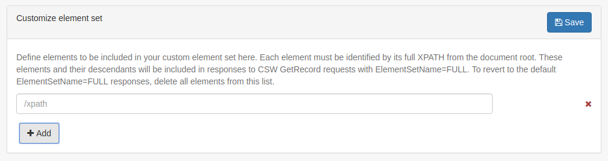
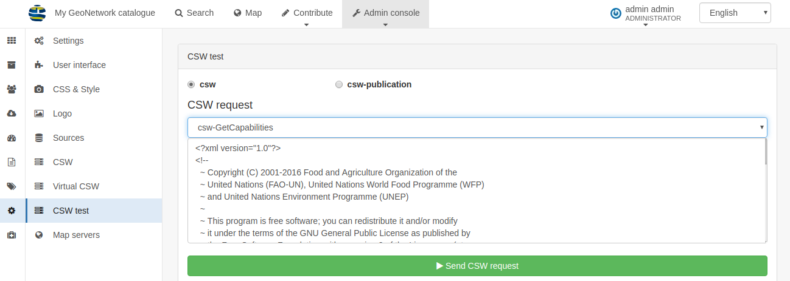
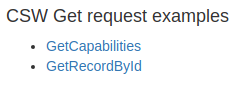

.. _csw:

Catalog Service for the Web (CSW)
#################################

The CSW end point exposes the metadata records in your catalog in XML format using the OGC CSW protocol (version 2.0.2). 

Two protocols are available:

 - CSW: Provides the ability to search and publish metadata for data, services and related information.
 - CSW-T: Provides an interface for creating, modifying and deleting catalog records via the CSW protocol.

Configuration
=============

The CSW Service is configured in ``CSW`` in the ``Settings`` section of the Admin Dashboard.

.. figure:: img/csw-configure.png

Here, the following options can be set:

 - CSW Enabled: Is the CSW service available in the Catalog? If this is un-checked then CSW requests will return an error.
 - Inserted metadata is public: If a record is added via CSW-T should it be automatically published or visible to all users?
 - Create element if it does not exist when using XPath in the CSW transaction: Check this to allow new elements to be added. If left un-checked then only existing elements can be updated.

The ``Contact`` dropdown allows you to set an existing user from the catalog as the contact details for the CSW service. These contact details will be visible in the output from the ``GetCapabilities`` request.

CSW Service Information
-----------------------

The elements in this section are also visible in the output from the ``GetCapabilities`` request and should be completed manually.

Customize element set
---------------------

Additional elements can be added to the output from ``GetRecords`` requests when the parameter ``ElementSetName=FULL`` is set. Click the ``+Add`` button to add a new element, and provide the full Xpath from the document root.

URL
====

The following URL is the standard end point for the catalog (substitute your |project_name| URL):

 - http://localhost:8080/geonetwork/srv/eng/csw?

Generally, the ``VERSION`` and ``SERVICE`` parameter are also added, along with the ``REQUEST`` parameter as detailed below:

 - http://localhost:8080/geonetwork/srv/eng/csw?SERVICE=CSW&VERSION=2.0.2&REQUEST=GetCapabilities

Requests
========

The full set of requests supported by |project_name| can be found in ``CSW test``, in the ``Settings`` section of the Admin Dashboard. 

Select either ``csw`` or ``csw-publication`` (for CSW-T) and then choose a request from the drop-down menu, and edit the ``CSW request`` payload if required (for example to set the ``ID`` in a ``GetRecordById`` request). Click the green ``Send a CSW request`` button to see the response:

Note that some sample request URLs are shown at the bottom of the page. These will open in a new browser tab. Note that you may need to change the value of the ``ID`` parameter if you do not have the sample records installed in your catalog.

