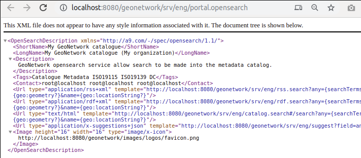

.. _opensearch-and-atom:

OpenSearch and INSPIRE ATOM
###########################

OpenSearch
----------

The catalog provides an opensearch entry point at http://localhost:8080/geonetwork/srv/eng/portal.opensearch. This service is advertised in the HTML.

INSPIRE ATOM
------------

.. note::

    Only records based on the ISO19139 standard can be used with Atom. ISO19115-3 records are not.

A remote ATOM feed can be registered in a metadata record (see :ref:`linking-data-using-atom-feed`_), but the catalog can also create ATOM feeds from records describing datasets and services.

For a service metadata record, the corresponding ATOM feed is accessed at: http://localhost:8080/geonetwork/srv/atom/describe/service?uuid=8b719ebd-646e-4963-b9e0-16b3c2a6d94e. If the service is attached to one or more datasets (see :ref:`linking-dataset-or-service`_), then the feed also expose each dataset as an ``entry`` in the feed. Check that the service type is set to ``download`` (if not, the dataset feed will return an exception).

The dataset feed is accessible at: http://localhost:8080/geonetwork/srv/atom/describe/dataset?spatial_dataset_identifier_code=b795de68-726c-4bdf-a62a-a42686aa5b6f. Links will be created for each online resource flagged with a ``function`` set to ``download``.

Examples:

- http://catalog.inspire.geoportail.lu/geonetwork
