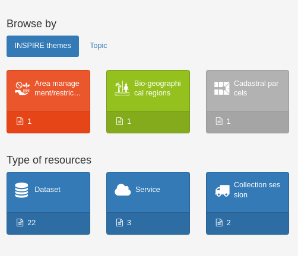
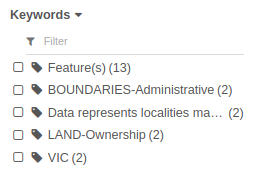
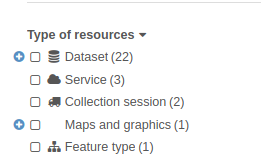
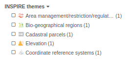
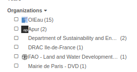
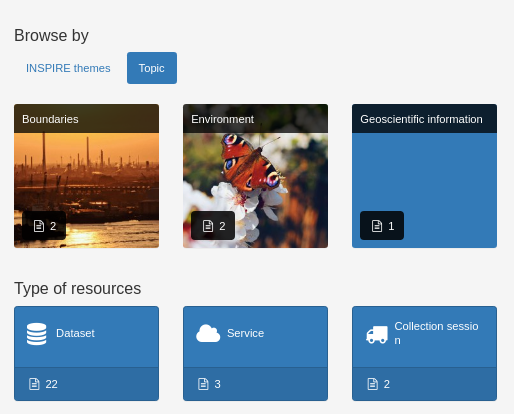
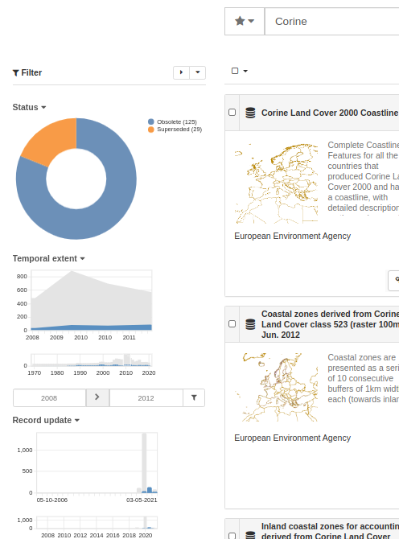

.. _configuring-faceted-search:

Configuring faceted search
###########################

Facets also known as aggregation in Elasticsearch are used to provide simple search entries. |project_name| is using facet in different places:

- Home page categories

.. figure:: img/agg-home.png

- Search results

.. figure:: img/agg-search.png

All facet configurations are stored in the user interface configuration (see :ref:`user-interface-configuration`). The configuration are defined using JSON following Elasticsearch API (See https://www.elastic.co/guide/en/elasticsearch/reference/current/search-aggregations-bucket.html).

By default, the facet configurations are defined as (see :code:`web-ui/src/main/resources/catalog/js/CatController.js`). The home page display on the left side ``th_httpinspireeceuropaeutheme-theme_tree.key`` and ``cl_topic.key`` and on the right side, the last facet defined ``resourceType``.

Term aggregation on a field
---------------------------

.. code-block:: js

  "format": {
    "terms": {
      "field": "format"
    }
  }

This is using `Elasticsearch terms aggregations <https://www.elastic.co/guide/en/elasticsearch/reference/current/search-aggregations-bucket-terms-aggregation.html>`_.

If a search error occurred after adding a new facet, check that it is not the following:

.. code-block::

  Text fields are not optimised for operations that require per-document field data
  like aggregations and sorting, so these operations are disabled by default.
  Please use a keyword field instead.

This means that the field used in the aggregation is indexed as a text field and can't be used in aggregations. In such case, check the index mapping and field definition. For example, a facet on ``crsDetails.code`` will fail with that error and can be fixed using ``crsDetails.code.keyword`` which is an additional field added by Elasticsearch while indexing.

Term aggregation on a codelist
------------------------------

Codelist fields starts with prefix ``cl_``.  Codelist fields are object composed of a key, a default value for the record default language, additional field per languages and an optional link (if using Anchor).

.. code-block:: js

  "cl_maintenanceAndUpdateFrequency": [
      {
          "key": "daily",
          "default": "Journalière",
          "langfre": "Journalière",
          "link": "http://standards.iso.org/iso/19139/resources/gmxCodelists.xml#MD_MaintenanceFrequencyCode"
      }
  ]

For codelist, use ``.default`` for catalogue with no multilingual content and only one language for the UI.

.. code-block:: js

  "cl_maintenanceAndUpdateFrequency.default": {
     "terms": {
       "field": "cl_maintenanceAndUpdateFrequency.default"
     }
   },

Use ``.key`` for codelist for multilingual catalogue. The codelist translation needs to be loaded in the client app. See :code:`web-ui/src/main/resources/catalog/js/GnSearchModule.js`.

.. code-block:: js

  "cl_spatialRepresentationType.key": {
       "terms": {
         "field": "cl_spatialRepresentationType.key"
       }
     },

Term aggregation on a thesaurus
-------------------------------

Thesaurus are indexed in fields starting with ``th_``. Each keywords are defined using multilingual fields (ie. default field + lang...):

.. code-block:: js

    "th_odatis_thematiques": [
      {
        "default": "Dispositifs de surveillance",
        "langfre": "Dispositifs de surveillance"
      }
    ]

When the thesaurus define relations between concept a field ``th_{thesaurusid}_tree`` is also defined:

.. code-block:: js

    "th_httpinspireeceuropaeutheme-theme_tree": {
        "default": [
            "Installations de suivi environnemental"
        ],
        "key": [
            "http://inspire.ec.europa.eu/theme/ef"
        ]
    }

To use thesaurus as aggregation, use the following configuration:

.. code-block:: js

  "th_httpinspireeceuropaeumetadatacodelistPriorityDataset-PriorityDataset_tree.default": {
    "terms": {
      "field": "th_httpinspireeceuropaeumetadatacodelistPriorityDataset-PriorityDataset_tree.default",
      "size": 100,
      "order" : { "_key" : "asc" }
    }
  },
  "th_httpinspireeceuropaeutheme-theme_tree.key": {
    "terms": {
      "field": "th_httpinspireeceuropaeutheme-theme_tree.key",
      "size": 34
    }
  },

Note that using ``size`` and ``order`` properties you can configure the number of values to load in the aggregations and how to order them.

For GEMET thesaurus, if the catalogue is not multilingual, then the default property contains the default language. All records having the same language, there will be no mix of languages.

.. code-block:: js

  "th_gemet_tree.default": {
    "terms": {
      "field": "th_gemet_tree.default",
      "size": 100,
      "order" : { "_key" : "asc" },
      "include": "[^\^]+^?[^\^]+"
      // Limit to 2 levels
    }
  },

Note here that the ``include`` properties is used to filter the values to load.

If records are not all in all the same languages, languages can be mixed together. In this case use the key which will be translated on client side by loading required concepts using the thesaurus API.

.. code-block:: js

  "th_gemet_tree.key": {
    "terms": {
      "field": "th_gemet_tree.key",
      "size": 100,
      "order" : { "_key" : "asc" },
      "include": "[^\^]+^?[^\^]+"
    }
  }

Filters aggregations
--------------------

Aggregation based on queries. One query will define one bucket in the aggregation.

This is using `Elasticsearch filters aggregations <https://www.elastic.co/guide/en/elasticsearch/reference/current/search-aggregations-bucket-filters-aggregation.html>`_.

.. code-block:: js

  "availableInServices": {
    "filters": {
      "filters": {
        "availableInViewService": {
          "query_string": {
            "query": "+linkProtocol:/OGC:WMS.*/"
          }
        },
        "availableInDownloadService": {
          "query_string": {
            "query": "+linkProtocol:/OGC:WFS.*/"
          }
        }
      }
    }
  }

Key like ``availableInViewService`` may not be available in the translations. Use the translation API to add your custom translation in the database (see the Admin console > Settings > Languages).

Filtering aggregation values
----------------------------

To enable filtering in a facet, add an include property:

.. code-block:: js

  "tag.default": {
    "terms": {
      "field": "tag.default",
      "include": ".*",
      "size": 10
    },
    "meta": {
      "caseInsensitiveInclude": true
    }
  }

``include`` and ``exclude`` properties can be used to filter values too. A meta ``caseInsensitiveInclude`` can be added as Elasticsearch facet filter is case sensitive by default.

Example adding only 4 specific values:

.. code-block:: js

  "resourceType": {
      "terms": {
        "field": "resourceType",
        "include": "dataset|series|service|nonGeographicDataset"
      }
    }

See `Elasticsearch terms aggregations filtering <https://www.elastic.co/guide/en/elasticsearch/reference/current/search-aggregations-bucket-terms-aggregation.html#_filtering_values_4>`_ for more details.

Collapse aggregation on load
----------------------------

Aggregations can be collapsed by default and visible to users depending on roles:

.. code-block:: js

   "dateStamp" : {
      "auto_date_histogram" : {
        "field" : "dateStamp",
        "buckets": 50
      },
      "meta": {
        "collapsed": true,
        "userHasRole": "isReviewerOrMore"
      }

- Use ``"collapsed": true`` to collapse the item on load

- Use ``"userHasRole": "isReviewerOrMore"`` to display the aggregation depending on user roles

Hierarchical aggregation based on separator (Experimental)
----------------------------------------------------------

A tree field which contains a URI
eg. http://www.ifremer.fr/thesaurus/sextant/theme#52
but with a translation which contains a hierarchy with a custom separator
``/Regulation and Management/Technical and Management Zonations/Sensitive Zones``

.. code-block:: js

   "th_sextant-theme_tree.key": {
     "terms": {
       "field": "th_sextant-theme_tree.key",
       "size": 100,
       "order" : { "_key" : "asc" }
     },
     "meta": {
       "translateOnLoad": true,
       "treeKeySeparator": "/"
     }
   }

This will build a tree based on the value and the separator.

Nested aggregation
------------------

Aggregation can be nested. eg. ``resourceType`` field is used at first level, ``format`` as second one.

.. code-block:: js

   "facetConfig": {
      "resourceType": {
        "terms": {
          "field": "resourceType"
        },
        "aggs": {
          "format": {
            "terms": {
              "field": "format"
            }
          }
        }
      },

This is using `Elasticsearch nested aggregations <https://www.elastic.co/guide/en/elasticsearch/reference/current/search-aggregations-bucket-nested-aggregation.html>`_.

Histogram aggregation
---------------------

When fields are number, histogram aggregation can be used:

.. code-block:: js

      "resolutionScaleDenominator": {
        "histogram": {
          "field": "resolutionScaleDenominator",
          "interval": 10000,
          "keyed" : true,
          "min_doc_count": 1
        }
      },
      "creationYearForResource": {
        "histogram": {
          "field": "creationYearForResource",
          "interval": 5,
          "keyed" : true,
          "min_doc_count": 1
        }
      },

This is using `Elasticsearch histogram aggregations <https://www.elastic.co/guide/en/elasticsearch/reference/current/search-aggregations-bucket-histogram-aggregation.html>`_.

Translating source or group field
---------------------------------

Some fields are ids in the index eg. for harvesting source or groups.
In such case use ``orderByTranslation`` and ``filterByTranslation`` to not filter on the id but on the translations.

.. code-block:: js

      "sourceCatalogue": {
          "terms": {
            "field": "sourceCatalogue",
            "size": 100,
            "include": ".*"
          },
          "meta": {
            "orderByTranslation": true,
            "filterByTranslation": true,
            "displayFilter": true,
            "collapsed": true
          }
        },

Custom labels and search fields
-------------------------------

When using a generic field like ``tag.default`` and including only a subset of keywords in various aggregations, the aggregation label can be customized. In the example below ``IDP_TOPICS`` and ``IDP_DPSIR``. In this case, add a ``meta.field`` property to indicate which field to search on.

.. code-block:: js

  "IDP_TOPICS": {
    "terms": {
      "field": "tag.default",
      "size": 34,
      "include": "IDP_topics.*"
    },
    "meta": {
      "field": "tag.default"
    }
  },
  "IDP_DPSIR": {
    "terms": {
      "field": "tag.default",
      "size": 34,
      "include": "IDP_DPSIR.*|IDP_dpsir."
    },
    "meta": {
      "field": "tag.default"
    }
  },

.. _configuring-facet-decorator:

Decorate aggregations
---------------------

All aggregations can be decorated by an icon or an image in the home page or in other pages.
The decorator is configured in the ``meta`` properties of the facet:

.. code-block:: js

  "resourceType": {
    "terms": {
      "field": "resourceType",
      "size": 10
    },
    "meta": {
      "decorator": {
        "type": "icon",
        "prefix": "fa fa-2x pull-left gn-icon-"
      }
  }

Decorator types are described below.

Decorate with icons
~~~~~~~~~~~~~~~~~~~

* Fixed icon. eg. adding a tag icon to all values

.. code-block:: js

  "decorator": {
    "type": "icon",
    "prefix": "fa fa-fw fa-tag "
  }

* Icon defined in a CSS class name using the value. eg. used for resource types ``gn-icon-dataset``

.. code-block:: js

  "decorator": {
    "type": "icon",
    "prefix": "fa fa-fw gn-icon-"
  }

Icon defined in a css class name which is using only a portion of the value. eg. used for INSPIRE themes. The expression allows to extract the value

.. code-block:: js

  "decorator": {
    "type": "icon",
    "prefix": "fa fa-fw gn-icon iti-",
    "expression": "http://inspire.ec.europa.eu/theme/(.*)"
  }

* Icon defined with a map of values for the class name to use.

.. code-block:: js

  "decorator": {
    "type": "icon",
    "prefix": "fa fa-fw ",
    "map": {
      "availableInViewService": "fa-globe",
      "availableInDownloadService": "fa-download"
    }
  }

Decorate with images
~~~~~~~~~~~~~~~~~~~~

Define the image to use for each values:

.. code-block:: js

  "decorator": {
    "type": "img",
    "map": {
      "EEA": "https://upload.wikimedia.org/wikipedia/en/thumb/7/79/EEA_agency_logo.svg/220px-EEA_agency_logo.svg.png"
    }
  }

Image decorator in the home page are rendered as background images:

.. _configuring-facet-graphics:

Interactive graphics
--------------------

Use `Vega <https://vega.github.io/vega-lite/examples/>`_ to render date histogram facet values or render term facets to display facet as simple pie. Vega is also used in Kibana so it can make dataviz converging in dashboards and in the app.

Facet widget based on vega allow selection of a range for dates and/or click on bar/pie.

To use Vega based facet, enable mods.search.isVegaEnabled in the user interface configuration. This trigger the load of the Vega library.

A simple date field:

.. code-block:: js

      "dateStamp" : {
        "auto_date_histogram" : {
          "field" : "dateStamp",
          "buckets": 50
        },

A date range field:

.. code-block:: js

      "resourceTemporalDateRange": {
         "gnBuildFilterForRange": {
            "field": "resourceTemporalDateRange",
            "buckets": "2021 - 1970",
            "dateFormat": "YYYY",
            "vegaDateFormat": "%Y",
            "from": "1970",
            "to": "2021",
            "mark": "area"
          },
          "meta": {
            "vega": "timeline"
          }

A term as pie or bar chart:

.. code-block:: js

      "cl_status.key": {
          "terms": {
            "field": "cl_status.key",
            "size": 10
          },
          "meta": {
            //"vega": "bar"
            "vega": "arc"
          }
        },
