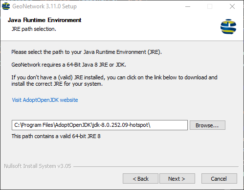
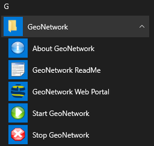
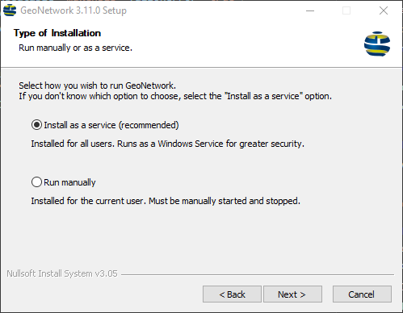
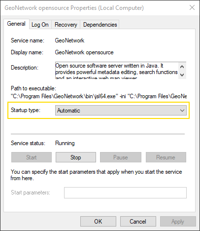

.. _installing-from-the-installer:

Installing using a Setup file (Windows)
#######################################

If you are a Windows user and you want to quickly install GeoNetwork on your machine,
the easiest way to do so is by running the Windows Setup. The installation wizard will guide you
through the setup process.

Please download an installer for the desired GeoNetwork version `here <https://my.geocat.net/download/category/6/GeoNetwork.html>`__
and double-click the GeoNetwork-install-<version>.exe file to start the installation process.

.. note::
    The Windows installer is **not** part of the core GeoNetwork project and is brought to
    you by `GeoCat <https://www.geocat.net/>`__, one of the main contributors to GeoNetwork opensource.
    When you run the installer and Windows asks you if you wish to proceed, always ensure that it says:

    ``Verified publisher: GeoCat BV``

Installation Notes
==================

The installer requires administrative privileges. This is especially necessary if you wish to install
GeoNetwork as a Windows service (after which it can be used by most users).

The installer will guide you through the following steps:

1. Introduction

2. License Agreement (GPL v2)

3. `Java Runtime Environment`_ selection

4. `Install location`_

5. `Start Menu folder`_

6. `Webserver port`_

7. `Installation type`_

8. Summary

9. Installation

Most steps are pretty self-explanatory, but others might require some background information.

Java Runtime Environment
------------------------

After you have clicked through the first steps (introduction and license agreement), you will be asked
to specify the desired Java Runtime Environment (JRE).
GeoNetwork requires a `64-bit <#running-geonetwork-in-32-bit-mode>`_ Java 8 (1.8) Runtime Environment.

The installer will always try and find a suitable JRE (e.g. `AdoptOpenJDK <https://adoptopenjdk.net>`__).
You may have multiple JRE's on your system, so when the installer has detected a less-preferable one first,
you can point it to the preferred JRE location.
If the installer cannot find a JRE 8, the setup process will abort.

Install location
----------------

The Windows installer will setup GeoNetwork as a `64-bit <#running-geonetwork-in-32-bit-mode>`_ application. This means, that GeoNetwork will
be installed in the Windows 64-bit Program Files directory by default.
On most systems, this will be ``C:\Program Files\GeoNetwork``.
However, if required, you can change this directory to some other location, provided that you have write access to that directory.

.. note::
    In the past, there have been problems running GeoNetwork from a directory path that contains spaces.
    This issue should have been resolved. However, if you do experience problems, please `report <https://github.com/geonetwork/core-geonetwork/issues>`_ them.
    As a workaround, you could uninstall GeoNetwork and re-install it using a different install location.

Start Menu folder
-----------------

The installer will create a few shortcuts in the GeoNetwork Start Menu folder.
If needed, you can rename this folder in this installation step.

The following shortcuts will be created:

- **About GeoNetwork**: Opens the official home page in the browser.

- **GeoNetwork ReadMe**: Opens the local ReadMe page in the browser.

- **GeoNetwork Web Portal**: Opens the web application main page in the browser.

- **Start GeoNetwork**: Starts the application.

- **Stop GeoNetwork**: Stops the application.

Webserver port
--------------

The Windows installer will setup GeoNetwork for a Java-based web server called Jetty.
In this installation step, you can choose the port on which the GeoNetwork website will run.
By default, this is port 8080. If needed (e.g. because of IT regulations or a conflicting port), you can change this
to something else, as long as it's within the range 1024-65535 or port 80 (but this one might be taken already).

.. note::
    The installer will **not** detect if the port is already taken. When in doubt, you could open a Windows
    command prompt and type ``netstat -ano`` to get an overview of all ports that are in use.
    If the installer fails to complete successfully, or if GeoNetwork fails to run when you open its Web UI at
    ``http://localhost:<port>/geonetwork``, please uninstall and re-install GeoNetwork.

Installation type
-----------------

GeoNetwork can be run either as a Windows service (default) or manually. If you wish to run GeoNetwork every
time the system starts up, running it as a Windows service is the way to go. However, note that you can also set the
service to start and stop manually, if needed. To achieve this, open the Windows Services dialog (e.g. by typing *Services*
in the Search box on your Windows taskbar) and double-click on the *GeoNetwork opensource* service.
This will open the following dialog, where you can set the *Startup type*:

Note that the actual GeoNetwork process name here is **jsl64.exe**. This is the `Java Service Launcher <http://www.roeschter.de/>`_
that acts as a wrapper so that Windows can start the Java application as a service.

Although running GeoNetwork as a service is recommended, because it makes the application
available to all users on the system in a more secure manner, you can also choose to start and stop it manually.

Whatever installation type you choose, there should always be 2 shortcuts in the GeoNetwork `Start Menu folder`_
that allow you to start and stop the service or application.

Removing GeoNetwork
===================

GeoNetwork ships with an uninstaller that allows you to completely remove the application from your system.
The uninstaller resides in the GeoNetwork application folder and can be run from there, but the easiest and safest way
to run it, is from the *Add or remove programs* or *Apps & Features* dialog in Windows. Find the GeoNetwork entry
and click on the *Uninstall* button to remove the application. The uninstaller will then stop the application (if it's running)
and completely remove it.

Removing the database
---------------------

If your GeoNetwork uses a local H2 database (which is the default if you did not explicitly change this),
the uninstaller will ask you if you wish to remove the database as well. If you plan to (re-)install GeoNetwork
at a later stage, it is recommended to **keep** the database, so you can continue working where you left off.

Running GeoNetwork in 32-bit mode
=================================

By default, GeoNetwork will be installed as a 64-bit application.
If required, you can also run it under a 32-bit Java Runtime Environment.
However, this cannot be achieved using the Windows installer.
In that case, you will have to manually install GeoNetwork using a :ref:`ZIP <installing-from-zip>`
or :ref:`WAR <installing-from-war-file>` file.
