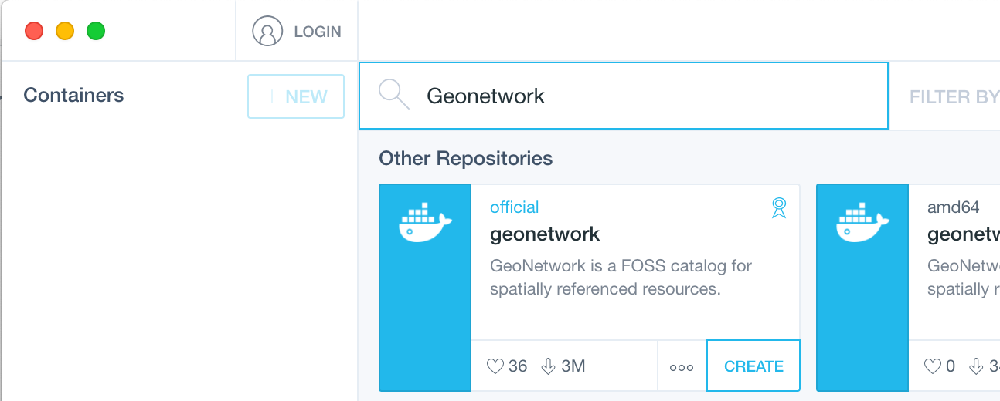

.. _installing-from-docker:

Installing from docker
######################

Overview
--------

Docker is a popular virtualisation technology in the web hosting domain. 
Docker can also be used to try out new software without the need to install various dependencies.
The GeoNetwork community maintains 'Docker images' ready to run in your Docker environment. 
These images are available at 'Docker hub': https://hub.docker.xom/_/geonetwork.
Docker desktop includes a tool called Kitematic, which can be used to download and run docker images from Docker hub.
This article guides you in getting started with GeoNetwork by using Kitematic and Docker.

Before you Start
----------------

Install the latest version of Docker desktop including Kitematic from https://www.docker.com/products/docker-desktop.

Steps to get started with GeoNetwork
------------------------------------

Start the kitematic application. On some operating systems Kitematic will now start a 'Docker VM', in which the docker images will run.

Use the search bar to search in docker hub with a keyword 'GeoNetwork'. Click the 'create' button on the official GeoNetwork card.

Kitematic will download the docker image and start it in the docker environment. This will take a couple of minutes, depending on your internet bandwith.

An instance of an image running in the docker environment is called a 'container'. Take a look at the container properties and verify on which port the container is running.

Click on the ip address to open a browser which will open with the GeoNetwork welcome page. 

.. figure:: img/docker.png

Mind that any data is stored inside the container. If the container is destroyed for any reason, data will be lost. 
The proper approach to work with docker in production systems is to mount a network share in the docker container 
and store critical data in that mounted folder. In production systems also make sure to connect a database such as 
PostGreSQL, Oracle or SQL-server.

Summary
-------

You learned how to get started with GeoNetwork using Docker technology.