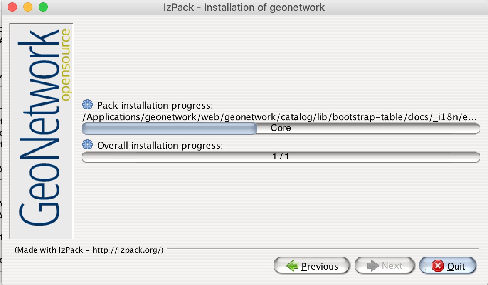

.. _installing-from-the-installer:

Installing from the installer
#############################

Overview
--------

A java installer package is available as one of the options to install GeoNetwork. 
This article introduces the java installer package. Goal is to install GeoNetwork.
GeoNetwork java installer runs on many common operating systems, such as Windows, macOS and Linux.
The installer installs GeoNetwork in a basic setup using en embedded Jetty container.

Before you Start
----------------

- Verify you have enough privileges to download and install software. 
- System requirements: modern processor, 2GB of free memory, 1GB of disk space.
- Verify if available, else install a java runtime environment (Oracle or OpenJDK) version 1.8. 

To verify if java is available type 'java -version' on the command line.

Steps to complete the installation
----------------------------------

- Download the installer from https://sourceforge.net/projects/geonetwork. The package is called geonetwork-install-x.x.x-x.jar (replace x by the relevant version number).
- Double click the installer to start it. Alternatively open command line, navigate to the folder where the package has been downloaded and type 'java -jar geonetwork-install-x.x.x-x.jar'. 
- You can also run the installation with debug output. To do so run the installer with the flag -DTRACE=true: 'java -DTRACE=true -jar geonetwork-install-x.x.x.jar'

- A wizard will start, guiding you through the installation steps

- Choose language and click next on the welcome screen

- Read and accept the GPLv2 license

- Select an installation folder. 

- Select relevant modules and click next

- GeoNetwork will now be installed using the selected configuration

- On windows a shortcut to start the service will be added to the start menu. On other platforms navigate to the installation folder and start the startup.sh script. 

- GeoNetwork initially needs some time to organise and start up. A local H2 database will be created for storage purposes. After 2-5 minutes you will be able to access the service via your browser. Open the website http://localhost:8080/geonetwork.

- The server will not start if port 8080 is taken by another process or the application does not have write privileges on the application folder. Check the logfile located at {installation-folder}/jetty/logs for potential causes.

Summary
-------

You are introduced to the installer package of GeoNetwork. If the steps are successfull, 
you should now be able to access GeoNetwork via your browser. Continue reading to learn how to configure the software.