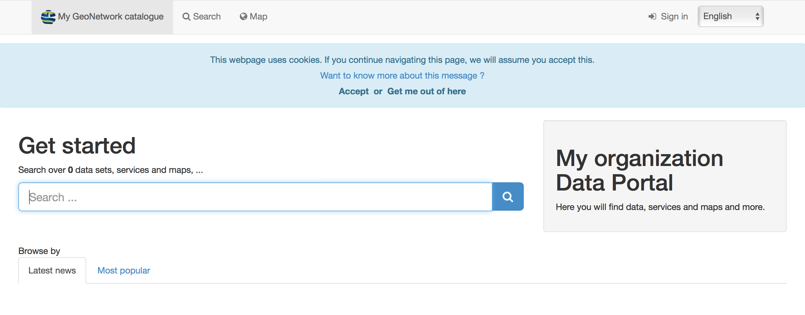
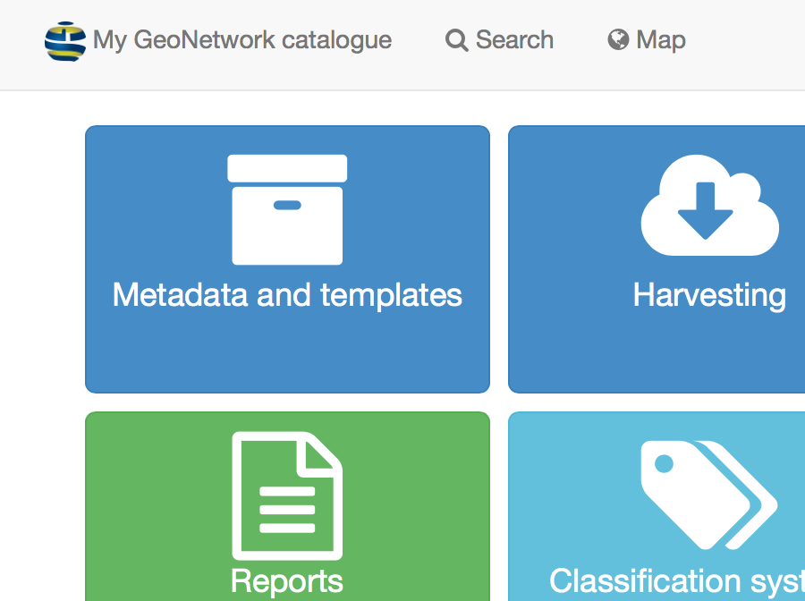

.. _loading-samples:

Loading templates and sample data
#################################

Open a web browser and go to the GeoNetwork homepage. If you installed it on your computer, this is probably at ``http://localhost:8080/geonetwork``. 

Your opening screen should look like this:

Signing in and loading templates
--------------------------------

Click the ``sign in`` to connect as administrator. The default account is
username ``admin`` with password ``admin``.

.. figure:: img/signin.png

Once connected, the top toolbar should provide a link to the ``Admin console``
and your login details.

.. figure:: img/identified-user.png

Go to the ``Admin console`` and click on ``Metadata and templates``:

Choose the metadata standards you wish to use and click ``Load templates for selected standards`` and then ``Load samples for selected standards`` in order to load the example data:

.. figure:: img/templates.png

Once loaded, you will see an Import report on the right side of your screen.

You can now go back to the Search page to see the loaded examples:

.. figure:: img/once-samples-are-loaded.png

