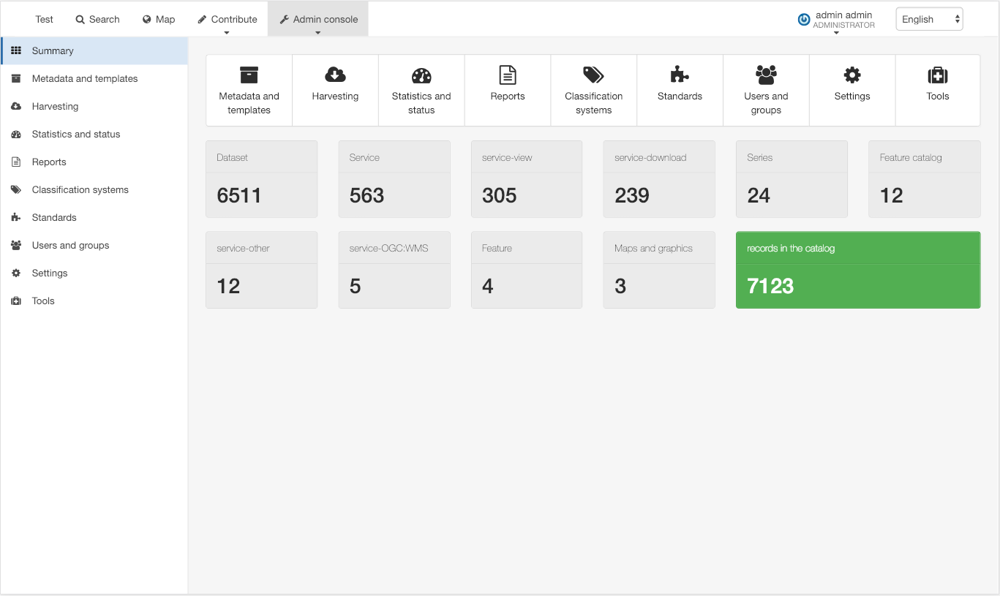
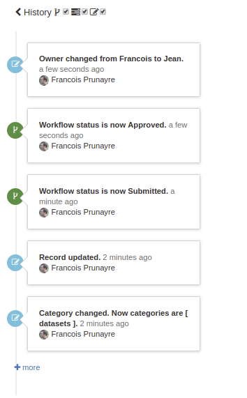

.. _version-360:

Version 3.6.0
#############

New features/fixes
------------------

* `Web accessibility standards and guidelines improvements <https://github.com/geonetwork/core-geonetwork/pulls?q=is%3Apr+is%3Aclosed+Accessibility+milestone%3A3.6.0>`_
* Improved user interface and new design for the recent/popular homepage and admin console

* `Social bar config via settings <https://github.com/geonetwork/core-geonetwork/pull/3180>`_
* `Record history and tasks <https://github.com/geonetwork/core-geonetwork/pull/3209>`_

* Map viewer improvements (eg. projection switcher, better WFS2 support, TMS support, HTTPs redirect support, WPS support, external lviewer support, legend panel)
* `Digital Object Identifier creation <https://github.com/geonetwork/core-geonetwork/pull/3281>`_
* `ISO19139 / DataCite output format <https://github.com/geonetwork/core-geonetwork/pull/3212>`_
* `Editor board / Permalink <https://github.com/geonetwork/core-geonetwork/pull/3197>`_
* `Editor / Inline validation <https://github.com/geonetwork/core-geonetwork/pull/3298>`_
* `Editor / Use thesaurus for any fields <https://github.com/geonetwork/core-geonetwork/pull/3078>`_
* `Thesaurus / Better Registry support <https://github.com/geonetwork/core-geonetwork/pulls?q=is%3Apr+Registry+is%3Aclosed+milestone%3A3.6.0>`_ and `GEMET update to version 4.1.2 <https://github.com/geonetwork/util-gemet/pull/4>`_
* `Standard / Add API to reload configuration <https://github.com/geonetwork/core-geonetwork/pull/3081>`_
* `Formatter / Add support for JSON output <https://github.com/geonetwork/core-geonetwork/pull/3191>`_
* `Harvesting / Add support for WPS2 <https://github.com/geonetwork/core-geonetwork/pull/3257>`_
* `Harvesting / WFS features improvements (eg. asynch indexing for better performances, precision model configuration, CDATA support, Elasticsearch 6.4.x support) <https://github.com/geonetwork/core-geonetwork/pull/3205>`_
* Performance improvements on indexing and JS & LESS compilation
* Better HTTPs support
* Security fixes and library updates

and more ... see `3.6.0 issues <https://github.com/geonetwork/core-geonetwork/issues?q=is%3Aissue+milestone%3A3.6.0+is%3Aclosed>`_ and
`pull requests <https://github.com/geonetwork/core-geonetwork/pulls?q=milestone%3A3.6.0+is%3Aclosed+is%3Apr>`_ for full details.
