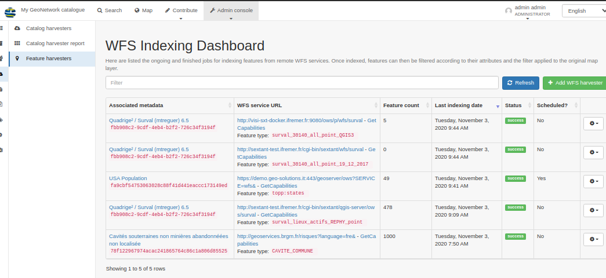

.. _version-401:

Version 4.0.1
#############

GeoNetwork 4.0.1 release is a minor release aligned with GeoNetwork 3.10.5 (see :ref:`version-3105`) with some changes:

* `Search / Facet / Fix more action when collapse state is set <https://github.com/geonetwork/core-geonetwork/pull/5122>`_

* `Search / Suggestion / Apply score <https://github.com/geonetwork/core-geonetwork/pull/5133>`_

* `INSPIRE / Add conformance class 2b for monitoring <https://github.com/geonetwork/core-geonetwork/pull/5117>`_

* `Record view / Fix extent image due to HTTPs change <https://github.com/geonetwork/core-geonetwork/pull/5154>`_

* `Record view / More like this improvement <https://github.com/geonetwork/core-geonetwork/pull/5134>`_

* `DOI / Stored as resource identifier instead of online resource <https://github.com/geonetwork/core-geonetwork/pull/5124>`_

* `Map / Improvements <https://github.com/geonetwork/core-geonetwork/pull/5140>`_

* `WFS feature harvester scheduler and QGIS server support <https://github.com/geonetwork/core-geonetwork/pull/5140>`_

* `Indexing / Fix usage of custom indexing name <https://github.com/geonetwork/core-geonetwork/pull/5151>`_

* `ISO19115-3 / ISO19139 conversion / Fix for multiple individuals in organization <https://github.com/geonetwork/core-geonetwork/pull/5150>`_

* `CSW / Restore possibility to query any index fields <https://github.com/geonetwork/core-geonetwork/pull/5127>`_

and more ... see `4.0.1 issues <https://github.com/geonetwork/core-geonetwork/issues?q=is%3Aissue+milestone%3A4.0.1+is%3Aclosed>`_ and
`pull requests <https://github.com/geonetwork/core-geonetwork/pulls?q=is%3Apr+milestone%3A4.0.1+is%3Aclosed>`_ for full details.
