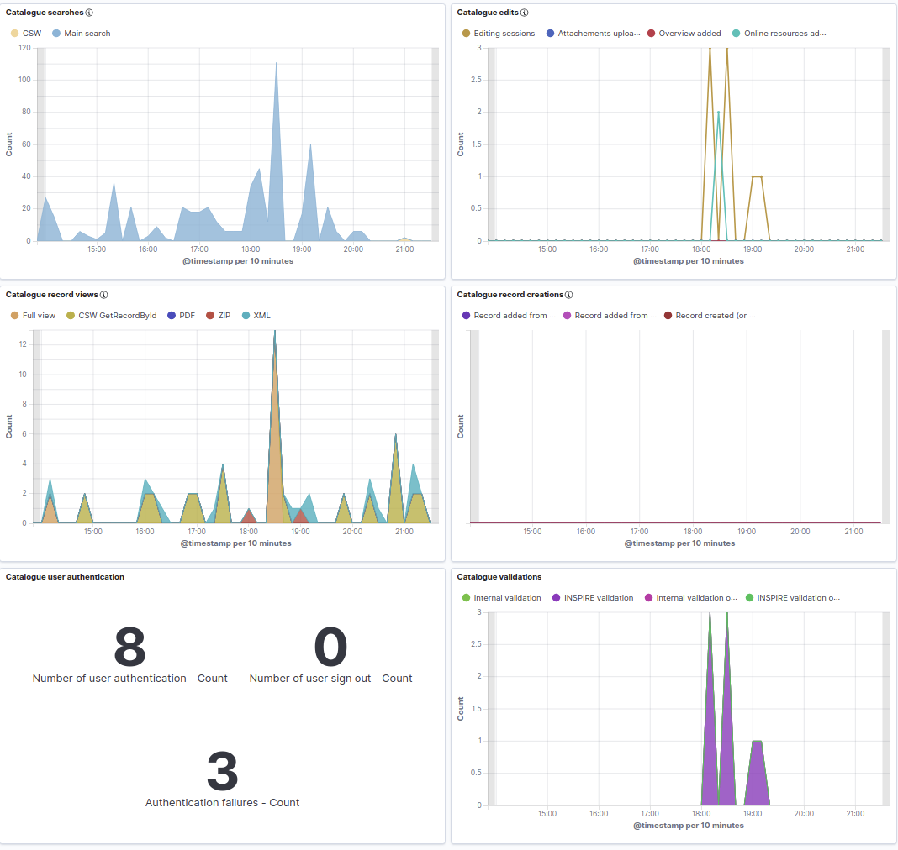

.. _version-403:

Version 4.0.3
#############

GeoNetwork 4.0.3 release is a minor release with some changes:

* Interactive graphics for facets (See :ref:`configuring-facet-graphics`)

* `Map / WPS support improvements <https://github.com/geonetwork/core-geonetwork/pull/5362>`_

* Indexing / `Improvements <https://github.com/geonetwork/core-geonetwork/pull/5425>`_, `better multilingual support <https://github.com/geonetwork/core-geonetwork/pull/5436>`_  and `more robust <https://github.com/geonetwork/core-geonetwork/pull/5398>`_

* `Monitoring your catalogue usage using Kibana <https://github.com/geonetwork/docker-geonetwork/pull/60>`_

* Translation pack builder for faster initialization of the client application.

and more ... see `4.0.3 issues <https://github.com/geonetwork/core-geonetwork/issues?q=is%3Aissue+milestone%3A4.0.3+is%3Aclosed>`_ and
`pull requests <https://github.com/geonetwork/core-geonetwork/pulls?q=is%3Apr+milestone%3A4.0.3+is%3Aclosed>`_ for full details.

Version 4.0.3 is also the version to use if `testing the draft OGC API Records service <https://github.com/geonetwork/geonetwork-microservices/tree/main/modules/services/ogc-api-records>`_.
