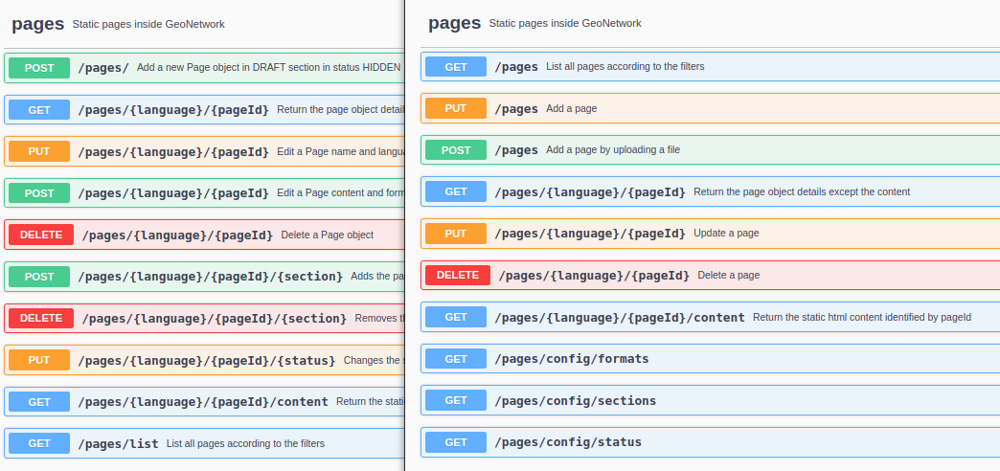

.. _version-424:

Version 4.2.4
#############

GeoNetwork 4.2.4 release is a minor release.

Migration notes
---------------

Database changes
~~~~~~~~~~~~~~~~

* If using the pages API, consider checking the ``spg_page`` database table (`More information <https://github.com/geonetwork/core-geonetwork/pull/7005>`__) during migration.

API changes
~~~~~~~~~~~

* API for link analysis

  * ``POST /links`` is now ``POST /links/analyze`` to analyze all links in a set of records.

  * ``POST /links/analyze`` to ``POST /links/analyzeurl`` to analyze a URL.

  * ``POST /links`` allows now queries with large filter which was not supported using GET (`More information <https://github.com/geonetwork/core-geonetwork/pull/7022>`__).

* API on pages is now more consistent (`More information <https://github.com/geonetwork/core-geonetwork/pull/6788>`__). Use ``GET pages`` to retrieve list of pages (instead of ``GET pages/list``). Use ``PUT`` operation to create a new page or ``POST`` to upload a file for the page. Section and status can now updated when updating the page. A page label can now be defined. Format, sections and status can now be retrieved using the API.

List of changes
---------------

Major changes:

* Security / Library updates: `Spring <https://github.com/geonetwork/core-geonetwork/pull/7023>`_, `SVN kit <https://github.com/geonetwork/core-geonetwork/pull/7017>`_, `GeoTools <https://github.com/geonetwork/core-geonetwork/pull/6925>`_, `Logging bridge <https://github.com/geonetwork/core-geonetwork/pull/6904>`_

* `Languages / Fix loading of ICE, KOR and CZE language code <https://github.com/geonetwork/core-geonetwork/pull/7055>`_ and `Danish added <https://github.com/geonetwork/core-geonetwork/pull/6933>`_

* `Sharing / Configure profile allowed to publish/unpublish records <https://github.com/geonetwork/core-geonetwork/pull/6956>`_

* `Sharing / Improve definition of the Intranet group <https://github.com/geonetwork/core-geonetwork/pull/6894>`_

* `Portal / Check that portal exist and if not redirect to main one <https://github.com/geonetwork/core-geonetwork/pull/7034>`_

* `Map / WMS Time and elevation support <https://github.com/geonetwork/core-geonetwork/pull/6820>`_

* CSW / Transactions: ` Record history of transactions <https://github.com/geonetwork/core-geonetwork/pull/7016>`_ and `consistently apply update fixed info <https://github.com/geonetwork/core-geonetwork/pull/7004>`_

* `Authentication / Easier extension of OpenID mode <https://github.com/geonetwork/core-geonetwork/pull/6965>`_

* `Search / Improve performances for catalogs containing lot of overviews <https://github.com/geonetwork/core-geonetwork/pull/6895>`_

* `CMIS / Performance improvements <https://github.com/geonetwork/core-geonetwork/pull/6893>`_

* `Admin console / Pages manager <https://github.com/geonetwork/core-geonetwork/pull/6788>`_

* `Editor configuration / Add for each support <https://github.com/geonetwork/core-geonetwork/pull/6907>`_

and more ... see `4.2.4 issues <https://github.com/geonetwork/core-geonetwork/issues?q=is%3Aissue+milestone%3A4.2.4+is%3Aclosed>`_ and
`pull requests <https://github.com/geonetwork/core-geonetwork/pulls?page=3&q=is%3Apr+milestone%3A4.2.4+is%3Aclosed>`_ for full details.

