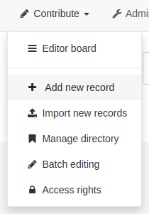
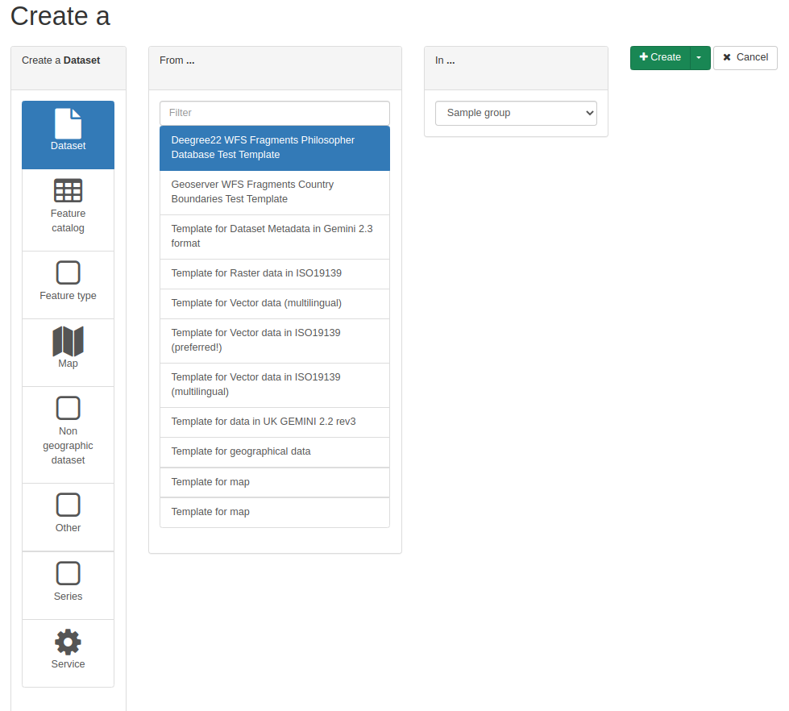

.. _creating-metadata:

Creating a new record
#####################

This section guides you through the process of adding new metadata records with
associated data and/or services into the catalog.

To add or edit metadata, user must have an ``editor`` profile or higher.
That user should be a member of a group you want to add information for.
Contact your administrator if you don't have the correct profile.

From the home page, go to the *contribute* section or directly click on
``add new record`` menu.

Then, start with a metadata
template (see :ref:`creating-templates`), choose a group and click *create*.

Note: If only one group is defined in the catalog, the default group will be
selected.

The next step is to fill out properly the fields provided by default in the
template and probably prepare an image of your data to illustrate it in
the search results.
