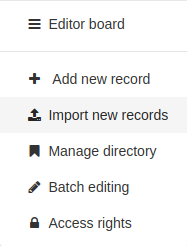

.. _import1:

Importing a new record
======================

An editor can import metadata in the catalog file in different formats: XML, MEF or ZIP (see :ref:`mef_format`).

.. index:: pair: MEF; import
.. index:: pair: XML; import

The user needs to have an ``editor`` profile to access it. After login, go to the
contribute page and select the ``Import new records`` button.

The import new records page allows you to import records in three ways:

* choose ``Upload a file from your computer`` and choose one XML or MEF file to load
* choose ``Copy/Paste`` and copy the XML document in the textarea
* choose ``Import a set of files from a folder on the server`` and set the path of
  the folder in the server

To import multiple file at a time, use the MEF format or the import from server options.

After defining the type of import, configure the other import settings:

.. figure:: img/import-form.png

- ``Type of file``: when uploading or loading file from the server, define the type
  of file to load. It could be XML for importing XML document or MEF (equivalent to ZIP)
  for importing MEF format.

- ``Type of record``:

 - ``Metadata`` should be used when loading a normal metadata record
 - ``Template`` should be used when the loaded metadata record will be used as a template.

- ``Record identifier processing`` determines how to handle potential clashes
  between the UUID of the record loaded and UUIDs of metadata records
  already present in the catalog. 3 strategies are available:

 - ``None``: the UUID of the record loaded is left unchanged. If a metadata
   record with the same UUID is already present in the catalog, an error message
   is returned.

 - ``Overwrite metadata with same UUID``: any existing metadata record in the
   catalog having the same UUID as the loaded record will be updated.

 - ``Generate UUID for inserted metadata``: a new UUID is affected to the loaded record.

- ``Apply XSLT conversion`` allows to transform the record loaded using an
  XSLT stylesheet. A list of predefined transformations is provided. The selected
  transformation should be compatible with the standard of the loaded record (see :ref:`customizing-xslt-conversion`).

- ``Validate`` trigger the validation of the record before loading it. In case of
  error the record is rejected and an error reported.

- ``Assign to current catalog`` assign the current catalog as origin for the record,
  in case the MEF file indicate another source.

- ``Assign to Group`` define the group of the loaded record.

- ``Assign to Category`` define a local category to assign to the loaded record.

Click ``import`` to trigger the import. After processing, a summary is provided with
the following details:

- the total count of imported metadata
- errors messages
- if only one record is imported, a link to that record is provided.
