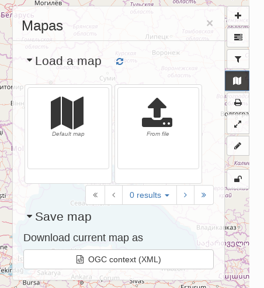

.. _map-viewer-as-user:

Maps and dataset visualisation
==============================

The map component in |project_name| serves two goals:

- The map viewer provides a way for users to interactively assess the relevance of a resource discovered in the catalog.

- |project_name| can be used as a mapping application to create maps that can be printed or shared with others. The maps itself can even be registered in the catalogue as assets.

.. Note::

    Instead of using the embedded map viewer, |project_name| offers functionality to use an external map viewer (for example an existing WebGIS framework in your organisation).
    An administrator can configure |project_name| in such a way that it is connected to an external web map application. In such a configuration all map interaction is delegated
    to the external application. See :ref:`user-interface-config-mappage`.

Map viewer
----------

The map viewer can be opened from a metadata details view using the 'add to map' button or directly from the map tab.
A list of tools are available in the right toolbar. Hover over the tools to display a tooltip explaining their meaning. 
The tools that are available are configured by the administrator, see :ref:`user-interface-config-mappage`.  

Tools for using the Map are arranged in two groups in the right-hand side of the map. The top group looks like this:

- *Add new layers* to the map. You can search the catalog, add layers from web services, or kml. It is possible to add directly WMS, WFS or WMTS layers by entering the endpoint and selecting the layer from the capabilities response.

- *Manage layers* or change the background map.

- The *projection switcher* allows to set alternative projections.

- *Filter layers* on the map. The panel can be used to filter features shown on the map on various attributes. As an administrator make sure the filtering is correctly set up before adding this tool to the map.

- Use a *Web Processing Service* process. You can enter a WPS link and see what processes the service offers.

- *Manage the Map*, by setting it back to default settings, loading a new map definition, downloading the current map, or saving the map configuration as a record in the catalog.

- *Print* the map. A pdf of the current map will be generated, to be downloaded and send to a printer.

- *Synchronise* layers with the small map on the Search tab. Changes on the map are duplicated on the small map and vice versa.

- *Measure distances* and surfaces in the map.

- *Draw annotations* on the map. Annotations can be printed or exported as GeoJSON.

Additionally there is a *geographic search* tool in the top left.

The map viewer supports *Featureinfo*, to retrieve information by clicking on a location in the map. 

.. figure:: img/addLayers.png
    :width: 300px

Store and share maps
--------------------

A map consists of a background layer and a number of thematic overlays. A format to combine layers, projection and bounds (area of interest) has been adopted by OGC as the OWS Context standard. Besides |project_name| there are a number of other applications supporting this standard.

|project_name| uses OWSContext to store, share and load maps:

- Export a context to a local file, to restore the map later or share by email.

- The administrator can introduce a context file as default configuration for the catalog.

- Open a local context file by dragging it on to the map viewer (or open from context menu).

- Register a context as asset in the catalogue, the context itself will be added as attachement.

- Records that have an OWS context file attached will display a button to open the context file.

