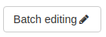
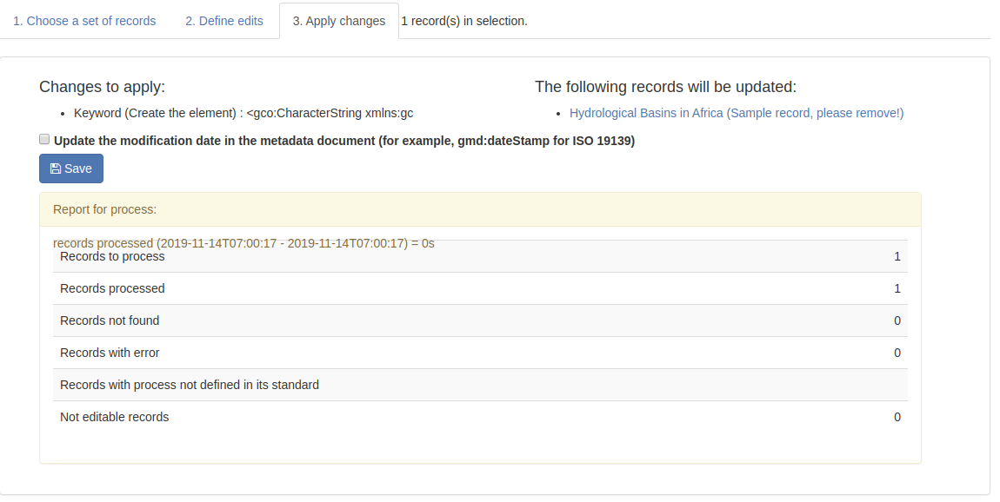

.. _batchediting:

Updating a set of records
#########################

From the editor board, editors can do batch editing.

Batch editing consists of 3 steps:

 - Choose a set of records

 - Define edits

 - Apply changes

Defining edits
--------------

Warning: You can break things here. When defining xpath and using delete or replace mode be sure to test first on a record
before applying changes to a lot of records. If needed, backup your record first.

Changes are defined on a per standard basis. A set of default field to edit is available (and can be extended in the ``config-editor.xml`` file of the standard).

.. figure:: img/batch-editing-iso19139fields.png

An advanced mode is also available to define custom edits. The advanced mode consist of:

* an optional title
* a type of update (gn_add, gn_create, gn_replace, gn_delete)
* a mandatory XPath to point to the element(s) to update. XPath may contain a filter expression.
* a value which could be an XML snippet or a text string if the mode is not delete

.. figure:: img/batch-editing-advancedmode.png

To add an element, eg. add a new keyword section in first position

.. code-block:: json

  [{
    "xpath": "/gmd:identificationInfo/gmd:MD_DataIdentification/gmd:descriptiveKeywords[1]",
    "value": "<gn_add><gmd:descriptiveKeywords xmlns:gmd=\"http://www.isotc211.org/2005/gmd\" xmlns:gco=\"http://www.isotc211.org/2005/gco\"><gmd:MD_Keywords><gmd:keyword><gco:CharacterString>Waste water</gco:CharacterString></gmd:keyword><gmd:type><gmd:MD_KeywordTypeCode codeList=\"./resources/codeList.xml#MD_KeywordTypeCode\" codeListValue=\"theme\"/></gmd:type></gmd:MD_Keywords></gmd:descriptiveKeywords></gn_add>"
    }]

To remove an element, eg. remove all online resource having a protocol ``OGC:WMS``

.. code-block:: json
  [{
    "xpath": ".//gmd:onLine[*/gmd:protocol/*/text() = 'OGC:WMS']",
    "value":"<gn_delete></gn_delete>"
  }]

To replace an element, eg. replacing a keyword value

.. code-block:: json
  [{
    "xpath":".//gmd:keyword/gco:CharacterString[text() = 'wastewater']",
    "value":"<gn_replace>Waste water</gn_replace>"
  }]

.. figure:: img/batch-editing-replace.png

Applying changes
----------------

When applying changes, user privileges applies. It means that if user can not edit a record selected, batch edits will not be applied to that record.

The batch edit report explain how many records were processed:

Batch editing can also be applied using the `API <|demo_url|/doc/api/index.html#/records/batchEdit>`_

