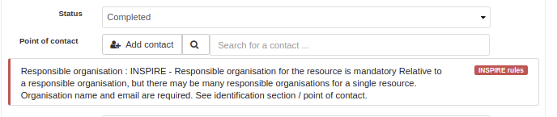

.. _validation:

Validating records
##################

In the metadata editor, click the Validate button to trigger the validation.

The right panel display all validation results by levels:

.. figure:: img/validation.png

Click thumbs up or down icon to display errors. Errors reported in blue are for information only and will not affect the global validation of the record:

.. figure:: img/validation-details.png

The editor reports also report error messages:

Once a record is validated, the validation status is saved and is displayed in the editor board page:

.. figure:: img/validation-status.png

A facet allows to filter on it. Catalogue administrator can force validation every time and editor leave the metadata editor (see :ref:`system-configuration`).

To configure validation levels (see :ref:`configure-validation`).

In case of INSPIRE records, remote validator can also be used (see :ref:`inspire-validation`)
