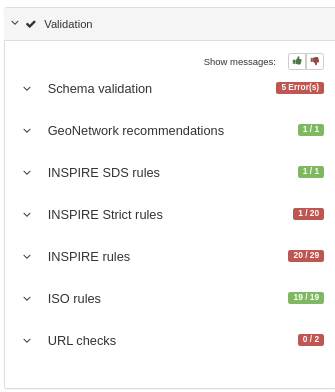

.. _validation:

Validating records
##################

#. In the metadata editor, click Validate to trigger the validation. The right panel displays all validation results by levels:

#. Click the thumbs up or down icons to display errors.  Errors reported in blue are for information only and do not affect the global validation of the record:

   .. figure:: img/validation-details.png

   The editor also reports error messages where applicable (as all error messages cannot be shown in the editor):

   .. figure:: img/validation-inline.png

#. Once a record is validated, the validation status is saved and is displayed in the editor board page:

   .. figure:: img/validation-status.png

You can filter the Validation status using a facet in the editor board.

Configuring validation
----------------------
Catalog administrators can force validation every time an editor exits or closes the metadata editing interface (see :ref:`system-configuration`).
To configure validation levels (see :ref:`configure-validation`).
In case of INSPIRE records, you can use remote validator (see :ref:`inspire-validation`)
