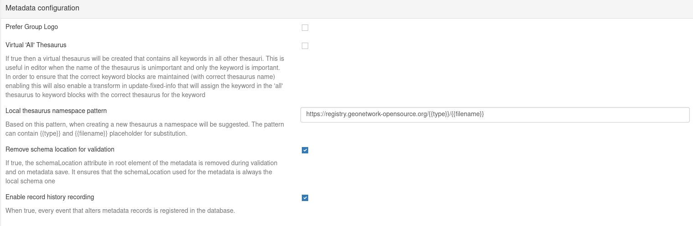
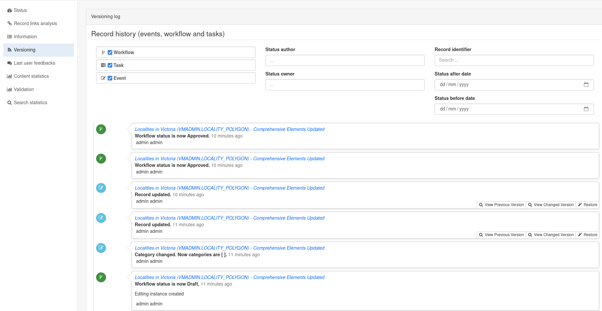
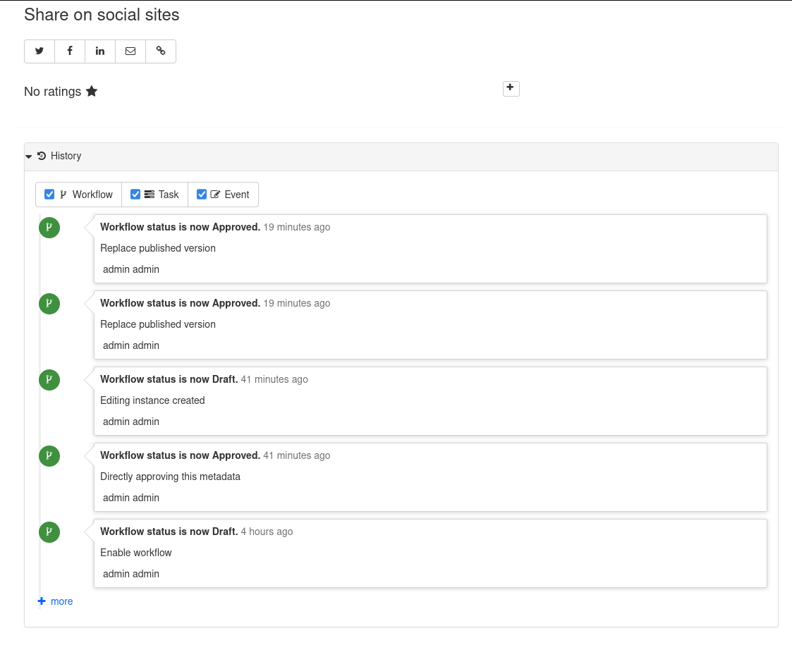

.. _versioning:

Versioning
##########

SVN
---

.. deprecated:: 4.0.0

Versioning using SVN is deprecated in GeoNetwork 4.0.0 and above in favour of recording the workflow history

Record History
--------------

This must be enabled by an administrator in ``Admin Console`` > ``Settings`` > ``Metadata Configuration``:

When activated, every event that alters a metadata record is recorded in the database and visible in ``Admin Console`` > ``Statistics and Status`` > ``Versioning``.

This log can be filtered by:

- **Type of workflow event**: 
    - Event: Such as changing the owner or category of a record, or edits to a record
    - Workflow: Such as changing the status from draft to approved
    - Task: Catalogue-specific actions assigned to users with due dates
- **Status Author**
- **Status Owner**
- **Record identifier**
- **Status Change Date**:
    - Before
    - After

For changes of type **Event** it is possible to:

- View the previous version of a record
- View the changed version of a record
- Restore the version of the record at the time of that workflow event

When record history is enabled, the history for an individual record can also be viewed by logged in users at the base of the record when viewed in default display mode:

In this view it is not possible to see previous versions of the record.

